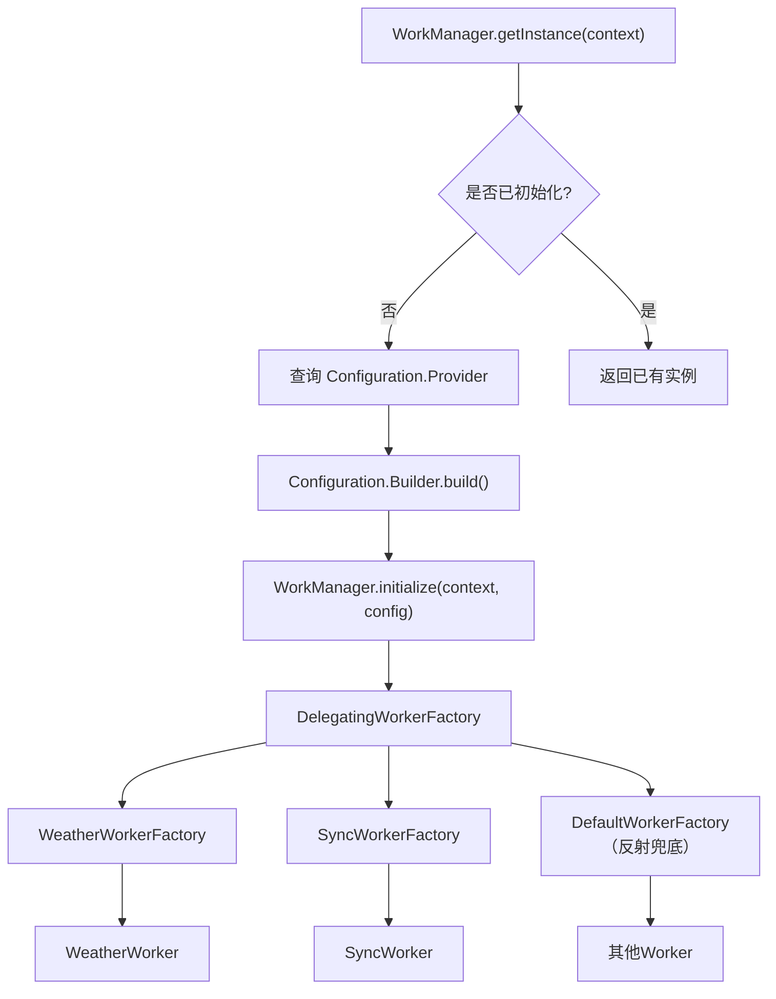
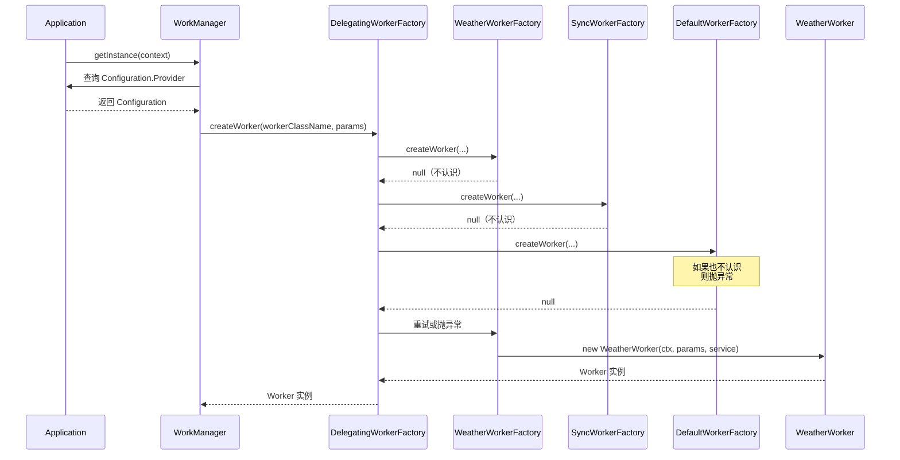

# 6.1.22 自定义 WorkManager 配置和初始化

帐篷外的山风不知什么时候变得温柔了。

洛芙揉着眼睛从睡袋里钻出来的时候，第一缕晨光正从帐篷的缝隙里挤进来，在防水布上画出一道淡金色的细线。她迷迷糊糊地往旁边一看——希尔还蜷在睡袋里，抱着笔记本睡得正香，嘴角挂着一丝可疑的微笑，大概是梦到了什么好吃的。

"她什么时候睡着的……"

洛芙小声嘟囔了一句，伸手想去把笔记本从希尔怀里抽出来，结果手刚碰到键盘，屏幕就亮了。

「电量：12%」

"等等等等！"洛芙一下子清醒了，"希尔！你的电脑快没电了！"

希尔打了个激灵，迷迷糊糊地睁开眼："嗯……什么……"

"充电宝呢？"

"在、在外套口袋里……"希尔打了个哈欠，揉着眼睛坐起来，"几点了？"

"不知道，应该快天亮了吧。"

帐篷外面传来窸窸窣窣的声音，接着是伊莎轻轻掀开帐帘探进半个脑袋。她的头发上还沾着草屑，脸颊被清晨的山风吹得有些发红。

"你们醒啦？"伊莎的声音带着笑意，"我刚才去外面看过了，云都散了，今天应该是个大晴天。"

"那我们可以去山顶看日出吗？"洛芙的眼睛一下子亮了起来。

"先别急。"伊莎钻进帐篷，在黛琳旁边坐下，"黛琳说今天要给你们讲点有意思的东西，关于怎么让后台任务乘以倍数——她说这叫'配置'。"

"配置？"洛芙歪了歪脑袋，"就像……调配帐篷的绳子？让它们各自干不同的事？"

"差不多是那个意思。"黛琳不知什么时候已经醒了，正在整理自己的白板笔，"不过在 Android 里，我们管这个叫 WorkManager 的自定义配置。"

"昨晚不是刚讲完 WorkManager 吗？"希尔揉着眼睛抱怨，"我还没睡够呢……"

"昨晚讲的是怎么用 WorkManager 安排任务，"黛琳把白板翻开，新的一页还是空白的，"今天要讲的是怎么自己定制这个'任务管理器'的运行规则。比如——你想让它工作的时候打更多日志方便调试，或者你想给它配一个专门处理某类任务的工厂，这些都是'自定义配置'要解决的问题。"

帐篷外面传来一阵清脆的鸟鸣，洛芙忍不住往帐帘外看了一眼。晨雾正在山谷里慢慢消散，露出底下碧绿的草地和远处若隐若现的山路。

"那这个配置……是在哪里配置的？"洛芙问。

黛琳在白板上写下第一行字：「Configuration」。

"你用过手机设置吧？"她头也不抬地说，"出厂有默认设置，但你想调屏幕亮度、换壁纸，就去设置里自己改。WorkManager 也一样——它自带一套默认配置，适合大部分 App，但如果你有特殊需求，就需要自己定制了。"

"比如说？"希尔总算彻底清醒了，凑过来看白板。

"比如你想在调试的时候看到更多日志，或者你不想让 WorkManager 跟 App 自己的其他后台任务抢相同的 JobId，再或者——"

黛琳顿了顿，看向希尔。

"你想给 Worker 传一些自定义参数，比如网络服务实例、数据库实例之类的。"

"啊！"希尔一下子来了精神，"这个我遇到过！我之前写过一个 Worker，需要联网获取数据，我就直接在 Worker 里面 new 了一个 Retrofit 实例，结果代码review的时候被前辈说了一顿……"

"为什么？"洛芙问。

"因为每次 Worker 执行的时候都会 new 一个新的网络客户端，很浪费资源。更好的做法是在 Application 层创建一次，然后通过构造函数传给 Worker。但问题是默认的 WorkerFactory 只能传 Context 和 WorkerParameters 两样东西，你要传别的，就得自己定制。"

黛琳点点头，在白板上又画了一个方框。

```
┌─────────────────────────────────────────────┐
│           WorkManager 默认行为               │
├─────────────────────────────────────────────┤
│  • 默认使用 ContentProvider 初始化           │
│  • 自动在后台创建 WorkManager 实例           │
│  • WorkerFactory 用反射创建 Worker           │
│  • Worker 只能收到 Context + WorkerParams   │
└─────────────────────────────────────────────┘
```

"这就是默认配置的四大特点。"黛琳用笔尖点了点方框里的每一行，"第一，默认用 ContentProvider 在 App 启动时自动初始化——这个我们之前提过。第二，自动创建实例，你不用管。第三，用反射机制去找 Worker 类。第四，Worker 能接收的参数只有两样东西：Context 和 WorkerParameters。"

"反射……"洛芙皱起眉头，"就是那种运行时才知道要创建哪个类的机制？"

"对。"黛琳点头，"好处是你写代码的时候不用操心实例化的事，坏处是——如果你给 Worker 写了自定义构造函数，运行时就会报错。"

"报错？什么报错？"

"NoSuchMethodException。"希尔在旁边补充，"我之前踩过这个坑。Worker 只能有无参构造函数，或者只接受 (Context, WorkerParameters) 的构造函数。你要是写了其他构造函数，比如 (Context, WorkerParameters, Retrofit)，WorkManager 就找不到合适的初始化方法，直接崩溃给你看。"

洛芙打了个寒颤："那怎么解决？"

"两个办法。"黛琳竖起两根手指，"第一，老办法——自己初始化 WorkManager。第二，新办法——实现 Configuration.Provider 接口，用'按需初始化'。"

她把两根手指分别弯下去，变成两根弯钩。

"先说老办法。"

```
┌──────────────────────────────────────────────┐
│     移除默认初始化器（AndroidManifest.xml）   │
├──────────────────────────────────────────────┤
│                                              │
│  <provider                                   │
│      android:name="androidx.startup"          │
│      android:authorities="${applicationId}"  │
│      android:exported="false"                │
│      tools:node="remove">                    │
│      <!-- 移除 WorkManagerInitializer -->     │
│  </provider>                                 │
│                                              │
└──────────────────────────────────────────────┘
```

"这是第一步。"黛琳指着白板上的代码，"默认情况下，WorkManager 会通过 App Startup 库自动初始化。如果你不想用默认配置，就得先把自动初始化关掉。"

"怎么关？"洛芙问。

"在 AndroidManifest.xml 里，用 `tools:node="remove"` 把 WorkManagerInitializer 从合并的 provider 列表里移除。"黛琳解释道，"就像拔掉电源一样——关掉自动初始化之后，你就可以完全控制 WorkManager 的创建过程了。"

"然后呢？"

"然后在 Application 的 onCreate 里，手动调用 WorkManager.initialize()。"

黛琳在白板上写下第二段代码：

```kotlin
// 第一步：禁用默认初始化器（在 AndroidManifest.xml 中通过 tools:node="remove" 实现）

// 第二步：在 Application.onCreate 中手动初始化
class MyApplication : Application() {
    override fun onCreate() {
        super.onCreate()
        
        val config = Configuration.Builder()
            .setMinimumLoggingLevel(Log.DEBUG)  // 设置日志级别，方便调试
            .build()
        
        WorkManager.initialize(this, config)
    }
}
```

"这是最基础的自定义配置。"黛琳说，"我只改了一件事——把日志级别从默认的 ERROR 改成了 DEBUG。这样 WorkManager 运行的时候，会输出更多调试信息，方便我们排查问题。"

"日志级别……"洛芙若有所思，"就像帐篷里的灯？DEBUG 是最亮的灯，ERROR 只剩一点点微光？"

"差不多。"黛琳笑了笑，"在生产环境我们用 ERROR 或者 WARN，只打印重要警告。但调试的时候用 DEBUG，能看到 WorkManager 内部的每一步操作——什么时候创建了 Worker、什么时候开始执行、结果怎么样。"

希尔把笔记本放到膝盖上，手指在键盘上飞快地敲着："等等，我有个问题。你这个配置是在 onCreate 里写的对吧？那如果我在配置里创建了一些对象，比如那个 Retrofit 实例——这些对象的生命周期怎么管理？"

"问得好。"黛琳在白板上又画了一个方框，"这就是为什么我们通常把配置逻辑放在 Application 层——Application 是单例的，整个 App 生命周期内只创建一次。所以在 Application.onCreate 里初始化的对象，会跟 App 同生共死。"

```
┌─────────────────────────────────────────────────────────┐
│              WorkManager 初始化时序图                    │
├─────────────────────────────────────────────────────────┤
│                                                         │
│  App启动                                                 │
│    │                                                   │
│    ▼                                                   │
│  Application.onCreate()                                 │
│    │                                                   │
│    ▼                                                   │
│  创建 Configuration.Builder()                           │
│    │                                                   │
│    ├── setMinimumLoggingLevel() ← 可选：调日志级别      │
│    ├── setWorkerFactory()      ← 可选：自定义工厂      │
│    └── build()                 → 返回 Configuration    │
│    │                                                   │
│    ▼                                                   │
│  WorkManager.initialize(context, config)                │
│    │                                                   │
│    ▼                                                   │
│  后续 WorkManager.getInstance(context) 获取单例         │
│                                                         │
└─────────────────────────────────────────────────────────┘
```

"但这样还不够。"黛琳放下笔，"如果你想给 Worker 传自定义参数，比如 Retrofit 实例、光学字符识别服务、或者数据库实例，就不能用这种简单的配置方式了——你需要一个自定义的 WorkerFactory。"

"工厂！"洛芙的眼睛亮了，"就是那种生产东西的工厂？"

"对。"黛琳点头，"默认的 WorkerFactory 像个全自动流水线，只能用固定的模具生产 Worker。如果你想要定制化的 Worker——比如需要在构造函数里传入网络服务——就得自己建一个工厂。"

她转向希尔："希尔，你之前那个 Worker 的代码还在吗？"

"在在在！"希尔赶紧把笔记本转过来，屏幕上是一段粗糙的代码：

```kotlin
// 错误示例：直接在 Worker 里创建 Retrofit（不推荐）
class WeatherWorker(context: Context, params: WorkerParameters)
    : CoroutineWorker(context, params) {

    private val retrofit = Retrofit.Builder()
        .baseUrl("https://api.weather.com/")
        .build()
    
    override suspend fun doWork(): Result {
        // 获取天气数据
        val response = retrofit.create(WeatherService::class.java)
            .getWeather()
        return if (response.isSuccessful) Result.success()
               else Result.retry()
    }
}
```

"你看这里——"黛琳指着 `private val retrofit = Retrofit.Builder()` 这一行，"每次创建 WeatherWorker 实例的时候，都会 new 一个新的 Retrofit 实例。如果 Worker 因为失败重试了好几次，就会创建好几个 Retrofit，白白浪费内存。"

"而且测试的时候也很麻烦。"希尔补充道，"你没法 mock 网络服务，因为 Retrofit 是硬编码在 Worker 里面的。"

"那应该怎么写？"洛芙问。

黛琳接过希尔手里的笔记本，在空白处写下新的代码：

```kotlin
// 正确的做法：通过构造函数注入依赖
class WeatherWorker(
    context: Context,
    params: WorkerParameters,
    private val weatherService: WeatherService  // 注入网络服务
) : CoroutineWorker(context, params) {

    override suspend fun doWork(): Result {
        val response = weatherService.getWeather()
        return if (response.isSuccessful) Result.success()
               else Result.retry()
    }
}
```

"看——WeatherWorker 的构造函数现在接受三个参数了。第三个参数是 WeatherService 接口，不是具体实现。这样做的好处是：测试的时候可以传入一个 mock 的服务，生产的时候传入真正的 Retrofit 实例。"

"但是……"洛芙挠了挠头，"你刚才说 WorkerFactory 只能用 (Context, WorkerParameters) 初始化，这个构造函数有三个参数，它怎么知道要传什么？"

"这就是自定义 WorkerFactory 的作用了。"黛琳重新拿起白板笔，"默认的 WorkerFactory 只能处理标准构造函数。想要处理自定义构造函数，就得自己写工厂。"

```kotlin
// 第一步：创建自定义 WorkerFactory
class WeatherWorkerFactory(
    private val weatherService: WeatherService  // 在工厂里持有服务实例
) : WorkerFactory() {
    
    override fun createWorker(
        appContext: Context,
        workerClassName: String,
        workerParameters: WorkerParameters
    ): ListenableWorker? {
        
        // 只处理我们关心的 Worker 类
        return when (workerClassName) {
            WeatherWorker::class.java.name -> {
                // 创建 Worker 实例，注入自定义参数
                WeatherWorker(appContext, workerParameters, weatherService)
            }
            else -> {
                // 不认识的类，返回 null 交给默认工厂处理
                null
            }
        }
    }
}
```

"这段代码看起来有点长，但其实逻辑很简单。"黛琳放下笔，"第一步，工厂类持有 weatherService 实例。第二步，createWorker() 被调用时，检查一下要创建的是不是 WeatherWorker——如果是，就 new 一个出来，把 weatherService 传进去；如果不是，就返回 null，让别的工厂或者默认工厂去处理。"

"等等——"洛芙举起手，"你说'别的工厂'是什么意思？"

"问得好。这就是下一个知识点：DelegatingWorkerFactory。"

```
┌──────────────────────────────────────────────────────────────┐
│              DelegatingWorkerFactory 工作原理                │
├──────────────────────────────────────────────────────────────┤
│                                                              │
│  WorkManager                                                 │
│      │                                                       │
│      ▼                                                       │
│  DelegatingWorkerFactory  ← 委托分发中心                      │
│      │                                                       │
│      ├──▶ WeatherWorkerFactory  → 处理 WeatherWorker        │
│      ├──▶ SyncWorkerFactory     → 处理 SyncWorker           │
│      └──▶ DefaultWorkerFactory  → 处理其他 Worker（反射）    │
│                                                              │
│  流程：                                                       │
│  1. 收到创建 Worker 请求                                      │
│  2. 遍历已注册的工厂列表                                       │
│  3. 第一个返回非 null结果的工厂获胜                            │
│  4. 都没处理 → 使用默认反射工厂兜底                           │
│                                                              │
└──────────────────────────────────────────────────────────────┘
```

"在实际项目里，你可能有多个 Worker，每个 Worker 需要的依赖都不一样。"黛琳解释道，"比如 WeatherWorker 需要网络服务，SyncWorker 需要数据库，ImageWorker 需要图片加载库。如果每个都写一个专门的工厂，然后让 WorkManager 只认其中一个，那其他 Worker 就没人管了。"

"所以需要一个'大管家'？"洛芙说。

"对，这个大管家就是 DelegatingWorkerFactory。它像是一个路由器，收到请求之后依次问每个子工厂：'这个 Worker 你能处理吗？'谁第一个说'能'，就交给谁处理。如果所有人都说'不能'，就 fallback 到默认的反射工厂。"

希尔已经完全清醒了，在自己的笔记本上噼里啪啦地敲着代码："我懂了我懂了！这样写对吧？"

```kotlin
class MyApplication : Application() {
    
    lateinit var weatherService: WeatherService
        private set
    
    lateinit var database: AppDatabase
        private set
    
    override fun onCreate() {
        super.onCreate()
        
        // 初始化依赖（真实项目里可能用 Dagger/Hilt 注入）
        val okHttpClient = OkHttpClient.Builder().build()
        weatherService = Retrofit.Builder()
            .baseUrl("https://api.weather.com/")
            .client(okHttpClient)
            .build()
            .create(WeatherService::class.java)
        
        database = Room.databaseBuilder(
            applicationContext,
            AppDatabase::class.java,
            "app_database"
        ).build()
        
        // 配置 WorkManager
        val config = Configuration.Builder()
            .setMinimumLoggingLevel(Log.DEBUG)
            .setWorkerFactory(
                DelegatingWorkerFactory()
                    .apply {
                        addFactory(WeatherWorkerFactory(weatherService))
                        addFactory(SyncWorkerFactory(database)))
                    }
            )
            .build()
        
        WorkManager.initialize(this, config)
    }
}
```

"完美。"黛琳看了一眼希尔的代码，点点头，"这样你就有了一个完整的自定义配置：日志级别设为 DEBUG，同时注册了两个自定义工厂，分别处理需要网络服务和数据库的 Worker。"

"那 DelegatingWorkerFactory 怎么知道该用哪个工厂？"洛芙问。

"按顺序问。"黛琳说，"在你调用 addFactory() 的顺序里依次问——WeatherWorkerFactory 能处理这个类吗？返回 null，问下一个。SyncWorkerFactory 能处理吗？能，创建成功。如果都不能，就用默认的反射工厂。"

帐篷外传来一阵脚步声，接着是帐篷门被掀开的声音。一阵冷冽的山风涌进来，带着松针和露水的清香。

"哇——"洛芙忍不住轻声赞叹。

晨光已经完全照亮了山谷。远处的白马岳在晨曦中呈现出淡淡的金色，山顶的雪在阳光下闪闪发亮。山腰的树叶已经染上了深深浅浅的红和黄，像是一幅油画。

"太阳出来了！"伊莎站在帐篷门口，脸上被朝阳染成了温暖的橙色，"你们学完了吗？可以去看日出了哦。"

"马上马上！"洛芙赶紧穿好外套，"最后一点内容！"

她转向黛琳："那……按需初始化是什么？听起来很厉害的样子。"

"按需初始化是 WorkManager 2.1 引入的新方式。"黛琳把白板翻到新的一面，"之前的方式是：在 Application.onCreate 里初始化 WorkManager，这样 App 一启动 WorkManager 就被创建出来了，不管你用不用。"

"就像一顶帐篷，进去之前就支好了？"

"对。但有时候你可能不需要 WorkManager——比如 App 只是看看新闻、刷刷帖子，根本没有后台任务要跑。那每次启动都初始化 WorkManager 就有点浪费了。"

"按需初始化的思路是：不要在 onCreate 里初始化，而是在第一次调用 WorkManager.getInstance() 的时候再初始化。"

```kotlin
// 方式二：按需初始化（WorkManager 2.1+）
class MyApplication : Application(), Configuration.Provider {
    
    override val workManagerConfiguration: Configuration
        get() = Configuration.Builder()
            .setMinimumLoggingLevel(Log.DEBUG)
            .build()
    
    // 不需要重写 onCreate 了！
    // WorkManager 会在首次调用 getInstance() 时自动使用这里配置的 Configuration
}
```

"等等——"洛芙瞪大眼睛，"这样就完了？不需要手动调用 initialize()？"

"对。这就是 Configuration.Provider 接口的魔力。"黛琳在白板上画了一条时间线：

```
┌─────────────────────────────────────────────────────────────┐
│              两种初始化方式对比                               │
├─────────────────────────────────────────────────────────────┤
│                                                             │
│  【手动初始化（老方式）】                                      │
│                                                             │
│  App启动 → Application.onCreate()                            │
│               │                                             │
│               ▼                                             │
│          立即初始化WorkManager                                │
│               │                                             │
│               ▼                                             │
│          任何地方调用WorkManager.getInstance()都能拿到        │
│                                                             │
│  ─────────────────────────────────────────────────────────  │
│                                                             │
│  【按需初始化（新方式，WorkManager 2.1+）】                    │
│                                                             │
│  App启动 → Application.onCreate()                            │
│               │                                             │
│               ▼                                             │
│          不初始化！WorkManager不存在！                        │
│               │                                             │
│               ▼                                             │
│          某处代码首次调用WorkManager.getInstance()            │
│               │                                             │
│               ▼                                             │
│          系统调用 Configuration.Provider.workManagerConfig   │
│               │                                             │
│               ▼                                             │
│          用返回的Configuration初始化WorkManager               │
│                                                             │
└─────────────────────────────────────────────────────────────┘
```

"按需初始化的好处是：如果你的 App 根本用不到 WorkManager，它就永远不会被创建。"黛琳说，"只有当某段代码第一次调用 getInstance() 的时候，才会触发初始化流程。"

"那如果我在 Application 里既实现了 Configuration.Provider，又手动调用了 initialize() 呢？"希尔举手问。

"会崩溃。"黛琳简洁地说，"WorkManager 不允许重复初始化。你要是两种方式都用，第二次调用的时候会抛出一个 IllegalStateException。"

"哦——"希尔赶紧在笔记本上记下来，"不能同时用。"

"还有一点要注意。"黛琳补充道，"如果你用的是按需初始化，那你不能在其他地方手动调用 WorkManager.initialize()。初始化全部由系统处理，你只需要提供 Configuration.Provider 的实现就行。"

"那 JobId 呢？"洛芙突然想起来，"你一开始说可以自定义 JobId 范围，那个是用来干什么的？"

"啊，对，差点忘了讲这个。"

```
┌──────────────────────────────────────────────────────────────┐
│              JobId 范围冲突问题                               │
├──────────────────────────────────────────────────────────────┤
│                                                              │
│  问题：                                                       │
│  WorkManager 内部用 JobScheduler 实现部分功能                 │
│  如果你的 App 同时直接使用 JobScheduler API                   │
│  两者可能抢用同一个 JobId                                    │
│                                                              │
│  解决：                                                       │
│  自定义 JobId 范围，让两者用不同的区间                        │
│                                                              │
│  示例：                                                       │
│  Configuration.Builder()                                     │
│      .setJobSchedulerJobIdRange(1000, 2000)  // WorkManager用│
│      // 你的 JobScheduler 用其他范围，比如 0-999              │
│                                                              │
└──────────────────────────────────────────────────────────────┘
```

"现代 App 很少直接用 JobScheduler 了，"黛琳解释道，"但如果你维护的是一个老项目，或者有特殊需求可能会用到，就可以用这个方法避免 ID 冲突。WorkManager 2.4 之后还有 Lint 检查，会在你同时用两者但没设范围的时候报警告。"

帐篷外传来一阵悠长的鸟鸣——是一只山雀在树枝上唱歌，声音清脆得像露水滴落在石板上。

"好啦！"伊莎又掀开帐帘，"太阳完全升起来了，再不去看就只剩大白天了！"

"来了来了！"洛芙赶紧套上外套，一边拉拉链一边问黛琳，"最后一个问题——自定义配置可以用在库里面吗？如果我写了一个 SDK，SDK 里面要用 WorkManager，但 App 那边也用了 WorkManager，会不会冲突？"

黛琳露出赞许的笑容："这个问题问得很好。如果你是一个库开发者，确实需要考虑这个问题。答案是：可以，但需要做一些额外处理——库应该提供默认配置，但允许 App 层覆盖。具体做法是：库提供一个 InitializationProvider，App 层通过 App Startup 的合并规则覆盖它。这个内容比较深入，今天先不展开。"

"意思是……以后会讲？"

"以后会讲。"黛琳把白板笔盖上收好，"现在先去看日出。"

希尔已经把笔记本塞进了背包，伊莎在外面催促着。洛芙最后一个钻出帐篷，清晨的山风扑面而来，带着草叶上的露水气息。

远处的白马岳在朝阳下呈现出一种柔和的金粉色，山顶的积雪被照得亮晶晶的，像是谁在山尖上撒了一把碎钻。

"好漂亮……"洛芙忍不住深呼吸了一口清晨的空气。

"走吧，"黛琳站在她身旁，声音轻轻的，"今天还有很多路要走。"

四个人沿着山路往上走，洛芙走在最后面，脑子里还在转着那些概念：默认初始化、按需初始化、自定义 WorkerFactory、DelegatingWorkerFactory、JobId 范围……

她把昨晚学的 WorkRequest、Constraints 和今天学的 Configuration 串在一起，忽然有一种通透的感觉。

"原来是这样……"她自言自语道，"WorkRequest 是'我要做什么任务'，Constraints 是'什么时候可以做'，Configuration 是'谁来管理这些任务'——三个东西配合起来，才是一套完整的后台任务系统。"

晨光越来越亮了。

---

## 专业技术总结

> WorkManager 是 Google 推荐的 Android 后台任务解决方案，默认通过 ContentProvider 自动初始化。默认配置适合大部分场景，但遇到以下情况时需要自定义：调试时需要更多日志、需要给 Worker 传自定义参数、需要使用 DelegatingWorkerFactory 管理多个工厂、需要避免 JobId 冲突。自定义配置有两种方式：手动初始化（适合 WorkManager 2.1 之前）和按需初始化（实现 Configuration.Provider 接口，适合 2.1+）。移除默认初始化需要在 AndroidManifest.xml 中通过 `tools:node="remove"` 移除 WorkManagerInitializer。

#### 结构图





#### 复杂度与影响

| 配置项 | 默认值 | 自定义效果 | 性能影响 |
|--------|--------|------------|----------|
| 日志级别 | ERROR | DEBUG → 更多日志输出 | 轻微（调试时可接受） |
| WorkerFactory | DefaultWorkerFactory | 自定义工厂 → 支持注入依赖 | 无负面性能影响 |
| JobIdRange | 系统自动分配 | 显式指定范围 → 避免冲突 | 无 |
| 初始化时机 | App启动时 | 按需 → 减少启动时开销 | 正面优化 |

#### 反模式与陷阱

1. **Worker 自带依赖实例**：在 Worker 内部 `new Retrofit()` 会导致每次重试都创建新实例，浪费内存且难以测试。正确做法是通过构造函数注入依赖。

2. **同时使用两种初始化方式**：既实现 Configuration.Provider 又手动调用 initialize() 会导致 IllegalStateException。只能二选一。

3. **自定义构造函数导致 NoSuchMethodException**：默认 WorkerFactory 只能处理 (Context, WorkerParameters) 构造函数。添加其他参数必须配合自定义 WorkerFactory，否则运行时报错。

4. **忽略 JobId 冲突**：同时使用 WorkManager 和 JobScheduler API 时未指定不同 JobId 范围，可能导致任务互相覆盖。WorkManager 2.4+ 提供了 Lint 检查来预防此问题。

5. **在主线程调用 getInstance()**：虽然通常无害，但在某些极端情况下可能导致死锁。建议在 Application 或非 UI 线程中初始化。

#### 名词小传

**Configuration**：WorkManager 的配置类，定义了日志级别、WorkerFactory、JobId 范围等运行时参数。Configuration 一旦 build() 就不可修改，WorkManager 也只能初始化一次。

**WorkerFactory**：负责实例化 Worker 的工厂接口。默认实现用反射，根据 WorkRequest 中的类名创建 Worker 实例。自定义工厂可以控制构造逻辑并注入依赖。

**DelegatingWorkerFactory**：委托型工厂，内部持有一个工厂列表，按注册顺序依次询问每个工厂能否处理当前的 Worker 类。第一个返回非 null 结果的工厂获胜，都不处理则 fallback 到默认反射工厂。

**Configuration.Provider**：WorkManager 2.1 引入的接口，实现此接口可以让 WorkManager 在首次调用 getInstance() 时自动查询配置，实现"按需初始化"。

#### 设计哲学

WorkManager 的自定义配置机制体现了几个核心设计思想：

1. **单例不可变**：WorkManager 一旦初始化就不能改变配置。这保证了整个 App 生命周期内行为一致，避免了配置漂移导致的难以复现的 bug。

2. **依赖注入友好**：通过自定义 WorkerFactory 支持依赖注入，使得 Worker 可以接收任意自定义参数，而不是被框架固定了构造函数签名。

3. **零配置优先**：默认配置足够大部分 App 使用，不需要开发者关心初始化细节。只有当你有特殊需求（调试、注入、多工厂）时才需要自定义。

4. **职责分离**：DelegatingWorkerFactory 允许多个模块各自管理自己的 Worker，互不干扰。这对于库开发者和 App 开发者分离职责很有帮助。

5. **延迟初始化**：Configuration.Provider 实现了按需初始化，减少不必要的启动开销。未使用的组件不会被创建。

#### 🏕️ 动手练习

**项目概览**：构建一个「露营天气同步 App」，包含两个 Worker：一个从天气 API 获取数据（需要 Retrofit 注入），一个将数据写入本地数据库（需要 Room 注入）。通过自定义 Configuration 和 DelegatingWorkerFactory 管理两个 Worker。

---

**Task 1 - 创建 Application 层配置**

目标：搭建项目骨架，实现基础配置和依赖初始化。

你需要做的事：

1. 在 `app/build.gradle` 中添加依赖：
   ```groovy
   // WorkManager
   implementation "androidx.work:work-runtime-ktx:2.9.0"
   
   // Room
   implementation "androidx.room:room-runtime:2.6.1"
   implementation "androidx.room:room-ktx:2.6.1"
   
   // Retrofit + OkHttp
   implementation "com.squareup.retrofit2:retrofit:2.9.0"
   implementation "com.squareup.okhttp3:okhttp:4.12.0"
   
   // App Startup（用于禁用默认初始化）
   implementation "androidx.startup:startup-runtime:1.1.1"
   ```

2. 创建 `AndroidManifest.xml` 中禁用默认初始化：
   ```xml
   <?xml version="1.0" encoding="utf-8"?>
   <manifest ...>
       <uses-permission android:name="android.permission.INTERNET"/>
       
       <application android:name=".CampingWeatherApp" ...>
           
           <!-- 禁用 WorkManager 默认初始化器 -->
           <provider
               android:name="androidx.startup"
               android:authorities="${applicationId}.androidx-startup"
               android:exported="false"
               tools:node="merge">
               <meta-data
                   android:name="androidx.work.WorkManagerInitializer"
                   android:value="androidx.startup"
                   tools:node="remove" />
           </provider>
       </application>
   </manifest>
   ```

3. 创建 Application 类（暂时留空实现）

验收标准：
- [ ] `build.gradle` 包含所有必需依赖
- [ ] AndroidManifest.xml 包含 `tools:node="remove"` 禁用 WorkManagerInitializer
- [ ] Application 类已创建且可以编译

提示：
```kotlin
class CampingWeatherApp : Application() {
    // 将在 Task 4 中完成初始化逻辑
}
```

---

**Task 2 - 定义数据层（Retrofit + Room）**

目标：定义 WeatherService 接口和 Room 数据库，为 Worker 提供依赖。

你需要做的事：

1. 定义 Weather API 的响应数据类：
   ```kotlin
   data class WeatherResponse(
       val temperature: Double,
       val condition: String,
       val humidity: Int,
       val timestamp: Long
   )
   ```

2. 定义 Retrofit Service 接口：
   ```kotlin
   interface WeatherService {
       @GET("weather/nagano")
       suspend fun getWeather(): retrofit2.Response<WeatherResponse>
   }
   ```

3. 定义 Room Entity 和 DAO：
   ```kotlin
   @Entity(tableName = "weather_history")
   data class WeatherEntity(
       @PrimaryKey(autoGenerate = true) val id: Long = 0,
       val temperature: Double,
       val condition: String,
       val humidity: Int,
       val timestamp: Long
   )
   
   @Dao
   interface WeatherDao {
       @Insert
       suspend fun insert(weather: WeatherEntity)
       
       @Query("SELECT * FROM weather_history ORDER BY timestamp DESC LIMIT 1")
       suspend fun getLatest(): WeatherEntity?
   }
   ```

4. 定义 Room Database：
   ```kotlin
   @Database(entities = [WeatherEntity::class], version = 1)
   abstract class WeatherDatabase : RoomDatabase() {
       abstract fun weatherDao(): WeatherDao
   }
   ```

验收标准：
- [ ] WeatherService 接口定义了获取天气的 suspend 函数
- [ ] WeatherEntity 包含温度、天气状况、湿度、时间戳字段
- [ ] WeatherDao 包含插入和查询最新记录的方法
- [ ] WeatherDatabase 继承 RoomDatabase 并暴露 DAO

提示：
- Retrofit 的 `Response<T>` 类型来自 `retrofit2` 包
- Room 的 `@Entity` 注解标记数据类为数据库表

---

**Task 3 - 实现自定义 Worker**

目标：创建两个 Worker 类，分别处理网络获取和数据库写入。

你需要做的事：

1. 实现 WeatherFetchWorker（需要注入 WeatherService）：
   ```kotlin
   class WeatherFetchWorker(
       context: Context,
       params: WorkerParameters,
       private val weatherService: WeatherService  // 注入
   ) : CoroutineWorker(context, params) {
       
       override suspend fun doWork(): Result {
           return try {
               val response = weatherService.getWeather()
               if (response.isSuccessful) {
                   // 将结果放入 outputData，传递给下一个 Worker
                   val weather = response.body()!!
                   val outputData = workDataOf(
                       KEY_TEMPERATURE to weather.temperature,
                       KEY_CONDITION to weather.condition,
                       KEY_HUMIDITY to weather.humidity,
                       KEY_TIMESTAMP to weather.timestamp
                   )
                   Result.success(outputData)
               } else {
                   Result.retry()
               }
           } catch (e: Exception) {
               Result.retry()
           }
       }
       
       companion object {
           const val KEY_TEMPERATURE = "temperature"
           const val KEY_CONDITION = "condition"
           const val KEY_HUMIDITY = "humidity"
           const val KEY_TIMESTAMP = "timestamp"
       }
   }
   ```

2. 实现 WeatherStoreWorker（需要注入 WeatherDao）：
   ```kotlin
   class WeatherStoreWorker(
       context: Context,
       params: WorkerParameters,
       private val weatherDao: WeatherDao  // 注入
   ) : CoroutineWorker(context, params) {
       
       override suspend fun doWork(): Result {
           val temperature = inputData.getDouble(KEY_TEMPERATURE, 0.0)
           val condition = inputData.getString(KEY_CONDITION) ?: return Result.failure()
           val humidity = inputData.getInt(KEY_HUMIDITY, 0)
           val timestamp = inputData.getLong(KEY_TIMESTAMP, System.currentTimeMillis())
           
           val entity = WeatherEntity(
               temperature = temperature,
               condition = condition,
               humidity = humidity,
               timestamp = timestamp
           )
           
           weatherDao.insert(entity)
           return Result.success()
       }
   }
   ```

验收标准：
- [ ] WeatherFetchWorker 通过构造函数注入 WeatherService
- [ ] WeatherFetchWorker 在成功时返回包含天气数据的 outputData
- [ ] WeatherStoreWorker 通过构造函数注入 WeatherDao
- [ ] WeatherStoreWorker 从 inputData 中读取上一步的数据

提示：
- `inputData` 是 WorkerParameters 传入的 Data 对象
- `outputData` 通过 `Result.success(outputData)` 传递给下一个 Worker
- 使用 `workDataOf()` 辅助函数创建 Data 对象

---

**Task 4 - 实现自定义 WorkerFactory 和 DelegatingWorkerFactory**

目标：创建工厂类来注入依赖，并配置 WorkManager 使用这些工厂。

你需要做的事：

1. 实现 WeatherFetchWorkerFactory：
   ```kotlin
   class WeatherFetchWorkerFactory(
       private val weatherService: WeatherService
   ) : WorkerFactory() {
       
       override fun createWorker(
           appContext: Context,
           workerClassName: String,
           workerParameters: WorkerParameters
       ): ListenableWorker? {
           return when (workerClassName) {
               WeatherFetchWorker::class.java.name -> {
                   WeatherFetchWorker(appContext, workerParameters, weatherService)
               }
               else -> null
           }
       }
   }
   ```

2. 实现 WeatherStoreWorkerFactory：
   ```kotlin
   class WeatherStoreWorkerFactory(
       private val weatherDao: WeatherDao
   ) : WorkerFactory() {
       
       override fun createWorker(
           appContext: Context,
           workerClassName: String,
           workerParameters: WorkerParameters
       ): ListenableWorker? {
           return when (workerClassName) {
               WeatherStoreWorker::class.java.name -> {
                   WeatherStoreWorker(appContext, workerParameters, weatherDao)
               }
               else -> null
           }
       }
   }
   ```

3. 完成 Application 类：
   ```kotlin
   class CampingWeatherApp : Application() {
       
       lateinit var weatherService: WeatherService
           private set
       
       lateinit var database: WeatherDatabase
           private set
       
       override fun onCreate() {
           super.onCreate()
           
           // 初始化网络服务
           val okHttpClient = OkHttpClient.Builder().build()
           weatherService = Retrofit.Builder()
               .baseUrl("https://api.weather.example.com/")
               .client(okHttpClient)
               .build()
               .create(WeatherService::class.java)
           
           // 初始化数据库
           database = Room.databaseBuilder(
               applicationContext,
               WeatherDatabase::class.java,
               "weather_database"
           ).build()
           
           // 配置 WorkManager
           val workManagerConfig = Configuration.Builder()
               .setMinimumLoggingLevel(Log.DEBUG)
               .setWorkerFactory(
                   DelegatingWorkerFactory()
                       .apply {
                           addFactory(WeatherFetchWorkerFactory(weatherService))
                           addFactory(WeatherStoreWorkerFactory(database.weatherDao()))
                       }
               )
               .build()
           
           WorkManager.initialize(this, workManagerConfig)
       }
   }
   ```

验收标准：
- [ ] WeatherFetchWorkerFactory 只处理 WeatherFetchWorker，返回 null 对于其他类
- [ ] WeatherStoreWorkerFactory 只处理 WeatherStoreWorker，返回 null 对于其他类
- [ ] Application.onCreate() 中初始化了 Retrofit、Room 和 WorkManager
- [ ] DelegatingWorkerFactory 注册了两个子工厂

提示：
- `DelegatingWorkerFactory.apply { addFactory(...) }` 是 Kotlin 的常用写法
- `database.weatherDao()` 获取 DAO 实例

---

**Task 5 - 使用 WorkManager 链式调用两个 Worker**

目标：在 Activity 或 ViewModel 中构建 WorkRequest 链并提交执行。

你需要做的事：

1. 在 Activity 中提交链式任务：
   ```kotlin
   class MainActivity : AppCompatActivity() {
       
       private lateinit var workManager: WorkManager
       
       override fun onCreate(savedInstanceState: Bundle?) {
           super.onCreate(savedInstanceState)
           setContentView(R.layout.activity_main)
           
           workManager = WorkManager.getInstance(applicationContext)
           
           findViewById<Button>(R.id.btn_sync).setOnClickListener {
               syncWeather()
           }
       }
       
       private fun syncWeather() {
           // 第一步：获取天气
           val fetchRequest = OneTimeWorkRequestBuilder<WeatherFetchWorker>()
               .build()
           
           // 第二步：存储天气（依赖第一步）
           val storeRequest = OneTimeWorkRequestBuilder<WeatherStoreWorker>()
               .setInputMerger(ArrayCreatingInputMerger::class)
               .build()
           
           // 构建链式任务
           workManager.beginWith(fetchRequest)
               .then(storeRequest)
               .enqueue()
       }
   }
   ```

2. 观察日志输出（过滤 "WM" 或 "WorkManager"）：
   ```bash
   adb logcat | grep -E "(WM|WorkManager|Weather)"
   ```

验收标准：
- [ ] 点击按钮后触发链式 Worker 执行
- [ ] WeatherFetchWorker 先执行，成功后 WeatherStoreWorker 再执行
- [ ] Logcat 中能看到 DEBUG 级别的 WorkManager 日志

提示：
- `beginWith().then().enqueue()` 是 WorkManager 链式调用的标准 API
- `setInputMerger` 指定当多个 Worker 产生输出时如何合并输入

---

**Task 6 - 添加 WorkRequest 约束条件**

目标：为 WeatherFetchWorker 添加网络约束，确保只在有网络时执行。

你需要做的事：

修改 fetchRequest 的构建代码：
```kotlin
val fetchRequest = OneTimeWorkRequestBuilder<WeatherFetchWorker>()
    .setConstraints(
        Constraints.Builder()
            .setRequiredNetworkType(NetworkType.CONNECTED)
            .build()
    )
    .build()
```

验收标准：
- [ ] 网络断开时，Worker 不会执行
- [ ] 网络恢复后，Worker 自动重试

提示：
- `NetworkType.CONNECTED` 表示需要网络连接
- 其他约束包括 `setRequiresBatteryNotLow()`、`setRequiresStorageNotLow()` 等

---

**Task 7 - 面试热身**

用自己的话回答以下问题：

1. 为什么要自定义 WorkManager 的配置？什么时候需要？
2. 手动初始化和按需初始化（Configuration.Provider）有什么区别？各适合什么场景？
3. DelegatingWorkerFactory 的作用是什么？为什么需要它？
4. 默认的 WorkerFactory 有什么局限？为什么需要自定义 WorkerFactory？
5. 如果你同时使用 WorkManager 和 JobScheduler，需要注意什么？

---

#### 参考实现要点

1. **依赖注入优先**：Worker 的依赖（Retrofit、Room DAO）应该通过构造函数注入，而不是在 Worker 内部创建实例。这提高了可测试性和资源利用率。

2. **按需初始化选择**：如果 App 每次启动都会用到后台任务，手动初始化更简单明确；如果大部分用户场景不需要 WorkManager，按需初始化可以减少启动开销。

3. **DelegatingWorkerFactory 的顺序**：addFactory() 的顺序很重要，第一个返回非 null 的工厂会获胜。如果有多个工厂处理同一个类名，顺序靠前的优先。

4. **禁用默认初始化必须在 manifest 中显式声明**：`tools:node="remove"` 是 Android 构建工具的指令，需要在 manifest 中声明 `xmlns:tools="http://schemas.android.com/tools"` 命名空间。

5. **日志级别在生产环境的设置**：生产环境建议使用 `Log.WARN` 或 `Log.ERROR`，避免大量日志影响性能。DEBUG 级别仅在排查问题时临时启用。

> 学习建议

WorkManager 的自定义配置是一个相对独立但重要的主题。它连接了"怎么用 WorkManager"和"怎么扩展 WorkManager"两个层次。建议先理解默认配置的局限性（只能传 Context 和 WorkerParameters），再理解为什么需要自定义工厂（注入依赖），最后理解工厂的组合机制（DelegatingWorkerFactory）。动手练习中的两个 Worker 分别代表了两类典型场景：需要网络请求的和需要数据库读写的。理解了这两个例子，你就能举一反三处理其他依赖注入了。

## 洛芙的小小日记本

今天终于搞懂了 WorkManager 的"后台管理系统"是怎么配置的！黛琳说 WorkManager 出厂就配好了，但我们可以自己改设置——就像帐篷的窗户可以自己调大小一样。按需初始化好神奇，不用它的时候它就不存在，需要的时候才出现。 DelegatingWorkerFactory 像个万能插座，插什么电器都能用。下次我要试试用它连接更多 Worker！

## 今日关键词

**Configuration**：WorkManager 的配置类，用于定义日志级别、WorkerFactory、JobId 范围等运行时参数。通过 Configuration.Builder 构建，一经初始化不可修改。

**Configuration.Provider**：WorkManager 2.1 引入的接口，实现此接口后 WorkManager 会在首次调用 getInstance() 时自动查询配置，实现按需初始化。

**WorkerFactory**：负责实例化 Worker 的工厂接口。默认实现使用反射创建 Worker 实例；自定义实现可以控制构造逻辑并注入额外依赖。

**DelegatingWorkerFactory**：委托型 WorkerFactory，内部维护工厂列表，按注册顺序依次询问各工厂能否处理目标 Worker，第一个返回非 null 结果的获胜，所有工厂都不处理则 fallback 到默认反射工厂。

**tools:node="remove"**：Android 构建工具指令，用于在 manifest 合并时移除指定元素。禁用 WorkManager 默认初始化时需要用它移除 WorkManagerInitializer。

**setMinimumLoggingLevel()**：Configuration.Builder 的方法，用于设置 WorkManager 的日志级别。DEBUG 级别输出最详细，ERROR 级别仅输出错误。

**setWorkerFactory()**：Configuration.Builder 的方法，用于注册自定义的 WorkerFactory 实例。

**NoSuchMethodException**：当 Worker 构造函数签名不匹配默认 WorkerFactory 能处理的 (Context, WorkerParameters) 时会抛出此异常，需要通过自定义 WorkerFactory 解决。

**JobId 范围冲突**：同时使用 WorkManager 和 JobScheduler API 时可能出现的 bug，两者使用相同的 JobId 导致任务互相覆盖。可以通过 setJobSchedulerJobIdRange() 避免。

**workDataOf()**：WorkManager 提供的辅助函数，用于创建包含键值对的 Data 对象，常用于 Worker 间的数据传递。

**ArrayCreatingInputMerger**：InputMerger 实现类之一，用于将多个 Worker 的输出数据数组合并，适合链式 Worker 的数据传递场景。

**setInputMerger()**：OneTimeWorkRequestBuilder 的方法，用于指定输入数据的合并策略。
