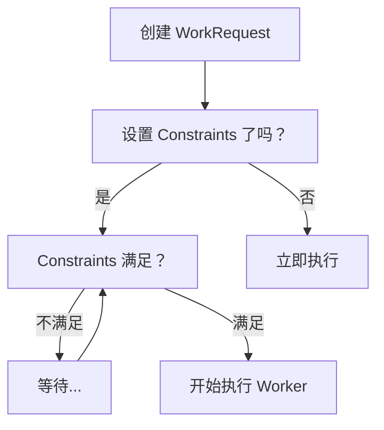
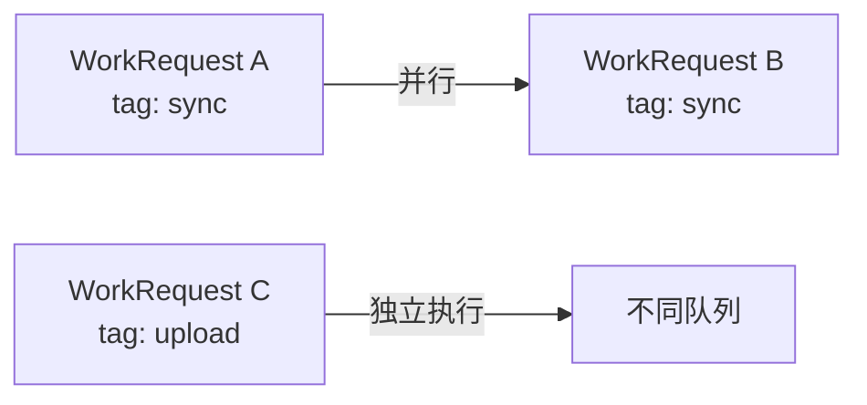
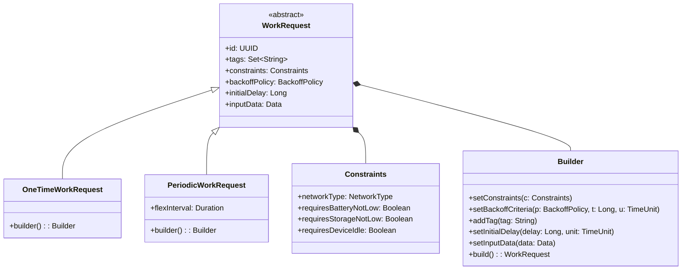

# 6.1.23 定义工作请求

洛芙的腿已经酸得快没有知觉了。

她们在日出前一个小时摸黑爬上白马岳，为的是在七点十三分的"钻石朗玛峰"——那一刻太阳正好从山峦背后升起，光芒像碎钻一样迸射开来。伊莎说得没错，确实美得让人忘记呼吸。但问题是，她现在不是在山上，她是在回营地的路上，而那段路全是上坡。

"还有多远啊……"洛芙拖着步子走在最后，声音闷闷的。

"转过这个弯就到了。"黛琳走在最前面，她的声音倒是清亮得很，好像爬了一座山对她来说就是散步一样，"再坚持五分钟。"

希尔从背包里掏出最后一个饭团，递到洛芙手里。"吃点东西，血糖低了会更累。"

洛芙接过饭团咬了一口。米饭的香甜混着梅干的咸酸，在清晨的冷空气里显得格外分明。

篝火台出现在眼前时，洛芙差点想跪下来亲吻地面。希尔动作麻利地往火堆里添了几根干柴，火苗立刻欢快地震了震，然后慢慢燃起来。橘红色的火光驱散了一点寒意，四个人围坐在火堆旁，开始张罗简单的早餐。

"热水壶在那边！"黛琳从登山包里取出一个折叠硅胶锅，"我昨天煮好的，直接倒就行。"

希尔架好便携火炉，火焰在秋日的晨光里跳动着。伊莎靠在折叠椅里，把自己裹进了一层薄毯，只露出一张脸和一双眼睛，正望着远处的山峦出神。

"伊莎，"洛芙捧着热可可，试探着问，"你昨晚是不是也没怎么睡？"

"嗯。"伊莎轻轻点头，嘴角带着一点笑意，"有点激动，想着今天早上的事，结果怎么都睡不着。"

"你明明比我先睡的！"洛芙瞪大了眼睛。

"但是你打呼了啊。"希尔插嘴。

"我没有！"

"有的。"黛琳的声音很平静，"每隔一段时间就打一次，还挺有节奏的。"

洛芙的脸一下子红了。她把头埋进热可可的杯子里，小口小口地喝，不想再说话。

希尔从她的笔记本电脑包里取出一个平板，屏幕亮起来，上面是一个代码界面。"对了，"她的语气很随意，"我们今天要讲 WorkManager 对吧？趁现在来搞一搞。"

"又来？"洛芙抬头看她，"我们刚爬山回来诶。"

"爬山回来脑子最清醒。"希尔的手指在屏幕上点点划划，"而且你看我们待会儿也没什么特别安排，不如趁热打铁。"

黛琳已经从背包里取出了她的小白板，拍了拍上面的灰尘，然后在火堆旁边的草地上找了个平整的地方架好。她抽出一支马克笔，转头看向伊莎。

伊莎从毯子里伸出手，接过白板笔。她在白板最上方画了一个方框，然后在旁边写下几个字：WorkManager的"工作请求"。

"如果你让 WorkManager 去执行一个任务，"伊莎的声音带着清晨特有的慵懒，"它不是直接就开始干活的。它要先问你一件事——这个任务长什么样？有什么要求？要在什么条件下执行？能重复吗？"

"就是……先填表？"洛芙试探着说。

"可以这么理解。"伊莎点点头，"这张表就是 WorkRequest。你填好了交给 WorkManager，它才知道该怎么安排这个任务。"

希尔把平板转过来给大家看。屏幕上是一个空白的 Android 项目，希尔打开了一个 Kotlin 文件。

```kotlin
// 创建一个一次性工作请求（执行一次）
val oneTimeWorkRequest = OneTimeWorkRequestBuilder<MyWorker>()
    .build()
```

"看到了吗？"希尔指着屏幕，"这是最简单的一个 WorkRequest。就一行，`build()` 出来，没有设置任何额外参数。"

"这种……感觉啥也没设置啊。"洛芙歪着头看。

"对，因为是默认值。"希尔说，"如果我们不设置任何东西，WorkManager 就用系统默认的配置来决定什么时候执行、能不能并行等等。但真实项目中，几乎不会什么都不设置。"

"会设置什么呢？"洛芙问。

"很多。"黛琳接过话头，"比如你可能要求这个任务只能在 WiFi 环境下执行，不能用流量；或者要求电量不低于 20%；或者要求设备处于空闲状态时才执行。这些条件，在 WorkManager 里叫做 Constraints——约束条件。"

她在白板上画了一个表格：

```
┌─────────────────────┐
│  WorkRequest.Builder │
├─────────────────────┤
│ • setConstraints()   │ → 约束条件
│ • setBackoffCriteria() │ → 退避策略
│ • addTag()           │ → 标签
│ • setInitialDelay()  │ → 初始延迟
│ • setInputData()     │ → 输入数据
└─────────────────────┘
```

"我们一个一个来看。"黛琳说。

希尔调整了一下平板的角度，让大家都看得清楚，然后开始输入代码。

```kotlin
// 设置约束条件的例子
val constraints = Constraints.Builder()
    .setRequiredNetworkType(NetworkType.UNMETERED)  // 仅 WiFi
    .setRequiresBatteryNotLow(true)                 // 电量不能过低
    .setRequiresStorageNotLow(true)                 // 存储不能过低
    .build()

val workRequest = OneTimeWorkRequestBuilder<MyWorker>()
    .setConstraints(constraints)
    .build()
```

"这段代码，"希尔指着屏幕，"设置了三个约束。第一，只有在连接了非计量网络（也就是 WiFi）时才执行；第二，电量不能低于系统定义的'低电量'阈值；第三，存储空间也不能过低。"

"如果任何一个条件不满足呢？"洛芙问。

"WorkManager 就不会执行这个任务。它会等，等到满足条件了才执行。"黛琳说，"这是 WorkManager 非常重要的一个特性——它不是立刻执行，而是会等待条件满足。"

"就像……"伊莎想了想，"就像我们昨天搭帐篷的时候，不是先把所有东西都摆出来，而是按照顺序一件件地来？"

"有点像，但不太一样。"黛琳摇头，"更准确的比喻是——就像登山前要先看天气预报。如果预报说今天有暴风雨，你就不会出发，而是等天好转。WorkManager 里的 Constraints 就是那个天气预报。"

洛芙点点头。"所以如果用户在山里，没有 WiFi，也没有充电的条件，这个任务就永远不会执行？"

"对，所以设置约束的时候要小心。"黛琳说，"如果你设置的条件太严格，任务可能永远无法执行。这是新手很容易踩的坑。"

希尔在火堆旁的草地上铺开一张纸，掏出一支笔开始画图。

"我来画个流程，"她说，"这样更清楚。"

她在纸上画了一个简单的框图：



"看到了吗？"希尔指着图，"如果你没有设置 Constraints，WorkRequest 创建后立刻就会被执行。但如果你设置了 Constraints，系统会先检查条件——不满足的话就等，满足了才执行。"

洛芙盯着图看了好一会儿。"那个退避策略……是什么？"她指着图里的某个位置。

"问到点子上了。"黛琳说，"退避策略——Backoff Policy——是在任务执行失败的时候决定怎么处理。比如网络断了、服务器超时、数据库冲突……这些情况可能导致任务失败。"

"失败了怎么办？"洛芙问。

"重试。"黛琳说，"但是不能立刻重试，否则可能会导致系统崩溃。所以要有个策略——多久之后重试？用什么方式重试？"

希尔继续在平板上敲代码。

```kotlin
// 设置退避策略
val workRequest = OneTimeWorkRequestBuilder<MyWorker>()
    .setBackoffCriteria(
        BackoffPolicy.EXPONENTIAL,  // 指数退避：1秒 → 2秒 → 4秒 → ...
        10,
        TimeUnit.SECONDS           // 初始重试延迟 10 秒
    )
    .build()
```

"这段代码设置了退避策略。"希尔解释道，"第一个参数是退避方式——EXPONENTIAL 表示指数增长，就是每次失败后等待时间翻倍。还有一个 LINEAR，是线性增长，每次增加固定的时间。"

"第二个参数是初始延迟时间，这里设置为 10 秒。第三个参数是时间单位。"

"所以如果任务失败了，"洛芙一边想一边说，"它会等 10 秒后重试？如果又失败了呢？"

"等 20 秒。"希尔说，"然后 40 秒、80 秒……指数增长。"

"最多等多久？"

"默认是 24 小时。"黛琳说，"如果超过 24 小时还没成功，任务就会被标记为失败，不会再重试了。"

洛芙突然想起什么。"那如果我创建了两个 WorkRequest，它们会同时执行吗？还是会排队？"

"这就要说到标签了。"希尔放下平板，"给 WorkRequest 打标签，就能控制它是否允许重复执行。"

```kotlin
// 通过标签引用 WorkRequest
val workRequest1 = OneTimeWorkRequestBuilder<MyWorker>()
    .addTag("sync_task")  // 给任务打上标签
    .build()

// 如果已经有同标签的任务在执行，新任务会等待
WorkManager.getInstance(context)
    .enqueue(workRequest1)
```

"标签就像……"伊莎想了想，"就像班级里的分组编号。同一个组的人会安排在一起，做值日的时候也是一组一组地来，而不是一个个单独喊。"

"如果标签相同的新任务进来，"黛琳补充道，"系统会决定是否允许它们并行。如果不允许，新任务就会排队等前面的完成。"

希尔又在白板上画了一个简单的图：



"同样标签的任务可能会并行执行，"希尔说，"但不同标签的任务是完全独立的，互不影响。"

"这里有个重要的点，"黛琳说，"WorkManager 默认是允许同标签任务并行的。但如果你想要更严格的控制，比如'同标签的任务只能有一个在执行'，那就需要用别的方式实现。"

洛芙低头看着自己的热可可。"我还是不太明白……输入数据是什么？"

"好问题。"希尔说，"Worker 也许需要一些数据才能工作。比如你要做一个'发送消息'的任务，那就需要知道消息内容是什么、发给谁——这些就是输入数据。"

```kotlin
// 创建 WorkRequest 时传入输入数据
val inputData = Data.Builder()
    .putString("message", "Hello, World!")
    .putInt("retry_count", 0)
    .build()

val workRequest = OneTimeWorkRequestBuilder<MyWorker>()
    .setInputData(inputData)
    .build()
```

"这段代码创建了一个 Data 对象，里面放了一条字符串消息和一个整数。然后通过 `setInputData()` 把这个 Data 传给 WorkRequest。"

"在 Worker 里怎么拿到这些数据呢？"洛芙问。

"通过 `inputData` 属性。"希尔说。她在 Worker 类里写了这段代码：

```kotlin
class MyWorker(context: Context, params: WorkerParameters)
    : CoroutineWorker(context, params) {

    override suspend fun doWork(): Result {
        // 获取输入数据
        val message = inputData.getString("message")
        val retryCount = inputData.getInt("retry_count", 0)

        // 执行实际任务
        Log.d("MyWorker", "收到消息: $message")

        return Result.success()
    }
}
```

"通过 `inputData.getString()`、`inputData.getInt()` 这些方法，从 WorkRequest 里取出当初传入的数据。数据类型可以是 String、Int、Boolean、Long、Double，还有 Float、Key-value pairs、Arrays 等等。"

"也可以传自定义的 Serializable 对象。"黛琳补充道，"只要你的数据类实现了 Serializable 接口，WorkManager 就能帮你传。"

"不过有大小限制，"希尔说，"输入数据不能超过 10KB。如果你要传大文件，比如图片之类的，就不能直接放在输入数据里，要用别的方式——比如先存到本地，然后把路径传进去。"

洛芙把这些信息在脑子里整理了一下。"所以创建 WorkRequest 的时候可以设置约束条件、退避策略、标签、还有输入数据……"

"还有初始延迟。"希尔说，"如果你想让任务延迟一段时间再执行，可以调用 `setInitialDelay()`。"

```kotlin
// 延迟 1 分钟后执行
val delayedWorkRequest = OneTimeWorkRequestBuilder<MyWorker>()
    .setInitialDelay(1, TimeUnit.MINUTES)
    .build()
```

"这段代码设置了 1 分钟的初始延迟。任务会在 enqueue 之后至少等 1 分钟才执行。"

"好了，"黛琳放下白板笔，"我们来把刚才讲的所有内容串起来，做一个完整的例子。"

希尔在平板上开始输入代码。

"假设我们要做一个天气同步任务，"希尔说，"需求是这样的：只在 WiFi 环境下同步、要有电且存储空间足够、失败了要指数退避、初始延迟 5 分钟、带上用户 ID 作为输入数据。"

```kotlin
// 完整的 WorkRequest 示例
class WeatherSyncWorker(
    context: Context,
    params: WorkerParameters
) : CoroutineWorker(context, params) {

    override suspend fun doWork(): Result {
        val userId = inputData.getString("user_id") ?: return Result.failure()

        Log.d("WeatherSync", "开始同步用户 $userId 的天气数据")

        // 执行同步逻辑...
        // 如果成功
        return Result.success()
        // 如果需要重试
        // return Result.retry()
        // 如果不可恢复的失败
        // return Result.failure()
    }
}

// 创建工作请求
fun createWeatherSyncRequest(userId: String): OneTimeWorkRequest {
    // 定义约束条件
    val constraints = Constraints.Builder()
        .setRequiredNetworkType(NetworkType.UNMETERED)  // 仅 WiFi
        .setRequiresBatteryNotLow(true)                  // 电量不能过低
        .setRequiresStorageNotLow(true)                  // 存储不能过低
        .build()

    // 定义输入数据
    val inputData = Data.Builder()
        .putString("user_id", userId)
        .build()

    // 构建 WorkRequest
    return OneTimeWorkRequestBuilder<WeatherSyncWorker>()
        .setConstraints(constraints)                    // 设置约束
        .setBackoffCriteria(
            BackoffPolicy.EXPONENTIAL,
            10,
            TimeUnit.SECONDS
        )                                               // 设置退避策略
        .setInitialDelay(5, TimeUnit.MINUTES)           // 设置初始延迟
        .addTag("weather_sync")                         // 添加标签
        .setInputData(inputData)                        // 设置输入数据
        .build()
}
```

"这段代码，"希尔指着屏幕，"完整地展示了如何构建一个 WorkRequest。从定义约束条件、到输入数据、到设置退避策略和延迟、到添加标签……全部都有了。"

"哇……"洛芙盯着代码看，"这么长一段啊。"

"这才是一个生产级别的 WorkRequest 该有的样子。"黛琳说，"真实项目中几乎不会只写一个 `.build()` 就完事了。"

"希尔，这个 Worker 里返回的 Result.success() 是什么意思？"洛芙问。

"Result 是 Worker 执行完成后返回的状态。"希尔解释道，"`Result.success()` 表示任务成功完成了，WorkManager 就不会再重试这个任务了。"

"还有两种情况——"黛琳接过话头，"一种是 `Result.retry()`，表示任务失败了，但是应该重试。WorkManager 会根据你设置的退避策略在一段时间后重新执行这个任务。"

"另一种是 `Result.failure()`，"希尔说，"表示任务彻底失败了，不需要重试。比如数据本身就错误、或者缺少必要的资源……这种情况下 WorkManager 就不会再尝试了。"

"我有点担心，"洛芙说，"如果我设置了很严格的约束条件，然后用户又没有 WiFi、又不是满电……那这个任务就永远不会被执行了？"

"对。"黛琳点头，"这是一个很容易犯的错误。很多新手设置了一堆约束，结果任务永远无法执行，自己还不知道为什么。"

"所以要平衡约束的严格程度和实际可行性。"伊莎说，"就好比我们爬山，如果要求'天气必须完美'才能出发，那可能一个秋天都出不了门。但如果一点要求都没有，可能遇到危险也不知道回头。"

"这个比喻好。"洛芙笑着说。

火堆里的柴火噼啪作响，火焰跳动着，散发出温暖的光和热。希尔把平板放下，伸了个懒腰。

"好了，"她说，"基本的内容就是这些。还有什么要补充的吗？"

"periodic work request。"黛琳说，"就是定期执行的工作请求，和 OneTimeWorkRequest 不一样。"

"对对，差点忘了。"希尔重新拿起平板，"如果你的任务需要定期执行，比如每天同步一次天气、或者每周清理一次缓存……那就用 PeriodicWorkRequest。"

```kotlin
// 创建周期性工作请求（每 15 分钟执行一次）
val periodicWorkRequest = PeriodicWorkRequestBuilder<MyWorker>(
    15, TimeUnit.MINUTES  // 最小间隔：15 分钟
)
    .setConstraints(constraints)
    .build()

// 更大周期的例子（每天执行一次）
val dailyWorkRequest = PeriodicWorkRequestBuilder<MyWorker>(
    1, TimeUnit.DAYS
)
    .build()
```

"注意一点，"希尔认真地说，"PeriodicWorkRequest 的最小间隔是 15 分钟。你不能设置为 10 分钟或者 5 分钟——系统不允许。"

"为什么？"洛芙问。

"为了省电。"黛琳说，"如果允许很短的周期，App 就可能频繁地在后台执行任务，大量消耗电量。用户会很烦恼。Android 系统为了保护电池寿命，强制规定了最小间隔。"

"还有一点，"希尔补充道，"PeriodicWorkRequest 不能设置初始延迟。因为是定期执行，系统需要计算下次执行的时间，如果设置了初始延迟就会打乱这个节奏。"

"PeriodicWorkRequest 能设置退避策略吗？"洛芙问。

"不能。"黛琳摇头，"定期任务如果失败了，下一次执行就是正常周期，不会有额外的退避。如果你需要定期任务也有重试机制，要自己在 Worker 里实现。"

洛芙默默把这些知识点都记在脑子里。

"差不多了。"希尔把平板合上，"你们还有什么问题吗？"

"我有一个。"洛芙说，"如果我在一个 Activity 里 enqueue 了一个 WorkRequest，然后用户把 App 关掉了——任务还会继续执行吗？"

"会。"黛琳说，"这正是 WorkManager 的强大之处。它有自己的独立进程，不依赖于 App 的生命周期。即使 App 被关掉了，任务依然会继续执行。"

"所以即使手机没电了关掉、或者清掉了后台……只要 WorkManager 在运行，任务就不会丢？"

"对。不过如果系统内存紧张、或者用户强制停止 App，那 WorkManager 可能也会被杀掉。但即使被杀掉了，已完成的任务不会重新执行，未完成的任务会由系统在合适的时候重新调度——除非你设置了 `setExpedited()` 之类的特殊选项。"

"那个我不太懂。"洛芙说。

"那个是另一种类型，今天先不展开。"黛琳笑着说，"已经够多了。"

伊莎从毯子里伸出手，拍了拍洛芙的肩膀。"今天讲的内容很多消化一下，不要着急。WorkManager 是 Android 里很重要的一个组件，以后写代码会经常用到。"

洛芙点点头。她端起已经凉了的可可，抿了一口。秋日的阳光已经完全升起来了，金色的光线洒在营地的每个角落，帐篷的帆布在微风中轻轻晃动，远处的山峦层次分明地排列着，枫叶红得像火焰一样。

希尔往火堆里添了一根柴，然后靠回椅背上，伸了个懒腰。"好累啊……但是好充实。"

"你每天都是这样。"黛琳说。

"这不就是露营的意义吗？"希尔笑了，"白天爬山看日出，晚上围在一起学代码。累但是很满足。"

"嗯。"洛芙轻声回应。她抬起头，看着远处被晨光照亮的白马岳山峰，昨天的疲惫仿佛都已经消散了。

她想起黛琳说的话——数据应该待在哪里，取决于它要活多久。WorkRequest 也是一种定义"任务生命周期"的方式，定义好它的约束和条件，然后交给 WorkManager 去管理。

就像登山前要看天气预报——准备好一切，然后交给山去决定。

---

## 专业技术总结

> WorkRequest 是 WorkManager 的核心构建块，它定义了要执行的工作以及执行的条件。一个 WorkRequest 可以是一次性的（OneTimeWorkRequest）或周期性的（PeriodicWorkRequest）。

#### 结构图



#### 复杂度与影响

* **Constraint 检查**：每次 WorkManager 醒来时检查约束，若不满足则跳过本次执行窗口，这会延迟任务执行但不会失败。
* **输入数据限制**：输入 Data 不得超过 10KB，否则抛出 `IllegalArgumentException`。
* **PeriodicWorkRequest 最小间隔**：受限于设备制造商，部分厂商可能将最小值提高到 1 小时甚至更多。

#### 反模式与陷阱

1. **约束过于严格**：设置多个约束且均为 `REQUIRED` 时，任务可能永远无法执行。修复：评估每个约束的必要性，优先使用 `PREFERRED` 或考虑其他调度方式。
2. **混淆 OneTime 和 Periodic**：一次性任务失败后若返回 `retry()` 会按退避策略重试；周期任务重试后会按原周期继续执行，不会应用额外退避。
3. **忘记处理 Result.failure()**：未在代码中处理不可恢复失败，会导致静默丢失任务而难以排查。
4. **未为 PeriodicWorkRequest 设置合理的约束**：周期任务在后台运行，对电池影响大，应始终设置 `setRequiresBatteryNotLow(true)` 等保护性约束。

#### 设计哲学

WorkManager 采用了 **约束驱动执行** 模式：任务定义自身执行的前置条件，由系统判断何时满足，而不是由开发者在代码中轮询检查状态。这种设计将"何时执行"的决定权从 App 转移到系统框架，既保护了电池寿命，也提升了系统资源的全局调度效率。设计原则：

* 声明式而非命令式：开发者声明"这任务需要 WiFi"，而非写"如果有 WiFi 就执行"。
* 任务与执行解耦：WorkRequest 只描述任务，不关心谁执行、什么时候执行。
* 系统负责可靠性：失败重试、约束检查、生命周期管理全部由 WorkManager 处理，降低开发者心智负担。

#### 🏕️ 动手练习

**目标**：构建一个带约束、退避、标签和输入数据的 WorkRequest，实现一个周期性同步天气数据的后台任务。

**你需要做的事**：

1. 创建新项目或打开现有 Android 项目，添加依赖：
   ```kotlin
   // build.gradle.kts (app)
   dependencies {
       implementation("androidx.work:work-runtime-ktx:2.9.0")
   }
   ```

2. 定义 `WeatherSyncWorker` 类继承 `CoroutineWorker`，实现 `doWork()` 方法：
   * 读取输入数据中的 `city_name`（字符串）
   * 模拟获取天气（用 `Log.d` 打印城市名）
   * 成功时返回 `Result.success()`，失败时返回 `Result.retry()`

3. 使用 `Constraints.Builder` 构建约束：
   * `setRequiredNetworkType(NetworkType.UNMETERED)` — 仅 WiFi
   * `setRequiresBatteryNotLow(true)`

4. 使用 `OneTimeWorkRequestBuilder` 创建 `OneTimeWorkRequest`，组合约束、设置退避策略（EXPONENTIAL，初始 10 秒）、添加标签 `"weather_sync"`、设置输入数据（city_name: "Tokyo"）

5. 将 WorkRequest enqueue 到 WorkManager

6. 创建 `PeriodicWorkRequestBuilder`，每 6 小时执行一次，添加相同约束

7. 使用 `WorkManager.getInstance().cancelAllWorkByTag("weather_sync")` 测试取消功能

**验收标准**：

- [ ] Worker 类正确继承 CoroutineWorker 并读取 inputData
- [ ] Constraints 设置了 NetworkType.UNMETERED 和 requiresBatteryNotLow
- [ ] OneTimeWorkRequest 设置了退避策略（EXPONENTIAL）和标签
- [ ] 输入数据通过 Data.Builder 构建并传入 WorkRequest
- [ ] PeriodicWorkRequest 间隔不低于 15 分钟
- [ ] Logcat 中能看到 Worker 执行日志

**提示代码片段**：

```kotlin
// 创建输入数据
val inputData = Data.Builder()
    .putString("city_name", "Tokyo")
    .build()

// 构建约束
val constraints = Constraints.Builder()
    .setRequiredNetworkType(NetworkType.UNMETERED)
    .setRequiresBatteryNotLow(true)
    .build()

// 创建 OneTimeWorkRequest
val workRequest = OneTimeWorkRequestBuilder<WeatherSyncWorker>()
    .setConstraints(constraints)
    .setBackoffCriteria(BackoffPolicy.EXPONENTIAL, 10, TimeUnit.SECONDS)
    .addTag("weather_sync")
    .setInputData(inputData)
    .build()

// enqueue
WorkManager.getInstance(this).enqueue(workRequest)
```

#### 面试热身

1. OneTimeWorkRequest 和 PeriodicWorkRequest 的核心区别是什么？各适合什么场景？
2. 如果你设置了极其严格的约束条件（如要求 WiFi + 电量 50% + 存储空闲），可能导致什么问题？如何避免？
3. 解释 BackoffPolicy.EXPONENTIAL 的含义，实际场景中什么时候会用到指数退避而不是线性退避？
4. Worker 里的 `Result.retry()` 和 `Result.failure()` 有什么区别？系统会如何处理这两种返回值？
5. 输入数据的大小限制是多少？如果你需要传递一张图片怎么办？

#### 参考实现要点

1. 生产环境中，约束条件应始终设置 `setRequiresBatteryNotLow(true)`，防止任务耗尽用户电量。
2. PeriodicWorkRequest 的间隔应尽量设置较长（小时级别），避免频繁后台操作影响续航和系统性能。
3. 给 WorkRequest 打标签而非依赖具体的 UUID，便于后续统一管理和取消。
4. 输入数据建议只传必要的小型数据（ID、简单参数），大型数据通过本地文件路径传递。
5. 失败重试逻辑应在 Worker 内明确处理，避免使用 `Result.retry()` 导致无限循环。

---

> 学习建议
> 
> WorkRequest 是 WorkManager 的基础单元。建议先从 OneTimeWorkRequest 开始，熟悉 Builder 的各个方法后再尝试 PeriodicWorkRequest。约束条件的设置需要结合实际业务场景，过于严格会导致任务"饿死"，过于宽松则失去后台调度的意义——找到平衡是关键。

## 洛芙的小小日记本

今天学了好多东西……OneTimeWorkRequest、PeriodicWorkRequest、Constraints、BackoffPolicy……头都晕了。但是希尔说，爬山回来脑子最清醒，所以我也相信自己了。黛琳说，数据待在哪里取决于它要活多久。WorkRequest 其实也是一种"决定任务活多久"的方式吧。先声明条件，然后交给系统去判断——这比我自己盯着强多了。明天继续加油！

---

## 今日关键词

- **WorkRequest**：定义要执行的 WorkManager 任务的结构，包含执行条件、数据、标签等。
- **OneTimeWorkRequest**：一次性工作请求，只执行一次，适用于不需要重复的任务。
- **PeriodicWorkRequest**：周期性工作请求，按固定间隔重复执行，适用于定期同步类任务。
- **Constraints**：约束条件，定义任务执行的前置环境要求，如网络类型、电池电量等。
- **NetworkType.UNMETERED**：非计量网络类型，即 WiFi（不包括移动数据）。
- **setRequiresBatteryNotLow(true)**：要求设备电量不低于系统定义的"低电量"阈值。
- **setRequiresStorageNotLow(true)**：要求设备存储空间不低于阈值。
- **setBackoffCriteria()**：设置任务失败时的退避策略，包含退避方式和初始延迟时间。
- **BackoffPolicy.EXPONENTIAL**：指数退避策略，每次重试延迟时间翻倍增长（如 10s → 20s → 40s）。
- **BackoffPolicy.LINEAR**：线性退避策略，每次重试延迟时间按固定增量增长。
- **addTag()**：为 WorkRequest 添加标签，用于分组和管理任务。
- **setInitialDelay()**：设置任务 enqueue 后的初始延迟时间。
- **setInputData()**：设置传递给 Worker 的输入数据。
- **Data.Builder**：构建 Data 对象的 Builder 模式，用于存放键值对形式的输入数据。
- **Result.success()**：Worker 返回的成功状态，WorkManager 不会再重试该任务。
- **Result.retry()**：Worker 返回的重试状态，WorkManager 会按退避策略重新调度任务。
- **Result.failure()**：Worker 返回的失败状态，任务终止，不再重试。
- **enqueue()**：将 WorkRequest 提交给 WorkManager 开始调度执行。
- **WorkManager**：AndroidX 提供的一种可靠的后台任务调度库，处理任务的生命周期、约束检查、失败重试等。
- **CoroutineWorker**：使用协程执行任务的 Worker 基类，适合需要异步操作的场景。