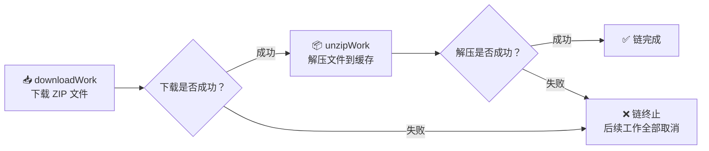
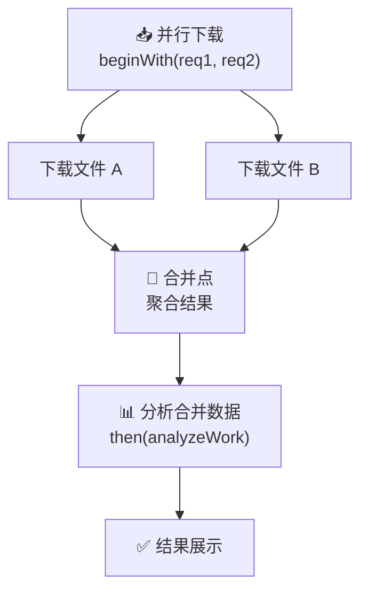
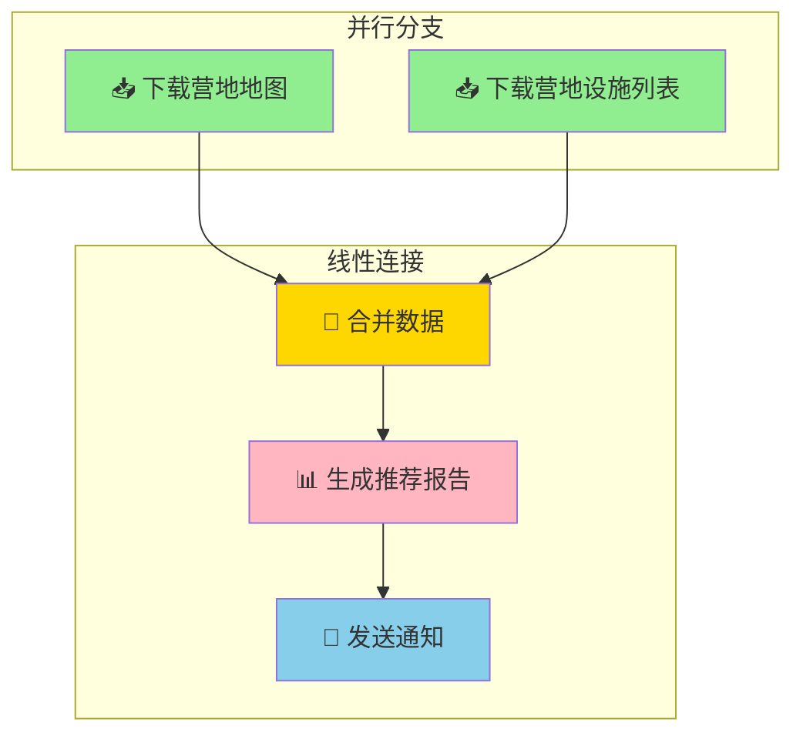
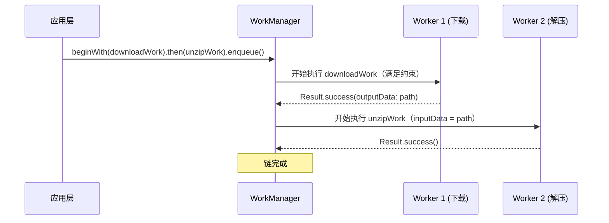
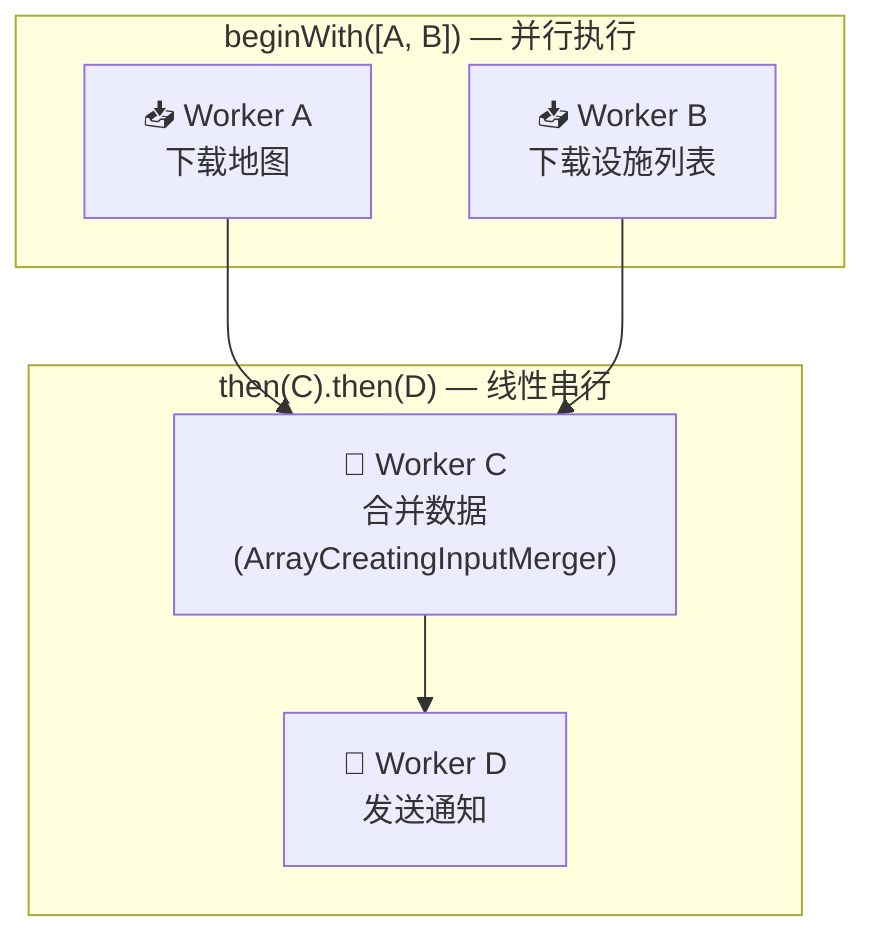

# 6.1.24 连锁工作

早饭是希尔用便携炉烤的厚切培根和煎蛋，油脂在铁板上滋滋作响，香气把整片露营场都唤醒了。

洛芙盘腿坐在折叠凳上，手里捧着一杯热可可，眼睛却盯着黛琳膝盖上的那台小笔记本电脑。屏幕上是一行行 Kotlin 代码，被希尔接上了便携显示器之后，字号大得有些夸张。

"所以，上次你说的 WorkRequest，可以加约束条件，让它在有网的时候才跑。"洛芙咬了一口培根，含糊地说，"我懂了。但是……如果我想做的事不止一件呢？比如先下载数据，再解压，再上传？"

"三件事。"希尔竖起三根手指，培根的油脂香气还挂在她指尖。

"对，三件！而且每一件都要等上一件完成才能开始。"洛芙用力点头，"总不能边下载边解压吧，那不是会乱套？"

黛琳从咖啡壶里给自己倒了一杯黑咖啡，热气在晨风中很快散开。她没有急着回答，而是转向了希尔。

"希尔，你之前做过那个下载和解压的示例吧？"

"做过啊。"希尔把煎蛋铲进嘴里，嚼了两下，"先下载一个 ZIP 文件，然后解压到缓存目录里。两步，必须按顺序来。"

"那正好。"黛琳把咖啡杯往石头上一搁，"今天我们就用这个场景，把连锁工作讲清楚。"

伊莎一直安静地坐在一旁，这会儿把膝上的毛毯往上拽了拽。"连锁工作……听起来像是帐篷的防风绳，一环扣一环。"

"比那个还要清楚。"希尔三两口吃完早饭，用纸巾擦了擦手，"因为每一环都能独立设置条件，还能把上一环的结果传给下一环。"

"就像营地厨房里的流水作业？"洛芙歪着头，"洗菜 → 切菜 → 炒菜，每一步都要等上一步做完，而且上一步的结果会直接送到下一步的砧板上。"

"没错。"黛琳微微颔首，嘴角浮起一丝笑意，"洛芙这个比喻很准确。"

希尔已经把便携显示器转向了大家，屏幕上是一个空白的 Kotlin 文件。她手指悬在键盘上方，像个即将开演的魔术师。

"先从最简单的情况开始——两步，首尾相连。"她敲下了第一行代码：

```kotlin
// 第一步：下载 WorkRequest
val downloadWork = OneTimeWorkRequest.Builder(DownloadWorker::class.java)
    .setConstraints(
        Constraints.Builder()
            .setRequiredNetworkType(NetworkType.CONNECTED) // 只需要网络
            .setRequiresBatteryNotLow(true)
            .build()
    )
    .setInputData(
        Data.Builder()
            .putString(DownloadWorker.KEY_URL, "https://example.com/camp-data.zip")
            .build()
    )
    .addTag("download")
    .build()

// 第二步：解压 WorkRequest（不需要网络，但需要存储空间）
val unzipWork = OneTimeWorkRequest.Builder(UnZIPWorker::class.java)
    .setConstraints(
        Constraints.Builder()
            .setRequiresStorageNotLow(true) // 需要存储空间，不是网络
            .setRequiresBatteryNotLow(true)
            .build()
    )
    .addTag("unzip")
    .build()
```

"看到了吗？"希尔用指尖敲了敲屏幕边缘，"第一步要求网络连接，第二步不要求网络，只要求存储空间别太低。这就是拆分链式工作的第一个好处——每个任务可以用不同的约束条件。"

"等等，"洛芙举起手，"为什么解压不需要网络？"

"因为文件已经下载到本地了啊。"希尔弹了一下手指，"ZIP 包就在缓存目录里，解压只需要读写本地文件，不需要联网。如果你把所有逻辑塞进一个 Worker 里，那个 Worker 就必须同时满足'有网络'和'存储空间充足'两个条件，万一下载完了存储空间突然不够了呢？那就彻底卡死了。"

"分开了之后，下载在有网时完成，解压在存储够时完成，互不干扰。"黛琳补充道。

"这就是第一步和第二步之间，数据怎么传过去呢？"洛芙盯着代码，"解压需要知道文件路径吧？"

"好问题。"希尔露出一个"终于问到点子上"的微笑，敲下了关键的几行：

```kotlin
// 构建链式调用
// beginWith() 是链的起点，then() 是后续环节，enqueue() 是启动
WorkManager.getInstance(context)
    .beginWith(downloadWork)   // 从 downloadWork 开始
    .then(unzipWork)           // 成功后执行 unzipWork
    .enqueue()                 // 把整条链加入队列
```

"就这么简单？"洛芙眨了眨眼。

"就这么简单。"希尔往后靠了靠，双手抱在脑后，"beginWith() 开启一条链，then() 把新的环节接上去，最后 enqueue() 让整条链跑起来。"

"那数据呢？"洛芙追问，"downloadWork 怎么把文件路径告诉 unzipWork？"

希尔把椅子往前一拉，重新凑近屏幕。

"看这里——DownloadWorker 的 doWork() 返回的时候，不是 return Result.success() 吗？"

```kotlin
// DownloadWorker.kt
override fun doWork(): Result {
    // 下载文件到缓存目录...
    val downloadedFile = File(cacheDir, "camp-data.zip")
    
    // 下载完成后，把文件路径作为输出数据返回
    return Result.success(
        Data.Builder()
            .putString(UnZIPWorker.KEY_ZIPFILE, downloadedFile.absolutePath)
            .build()
    )
}
```

"ZIP 文件的路径，通过 Result.success() 的输出数据传了出去。"希尔的声音带着一种"见证奇迹"的语气，"然后 UnZIPWorker 的 getInputData() 就能收到这个路径。"

"等等——"洛芙的眼睛睁大了，"这是自动的？"

"是自动的。"黛琳接过话头，"只要两个 WorkRequest 在同一条链上，上一环的输出，会自动成为下一环的输入。这个过程对开发者来说是透明的。"

"透明……"洛芙咀嚼着这个词，"就像营地厨房里的传送带，洗好的菜自动滑到切菜台上，不需要人再端过去一趟。"

"完美的比喻。"伊莎轻声说。

希尔清了清嗓子，继续往下写：

```kotlin
// UnZIPWorker.kt
override fun doWork(): Result {
    // 从输入数据中读取 ZIP 文件路径
    val zipFilePath = inputData.getString(KEY_ZIPFILE) ?: return Result.failure()
    
    val zipFile = File(zipFilePath)
    val resultDir = File(applicationContext.cacheDir, "unzipped-results")
    
    try {
        ZipUtils.unzip(zipFile, resultDir, 2048, MAX_UNZIP_SIZE)
        zipFile.delete() // 解压完成后删除 ZIP 包
    } catch (e: Exception) {
        return Result.failure()
    }
    
    return Result.success() // 无需再输出什么
}
```

"这里，inputData.getString(KEY_ZIPFILE) 拿到的，就是上一个 Worker 输出的数据。"希尔点着屏幕，"如果下载失败了，这个方法根本不会被调用——因为 WorkManager 知道下载还没完成。"

"这就是'连锁'的意思了。"黛琳伸手拿起白板笔，在便携小白板上画了起来，"一环扣一环，上一环失败，下一环就不跑。"

她画了一个简单的流程图：



"图 1 对应上面的代码片段 1 到 7。"黛琳在图旁边标注了一下，"这是最简单的两节点线性链。"

"线性链……"洛芙在本子上记下来，"那如果有更复杂的呢？比如我想同时下载两个文件？"

"这就是链式工作的第二个强大之处——并行。"希尔的眼睛亮了起来，"beginWith() 和 then() 都可以接受多个 WorkRequest，形成平行分支。"

她在白板上迅速画出了另一种结构：



"看到了吗？"希尔用手指点着图，"beginWith() 里可以放多个 WorkRequest，它们会并行执行。比如你同时需要下载营地的地图数据和水源信息，完全可以并行去取。"

"等它们都完成了，"黛琳接过话，"then() 里的 analyzeWork 才开始执行，而且它能收到前面所有 Worker 的输出数据。"

"但如果有冲突呢？"洛芙举手，"比如两个 Worker 都输出一个叫 'result' 的 key？"

"好眼力。"黛琳点点头，"官方文档专门提到了这个问题——当多个分支的输出包含相同 key 时，其中一个会被丢弃。如果你想合并冲突的数据，需要使用 InputMerger。"

"InputMerger？"洛芙在本子上重重地画了个问号。

"是一种数据合并器。"希尔敲了几下键盘，调出一段代码，"你可以自定义合并策略，比如用数组把所有同名的值都收集起来，而不是只留一个。"

```kotlin
// 创建一个带 InputMerger 的 WorkRequest
// ArrayCreatingInputMerger 会把同 key 的值合并成一个字符串数组
val analyzeWork = OneTimeWorkRequest.Builder(AnalyzeWorker::class.java)
    .setInputMerger(ArrayCreatingInputMerger::class.java)
    .build()
```

"不过说实话，"希尔耸耸肩，"大多数场景用默认的 Key-value 覆盖策略就够了，不需要自定义 Merger。"

伊莎一直在旁边安静地听着，这时候忽然开口了："希尔，你们说的这些，代码写起来确实很清楚。但如果我想看这条链跑到哪一步了呢？比如下载完成了，但解压还没开始？"

"问得好。"希尔推了推并不存在的眼镜，"每一步都有自己的 WorkInfo，可以单独观察。"

```kotlin
// 观察最后一个 WorkRequest 的状态（解压完成 = 整条链完成）
val liveOpStatus = WorkManager.getInstance(context)
    .getWorkInfoByIdLiveData(unzipWork.id)

liveOpStatus.observe(lifecycleOwner) { workInfo ->
    when (workInfo?.state) {
        WorkInfo.State.RUNNING -> {
            Log.d("ChainDemo", "解压 Worker 正在执行")
        }
        WorkInfo.State.SUCCEEDED -> {
            Log.d("ChainDemo", "解压成功！整条链完成")
            // 从 workInfo.outputData 中读取最终结果
            val output = workInfo.outputData.getString("resultKey")
            Log.d("ChainDemo", "最终数据: $output")
        }
        WorkInfo.State.FAILED -> {
            Log.d("ChainDemo", "解压失败，链终止")
        }
        else -> {}
    }
}
```

"观察 unzipWork 的状态就够了——因为它是链的最后一环，它完成就意味着整条链完成了。"希尔说。

"但如果我想知道下载是否完成呢？"洛芙追问。

"可以观察整个链的所有 WorkInfo。"希尔又敲了几行：

```kotlin
// 观察整条链的状态
WorkManager.getInstance(context)
    .getWorkInfosForUniqueWorkLiveData("camp-data-chain") // 需要给链起个名字
    .observe(lifecycleOwner) { workInfoList ->
        workInfoList?.forEach { info ->
            Log.d("ChainDemo", "${info.tags} -> ${info.state.name}")
        }
    }
```

"等等，这里用了 `getWorkInfosForUniqueWorkLiveData`，不是 `getWorkInfoByIdLiveData`。"洛芙注意到了区别。

"对，因为要给链起名字才能追踪整条链。"希尔说，"不过这需要用 `beginUniqueWork` 而不是普通的 `beginWith`。我们稍后再讲这个。"

"现在先来演示一个完整的、能跑的例子。"黛琳拿起希尔的笔记本，在上面翻找。

"别找了，我直接写一个完整的 ViewModel。"希尔把笔记本抢了回来，手指在键盘上飞舞：

```kotlin
class CampDataViewModel(application: Application) : AndroidViewModel(application) {

    private val workManager = WorkManager.getInstance(application)
    
    // 用于 UI 观察的 LiveData
    val chainStatus = MediatorLiveData<String>()

    fun startDownloadAndProcess() {
        // Step 1: 下载营地数据
        val downloadWork = OneTimeWorkRequest.Builder(DownloadWorker::class.java)
            .setConstraints(
                Constraints.Builder()
                    .setRequiredNetworkType(NetworkType.CONNECTED)
                    .setRequiresBatteryNotLow(true)
                    .build()
            )
            .setInputData(
                Data.Builder()
                    .putString(DownloadWorker.KEY_URL, CAMP_DATA_URL)
                    .build()
            )
            .addTag("camp-download")
            .build()

        // Step 2: 解压数据
        val unzipWork = OneTimeWorkRequest.Builder(UnZIPWorker::class.java)
            .setConstraints(
                Constraints.Builder()
                    .setRequiresStorageNotLow(true)
                    .setRequiresBatteryNotLow(true)
                    .build()
            )
            .addTag("camp-unzip")
            .build()

        // Step 3: 解析并生成营地推荐
        val parseWork = OneTimeWorkRequest.Builder(ParseWorker::class.java)
            .setConstraints(
                Constraints.Builder()
                    .setRequiresBatteryNotLow(true)
                    .build()
            )
            .addTag("camp-parse")
            .build()

        // 构建链：下载 -> 解压 -> 解析
        // 链中前一个 Worker 的输出会自动作为下一个 Worker 的输入
        workManager
            .beginWith(downloadWork)
            .then(unzipWork)
            .then(parseWork)
            .enqueue()

        // 观察最后一环的状态
        val lastWorkLiveData = workManager.getWorkInfoByIdLiveData(parseWork.id)
        chainStatus.addSource(lastWorkLiveData) { info ->
            chainStatus.value = when (info?.state) {
                WorkInfo.State.ENQUEUED -> "等待中..."
                WorkInfo.State.RUNNING -> "正在解析营地数据..."
                WorkInfo.State.SUCCEEDED -> {
                    val result = info.outputData.getString(ParseWorker.KEY_RESULT)
                    "完成！推荐结果：$result"
                }
                WorkInfo.State.FAILED -> "处理失败，请检查网络和存储空间"
                WorkInfo.State.CANCELLED -> "已取消"
                else -> "未知状态"
            }
        }
    }
}
```

"三步链。"希尔把屏幕转过来给大家看，"下载 → 解压 → 解析。"

"让我来运行一下看看。"希尔手指悬在键盘上方，"模拟器上跑的话，日志输出是这样的："

```kotlin
// 模拟运行日志输出（Logcat）
D/CampDataViewModel: 开始执行营地数据下载链
D/DownloadWorker:   [download] 开始下载: https://example.com/camp-data.zip
D/DownloadWorker:   [download] 下载完成，文件路径: /data/user/0/com.example/cache/camp-data.zip
D/UnZIPWorker:      [unzip] 开始解压: /data/user/0/com.example/cache/camp-data.zip
D/UnZIPWorker:      [unzip] 解压完成，结果目录: /data/user/0/com.example/cache/unzipped-results
D/ParseWorker:      [parse] 解析 12 个营地条目
D/ParseWorker:      [parse] 生成推荐列表: ["白马营地", "栍岳湖营地", "五龙公园"]
D/CampDataViewModel: 处理完成！推荐结果：白马营地,栍岳湖营地,五龙公园
```

"日志里，三个步骤是顺序出现的。"希尔用指尖点着屏幕，"因为它们在同一条链上，download 完成后 unzip 才启动，unzip 完成后 parse 才启动。"

"如果中间某一步失败了，后面就都不跑了。"黛琳补充道。

"没错。"希尔又切出另一个代码块，"这里有个坑要提醒——如果你的链失败了，想重试，不能只 enqueue 一次就完事。"

"那要怎么做？"洛芙认真地问。

希尔敲下这段代码：

```kotlin
// ⚠️ 反模式：链失败后直接重新 enqueue（不好！）
// 问题：会创建一条全新的链，原来的 WorkInfo 状态会丢失
// workManager.beginWith(downloadWork).then(unzipWork).enqueue() // 别这样做！
```

```kotlin
// ✅ 正确做法：使用 beginUniqueWork 给链命名，失败后用 REPLACE 策略重跑
// 创建一个唯一命名的链，ExistingWorkPolicy.REPLACE 表示如果已有同名链在跑，先取消它
workManager.beginUniqueWork(
    "camp-data-chain",           // 链的唯一名称
    ExistingWorkPolicy.REPLACE,  // 已存在时：REPLACE（替换）| KEEP（保留原链）| APPEND（追加）
    listOf(downloadWork, unzipWork, parseWork)
).enqueue()
```

"如果之前有条链失败了，你想重新跑同一套流程，REPLACE 会先把旧链取消掉，再跑新链。"希尔解释道，"这样你不需要手动 cancel，用策略就搞定了。"

"REPLACE、KEEP、APPEND……"洛芙在本子上记下来，"这些是 ExistingWorkPolicy 的选项？"

"对，专门用于唯一链的策略。"黛琳点点头，"普通链（beginWith + then + enqueue）没有名字，不能取消和替换。而唯一链可以。"

"所以如果你需要能够取消整个链，或者重新跑，就要用 beginUniqueWork。"希尔总结道，"如果只是简单的顺序执行，用 beginWith + then 就够了。"

"那如果我想在链中途取消呢？"洛芙又问。

"用 workManager.cancelUniqueWork('链名称') 就可以取消整条链。"希尔说，"取消之后，链上所有还没跑的环节都会被跳过。"

伊莎抬头看了看天空，秋日的阳光已经从晨雾中完全透出来了，把篝火旁的草地点缀得暖洋洋的。

"希尔，你们讲了这么多线性链和并行链……"伊莎慢悠悠地开口，"洛芙现在应该晕了吧？"

"有一点！"洛芙承认，"但是……我觉得核心思想我抓住了。就是 beginWith 开始，然后 then 一个接一个，然后 enqueue 跑起来。数据会自动从上一环流到下一环。"

"够用了。"黛琳点头，"等你真正写的时候，最常遇到的就是这种线性两到三步的链。"

"那并行呢？"洛芙追问，"那种 beginWith 里放两个 WorkRequest 的情况。"

"来，给你画个完整的结构图。"希尔抢过黛琳的白板笔：



"图 2 是更复杂的链——先并行取地图和设施列表，合并之后生成报告，最后发送通知。"希尔用笔尖点着图上的方块，"beginWith(mapWork, facilityWork) 是两条并行线，then(mergeWork) 把它们汇合，然后 then(notifyWork) 做最后一步。"

"合并数据那里，输入是两个 Worker 的输出对吧？"洛芙问。

"对。如果两个 Worker 输出同一个 key，比如都叫 'status'，就会冲突。"希尔说，"Android 系统的默认行为是丢弃一个。如果你两个都要，就需要 InputMerger 了。"

"我先不纠结这个。"洛芙摆摆手，"这种高级用法以后再说。"

"务实的态度。"黛琳笑着说。

"现在让我来完整地跑一遍这个例子。"希尔把代码完善了一下：

```kotlin
// 完整可运行的并行链示例
class CampRecommendViewModel(application: Application) : AndroidViewModel(application) {

    private val workManager = WorkManager.getInstance(application)
    val statusText = MediatorLiveData<String>()

    fun buildParallelChain() {
        // 并行分支1：下载营地地图（需要网络）
        val mapWork = OneTimeWorkRequest.Builder(MapDownloadWorker::class.java)
            .setConstraints(
                Constraints.Builder()
                    .setRequiredNetworkType(NetworkType.CONNECTED)
                    .build()
            )
            .build()

        // 并行分支2：下载营地设施列表（需要网络）
        val facilityWork = OneTimeWorkRequest.Builder(FacilityDownloadWorker::class.java)
            .setConstraints(
                Constraints.Builder()
                    .setRequiredNetworkType(NetworkType.CONNECTED)
                    .build()
            )
            .build()

        // 合并工作：等待两个下载都完成后，合并数据
        val mergeWork = OneTimeWorkRequest.Builder(DataMergeWorker::class.java)
            .setInputMerger(ArrayCreatingInputMerger::class.java) // 处理同名 key 冲突
            .build()

        // 通知工作：发送推荐结果
        val notifyWork = OneTimeWorkRequest.Builder(NotifyWorker::class.java)
            .build()

        // 开始并行链：先并行执行 mapWork + facilityWork，
        // 两者都成功后执行 mergeWork，
        // mergeWork 成功后执行 notifyWork
        workManager
            .beginWith(listOf(mapWork, facilityWork)) // 并行：两个任务同时开始
            .then(mergeWork)                            // 线性：等两个都完成
            .then(notifyWork)                           // 线性：merge 完成后
            .enqueue()

        // 观察最终状态
        val finalStatus = workManager.getWorkInfoByIdLiveData(notifyWork.id)
        statusText.addSource(finalStatus) { info ->
            statusText.value = when (info?.state) {
                WorkInfo.State.SUCCEEDED -> "✅ 营地推荐已生成并发送通知"
                WorkInfo.State.FAILED -> "❌ 处理失败"
                WorkInfo.State.CANCELLED -> "⚠️ 已取消"
                WorkInfo.State.RUNNING -> "🔄 正在处理..."
                else -> "⏳ 等待中..."
            }
        }
    }

    fun cancelChain() {
        // 取消整条链（需要用 beginUniqueWork 才行，普通链没有名字，无法取消）
        // 演示用 cancelUniqueWork
        workManager.cancelUniqueWork("camp-parallel-chain")
    }
}
```

"这段代码有几个关键点。"希尔竖起手指，一一数着，"第一，beginWith() 接受一个 List 而不是单个 WorkRequest，这表示多个任务并行执行。第二，then() 里的 WorkRequest 要等 beginWith() 里的所有任务都成功之后才会开始。第三，mergeWork 设置了 ArrayCreatingInputMerger，因为两个并行 Worker 可能输出同名的 key。"

"这就是连锁工作的全部核心了。"黛琳放下咖啡杯，"beginWith 开始，then 串联，List 实现并行，InputMerger 处理冲突，enqueue 启动。"

"而且整条链可以用一个名字来管理——取消、重跑、查询状态。"希尔补充道。

洛芙把本子合上，深深地呼了一口气。

"原来一个简单的'下载然后解压'，背后有这么多设计细节。"她看着远处的山，"不过我现在理解了。把它想象成流水线的传送带就好——每一步只管自己的事，做完了把东西放到传送带上，下一步自动接过去。"

"而且每一步都有自己的约束条件，不依赖于其他步骤的资源。"希尔补充。

"这就是 WorkManager 链式调用最优雅的地方。"黛琳站起身，拍了拍裤子上的草屑，"把大任务拆成小任务，让每个任务独立、自治，通过数据流串联起来。"

秋风吹过，营地边的枫叶沙沙作响，几片红叶从枝头旋转着落下来，正好飘过希尔的屏幕。

"好了，午饭之前我们再来讲讲唯一工作链。"黛琳说，"那就是另一个故事了。"

---

## 专业技术总结

> **WorkManager 链式调用（Chaining Work）** — 通过 `beginWith()`、`then()` 和 `enqueue()` 将多个 `WorkRequest` 按依赖顺序组合执行的机制。前一个 Worker 的输出数据会自动作为下一个 Worker 的输入，支持并行分支、输入合并与链级取消。

#### 结构图

**线性链（两节点）时序图：**



**并行分支 + 线性链结构图：**



#### 复杂度与影响

| 场景 | 约束独立性 | 数据传递 | 失败粒度 | 适用性 |
|------|-----------|---------|---------|--------|
| 单一大 Worker | 所有步骤共享同一套约束 | 内存变量（进程退出丢失） | 整体重跑 | ❌ 不推荐 |
| 线性链（2-3 步） | 每步独立约束 | 自动通过 outputData 传递 | 单步重跑 | ✅ 推荐 |
| 并行+线性混合链 | 每步独立约束 | InputMerger 处理冲突 | 单步重跑 | ✅ 复杂场景 |

#### 反模式与陷阱

1. **在 doWork() 中直接创建新线程执行后续任务**
   - 错误：自己开线程做"连锁"，绕过了 WorkManager 的生命周期管理
   - 修复：拆成多个独立 Worker，用 beginWith/then 串联

2. **并行链中输出同名 key 而不使用 InputMerger**
   - 错误：同名 key 时系统自动丢弃一个，导致数据丢失
   - 修复：设置 `.setInputMerger(ArrayCreatingInputMerger::class.java)`

3. **普通链失败后直接重新 enqueue()**
   - 错误：会创建新链，原 WorkInfo 状态丢失，无法追踪历史
   - 修复：使用 `beginUniqueWork` + `ExistingWorkPolicy.REPLACE`

4. **认为链上所有 Worker 共享同一约束**
   - 错误：约束只在单个 WorkRequest 级别生效
   - 修复：每个 WorkRequest 单独设置约束，实现精细化资源管理

5. **不观察中间 Worker 状态，只观察最后一个**
   - 错误：无法定位链在哪一步失败
   - 修复：用 `getWorkInfosForUniqueWorkLiveData` 或分别观察各节点

#### 设计哲学

**任务分解与职责单一（Single Responsibility）**

WorkManager 链式调用的核心理念是将一个复杂的多步骤业务流程拆解为**职责单一的 Worker**：
- 每个 Worker 只做一件事（下载、解压、解析、通知）
- 通过数据流而非共享状态通信
- 约束条件按需分配，实现最优资源利用率

**三条黄金原则：**
1. 链上每个 Worker **独立设置约束**，不要让不需要网络的步骤等待网络
2. 需要传递数据时，优先依赖**自动的 inputData 传递**，而非手动存储到文件
3. 需要**取消或重跑**整条链时，使用 `beginUniqueWork` 而非普通 beginWith

#### 🏕️ 动手练习

**【项目制】实现营地数据自动同步链**

目标：构建一个营地数据同步功能，依次经历「登录验证 → 数据拉取 → 本地缓存 → 通知用户」四个阶段，深入理解链式工作的完整生命周期。

**Task 1 — 环境准备**
目标：搭建包含 WorkManager 依赖的 Android 项目骨架。
你需要做的事：
1. 创建 Android 项目（minSdk 23+，targetSdk 34+）
2. 在 build.gradle 中添加依赖：
   ```kotlin
   dependencies {
       implementation("androidx.work:work-runtime-ktx:2.9.0")
   }
   ```
3. 创建四个 Worker 类：`AuthWorker`、`FetchWorker`、`CacheWorker`、`NotifyWorker`
4. 创建 `SyncViewModel`，在其中准备四个 OneTimeWorkRequest 实例（先不构建链）

验收标准：
- [ ] 四个 Worker 类继承 `Worker`，重写 `doWork()` 返回 `Result.success()`
- [ ] ViewModel 中已实例化四个 WorkRequest
- [ ] 项目可以正常编译运行

---

**Task 2 — 构建登录验证链**
目标：只实现前两步的线性链：登录 → 获取 Token。
你需要做的事：
1. `AuthWorker` 接收用户名密码（通过 inputData），返回模拟的 token（通过 outputData）
2. `FetchWorker` 接收 token（从 inputData 中读取），模拟获取营地列表数据，返回 JSON 字符串
3. 在 ViewModel 中使用 `beginWith(authWork).then(fetchWork).enqueue()` 启动链
4. 用 Log 输出每一步的输入输出数据

验收标准：
- [ ] AuthWorker 的 outputData 中包含 `KEY_TOKEN`
- [ ] FetchWorker 的 inputData 中能正确读取 `KEY_TOKEN`
- [ ] 链启动后 Logcat 输出显示两个 Worker 顺序执行

---

**Task 3 — 加入并行分支**
目标：将「获取营地地图」和「获取营地设施列表」改为并行执行，然后合并。
你需要做的事：
1. 新增 `MapWorker` 和 `FacilityWorker`，都接收 `KEY_TOKEN`
2. 新增 `MergeWorker`，使用 `ArrayCreatingInputMerger` 合并两个 Worker 的输出
3. 将 `beginWith(mapWork, facilityWork).then(mergeWork)` 接入主链
4. 给两个并行 Worker 的 outputData 设置**相同的 key**（如 `KEY_MAP_DATA`），验证合并行为

验收标准：
- [ ] Logcat 显示 mapWork 和 facilityWork 并行执行（时间戳相近）
- [ ] MergeWorker 正确接收到两个输入（通过 `getStringArray()`）
- [ ] 如果设置相同 key 但不用 InputMerger，观察系统行为差异

---

**Task 4 — 实现唯一链与取消**
目标：让链可以被取消和重跑。
你需要做的事：
1. 将 `beginWith/then/enqueue` 改为 `beginUniqueWork` + `ExistingWorkPolicy`
2. 给链命名为 `"camp-sync-chain"`
3. 在 UI 中添加「取消同步」按钮，调用 `workManager.cancelUniqueWork("camp-sync-chain")`
4. 添加「重试」按钮，使用 `ExistingWorkPolicy.REPLACE` 重新启动链

验收标准：
- [ ] 链运行中点击取消，Logcat 显示后续 Worker 未执行
- [ ] 链失败后点击重试，使用 REPLACE 策略重新执行
- [ ] 连续点击重试不会产生多条链（REPLACE 确保只有一条活跃链）

---

**Task 5 — 观察链状态并展示进度**
目标：在 UI 上实时显示链的执行进度。
你需要做的事：
1. 用 `getWorkInfosForUniqueWorkLiveData("camp-sync-chain")` 观察整条链
2. 为每个 Worker 添加 Tag（`"auth"`、`"fetch"`、`"map"` 等）
3. 在 Activity/Fragment 中观察 LiveData，更新 ProgressBar 和 TextView
4. 显示格式：`"正在同步... (3/6 步骤完成)"`

验收标准：
- [ ] UI 显示每个 Worker 的执行状态（ENQUEUED / RUNNING / SUCCEEDED / FAILED）
- [ ] 进度条实时更新
- [ ] 完成后 Toast 显示「同步完成」

---

**面试热身**

Q1：解释 `beginWith`、`then`、`enqueue` 三个方法的分工与返回值类型。
Q2：两个并行 Worker 输出相同的 Data key，系统会如何处理？如何自定义行为？
Q3：普通链（beginWith + then + enqueue）和唯一链（beginUniqueWork）的核心区别是什么？分别适用于什么场景？
Q4：如果链中某个 Worker 返回 `Result.retry()`，链的行为是什么？`Result.failure()` 呢？
Q5：为什么说链式工作比单个大 Worker 更利于约束条件的精细化管理？举例说明。

#### 参考实现要点

1. **优先使用 `beginWith().then().enqueue()` 组合**，只有需要取消或重跑时才升级到 `beginUniqueWork`
2. **每个 Worker 的输入输出数据应通过 Data 对象显式传递**，不要依赖共享变量或单例
3. **并行分支的 Worker 应设置相同的约束**（如同需要网络），否则一个满足条件另一个不满足时，会等待所有都满足
4. **链中途失败时，用 `ExistingWorkPolicy.REPLACE` 重跑**，不要直接 enqueue 新链
5. **观察链状态时，优先观察最后一个 Worker 的 WorkInfo**，因为它 SUCCEEDED 就代表整条链完成；如果需要中间状态，使用 `getWorkInfosForUniqueWorkLiveData`

#### 今日关键词

- **WorkContinuation**：`beginWith()` 返回的对象，代表一条未完成的工作链，支持 `then()` 继续添加环节
- **beginWith()**：链的起点，参数可以是单个 `OneTimeWorkRequest` 或 `List<OneTimeWorkRequest>`（后者表示并行执行）
- **then()**：向链中添加后续环节，只有当前所有环节成功后才开始执行；可链式调用多次形成长链
- **enqueue()**：将整条链加入 WorkManager 队列，开始执行；是同步调用，返回 `Operation`
- **inputData / outputData**：`WorkRequest` 的输入数据（`setInputData`）和 Worker 的输出数据（`Result.success(Data)`）；同链中前者的输出自动成为后者的输入
- **InputMerger**：数据合并策略，用于处理多个并行 Worker 输出同名 key 的冲突；`ArrayCreatingInputMerger` 将同 key 值合并为数组
- **ExistingWorkPolicy**：唯一链的冲突处理策略；`REPLACE`（取消旧链跑新链）、`KEEP`（保留旧链忽略新链）、`APPEND`（追加到旧链末尾）
- **beginUniqueWork()**：创建唯一命名链的方法，支持取消、重跑和跨进程查询状态；普通 `beginWith` 链无名字，无法直接操作
- **getWorkInfosForUniqueWorkLiveData()**：通过链名获取链上所有 Worker 的状态列表（`LiveData<List<WorkInfo>>`）
- **cancelUniqueWork()**：通过链名取消整条链，所有未执行的环节都会被跳过

> 学习建议

连锁工作是 WorkManager 最强大的特性之一，但不要一开始就追求复杂的并行+合并结构。先从简单的两节点线性链（下载→处理）开始，感受数据自动流动的便利；等你真正遇到"需要同时做 A 和 B，再合并结果"的场景时，再引入并行分支和 InputMerger。记住：**链的复杂性应该由业务需求驱动，而不是为了展示技术。**

---

## 洛芙的小小日记本

今天终于把"连锁工作"搞清楚了！

就是用 beginWith 开始，then 一个接一个，enqueue 就跑起来。数据会自动从上一个 Worker 流到下一个，不需要我手动传。最厉害的是并行——beginWith 里放两个任务，它们会同时跑！

我想到了营地厨房的流水线：洗菜切菜炒菜，每一步只管自己的事，做完就把盘子往传送带上一推，下一步自动接着来。

秋天的白马村真适合学习啊，枫叶红得透亮，心情好了脑子也清楚~ 🍁

**今日关键词**

- WorkContinuation
- beginWith
- then
- enqueue
- inputData / outputData
- InputMerger / ArrayCreatingInputMerger
- ExistingWorkPolicy / REPLACE / KEEP / APPEND
- beginUniqueWork
- getWorkInfosForUniqueWorkLiveData
- cancelUniqueWork
- 链式调用
- 并行分支
- 数据自动传递
