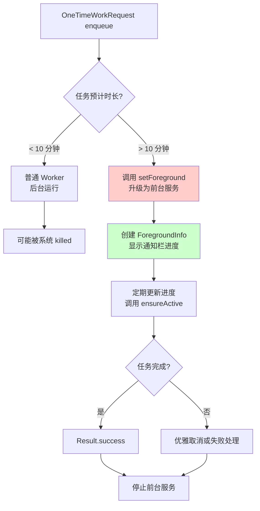
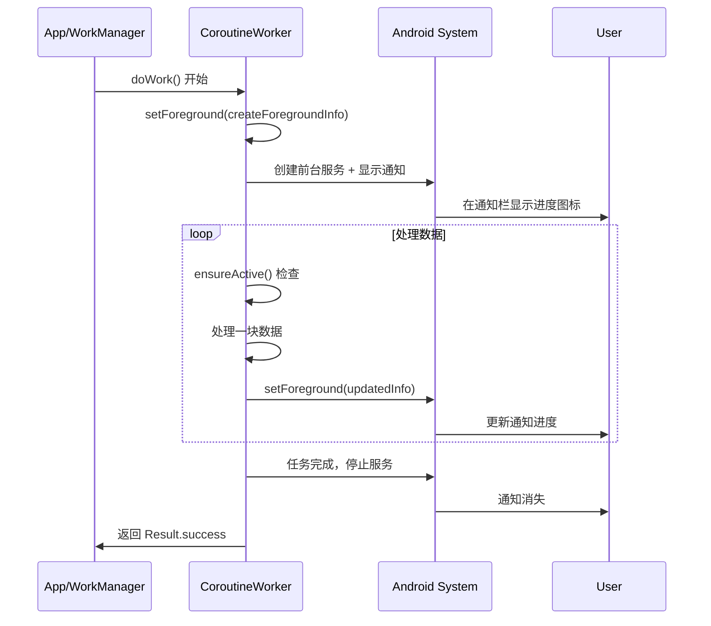
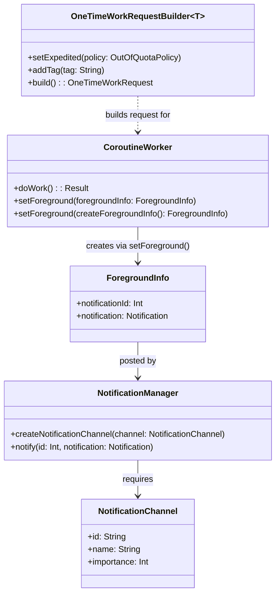

# 6.1.25 对长期工作人员的支持

秋日的阳光从树梢间漏下来，把篝火旁的草地染成一片一片的金色。

希尔把笔记本往膝盖上拍了拍，屏幕上的代码在晨光里显得有些刺眼。

"刚才那个例子，如果下载一个大文件要花一个小时呢？"洛芙抱着膝盖，眼睛还盯着希尔的屏幕，"我之前实习的时候遇到过，后台任务跑到一半就被系统杀掉了。"

"这就是今天要讲的内容了。"黛琳从背包里掏出一个保温杯，拧开盖子，热气在清晨的凉意里慢慢散开，"普通的 Worker 默认是在后台运行的，系统对后台任务的限制非常多——如果你告诉它'给我下载这个200兆的更新包'，它大概跑到一半就会说'对不起，我要睡觉了'。"

伊莎轻轻笑了一声，弯腰捡起一片刚落下的枫叶，放在手心里端详。

"那要怎么让它一直跑着呢？"洛芙追问。

黛琳把保温杯放下，从背包里又掏出一个小小的对讲机，放在大家中间的草地上。

"看这个。"她按下对讲机的侧边按钮，对讲机的屏幕上亮起一个小图标——一个正在奔跑的小人，"如果你要在营地里做一个很长的任务，比如把整个营地的地图全部画下来、或者要把所有帐篷的保温性能都测量一遍——普通的请求就像你派了一只小蚂蚁去送信，走一半可能就被风吹走了。但如果你把对讲机打开，让它一直保持着通话状态，那怕任务要花一整天，也不会轻易中断。"

"对讲机就是 Foreground Service。"希尔把屏幕转过来对着大家，代码窗口还停留在刚才的 Worker 示例上，"在 Android 里，如果一个任务预计要跑超过十分钟，你最好让它运行在前台——这样系统就知道'哦，这不是什么偷偷摸摸的偷跑任务，这是一个用户正在等着的正经工作'。"

"那 WorkManager 怎么让 Worker 变成前台服务呢？"洛芙把下巴搁在膝盖上。

希尔眨眨眼，手指在键盘上悬停了半秒。

"有请我们的超级玛丽——CoroutineWorker 的 setForeground() 方法。"

黛琳接过话头，掏出白板笔，在旁边的石头上开始画结构图。

"在 WorkManager 里，长时间运行的任务分为两种。一种是'立刻升级为前台'——你从一开始就知道这个任务会很漫长，比如同步一整年的露营日记到服务器。另一种是'运行中临时提升'——比如 Worker 跑到一半，发现数据量比预想的大得多，需要临时延长。"

"两种情况的处理方式不太一样？"洛芙问。

"对。"黛琳在白板上画了两个并排的框，"第一种，直接在 doWork() 的一开头就调用 setForeground()——这就像你出门露营的时候，直接把对讲机打开、放在桌上、告诉所有人'我现在开始通话了'。第二种，需要你主动调用 coroutineContext.ensureActive() 或者检查 isActive，然后在合适的时机调用 setForeground()——这更像是任务进行中突然发现需要更多时间，你才拿起对讲机说'不好意思，我还需要一点时间'。"

希尔清了清嗓子，把笔记本放在草地上，用几颗小石子压住四角。

"来，看代码。"

她敲下了第一行：

```kotlin
// LongRunningWorker.kt
// 依赖：androidx.work:work-runtime-ktx:2.9.0
// 运行方式：在 WorkManager 中 enqueue 一个 OneTimeWorkRequest
class LongRunningWorker(
    context: Context,
    params: WorkerParameters
) : CoroutineWorker(context, params) {

    override suspend fun doWork(): Result {
        // 如果任务预计超过 10 分钟，第一行就调用 setForeground()
        // setForeground() 是 CoroutineWorker 的 suspend 函数
        // 它会创建一个 ForegroundInfo，里面包含一个通知
        // 然后把当前 Worker 升级为前台服务运行
        setForeground(createForegroundInfo())

        // 开始正式的耗时工作
        return try {
            val totalSteps = 100
            for (step in 1..totalSteps) {
                // 每一步都检查一下协程是否还在运行
                // ensureActive() 会在协程被取消时立即抛出 CancellationException
                ensureActive()
                
                // 模拟耗时操作——比如下载一个大文件
                downloadChunk(step, totalSteps)
                
                // 每完成一步就更新一次通知进度
                setForeground(createForegroundInfo(step, totalSteps))
            }
            Result.success()
        } catch (e: CancellationException) {
            // 协程被取消时优雅退出
            Result.success()
        } catch (e: Exception) {
            Result.failure()
        }
    }

    // 创建 ForegroundInfo——告诉系统"我正在跑一个很重要的任务"
    // 通知的标题和内容会在通知栏显示，让用户知道发生了什么
    private fun createForegroundInfo(progress: Int = 0, total: Int = 100): ForegroundInfo {
        val notificationId = 1 // 通知的唯一 ID
        val channelId = "long_running_channel" // 通知渠道 ID

        // 创建通知渠道（Android 8.0+ 必须）
        val channel = NotificationChannel(
            channelId,
            "长时间运行任务",
            NotificationManager.IMPORTANCE_LOW
        ).apply {
            description = "显示正在进行的耗时任务进度"
        }

        val notificationManager = applicationContext
            .getSystemService(Context.NOTIFICATION_SERVICE) as NotificationManager
        notificationManager.createNotificationChannel(channel)

        // 构建通知本身
        val progressText = if (total > 0) "已完成 $progress / $total" else "处理中..."
        val notification = Notification.Builder(applicationContext, channelId)
            .setContentTitle("正在同步露营数据")
            .setContentText(progressText)
            .setSmallIcon(android.R.drawable.ic_popup_sync)
            .setOngoing(true) // 不可滑动删除
            .setProgress(total, progress, total == 0) // 显示进度条
            .build()

        return ForegroundInfo(notificationId, notification)
    }

    private suspend fun downloadChunk(step: Int, total: Int) {
        // 模拟下载一个数据块
        delay(100) // 100ms 模拟网络请求
    }
}
```

"哇……"洛芙凑近屏幕，"这个 setForeground() 好方便啊，一行就搞定了。"

"但这只是一半。"希尔把笔记本往上推了推，自己往后一仰，躺在了草地上，双手枕在脑后，"还有一件事你必须做——在 AndroidManifest.xml 里声明权限。"

伊莎把手里那片枫叶轻轻放在笔记本上，红色的叶尖正好点在代码的某一行。

"普通的后台任务只需要 `RECEIVE_BOOT_COMPLETED` 或者 `INTERNET` 就够了，"伊莎的声音轻轻的，像在念一段古老的歌谣，"但如果你的 Worker 要升级为前台服务，你必须告诉系统——'我会占用用户的屏幕一段时间'，这个告知的动作就叫声明权限。"

希尔翻身坐起来，从希尔薇亚——她那个永远鼓鼓囊囊的露营背包——里掏出一张叠得整整齐齐的纸。

"这是 AndroidManifest.xml 的模板。"

```xml
<!-- AndroidManifest.xml -->
<manifest xmlns:android="http://schemas.android.com/apk/res/android">

    <!-- 基础 WorkManager 权限 -->
    <uses-permission android:name="android.permission.INTERNET" />
    
    <!-- 如果使用 BootStrap 1K+ 的引导方式 -->
    <uses-permission android:name="android.permission.RECEIVE_BOOT_COMPLETED" />

    <!-- 长运行 Worker 的核心权限：前台服务 -->
    <!-- 没有这个权限，setForeground() 会抛 SecurityException -->
    <uses-permission android:name="android.permission.FOREGROUND_SERVICE" />
    
    <!-- 如果是数据同步类型的前台服务（Android 14+） -->
    <uses-permission android:name="android.permission.FOREGROUND_SERVICE_DATA_SYNC" />

    <application
        android:name=".MyApp"
        android:allowBackup="true"
        ...>

        <activity android:name=".MainActivity" />
        
        <!-- 如果需要在开机后恢复长运行任务，还需要声明这个 Receiver -->
        <receiver
            android:name="androidx.work.impl.background.systemalarm.ConstraintProxy$BatteryNotLowProxy"
            android:enabled="true"
            android:exported="false" />
            
    </application>
</manifest>
```

"等等，"洛芙皱起眉头，"`FOREGROUND_SERVICE_DATA_SYNC` 是什么？我以为一个 `FOREGROUND_SERVICE` 就够了。"

黛琳接过话头，用白板笔在刚才的结构图旁边画了一个小标注。

"这是 Android 14 也就是 API 34 引入的新规定。"她的声音变得认真了一些，"从这一版开始，Google 把前台服务分成了很多种类——数据同步、位置更新、摄像头、麦克风、connected device 等等。你必须根据 Worker 实际在做什么事情，声明对应的前台服务类型。否则系统会拒绝启动你的前台服务。"

她一口气在白板上画了一排小格子：

| 前台服务类型 | 权限 | 适用场景 |
|---|---|---|
| `dataSync` | FOREGROUND_SERVICE_DATA_SYNC | 同步数据、上传下载文件 |
| `location` | FOREGROUND_SERVICE_LOCATION | GPS 定位、导航 |
| `camera` | FOREGROUND_SERVICE_CAMERA | 拍照、录像 |
| `microphone` | FOREGROUND_SERVICE_MICROPHONE | 录音 |
| `connectedDevice` | FOREGROUND_SERVICE_CONNECTED_DEVICE | 管理手表、耳机等设备 |
| `mediaPlayback` | FOREGROUND_SERVICE_MEDIA_PLAYBACK | 音乐、视频播放 |
| `phoneCall` | FOREGROUND_SERVICE_PHONE_CALL | 通话 |

"所以如果我的 Worker 是要同步露营数据到服务器，"洛芙掰着手指头，"我就需要 `FOREGROUND_SERVICE_DATA_SYNC` 对吧？"

"完全正确。"希尔点头，"而且要注意的是，即使你在代码里调用了 `setForeground()`，如果你没有在 Manifest 里声明对应的权限，系统会在运行时报 `SecurityException`——说'你没有权限启动前台服务'。"

"这就好像你拿着对讲机，却没有领使用许可证。"伊莎轻声补充，"电台会直接切断你的信号。"

洛芙"噗"地笑出声。

"那如果我在 Android 13 或者更低的版本上开发呢？"洛芙继续问。

黛琳重新拿起保温杯，抿了一口热水。

"Android 13 以下，只需要一个 `FOREGROUND_SERVICE` 权限就够了，不需要细分类型。但最佳实践是——如果你的 app 要同时覆盖新旧版本，你应该在代码里检查系统版本，然后按需声明。"

希尔敲了敲笔记本的边框，示意大家看屏幕。

```kotlin
// 根据 Android 版本选择合适的前台服务类型
private fun getForegroundServiceType(): Int {
    return if (Build.VERSION.SDK_INT >= Build.VERSION_CODES.UPSIDE_DOWN_CAKE) {
        // Android 14+ (API 34) 需要明确的前台服务类型
        // 本例是数据同步类型
        ServiceInfo.FOREGROUND_SERVICE_TYPE_DATA_SYNC
    } else {
        // Android 13 及以下不需要指定类型
        0
    }
}

// 在 Manifest 中需要这样声明（Android 14+）：
/*
<service
    android:name="androidx.work.impl.foreground.SystemForegroundService"
    android:foregroundServiceType="dataSync"
    android:exported="false" />
*/
```

"这里 UPSIDE_DOWN_CAKE 是 Android 14 的内部代号。"希尔指着代码里的常量解释，"Google 每次都用甜点的名字来命名 Android 版本——Android 14 是 Upside Down Cake（颠倒蛋糕）。写代码的时候查一下 API Level 对照表就行。"

"甜点……"洛芙嘀咕着，"Android 10 叫什么来着？"

"Android 10 已经没有甜点代号了，"黛琳说，"从那以后就直接用数字。"

希尔又敲了几行代码。

"现在我们来说说另一种情况——在 Worker 运行的中间临时升级为前台。"

她新建了一个代码块：

```kotlin
// ConditionalLongRunningWorker.kt
// 这个 Worker 会根据数据量动态决定是否需要升级为前台服务
class ConditionalLongRunningWorker(
    context: Context,
    params: WorkerParameters
) : CoroutineWorker(context, params) {

    override suspend fun doWork(): Result {
        // 第一步：先检查数据量
        val dataSize = checkDataSize()
        
        // 如果数据量超过阈值（比如 10MB），立即升级为前台服务
        val shouldRunAsForeground = dataSize > 10 * 1024 * 1024 // 10MB
        
        if (shouldRunAsForeground) {
            // 临时提升为前台服务
            setForeground(createForegroundInfo(0, 100))
        }

        return try {
            processData(dataSize) { progress ->
                // 在处理过程中，每隔一段时间更新一次进度通知
                if (shouldRunAsForeground) {
                    setForeground(createForegroundInfo(progress, 100))
                }
                // 同时检查协程是否被取消
                ensureActive()
            }
            Result.success()
        } catch (e: CancellationException) {
            Result.success()
        } catch (e: Exception) {
            if (shouldRunAsForeground) {
                // 即使失败，也要记得停止前台服务
                // 这里可以发送一个"任务失败"的通知
                notifyFailure()
            }
            Result.failure()
        }
    }

    // 检查数据大小
    private suspend fun checkDataSize(): Int {
        delay(100) // 模拟异步检查
        // 实际场景中这里会查询本地数据库或服务器
        return (1..50).random() * 1024 * 1024 // 返回 1-50 MB 随机
    }

    // 处理数据
    private suspend fun processData(
        totalBytes: Int,
        onProgress: suspend (Int) -> Unit
    ) {
        val chunkSize = 1024 * 1024 // 每块 1MB
        var processedBytes = 0
        
        while (processedBytes < totalBytes) {
            delay(100) // 模拟处理每 1MB 的时间
            processedBytes += chunkSize
            val progress = (processedBytes * 100 / totalBytes).coerceAtMost(100)
            onProgress(progress)
        }
    }

    private fun createForegroundInfo(progress: Int, total: Int): ForegroundInfo {
        // ... 同上，省略实现
        val notificationId = 2
        // 简化版通知
        return ForegroundInfo(
            notificationId,
            Notification.Builder(applicationContext, "long_running_channel")
                .setContentTitle("正在处理露营数据")
                .setContentText("已完成 ${progress}%")
                .setSmallIcon(android.R.drawable.ic_popup_sync)
                .setProgress(total, progress, false)
                .build()
        )
    }

    private fun notifyFailure() {
        val notificationManager = applicationContext
            .getSystemService(Context.NOTIFICATION_SERVICE) as NotificationManager
        notificationManager.notify(
            2,
            Notification.Builder(applicationContext, "long_running_channel")
                .setContentTitle("数据处理失败")
                .setContentText("请稍后重试")
                .setSmallIcon(android.R.drawable.ic_dialog_alert)
                .build()
        )
    }
}
```

"这里有一个关键点，"希尔的手指在屏幕上点着，"`ensureActive()` 每一次循环都要调用，它的作用是检查当前协程是否已经被取消。如果 WorkManager 因为系统资源紧张取消了你的 Worker，你却还在傻乎乎地继续循环处理数据，那就会浪费很多资源。`ensureActive()` 就像一个检查点——每次处理完一小步，都要问一下'我还可以继续吗？'"

"而且要注意，`setForeground()` 不是调用一次就完事了，"黛琳补充道，"如果你想更新通知栏里显示的进度，每一次进度变化都要重新调用一次。这在代码里看起来有点啰嗦，但这是让用户知道任务还在正常进行的唯一方式。"

伊莎把手里那片枫叶翻了个面，对着阳光看了看。

"对用户来说，通知栏里的小图标就是他们和 Worker 之间唯一的联系。"她的声音轻轻的，"如果通知一直停在'已完成 0%'，用户就会开始焦虑——'这个 app 是不是卡住了？''我要不要杀掉它？'——然后他们就会真的杀掉你的 app。"

"所以一定要记得更新进度。"希尔把代码框往下滚了滚，"每处理完一小块数据，就调用一次 `setForeground(createForegroundInfo(newProgress, totalSteps))`，这样通知栏里的进度条才会跟着动。"

洛芙把下巴埋进手臂里，盯着希尔的屏幕看了好一会儿。

"我好像明白了……"她慢慢地说，"Foreground Service 就像是对讲机——你得一直保持着通话状态，让对方（系统）知道你还在工作。而且每隔一会儿还要报告一下进度，不然对方就会以为你已经挂了。"

"这个比喻非常准确。"黛琳点头。

希尔啪地合上笔记本，往后一仰，又躺回了草地上。

"来一个完整的例子吧，"她望着头顶穿过树叶的天空，"把 Long-Running Worker 的 enqueue 方式也写一下。"

```kotlin
// MainActivity.kt 或者任意发起 WorkRequest 的地方
class MainActivity : AppCompatActivity() {
    
    private lateinit var workManager: WorkManager

    override fun onCreate(savedInstanceState: Bundle?) {
        super.onCreate(savedInstanceState)
        workManager = WorkManager.getInstance(applicationContext)
        
        // 发起一个长时间运行的 OneTimeWorkRequest
        val longWorkRequest = OneTimeWorkRequestBuilder<LongRunningWorker>()
            .setExpedited(OutOfQuotaPolicy.RUN_AS_NON_EXPEDITED_WORK_REQUEST)
            // 注意：如果你的 Worker 会超过 10 分钟，Google Play 政策要求使用
            // setExpedited() 并设置 OutOfQuotaPolicy
            // 否则可能会被 Google Play 拒绝上架
            .addTag("long_running_sync")
            .build()

        workManager.enqueue(longWorkRequest)
        
        // 观察工作状态
        workManager.getWorkInfoByIdLiveData(longWorkRequest.id)
            .observe(this) { workInfo ->
                when (workInfo?.state) {
                    WorkInfo.State.RUNNING -> {
                        Log.d("MainActivity", "Worker 正在运行")
                    }
                    WorkInfo.State.SUCCEEDED -> {
                        Log.d("MainActivity", "Worker 成功完成")
                    }
                    WorkInfo.State.FAILED -> {
                        Log.d("MainActivity", "Worker 执行失败")
                    }
                    else -> {}
                }
            }
    }
}
```

"这里有一个坑，"希尔又坐起来，表情变得认真了，"如果你在 Google Play 上架 app，并且你的 Worker 会运行超过 10 分钟，你必须使用 `setExpedited()` 并且设置 `OutOfQuotaPolicy.RUN_AS_NON_EXPEDITED_WORK_REQUEST`。否则 Google Play 的审核政策会认为你在滥用前台服务，直接把你的 app 打回来。"

"等等，"洛芙举起手，"`setExpedited()` 不是用来加速任务的吗？怎么和长任务混在一起了？"

黛琳笑着摇摇头。

"`setExpedited()` 的本意确实是让任务尽快执行，但对于超过 10 分钟的长任务，Google 要求必须同时标记为 expedited——这是为了区分'紧急任务'和'偷偷摸摸在后台跑的任务'。如果你不标记，系统可能会把你的 app 当作在消耗用户电量的恶意软件。"

希尔把最后一段代码也敲完了，长长地呼出一口气。

"好了，总结一下今天的内容。"

她掏出白板笔，在另一块干净的石头上一边画一边说：

"第一，超过 10 分钟的任务，需要调用 `setForeground()` 把 Worker 升级为前台服务。第二，`CoroutineWorker` 的 `setForeground()` 是一个 suspend 函数，调用后会创建一个 `ForegroundInfo`，里面包含一个会在通知栏显示的通知。第三，Android 14+ 需要在 Manifest 里声明 `FOREGROUND_SERVICE` 加上对应的前台服务类型权限，比如 `FOREGROUND_SERVICE_DATA_SYNC`。第四，进度变化时要重复调用 `setForeground()` 来更新通知栏。第五，如果要在 Google Play 上架，超过 10 分钟的任务必须使用 `setExpedited()`。"

她的手指在石头上画出的白板图：



"图 1 对应代码中的 `setForeground()` 调用，"希尔指了指白板，"这个流程图展示了系统决定是否需要前台服务的判断逻辑。"

然后她又在旁边画了第二个图：



"图 2 对应的是 Worker 和系统之间的交互时序，"希尔说，"从调用 `setForeground()` 的那一刻起，用户就能够在通知栏看到你的任务进度——这就是为什么进度更新很重要的原因。"

洛芙盯着第二个图看了一会儿。

"所以整个过程就是——Worker 告诉系统'我要开始跑一个很长的任务了，请帮我保持运行'，系统说'好的，我给你开个前台服务的席位，但你要在通知栏挂着，让我和用户都知道你在干什么'，然后 Worker 就开始跑，每跑一段就更新一下通知。"

"没错，"黛琳微笑着点头，"而且系统会尊重这个约定——只要通知还挂着，前台服务就不会被轻易杀掉。"

伊莎从草地上站起来，拍了拍裙子上的草屑。

"其实在露营里也是一样的。"她望向远处的白马岳，山顶的岩石在秋日的阳光下闪着金光，"如果你要搭建一个很大的帐篷——大到需要花一整天的那种——你最好一开始就告诉所有人'我现在开始搭这个帐篷了，中途不要收营'，并且每隔几个小时就大声报告一下进度。这样即使天色暗了下来，大家也会等你把帐篷搭完，而不是直接拔营走人。"

"这个比喻比代码还好懂……"洛芙小声嘀咕。

大家都笑了起来。

希尔的肚子在这时候叫了一声。

"好吧，"她从草地上跳起来，拍了拍手，"理论和代码都讲完了。现在的问题是——我们的早饭在哪里？"

她望了一眼远处的营火，火焰已经只剩下暗红色的余烬在冒着细细的青烟。

"我觉得我们可以先做个早餐，"伊莎说，"边吃边把今天的内容再过一遍。"

"同意，"黛琳把白板笔收回笔袋，"我去生火，希尔和洛芙负责准备食材。"

"等等，"洛芙突然想起什么，"我还不知道今天的练习是什么！"

"急什么，"希尔已经从背包里掏出了便携炉，"先吃饭，练习题下午再说。"

"可是我怕我吃完就忘了……"

"忘不了，"黛琳的声音从营火那边传来，"我们下午会出三道练习题，涵盖今天的所有知识点。而且——"

她转过头，对着洛芙眨了眨眼。

"如果你写不出来，就罚你在营地里多搭三个帐篷。"

洛芙的脸一下子垮了下来。

希尔把炉子点着，蓝色的火焰在晨风里轻轻跳动。

"开玩笑的，"她说，"我出的题不会太难的——前提是你上课认真听了。"

她把头转向洛芙，眼睛里带着一点狡黠的笑意。

"所以——今天的内容，你记住了吗？"

洛芙认真地回想起刚才的每一个细节：setForeground()、ForegroundInfo、通知栏、FOREGROUND_SERVICE 权限、Android 14 的类型细分、ensureActive()、setExpedited()……

"记住了！"她挺起胸膛，"超过十分钟的任务要用前台服务！"

"很好。"黛琳的声音从营火旁飘过来，"那就把这个也记住——"

她的声音混在火焰燃烧的轻微噼啪声中。

"技术只是工具，怎么让用户安心，才是使用这些工具的最终目的。"

枫叶从枝头飘落，在空中打了几个旋儿，落在洛芙的膝盖上。

她捡起那片叶子，看了看它漂亮的红色，然后把叶子小心地夹进了笔记本里。

又一个秋日的早晨，在白马村的露营地里，慢慢地过去了。

---

## 专业技术总结

### 核心机制定义

**Long-Running Worker**：指预计执行时间超过 10 分钟的后台任务。由于 Android 系统对后台任务的资源限制，WorkManager 需要通过前台服务（Foreground Service）来确保这类任务能够完整执行，而不会被系统因资源紧张而杀死。

**Foreground Service**：一种特殊类型的 Android Service，运行在前台并与用户可见的通知栏绑定。系统对前台服务的约束较少，会保障其拥有足够的 CPU 时间和网络资源。用户可以随时通过通知栏了解前台服务的运行状态。

**ForegroundInfo**：WorkManager 提供的封装类，包含通知栏中显示的 Notification 对象和对应的通知 ID。创建 ForegroundInfo 是将 Worker 提升为前台服务的必要步骤。

### 结构图



#### 复杂度与影响

| 场景 | 性能影响 | 内存影响 | 用户感知 |
|---|---|---|---|
| 普通 Worker（< 10 分钟） | 低 | 低 | 无通知 |
| 长运行 Worker（前台服务） | 高（系统保障资源） | 与任务相关 | 通知栏常驻，显示进度 |
| 未使用 setForeground() 的长任务 | 随时可能被杀死 | 资源浪费 | 任务可能中途消失 |

### 反模式与陷阱

1. **在 doWork() 中执行耗时操作但不调用 setForeground()**  
   修复：对于预计超过 10 分钟的任务，在 doWork() 开头立即调用 `setForeground(createForegroundInfo())`

2. **忘记在 Manifest 中声明 FOREGROUND_SERVICE 权限**  
   修复：添加 `<uses-permission android:name="android.permission.FOREGROUND_SERVICE" />`；Android 14+ 额外添加 `<uses-permission android:name="android.permission.FOREGROUND_SERVICE_DATA_SYNC" />`

3. **进度变化后不更新通知栏**  
   修复：每次进度更新时重新调用 `setForeground(createForegroundInfo(newProgress, total))`，让用户看到进度条前进

4. **不在循环中调用 ensureActive()**  
   修复：在每个循环迭代内部调用 `ensureActive()`，确保协程被取消时能立即退出，避免资源浪费

5. **Google Play 上架时未使用 setExpedited()**  
   修复：使用 `.setExpedited(OutOfQuotaPolicy.RUN_AS_NON_EXPEDITED_WORK_REQUEST)` 标记长任务以符合 Play 政策

### 名词小传

**Foreground Service**：由 Android 系统定义的服务类型，运行在前台并必须显示持续性通知。与普通后台服务不同，系统会为前台服务保留 CPU 和网络资源，不会轻易将其杀死。该机制的设计初衷是让长时间运行的重要任务（如导航、音乐播放、文件同步）能够可靠完成，同时让用户始终了解这些任务的存在。

### 设计哲学

**用户知情权优先**：长时间运行的任务会占用设备资源，Foreground Service 机制强制开发者向用户展示任务状态，这是对用户知情权和设备控制权的保障。

**资源使用的透明度**：前台服务必须显示通知栏，这一设计确保了用户能够监控哪些应用在消耗系统资源，从而做出是否终止的决策。

**渐进式优雅降级**：WorkManager 允许 Worker 在运行过程中根据实际情况（如数据量超出预期）动态决定是否需要升级为前台服务，而非强制要求开发者在任务开始前就做出所有判断。

**防止滥用**：Google Play 政策要求超过 10 分钟的前台任务必须使用 setExpedited()，这一约束既是为了区分"正当的长任务"和"恶意后台行为"，也是为了维护整个 Android 生态的电池续航体验。

---

#### 🏕️ 动手练习

**项目概览**：构建一个"露营日记同步 App"，用户可以在 App 中编写每日露营日记（文字 + 图片），App 会在后台自动将日记同步到服务器。由于日记可能包含多张图片，同步过程可能超过 10 分钟，需要使用 Long-Running Worker 实现。

**方式 B：独立练习制**

##### Task 1 - 创建通知渠道（★）

**目标**：在 Android 8.0+ 系统上创建通知渠道，为后续的前台服务通知做准备。

**你需要做的事**：
1. 创建一个新的 Android 项目（minSdk 26+）
2. 在 Application 类或 Activity 中创建通知渠道 `camping_diary_sync`，重要性设为 `IMPORTANCE_LOW`
3. 为渠道设置名称"日记同步"和描述"显示露营日记的同步进度"

**验收标准**：
- [ ] 应用启动后不崩溃
- [ ] Logcat 中能看到 "Notification channel created" 日志
- [ ] 设备设置中能看到新创建的通知渠道

**提示**：
```kotlin
// 在 Application 或 Activity 中
private fun createNotificationChannel() {
    val channel = NotificationChannel(
        "camping_diary_sync", // channel ID
        "日记同步",           // 渠道名称
        NotificationManager.IMPORTANCE_LOW // 重要性
    ).apply {
        description = "显示露营日记的同步进度"
    }
    val notificationManager = getSystemService(Context.NOTIFICATION_SERVICE) as NotificationManager
    notificationManager.createNotificationChannel(channel)
    Log.d("CampingApp", "Notification channel created")
}
```

##### Task 2 - 实现普通 Worker（★★）

**目标**：实现一个不使用前台服务的普通 Worker，用于同步小数据量（< 10 分钟）的日记。

**你需要做的事**：
1. 创建 `DiarySyncWorker : CoroutineWorker`
2. 在 `doWork()` 中模拟同步过程（使用 `delay()` 模拟网络请求）
3. 循环 10 次，每次延迟 500ms，打印 Log
4. 不使用 `setForeground()`

**验收标准**：
- [ ] Worker 能够成功 enqueue 并执行
- [ ] Logcat 中能看到 "Syncing diary chunk X/10" 日志
- [ ] 如果数据量小，Worker 能够顺利完成

**提示**：
```kotlin
// DiarySyncWorker.kt
class DiarySyncWorker(
    context: Context,
    params: WorkerParameters
) : CoroutineWorker(context, params) {

    override suspend fun doWork(): Result {
        Log.d("DiarySync", "Starting diary sync")
        repeat(10) { step ->
            delay(500) // 模拟每块数据的同步时间
            Log.d("DiarySync", "Syncing diary chunk ${step + 1}/10")
        }
        Log.d("DiarySync", "Diary sync completed")
        return Result.success()
    }
}
```

##### Task 3 - 添加前台服务支持（★★★★）

**目标**：将 Task 2 中的 Worker 改造为支持前台服务，添加 `setForeground()` 调用和进度通知。

**你需要做的事**：
1. 修改 `DiarySyncWorker`，在 `doWork()` 开头调用 `setForeground(createForegroundInfo(0, 100))`
2. 实现 `createForegroundInfo(progress: Int, total: Int): ForegroundInfo` 方法
3. 在每次循环迭代结束后调用 `setForeground(createForegroundInfo(newProgress, 100))` 更新进度
4. 在 Manifest 中添加 `FOREGROUND_SERVICE` 权限

**验收标准**：
- [ ] 通知栏显示"正在同步露营日记"
- [ ] 进度条从 0% 增长到 100%
- [ ] Worker 执行期间通知一直存在

**提示**：
```kotlin
// 在 doWork() 开头
setForeground(createForegroundInfo(0, 100))

// 在循环中
repeat(10) { step ->
    ensureActive() // 检查协程是否被取消
    delay(500)
    val progress = ((step + 1) * 100 / 10)
    setForeground(createForegroundInfo(progress, 100))
}
```

##### Task 4 - 添加动态前台服务升级（★★★★★）

**目标**：实现"临时提升"模式——Worker 先以普通方式运行，根据数据量决定是否需要升级为前台服务。

**你需要做的事**：
1. 创建 `ConditionalSyncWorker`
2. 在 `doWork()` 开头先检查数据量（模拟方法，返回随机大小）
3. 如果数据量超过阈值（假设 5MB），调用 `setForeground()` 升级
4. 处理完成后，无论成功还是失败，都要确保前台服务正确停止
5. 添加 `ensureActive()` 检查

**验收标准**：
- [ ] 数据量小时，通知栏不显示通知
- [ ] 数据量大时，临时弹出通知栏并显示进度
- [ ] 任务完成后通知消失

**提示**：
```kotlin
override suspend fun doWork(): Result {
    val dataSizeKB = checkDataSize() // 返回 KB 为单位的数据量
    
    val shouldUpgrade = dataSizeKB > 5 * 1024 // 超过 5MB
    
    if (shouldUpgrade) {
        setForeground(createForegroundInfo(0, 100))
    }
    
    return try {
        syncData(dataSizeKB) { progress ->
            if (shouldUpgrade) {
                ensureActive()
                setForeground(createForegroundInfo(progress, 100))
            }
        }
        Result.success()
    } catch (e: CancellationException) {
        Result.success()
    } catch (e: Exception) {
        Result.failure()
    }
}
```

##### Task 5 - Android 14 权限适配（★★★★）

**目标**：适配 Android 14 的前台服务类型声明要求。

**你需要做的事**：
1. 在 Manifest 中同时声明 `FOREGROUND_SERVICE` 和 `FOREGROUND_SERVICE_DATA_SYNC`
2. 在 WorkManager 的 `work-runtime-ktx` 依赖版本更新到 2.9.0+（支持 Android 14）
3. 添加运行时权限检查，在 Android 14+ 设备上请求 `POST_NOTIFICATIONS` 权限

**验收标准**：
- [ ] Manifest 中正确声明了两种前台服务权限
- [ ] Android 14+ 设备上首次运行时会弹出通知权限请求对话框
- [ ] Android 14 以下设备正常运行

**提示**：
```xml
<!-- AndroidManifest.xml -->
<uses-permission android:name="android.permission.FOREGROUND_SERVICE" />
<uses-permission android:name="android.permission.FOREGROUND_SERVICE_DATA_SYNC" />
```
```kotlin
// 权限请求
if (Build.VERSION.SDK_INT >= Build.VERSION_CODES.TIRAMISU) {
    requestPermissions(arrayOf(Manifest.permission.POST_NOTIFICATIONS), 1001)
}
```

##### Task 6 - 添加 WorkRequest 观察者（★★）

**目标**：在 Activity/Fragment 中观察 WorkRequest 的执行状态，实时更新 UI。

**你需要做的事**：
1. 创建 `OneTimeWorkRequestBuilder<LongRunningWorker>()` 并 enqueue
2. 使用 `WorkManager.getWorkInfoByIdLiveData()` 观察状态变化
3. 在 Activity 中更新 UI 文字以反映当前 Worker 状态（RUNNING / SUCCEEDED / FAILED）

**验收标准**：
- [ ] UI 能正确显示 Worker 当前状态
- [ ] Worker 完成后 UI 更新为"已完成"
- [ ] 旋转屏幕后观察者依然有效

**提示**：
```kotlin
val workRequest = OneTimeWorkRequestBuilder<LongRunningWorker>().build()
WorkManager.getInstance(this).enqueue(workRequest)

WorkManager.getInstance(this)
    .getWorkInfoByIdLiveData(workRequest.id)
    .observe(this) { workInfo ->
        when (workInfo?.state) {
            WorkInfo.State.RUNNING -> statusText.text = "同步中..."
            WorkInfo.State.SUCCEEDED -> statusText.text = "已完成"
            WorkInfo.State.FAILED -> statusText.text = "同步失败"
            else -> statusText.text = "等待中"
        }
    }
```

##### Task 7 - 处理取消和错误（★★★★）

**目标**：确保 Worker 在被取消或遇到错误时能够优雅退出，并通知用户。

**你需要做的事**：
1. 在 Worker 中捕获 `CancellationException` 并返回 `Result.success()`
2. 捕获其他异常时返回 `Result.failure()`
3. 在 `onFailure()` 或 `onStopped()` 时发送"同步失败"通知
4. 使用 `isStopped` 属性检查 Worker 是否已被停止

**验收标准**：
- [ ] 在 Logcat 中能看到 "Worker cancelled" 日志
- [ ] 使用 `WorkManager.cancelWorkById()` 取消任务后，Worker 优雅退出
- [ ] 取消后系统通知栏不残留"僵尸"通知

**提示**：
```kotlin
override suspend fun doWork(): Result {
    return try {
        // ... 执行任务
        Result.success()
    } catch (e: CancellationException) {
        Log.d("DiarySync", "Worker cancelled")
        Result.success() // 取消时返回 success 表示"已经收拾好了"
    } catch (e: Exception) {
        Log.e("DiarySync", "Worker failed", e)
        Result.failure()
    }
}

override fun onStopped() {
    super.onStopped()
    // 清理资源，如取消网络请求、关闭数据库连接等
    Log.d("DiarySync", "Worker onStopped - cleaning up")
}
```

##### Task 8 - 完整 WorkManager 配置（★★★）

**目标**：配置 WorkManager 的全局设置，包括重试策略和后台调度约束。

**你需要做的事**：
1. 使用 `setBackoffCriteria()` 设置指数退避重试策略
2. 添加 `setConstraints()`：要求网络连接、不节电模式
3. 使用 `setInitialDelay()` 模拟"非紧急同步"
4. 将 WorkRequest 添加到唯一工作链中（使用 `beginUniqueWork()`）

**验收标准**：
- [ ] 任务失败后自动重试，间隔时间递增
- [ ] 无网络时任务不会执行
- [ ] 唯一工作链确保同时只有一个同步任务在运行

**提示**：
```kotlin
val constraints = Constraints.Builder()
    .setRequiredNetworkType(NetworkType.CONNECTED)
    .setRequiresBatteryNotLow(true)
    .build()

val syncRequest = OneTimeWorkRequestBuilder<LongRunningWorker>()
    .setBackoffCriteria(
        BackoffPolicy.EXPONENTIAL,
        30,
        TimeUnit.SECONDS
    )
    .setConstraints(constraints)
    .setInitialDelay(60, TimeUnit.SECONDS) // 延迟 1 分钟开始
    .build()

WorkManager.getInstance(this).beginUniqueWork(
    "diary_sync_work",
    ExistingWorkPolicy.REPLACE, // 新的替换旧的
    syncRequest
).enqueue()
```

---

**面试热身**（用自己的话回答）

Q1：什么情况下应该将 Worker 提升为前台服务？不提升会有什么后果？  
Q2：描述 `ForegroundInfo` 的作用，以及它和 Notification 的关系。  
Q3：Android 14 对前台服务做了哪些新的限制？开发者需要如何适配？  
Q4：在 Worker 的循环中为什么要调用 `ensureActive()`？不调用会有什么风险？  
Q5：解释 `setExpedited()` 在 Long-Running Worker 场景下的作用，以及它和普通 expedited work 的区别。

---

#### 参考实现要点

1. **优先判断任务时长**：如果从一开始就确定任务会超过 10 分钟，在 `doWork()` 第一行就调用 `setForeground()`，不要等到运行时才升级。

2. **进度更新要频繁**：对于同步类任务，每处理完一小块数据（文件块、图片、数据库记录）就更新一次通知进度，用户需要看到进度条在移动才能安心等待。

3. **Manifest 权限先加**：开发初期就在 Manifest 中加上 `FOREGROUND_SERVICE` 权限（Android 14+ 还要加上类型权限），避免运行时才发现 `SecurityException`。

4. **`ensureActive()` 不可或缺**：在所有 `while` / `repeat` 循环内部调用，它能确保 Worker 被取消时协程能立即退出，而不是继续消耗资源。

5. **优雅处理取消**：取消时返回 `Result.success()` 而不是 `Result.failure()`——取消不是失败，只是不再需要继续了。同一个 WorkRequest 如果需要再次执行，重新 enqueue 即可。

---

> 学习建议
>
> Long-Running Worker 的核心是"让用户知道、让系统放行"。每一个 `setForeground()` 调用背后，都对应着一个用户在等待的任务——通知栏里的进度条是你们和用户之间的唯一桥梁。今天学的内容建议配合 Android Studio 的 App Inspection 工具实际观察前台服务的生命周期，加深理解。

## 洛芙的小小日记本

今天学的东西好多……setForeground()、ForegroundInfo、ensureActive()，还有 Android 14 的那些新权限。伊莎说"通知栏是用户和 Worker 之间唯一的联系"，我想了想，觉得不只是露营日记同步——做任何事情都是这样吧，要让别人知道你在做什么、做到哪一步了，不然人家就会以为你消失了。

下午要去写练习题了，希望能一遍过！不然真的要搭三个帐篷……

## 今日关键词

**Foreground Service**：前台服务，一种 Android Service 类型，运行在前台并必须显示持续性通知。系统会为前台服务保障资源，不会轻易将其杀死。

**ForegroundInfo**：WorkManager 封装的通知信息类，包含通知 ID 和 Notification 对象，用于在通知栏显示 Worker 的运行状态和进度。

**setForeground()**：CoroutineWorker 的扩展函数（suspend 函数），调用后会将当前 Worker 提升为前台服务运行，同时在通知栏显示 ForegroundInfo 中的通知。

**setForegroundAsync()**：ListenableWorker 的方法，与 CoroutineWorker.setForeground() 类似，用于将 Worker 提升为前台服务，但返回 ListenableFuture。

**ensureActive()**：协程库提供的扩展函数，用于检查当前协程是否已被取消或失败。如果是，会立即抛出 CancellationException，让协程快速退出。

**FOREGROUND_SERVICE**：Android 权限常量，表示应用将使用前台服务。必须先在 Manifest 中声明此权限才能启动前台服务。

**FOREGROUND_SERVICE_DATA_SYNC**：Android 14 引入的前台服务类型权限，用于数据同步类的长任务（如文件上传下载、数据备份）。

**OutOfQuotaPolicy**：WorkManager 的枚举类，用于指定当 expedited work 超出配额时的处理策略。`RUN_AS_NON_EXPEDITED_WORK_REQUEST` 表示回退为普通工作请求。

**NotificationChannel**：Android 8.0+ 的通知渠道机制，每个渠道都有独立的名称、重要性等级和用户可见的设置选项。创建通知前必须先创建对应的渠道。

**ExistingWorkPolicy**：WorkManager 的策略枚举，控制如何处理同一个唯一工作名称下已有的 WorkRequest。`REPLACE` 表示用新的替换旧的。

**BackoffPolicy**：重试策略枚举，`EXPONENTIAL` 表示指数退避（每次重试间隔翻倍），`LINEAR` 表示线性增长。

**CancellationException**：协程库提供的异常类型，当协程被取消时会在挂起点抛出。捕获此异常后应优雅清理资源并退出。

**WorkInfo.State**：WorkManager 中工作请求的状态枚举，包括 `ENQUEUED`、`RUNNING`、`SUCCEEDED`、`FAILED`、`BLOCKED`、`CANCELLED`、`RUNNING`。

**CoroutineWorker**：WorkManager 提供的基于 Kotlin 协程的 Worker 基类，支持 suspend 函数，比 ListenableWorker 更适合 Kotlin 项目。

**ListenableWorker**：WorkManager 的抽象基类，基于 ListenableFuture，适合 Java 项目或需要与 RxJava 集成时使用。

**ServiceInfo.FOREGROUND_SERVICE_TYPE_DATA_SYNC**：Android 14+ 前台服务的类型标识，用于表示数据同步类服务。
