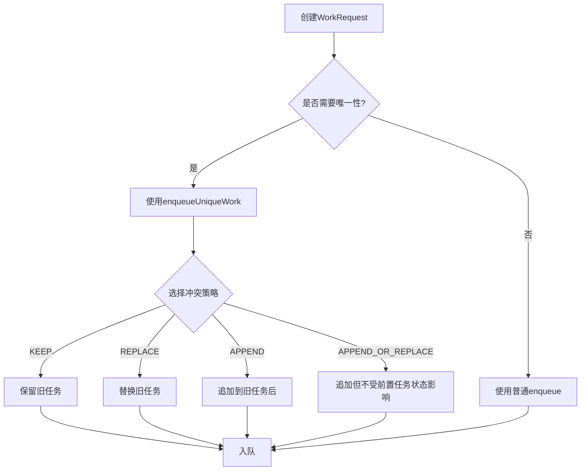
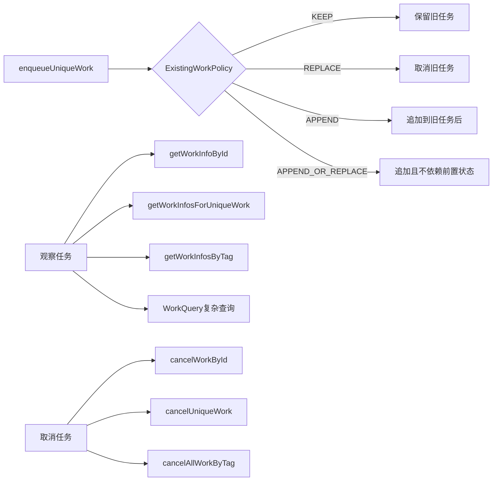

# 6.1.26 管理工作

日头渐渐升高了。

篝火已经燃得很旺，希尔在火堆旁支起了一个小铁架，把早上没吃完的贝果切成两半架在上面烤。洛芙捧着自己那杯已经温了的热可可，目光却落在黛琳的笔记本电脑屏幕上——上面显示着她们正在开发的露营笔记App。

"所以，"洛芙放下杯子，指着屏幕上的日志上传提示，"我昨天写完那个日志同步Worker之后，今天早上又打开App试了一下——结果日志被上传了两次？"

"两次？"伊莎凑过来看了看。

"不对，好像是三次……"洛芙挠了挠头，"我每次打开App都点了一下同步按钮，然后每次都触发了上传。"

希尔从火堆旁探过头来，嘴里还叼着半块烤得微焦的贝果。"那不就是说，你在同一个WorkRequest还在排队的时候，又往队列里塞了新的？"

"好像是……"洛芙有点心虚，"我就是想确认一下同步成功了没有嘛。"

黛琳没有急着回答。她把白板笔举到眼前检查了一下，然后转身在白板上画了一条横线，又在下面画了三条重叠的竖线。

"你看这个，"她指着图，"这是我们之前遇到的问题——普通的enqueue()不会检查队列里有没有重复的任务。你每次点击同步，都会产生一个新的OneTimeWorkRequest，然后WorkManager老老实实地把它加进队列。三个请求，三次执行。"

"那有没有办法让WorkManager知道'这个任务我已经加过了，不要再加'？"洛芙眨了眨眼睛。

"有的。"黛琳在白板上写下两个字：唯一。"Unique Work，独特工作。"

她放下笔，转过身来。

"WorkManager允许你给任务起一个名字。有了名字之后，你就可以告诉WorkManager：'这个工作队列，我只想保留一个'。这样就算你往队列里塞十个请求，WorkManager也只会执行最近那一个。"

"就像露营时候的背包管理员？"伊莎歪着头想了想，"同一个位置，只能放一个睡袋——你塞第二个进去，第一个就被挤掉了。"

"差不多是这个意思。"黛琳点点头，"不过具体的行为取决于你选择的冲突策略。"

她重新面对白板，在那三条重叠的竖线旁边写下四个字母：REPLACE、KEEP、APPEND、APPEND_OR_REPLACE。

"对于一次性工作（OneTimeWork），你可以选择四种策略。"

希尔把烤好的贝果分给每个人，自己也拿了一块，然后走到黛琳旁边看白板。"让我猜猜，REPLACE就是'新的替换旧的'？"

"对。"黛琳在REPLACE下面画了一个箭头，表示新的覆盖旧的，"当你选择REPLACE的时候，WorkManager会取消当前正在排队的同名任务，然后把你新提交的请求加进去。这是最激进的策略。"

"KEEP呢？"

"KEEP相反。"黛琳在KEEP下面画了一个叉，"如果队列里已经有一个同名任务在等待，WorkManager就会忽略你新提交的请求，保持原来的不变。这是最保守的策略，适合那些'只执行一次就够了'的任务。"

洛芙咬了一口贝果，酥脆的声音在耳边响起。"那APPEND呢？"

"APPEND是把新任务接到旧任务的后面。"黛琳在两条竖线之间画了一条弧线连接，"就像接力赛一样——旧任务跑完了，新任务才接棒。如果你选择APPEND，旧任务会变成新任务的'前置条件'：只有当前面的任务完成（或者失败、取消）了，后面这个才会执行。"

"那APPEND_OR_REPLACE呢？"希尔举起手，"听起来像是个升级版？"

"可以这么理解。"黛琳点点头，"APPEND_OR_REPLACE和APPEND一样会把新任务接到旧任务后面。区别在于——如果旧任务被取消了，新任务仍然会执行。APPEND就不行，旧任务一取消，新任务也会跟着被取消。"

她放下白板笔，转过身来看着洛芙。

"你现在遇到的场景，其实最适合用KEEP策略。因为用户可能反复点击同步按钮，但你只想让日志上传执行一次。多次点击，只有第一次生效。"

"我懂了！"洛芙眼睛一亮，"那我应该用enqueueUniqueWork，而不是普通的enqueue！"

"对，而且还要指定ExistingWorkPolicy为KEEP。"黛琳把笔记本电脑往洛芙那边推了推，"来，我给你演示一下代码怎么写。"

```kotlin
// 创建日志上传请求
val sendLogsRequest = OneTimeWorkRequestBuilder<SendLogsWorker>()
    .setConstraints(
        Constraints.Builder()
            .setRequiresCharging(true)
            .build()
    )
    .build()

// 使用Unique Work方式入队
// 第一个参数：唯一工作名称（字符串）
// 第二个参数：冲突策略（KEEP = 保留旧的，忽略新的）
WorkManager.getInstance(requireContext())
    .enqueueUniqueWork(
        "sendLogs",
        ExistingWorkPolicy.KEEP,
        sendLogsRequest
    )
```

洛芙盯着屏幕看了几秒。"这个Unique Work的名称'sendLogs'，是我自己随便起的？"

"对，只要是一个唯一的字符串就行。"黛琳点点头，"不同于WorkRequest自动生成的UUID，这个名字是你自己定义的，所以叫'Unique Work'——因为你可以用这个名字来引用、观察、取消这个任务。"

"那PeriodicWork呢？"希尔问，"定期执行的任务有没有Unique版本？"

"有的，叫enqueueUniquePeriodicWork。"黛琳切换了一下屏幕上的代码示例，"不过周期工作只有两种策略——REPLACE和KEEP，APPEND那些对它没用。"

```kotlin
// 周期日志上传请求
val periodicSendLogsRequest = PeriodicWorkRequestBuilder<SendLogsWorker>(
    24, TimeUnit.HOURS  // 重复间隔
)
    .setConstraints(
        Constraints.Builder()
            .setRequiresCharging(true)
            .build()
    )
    .build()

// Unique Periodic Work
WorkManager.getInstance(requireContext())
    .enqueueUniquePeriodicWork(
        "periodicSendLogs",
        ExistingPeriodicWorkPolicy.KEEP,  // KEEP = 保留现有的，不重复创建
        periodicSendLogsRequest
    )
```

"我刚才看到的代码，"希尔凑近屏幕看了看，"ExistingPeriodicWorkPolicy.KEEP——如果我已经有一个周期任务在跑了，再调用一次会怎样？"

"WorkManager会忽略这次的请求。"黛琳说，"这就是KEEP的作用——防止重复创建周期任务。"

"那REPLACE呢？"

"REPLACE会取消现有的，然后换上新的。"黛琳说，"有时候你可能需要更新周期任务的参数——比如之前设置的是每24小时执行一次，现在想改成每12小时——就可以用REPLACE替换掉旧的。"

伊莎轻轻拍了拍手。"就像换季的时候整理背包，把旧的睡袋拿出来，换一个新的进去。"

"伊莎的比喻永远这么诗意。"希尔笑着在笔记本上敲了几行代码，"让我写个测试看看效果。"

希尔在代码里加了几个日志输出，然后运行了App。

"你看，"她指着Logcat输出，"第一次点击同步，WorkManager收到了'sendLogs'这个请求，状态是ENQUEUED。"

```
D/WorkManager: enqueueUniqueWork for: sendLogs, state: ENQUEUED
```

"第二次点击——"

```
D/WorkManager: KEEP policy applied, ignoring duplicate work: sendLogs
```

"'KEEP policy applied, ignoring duplicate work'！"洛芙念出日志，"真的跳过了！"

"这就是Unique Work的威力。"黛琳笑了笑，"不过Unique Work的好处不只是防止重复。它还能让你方便地观察和取消任务。"

"怎么观察？"

"每个入队的WorkRequest都有一个ID，这个ID是自动生成的UUID。"黛琳指着屏幕，"你可以通过WorkManager查询某个ID对应的任务状态。"

她继续在代码上添加内容。

```kotlin
// 通过ID查询单个任务的状态
val workInfoLiveData = WorkManager.getInstance(requireContext())
    .getWorkInfoByIdLiveData(sendLogsRequest.id)

// 在Activity或Fragment中观察
workInfoLiveData.observe(viewLifecycleOwner) { workInfo ->
    when (workInfo?.state) {
        WorkInfo.State.RUNNING -> {
            // 任务正在执行
            Log.d("Logs", "日志上传中...")
        }
        WorkInfo.State.SUCCEEDED -> {
            // 任务执行成功
            Log.d("Logs", "日志上传完成")
        }
        WorkInfo.State.FAILED -> {
            // 任务执行失败
            Log.d("Logs", "日志上传失败")
        }
        WorkInfo.State.CANCELLED -> {
            // 任务被取消
            Log.d("Logs", "日志上传已取消")
        }
        else -> {}
    }
}
```

"等等，"洛芙突然想到什么，"那个ID是自动生成的UUID，我怎么知道它是什么？"

"在创建WorkRequest的时候就可以拿到。"黛琳指了指之前的代码，"sendLogsRequest.id就是UUID类型，你可以在创建请求后立刻保存下来，比如存到SharedPreferences或者通过Intent传给另一个Activity。"

"也可以用名字来查询！"希尔补充道，"WorkManager支持通过Unique Work的名字来批量查询——getWorkInfosForUniqueWork()，返回一个包含所有相关任务信息的列表。"

```kotlin
// 通过Unique Work的名字查询所有相关任务
val workInfosFuture = WorkManager.getInstance(requireContext())
    .getWorkInfosForUniqueWork("sendLogs")
```

"等等，"洛芙突然举起手，"如果我用TAG来管理任务呢？TAG不是也能用来查询吗？"

"对。"黛琳点点头，"TAG和Unique Work的名字都可以用来查询，区别在于——一个TAG可以对应多个任务，而一个Unique Work名字只能对应一个任务。"

"就像班级里的学号和座位号？"伊莎想了想，"学号是唯一的，一个学生只有一个学号；座位号是标签，一个座位可以坐过很多不同的学生。"

"这个比喻很准确。"黛琳赞许地点点头，"TAG适合用来给一组相关的任务打标签；Unique Work名字则适合用来保证某个任务只有一个实例。"

她转向白板，在另一侧画了一个简单的流程图。



"这张图展示了WorkRequest入队时的决策流程。"黛琳说，"首先判断这个任务是否需要保证唯一性。如果需要，就用Unique Work版本，然后选择合适的冲突策略。"

"普通enqueue和Unique Work的入队方法不一样吗？"洛芙问。

"不一样。"黛琳在代码里标注了一下，"普通任务用enqueue()，只有一个参数——要执行的工作。Unique Work用enqueueUniqueWork()，有三个参数：名字、冲突策略、工作。"

"名字必须是唯一的吗？"

"对，同一个WorkManager实例里，Unique Work的名字不能重复。"黛琳说，"如果你尝试创建两个同名的Unique Work，WorkManager会根据你选择的策略来决定怎么处理第二个。"

希尔突然从笔记本后面探出头来。"那如果我想查询'所有状态为FAILED的任务'呢？或者'所有包含某个TAG的任务'？"

"WorkManager 2.4.0以上支持复杂查询。"黛琳切换到新的代码页面，"用WorkQuery可以组合多个查询条件——比如同时按TAG、状态、Unique Work名字来过滤。"

```kotlin
// 复杂查询：查找所有包含'syncTag'标签
// 状态为FAILED或CANCELLED
// 且Unique Work名字为'preProcess'或'sync'的任务
val workQuery = WorkQuery.Builder
    .fromTags(listOf("syncTag"))      // 标签条件（OR）
    .addStates(listOf(               // 状态条件（OR）
        WorkInfo.State.FAILED,
        WorkInfo.State.CANCELLED
    ))
    .addUniqueWorkNames(listOf(      // Unique Work名字条件（OR）
        "preProcess",
        "sync"
    ))
    .build()

// 执行查询
val workInfosFuture = WorkManager.getInstance(requireContext())
    .getWorkInfos(workQuery)
```

"这里的AND和OR是怎么组合的？"洛芙盯着代码问。

"每个条件里面的值是OR关系，不同的条件之间是AND关系。"黛琳解释道，"所以这个查询的意思是——"

她在白板上写了一个公式。

```
(名字 = 'preProcess' OR 名字 = 'sync')
AND
(状态 = 'FAILED' OR 状态 = 'CANCELLED')
AND
(标签包含'syncTag')
```

"哦，我懂了！"洛芙拍了一下手，"就像SQL里的WHERE条件一样。"

"差不多。"黛琳笑了笑，"WorkQuery就是WorkManager里的查询语言。"

晨风吹过，带起一片枫叶，在空中打了个旋。洛芙伸手接住那片叶子，叶脉在阳光下清晰可见。

"那取消任务呢？"她把叶子放在膝盖上，"如果用户不想上传了，能取消吗？"

"当然可以。"黛琳说，"取消任务有三种方式——按ID、按Unique Work名字、按TAG。"

```kotlin
val workManager = WorkManager.getInstance(requireContext())

// 方式1：按ID取消（需要保存WorkRequest的ID）
workManager.cancelWorkById(sendLogsRequest.id)

// 方式2：按Unique Work名字取消（取消所有同名任务）
workManager.cancelUniqueWork("sendLogs")

// 方式3：按TAG取消（取消所有带此标签的任务）
workManager.cancelAllWorkByTag("logsTag")
```

"这三种方式有什么区别？"洛芙问。

"按ID最精确，只取消那一个任务。按名字会取消所有使用这个Unique Work名字的任务。按TAG最宽泛，只要带有这个标签的任务都会被取消。"

"那如果任务已经在运行了，取消有用吗？"

"有用。"黛琳的语气变得认真起来，"WorkManager收到取消请求后，会把任务的状态改成CANCELLED。如果任务正在执行，WorkManager会调用一个叫onStopped()的回调方法——你需要在这个方法里做一些清理工作，比如关闭数据库连接、取消网络请求等。"

"为什么需要这个回调？"洛芙有点困惑，"WorkManager直接停掉任务不就行了吗？"

"因为有些资源不是WorkManager能自动关闭的。"希尔插嘴道，"比如你打开了一个文件，或者正在写入数据库——这些都需要你手动去关闭。onStopped()就是给开发者一个机会，在任务被停止之前释放这些资源。"

"原来是这样。"洛芙若有所思地点点头。

"另外，"黛琳补充道，"还有一个isStopped()方法可以查询任务是否已经被标记为停止。这个方法在你执行长时间操作的时候很有用——你可以在循环里定期检查这个状态，一旦发现任务被停止了，就立刻退出循环，节省电量和CPU。"

```kotlin
class SendLogsWorker(
    context: Context,
    workerParams: WorkerParameters
) : CoroutineWorker(context, workerParams) {

    override suspend fun doWork(): Result {
        // 模拟一个可能很长的上传过程
        for (i in 1..100) {
            // 定期检查任务是否被要求停止
            if (isStopped) {
                Log.d("Logs", "任务被停止，退出上传")
                return Result.success()
            }
            
            // 执行上传逻辑...
            uploadChunk(i)
            delay(1000)
        }
        return Result.success()
    }

    override fun onStopped() {
        // 当任务被停止时调用
        // 在这里清理资源
        super.onStopped()
    }
}
```

"还有一个重要的点。"黛琳在白板上写下"取消传播"几个字，"如果一个任务被取消了，依赖它的下游任务也会被取消。"

她在白板上画了一个链条。

"A → B → C"

"比如这是三个串联的任务链——A先执行，然后B，然后C。如果B被取消了，C也会被取消，因为它依赖B的执行结果。"

"这很合理吧？"希尔说，"前面的任务都没了，后面跟着的任务肯定也跑不了。"

"是的。"黛琳点点头，"不过如果B执行成功了，C才会执行；如果B失败了或被取消了，C也会被取消——除非你用的是APPEND_OR_REPLACE策略。"

洛芙掏出手机，在备忘录里记了下来。

"等一下，"伊莎突然问，"如果用户反复点击同步按钮，除了会导致重复入队，还有别的问题吗？"

"有。"黛琳认真地看着她，"每次创建WorkRequest都会占用内存。如果用户疯狂点击，可能会创建大量WorkRequest对象，导致内存占用过高。而且，如果你的Worker里有一些初始化操作，重复执行也会浪费资源。"

"所以防止重复入队很重要。"希尔补充道，"用Unique Work + KEEP策略，可以保证同一时间只有一个同名任务在队列里。"

"嗯嗯。"洛芙点点头，在手机上又加了一条笔记。

这时，希尔突然"啊"了一声。

"我想到了一个反面例子！"她飞快地敲着键盘，"你们看，如果我们用REPLACE策略而不是KEEP，会怎样？"

她写了一个示例。

```kotlin
// 反面例子：使用REPLACE策略
val sendLogsRequest = OneTimeWorkRequestBuilder<SendLogsWorker>()
    .build()

WorkManager.getInstance(requireContext())
    .enqueueUniqueWork(
        "sendLogs",
        ExistingWorkPolicy.REPLACE,  // 注意这里用REPLACE而不是KEEP
        sendLogsRequest
    )
```

"如果我们用REPLACE，"希尔解释道，"每次用户点击同步按钮，虽然旧任务会被取消、新任务会被加入——但这样会中断正在进行的任务。"

"什么意思？"洛芙问。

"假设用户点击了一次同步，任务开始执行了。用户觉得'哎呀点错了'，又点了一次。这时候REPLACE会立刻取消第一个任务，开始执行第二个。但第一个任务可能已经上传了一半的数据……"

"数据就不完整了！"洛芙明白了。

"对。"黛琳接过话，"这种情况下应该用KEEP——如果任务已经在执行了，新点击就应该被忽略，保护正在执行的任务不被中断。"

"REPLACE适合什么时候用呢？"希尔问。

"当你真的想中断旧任务、执行新任务的时候。"黛琳说，"比如用户改变了同步设置——之前是同步日志，现在改成同步照片——你可能想取消旧的、开始新的。这种场景用REPLACE更合适。"

"明白了。"希尔点点头，在REPLACE那行代码旁边标注了"用于更新任务"。

"那APPEND呢？"伊莎问，"什么时候适合用APPEND策略？"

"适合任务之间有依赖关系的时候。"黛琳想了想，"比如你要先下载数据，再处理数据，最后上传结果。这三个步骤必须按顺序执行，不能跳过。这时候就可以用APPEND把三个任务串成一个链条。"

"这个我们下次课讲——任务链。"希尔看了看目录，"现在先记住APPEND的用途就好。"

"话说回来，"洛芙突然想起什么，"我还有一个问题。如果我在Activity里观察WorkInfo的状态，Activity被销毁了怎么办？LiveData不是会自动取消订阅吗？"

"会的。"黛琳点点头，"LiveData会在LifecycleOwner变成DESTROYED状态时自动移除Observer。所以如果用户离开了当前的页面，观察就会停止。不过WorkManager本身是独立的，它会继续在后台执行任务，只是你的页面不再接收更新了。"

"那如果用户想知道任务完成通知呢？"

"可以用Notification。"黛琳说，"在Worker里，当任务完成时显示一个通知，告知用户结果。这样就不依赖Activity的生命周期了。"

"或者用Foreground Service！"希尔补充道，"我们上节课学的Long-running Worker自带前台通知，用户体验更好。"

"对，两种方式都可以。"黛琳笑了笑，"具体用哪种，要看你的应用场景。"

阳光透过树叶的缝隙洒下来，在地上投下斑驳的光影。篝火旁的气氛轻松而愉快，洛芙觉得自己对WorkManager的"管理工作"理解又深入了一层。

"我来总结一下今天学的内容。"黛琳拿起白板笔，在白板的最上方写下"管理工作四要素"。

"第一，Unique Work。通过给任务起一个唯一的名字，防止重复入队。"

"第二，冲突策略。KEEP保留旧任务，REPLACE替换旧任务，APPEND追加到旧任务后，APPEND_OR_REPLACE追加但不受前置任务状态影响。"

"第三，观察任务状态。可以用ID、名字、TAG来查询任务，支持LiveData和Flow两种观察方式。"

"第四，取消任务。可以按ID、名字、TAG取消，取消后任务状态变成CANCELLED，正在执行的任务会收到onStopped()回调。"

她放下笔，转过身来。

"还有一点——WorkQuery支持复杂查询，可以组合TAG、状态、名字来过滤任务。"

"这节课的知识点好多……"洛芙小声嘀咕。

"慢慢消化。"伊莎温柔地拍了拍她的肩膀，"就像炖汤一样，小火慢熬，味道才入得透。"

希尔把笔记本合上，伸了个懒腰。"差不多了吧？我去添点柴火。"

她走向篝火堆，蹲下身来，往火堆里添了几根干树枝。火苗欢快地跳动起来，发出噼啪噼啪的声音。

洛芙靠在椅背上，仰头看着天空。秋日的天空格外澄澈，蓝得像是被洗过一样，几朵白云懒洋洋地飘着。

"Unique Work就像给每个任务发一张身份证，"她喃喃自语，"有了身份证，就不怕重复了。"

"不只是身份证，"黛琳听到了她的话，微微一笑，"还是一张通行证。有了Unique Work的名字，你可以查询它、取消它、观察它的状态——就像拿着遥控器控制电视一样。"

"遥控器，我喜欢这个比喻。"洛芙笑了。

她又掏出手机，在备忘录里写下最后一条笔记：

"今天的收获：
1. 用enqueueUniqueWork代替enqueue，防止重复入队
2. 根据场景选择冲突策略——KEEP最安全
3. 用LiveData或Flow观察任务状态
4. 用cancelUniqueWork取消任务
5. 在onStopped()里清理资源"

写完之后，她把手机收起来，站起身来伸了个懒腰。

"好饿啊，"她看向希尔，"还有什么吃的吗？"

"贝果没了，"希尔从火堆旁站起来，拍了拍手上的灰，"我去拿昨天买的饭团！"

"我去帮忙洗菜！"伊莎也站起来。

黛琳开始收拾白板和笔记本电脑。洛芙走过去，帮她把白板笔盖好盖子。

"黛琳，"她轻声说，"谢谢你。"

"谢什么？"

"就是……让我搞懂了Unique Work。"

黛琳看着她，嘴角浮现出一个浅浅的笑容。

"搞懂了就好。"她把白板夹在腋下，"下次遇到重复入队的问题，就知道怎么办了。"

"嗯！"

远处，希尔和伊莎正在帐篷旁边忙活着什么。希尔举起一个饭团，对着天空看了看，好像在检查什么；伊莎在旁边笑着，空气里弥漫着淡淡的柴火气息。

洛芙深吸一口气，感觉心情格外舒畅。

---

## 专业技术总结

> **Unique Work** —— WorkManager提供的机制，通过为工作请求指定唯一的字符串名称，保证同一时间只有一个同名任务实例在队列中，避免重复执行和资源浪费。相比自动生成的UUID，开发者可读的字符串名称便于通过API查询和管理任务。

#### 结构图



#### 复杂度与影响

* 使用Unique Work会增加约5%的API调用开销（需要查找现有任务），但避免重复执行带来的资源节省远超这个开销
* WorkQuery的复杂查询在任务数量较多时（>100）性能下降明显，建议配合分页使用
* KEEP策略的内存占用最低，REPLACE会产生临时取消状态

#### 反模式与陷阱

* ❌ 在任务可能正在执行时使用REPLACE策略 → ✅ 使用KEEP策略避免中断正在运行的任务
* ❌ 在onStop()时不清理Worker持有的资源 → ✅ 在onStopped()回调中关闭文件、数据库连接、网络请求等
* ❌ 不检查isStopped()状态就执行长时间循环 → ✅ 在循环中定期检查isStopped()，收到停止信号时立即退出
* ❌ 使用TAG管理唯一性需求 → ✅ 使用Unique Work名称替代（一个TAG可对应多个任务）

#### 设计哲学

WorkManager的"管理工作"体现了几个核心设计思想：

1. **幂等性优先** —— 通过Unique Work机制，默认保证同一操作的幂等性，多次请求只产生一次执行
2. **显式优于隐式** —— 冲突策略需要开发者显式选择，避免WorkManager擅自做主导致意外行为
3. **可观测性** —— 所有任务状态都可以被观察，开发者可以在UI层展示进度，增强用户体验
4. **优雅取消** —— 取消不是粗暴kill，而是发送信号让Worker自行决定如何清理资源
5. **查询即API** —— WorkQuery将查询条件建模为对象，支持AND/OR组合，体现了声明式API的设计理念

---
#### 🏕️ 动手练习

**项目概览**：构建一个"露营日志同步App"，支持用户记录露营笔记并自动同步到服务器，重点练习WorkManager的任务管理工作（防重复、观察状态、取消任务）。

**Task 1 — 基础配置**
目标：搭建包含WorkManager依赖的Android项目
你需要做的事：
1. 创建一个新的Android项目，minSdkVersion设为21
2. 在build.gradle中添加WorkManager依赖：`implementation "androidx.work:work-runtime-ktx:2.9.0"`
3. 创建一个简单的SendLogsWorker类，继承CoroutineWorker，在doWork()中打印日志并返回Result.success()
验收标准：
- [ ] 项目可以成功编译运行
- [ ] Logcat中可以看到Worker执行时的日志输出

提示代码：
```kotlin
class SendLogsWorker(
    context: Context,
    params: WorkerParameters
) : CoroutineWorker(context, params) {
    override suspend fun doWork(): Result {
        Log.d("Logs", "开始上传日志...")
        delay(2000)  // 模拟网络请求
        Log.d("Logs", "日志上传完成")
        return Result.success()
    }
}
```

**Task 2 — 普通入队与重复问题**
目标：复现重复入队导致的多次执行问题
你需要做的事：
1. 在MainActivity中添加一个按钮，点击时使用普通enqueue()方式提交SendLogsWorker
2. 添加一个计数器，记录按钮点击次数
3. 连续快速点击按钮3次，观察Logcat中的执行次数
验收标准：
- [ ] 点击3次按钮后，Logcat显示Worker被执行了3次
- [ ] 理解为什么会出现重复执行的问题

提示代码：
```kotlin
// 在Activity中
val workRequest = OneTimeWorkRequestBuilder<SendLogsWorker>().build()
WorkManager.getInstance(this).enqueue(workRequest)
```

**Task 3 — Unique Work防止重复**
目标：使用enqueueUniqueWork和ExistingWorkPolicy.KEEP解决重复入队问题
你需要做的事：
1. 将Task 2中的enqueue()改为enqueueUniqueWork()
2. 使用"sendLogs"作为Unique Work名称
3. 使用ExistingWorkPolicy.KEEP作为冲突策略
4. 重复Task 2的操作，点击按钮3次
验收标准：
- [ ] 点击3次按钮后，Logcat只显示Worker被执行了1次
- [ ] 可以看到类似"KEEP policy applied"的日志

提示代码：
```kotlin
WorkManager.getInstance(this).enqueueUniqueWork(
    "sendLogs",                          // Unique Work名称
    ExistingWorkPolicy.KEEP,              // 冲突策略：保留旧任务
    OneTimeWorkRequestBuilder<SendLogsWorker>().build()
)
```

**Task 4 — 观察任务状态**
目标：使用LiveData观察WorkInfo的状态变化
你需要做的事：
1. 保存Task 3中创建的WorkRequest的ID
2. 使用getWorkInfoByIdLiveData()观察任务状态
3. 在Activity中添加一个TextView显示当前状态
4. 运行App，点击按钮，观察状态变化
验收标准：
- [ ] 可以看到ENQUEUED → RUNNING → SUCCEEDED的状态变化
- [ ] TextView实时更新显示当前状态

提示代码：
```kotlin
val workRequest = OneTimeWorkRequestBuilder<SendLogsWorker>().build()
WorkManager.getInstance(this).enqueueUniqueWork(
    "sendLogs",
    ExistingWorkPolicy.KEEP,
    workRequest
)

// 观察状态
WorkManager.getInstance(this)
    .getWorkInfoByIdLiveData(workRequest.id)
    .observe(this) { workInfo ->
        statusTextView.text = "状态: ${workInfo?.state?.name}"
    }
```

**Task 5 — 取消任务**
目标：学会在任务执行过程中取消任务
你需要做的事：
1. 修改SendLogsWorker，在doWork()开头添加delay(5000)，延长执行时间
2. 运行App，点击按钮启动任务
3. 在任务执行过程中（还没完成时）按返回键退出Activity
4. 使用cancelUniqueWork()取消任务
5. 重新进入App，观察任务是否被取消
验收标准：
- [ ] 使用cancelUniqueWork("sendLogs")可以成功取消任务
- [ ] 如果在Worker的onStopped()中打印日志，可以看到取消时的回调

提示代码：
```kotlin
// 取消任务
WorkManager.getInstance(this).cancelUniqueWork("sendLogs")

// 在Worker中添加onStopped()
override fun onStopped() {
    Log.d("Logs", "Worker被停止了，进行清理...")
    super.onStopped()
}
```

**Task 6 — 使用WorkQuery复杂查询**
目标：学会使用WorkQuery组合多个查询条件
你需要做的事：
1. 创建3个不同TAG的WorkRequest并入队：tag1、tag2、tag3
2. 使用WorkQuery查询"tag1或tag2"且"状态为ENQUEUED"的任务
3. 打印查询结果
验收标准：
- [ ] WorkQuery正确筛选出符合条件的任务
- [ ] 理解AND/OR的组合逻辑

提示代码：
```kotlin
val query = WorkQuery.Builder
    .fromTags(listOf("tag1", "tag2"))
    .addStates(listOf(WorkInfo.State.ENQUEUED))
    .build()

WorkManager.getInstance(this)
    .getWorkInfos(query)
    .get()
    .forEach { Log.d("Query", "找到任务: ${it.id}") }
```

**Task 7 — 防止任务中断（isStopped检查）**
目标：在Worker中正确处理停止信号
你需要做的事：
1. 修改SendLogsWorker，在doWork()中用一个循环模拟长时间操作
2. 在循环内部定期检查isStopped属性
3. 启动任务后，立即取消任务，观察Worker是否能正确响应
验收标准：
- [ ] 取消任务后，Worker在下一个循环检查点退出
- [ ] Logcat显示"任务被停止，退出上传"

提示代码：
```kotlin
override suspend fun doWork(): Result {
    for (i in 1..10) {
        if (isStopped) {
            Log.d("Logs", "任务被停止，退出上传")
            return Result.success()
        }
        Log.d("Logs", "上传进度: $i/10")
        delay(1000)
    }
    return Result.success()
}
```

**Task 8 — 综合练习：日志同步App**
目标：整合所有知识点，搭建一个完整的日志同步功能
你需要做的事：
1. 创建一个日志数据类，包含timestamp和content字段
2. 实现一个SyncLogsWorker，从SharedPreferences读取日志数据并"上传"（模拟）
3. 使用UniquePeriodicWork实现每24小时自动同步一次
4. 在UI上显示同步状态（同步中/同步完成/同步失败）
5. 提供手动同步按钮，点击时触发即时同步（使用Unique OneTimeWork）
6. 提供取消同步按钮
验收标准：
- [ ] 周期性任务在App重启后依然保留并继续执行
- [ ] 手动同步使用KEEP策略，不会重复触发
- [ ] 可以在UI上看到同步状态的变化
- [ ] 取消按钮可以成功取消正在等待的同步任务

提示代码：
```kotlin
// 周期性同步
val periodicSync = PeriodicWorkRequestBuilder<SyncLogsWorker>(
    24, TimeUnit.HOURS
).build()
WorkManager.getInstance(this).enqueueUniquePeriodicWork(
    "periodicLogSync",
    ExistingPeriodicWorkPolicy.KEEP,
    periodicSync
)

// 即时同步
val instantSync = OneTimeWorkRequestBuilder<SyncLogsWorker>().build()
WorkManager.getInstance(this).enqueueUniqueWork(
    "instantLogSync",
    ExistingWorkPolicy.KEEP,
    instantSync
)
```

**面试热身**

Q1: 请解释Unique Work和普通enqueue()的区别，什么时候应该使用Unique Work？
Q2: ExistingWorkPolicy有哪几种，它们的区别是什么？各适合什么场景？
Q3: 如果一个任务正在执行，这时候又有一个同名的新任务请求进来，REPLACE和KEEP策略分别会怎么处理？
Q4: Worker被取消时，WorkManager会调用哪些回调？开发者应该在哪里做清理工作？
Q5: WorkQuery支持哪些查询条件？如何理解AND/OR的组合逻辑？

#### 参考实现要点

1. **优先使用Unique Work处理可能重复触发的任务** —— 防止用户多次点击或应用重启导致的任务堆积
2. **根据业务需求选择冲突策略** —— KEEP适合"只执行一次"场景，REPLACE适合"需要更新"场景，APPEND适合"顺序依赖"场景
3. **始终在Worker的onStopped()中清理资源** —— 文件句柄、数据库连接、网络请求等需要显式关闭
4. **长时间循环操作中要检查isStopped()** —— 让Worker能够及时响应取消信号，节省电量和CPU
5. **使用LiveData/Flow观察任务状态时注意生命周期** —— 页面销毁后不再接收更新，但任务本身会继续执行

---
> 学习建议

WorkManager的"管理工作"核心是**防止重复 + 观察状态 + 优雅取消**。建议先从Unique Work入手，理解"为什么需要唯一性"和"不同策略的行为差异"；再学习观察和取消，掌握如何与运行中的任务交互。遇到复杂查询需求时，WorkQuery是利器，但也要注意不要过度使用——有时候简单的按ID查询反而更高效。

## 洛芙的小小日记本

今天搞懂了Unique Work！原来防止任务重复入队这么简单——给它起个名字，然后选择KEEP策略就好了。伊莎说"就像给任务发一张身份证"，我更喜欢希尔说的"遥控器"——有了名字就能查询、取消、观察它，跟遥控电视一样方便。不过最重要的是onStopped()——被叫停的时候要体面地退出，不留下烂摊子。

## 今日关键词

**Unique Work** —— 通过指定唯一字符串名称来管理WorkRequest的机制，保证同一时间只有一个同名任务实例，支持enqueueUniqueWork()和enqueueUniquePeriodicWork()两种入队方式

**ExistingWorkPolicy** —— 枚举类型，定义当同名Unique Work已存在时的冲突处理策略，包括KEEP（保留旧任务）、REPLACE（替换旧任务）、APPEND（追加到旧任务后）、APPEND_OR_REPLACE（追加且不受前置状态影响）

**ExistingPeriodicWorkPolicy** —— 周期工作的冲突策略枚举，仅支持KEEP和REPLACE两种，与ExistingWorkPolicy的子集对应

**WorkInfo** —— 描述WorkRequest执行状态的数据类，包含id、tags、state、progress、outputData等属性，可通过WorkManager的查询方法获取

**WorkQuery** —— WorkManager 2.4.0引入的复杂查询API，通过Builder模式组合TAG、状态、Unique Work名字等条件，支持AND/OR逻辑组合

**onStopped()** —— ListenableWorker的生命周期回调，当Worker被WorkManager要求停止时调用，开发者应在此处释放持有的资源（文件句柄、数据库连接等）

**isStopped** —— Worker的属性方法，可查询当前Worker是否已收到停止信号，在执行长时间循环时应定期检查以响应取消

**cancelWorkById()** —— 按UUID取消单个任务的API，返回Unit，会将目标任务状态改为CANCELLED

**cancelUniqueWork()** —— 按Unique Work名称取消所有同名任务的API，会同时取消依赖它的下游任务

**cancelAllWorkByTag()** —— 按TAG批量取消所有匹配任务的API，是最宽泛的取消方式

**getWorkInfoByIdLiveData()** —— 返回LiveData<WorkInfo>的查询方法，用于在UI层观察单个任务的状态变化

**getWorkInfosForUniqueWork()** —— 按Unique Work名称批量查询关联任务的API，返回ListenableFuture<List<WorkInfo>>

**WorkInfo.State** —— 任务状态的枚举，包括ENQUEUED（排队中）、RUNNING（执行中）、SUCCEEDED（成功）、FAILED（失败）、CANCELLED（已取消）、BLOCKED（阻塞）
