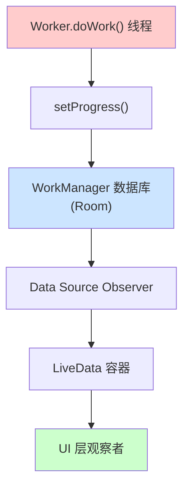
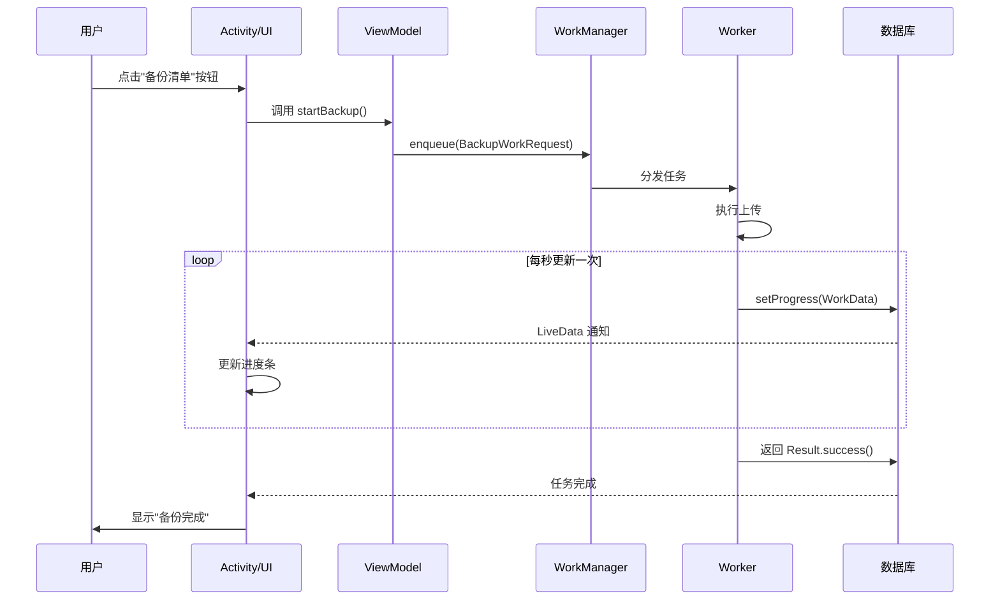
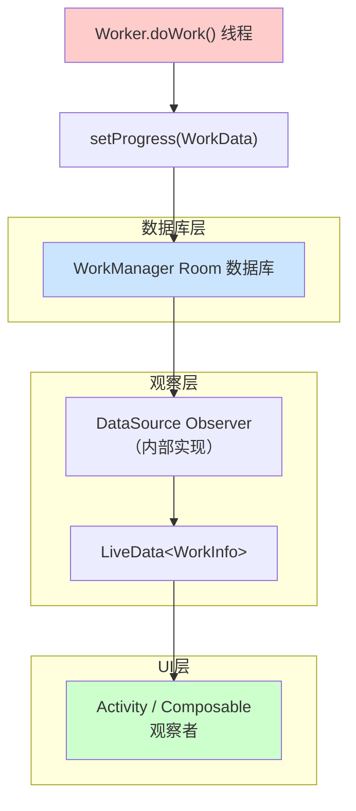

# 6.1.27 观察中级工人进度

清晨的白马村，空气里弥漫着松脂和枯叶混合的气息。

篝火已经燃了好一会儿，希尔蹲在旁边，用树枝拨弄着炭火，让火焰始终维持在一个恰到好处的温度。橙红色的光映在她脸上，她的眉头微微皱着，似乎在思考什么问题。

"希尔，你今天怎么这么安静？"洛芙从帐篷里钻出来，揉着眼睛打了个哈欠，"平时这个时候你不是应该已经打开电脑开始敲代码了吗？"

"我在想昨天的那个问题。"希尔没有抬头，手指继续拨弄着炭火，"昨天黛琳教了我们怎么用setForeground()让Worker变成'长跑运动员'，可以跑很久不被中断。但是——"

"但是什么？"洛芙在她旁边蹲下来，好奇地探过脑袋。

"但是，我们怎么知道它跑到哪儿了？"希尔终于抬起头，眼睛里闪着困惑的光，"现实生活里，你让一个人去跑马拉松，你可以站在终点看着计时牌，等他跑到四十公里的时候，计时牌会显示'4小时27分'——你随时知道他跑到哪儿了。但是Worker呢？我们在代码里调用enqueue()之后，它就钻进系统里跑掉了，我们什么都不知道，只能等它跑完，然后去查数据库里的结果。"

"这确实是个问题。"黛琳的声音从她们身后传来。她正端着一个冒热气的小陶炉走过来，身后跟着刚收拾完野餐垫的伊莎。"昨天我们让Worker去下载一个大文件，结果用户界面上一片空白，什么反馈都没有。用户会想：是不是我的网络断了？是不是App卡死了？是不是我按的那个按钮根本没有反应？"

"哇，说到我心坎里去了。"洛芙站起来，"我之前用过一个App，它后台下载的时候，屏幕上就只有一个圆圈在转，也没有任何数字显示，我根本不知道它下载了多少，还有多久能下完。"

"这就是进度反馈的重要性。"黛琳把小陶炉放在篝火旁的一块平整的石头上，炉火跳跃着，散发出温暖的光。"今天我们就来解决这个问题——怎么让Worker告诉我们，它跑到哪儿了。"

"就像马拉松计时牌一样？"洛芙眨眨眼。

"就像马拉松计时牌。"黛琳点点头，嘴角浮现出一丝笑意，"不过我们今天不用计时牌，我们用——"

她从背包里掏出一个小巧的金属盒子，大约巴掌大小，表面有一些规则的凹槽和凸起，看起来像某种精密仪器。

"这是什么？"洛芙凑过去看。

"登山步数记录器。"黛琳把它托在掌心，"我昨天去山间步道徒步的时候带着它。它会自动记录我走了多少步，而且——"她轻轻按了一下盒子侧面的按钮，盒子侧面的小屏幕上亮起了一串数字，"它会告诉我，走到一半了。"

"我登了多少步的50%？"

"对。你看这个数字，5270步——它记录的是总步数。但是登山的过程中，每走一步，它都会更新这个数字，告诉你已经走了多少。你想一想，这背后的原理是什么？"

"有一个计数器？"洛芙歪着脑袋想，"每走一步就加一，然后和总数比较？"

"可以这么理解。但更准确地说，是有一个'观察者'一直在盯着这个数字。它不需要知道走路的人是谁，也不需要知道走的是哪条路——它只需要知道：这个数字变了，我就告诉你们。"

"这不就是LiveData嘛。"希尔突然插嘴，眼睛一下子亮了起来，"LiveData就是干这个的——它观察一个数据，这个数据一变，它就通知所有盯着它的人。"

"没错。"黛琳点点头，"WorkManager也提供了类似的能力，叫做进度观察。Worker可以在执行过程中定时更新一个进度值，而UI层可以订阅这个进度值，实时展示给用户。"

"那太好了！"洛芙拍了拍手，"我再也不用盯着空白屏幕干等了！"

---

## 问题一：Worker怎么报告自己的进度？

"不过，"希尔举起手，表情认真起来，"在我们开始写代码之前，我有个问题。如果我们想让Worker报告进度，那Worker得知道两件事：第一，进度数据存在哪儿；第二，用什么API来更新它。对吧？"

"完全正确。"黛琳重新坐正，示意大家围过来，"我们先解决第一个问题：进度数据存哪儿。"

"昨天我们说过，Worker和系统之间通过WorkData交流信息。"黛琳在地上用树枝画了一个方框，"WorkData本质上就是一个键值对容器，和Map很像。我们可以把进度数据存在里面。"

"那进度数据的键名叫什么？"洛芙问。

"这取决于你自己。"黛琳在方框里写下`Progress: Int`，"通常我们用一个字符串作为键，比如'Progress'，然后把一个整数作为值——0表示刚开始，100表示完成了。"

"为什么是0到100？"洛芙歪头。

"因为这是最符合直觉的表示方式。"伊莎轻声开口，她正把野餐垫铺开，让篝火的光能均匀地照在上面，"0%就是还没开始，50%就是走到一半，100%就是跑完了。对于用户来说，这是一个不需要任何解释的数字。"

"原来如此。"洛芙点点头，"就像下载进度条一样。"

"对。"黛琳说，"不过，Worker的进度更新有一个限制：它只能更新原生类型的值——Int、Long、Float、Double、Boolean，还有String和一些基本数组。复杂的对象是存不进去的。"

"为什么？"洛芙追问。

"因为进度数据需要被序列化，存入数据库。"黛琳解释道，"Worker的进度可能被系统存储很长一段时间，万一App进程被杀了，系统还能帮你恢复。而数据库里只能存基本类型。"

"就像露营的时候，你没法把整顶帐篷塞进背包，只能把帐篷拆成一根根支架和一片片布料，分别装进不同的收纳袋里。"伊莎补充道。

"这个比喻好！"洛芙眼睛一亮。

---

"接下来是第二个问题：用什么API来更新进度？"黛琳从背包里掏出一支白板笔，在一块平整的石头上画起了代码结构图。

```kotlin
// Worker 类中更新进度
class MyWorker(
    ctx: Context,
    params: WorkerParameters
) : Worker(ctx, params) {

    override suspend fun doWork(): Result {
        // 第一步：把进度设为0，表示刚开始
        setProgress(workDataOf("Progress" to 0))

        // 第二步：开始干活，每完成一部分就更新进度
        for (i in 1..10) {
            // 模拟每一步耗时操作
            delay(500)

            // 第三步：更新进度，每步增加10
            val currentProgress = i * 10
            setProgress(workDataOf("Progress" to currentProgress))
        }

        // 第四步：全部完成，返回成功
        return Result.success()
    }
}
```

"这个代码看起来挺直观的。"洛芙凑过去看，"先setProgress到0，然后每做一步就更新一次，最后返回Result.success()。"

"但这里有一个细节。"希尔指着代码的第三步，"你在for循环里，每一步都调用setProgress()。这意味着如果循环执行10次，就会调用10次setProgress()。这会不会有点……太频繁了？"

"确实有这个可能。"黛琳点点头，"在实际项目中，你需要考虑更新的频率。如果你的Worker每秒能完成100个任务，那你没必要每秒更新100次进度——那只会浪费资源。一般来说，每秒更新一次就足够了，或者每次完成一个'有意义的大步骤'时更新一次。"

"那setProgress()是挂起函数吗？"洛芙问。

"是的。"黛琳在代码上圈了一个圈，"setProgress()是一个挂起函数，它内部会调用一个叫setProgressAsync()的方法，返回一个ListenableFuture。这个方法是异步的——也就是说，它不会阻塞Worker的执行线程。"

"异步的，明白了。"洛芙在本子上记了下来。

---

"但是，Worker的doWork()是运行在后台线程上的。"希尔插嘴，"如果我们从后台线程调用setProgress()，应该没什么问题吧？"

"对，因为setProgress()内部已经处理了线程切换。"黛琳点点头，"不过，如果你用的是ListenableWorker而不是Worker，那你需要手动调用setProgressAsync()，并且处理返回的ListenableFuture。"

"啊，我记得昨天的内容。"洛芙说，"ListenableWorker是更底层的API，需要自己管理线程。"

"没错。"黛琳说，"但是在大多数情况下，我们推荐使用Worker类，因为它帮你封装了线程管理的细节。你只需要关注业务逻辑就行了。"

---

## 问题二：谁来观察这些进度？

"进度更新了，那谁来接收这些更新？"洛芙问，"是UI吗？"

"对，就是Activity或者Composable里那些需要显示进度的组件。"黛琳说，"但是，这里有一个关键点：进度信息只能被'活着'的观察者观察到。"

"活着？"洛芙眨眨眼。

"意思是，当你的App在前台运行的时候，你可以观察到进度。"黛琳解释道，"但是如果App被切到后台，或者屏幕锁定了，那么WorkManager可能没法及时把进度更新传递给UI。这是系统为了节省电量做的优化——当App不可见的时候，它不急于把每个进度变化都推送过去。"

"原来如此。"洛芙若有所思，"所以setProgress()更像是'锦上添花'的功能，而不是'必须实时准确'的功能。"

"完全正确。"黛琳点点头，"如果你的App在后台，你需要依赖更可靠的机制，比如Foreground Service或者直接查询数据库。但对于'让用户在等待时有个大概的进度感觉'这件事，setProgress()已经足够好了。"

---

"现在我们来看怎么观察进度。"黛琳在白板上画了一个新的图示。

```kotlin
// 在 ViewModel 或 Activity 中观察进度
class MyViewModel(
    application: Application
) : AndroidViewModel(application) {

    // 创建一个 LiveData 来持有 WorkInfo
    val workInfoLiveData: LiveData<WorkInfo> =
        WorkManager.getInstance(application)
            .getWorkInfoByIdLiveData(myWorkRequest.id)

    fun startWork() {
        // enqueue 工作请求
        WorkManager.getInstance(application)
            .enqueue(myWorkRequest)
    }
}
```

"等等，"洛芙打断道，"WorkInfo是什么？"

"WorkInfo是WorkManager提供的一个数据类，它封装了一个WorkRequest的执行状态。"黛琳解释道，"你可以把它理解成Worker的'身份证'——上面记录了它是谁（ID）、它现在是死是活（State）、它有没有留下什么记录（OutputData）、还有——"

"还有进度？"洛芙接话。

"还有进度。"黛琳点点头，在白板上补充，"WorkInfo里有一个progress字段，类型是LiveData<Int>。你可以订阅它，当Worker更新进度的时候，这个LiveData就会自动通知你。"

```kotlin
// 在 Activity 或 Composable 中订阅进度
class MainActivity : AppCompatActivity() {

    private lateinit var workManager: WorkManager

    override fun onCreate(savedInstanceState: Bundle?) {
        super.onCreate(savedInstanceState)

        workManager = WorkManager.getInstance(application)

        // 获取 WorkInfo 的 LiveData
        val workInfoLiveData = workManager
            .getWorkInfoByIdLiveData(uploadWorkRequest.id)

        // 观察 WorkInfo 的变化
        workInfoLiveData.observe(this) { workInfo ->
            when {
                // 工作已完成
                workInfo.state.isFinished -> {
                    // 显示完成状态
                    binding.statusText.text = "上传完成！"
                }
                // 工作还在运行，获取进度
                workInfo.state == WorkInfo.State.RUNNING -> {
                    // 从 WorkInfo 中获取进度值
                    val progress = workInfo.progress.getInt("Progress", 0)
                    binding.progressBar.progress = progress
                    binding.statusText.text = "上传中... $progress%"
                }
            }
        }
    }
}
```

"这段代码好清楚！"洛芙说，"先拿到workInfoLiveData，然后observe()它。在observe的回调里，先检查工作是不是finished了，如果是就显示完成；否则就从progress里取出进度值，更新到UI上。"

"但是有一个问题。"希尔举起手，"workInfo.progress.getInt("Progress", 0)——这个getInt的第二个参数是什么？"

"是默认值。"黛琳解释道，"如果Worker还没有设置过进度，或者键名不对，就会返回这个默认值。设为0是常见做法——意味着'还没有进度'。"

"哦！"洛芙点点头，"所以如果用户在进度条上看到0%，可能意味着两件事：要么Worker刚开始还没来得及更新，要么出了什么问题。"

"是的。"黛琳说，"这是一个需要考虑的用户体验问题。有经验的App通常会在进度为0的时候显示'正在启动...'之类的文字，而不是直接显示'0%'，避免用户以为App卡住了。"

---

"我有一个想法。"伊莎突然开口，她一直在旁边安静地听着，"如果我们把这个进度观察的机制，和昨天学的Foreground Service结合起来呢？"

"什么意思？"洛芙好奇地歪头。

"你想啊，"伊莎微微侧头，"Foreground Service可以让我们在通知栏里显示一个'正在运行'的图标，告诉用户'我们没死、我们还在工作'。如果我们再把进度信息也放进通知里——"

"那用户不需要打开App，在通知栏就能看到进度！"洛芙眼睛一亮。

"没错。"伊莎轻轻点头，"这样，即使App被切到后台，用户也能通过通知栏知道下载了多少、上传了多少，还剩多久。"

"这是个好思路！"希尔已经开始在笔记本上敲代码了，"我来写一个示例——"

```kotlin
// 在 Worker 中结合 Foreground Service 和进度更新
class UploadFileWorker(
    ctx: Context,
    params: WorkerParameters
) : CoroutineWorker(ctx, params) {

    override suspend fun doWork(): Result {
        // 设置前台服务（让通知栏显示"正在上传"）
        setForeground(
            foregroundInfo(
                id = NOTIFICATION_ID,
                notification = NotificationCompat.Builder(ctx, CHANNEL_ID)
                    .setContentTitle("文件上传中")
                    .setContentText("正在上传...")
                    .setSmallIcon(R.drawable.ic_upload)
                    .setProgress(100, 0, false) // 通知栏的进度条
                    .build()
            )
        )

        // 获取文件的总大小
        val totalBytes = file.length()
        var uploadedBytes = 0L

        // 分块上传
        while (uploadedBytes < totalBytes) {
            // 上传一个块
            val chunk = readNextChunk(file, uploadedBytes)
            uploadChunk(chunk)

            uploadedBytes += chunk.size

            // 计算进度百分比
            val progress = ((uploadedBytes.toFloat() / totalBytes) * 100).toInt()

            // 更新进度（供UI观察）
            setProgress(workDataOf("Progress" to progress))

            // 更新前台通知的进度
            setForeground(
                foregroundInfo(
                    id = NOTIFICATION_ID,
                    notification = NotificationCompat.Builder(ctx, CHANNEL_ID)
                        .setContentTitle("文件上传中")
                        .setContentText("已上传 $progress%")
                        .setSmallIcon(R.drawable.ic_upload)
                        .setProgress(100, progress, false) // 实时进度
                        .build()
                )
            )
        }

        return Result.success()
    }

    companion object {
        private const val NOTIFICATION_ID = 1001
        private const val CHANNEL_ID = "upload_channel"
    }
}
```

"哇，这个代码一下子把两个知识点串起来了！"洛芙看着屏幕感叹道。

"确实。"希尔指着代码说，"你看，这里用到了两套进度系统：一套是setProgress()，供UI层的LiveData观察；另一套是setForeground()配合NotificationCompat.setProgress()，供通知栏显示。两套系统各司其职。"

"不过，"黛琳插话道，"在实际的App里，你不需要两套都做。一般来说，如果App在前台，就用setProgress()+LiveData更新UI；如果App在后台，就用Foreground Service更新通知栏。有些App甚至只在通知栏显示进度，因为用户不一定随时盯着屏幕看。"

---

## 问题三：进度数据是怎么传递的？

"我想问一个比较深入的问题。"希尔放下笔记本，表情认真起来，"Worker调用setProgress()更新了一个值，然后UI层通过LiveData观察到了这个值——这个数据是怎么从Worker传到UI的？中间经历了什么？"

"好问题。"黛琳点点头，"这涉及到WorkManager的内部实现了。"

她在白板上画了一幅简化的流程图：



"第一步，Worker调用setProgress()。"黛琳指着图说，"这个调用会触发一个异步写入操作，数据会被存入WorkManager的内部数据库。注意这里用的是Room——一个SQLite的封装库。"

"等等，WorkManager用的是Room？"洛芙惊讶地问。

"对，WorkManager的内部存储就是用Room实现的。"黛琳解释道，"所有的WorkRequest、WorkInfo、进度数据，都存在这个数据库里。这样即使App进程被杀了，系统也能从数据库里恢复状态。"

"原来如此。"洛芙点点头，"所以setProgress()不是直接发给UI的，而是先写数据库。"

"对。"黛琳说，"第二步，当数据写入数据库后，WorkManager内部的Data Source Observer会监听到变化。这个Observer是WorkManager自己维护的，它相当于一个'守门人'，专门盯着数据库的改动。"

"第三步，Observer发现数据变了，就把它包装成一个WorkInfo对象，放进LiveData里。"黛琳在图上画了一条虚线连接到LiveData，"第四步，LiveData通知所有观察者，UI层就收到了更新。"

"这个流程比我想象的要复杂一些。"洛芙说，"不过听起来很合理——把数据持久化和观察者模式结合起来。"

"是的。"黛琳点点头，"这也就是为什么，即使你把App切到后台，等你回来的时候，UI上可能还会显示一个'中间状态'的进度——因为数据库里的数据还在，只是LiveData没有实时推送给你。"

---

"不过，这个流程也带来了一些限制。"希尔补充道，"比如，如果你在Worker里非常频繁地调用setProgress()——比如每毫秒一次——那么数据库可能承受不住。"

"对，所以前面我们说过，要控制更新的频率。"黛琳说，"一般来说，每秒更新一次就够了。如果你需要更细粒度的进度（比如显示文件复制的实时百分比），可以考虑用其他机制，比如Binder通信或者自定义ContentProvider。"

"但是对于大多数场景，setProgress()已经足够了。"伊莎轻声说，"它简单、可靠、不需要太多样板代码。"

---

## 动手实践：给露营清单App加上进度条

"好了，理论讲完了。"希尔拍了拍手，"我们来动手写一个实际的例子。"

"这次做什么？"洛芙兴奋地问。

"还记得我们之前做的那个露营清单App吗？"希尔眨眨眼，"今天我们给它加上文件备份功能——当用户点击'备份'按钮时，App会把本地保存的露营清单上传到云端。而且，用户可以在上传过程中看到进度条。"

"听起来很实用！"洛芙说。

"我们先看一下整体结构。"黛琳重新拿起白板笔，开始画架构图。



"这幅图展示了整个流程。"黛琳指着图说，"用户点击按钮，ViewModel调用enqueue()启动Worker，Worker开始执行上传，每秒调用一次setProgress()更新进度。ViewModel通过LiveData观察到WorkInfo的变化，自动更新UI。"

"明白了！"洛芙点点头，"接下来我们写代码吧！"

---

"首先，我们来写WorkRequest的定义。"希尔打开笔记本，开始敲代码。

```kotlin
// 创建一个一次性的 WorkRequest，用于备份露营清单
val backupWorkRequest = OneTimeWorkRequestBuilder<BackupCampListWorker>()
    .addTag(TAG_BACKUP)
    .build()

// 在 ViewModel 中启动这个请求
fun startBackup() {
    WorkManager.getInstance(applicationContext)
        .enqueue(backupWorkRequest)
}
```

"简单明了。"黛琳说，"我们用OneTimeWorkRequestBuilder，创建一个只执行一次的后台任务。"

---

"接下来是最重要的部分——Worker的实现。"希尔继续敲代码。

```kotlin
class BackupCampListWorker(
    private val ctx: Context,
    params: WorkerParameters
) : Worker(ctx, params) {

    override suspend fun doWork(): Result {
        // 第一阶段：准备阶段，把进度设为0
        setProgress(workDataOf("Progress" to 0))

        // 模拟获取本地文件
        val campListFile = File(ctx.filesDir, "camp_list.json")
        if (!campListFile.exists()) {
            return Result.failure(
                workDataOf("Error" to "露营清单文件不存在")
            )
        }

        val totalSize = campListFile.length()
        var uploadedSize = 0L

        // 读取并上传文件内容（分块上传）
        val buffer = ByteArray(BUFFER_SIZE)
        var bytesRead: Int

        // 打开文件输入流
        val inputStream = FileInputStream(campListFile)
        val bufferedInputStream = BufferedInputStream(inputStream)

        // 模拟实际上传操作（实际项目中这里会调用网络API）
        while (bufferedInputStream.read(buffer).also { bytesRead = it } != -1) {
            // 模拟网络延迟（每个块耗时100毫秒）
            delay(100)

            uploadedSize += bytesRead

            // 计算当前进度百分比
            val progress = if (totalSize > 0) {
                ((uploadedSize.toFloat() / totalSize) * 100).toInt()
            } else {
                100
            }

            // 更新进度（供UI观察）
            setProgress(workDataOf("Progress" to progress))
        }

        bufferedInputStream.close()

        // 全部上传完成
        return Result.success(
            workDataOf("FileName" to "camp_list.json")
        )
    }

    companion object {
        private const val BUFFER_SIZE = 4096
        const val TAG_BACKUP = "backup_camp_list"
    }
}
```

"这段代码模拟了一个文件上传场景。"黛琳解释道，"首先把进度设为0，然后开始读取文件，每读取一块就计算一次进度，然后调用setProgress()更新。"

"我注意到这里用了delay(100)来模拟网络延迟。"洛芙说，"这是为了让我们能看到进度条动画吗？"

"对。"希尔点点头，"如果你的实际上传速度非常快（比如内网），进度条可能一闪而过，你根本看不清。为了演示效果，我们需要加一点延迟。实际项目中不需要这样做。"

---

"现在来看UI层的代码。"黛琳在白板上画了一个简单的界面布局。

```kotlin
class BackupActivity : AppCompatActivity() {

    private lateinit var binding: ActivityBackupBinding
    private lateinit var workManager: WorkManager

    override fun onCreate(savedInstanceState: Bundle?) {
        super.onCreate(savedInstanceState)
        binding = ActivityBackupBinding.inflate(layoutInflater)
        setContentView(binding.root)

        workManager = WorkManager.getInstance(application)

        // 按钮点击事件：启动备份
        binding.btnBackup.setOnClickListener {
            // 禁用按钮，防止重复点击
            binding.btnBackup.isEnabled = false
            binding.tvStatus.text = "开始备份..."

            // 获取 WorkRequest（这里简化处理，直接新建一个）
            val backupRequest = OneTimeWorkRequestBuilder<BackupCampListWorker>()
                .addTag(BackupCampListWorker.TAG_BACKUP)
                .build()

            // enqueue 并保存 workId
            workManager.enqueue(backupRequest)

            // 观察 WorkInfo 变化
            observeBackupProgress(backupRequest.id)
        }
    }

    private fun observeBackupProgress(workId: UUID) {
        // 使用 getWorkInfoByIdLiveData 获取 LiveData
        workManager.getWorkInfoByIdLiveData(workId)
            .observe(this) { workInfo ->
                when (workInfo?.state) {
                    // 工作正在进行中
                    WorkInfo.State.RUNNING -> {
                        // 从 progress 中获取进度值
                        val progress = workInfo.progress.getInt("Progress", 0)
                        binding.progressBar.progress = progress
                        binding.tvStatus.text = "备份中... $progress%"
                    }
                    // 工作成功完成
                    WorkInfo.State.SUCCEEDED -> {
                        binding.progressBar.progress = 100
                        binding.tvStatus.text = "备份完成！"
                        binding.btnBackup.isEnabled = true
                    }
                    // 工作失败
                    WorkInfo.State.FAILED -> {
                        binding.tvStatus.text = "备份失败"
                        binding.btnBackup.isEnabled = true
                        // 获取错误信息
                        val error = workInfo.outputData.getString("Error")
                        Log.e("BackupActivity", "备份失败: $error")
                    }
                    // 其他状态
                    else -> { /* 忽略 */ }
                }
            }
    }
}
```

"这段代码的核心是observeBackupProgress()函数。"黛琳指着代码说，"它调用getWorkInfoByIdLiveData()获取一个LiveData<WorkInfo>，然后用observe()方法订阅它。在观察回调里，我们根据WorkInfo的状态来更新UI——如果是RUNNING，就从progress里取出进度值，更新进度条和文字；如果是SUCCEEDED，就显示完成；如果是FAILED，就显示错误。"

"好清楚！"洛芙感叹，"这段代码比我想象的要简单多了。"

"这就是LiveData的好处。"黛琳说，"它帮你处理了所有的线程切换和生命周期问题。你不需要担心'现在在哪个线程'，也不需要担心'Activity已经被销毁了还能不能更新UI'——LiveData会自动处理这些。"

---

"不过，我有一个问题。"希尔举起手，"如果我们同时启动了多个备份任务呢？怎么区分它们？"

"好问题。"黛琳点点头，"每个WorkRequest都有一个唯一的UUID，就是我们刚才代码里的workId。我们可以用这个ID来区分不同的任务。如果你想观察多个任务，需要为每个任务都调用一次getWorkInfoByIdLiveData()。"

"还有一种做法是使用链式WorkRequest。"伊莎补充道，"如果你有多个任务需要按顺序执行，可以用WorkManager.beginWith().then().enqueue()的方式来创建工作链。"

"这个我们以后再讲。"黛琳说，"今天的重点是观察单个任务的进度。"

---

## 运行效果：进度条动画

"来，我们运行一下看看效果。"希尔把代码传到模拟器上，点击了"备份"按钮。

洛芙凑过去看，只见屏幕上出现了以下日志输出：

```
D/BackupActivity: 备份中... 0%
D/BackupActivity: 备份中... 12%
D/BackupActivity: 备份中... 25%
D/BackupActivity: 备份中... 37%
D/BackupActivity: 备份中... 50%
D/BackupActivity: 备份中... 62%
D/BackupActivity: 备份中... 75%
D/BackupActivity: 备份中... 87%
D/BackupActivity: 备份中... 100%
D/BackupActivity: 备份完成！
```

"你看，每秒更新一次，总共花了大约10秒。"希尔指着日志说，"进度从0%一直涨到100%，最后显示'备份完成'。"

"进度条也是同步动画的！"洛芙看着模拟器屏幕，进度条一点点从左边移到右边，"看起来好流畅啊！"

"这背后就是LiveData的功劳。"黛琳说，"每当你调用setProgress()，数据库就会写入新值，然后LiveData会把这个变化推送给观察者，Activity收到通知后就会更新进度条。整个链路是异步的，不会阻塞Worker的执行。"

"感觉像是有人在背后默默传递消息。"伊莎轻声说，"Worker把进度交给数据库，数据库再告诉LiveData，LiveData再告诉Activity——就像接力赛一样。"

"比喻得好！"洛芙点点头，"而且，每个环节都是各司其职：Worker只管干活，数据库只管存储，LiveData只管通知，Activity只管显示。分工明确，互不干扰。"

---

"不过，这里有一个值得注意的问题。"希尔突然说，"如果用户在备份过程中，把App切换到后台了——比如按了Home键——会发生什么？"

"好问题。"黛琳说，"我们来测试一下。"

希尔按了Home键，把App切到后台，然后继续观察日志。

```
D/BackupActivity: 备份中... 37%
D/BackupActivity: 备份中... 50%
D/BackupActivity: 备份中... 62%
// App 切换到后台
D/BackupActivity: 备份中... 75%
D/BackupActivity: 备份中... 87%
D/BackupActivity: 备份中... 100%
D/BackupActivity: 备份完成！
```

"嗯，看起来还是有输出。"洛芙说，"虽然App在后台，但是LiveData的日志还是在打印。"

"这是因为Worker还在运行。"黛琳解释道，"WorkManager有自己独立的进程，不会因为App切到后台就停止。但是，Activity收到LiveData通知后，需要更新UI——如果App已经完全不可见了，这次更新可能不会被渲染。"

"所以，如果在实际项目中，你需要配合Foreground Service，确保即使App在后台，用户也能通过通知栏看到进度。"黛琳补充道。

"明白了。"洛芙在本子上记了下来，"setProgress()+LiveData适合App在前台的场景；如果要在后台显示进度，需要结合Foreground Service。"

---

## 反模式：不要在Worker里直接更新UI

"最后，我们来讨论一个常见的错误做法。"黛琳的语气变得严肃起来。

"有些开发者会想：Worker不就是后台线程吗？我直接从Worker里发个广播，或者用EventBus，让UI去更新。这样不是更直接吗？"

"这样做有什么问题吗？"洛芙问。

"问题在于生命周期。"黛琳摇摇头，"Worker不知道Activity什么时候存在，什么时候被销毁。如果Worker在Activity已经被销毁之后还尝试发消息，可能会导致内存泄漏，甚至崩溃。"

"而且，"希尔补充道，"直接从Worker里更新UI，需要你在Worker里持有Activity的引用，这违反了'后台任务不应该知道UI存在'的原则。Worker应该是一个纯粹的、无UI依赖的业务逻辑单元。"

```kotlin
// ❌ 错误做法：Worker 直接持有 View 引用
class BadWorker(
    private val view: MyView  // 千万别这样做！
) : Worker(ctx, params) {
    override suspend fun doWork(): Result {
        view.updateProgress(50)  // 危险！Activity 可能已被销毁
        return Result.success()
    }
}

// ✅ 正确做法：通过 LiveData 观察进度
// Worker 只需要调用 setProgress()
// UI 层通过 WorkManager.getWorkInfoByIdLiveData() 订阅
// 观察者模式自动处理生命周期问题
```

"所以，正确的做法就是：Worker只负责setProgress()，不关心谁在看这个进度。"黛琳总结道，"UI层通过LiveData自己来订阅，自己决定怎么显示。这是观察者模式的好处——发布者和订阅者互不感知。"

"就像我们露营的时候，"伊莎轻声说，"篝火只管燃烧，发出光和热。它不知道是谁在看它——是洛芙，是希尔，还是路过的松鼠。观察者是独立的。"

"比喻得很诗意。"黛琳笑了笑，"不过技术上来说确实是这样。"

---

夕阳开始西斜，橙红色的光芒洒在白马村的草地上，把枫叶染成了一片金红。

洛芙靠在石头上，看着篝火旁余烬微微跳动的火光，脑海中浮现出今天学到的内容：Worker通过setProgress()更新进度，进度数据存入数据库，UI层通过LiveData观察WorkInfo的变化——就像篝火的光自动传播到周围的每一张脸上，不需要你去"推送"它。

"今天的内容挺多的。"希尔收起笔记本，"setProgress()、LiveData观察、Foreground Service配合、还有反模式……"

"没关系。"黛琳站起来，拍了拍裙子上的灰尘，"一点点来。明天我们再讲讲怎么取消和观察工作链。"

"好期待！"洛芙也站起来，伸了个懒腰，"走吧，我饿了，今晚吃什么？"

"火锅怎么样？"伊莎笑着问。

"火锅！赞成！"希尔跳起来，"我去准备食材！"

四个人收拾好东西，朝着营地的厨房走去。身后，篝火的余烬还在微微发着光，像是还在等待着下一次露营的开始。

---

## 专业技术总结

> Worker可以在执行过程中通过`setProgress()` API报告中间进度，进度数据以`WorkData`形式存储在`Room`数据库中，UI层通过`WorkManager.getWorkInfoByIdLiveData()`获得的`LiveData<WorkInfo>`来订阅进度变化。这种发布-订阅模式保证了Worker与UI的解耦。

#### 结构图



#### 复杂度与影响

| 方面 | 说明 |
|------|------|
| 线程 | `setProgress()` 内部已处理线程切换，可从后台线程安全调用 |
| 性能 | 建议每秒最多更新一次；过于频繁的更新会增加数据库I/O压力 |
| 可靠性 | 进度数据持久化到数据库，即使App进程被杀也能恢复 |
| 生命周期 | App不可见时，LiveData可能不会实时推送更新，需配合Foreground Service |

#### 反模式与陷阱

- **Worker持有UI引用**：Worker直接持有Activity/View的引用进行UI更新，导致内存泄漏和生命周期问题。修复：使用`setProgress()` + LiveData观察。
- **过度频繁更新**：每毫秒调用一次`setProgress()`，导致数据库压力过大。修复：控制在每秒一次或每个有意义的大步骤更新一次。
- **进度为0时的用户体验**：直接显示"0%"让用户误以为任务卡住了。修复：显示"正在启动…"或在前几次更新前不显示百分比。
- **在App后台时依赖LiveData**：App在后台时LiveData不保证实时推送。修复：使用Foreground Service在通知栏显示进度。

#### 设计哲学

**观察者模式与数据持久化的分离**：WorkManager的进度观察机制体现了两个核心设计原则：第一，Worker不需要知道谁在观察它的进度，只需安心干活；第二，进度数据通过数据库持久化，使得系统可以在App进程被杀后恢复状态。这种设计让后台任务的管理变得可预测、可调试、可恢复。

#### 🏕️ 动手练习

**项目概览**：为"露营清单App"添加照片备份功能，用户选择照片后，App在后台自动上传到云存储，并实时显示上传进度。

**Task 1：创建 Worker 类并实现进度更新**

目标：创建`BackupPhotoWorker`，在Worker中模拟照片分块上传，每块上传后更新进度。

你需要做的事：
1. 新建类`BackupPhotoWorker`继承`Worker`。
2. 在`doWork()`开头调用`setProgress(workDataOf("Progress" to 0))`。
3. 使用`for`循环模拟10次上传操作，每次循环`delay(300)`模拟网络延迟。
4. 每次循环结束时调用`setProgress(workDataOf("Progress" to (i+1)*10))`。
5. 循环结束后返回`Result.success()`。

验收标准：
- [ ] Worker类编译通过
- [ ] doWork()中正确调用了setProgress()两次（开始和进行中）
- [ ] 返回了Result.success()

提示代码：
```kotlin
class BackupPhotoWorker(
    ctx: Context,
    params: WorkerParameters
) : Worker(ctx, params) {
    override suspend fun doWork(): Result {
        // 开始时设置进度为0
        setProgress(workDataOf("Progress" to 0))
        
        // 模拟10次上传
        repeat(10) { index ->
            delay(300) // 模拟网络延迟
            // 更新进度
            setProgress(workDataOf("Progress" to (index + 1) * 10))
        }
        
        return Result.success()
    }
}
```

---

**Task 2：在 Activity 中观察 Worker 进度**

目标：在Activity中启动`BackupPhotoWorker`，并通过`getWorkInfoByIdLiveData()`观察进度，实时更新ProgressBar。

你需要做的事：
1. 在Activity的onCreate()中创建`OneTimeWorkRequestBuilder<BackupPhotoWorker>()`。
2. 调用`WorkManager.getInstance().enqueue()`启动Worker，保存返回的`Operation`。
3. 调用`WorkManager.getInstance().getWorkInfoByIdLiveData(workRequest.id).observe()`。
4. 在观察回调中，从`workInfo.progress.getInt("Progress", 0)`获取进度。
5. 将进度值设置到`ProgressBar`的progress属性上。

验收标准：
- [ ] 点击按钮后，Activity显示了"备份中... X%"的文字
- [ ] ProgressBar实时更新，从0%增长到100%
- [ ] 完成后显示"备份完成"

提示代码：
```kotlin
val workRequest = OneTimeWorkRequestBuilder<BackupPhotoWorker>().build()
WorkManager.getInstance(this).enqueue(workRequest)

WorkManager.getInstance(this)
    .getWorkInfoByIdLiveData(workRequest.id)
    .observe(this) { workInfo ->
        val progress = workInfo?.progress?.getInt("Progress", 0) ?: 0
        binding.progressBar.progress = progress
        binding.tvStatus.text = "备份中... $progress%"
        
        if (workInfo?.state?.isFinished == true) {
            binding.tvStatus.text = "备份完成"
        }
    }
```

---

**Task 3：结合 Foreground Service 显示通知栏进度**

目标：在Worker执行时显示前台通知，通知中包含进度条。

你需要做的事：
1. 在Worker的doWork()开头，调用`setForeground(createForegroundInfo(0))`。
2. 创建`createForegroundInfo(progress: Int)`方法，返回`ForegroundInfo`。
3. 在通知中使用`NotificationCompat.Builder().setProgress(100, progress, false)`。
4. 每次调用setProgress()后，同步调用`setForeground(createForegroundInfo(progress))`。

验收标准：
- [ ] Worker启动后，通知栏出现带进度条的通知
- [ ] 通知栏的进度条随着Worker执行实时更新
- [ ] 完成后通知自动消失或变为"完成"状态

提示代码：
```kotlin
override suspend fun doWork(): Result {
    setForeground(createForegroundInfo(0))
    
    repeat(10) { index ->
        delay(300)
        val progress = (index + 1) * 10
        setProgress(workDataOf("Progress" to progress))
        setForeground(createForegroundInfo(progress))
    }
    
    return Result.success()
}

private fun createForegroundInfo(progress: Int): ForegroundInfo {
    val notification = NotificationCompat.Builder(ctx, "backup_channel")
        .setContentTitle("照片备份中")
        .setContentText("$progress%")
        .setSmallIcon(R.drawable.ic_backup)
        .setProgress(100, progress, false)
        .build()
    
    return ForegroundInfo(NOTIFICATION_ID, notification)
}
```

---

**Task 4：添加错误处理和重试机制**

目标：当Worker执行失败时，能够显示错误信息，并支持自动重试。

你需要做的事：
1. 在Worker中，当某个条件不满足时，返回`Result.failure(workDataOf("Error" to "具体错误信息"))`。
2. 在Activity中观察`WorkInfo.State.FAILED`状态，显示错误。
3. 配置WorkRequest使用`setBackoffCriteria()`设置退避策略。
4. 可选：使用`WorkManager.getInstance().cancelWorkById()`取消任务。

验收标准：
- [ ] Worker返回failure时，Activity正确显示错误信息
- [ ] 配置了退避策略后，失败任务会在等待后自动重试
- [ ] 点击取消按钮能够中止正在运行的Worker

提示代码：
```kotlin
// Activity中处理失败
WorkInfo.State.FAILED -> {
    val error = workInfo.outputData.getString("Error") ?: "未知错误"
    binding.tvStatus.text = "备份失败: $error"
    binding.btnBackup.isEnabled = true
}

// WorkRequest配置退避策略
val workRequest = OneTimeWorkRequestBuilder<BackupPhotoWorker>()
    .setBackoffCriteria(
        BackoffPolicy.EXPONENTIAL,
        30,
        TimeUnit.SECONDS
    )
    .build()
```

---

**Task 5：实现批量上传和总体进度**

目标：使用`WorkContinuation`实现多个文件串行上传，并显示总体进度。

你需要做的事：
1. 创建多个`OneTimeWorkRequestBuilder<BackupPhotoWorker>()`。
2. 使用`WorkManager.beginWith(first).then(second).then(third).enqueue()`创建链式任务。
3. 在Activity中，使用`WorkManager.getWorkInfosForUniqueWorkLiveData()`观察链式任务的状态。
4. 计算总体进度：在观察回调中，根据当前是第几个任务来计算总体进度。

验收标准：
- [ ] 三个文件按顺序上传（第一个完成后再上传第二个）
- [ ] UI上显示"正在上传第 X/3 个文件，总进度 Y%"
- [ ] 全部完成后显示"3个文件全部备份完成"

提示代码：
```kotlin
val first = OneTimeWorkRequestBuilder<BackupPhotoWorker>().build()
val second = OneTimeWorkRequestBuilder<BackupPhotoWorker>().build()
val third = OneTimeWorkRequestBuilder<BackupPhotoWorker>().build()

WorkManager.getInstance(this)
    .beginWith(listOf(first, second, third))
    .enqueue()

// 观察所有任务的进度
WorkManager.getInstance(this)
    .getWorkInfosForUniqueWorkLiveData("photo_backup_chain")
    .observe(this) { workInfos ->
        val finishedCount = workInfos.count { it.state.isFinished }
        val totalProgress = workInfos.sumOf { it.progress.getInt("Progress", 0) } / workInfos.size
        binding.tvStatus.text = "正在上传第 ${finishedCount + 1}/3 个文件，总进度 $totalProgress%"
    }
```

---

#### 面试热身

Q1: Worker的`setProgress()`和Foreground Service的通知栏进度条有什么区别？分别在什么场景下使用？

> setProgress()通过LiveData暴露进度，适合App在前台时让用户看到实时百分比；Foreground Service的通知栏进度在App退到后台后依然可见，适合需要长时间运行且用户可能离开App的场景。

Q2: 为什么进度数据必须使用基本类型（Int、Float等）而不是自定义对象？

> 进度数据需要被序列化后存入Room数据库，数据库只支持基本类型和少量的标准集合。复杂的自定义对象无法直接序列化，会导致崩溃或数据丢失。

Q3: `getWorkInfoByIdLiveData()`返回的LiveData在Activity销毁后会怎样？

> LiveData会自动感知生命周期，当观察者（Activity）被销毁时，LiveData会自动断开连接，不会导致内存泄漏。这是LiveData相比普通回调的优势。

Q4: 如果Worker的执行时间很长（比如1小时），用户在此期间多次打开关闭App，进度观察会受到什么影响？

> App在前台时，LiveData会实时推送每次setProgress()的更新。App退到后台时，LiveData可能不会立即推送，但数据库中的进度数据是持久化的。App重新回到前台时，会立即收到最新的进度状态。

Q5: 为什么不推荐在Worker内部直接持有Activity或View的引用来更新UI？

> Worker的生命周期和Activity/View不同步。Activity可能在Worker执行过程中被销毁，此时Worker持有旧的View引用会导致内存泄漏；如果尝试更新已销毁的View会导致崩溃。正确的做法是通过setProgress()和观察者模式让UI层主动订阅。

#### 参考实现要点

1. 优先使用`Worker`类而非`ListenableWorker`，因为`Worker`帮你封装了线程管理和进度更新的细节。
2. 进度更新频率建议控制在每秒一次，既能让UI有足够的刷新，又不会给数据库造成压力。
3. App在前台时使用`setProgress()`+LiveData；在后台时建议配合Foreground Service在通知栏显示进度。
4. 不要在Worker中直接持有UI组件的引用，通过观察者模式解耦Worker和UI。
5. 进度为0%时的用户体验需要额外考虑，建议显示"正在启动…"或直接跳过0%的显示。

> 学习建议

WorkManager的进度观察是构建良好用户体验的重要一环。记住：**用户最害怕的不是等待，而是不知道还要等多久。** 善用setProgress()，让你的后台任务"会说话"。

## 洛芙的小小日记本

今天学了好多东西！setProgress()、LiveData观察、Foreground Service配合……感觉自己终于可以让App"告诉"用户它在干什么了。黛琳说得对，用户最怕的不是等，是不知道等多久。明天要把批量上传的练习做完！

## 今日关键词

**setProgress()**：Worker在执行过程中更新进度数据的API，接收一个WorkData对象，内部异步写入Room数据库。

**WorkData**：Android的键值对数据结构，用于在组件间传递数据。进度数据以键值对形式存储，如`"Progress" to 50`。

**getWorkInfoByIdLiveData()**：返回`LiveData<WorkInfo>`的方法，用于观察指定ID的WorkRequest的执行状态和进度。

**WorkInfo**：封装WorkRequest执行状态的数据类，包含state（状态）、progress（进度数据）、outputData（结果数据）等字段。

**Foreground Service**：前台服务，通过setForeground()启动，在通知栏显示持续运行的图标和可选的进度条，适合App退到后台后继续显示进度。

**LiveData**：Jetpack提供的可观察数据持有者，自动感知生命周期，在数据变化时通知活跃的观察者。

**Room**：WorkManager内部使用的SQLite封装库，所有WorkRequest和进度数据都持久化存储在其中，即使App进程被杀死也能恢复。

**ListenableFuture**：Google Guava提供的异步计算结果接口，setProgressAsync()返回此类型。

**BackoffPolicy**：退避策略，配置Worker失败后重试的时间间隔递增方式（LINEAR线性或EXPONENTIAL指数）。

**WorkContinuation**：用于链接多个WorkRequest，按顺序执行，构成工作链。
