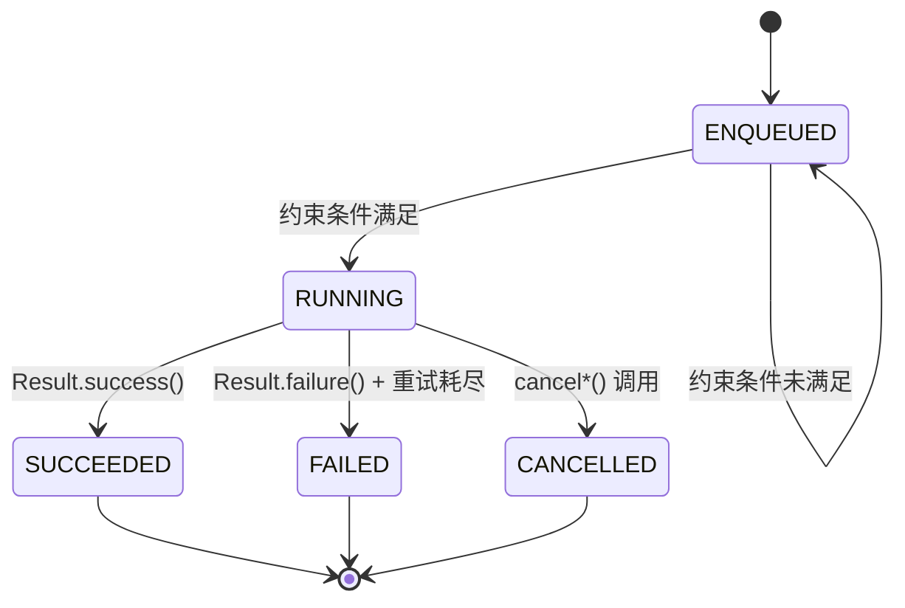
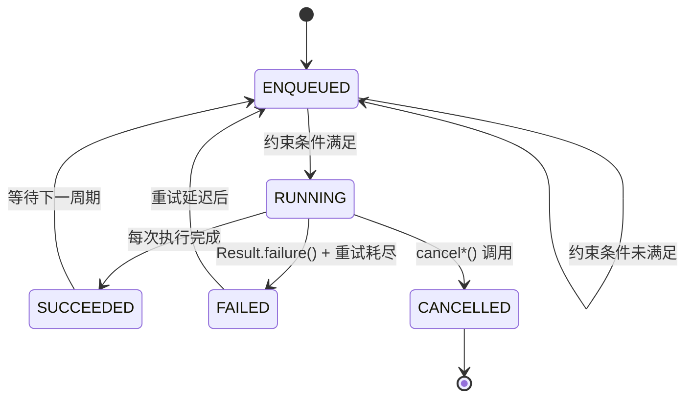
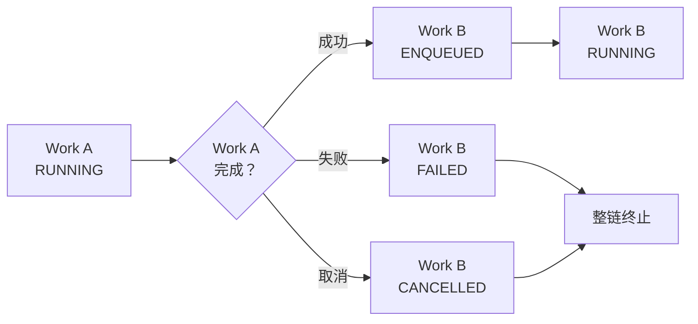

# 6.1.28 工作状态

阳光终于翻过了山脊，把整个帐篷平台都浸透了。

洛芙盘腿坐在野餐垫上，手里捧着一块吃了一半的烤吐司。她的眼睛还盯着希尔的笔记本屏幕，屏幕上那个小陶炉形状的图标依然在安静地跳动着——代表Worker还在ENQUEUED状态。

"怎么还在排队啊。"洛芙把吐司翻了个面，"都等了快半小时了。"

黛琳坐在她旁边，手里捧着一杯温热的柚子茶。她侧过头看了一眼屏幕，嘴角微微扬起。

"你急什么，它又不是跑了。"

"可是——"洛芙又转过去看希尔，"希尔学姐，你说它ENQUEUED了，是不是就说明它在排队？那排到了吗？怎么还没RUNNING？"

希尔正趴在野餐垫边缘，用手指在触控板上划来划去调出更多的调试信息。听到这话，她"噗"地笑了一声，把笔记本往洛芙的方向转了转。

"来，给你看看真相。"

屏幕上是一串Logcat输出，希尔用荧光粉色高亮了几行。洛芙凑近一看，认出了几个关键词：`ENQUEUED`、`WorkSpec`、`Minimum latency`。

"还记得昨天我们说的约束条件吗？"希尔问。

洛芙点点头。约束条件就是那些必须满足才能让Worker开跑的东西——网络状态、电池电量、存储空间什么的。

"这个Worker，"希尔点开了一个标签页，"它的初始延迟被设成了5000毫秒。你看这里——"

她指着Logcat里的一行：

```
D/WorkerWrapper: Work {[nameOfWork]} is ENQUEUED with delay of 5000ms
```

"初始延迟的意思是，就算约束条件全部满足了，系统也会让它再等上5秒。"希尔用指尖敲了敲屏幕，"就像你订好了露营的日期，但还要等火车到站才能开始搭帐篷。"

"哦——"洛芙轻轻应了一声，"所以ENQUEUED只是说'我准备好了，随时可以跑'，但具体什么时候真的跑起来，还要看有没有别的原因？"

伊莎从帐篷里钻了出来，手里抱着一袋刚洗好的草莓。她一屁股坐到野餐垫上，把草莓袋子往四个人中间一放。

"我听到你们在说排队，"她拈起一颗草莓放进嘴里，"有没有觉得ENQUEUED这个状态特别像我们小时候玩的那个游戏——"

"哪个？"洛芙问。

"就是分组的时候啊，"伊莎比划着，"大家都在起跑线后面等着，哨子一响才能跑。但就算哨子响了，也要等前面的人真正跑出去，你才能补上那个位置。ENQUEUED就是'我已经在起跑线后面站好了'。"

黛琳轻轻笑了一声。"这个比喻蛮形象的。"

希尔把笔记本放到膝盖上，也伸手拿了一颗草莓。"那让我来把它画出来吧。"她从背包里掏出了一支马克笔，转向帐篷侧面挂着的那块小白板。

"先画一个最简单的流程。"她画了一个方框，在里面写上"ENQUEUED"。

```
graph LR
    A["ENQUEUED<br/>等待执行"] --> B
    B{"约束条件<br/>满足了吗？"}
    B -->|否| A
    B -->|是| C["RUNNING<br/>执行中"]
```

"这就是ENQUEUED的真实处境——它不是傻站着，是一直在问'我能跑了吗？能跑了吗？'一旦约束条件满足了，它就跳到RUNNING。"

"那要是约束条件一直不满足呢？"洛芙问。

"那就一直等呗。"希尔耸耸肩，"最长可以等多久取决于系统的心情——但通常是几周。如果你用的是Periodic Work，那可能永远都不会跑起来。"

洛芙倒吸了一口气。"那么久的吗……"

"别担心，"黛琳喝了口柚子茶，"Android系统会在电池和数据之间做平衡，不会让你的Worker饿死的。"

希尔在ENQUEUED方框和RUNNING方框之间加了一个判断符号，写上"约束条件满足？"。

"来，我们再加一点细节。"她又画了几条线。

"这是one-time work的标准套路——"

```
graph LR
    A["ENQUEUED"] --> B{"约束条件<br/>满足？"}
    B -->|否| A
    B -->|是| C["RUNNING"]
    C --> D{"执行结果"}
    D -->|成功| E["SUCCEEDED ✓"]
    D -->|失败| F["FAILED ✗"]
    D -->|取消| G["CANCELLED ✗"]
    E --> H[("terminal")]
    F --> H
    G --> H
```

"看，RUNNING之后会有三条路——成功、失败、取消。"希尔用笔在三个结果上画了圈，"每一条都会进入terminal state，就是终态。进去了就不会再出来。"

"终态的意思是——这个Worker就结束了？"洛芙问。

"对，one-time work是这样。"希尔把笔放下，"你没办法重新启动一个已经SUCCEEDED的Worker。如果你想再跑一次，只能重新enqueue一个新的。"

伊莎又拈了一颗草莓，若有所思地看着白板上的图。"感觉好像露营的篝火啊。"

"怎么说？"洛芙歪头看她。

"火柴点燃引火物的时候，是ENQUEUED——你准备好了一切，就差那一点火星。然后火星碰到引火物的瞬间，就是RUNNING——真的开始燃烧了。火燃尽了，要么篝火成功了，暖暖的；要么火灭了，篝火失败了；要么你中途泼了一盆水把它浇灭了，就是CANCELLED。"

希尔拍了拍手。"伊莎学姐这个比喻可以啊，我可以画一个篝火版的。"

"等等，"洛芙突然想到了什么，"那PERIODIC WORK呢？周期性的任务是不是不一样？"

希尔和黛琳交换了一个眼神。

"问到点子上了。"黛琳说。

希尔重新拿起马克笔，在白板上画了另一幅图。

"periodic work没有SUCCEEDED和FAILED这两个终态——"

```
graph LR
    A["ENQUEUED"] --> B{"约束条件<br/>满足？"}
    B -->|否| A
    B -->|是| C["RUNNING"]
    C --> D{"执行结果"}
    D -->|成功| E["SUCCEEDED ✓"]
    D -->|失败| F["FAILED ✗"]
    E -.->|立即重新入队| A
    F -.->|重试后| A
    D -->|取消| G["CANCELLED ✗"]
    G --> H[("terminal")]
```

"periodic work跑完了会重新回到ENQUEUED，因为它要继续跑下一轮。"希尔在图上画了一条虚线从SUCCEEDED指回ENQUEUED，"只有CANCELLED才是它的终态。"

"为什么periodic work没有SUCCEEDED终态啊？"洛芙困惑地皱起眉头，"它不是也会'成功完成'吗？"

"因为periodic work的设计初衷是'永远跑下去'。"黛琳解释道，"它不像one-time work那样有明确的任务量——比如'把这份文件上传完'。periodic work是'每隔一段时间就跑一次'，所以它没有'完成'这个概念，只有'取消'。"

"就像……"伊莎想了想，"就像一个永久的露营灯？你可以关掉它（cancel），但只要它还在亮，你就不能说它'成功了'——它只是在继续工作。"

洛芙似懂非懂地点了点头。

"对了，"希尔突然拍了拍洛芙的肩膀，"你刚才说你的Worker等了半小时还在ENQUEUED——现在过了多久了？"

洛芙赶紧转回去看屏幕。

小陶炉图标还在跳动着，但状态文字变了。

```
I/WorkManager: Work {[nameOfWork]} moved to RUNNING
```

"啊啊啊啊！它RUNNING了！"洛芙差点把吐司扔出去。

希尔笑着摇了摇头。"看到没？ENQUEUED不是一下子就能跳到RUNNING的，中间可能有好几轮'检查-等待-再检查'。这个Worker的延迟是5秒，但你等了这么久，可能是因为还有其他Work在它前面排队。"

"还有其他Work？"洛芙愣住了，"我没设置别的Work啊。"

"系统里可能有很多其他的Work，"黛琳说，"比如其他App的后台同步任务。WorkManager会统筹所有Work，按照优先级和约束条件来调度。"

希尔调出了另一个界面——是Android Studio里的Worker Inspector。

"来，给你看看专业的。"她指着屏幕上的一个彩色状态条，"这个就是你刚刚enqueue的Work的状态历史。"

洛芙凑近一看，屏幕上显示着一个类似甘特图的条状图：

```
ENQUEUED (0:00 - 0:05)
RUNNING  (0:05 - 0:12)
SUCCEEDED (0:12 - )
```

"哇哦。"洛芙的眼睛都亮了，"这也太清楚了吧？"

"这是Android Studio 4.1以上才有的功能，"希尔说，"叫做Worker Inspector。可以看到每个Work的实时状态、状态转换时间、执行日志等等。"

"那我以后调试WorkManager的问题就用这个了！"洛芙兴奋地说。

"可以，但别太依赖它。"黛琳说，"Worker Inspector需要在真机或者模拟器上运行，而且有些状态（比如BLOCKED）不太容易从这个界面上看出来。"

"BLOCKED？"洛芙又抓住了关键词，"还有一个BLOCKED状态吗？"

希尔和黛琳再次交换了一个眼神。

"这个嘛，"希尔拿起了马克笔，"就稍微复杂一点了。"

她在白板上画了一个新的图，这次画的是链状的结构。

"BLOCKED是WorkChain独有的状态。"

```
graph LR
    A["Work A<br/>ENQUEUED"] --> B["Work A<br/>RUNNING"]
    B --> C["Work B<br/>BLOCKED"]
    C --> D{"Work A<br/>完成？"}
    D -->|否| C
    D -->|是| E["Work B<br/>ENQUEUED"]
    E --> F["Work B<br/>RUNNING"]
```

"看到没有？Work B在Work A完成之前，一直是BLOCKED状态——被卡住了，动不了。"

洛芙盯着图看了好一会儿。"就像接力赛？第二棒的运动员在第一棒交棒之前，只能在原地等着，不能跑出去。"

"差不多是这意思。"希尔点点头，"但BLOCKED不是说Work B被禁止运行，而是说它还没资格运行——要等前面那个Work真正完成才行。"

"那如果Work A失败了呢？"洛芙问。

"那整条链就断了。"黛琳说，"Work B永远不会被执行，因为它等不到前面的Work A成功完成的那一刻。"

希尔在图上加了一个新的分支：

```
graph LR
    A["Work A<br/>ENQUEUED"] --> B["Work A<br/>RUNNING"]
    B --> C{"Work A<br/>结果"}
    C -->|成功| D["Work B<br/>ENQUEUED"]
    C -->|失败| E["Work B<br/>FAILED"]
    C -->|取消| F["Work B<br/>CANCELLED"]
    D --> G["Work B<br/>RUNNING"]
```

"这就是链式工作的残酷之处——一环扣一环，前面出了问题，后面全部受影响。"

洛芙沉默了片刻。

"所以用WorkChain的时候，要特别注意失败处理？"

"没错。"黛琳点点头，"最好给每个Work都设置重试策略，这样就算偶尔失败了一次，也有机会重新来。"

希尔放下笔，重新坐回野餐垫上。她拿起笔记本，在上面敲了几行代码。

"来，我们写个简单的例子，演示一下这些状态到底怎么用。"

```kotlin
// 创建一次性工作请求
val workRequest = OneTimeWorkRequestBuilder<MyWorker>()
    .setConstraints(
        Constraints.Builder()
            .setRequiredNetworkType(NetworkType.CONNECTED)
            .build()
    )
    .setInitialDelay(5, TimeUnit.SECONDS) // 初始延迟5秒
    .addTag("my_work")
    .build()

// 入队，系统会将其状态设为 ENQUEUED
WorkManager.getInstance(context)
    .enqueue(workRequest)

// 观察状态变化
workRequest.let { request ->
    WorkManager.getInstance(context)
        .getWorkInfoByIdLiveData(request.id)
        .observe(lifecycleOwner) { workInfo ->
            when (workInfo?.state) {
                WorkInfo.State.ENQUEUED -> {
                    Log.d("WorkerDemo", "状态: ENQUEUED - 工作已入队，等待执行")
                }
                WorkInfo.State.RUNNING -> {
                    Log.d("WorkerDemo", "状态: RUNNING - 工作中...")
                }
                WorkInfo.State.SUCCEEDED -> {
                    Log.d("WorkerDemo", "状态: SUCCEEDED - 工作成功完成")
                }
                WorkInfo.State.FAILED -> {
                    Log.d("WorkerDemo", "状态: FAILED - 工作失败")
                }
                WorkInfo.State.BLOCKED -> {
                    Log.d("WorkerDemo", "状态: BLOCKED - 被其他工作阻塞")
                }
                WorkInfo.State.CANCELLED -> {
                    Log.d("WorkerDemo", "状态: CANCELLED - 工作已取消")
                }
                else -> {
                    Log.d("WorkerDemo", "状态: ${workInfo?.state}")
                }
            }
        }
}
```

"这段代码演示了一个最基础的OneTimeWorkRequest的状态流转。"希尔指着屏幕说，"首先是ENQUEUED，然后如果约束条件满足了，就变成RUNNING，最后要么SUCCEEDED，要么FAILED，要么CANCELLED。"

洛芙认真地看着代码，然后在笔记本上记了下来。

"希尔学姐，这个BLOCKED状态我还有点模糊……能再举个例子吗？"

"没问题。"希尔又敲了几行代码。

```kotlin
// 创建链式工作
val workA = OneTimeWorkRequestBuilder<WorkerA>().build()
val workB = OneTimeWorkRequestBuilder<WorkerB>().build()
val workC = OneTimeWorkRequestBuilder<WorkerC>().build()

// 建立链式关系: A -> B -> C
WorkManager.getInstance(context)
    .beginWith(workA)
    .then(workB)
    .then(workC)
    .enqueue()
```

"这段代码创建了三个Work的链：A完成后执行B，B完成后执行C。"希尔调出了另一个界面，画了一个简单的流程图。

```
┌──────────┐     成功完成      ┌──────────┐     成功完成      ┌──────────┐
│  Work A  │ ──────────────→  │  Work B  │ ──────────────→  │  Work C  │
│ RUNNING  │                  │ BLOCKED  │                  │ BLOCKED  │
└──────────┘                  └──────────┘                  └──────────┘
                                  ↑                               ↑
                              Work A完成后                    Work B完成后
                              进入ENQUEUED                    进入ENQUEUED
```

"初始状态下，只有Work A是RUNNING——因为它是链的起点。"希尔用笔尖敲着图上的Work A，"Work B和Work C都是BLOCKED，因为它们在等前面的Work完成。"

"一旦Work A成功完成，Work B就变成ENQUEUED，然后变成RUNNING。"希尔在图上比划着，"然后Work C还是BLOCKED，等Work B完成。"

"那如果Work B失败了呢？"洛芙问。

"那Work C就永远BLOCKED了。"希尔摊了摊手，"除非你重新运行整个链，或者单独处理Work B的失败。"

"好严格啊。"洛芙小声说。

"所以设计链的时候要想清楚。"黛琳补充道，"如果后面的Work不依赖前面Work的具体结果，只是需要'前面那个跑完了'这个事实，那用链没问题。但如果后面的Work需要前面Work的数据，那就更要确保失败处理做完善。"

伊莎这时候站了起来，伸了个懒腰。"我有个问题。"

"什么？"洛芙抬头看她。

"如果我在Work A还在RUNNING的时候，就想取消整个链——会发生什么？"

"好问题。"希尔马上在笔记本上敲了起来。

```kotlin
// 取消整个链
val workChainName = workManager
    .beginUniqueWork("my_chain", ExistingWorkPolicy.KEEP, workA)
    .then(workB)
    .then(workC)
    .enqueue()

// 取消链
workManager.cancelUniqueWork("my_chain")
```

"调用`cancelUniqueWork`会立即把所有还没执行完的Work都改成CANCELLED状态。"希尔说，"但已经RUNNING的那个Work不会立即停止——它会跑完，然后发现自己的状态被设成了CANCELLED。"

"那它会怎么处理已经做完的工作？"洛芙问。

"这取决于你的Worker代码。"黛琳说，"好的Worker应该在开始工作前检查一下自己的状态，如果已经被取消就应该立即停止。"

希尔点点头，调出了一段代码：

```kotlin
class MyWorker(appContext: Context, workerParams: WorkerParameters) :
    CoroutineWorker(appContext, workerParams) {

    override suspend fun doWork(): Result {
        // 在开始工作前检查是否被取消
        if (isStopped) {
            return Result.failure()
        }

        // 做一些工作
        for (i in 1..10) {
            // 每一步都检查是否被取消
            if (isStopped) {
                return Result.failure()
            }
            doStep(i)
        }

        return Result.success()
    }
}
```

"`isStopped`这个属性就是Worker在检查自己是否已经被取消。"希尔指着代码说，"如果Worker发现isStopped为true，就应该尽快收尾，不要再做新的操作。"

洛芙在本子上飞快地记着：`isStopped`——检查是否被取消。

"好了，差不多了。"黛琳站起来，拍了拍裙子上的草屑，"让洛芙消化一下。"

洛芙抬起头，阳光正好落在她的笔记本上，把刚才写的那些字照得亮亮的。

"我再问最后一个问题！"她举起手，"SUCCEEDED和FAILED之后，还能重新执行吗？"

"SUCCEEDED不行。"希尔斩钉截铁地说，"SUCCEEDED是终态，这个Worker彻底结束了。"

"但可以用`ExistingWorkPolicy.REPLACE`重新入队一个同名的Work，系统会创建一个新的Work实例。"她补充道，"FAILED的话，如果设置了重试策略，会在一定条件下重新执行；但如果重试次数用完了还是失败，就会永久停留在FAILED状态。"

"那怎么查看一个Work是不是永久失败了呢？"洛芙问。

"可以用`getWorkInfoForUniqueWork`或者`getWorkInfosForUniqueWork`来查询。"希尔说，"返回的WorkInfo里会显示状态和失败原因。"

她敲了最后一个代码块：

```kotlin
// 查询特定唯一工作的状态
WorkManager.getInstance(context)
    .getWorkInfosForUniqueWork("my_unique_work")
    .get()
    .forEach { workInfo ->
        when (workInfo.state) {
            WorkInfo.State.ENQUEUED -> {
                Log.d("WorkerDemo", "工作已入队")
            }
            WorkInfo.State.BLOCKED -> {
                Log.d("WorkerDemo", "工作被阻塞")
            }
            WorkInfo.State.RUNNING -> {
                Log.d("WorkerDemo", "工作执行中")
            }
            WorkInfo.State.SUCCEEDED -> {
                Log.d("WorkerDemo", "工作成功完成")
                // 可以在此获取输出数据
                val outputData = workInfo.outputData.getString("result_key")
                Log.d("WorkerDemo", "输出数据: $outputData")
            }
            WorkInfo.State.FAILED -> {
                Log.d("WorkerDemo", "工作失败")
                // 获取失败原因
                val failureReason = workInfo.runAttemptCount
                Log.d("WorkerDemo", "已重试次数: $failureReason")
            }
            WorkInfo.State.CANCELLED -> {
                Log.d("WorkerDemo", "工作已取消")
            }
        }
    }
```

"这个例子展示了怎么查询一个唯一工作的状态，并处理不同的终态。"希尔把笔记本合上，"SUCCEEDED的时候可以从outputData里拿结果，FAILED的时候可以看`runAttemptCount`知道重试了几次。"

洛芙长长地呼了一口气。

"原来一个Worker有这么多状态……"她揉了揉太阳穴，"ENQUEUED、RUNNING、BLOCKED、SUCCEEDED、FAILED、CANCELLED……六个状态，加上约束条件和初始延迟，再加上链式依赖，感觉好复杂。"

"慢慢来。"黛琳温和地说，"每学一个知识点就像搭一个帐篷，先把骨架立好，里面的细节以后再填。"

伊莎把最后一颗草莓塞进嘴里，站起身来。"去走走吧，脑子装太多了。"

四个人收拾了一下野餐垫和笔记本，往营地旁边的小径走去。秋日的阳光暖暖地照在她们身上，枫叶在风中沙沙作响。

洛芙走在最后，她的笔记本还抱在胸前。那些状态流转的图在她脑海里转了又转——ENQUEUED是站在起跑线上，RUNNING是真正跑起来了，SUCCEEDED是冲过终点线，BLOCKED是在接力区等待的运动员……

"洛芙！"希尔的声音从前面传来，"快来看，这里有只松鼠！"

洛芙抬起头，看见希尔正蹲在一棵枫树下，指着树干上的什么东西。她小跑过去，蹲下一看——一只毛茸茸的松鼠正抱着一个松果，用圆圆的眼睛看着她们。

"它在存冬天粮食呢。"伊莎轻声说。

洛芙看着那只松鼠，突然笑了。

"它好像WorkManager啊。"

"怎么说？"三个人都看向她。

"ENQUEUED就是收集松果的准备阶段，RUNNING就是真的在啃松果，SUCCEEDED就是吃饱了——然后冬天来了，它就BLOCKED了，因为没有新的松果了。"

希尔愣了一下，然后笑出了声。

"你这个比喻也太牵强了吧！"

"但是挺可爱的。"黛琳微笑着说。

伊莎拍了拍洛芙的头。"下次学新东西的时候，也用这种联想的方式试试看。"

"好！"洛芙用力点了点头。

她低头看了看笔记本，又看了看远处的帐篷平台。阳光把整个营地照得金灿灿的，空气里弥漫着松针和枫叶混合的清香。

六种状态，一幅图，无数种可能。

就像露营一样，每一步都是探索。

---

## 专业技术总结

> **WorkManager Work States** — WorkManager中每个WorkRequest在生命周期内会经历不同的状态。状态决定了Work何时执行、是否成功、以及是否可以被重新调度。理解状态流转是调试后台任务的基础。

#### 结构图

**One-Time Work 状态流转图：**



**Periodic Work 状态流转图：**



**WorkChain BLOCKED 状态说明：**



#### 复杂度与影响

| 状态 | 触发条件 | 是否终态 | 对后续Work的影响 |
|------|----------|----------|------------------|
| ENQUEUED | WorkRequest入队 | 否 | 等待约束条件满足 |
| RUNNING | 约束条件满足，系统调度 | 否 | Work正在执行 |
| BLOCKED | WorkChain中前序Work未完成 | 否 | 等待前序Work完成 |
| SUCCEEDED | doWork()返回Result.success() | 是(OTW) | 触发后续Work或结束 |
| FAILED | doWork()返回Result.failure()且重试耗尽 | 是 | 整链终止(WorkChain中) |
| CANCELLED | cancel*()被调用 | 是 | 整链终止(WorkChain中) |

#### 反模式与陷阱

1. **在ENQUEUED状态下误以为Work已执行**
   - 修复：确认约束条件已满足，或检查是否有其他Work优先级更高

2. **不检查isStopped()导致取消后继续工作**
   - 修复：在Worker的doWork()中定期调用isStopped检查，已取消应立即返回Result.failure()

3. **One-time Work失败后不设置重试策略**
   - 修复：使用setBackoffCriteria()配置指数退避，限制重试次数

4. **链式工作中未处理中间Work失败的情况**
   - 修复：为每个Work单独设置重试策略，或使用WorkManager.handleWorkFinishedCallback()监听失败

5. **混淆Periodic Work和One-time Work的终态**
   - 修复：Periodic Work只有CANCELLED是终态，SUCCEEDED/FAILED后会立即重新入队等待下一周期

#### 设计哲学

**状态驱动与生命周期感知**：WorkManager的状态机设计体现了组件化后台任务的核心理念——系统而非应用控制执行时机。每个状态都有明确的语义和触发条件，使得后台任务的行为可预测、可调试。

**约束即前置条件**：将约束条件作为状态流转的一部分，而非额外的检查逻辑。这使得Work可以在任何时候被暂停（BLOCKED）和恢复（ENQUEUED→RUNNING），系统可以在资源紧张时安全地回收资源。

**终态不可逆原则**：SUCCEEDED、FAILED、CANCELLED三个终态的设计确保了状态机的健壮性——一旦进入终态，Work就不会再意外跳转回活跃状态。这简化了状态追踪和问题排查。

---
#### 🏕️ 动手练习

**练习目标**：掌握WorkManager六种状态的观察与响应

**练习说明**：本练习要求创建一个演示WorkManager各种状态流转的完整App，包含一次性工作、周期工作和链式工作的状态监听。

**Task 1：创建基础WorkRequest并观察状态**

目标：创建一个OneTimeWorkRequest，观察ENQUEUED→RUNNING→SUCCEEDED的状态变化

步骤：
1. 创建Android项目，添加`androidx.work:work-runtime-ktx:2.9.0`依赖
2. 创建自定义Worker类，重写doWork()方法，模拟耗时操作
3. 使用WorkManager.enqueue()入队，使用getWorkInfoByIdLiveData()观察状态
4. 在Logcat中打印状态变化

验收标准：
- [ ] Logcat显示ENQUEUED状态
- [ ] Logcat显示RUNNING状态
- [ ] Logcat显示SUCCEEDED状态
- [ ] Worker成功执行完毕

提示代码：
```kotlin
class MyWorker(context: Context, params: WorkerParameters) :
    CoroutineWorker(context, params) {
    override suspend fun doWork(): Result {
        Log.d("MyWorker", "开始执行")
        delay(3000) // 模拟耗时操作
        Log.d("MyWorker", "执行完成")
        return Result.success()
    }
}
```

**Task 2：触发FAILED状态并观察重试**

目标：创建一个会失败的Worker，设置重试策略，观察FAILED→ENQUEUED→RUNNING→FAILED的重试流程

步骤：
1. 在Worker中随机抛出异常模拟失败
2. 使用setBackoffCriteria()设置指数退避重试策略
3. 使用setInitialDelay()限制重试间隔
4. 观察Logcat中的重试日志

验收标准：
- [ ] 首次执行记录FAILED状态
- [ ] 看到指数退避的延迟变化
- [ ] 观察到多次重试（设置maxAttemptCount=3）
- [ ] 最终停留在FAILED状态

提示代码：
```kotlin
val workRequest = OneTimeWorkRequestBuilder<FailWorker>()
    .setBackoffCriteria(
        BackoffPolicy.EXPONENTIAL,
        10,
        TimeUnit.SECONDS
    )
    .setConstraints(
        Constraints.Builder()
            .setRequiresBatteryNotLow(true)
            .build()
    )
    .build()
```

**Task 3：使用链式Work观察BLOCKED状态**

目标：创建三步链式Work，观察BLOCKED状态以及链的终止行为

步骤：
1. 创建三个不同的OneTimeWorkRequest（WorkA、WorkB、WorkC）
2. 使用beginWith().then().then()建立链式关系
3. 在WorkB和WorkC中添加延迟，观察BLOCKED状态
4. 让WorkA失败，观察整链的终止行为

验收标准：
- [ ] 观察到Work B处于BLOCKED状态
- [ ] 观察到Work A完成后Work B变为ENQUEUED
- [ ] 观察到Work A失败后整链终止
- [ ] Work B和Work C保持FAILED/CANCELLED状态

**Task 4：取消Work并观察CANCELLED状态**

目标：使用uniqueWork机制取消进行中的Work，观察CANCELLED状态

步骤：
1. 使用beginUniqueWork()创建唯一工作链
2. 在Worker中添加足够长的延迟（如30秒）
3. 在Work运行时调用cancelUniqueWork()
4. 观察日志，确认isStopped在取消后被触发

验收标准：
- [ ] 调用cancelUniqueWork()成功
- [ ] 进行中的Work检测到isStopped()为true
- [ ] 日志显示CANCELLED状态

**Task 5：使用PeriodicWork观察周期状态**

目标：创建PeriodicWork，观察其重复执行时没有SUCCEEDED终态的特性

步骤：
1. 使用PeriodicWorkRequestBuilder创建周期工作
2. 设置repeatInterval为15分钟（最小间隔）
3. 观察多次执行，记录每次RUNNING状态
4. 确认PeriodicWork永远不会达到SUCCEEDED终态

验收标准：
- [ ] PeriodicWork成功入队
- [ ] 观察到多个RUNNING状态（至少2次执行）
- [ ] 每次执行后自动重新进入ENQUEUED
- [ ] 只有调用cancel后才能达到CANCELLED终态


**面试热身**

Q1：WorkManager有哪些状态？请描述One-time Work和Periodic Work的状态流转差异。

Q2：BLOCKED状态在什么情况下会出现？它和ENQUEUED有什么区别？

Q3：如果一个Worker在RUNNING状态时被取消了，它会立即停止吗？应该如何处理这种情况？

Q4：WorkChain中某个Work失败后，后续的Work会怎样？应该如何设计失败处理？

Q5：为什么Periodic Work没有SUCCEEDED和FAILED终态？这会带来什么影响？


#### 参考实现要点

1. **状态观察优先使用LiveData而非轮询**：LiveData会在状态变化时自动回调，避免频繁查询数据库。

2. **使用WorkerInspector在Android Studio中调试**：真机或模拟器运行应用后，在Android Studio的Device File Explorer中可以找到work_database目录，直接查看Work的详细状态。

3. **为链式Work设置失败监听器**：使用WorkManager.getWorkInfoByIdLiveData()监听每个节点的状态，同时在父级使用ListenableFuture.addListener()处理整链失败。

4. **Periodic Work的最小间隔是15分钟**：如果需要更短的间隔，应使用OneTimeWorkRequest配合自定义调度逻辑，而非PeriodicWork。

5. **cancelUniqueWork与cancelAllWork的区别**：cancelUniqueWork只取消指定名称的工作链，cancelAllWork会取消所有已入队的工作。


---
> 学习建议：WorkManager的状态机是理解后台任务行为的钥匙。建议从简单的OneTimeWork开始，先掌握ENQUEUED→RUNNING→SUCCEEDED的基本流程，再逐步深入BLOCKED、FAILED等复杂场景。


## 🍹洛芙的小小日记本

今天学到了WorkManager的六种状态。伊莎学姐说的那个"永久露营灯"的比喻我会记住的——灯只有被关掉才会停止，除非那就是CANCELLED。ENQUEUED不是闲着，是在一直问"我能跑了吗"。这句话好像不只对代码有用呢。


## 今日关键词

**ENQUEUED** — 工作已入队，等待约束条件满足后进入RUNNING状态。

**RUNNING** — 工作正在执行，doWork()方法正在运行。

**BLOCKED** — 在WorkChain中，等待前序工作完成才能变为ENQUEUED。

**SUCCEEDED** — One-time Work成功完成的终态；Periodic Work每次完成后会重新进入ENQUEUED。

**FAILED** — 工作失败且重试次数耗尽的终态。

**CANCELLED** — 工作被明确取消的终态，通过cancelUniqueWork或cancelAllWork触发。

**WorkChain** — 多个WorkRequest通过beginWith().then()建立的依赖链，前序Work完成后后续Work才能执行。

**setBackoffCriteria** — 设置Work失败后的重试策略，包括退避策略（指数/线性）和最小延迟。

**ExistingWorkPolicy** — 定义当唯一工作已存在时的行为策略：REPLACE（替换）、KEEP（保留）、APPEND（追加）。

**isStopped** — Worker的方法，在doWork()执行期间检查工作是否已被取消，被取消时应立即停止并返回Result.failure()。

**WorkInfo** — 封装Work执行信息的类，包含state、runAttemptCount、outputData等属性。

**PeriodicWorkRequest** — 周期性工作请求，最小重复间隔为15分钟，只有CANCELLED是终态。

**OneTimeWorkRequest** — 一次性工作请求，有SUCCEEDED、FAILED、CANCELLED三个终态。

**Constraints** — WorkRequest的约束条件，包括网络状态、电池电量、存储空间等。

**setInitialDelay** — 设置WorkRequest入队后多久开始执行，用于延迟调度。
