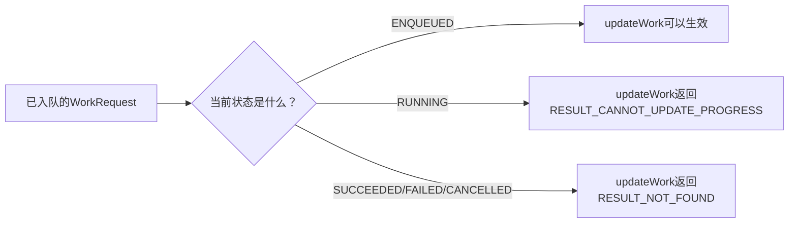
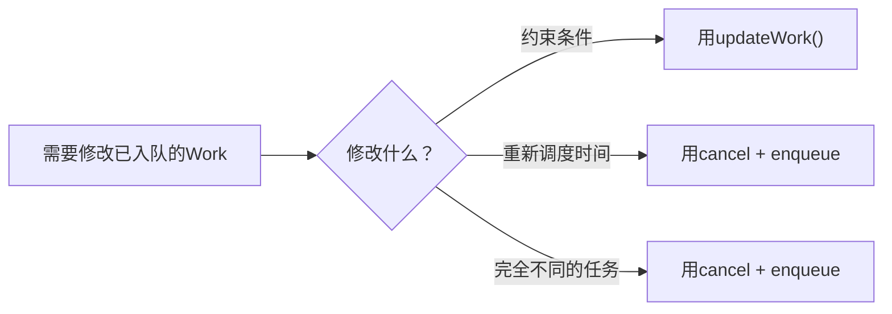
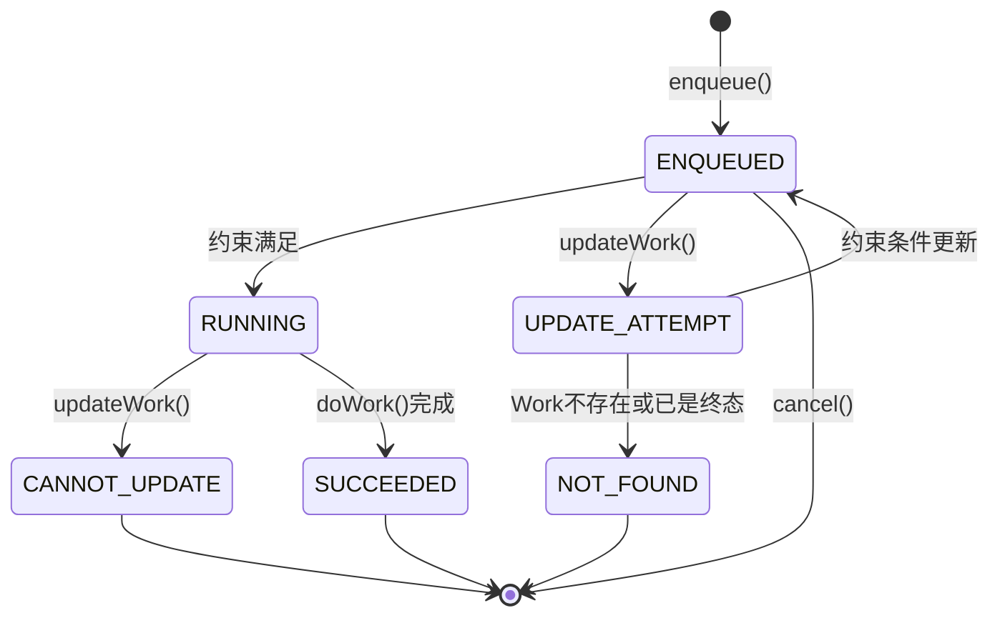
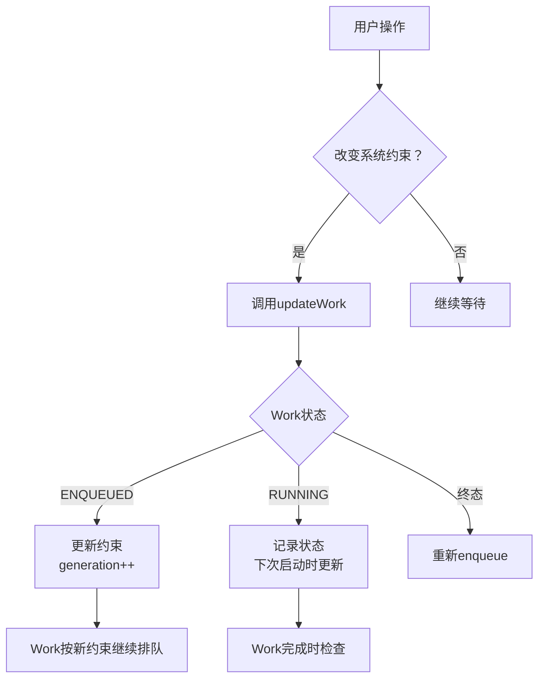
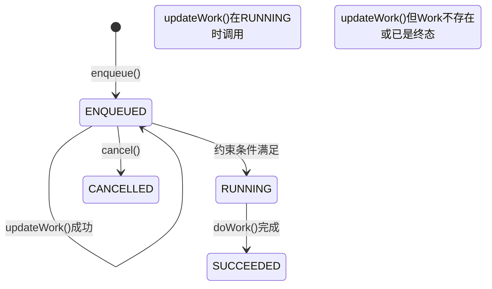

# 6.1.29 更新已排队的工作

帐篷帆布被午后阳光晒得微微发烫。

洛芙把野餐垫拽进了帐篷的阴影里，趴在上面前后晃悠。她的手机屏幕还亮着，上面是WorkManager的调试界面，那个代表Worker的小陶炉图标还在安静地跳动着——状态依然是ENQUEUED。

"怎么还在排队啊……"她嘟囔着把脸埋进手臂里。

希尔正坐在旁边一棵矮枫树下，笔记本电脑搁在膝盖上，眉头微微皱起。她已经盯着屏幕好几分钟了，手指悬在触控板上方却没有动作。

"希尔学姐？"洛芙翻了个身，凑过去看她的屏幕，"你在看什么？"

"一个很奇怪的问题。"希尔把她看到的界面转过来给洛芙看。

屏幕上是一个已经入队的Periodic Work的详情页，状态显示ENQUEUED。希尔的指尖点在其中一个字段上——约束条件那一栏，写着`REQUIRES_BATTERY_NOT_LOW`和`REQUIRES_CHARGING`。

"我想改这个约束条件。"希尔说，"但它是已经入队的Work，普通的enqueue方法没办法更新它。"

洛芙眨了眨眼。"那……cancel掉再重新入队一个？"

希尔摇了摇头。"cancel再enqueue会有一个问题——中间会有一段空白期，新的Work入队之前，旧的那个已经被cancel了。如果这是一个很重要的后台同步任务，这段空白期可能导致数据不一致。"

伊莎这时候从帐篷里钻了出来，手里端着四杯冰麦茶。她把杯子放在野餐垫旁边，自己也盘腿坐下来。

"你们在说什么？"她问。

"希尔学姐想改一个已经入队的Worker的约束条件。"洛芙说。

伊莎"嗯"了一声，往自己嘴里丢了一颗薄荷糖。"想改已经排队的任务啊……"

"对啊，"希尔叹了口气，把笔记本放在膝盖上，"我本来想用cancel加enqueue的方法，但是那个Work已经被入队了，中途改的话会有一个时间窗口——"

"所以你就卡在这里了？"伊莎歪着头看她。

"差不多吧。"希尔又往屏幕上扫了一眼，"我之前写App的时候用的是Firebase JobDispatcher，那个好像没有这个功能——你要改的话只能cancel掉再enqueue。WorkManager应该好一点吧？"

黛琳这时候也走了过来，手里拿着一本翻开的笔记本。她在希尔旁边坐下，把笔记本放在膝盖上，笔尖落在白板笔旁边。

"WorkManager 2.8.0之后有一个新API，叫updateWork。"她说。

希尔愣了一下。"updateWork？"

"对，"黛琳翻开笔记本，上面画着一个简单的代码结构，"它是专门用来更新已经入队的WorkRequest的——不需要cancel，不需要重新enqueue，直接改约束条件。"

希尔的眼睛一下子亮了起来。"这么好用的吗？"

洛芙也凑了过去。"updateWork是怎么用的？"

"来，让我给你们演示一下。"黛琳拿起马克笔，转向帐篷侧面挂着的那块小白板。

"updateWork的核心思想很简单——它会根据你传入的WorkRequest的`name`和`uniqueWork`来找到之前已经入队的那个Work，然后用你新的约束条件去更新它。"

她在白板上写下了第一行：

```kotlin
// 创建要更新的WorkRequest（保持原来的Work名和uniqueName）
val newWorkRequest = OneTimeWorkRequestBuilder<MyWorker>()
    .setConstraints(
        Constraints.Builder()
            .setRequiredNetworkType(NetworkType.CONNECTED)
            .setRequiresBatteryNotLow(false) // 关键：修改了约束条件
            .build()
    )
    .build()

// 调用updateWork()更新已入队的Worker
val updateResult = WorkManager.getInstance(context)
    .updateWork(newWorkRequest, "my_work", ExistingWorkPolicy.REPLACE, null)
```

"看到没有？"黛琳指着代码说，"关键就在这里——`ExistingWorkPolicy.REPLACE`。这告诉WorkManager：找到那个叫`my_work`的Work，然后用新的WorkRequest去替换它的约束条件。"

"等等，"希尔举起手，"这里的`newWorkRequest`是什么类型的？它不是重新创建的吗？"

"对，它是新创建的WorkRequest，但是它更新的是原来那个Worker的执行计划，而不是创建一个新的Worker。"黛琳解释道，"这有点像你预约了一个露营位子，然后打电话给营地，说'帮我把预约的条件改一下'——你还是你，只是条件变了。"

洛芙若有所思地点了点头。"那原来的Work会重新入队吗？"

"会的，"黛琳说，"但这个重新入队是WorkManager内部处理的，你不需要手动cancel再enqueue。中间没有时间窗口。"

希尔已经在她的笔记本上敲了起来。"我试试看。"

```kotlin
// 假设这是之前已经入队的WorkRequest
val existingWorkRequest = OneTimeWorkRequestBuilder<SyncWorker>()
    .setConstraints(
        Constraints.Builder()
            .setRequiresBatteryNotLow(true)
            .setRequiresCharging(true) // 原本要求充电
            .build()
    )
    .addTag("sync_task")
    .build()

// 入队（之前已经执行过这行代码）
WorkManager.getInstance(context).enqueue(existingWorkRequest)

// 现在想更新它的约束条件：不再要求充电，只要求电量不低
val updatedWorkRequest = OneTimeWorkRequestBuilder<SyncWorker>()
    .setConstraints(
        Constraints.Builder()
            .setRequiresBatteryNotLow(false) // 不再要求电量不低
            .setRequiresCharging(false) // 移除充电要求
            .build()
    )
    .build()

// 使用updateWork更新约束（保持原tag和workerClass）
val result = WorkManager.getInstance(context)
    .updateWork(
        updatedWorkRequest,
        "sync_task", // 使用原来的uniqueWork名称
        ExistingWorkPolicy.REPLACE,
        null
    )
```

"这段代码演示了一个最基础的updateWork场景。"希尔指着屏幕说，"原Worker要求充电，更新后不要求了——约束条件放宽了。"

"等等，"伊莎突然说，"如果原来的Work已经在RUNNING状态了，updateWork会怎么处理？"

黛琳和希尔同时沉默了一下。

"这是个好问题。"黛琳说，"updateWork只能更新ENQUEUED状态的Work——如果它已经在RUNNING了，系统会返回一个特殊的结果告诉你不能更新。"

她在白板上画了一个简单的流程图：



"所以updateWork只能用在还没开始跑的Worker上？"希尔问。

"对，"黛琳点头，"这是它的局限性之一。如果Work已经在RUNNING了，你只能等它跑完，或者cancel掉重新enqueue。"

洛芙拿起自己的手机，看了看那个还在ENQUEUED状态的Worker图标。"那generation是什么？"

"generation啊，"希尔转过来看着洛芙，"这个也是updateWork的一个重要概念。"

她从黛琳手里接过马克笔，在白板上加了几行字。

"每一次你调用updateWork，系统的内部计数器就会加一。这个计数器叫做generation。"她在白板上写了一个简单的数字序列：" 初始: gen=0 → update后: gen=1 → 再次update后: gen=2"。

"generation就像露营地的'入住批号'。"伊莎突然说，"每次有人退房再入住，批号就加一。但人还是那个人，只是批次变了。"

"这个比喻可以。"希尔在白板上补了一笔，"generation的主要作用是区分不同的'代数'。如果你有多个Worker在排队，系统可以通过generation知道哪个是最新的。"

她拿起笔记本，在上面敲了几行代码：

```kotlin
// 查询一个唯一Work的generation
WorkManager.getInstance(context)
    .getWorkInfosForUniqueWork("sync_task")
    .get()
    .forEach { workInfo ->
        val generation = workInfo.generation
        Log.d("WorkerDemo", "Work generation: $generation")
    }
```

"generation是WorkInfo的一个属性，每次updateWork成功执行后，它就会加一。"希尔说。

"那有什么用呢？"洛芙问。

"可以用来做幂等性检查。"黛琳说，"比如你的App在短时间内多次调用updateWork，系统可以通过generation知道哪个是最新的，避免用旧的数据覆盖新的。"

希尔又问："那如果我想更新Periodic Work呢？可以用updateWork吗？"

"可以，"黛琳点头，"Periodic Work也可以用updateWork更新约束条件。但有一点要注意——Periodic Work的repeatInterval和flexInterval不能通过updateWork修改。"

"为什么？"希尔追问。

"因为repeatInterval是Periodic Work的核心属性，如果允许随意修改，系统的调度逻辑就会乱套。"黛琳解释道，"所以updateWork只能修改Constraints，其他参数不能动。"

伊莎拈起一颗薄荷糖，若有所思地看着白板上的图。"感觉updateWork就像给已经出发的旅行团改目的地——你可以改行程，但不能让旅行团掉头或者重新出发。"

"这个比喻不太准确哦。"希尔摇摇头，"updateWork是改约束条件，不是改目的地。就像旅行团已经出发了，你可以告诉导游'今天不一定要充电宝了，但还是要带防晒霜'。"

"哦——"伊莎笑着点了点头，"那就是改装备清单，不是改行程。"

"对，差不多是这个意思。"希尔说。

洛芙突然想到了什么。"那如果我用了uniqueWork，但是用了不同的`ExistingWorkPolicy`，结果会不一样吗？"

"当然不一样。"黛琳说，"我来给你画一下。"

她在白板上画了一个简单的表格：

| ExistingWorkPolicy | updateWork行为 |
|---|---|
| REPLACE | 找到同名Work，用新WorkRequest替换 |
| KEEP | 如果同名Work存在且状态不是终态，保持旧Work不变 |
| APPEND | 不适用于updateWork，会抛出异常 |

"REPLACE是最常用的。"黛琳说，"KEEP的话，如果你想保护已有的Work不被意外更新，可以用它——但通常情况下你不会这样做。"

希尔在笔记本上敲了一串代码，眉头紧锁。

"我有个问题，"她说，"cancel加enqueue和updateWork到底什么时候用哪个？"

"这是个好问题，"黛琳说，"让我来给你对比一下。"

她在白板上画了一个新的图：



"updateWork只适合改约束条件，"黛琳说，"如果你的场景是要完全重新调度一个任务，或者任务的执行内容都变了，那还是需要cancel再enqueue。"

"为什么？"希尔问。

"因为updateWork不会创建新的Work。"黛琳说，"它只是在原来的Work上改约束条件。如果你用了不同的Worker类，或者完全不同的任务逻辑，系统会拒绝更新。"

希尔恍然大悟。"所以updateWork只能改约束条件，不能改Worker本身。"

"对，"黛琳点头，"这是它的设计哲学——WorkManager认为，一个已经入队的任务，其核心逻辑不应该轻易改变。如果你需要完全不同的任务，应该cancel掉再enqueue一个新的。"

洛芙在自己的笔记本上飞快地记着：`updateWork`——只能改约束条件，不能改Worker类。

"那cancel加enqueue有什么问题吗？"希尔问，"为什么WorkManager要专门提供一个updateWork？"

"问题在于cancel和enqueue之间的时间窗口。"黛琳说，"如果你在T1时刻cancel了一个Work，系统会在T2时刻才真正把它从队列里移除。但在这段时间内，如果有其他的Work试图查询队列状态，可能会看到不一致的数据。"

她在白板上画了一条时间线：

```mermaid
gantt
    title Cancel + Enqueue vs updateWork
    dateFormat X
    axisFormat %s

    section Cancel + Enqueue
    Cancel请求发出: done, 0, 5
    等待系统处理: done, 5, 10
    旧Work被移除: done, 10, 15
    新Work入队: done, 15, 20

    section updateWork
    updateWork调用: done, 0, 5
    约束条件更新: done, 5, 10
    Work继续排队: done, 10, 15
```



"看，"黛琳指着图，"cancel加enqueue中间有一段空白期，而updateWork是原子操作，不存在这个问题。"

希尔"嗯"了一声。"明白了，updateWork更适合对可靠性要求高的场景。"

"对，"黛琳点头，"如果你要更新一个关键的后台同步任务，最好用updateWork，避免cancel造成的数据不一致。"

伊莎这时候站起身来，伸了个懒腰。"我去拿点东西。"她往帐篷的方向走去。

希尔突然想到了什么，又转向黛琳。"那如果我的Work已经在RUNNING状态了，但我又想让它按照新的约束条件跑——怎么办？"

"有两个选择。"黛琳说。

"第一，等它跑完，然后在Work内部记录一个标记，下次启动新的Work的时候用新的约束条件。"

"第二，cancel掉这个Work，重新enqueue一个新的。但要注意，cancel不会立即停止正在RUNNING的Work，它只是标记这个Work为CANCELLED，等它跑完之后才发现状态已经被改了。"

希尔若有所思地点了点头。"所以cancel其实是异步的。"

"对，"黛琳说，"这就是为什么好的Worker应该在doWork()里检查isStopped()——如果已经被cancel了，应该尽快停止工作。"

洛芙突然问："那updateWork会改变Work的generation，但会让它重新跑吗？"

"不会，"黛琳说，"updateWork只是更新约束条件，不会触发Work重新执行。如果你想让一个已经跑完的Work重新跑，只能重新enqueue一个新的。"

"那如果我在Work跑完之后想更新它的某些参数呢？"希尔追问。

"那是做不到的，"黛琳说，"Work一旦到了终态（SUCCEEDED、FAILED、CANCELLED），就永远不可能再被updateWork影响了。你只能创建新的WorkRequest。"

伊莎的声音从帐篷方向传来："那WorkManager怎么知道哪个Work是最新的？"

"靠generation，"希尔说，"每次updateWork成功，generation就会加一。系统会维护一个内部映射表，记录每个uniqueWork名称对应的最新generation。"

她拿起笔记本，在上面敲了几行代码：

```kotlin
// 监听updateWork的结果
val updateResult = WorkManager.getInstance(context)
    .updateWork(
        updatedWorkRequest,
        "sync_task",
        ExistingWorkPolicy.REPLACE,
        null
    )

// updateWork返回一个ListenableFuture<UpdateResult>
Futures.addCallback(updateResult, object : FutureCallback<UpdateResult> {
    override fun onSuccess(result: UpdateResult?) {
        when (result) {
            UpdateResult.START_INCREMENTAL_UPDATE -> {
                Log.d("WorkerDemo", "增量更新已开始")
            }
            UpdateResult.CANNOT_UPDATE_PROGRESS -> {
                Log.d("WorkerDemo", "无法更新：Work已在RUNNING")
            }
            UpdateResult.NOT_FOUND -> {
                Log.d("WorkerDemo", "未找到对应Work或已是终态")
            }
        }
    }

    override fun onFailure(t: Throwable) {
        Log.e("WorkerDemo", "updateWork失败", t)
    }
}, ContextCompat.getMainExecutor(context))
```

"updateWork的返回值是一个ListenableFuture<UpdateResult>，"希尔指着屏幕说，"它有三种可能的值——START_INCREMENTAL_UPDATE、CANNOT_UPDATE_PROGRESS、NOT_FOUND。"

"START_INCREMENTAL_UPDATE意味着什么？"洛芙问。

"意味着更新成功，Work会按照新的约束条件继续排队。"希尔说，"CANNOT_UPDATE_PROGRESS意味着Work已经在RUNNING了，不能更新。NOT_FOUND意味着找不到这个Work，或者它已经到了终态。"

黛琳从自己的笔记本里翻出了一页，在上面画了另一个图：

"这是updateWork的完整状态机——"



"看，updateWork()只能在ENQUEUED状态下调用，"黛琳指着图说，"RUNNING状态的Work调用updateWork会得到CANNOT_UPDATE_PROGRESS。"

希尔看完这个图，沉默了一会儿。

"我明白了，"她说，"WorkManager的updateWork设计得很克制——它只允许改约束条件，不允许改变Work的核心逻辑。这是为了避免开发者滥用API，把后台任务系统搞乱。"

"对，"黛琳点头，"Android的设计哲学是'最小权限'——WorkManager只给你它能安全给你的能力，而不是把所有控制权都交给你。"

伊莎这时候走了回来，手里多了一袋饼干。她把袋子放在四个人中间，自己也坐了下来。

"你们在讨论updateWork的限制？"她问。

"对，"希尔说，"我发现它只能改约束条件，不能改Worker类。"

"这其实是好事，"伊莎说，"你想啊，如果允许随意修改正在排队的任务内容，系统的调度就会变得不可预测。约束条件是相对安全的参数，因为它们不会影响Work的执行逻辑，只是决定什么时候让它跑。"

黛琳赞同地点了点头。"所以updateWork的定位就是'调整执行时机'，而不是'改变任务本身'。"

洛芙在本子上记了几笔，又问："那如果我想用updateWork更新Periodic Work的约束条件，具体要怎么做？"

希尔重新拿起笔记本，开始敲代码：

```kotlin
// 创建Periodic Work时的原始约束
val originalConstraints = Constraints.Builder()
    .setRequiresBatteryNotLow(true)
    .setRequiresCharging(true)
    .build()

val periodicWorkRequest = PeriodicWorkRequestBuilder<SyncWorker>(
    15, TimeUnit.MINUTES
)
    .setConstraints(originalConstraints)
    .addTag("sync_task")
    .build()

// 入队Periodic Work
WorkManager.getInstance(context)
    .enqueueUniquePeriodicWork(
        "sync_task",
        ExistingPeriodicWorkPolicy.KEEP,
        periodicWorkRequest
    )

// 想要更新约束：不再要求充电，只要求电量不低
val newConstraints = Constraints.Builder()
    .setRequiresBatteryNotLow(false) // 移除电池约束
    .setRequiresCharging(false) // 不再要求充电
    .build()

// 创建新的WorkRequest（但不要改repeatInterval！）
val updatedWorkRequest = PeriodicWorkRequestBuilder<SyncWorker>(
    15, TimeUnit.MINUTES // 必须保持相同间隔
)
    .setConstraints(newConstraints)
    .addTag("sync_task")
    .build()

// 调用updateWork更新约束
val result = WorkManager.getInstance(context)
    .updateWork(
        updatedWorkRequest,
        "sync_task",
        ExistingWorkPolicy.REPLACE,
        null
    )
```

"这段代码展示了如何用updateWork更新Periodic Work的约束。"希尔指着屏幕说，"关键点在于——repeatInterval必须保持相同，不能通过updateWork修改。"

"那如果我需要改repeatInterval呢？"希尔追问。

"只能cancel再重新enqueue。"黛琳说，"这是Periodic Work的限制，不是updateWork的问题。"

洛芙突然想到了一件事。"希尔学姐，你之前说的那个App，后台同步任务需要更新约束——具体是什么场景？"

希尔放下笔记本，想了想。"就是用户在使用我们的App的时候，如果他在充电，我们就想让后台同步更激进一点——比如缩短同步间隔。但如果他不充电了，我们就想让同步保守一点——比如只在Wi-Fi下同步。"

"但如果Work已经在ENQUEUED了，你怎么知道用户现在有没有在充电？"洛芙问。

"这就是updateWork的意义了，"希尔说，"我们可以在ENQUEUED的时候检查用户的电量状态，如果发现用户开始充电了，就调用updateWork把约束条件里的`REQUIRES_CHARGING`去掉，让Work尽快跑起来。"

"哦——"洛芙恍然大悟，"所以updateWork是用来应对用户状态变化的API。"

"对，"黛琳说，"它的典型使用场景就是'用户在App里的操作改变了系统约束条件'——比如用户打开了Wi-Fi，或者用户接上了充电器。这种情况下，你不需要cancel再enqueue，直接updateWork就行。"

伊莎把一块饼干掰成两半，递给洛芙一半。"所以updateWork和cancel+enqueue的区别就是——updateWork是轻量级的调整，cancel+enqueue是重型的重建。"

"这个总结很好。"黛琳点头，"能用updateWork就用updateWork，只有updateWork做不到的时候才用cancel+enqueue。"

希尔把笔记本合上，放在膝盖上。"我还有一个问题。"

"什么？"黛琳问。

"generation是怎么工作的？"希尔问，"如果我多次调用updateWork，generation会一直加下去吗？有没有上限？"

黛琳摇了摇头。"generation没有公开的上限，它是WorkManager内部维护的计数器。每次updateWork成功，它就会加一。但如果你cancel掉那个Work再重新enqueue，generation会重置为0。"

"所以generation只能用来区分同一条链上的不同代数，"希尔总结道，"不能用来做全局的计数。"

"对，"黛琳说，"如果你需要全局计数，可以在Work的inputData里自己维护一个counter。"

希尔"嗯"了一声，低头在笔记本上又记了几笔。

洛芙突然问："那如果我的App在后台被杀了，updateWork的状态会丢失吗？"

"会，"黛琳说，"WorkManager会把Work的状态持久化到数据库里，但updateWork的调用时机是在内存中的——如果App被杀了，updateWork还没执行完，那个调用就丢失了。"

"那怎么办？"洛芙问。

"WorkManager的建议是，用WorkManager来处理所有的调度逻辑，而不是自己手动管理。"黛琳说，"如果你需要在一个Work执行期间根据条件修改它的行为，应该在Work内部实现这个逻辑，而不是从外部调用updateWork。"

"哦——"洛芙又记了一笔，"updateWork只能在Work入队之后、执行之前调用。"

"对，"黛琳说，"这是它的设计边界。如果你需要在Work执行期间改变它的行为，应该用Progress报告或者其他机制。"

伊莎把最后一块饼干塞进嘴里，站起身来。"差不多了吧？"

"我再问最后一个问题！"洛芙举起手。

"说吧。"黛琳微笑着说。

"如果我用updateWork更新一个Work，但是它还没生效的时候用户就把App关了——会发生什么？"

"这要分情况讨论，"黛琳说，"如果updateWork已经返回成功了，说明更新已经被WorkManager记录下来了，即使App被关也不会丢失。如果updateWork还没返回就关App了，那这次更新请求就丢失了。"

"那怎么确保updateWork一定生效？"

"用enqueue的时候就把约束条件设对，"黛琳说，"或者在App启动的时候检查当前的状态，然后决定要不要调用updateWork。updateWork不是一个实时响应用户操作的API，它是一个提前规划的工具。"

希尔把笔记本翻到新的一页，在上面画了一个简单的关系图：



"这是updateWork的典型工作流程，"希尔指着图说，"如果Work还在ENQUEUED，就直接更新。如果已经在RUNNING了，就记录状态，下次再做处理。如果已经是终态了，就重新enqueue一个。"

洛芙看着这幅图，若有所思地点了点头。

"我明白了，"她说，"updateWork是一个'提前规划'的工具，不是'临时应变'的工具。"

"对，"黛琳说，"这就是为什么它只能改约束条件，不能改Worker类——因为它是被设计成在Work执行之前就规划好的，而不是在执行过程中临时改变的。"

希尔把笔记本合上，靠到枫树下。午后的阳光透过树叶洒下来，在她脸上投下斑驳的光影。

"这个知识点比我想的要深，"她说，"一开始我以为updateWork只是一个简单的包装器，没想到背后有这么多设计考量。"

"WorkManager的设计哲学很克制，"黛琳说，"它不会给你太多控制权，因为它知道太多的控制权会导致系统的不可预测性。updateWork只是给你一个小口子，让你能调整执行时机，但不会让你改变Work本身的逻辑。"

伊莎收拾了一下野餐垫旁边的饼干袋，站起身来。"走吧，去散步。"

"好！"洛芙第一个站起来，伸了个懒腰。

四个人收拾了一下东西，往营地旁边的小径走去。秋日的午后阳光暖暖的，空气里弥漫着松针和枫叶混合的清香。

洛芙走在最后，她的笔记本还抱在胸前。她低头看了看刚才记的那些笔记——`updateWork`、`generation`、`ExistingWorkPolicy.REPLACE`……

"洛芙！"希尔的声音从前面传来，"快来，这里有个超大的松果！"

洛芙抬起头，看见希尔正蹲在一棵巨大的松树下，指着地上一个拳头大小的松果。她小跑过去，蹲下一看——那个松果比她见过的任何松果都要大，鳞片层层叠叠的，摸上去有点扎手。

"这个松果好大啊。"伊莎也凑了过来。

"是啊，"希尔小心翼翼地把它捡起来，"它就像一个WorkManager——看起来简单，但里面有很多层，每一层都有自己的规则。"

"又在说代码。"洛芙笑着摇头。

"代码和生活本来就是相通的嘛。"希尔把松果在手里转了转，"你看，这个松果的鳞片就像generation——每一层都是在前一层的基础上长出来的，但最外层永远是最新的。"

"这个比喻好牵强。"伊莎说。

"但是好可爱。"黛琳微笑着说。

四个人在松树下站了一会儿，然后继续往前走。秋风吹过来，把枫叶吹得沙沙作响，像是有人在远处轻轻拍掌。

洛芙走在队伍的最后，她的笔记本还抱在胸前。那些关于updateWork的知识点在她脑海里转了又转——generation是版本号，updateWork是改约束条件不是改内容，ExistingWorkPolicy.REPLACE是替换而非追加……

"洛芙！"希尔的声音又从前面传来，"你在想什么？"

"在想updateWork！"洛芙抬起头，笑着跑了过去。

"那等会儿回去我们写个demo吧。"希尔说。

"好！"洛芙用力点了点头。

阳光洒在四个人的身上，把他们的影子拉得长长的，投在铺满落叶的小径上。

---

## 专业技术总结

> **WorkManager updateWork API** — 用于更新已入队WorkRequest的约束条件的API，通过ExistingWorkPolicy.REPLACE策略替换原Work的约束条件，无需cancel再enqueue。适用于ENQUEUED状态下的轻量级约束调整。

#### 结构图

**updateWork与cancel+enqueue的对比：**

```mermaid
gantt
    title updateWork vs Cancel + Enqueue
    dateFormat X
    axisFormat %s

    section updateWork
    调用updateWork: done, 0, 3
    约束条件更新: done, 3, 6
    Work继续ENQUEUED: done, 6, 12

    section Cancel + Enqueue
    调用cancel: done, 0, 3
    系统处理cancel: done, 3, 8
    旧Work被移除: done, 8, 10
    新Work入队: done, 10, 13
    等待系统调度: done, 13, 20
```



**updateWork的状态机：**



#### 复杂度与影响

| 场景 | updateWork | cancel + enqueue |
|------|------------|------------------|
| 时间窗口 | 无（原子操作） | 有（cancel和enqueue之间有时间差） |
| Work丢失风险 | 低 | 略高（中间状态可能被其他调度覆盖） |
| 适用场景 | 改约束条件 | 改Worker类或完全重新调度 |
| Periodic Work | 可更新约束条件 | 可重新调度 |
| repeatInterval | 不可通过updateWork修改 | 可以 |
| generation | updateWork后+1 | 重新enqueue后重置为0 |

#### 反模式与陷阱

1. **在RUNNING状态下调用updateWork**
   - 修复：调用前先检查WorkInfo.getState()，只有在ENQUEUED时才调用updateWork

2. **updateWork后期望Work立即重新执行**
   - 修复：updateWork只更新约束条件，不会触发Work重新跑。Work只有在约束条件满足时才会RUNNING

3. **用updateWork修改Periodic Work的repeatInterval**
   - 修复：updateWork不支持修改repeatInterval。如需修改，只能cancel后重新enqueue

4. **混淆updateWork和cancel+enqueue的使用场景**
   - 修复：只改约束条件用updateWork；需要改Worker类或重新调度用cancel+enqueue

5. **在App被杀掉前调用updateWork但还没返回**
   - 修复：updateWork调用是异步的。如果需要确保更新成功，应该在App重启时检查并重新调用

6. **用ExistingWorkPolicy.APPEND调用updateWork**
   - 修复：updateWork不支持APPEND策略，应该使用REPLACE或KEEP

#### 设计哲学

**最小权限原则**：WorkManager只暴露updateWork这个有限的API，而不是把整个WorkRequest的控制权都交出来。这是为了防止开发者滥用API导致调度不可预测。只有"修改执行时机（约束条件）"这个相对安全的操作被允许。

**原子性保证**：updateWork是原子操作，不存在cancel+enqueue之间的时间窗口问题。这对于关键任务的可靠性保证至关重要。

**generation机制**：每次updateWork成功都会递增generation，这是一个内部版本号，用来区分Work的"代数"。这保证了即使短时间内多次调用updateWork，系统也能知道哪个是最新的。

**状态驱动的更新策略**：updateWork只能在ENQUEUED状态下生效，RUNNING或终态的Work不能被updateWork影响。这种设计避免了"正在执行的任务被意外篡改"的风险。

#### 🏕️ 动手练习

**练习目标**：掌握updateWork API的使用场景与正确用法

**Task 1：用updateWork更新ENQUEUED状态的约束条件**

目标：创建一个OneTimeWorkRequest，在ENQUEUED状态下用updateWork修改其约束条件

步骤：
1. 创建自定义Worker类
2. 创建带约束条件的OneTimeWorkRequest并入队
3. 观察Work进入ENQUEUED状态
4. 创建新的WorkRequest（修改约束条件）
5. 调用WorkManager.updateWork()更新约束
6. 观察Logcat，确认generation递增

验收标准：
- [ ] Work初始状态为ENQUEUED
- [ ] updateWork调用返回UpdateResult.START_INCREMENTAL_UPDATE
- [ ] generation从0变为1
- [ ] Work在新约束条件下RUNNING

提示代码：
```kotlin
val newWorkRequest = OneTimeWorkRequestBuilder<MyWorker>()
    .setConstraints(
        Constraints.Builder()
            .setRequiresBatteryNotLow(false)
            .build()
    )
    .build()

val result = workManager.updateWork(
    newWorkRequest,
    "my_work",
    ExistingWorkPolicy.REPLACE,
    null
)
```

**Task 2：在RUNNING状态下尝试updateWork，观察返回结果**

目标：验证RUNNING状态下updateWork不可用

步骤：
1. 创建一个长时间运行的Worker（sleep 60秒）
2. 入队并立即调用updateWork
3. 观察返回的UpdateResult是CANNOT_UPDATE_PROGRESS

验收标准：
- [ ] Worker进入RUNNING状态
- [ ] updateWork返回CANNOT_UPDATE_PROGRESS
- [ ] Logcat有对应的警告信息

**Task 3：多次updateWork，观察generation递增**

目标：验证多次调用updateWork时generation持续递增

步骤：
1. 创建带约束条件的WorkRequest并入队
2. 连续调用3次updateWork（每次用不同的约束）
3. 每次调用后查询WorkInfo的generation值

验收标准：
- [ ] 第一次updateWork后generation=1
- [ ] 第二次updateWork后generation=2
- [ ] 第三次updateWork后generation=3

**Task 4：updateWork与cancel+enqueue的对比**

目标：通过实际测量对比两种方式的时间窗口

步骤：
1. 记录T1时刻调用cancel的时间戳
2. 记录T2时刻调用enqueue的时间戳
3. 计算时间差
4. 对比updateWork的单次调用时间

验收标准：
- [ ] 记录cancel到enqueue的时间差
- [ ] 记录updateWork的调用时间
- [ ] 确认updateWork更快且无时间窗口

**Task 5：用updateWork更新Periodic Work的约束**

目标：验证Periodic Work也可以使用updateWork

步骤：
1. 创建PeriodicWorkRequest并入队
2. 用updateWork修改其约束条件
3. 观察generation变化

验收标准：
- [ ] Periodic Work成功入队
- [ ] updateWork成功更新约束
- [ ] generation递增

---

**面试热身**

Q1：updateWork和cancel+enqueue有什么区别？分别在什么场景下使用？

Q2：updateWork的局限性是什么？为什么它只能修改约束条件而不能修改Worker类？

Q3：generation是什么？它有什么用？它有没有上限？

Q4：如果一个Work已经在RUNNING状态了，还能用updateWork吗？如果不能怎么办？

Q5：WorkManager为什么要提供updateWork而不是让开发者直接用cancel+enqueue？

---

#### 参考实现要点

1. **优先使用updateWork而非cancel+enqueue**：当只需要修改约束条件时，updateWork没有时间窗口，可靠性更高。

2. **在调用updateWork前检查状态**：用WorkInfo.getState()确认Work处于ENQUEUED状态，否则会返回CANNOT_UPDATE_PROGRESS。

3. **Periodic Work的repeatInterval不能通过updateWork修改**：如果需要改周期，必须cancel后重新enqueue。

4. **updateWork返回ListenableFuture<UpdateResult>**：可以用FutureCallback监听结果，也可以在LiveData中观察WorkInfo变化来间接判断。

5. **generation用于区分Work的代数**：每次成功的updateWork都会递增generation，可以用它来实现幂等性检查。

---

> 学习建议：updateWork是WorkManager 2.8.0引入的重要API，适用于"用户在App里改变了系统约束条件需要实时调整"的场景。但要记住它的局限性——只能改约束条件、只能在ENQUEUED状态下调用。建议从简单的ENQUEUED状态update开始练习，再尝试在Periodic Work中使用。

---

## 🍹洛芙的小小日记本

今天学到了updateWork这个API。希尔学姐问的那个问题"为什么不直接cancel+enqueue"印象最深——因为中间有时间窗口，数据可能不一致。generation这个词我记住了，它就像松果的鳞片，每更新一次就多一层。updateWork是轻量级调整，cancel+enqueue是重型重建，能用前者就不用后者。

---

## 今日关键词

**updateWork** — WorkManager 2.8.0引入的API，用于在Work入队后修改其约束条件，无需cancel再enqueue。

**generation** — 每次成功调用updateWork后递增的内部版本号，用于区分Work的"代数"。

**ExistingWorkPolicy.REPLACE** — 告诉WorkManager找到同名Work并用新WorkRequest替换的策略。

**ExistingWorkPolicy.KEEP** — 保留已有的Work，不进行更新的策略。

**UpdateResult** — updateWork的返回值类型，包括START_INCREMENTAL_UPDATE、CANNOT_UPDATE_PROGRESS、NOT_FOUND三种。

**CANNOT_UPDATE_PROGRESS** — updateWork在Work处于RUNNING状态时返回的结果，表示无法更新。

**NOT_FOUND** — updateWork找不到对应Work或Work已是终态时返回的结果。

**START_INCREMENTAL_UPDATE** — updateWork成功执行的返回值，表示增量更新已开始。

**cancel+enqueue** — 取消旧Work并重新入队新Work的方式，与updateWork相对，有时间窗口风险。

**时间窗口** — cancel和enqueue之间的时间差，可能导致数据不一致或Work丢失。

**Periodic Work** — 可通过updateWork修改约束条件，但repeatInterval不能通过updateWork修改。

**ENQUEUED状态** — updateWork唯一能生效的状态，RUNNING或终态的Work不能被updateWork影响。

**最小权限原则** — WorkManager的设计哲学，只暴露相对安全的API，防止开发者滥用导致调度不可预测。

**原子操作** — updateWork是原子操作，不存在cancel+enqueue之间的时间窗口问题。

**幂等性** — 利用generation机制，可以确保即使短时间内多次调用updateWork，系统也能识别最新的更新。
