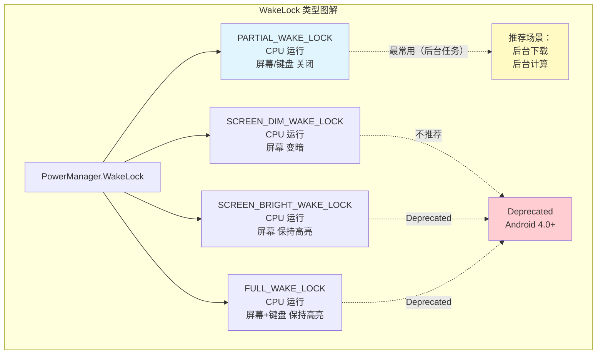
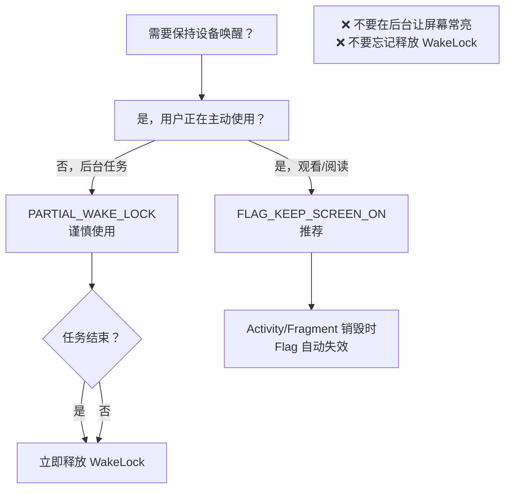
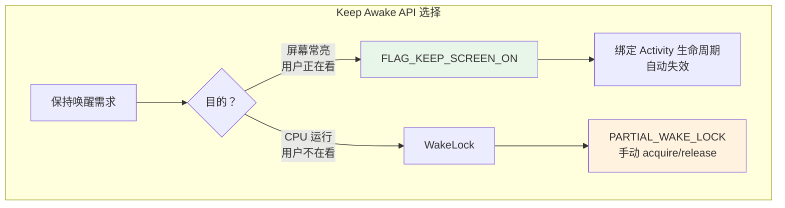

# 6.1.3 阳光下的屏幕常亮术

阳光穿过树梢，洒在帐篷外的空地上。

洛芙伸了个懒腰，感觉肚子有点饿了。黛琳正在便携式炉具上煮着午餐，香气已经从锅里飘了出来。伊莎坐在一块石头上翻看着手机里的食谱应用，时不时抬头看看锅里的情况。希尔则靠在帐篷边上，手指在笔记本电脑键盘上飞速敲击着，似乎在赶什么代码。

"黛琳，"伊莎忽然喊了一声，把手机往黛琳的方向递了递，"这个炖菜的步骤到第三步了，你看看接下来要放什么调料？"

黛琳低头看了一眼手机，屏幕却在这个时候暗了下去。

"哎呀，"伊莎按了一下电源键，"又要解锁。好麻烦，我在做饭呢，手上都是油。"

洛芙看到了这一幕，心里忽然想起了什么。

"希尔，"她转过身来，拍了拍希尔的肩膀，"有没有什么办法——就是，比如，让屏幕不要自动暗掉？我看伊莎做饭的时候老是得点亮屏幕，好不方便。"

希尔停下敲键盘的动作，抬起头来。

"你说的是**保持设备唤醒状态**的问题。"她说，"Android 里有好几个 API 都能干这件事，但它们适用的场景可不一样。用错了地方，不仅会让用户不爽，还会疯狂消耗电量。"

黛琳用勺子搅了搅锅里的汤，头也不抬地接话道："对，这里面最容易混淆的就是——**让屏幕常亮**和**让 CPU 保持运行**，其实是两码事。"

洛芙歪了歪脑袋："有什么区别吗？"

"区别大了。"希尔把笔记本电脑转了过来，屏幕上是 Android 官方文档的页面，"我们就着今天的阳光，把这几个 API 好好讲清楚。"

---

## 1. FLAG_KEEP_SCREEN_ON：屏幕常亮的温柔守护者

"首先说最简单的，"希尔指着屏幕上的代码片段，"如果你只是想**让屏幕保持常亮**，比如用户正在看电子书、看视频、或者像伊莎这样——做饭的时候需要时不时瞄一眼菜谱——那你应该用 **`FLAG_KEEP_SCREEN_ON`**。"

她在笔记本电脑上敲了几下，调出一个简单的 Kotlin 示例：

```kotlin
// 方式一：在 Activity 或 Fragment 中设置 Flag
class CookingActivity : AppCompatActivity() {
    override fun onCreate(savedInstanceState: Bundle?) {
        super.onCreate(savedInstanceState)
        setContentView(R.layout.activity_cooking)

        // 设置 Flag：保持屏幕常亮
        // 这行代码会让屏幕一直亮着，直到 Activity 销毁
        window.addFlags(WindowManager.LayoutParams.FLAG_KEEP_SCREEN_ON)
    }

    override fun onDestroy() {
        super.onDestroy()
        // Activity 销毁时，Flag 会自动移除
        // 所以一般情况下不需要手动清除
    }
}

// 方式二：在布局 XML 中声明（推荐用于特定 View）
<!-- 在布局文件中添加 android:keepScreenOn="true" -->
<LinearLayout
    xmlns:android="http://schemas.android.com/apk/res/android"
    android:layout_width="match_parent"
    android:layout_height="match_parent"
    android:keepScreenOn="true">

    <!-- 里面的所有子 View 都继承这个属性 -->
    <TextView
        android:layout_width="wrap_content"
        android:layout_height="wrap_content"
        android:text="这道菜需要炖 30 分钟" />

</LinearLayout>
```

"看这段代码，"希尔解释道，"`FLAG_KEEP_SCREEN_ON` 是 **`Window`** 对象的一个属性。你可以像第一种方式那样，在 Activity 的 `onCreate` 里用 `window.addFlags()` 加上这个 Flag。"

"第二种方式更优雅，"黛琳接过话头，"直接在布局 XML 文件里写 `android:keepScreenOn="true"`。这样一来，只要这个布局还在屏幕上，系统就知道——'这个页面需要屏幕保持常亮'。等用户退出这个页面，Flag 自动失效，完全不需要你操心释放资源的问题。"

伊莎凑过来看了看代码："那……如果我在 XML 里写了这个，是不是就不需要在 Kotlin 代码里加 `addFlags` 了？"

"对，"希尔点点头，"两种方式二选一就行。XML 的方式更声明式，适合那种'这个页面的核心功能就是需要屏幕常亮'的场景，比如阅读 App、视频播放器。代码的方式更灵活，适合那种'只有特定操作才需要屏幕常亮'的场景。"

洛芙"哦"了一声："那刚才伊莎那个做饭的 App，如果用这个 Flag，就不用担心屏幕暗掉了？"

"对，"希尔笑着说，"而且它很省心。你不需要记得在 `onDestroy` 或者某个回调里手动把它关掉——**Activity 生命周期会自动帮你管理这个 Flag**。Activity 在前台的时候屏幕常亮，用户一离开，屏幕就恢复正常的自动休眠策略。"

---

## 2. WakeLock：CPU 唤醒的强力引擎

"但是，"希尔的话锋一转，"有时候，光让屏幕常亮是不够的。"

她停顿了一下，目光扫过帐篷外的三个人。

"比如——你们有没有遇到过这种情况：你在后台下载一个大文件，下载到一半，你把屏幕关了，去做别的事。等你过了半小时回来，发现下载进度条完全没动过？"

洛芙点点头："遇到过！我以为是网络不好。"

"那不是网络的问题，"希尔摇摇头，"那是 Android **省电策略**的锅。当你把屏幕关掉、或者用户长时间不操作手机，系统会觉得'这个用户现在没在使用手机，我应该让 CPU 进入休眠状态来省电'。一旦 CPU 休眠，你在后台启动的那些下载任务、计算任务，统统都会暂停。"

"那怎么办？"洛芙问。

"这就是 **`WakeLock`** 登场的时候。"希尔敲了一下回车键，屏幕上出现了一段新的代码，"如果你需要**让 CPU 保持运行**——不管屏幕是亮还是暗——你就要用 `PowerManager.WakeLock`。"

```kotlin
// 使用 WakeLock 的完整流程
class DownloadService : Service() {

    private lateinit var powerManager: PowerManager
    private var wakeLock: PowerManager.WakeLock? = null

    override fun onCreate() {
        super.onCreate()
        powerManager = getSystemService(Context.POWER_SERVICE) as PowerManager

        // 创建 WakeLock
        // 参数解释：
        // 第一个参数：锁的级别（Flag）
        // PARTIAL_WAKE_LOCK：CPU 保持运行，屏幕和键盘可以关闭
        // 其他级别：SCREEN_DIM_WAKE_LOCK（CPU 运行，屏幕暗）、SCREEN_BRIGHT_WAKE_LOCK（CPU 运行，屏幕亮）
        // 第二个参数：锁的 Tag，通常用当前类名或 Activity 名来标识，方便调试时看到是谁拿了锁
        wakeLock = powerManager.newWakeLock(
            PowerManager.PARTIAL_WAKE_LOCK,
            "DownloadService::DownloadLock"
        )
    }

    override fun onStartCommand(intent: Intent?, flags: Int, startId: Int): Int {
        // 开始下载任务之前 acquire 锁
        wakeLock?.let { lock ->
            if (!lock.isHeld) {
                Log.d("DownloadService", "Acquiring WakeLock")
                lock.acquire(10 * 60 * 1000L) // 最多持有 10 分钟，超时自动释放
            }
        }

        // 执行下载逻辑...
        // 当 CPU 进入休眠时，有 WakeLock 保护，下载线程不会暂停

        // 下载完成后 release 锁
        wakeLock?.let { lock ->
            if (lock.isHeld) {
                Log.d("DownloadService", "Releasing WakeLock")
                lock.release()
            }
        }

        return START_NOT_STICKY
    }

    override fun onDestroy() {
        super.onDestroy()
        // Service 销毁时也要确保释放锁
        // 这是最重要的安全网
        wakeLock?.let { lock ->
            if (lock.isHeld) {
                lock.release()
            }
        }
        wakeLock = null
    }

    override fun onBind(intent: Intent?): IBinder? = null
}
```

黛琳走到希尔身后，指着屏幕上的代码说："看这里，`WakeLock` 的核心流程其实是三步——**创建**、**获取（Acquire）**、**释放（Release）**。"

"第一步，`newWakeLock`。"她继续说道，"你得告诉系统你要哪种类型的锁。Android 提供了几种不同的 WakeLock 类型，对应不同的唤醒场景："



> 图 1：WakeLock 类型对比图。`PARTIAL_WAKE_LOCK` 是目前唯一推荐使用的类型，其他类型因用户体验差已被废弃。

" **`PARTIAL_WAKE_LOCK`**，"希尔重点强调，"是唯一一个**还被官方推荐的类型**。因为它只唤醒 CPU，屏幕和键盘可以正常关闭——这样既能让你的后台任务跑完，又不会像举着一个亮着的手机一样浪费电。"

"其他三种——`SCREEN_DIM_WAKE_LOCK`、`SCREEN_BRIGHT_WAKE_LOCK`、`FULL_WAKE_LOCK`——都是**不推荐使用**的。它们会让屏幕一直亮着，用户体验很差，而且很容易导致手机发热、电池急剧下降。从 Android 4.0 开始，官方就逐渐废弃了这些类型。"

洛芙看着图表点点头："所以……如果我只是想让后台下载继续跑，就用 `PARTIAL_WAKE_LOCK`？"

"对，"希尔说，"而且——**这非常重要**——`acquire()` 之后，你**必须**在任务完成或者 Service 销毁的时候调用 `release()`。如果你忘了释放，这个锁会一直持有下去，CPU 永远不会休眠。用户的电池会像被开了闸的水库一样，哗哗地流走。"

"这就是传说中的'**WakeLock 泄漏**'，"黛琳补充道，"是 Android 开发里最经典的电量 bug 之一。很多应用被用户抱怨'耗电快'、'手机发烫'，一查就是这个原因。"

---

## 3. 代码实战：两种 API 的对比使用

"我们来做一个小实验，"希尔把笔记本电脑转过来，"分别用 `FLAG_KEEP_SCREEN_ON` 和 `WakeLock` 写两个简单的页面，感受一下它们的区别。"

```kotlin
// 场景 1：使用 FLAG_KEEP_SCREEN_ON（屏幕常亮）
class ScreenOnActivity : AppCompatActivity() {
    override fun onCreate(savedInstanceState: Bundle?) {
        super.onCreate(savedInstanceState)
        setContentView(R.layout.activity_screen_on)

        // 只需要一行代码，屏幕就会一直亮着
        window.addFlags(WindowManager.LayoutParams.FLAG_KEEP_SCREEN_ON)

        // 模拟一个长时间运行的任务
        // 注意：这个任务其实还是在主线程上跑的，这里只是演示 API 用法
        // 实际项目中，耗时操作应该放在后台线程
        Log.d("ScreenOnActivity", "屏幕已保持常亮。按 Home 键回到桌面观察效果。")
    }

    override fun onDestroy() {
        super.onDestroy()
        // Flag 会自动清除，这里不需要手动操作
        // 但如果你使用代码动态添加/移除，也可以在这里 removeFlags
        // window.clearFlags(WindowManager.LayoutParams.FLAG_KEEP_SCREEN_ON)
    }
}

// 场景 2：使用 WakeLock（CPU 唤醒）
class WakeLockActivity : AppCompatActivity() {

    private lateinit var powerManager: PowerManager
    private var wakeLock: PowerManager.WakeLock? = null

    override fun onCreate(savedInstanceState: Bundle?) {
        super.onCreate(savedInstanceState)
        setContentView(R.layout.activity_wake_lock)

        powerManager = getSystemService(Context.POWER_SERVICE) as PowerManager

        // 获取 PARTIAL_WAKE_LOCK
        // 只有这个类型是官方推荐的
        wakeLock = powerManager.newWakeLock(
            PowerManager.PARTIAL_WAKE_LOCK,
            "WakeLockActivity::MyLock"
        )

        // 按钮点击事件
        findViewById<Button>(R.id.btn_acquire_lock).setOnClickListener {
            // acquire() 默认是最长 10 分钟超时
            // 也可以传入具体的毫秒数，比如 30 秒
            wakeLock?.acquire()
            Log.d("WakeLockActivity", "WakeLock 已获取，CPU 不会休眠")
        }

        findViewById<Button>(R.id.btn_release_lock).setOnClickListener {
            releaseWakeLock()
            Log.d("WakeLockActivity", "WakeLock 已释放")
        }
    }

    private fun releaseWakeLock() {
        wakeLock?.let { lock ->
            if (lock.isHeld) {
                lock.release()
                Log.d("WakeLockActivity", "WakeLock released successfully")
            }
        }
    }

    override fun onDestroy() {
        super.onDestroy()
        // 重要：Activity 销毁时必须释放锁
        releaseWakeLock()
    }
}
```

"看这两个例子的区别，"希尔说。

"第一个例子，`ScreenOnActivity`，我只在 `onCreate` 里加了一行 `addFlags`。然后呢？没有然后了。系统会自动管理这个 Flag，我不需要担心什么时候释放。"

"第二个例子，`WakeLockActivity`，就麻烦多了。我要手动 `acquire()`，手动 `release()`，还要在 `onDestroy()` 里加一个保护性的释放——生怕我忘了。"

"这就是为什么，"黛琳总结道，"**能用 `FLAG_KEEP_SCREEN_ON` 的场景，就不要用 `WakeLock`**。前者是系统帮你管，后者是你自己管。管得多，错得多。"

---

## 4. 反模式与最佳实践

"接下来我们看几个常见的反模式，"希尔的表情变得严肃起来，"这些都是我在各种项目里见过的真实代码，有的新手会犯，有的甚至老手也会栽跟头。"

```kotlin
// ❌ 反模式 1：在 Service 的 onCreate 里 acquire()，但不在 onDestroy 里 release()
class BadDownloadService : Service() {
    private var wakeLock: PowerManager.WakeLock? = null

    override fun onCreate() {
        super.onCreate()
        val powerManager = getSystemService(Context.POWER_SERVICE) as PowerManager
        wakeLock = powerManager.newWakeLock(PowerManager.PARTIAL_WAKE_LOCK, "BadService::Lock")
        wakeLock?.acquire() // 🔴 问题：永远不释放！用户关掉屏幕后电量狂掉
    }

    override fun onBind(intent: Intent?): IBinder? = null
}

// ✅ 正确写法：始终在 finally 块或 onDestroy 中释放
class GoodDownloadService : Service() {
    private var wakeLock: PowerManager.WakeLock? = null

    override fun onCreate() {
        super.onCreate()
        val powerManager = getSystemService(Context.POWER_SERVICE) as PowerManager
        wakeLock = powerManager.newWakeLock(PowerManager.PARTIAL_WAKE_LOCK, "GoodService::Lock")
    }

    override fun onStartCommand(intent: Intent?, flags: Int, startId: Int): Int {
        // 假设我们在这里开始下载
        wakeLock?.let { lock ->
            if (!lock.isHeld) {
                lock.acquire()
            }
        }

        // 假设下载完成了，应该 release
        // 实际项目中可能需要更复杂的逻辑来确定何时完成
        // 但关键是：必须有对应的 release

        return START_NOT_STICKY
    }

    override fun onDestroy() {
        super.onDestroy()
        // 🔴🔴🔴 必须在 onDestroy 释放！这是最后的安全网 🔴🔴🔴
        wakeLock?.let { lock ->
            if (lock.isHeld) {
                lock.release()
            }
        }
        wakeLock = null
    }

    override fun onBind(intent: Intent?): IBinder? = null
}
```

"第一个反模式是最致命的，"希尔说，"在 `onCreate` 里 `acquire()`，但从来不 `release()`。这个 Service 只要一启动，用户的 CPU 就永远不会休眠。电池会以肉眼可见的速度往下掉。"

"正确的做法是——**在所有 acquire() 的地方，都要想好对应的 release() 在哪里**。而且，**`onDestroy()` 里一定要加一层保护**，确保 Service 被系统销毁的时候，锁一定能被释放。"

```kotlin
// ❌ 反模式 2：使用已被废弃的 WakeLock 类型
// SCREEN_BRIGHT_WAKE_LOCK 和 FULL_WAKE_LOCK 已被废弃，强烈不推荐使用
// 它们会让屏幕一直亮着，非常耗电
class DeprecatedWakeLockActivity : AppCompatActivity() {
    override fun onCreate(savedInstanceState: Bundle?) {
        super.onCreate(savedInstanceState)
        val powerManager = getSystemService(Context.POWER_SERVICE) as PowerManager
        val wakeLock = powerManager.newWakeLock(
            PowerManager.SCREEN_BRIGHT_WAKE_LOCK, // 🔴 已废弃！
            "DeprecatedActivity::Lock"
        )
        wakeLock.acquire()
        // ...
    }
}

// ✅ 正确写法：根据需求选择合适的 API
// 只需要屏幕常亮？用 FLAG_KEEP_SCREEN_ON
class ScreenBrightActivity : AppCompatActivity() {
    override fun onCreate(savedInstanceState: Bundle?) {
        super.onCreate(savedInstanceState)
        window.addFlags(WindowManager.LayoutParams.FLAG_KEEP_SCREEN_ON)
    }
}
```

"第二个反模式是用那些已经被废弃的 WakeLock 类型。"希尔解释道，"`SCREEN_BRIGHT_WAKE_LOCK`、`FULL_WAKE_LOCK` 这些，会让屏幕一直亮着。用户晚上用这个 App，屏幕能亮一整晚——这谁受得了？"

"如果你只是想保持屏幕常亮，就用 `FLAG_KEEP_SCREEN_ON`。如果你需要 CPU 保持运行，就用 `PARTIAL_WAKE_LOCK`。别的东西，不要碰。"

```kotlin
// ❌ 反模式 3：WakeLock 和 FLAG_KEEP_SCREEN_ON 混用，却不理解它们的作用域
// 有些人会在一个 Activity 里同时用这两种 API
// 但实际上，对于"屏幕常亮"这个需求，它们是互斥的（二选一即可）
class ConfusedActivity : AppCompatActivity() {
    override fun onCreate(savedInstanceState: Bundle?) {
        super.onCreate(savedInstanceState)
        setContentView(R.layout.activity_confused)

        // 🔴 多此一举：既用了 WakeLock 又用了 FLAG_KEEP_SCREEN_ON
        // 如果你的目的是"屏幕常亮"，FLAG_KEEP_SCREEN_ON 就够了
        // 如果你的目的是"CPU 保持运行"，PARTIAL_WAKE_LOCK 就够了
        // 不要混用，会让代码逻辑变得混乱

        window.addFlags(WindowManager.LayoutParams.FLAG_KEEP_SCREEN_ON)

        val powerManager = getSystemService(Context.POWER_SERVICE) as PowerManager
        val wakeLock = powerManager.newWakeLock(
            PowerManager.PARTIAL_WAKE_LOCK,
            "ConfusedActivity::Lock"
        )
        wakeLock.acquire() // 这个锁其实不控制屏幕，FLAG_KEEP_SCREEN_ON 已经搞定了
    }
}

// ✅ 正确写法：明确你的需求，选择最合适的 API
// 场景 A：用户正在看电子书，屏幕不能暗
// → 用 FLAG_KEEP_SCREEN_ON
class EbookReaderActivity : AppCompatActivity() {
    override fun onCreate(savedInstanceState: Bundle?) {
        super.onCreate(savedInstanceState)
        window.addFlags(WindowManager.LayoutParams.FLAG_KEEP_SCREEN_ON)
    }
}

// 场景 B：后台下载大文件，屏幕可以关，但下载不能停
// → 用 PARTIAL_WAKE_LOCK
class DownloadManagerActivity : AppCompatActivity() {
    private var wakeLock: PowerManager.WakeLock? = null

    override fun onCreate(savedInstanceState: Bundle?) {
        super.onCreate(savedInstanceState)
        val powerManager = getSystemService(Context.POWER_SERVICE) as PowerManager
        wakeLock = powerManager.newWakeLock(
            PowerManager.PARTIAL_WAKE_LOCK,
            "DownloadManager::Lock"
        )
    }

    fun startDownload() {
        wakeLock?.acquire()
        // 启动下载线程...
    }

    fun stopDownload() {
        wakeLock?.let { if (it.isHeld) it.release() }
    }

    override fun onDestroy() {
        super.onDestroy()
        wakeLock?.let { if (it.isHeld) it.release() }
    }
}
```

"第三个反模式是**混用**，"希尔说，"有些同学学了两个 API，就想'我都用上，功能是不是更强大'。其实不是的。这两个 API 解决的是不同的问题："

" **`FLAG_KEEP_SCREEN_ON`**：**屏幕** 常亮。"
" **`WakeLock`**：**CPU** 保持运行。"

"如果你的需求是'用户看视频的时候屏幕别暗'，一个 `FLAG_KEEP_SCREEN_ON` 就够了。如果你的需求是'后台下载别中断'，一个 `PARTIAL_WAKE_LOCK` 就够了。混在一起用，只能说明你还没想清楚自己要什么。"

---

## 5. 设计哲学：省电是第一公民权

黛琳走到白板前，用马克笔画了一个圆圈，里面写了三个字：**省电**。

"Android 系统有一个核心设计理念，"她说，"**默认情况下，应用不应该打扰用户**。用户把屏幕关了，就是不想看东西了——系统应该让设备进入休眠状态来省电。如果每个 App 都想'我的任务很重要，用户应该一直看着我的屏幕'，那用户的电池早就被掏空了。"

"所以，**保持唤醒是一个特例，不是一般情况**。只有当你有一个**非常充分的理由**——比如用户正在看视频、正在阅读、正在通话——你才应该考虑让设备保持唤醒。而且，**只要这个理由消失了，你就应该立刻停止保持唤醒**。"



> 图 2：唤醒 API 选择决策树。根据用户是否在主动使用设备，选择合适的 API。

"这就是为什么，**`FLAG_KEEP_SCREEN_ON`** 是首选，"她继续说道，"因为它绑定在 UI 组件的生命周期上。用户退出页面，Flag 自动失效——这是一种**声明式**的设计：我声明'在这个页面的生命周期内，屏幕应该保持常亮'。系统会帮我管理所有细节。"

"而 **`WakeLock`** 是**命令式**的设计：我命令'CPU 必须给我跑起来'。这种力量很大，但也很危险。如果你不会用这匹野马，就会被它拖垮。"

洛芙忽然举起了手："那……如果我既想让用户看屏幕，又想让 CPU 跑后台任务呢？"

"那就两个都开，"希尔说，"`FLAG_KEEP_SCREEN_ON` 保持屏幕，`PARTIAL_WAKE_LOCK` 保持 CPU。但这种情况其实很少见——大多数场景下，这两个需求不会同时出现。"

---

## 6. 总结与预告

希尔把笔记本电脑合上，深吸了一口气。

"我们今天讲了两个保持设备唤醒的 API："

"第一，**`FLAG_KEEP_SCREEN_ON`**。用来让屏幕保持常亮。最简单、最安全、最推荐。绑定在 Activity 生命周期上，用户离开页面，自动失效。"

"第二，**`PowerManager.WakeLock`**。用来让 CPU 保持运行。只有在真正的后台任务场景下才需要用。记住，`PARTIAL_WAKE_LOCK` 是唯一推荐的类型。** acquire() 之后一定要 release() **——`onDestroy()` 是最后的安全网。"

"记住这句话：**能用简单的，不用复杂的；能用声明式的，不用命令式的；能不锁，就不锁。**"

黛琳把锅里的汤盛了出来，香气四溢。

"明天，"她说，"我们来聊聊 Android 系统对后台任务的**各种限制**。随着 Android 版本越来越省电，我们做后台任务也越来越受限——怎么在限制下把事情办成，是一个很深的坑。"

洛芙点点头，感觉今天的知识点比昨天多一点，但逻辑很清晰。

"我感觉……"她想了想，"KeepScreenOn 是'温柔地请求'，WakeLock 是'强硬地抢夺'。能请求就别抢夺。"

希尔笑了："总结得很精辟。"

夕阳西斜，把湖面染成了一片橘红色。松影在草地上拉得很长。一天的学习又结束了。

---

## 专业技术总结

> **保持设备唤醒状态**（Keeping the device awake）—— 指通过系统 API 阻止设备进入休眠状态。分为两种：**屏幕唤醒**（用户可见时保持屏幕常亮）与 **CPU 唤醒**（用户不可见时保持 CPU 运行）。Android 推荐根据具体场景选择 `FLAG_KEEP_SCREEN_ON` 或 `PowerManager.WakeLock`，并遵循严格的生命周期管理以避免电量浪费。

#### 结构图



#### 复杂度与影响

- **`FLAG_KEEP_SCREEN_ON`**：轻量级 API，由系统管理生命周期，无泄漏风险。对电量影响小（仅阻止屏幕休眠）。
- **`WakeLock`**：重量级 API，必须手动管理生命周期。持有时间过长会导致：
  - 用户设备发热严重
  - 电池电量急剧下降（每小时掉电 20%+）
  - 用户体验极差
- **必须警惕**：忘记 `release()` 会导致 **WakeLock 泄漏**，是 Android 电量问题的首要原因之一。

#### 反模式与陷阱

1. **`onCreate` acquire(), `onDestroy` 不 release()** → 🔴🔴🔴 WakeLock 泄漏，CPU 永不休眠。修复：在 `onDestroy` 添加 `if (isHeld) release()`。
2. **使用已废弃的 WakeLock 类型** (`SCREEN_BRIGHT_WAKE_LOCK`, `FULL_WAKE_LOCK`) → 🔴 屏幕常亮，用户体验差。修复：改用 `FLAG_KEEP_SCREEN_ON`。
3. **混淆使用场景**：需要 CPU 运行却只用 `FLAG_KEEP_SCREEN_ON` → 后台任务被系统挂起。修复：使用 `PARTIAL_WAKE_LOCK`。
4. **在 `onStartCommand` acquire() 但在耗时操作完成后忘记 release()** → 锁持有时间过长。修复：利用 `WorkManager` 等管理生命周期，或在 finally 块中释放。

#### 设计哲学：省电优先

1. **保持唤醒是特例**：只有用户明确需要持续交互时才使用。
2. **声明式优先**：优先使用 `FLAG_KEEP_SCREEN_ON`（系统管理），避免使用 `WakeLock`（手动管理）。
3. **最小权限原则**：`WakeLock` 使用 `PARTIAL_WAKE_LOCK` 即可满足绝大多数后台需求，避免请求过高的锁级别。
4. **生命周期绑定**：`WakeLock` 必须在 `onDestroy()` 或任务结束时释放，作为最后的安全网。
5. **用户可见性原则**：用户能看到屏幕时用 `FLAG_KEEP_SCREEN_ON`；用户看不到屏幕时，CPU 保持运行必须有极强的业务理由。

---

#### 🏕️ 动手练习 —— 项目：「智能露营灯 + 后台下载器」

> 构建一个同时演示屏幕常亮与 CPU 唤醒的 Demo，理解何时使用哪种 API。

**Task 1：KeepScreenOn 实战 —— 营地阅读器** ★

- **目标**：实现一个阅读器 Activity，使用 `FLAG_KEEP_SCREEN_ON` 保持屏幕常亮。
- **你需要做的事**：
  1. 创建 `ReadingActivity`，在 `onCreate` 中调用 `window.addFlags(WindowManager.LayoutParams.FLAG_KEEP_SCREEN_ON)`
  2. 在布局 XML 中添加一个 TextView 显示一段模拟的营地日记
  3. 运行 App，按 Home 键回到桌面，再切回来，观察屏幕是否保持常亮
- **验收标准**：
  - [ ] 屏幕在 Activity 期间保持常亮
  - [ ] 退出 Activity 后屏幕恢复正常休眠
- **提示**：使用 `adb shell dumpsys power` 命令可以查看电源状态。

**Task 2：WakeLock 实战 —— 后台下载模拟器** ★★

- **目标**：实现一个 Service，使用 `PARTIAL_WAKE_LOCK` 模拟后台下载任务。
- **你需要做的事**：
  1. 创建 `DownloadService`，在 `onCreate` 中获取 `PowerManager` 和 `WakeLock`
  2. 在 `onStartCommand` 中 `acquire()` WakeLock，模拟开始下载
  3. 使用 `Handler.postDelayed` 在 10 秒后自动 `release()` WakeLock（模拟下载完成）
  4. 在 `onDestroy` 中添加保护性释放
  5. 在 `ReadingActivity` 中添加按钮启动/停止 Service
- **验收标准**：
  - [ ] 启动 Service 后 Logcat 打印 "WakeLock acquired"
  - [ ] 10 秒后 Logcat 打印 "WakeLock released"
  - [ ] 按 Home 键后观察 Logcat，下载任务是否继续执行
  - [ ] 强制停止 App，Service 被销毁时 WakeLock 仍能正确释放
- **提示**：使用 `adb shell dumpsys power | grep "WakeLock"` 查看当前持有的 WakeLock。

**Task 3：对比实验 —— 关闭 WakeLock 观察后台行为** ★★

- **目标**：对比有 WakeLock 和无 WakeLock 时后台任务的表现。
- **你需要做的事**：
  1. 创建两个 Service：`NoWakeLockService` 和 `WithWakeLockService`
  2. 两个 Service 都执行相同的任务：每秒打印一条 Log 到 Logcat，持续 30 秒
  3. `NoWakeLockService` 不获取 WakeLock
  4. `WithWakeLockService` 获取 `PARTIAL_WAKE_LOCK`
  5. 分别启动两个 Service，立即按 Home 键让屏幕关闭
  6. 观察 Logcat，比较两个 Service 的行为差异
- **验收标准**：
  - [ ] 无 WakeLock 的 Service 在屏幕关闭后停止打印
  - [ ] 有 WakeLock 的 Service 继续打印直到任务完成
  - [ ] 能解释 WakeLock 对后台任务的影响
- **提示**：使用 `adb logcat -v threadtime` 过滤日志。

**Task 4：XML vs Code 方式对比** ★

- **目标**：对比 `android:keepScreenOn` XML 属性和 `addFlags()` 代码方式。
- **你需要做的事**：
  1. 创建两个 Activity：`XmlScreenOnActivity` 和 `CodeScreenOnActivity`
  2. `XmlScreenOnActivity` 在布局 XML 中设置 `android:keepScreenOn="true"`
  3. `CodeScreenOnActivity` 在 Kotlin 代码中调用 `window.addFlags()`
  4. 分别运行两个 Activity，比较效果是否一致
  5. 在 `onDestroy` 中尝试手动清除 Flag，观察会发生什么
- **验收标准**：
  - [ ] 两种方式效果一致
  - [ ] 理解 XML 方式更适合声明式场景，代码方式更适合动态控制
- **提示**：两种方式底层实现相同，都是操作 Window 的 Flag。

**Task 5：WakeLock 超时机制验证** ★★★

- **目标**：验证 WakeLock 的超时参数行为。
- **你需要做的事**：
  1. 创建 `TimeoutWakeLockActivity`，获取 WakeLock 时传入 5 秒超时
  2. 启动后观察 Logcat，5 秒后是否自动释放
  3. 尝试在超时前手动 `release()`，观察日志
  4. 尝试在超时后再次 `release()`，观察会发生什么（应该抛出异常）
- **验收标准**：
  - [ ] WakeLock 在 5 秒后自动释放
  - [ ] 理解超时机制的作用（防止锁永远持有）
  - [ ] 理解重复 release 的风险
- **提示**：查看 Logcat 中的电源服务日志。

**Task 6：反模式修复实战** ★★★

- **目标**：修复一个故意写错的 WakeLock 代码。
- **你需要做的事**：
  1. 阅读以下"坏味道"代码，找出所有问题：
  ```kotlin
  class BrokenDownloadService : Service() {
      private var wakeLock: PowerManager.WakeLock? = null
      
      override fun onCreate() {
          super.onCreate()
          val pm = getSystemService(Context.POWER_SERVICE) as PowerManager
          wakeLock = pm.newWakeLock(PowerManager.FULL_WAKE_LOCK, "Broken::Lock")
          wakeLock?.acquire()
      }
      
      override fun onStartCommand(intent: Intent?, flags: Int, startId: Int): Int {
          return START_STICKY
      }
      
      override fun onBind(intent: Intent?): IBinder? = null
  }
  ```
  2. 修复所有问题，改写成正确版本
  3. 对比修复前后的代码，总结改进点
- **验收标准**：
  - [ ] 找出至少 3 个问题（已废弃类型、从不释放、未绑定生命周期）
  - [ ] 修复后的代码能正确获取和释放 WakeLock
  - [ ] 能解释每个修复点的原因

**Task 7：省电模式下的 WakeLock 行为** ★★★

- **目标**：了解在 Android 省电模式下 WakeLock 的特殊行为。
- **你需要做的事**：
  1. 在手机上开启省电模式或 Doze 模式
  2. 重复 Task 3 的实验，观察有 WakeLock 的 Service 是否还能继续运行
  3. 研究 Android Doze 模式对 WakeLock 的影响
  4. 探索如何配合 WorkManager 和前台服务使用 WakeLock
- **验收标准**：
  - [ ] 能描述 Doze 模式对后台任务的影响
  - [ ] 能解释 WakeLock 如何绕过部分 Doze 限制
  - [ ] 理解为什么省电模式下仍推荐使用 WorkManager
- **提示**：查看官方文档 "Power management restrictions"。

---

#### 面试热身

- **Q1**：请解释 `FLAG_KEEP_SCREEN_ON` 和 `PowerManager.WakeLock` 的区别。什么场景下用前者，什么场景下用后者？
- **Q2**：什么是 WakeLock 泄漏？会导致什么问题？如何避免？
- **Q3**：为什么 Android 废弃了 `SCREEN_BRIGHT_WAKE_LOCK` 和 `FULL_WAKE_LOCK`？现在推荐使用什么？
- **Q4**：`PARTIAL_WAKE_LOCK` 和 `FLAG_KEEP_SCREEN_ON` 分别控制硬件的哪个部分？
- **Q5**：在 Activity 中使用 `FLAG_KEEP_SCREEN_ON`，需要在 `onDestroy()` 中手动清除吗？为什么？

---

> **学习建议**：保持唤醒是 Android 省电策略的"特权通道"。优先使用系统自动管理的 `FLAG_KEEP_SCREEN_ON`，只有在真正的后台任务场景下才考虑 `WakeLock`。无论使用哪种，都要在心里时刻牢记：省电是 Android 的第一公民权。

## 🍹洛芙的小小日记本

今天学到了——原来让屏幕常亮和让 CPU 跑起来是两码事！黛琳说 KeepScreenOn 是"温柔地请求"，WakeLock 是"强硬地抢夺"。能请求就别抢夺，我记住了。

### 今日关键词

- **FLAG_KEEP_SCREEN_ON**：Window 对象的 Flag，用于保持屏幕常亮。绑定 Activity 生命周期，系统自动管理，无需手动释放。
- **PowerManager.WakeLock**：系统服务，用于保持 CPU 运行。必须手动 acquire() 和 release()，否则会导致 WakeLock 泄漏。
- **PARTIAL_WAKE_LOCK**：唯一推荐的 WakeLock 类型。只唤醒 CPU，屏幕可关闭。
- **SCREEN_BRIGHT_WAKE_LOCK**：已废弃的 WakeLock 类型，会导致屏幕一直高亮。
- **FULL_WAKE_LOCK**：已废弃的 WakeLock 类型，会导致屏幕和键盘都保持常亮。
- **WakeLock 泄漏**：忘记 release() WakeLock 导致 CPU 永不休眠，是 Android 电量问题的首要原因。
- **声明式 vs 命令式**：FLAG_KEEP_SCREEN_ON 是声明式（系统管理），WakeLock 是命令式（手动管理）。
- **Doze 模式**：Android 省电模式，会限制后台任务，WakeLock 可部分绕过但仍需谨慎使用。
- **acquire()**：获取 WakeLock 的方法，必须与 release() 配对使用。
- **release()**：释放 WakeLock 的方法，必须在 finally 块或 onDestroy 中调用。
- **KeepScreenOn**：用户主动使用设备时的屏幕常亮需求。
- **后台任务**：用户不可见时的 CPU 运行需求。
- **生命周期管理**：Activity/Service 销毁时自动释放资源的设计原则。
- **省电策略**：Android 系统默认限制后台任务以节省电量的机制。
- **WindowManager.LayoutParams**：包含窗口布局参数的类，FLAG_KEEP_SCREEN_ON 是其常量之一。

- **Q2**：什么是 WakeLock 泄漏？会导致什么问题