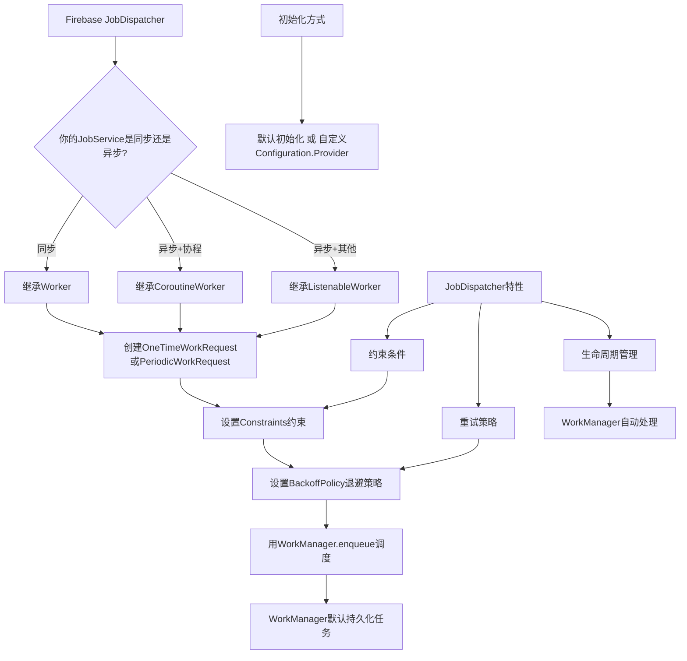
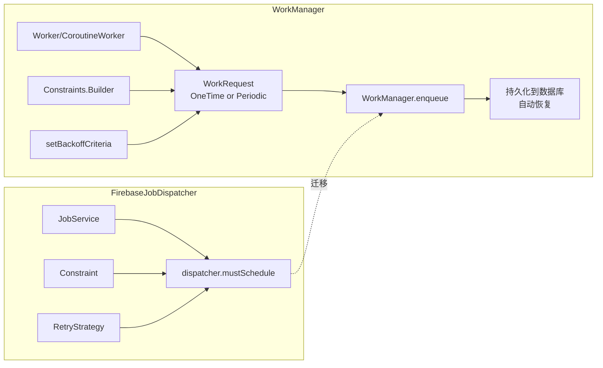
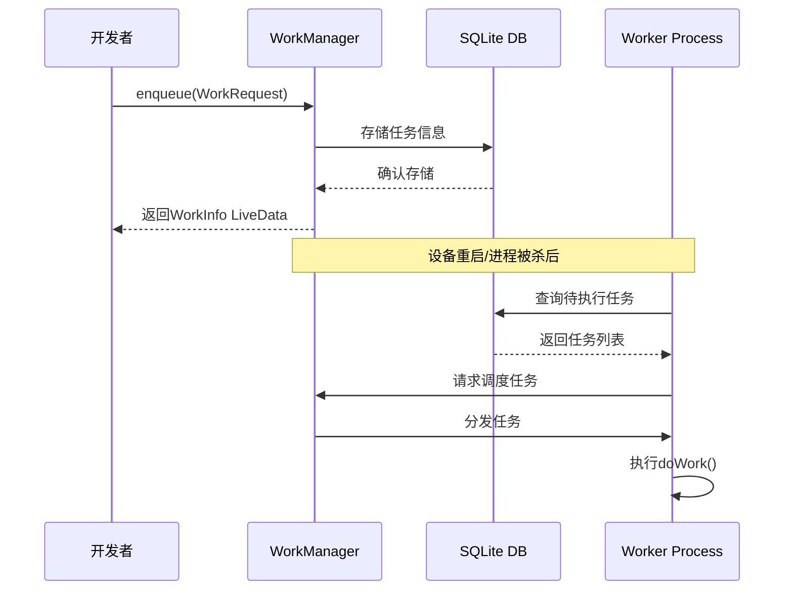

# 6.1.30 从 Firebase JobDispatcher 迁移到 WorkManager

夕阳把帐篷帆布染成蜜桃色的时候，洛芙从散步的余韵里回过神来。她拍了拍裙子上沾的草屑，钻进了帐篷。

黛琳和伊莎已经把露营灯挂在了帐篷中央的挂钩上，暖黄色的光晕把小小的空间烘得柔和而安静。希尔盘腿坐在防潮垫上，笔记本电脑架在膝盖上，屏幕泛着幽幽的蓝光。

"所以，"洛芙把下巴搁在叠起的外套上，眼睛盯着希尔的屏幕，"上次说的那个updateWork的事情，后来怎么样了？"

"搞定了。"希尔手指在触控板上划了划，"用updateWork改约束条件，比cancel再重新enqueue靠谱多了。generation会递增，系统知道这是同一条work的进化版本，不会重复执行。"

"那我们今天学什么？"洛芙揉了揉眼睛。

希尔转过电脑，屏幕上显示着Firebase JobDispatcher的GitHub仓库页面。红色的"ARCHIVED"标签像一枚小小的警告印章。

"看这个。"希尔点了点页面顶端，"Firebase JobDispatcher已经在2020年四月归档了。而且文档上说，一旦你的app开始target超过Android Q的版本，它就会彻底停止工作。"

"停止工作？"洛芙一下子坐直了。

"对。"黛琳的声音从帐篷角落传来。她正往保温杯里倒热可可，动作不紧不慢，"也就是说，如果你的项目还在用Firebase JobDispatcher，而你需要把targetSdkVersion改成30以上，这个库就会直接失效。"

洛芙咽了口口水。"那怎么办？"

"迁移到WorkManager。"伊莎把保温杯递给她，杯壁温热的触感让人安心，"Google官方给出的解决方案。"

希尔已经把准备好的页面调了出来——Android开发者文档中关于迁移的页面。白板上，黛琳用荧光笔已经画好了一个小小的对照表。

"先别急着看代码。"黛琳把白板立起来，让灯光能照清楚上面的字迹，"我们先说说，为什么要从Firebase JobDispatcher迁移到WorkManager。"

帐篷外，晚风轻轻吹过，带动帐篷外悬挂的风铃发出细碎的声响。远处的山棱线已经被暮色染成了深紫，只有山顶还留着最后一抹橙红。

"Firebase JobDispatcher依赖Google Play服务才能工作。"黛琳开口了，声音平稳，像在讲述一个早已熟悉的故事，"这意味着在没有Google Play服务的环境里——比如某些国产手机定制的Android系统，或者在一些企业内网环境里——它就没法用了。"

"但WorkManager不需要？"洛芙问。

"WorkManager在没有Google Play服务的时候会回退到AlarmManager和JobScheduler的组合。"希尔接过话头，手指在键盘上敲了几下，调出了一张表格，"看这个对比。"

```
库                        最低API   是否需要Google Play服务
--------------------------------------------------------------
Framework JobScheduler    21        不需要
Firebase JobDispatcher    14        需要
AndroidX WorkManager      14        不需要
```

"而且，"希尔点了点表格下方的一行小字，"Firebase JobDispatcher已经在2020年正式归档了，之后不会有任何更新。但WorkManager是Jetpack的一部分，Google还在持续维护和更新。"

"也就是说，"洛芙慢慢理解着，"继续用Firebase JobDispatcher就像是继续用一台已经停止生产的打印机——配件会越来越难找，兼容性会越来越差？"

"很好的比喻。"黛琳微微点头，嘴角浮现一丝笑意。

帐篷的帘子被风吹得轻轻晃动，带进来一丝凉丝丝的空气。洛芙把外套拉紧了一些，目光落在白板上那张还空着的对照表上。

"那具体怎么迁移呢？"她问，"我之前看过一些代码，感觉Firebase JobDispatcher用起来还挺直观的……"

"确实直观。"希尔承认，"但WorkManager其实更简单，而且功能更强大。我们一步一步来。"

她把笔记本电脑放在防潮垫上，屏幕的光映在每个人的脸上。

"第一步，是把JobService改成Worker。"

白板上，黛琳用蓝色笔写下了两个词：**JobService → Worker**。

"在Firebase JobDispatcher里，"希尔开始解释，手指在屏幕上划动，调出一段示例代码，"你的后台任务是通过继承JobService来实现的。"

```kotlin
// Firebase JobDispatcher 的 JobService
import com.firebase.jobdispatcher.JobParameters
import com.firebase.jobdispatcher.JobService

class MyJobService : JobService() {
    override fun onStartJob(job: JobParameters): Boolean {
        // 在这里执行后台任务
        doSomeWork()
        // 返回false表示任务完成，不需要继续在后台运行
        return false
    }

    override fun onStopJob(job: JobParameters): Boolean {
        // 当系统取消任务时回调
        // 返回true表示需要重试，false表示不需要重试
        return false
    }
}
```

"这里的onStartJob返回一个布尔值，"希尔解释道，"返回false表示'任务已经完成'，返回true表示'任务还在进行中，我需要更多时间'。这和WorkManager的逻辑不太一样。"

"那在WorkManager里呢？"洛芙问。

"在WorkManager里，你的任务类需要继承Worker。"希尔敲了几下键盘，屏幕上演示着迁移后的代码，"对于同步执行的任务，直接继承Worker就行了。"

```kotlin
// WorkManager 的 Worker（同步版本）
import android.content.Context
import androidx.work.Worker
import androidx.work.WorkerParameters

class MyWorker(
    context: Context,
    params: WorkerParameters
) : Worker(context, params) {

    override fun doWork(): Result {
        // 在这里执行后台任务
        // 返回 Result 表示任务的结果
        return Result.success()  // 或者 Result.retry() / Result.failure()
    }
}
```

"注意这里的变化。"希尔竖起一根手指，"doWork方法返回的是Result，而不是布尔值。Result.success()表示任务成功完成，Result.retry()表示需要重试，Result.failure()表示任务失败了而且不需要重试。"

"清晰多了。"洛芙点点头，"不需要记住true和false分别是什么意思。"

"而且，"黛琳补充道，"WorkManager的Worker是在后台线程上执行的，不需要你自己处理线程切换。"

"如果我的任务需要异步执行呢？"洛芙想起之前学过的内容，"比如需要在子线程里发起网络请求，然后等结果回来？"

"那就用ListenableWorker。"希尔回答，"ListenableWorker是更底层的抽象，它不会自动处理线程，你需要自己决定在哪里执行任务。"

她调出了另一段代码：

```kotlin
// WorkManager 的 ListenableWorker（异步版本）
import android.content.Context
import androidx.work.ListenableWorker
import androidx.work.WorkerParameters
import androidx.concurrent.futures.DirectExecutor
import com.google.common.util.concurrent.ListenableFuture

class MyListenableWorker(
    context: Context,
    params: WorkerParameters
) : ListenableWorker(context, params) {

    override fun startWork(): ListenableFuture<Result> {
        // 返回一个 ListenableFuture，你可以用它来包装异步操作
        return ListenableWorkerKtKt.toListenableFuture(
            doAsyncWork()
        )
    }

    private suspend fun doAsyncWork(): Result {
        // 在这里执行异步任务
        val data = fetchDataFromNetwork()
        return Result.success(data)
    }
}
```

"等等，"洛芙举起手，"这段代码看起来复杂了好多。有什么简单一点的方式吗？"

希尔笑了起来。"其实有一个更简洁的方式——用coroutines Extensions库里的CoroutineWorker。"

她切换到下一个代码示例：

```kotlin
// 使用 CoroutineWorker（异步任务最简单的方式）
import android.content.Context
import androidx.work.CoroutineWorker
import androidx.work.WorkerParameters

class MyCoroutineWorker(
    context: Context,
    params: WorkerParameters
) : CoroutineWorker(context, params) {

    override suspend fun doWork(): Result {
        // 直接写协程代码就好，自动在后台线程执行
        val data = fetchDataFromNetwork()
        saveDataToDatabase(data)
        return Result.success()
    }
}
```

"这个好！"洛芙眼睛亮了起来，"和之前的JobService比起来，只是把返回值从布尔值改成了Result，然后在方法前面加了一个suspend关键字。"

"对，CoroutineWorker是最推荐的方式，"黛琳点头，"如果你在项目里用了Kotlin协程，用这个就对了。"

帐篷外传来风铃清脆的响声，一阵晚风吹进来，带走了帐篷里积累的一点热气。伊莎起身把帐篷的通风口调整了一下角度，让空气流通得更顺畅。

"好了，第一个问题解决了。"希尔在白板上打了个勾，"JobService → Worker。那么第二个问题——约束条件怎么迁移？"

她调出了Firebase JobDispatcher的约束定义代码：

```kotlin
// Firebase JobDispatcher 的约束设置
val myJob = dispatcher.newJobBuilder()
    .setService(MyJobService::class.java)
    .setTag("my-unique-tag")
    .setConstraints(
        Constraint.ON_UNMETERED_NETWORK,    // 仅在非计量网络（WiFi）上运行
        Constraint.DEVICE_CHARGING           // 仅在充电时运行
    )
    .setRetryStrategy(RetryStrategy.DEFAULT_EXPONENTIAL)
    .build()
```

"Firebase JobDispatcher有这些约束条件，"希尔指着代码，"ON_UNMETERED_NETWORK表示仅在非计量网络（WiFi）上运行，DEVICE_CHARGING表示仅在设备充电时运行。"

"这和WorkManager里的约束很像吗？"洛芙问。

"几乎一样，只是名字换了换。"黛琳在白板上写下了对应的映射：

```
Firebase JobDispatcher          WorkManager
─────────────────────────────────────────────
Constraint.ON_UNMETERED_NETWORK → NetworkType.UNMETERED
Constraint.DEVICE_CHARGING      → Constraints.Builder().setRequiresCharging(true)
Constraint.DEVICE_IDLE          → Constraints.Builder().setRequiresDeviceIdle(true)
```

"在WorkManager里，"希尔补充道，"约束条件是通过Constraints.Builder来构建的。"

她展示了WorkManager的写法：

```kotlin
// WorkManager 的约束设置
import androidx.work.Constraints
import androidx.work.NetworkType
import androidx.work.OneTimeWorkRequestBuilder
import androidx.work.WorkManager

val constraints = Constraints.Builder()
    .setRequiredNetworkType(NetworkType.UNMETERED)  // 非计量网络（WiFi）
    .setRequiresCharging(true)                      // 需要充电
    .setRequiresDeviceIdle(true)                    // 需要设备空闲
    .build()

val workRequest = OneTimeWorkRequestBuilder<MyWorker>()
    .setConstraints(constraints)
    .addTag("my-unique-tag")
    .setInitialDelay(0, TimeUnit.SECONDS)           // 立即执行
    .build()

WorkManager.getInstance(context).enqueue(workRequest)
```

"这段代码里用到了OneTimeWorkRequestBuilder，"希尔解释道，"WorkManager有两种WorkRequest——OneTimeWorkRequest和PeriodicWorkRequest，分别对应Firebase JobDispatcher里的一次性任务和周期任务。"

"让我猜猜，"洛芙举手，"OneTimeWorkRequest对应非重复任务，PeriodicWorkRequest对应重复任务？"

"完全正确。"希尔给了她一个赞许的表情，"而且WorkManager的周期任务有个好处——它会自动处理电量和网络条件的约束，不需要你手动写重试逻辑。"

"那重试策略呢？"洛芙想起Firebase JobDispatcher里有RetryStrategy，"WorkManager怎么处理的？"

"用backoff criteria。"黛琳回答，"WorkManager有两种backoff策略——LINEAR（线性）和EXPONENTIAL（指数退避）。"

希尔调出了对比代码：

```kotlin
// Firebase JobDispatcher 的重试策略
.setRetryStrategy(RetryStrategy.DEFAULT_EXPONENTIAL)
// 自定义重试策略
.setRetryStrategy(
    RetryStrategy.Builder()
        .setRetryPolicy(RetryStrategy.RETRY_POLICY_EXPONENTIAL)
        .setInitialRunDelay(30, TimeUnit.SECONDS)
        .setMaximumRunDelay(3600, TimeUnit.SECONDS)
        .build()
)
```

```kotlin
// WorkManager 的重试策略
import androidx.work.BackoffPolicy
import androidx.work.ExistingWorkPolicy
import androidx.work.OneTimeWorkRequestBuilder
import androidx.work.WorkManager

val workRequest = OneTimeWorkRequestBuilder<MyWorker>()
    .setBackoffCriteria(
        BackoffPolicy.EXPONENTIAL,   // 或者 BackoffPolicy.LINEAR
        30,                           // 初始延迟（秒）
        TimeUnit.SECONDS
    )
    .build()
```

"这里的setBackoffCriteria就是WorkManager里设置重试策略的方法。"希尔解释道，"第一个参数是策略类型（指数退避或线性退避），第二个参数是初始延迟时间。"

"等等，"洛芙皱起眉头，"我注意到这里的初始延迟是30秒，但Firebase JobDispatcher的示例里是0秒。这有什么区别吗？"

"好问题。"黛琳点头，"Firebase JobDispatcher的DEFAULT_EXPONENTIAL策略实际上有内置的初始延迟，不一定是从0开始的。WorkManager的指数退避默认也是从10秒开始。但你可以通过setBackoffCriteria明确指定初始延迟值。"

"还有一个重要区别，"希尔补充道，"Firebase JobDispatcher用RetryStrategy.DEFAULT_EXPONENTIAL的时候，它的初始延迟可能是10秒左右，但最大延迟可以很长。WorkManager默认的最大延迟是1小时（3600秒），你可以通过setBackoffCriteria的第三个参数来调整。"

帐篷外，天色已经完全暗了下来。远处的山峦变成了一团深蓝色的影子，只有零星的灯光从山脚的民宿窗户里透出来。帐篷里的露营灯洒下温暖的光，在每个人脸上投下柔和的阴影。

"那么调度呢？"洛芙问，"Firebase JobDispatcher怎么把任务放进队列的？"

"用dispatcher.mustSchedule(job)。"希尔回答，"WorkManager的话，用WorkManager.getInstance(context).enqueue(workRequest)。"

她调出了完整对比：

```kotlin
// Firebase JobDispatcher 的调度
val dispatcher = FirebaseJobDispatcher(
    GooglePlayDriver(context)  // 需要Google Play服务
)
val myJob = dispatcher.newJobBuilder()
    .setService(MyJobService::class.java)
    .setTag("my-unique-tag")
    .build()

dispatcher.mustSchedule(myJob)  // 调度任务
```

```kotlin
// WorkManager 的调度
import androidx.work.WorkManager

val workManager = WorkManager.getInstance(context)
val workRequest = OneTimeWorkRequestBuilder<MyWorker>()
    .addTag("my-unique-tag")
    .build()

workManager.enqueue(workRequest)  // 调度任务
```

"注意一点关键区别，"黛琳强调，"Firebase JobDispatcher的任务在设备重启后可能会丢失，除非你设置了setLifetime(Lifetime.UNTIL_NEXT_BOOT)或者PERSISTED。但WorkManager的任务默认就是持久化的——即使设备重启，任务也会保留。"

"默认就是持久化的？"洛芙惊讶地问，"不需要额外设置？"

"不需要。"黛琳点头，"WorkManager会自动把任务信息存储到数据库中，在设备重启后自动恢复执行。这是WorkManager相对于Firebase JobDispatcher的一个重要优势。"

"那如果我不想持久化呢？"洛芙问，"有时候我只是想在当前会话里跑一个轻量的任务……"

"可以用ExistingWorkPolicy.REPLACE，"希尔回答，"配合OneTimeWorkRequest的话，每次enqueue都会替换掉之前的同名任务。但如果你真的需要'不持久化'的任务，可能需要考虑其他方案，比如Handler或者协程的launch。WorkManager的设计目标就是可靠的持久化后台任务。"

"现在说说初始化。"希尔切换到下一个话题，"Firebase JobDispatcher的初始化很简单，直接new一个GooglePlayDriver就行了。但WorkManager的初始化有一些选项。"

她调出了WorkManager初始化的相关内容：

```kotlin
// 默认初始化（大多数情况使用这个）
// 系统会自动选择合适的配置

// 自定义初始化（需要更多控制时）
import androidx.work.WorkManager
import androidx.work.Configuration

class MyApplication : Application(), Configuration.Provider {
    override val workManagerConfiguration: Configuration
        get() = Configuration.Builder()
            .setMinimumLoggingLevel(Log.INFO)  // 设置日志级别
            .build()
}
```

"为什么需要自定义初始化？"洛芙问。

"有些场景你需要更多控制，"黛琳解释，"比如你想设置自定义的调度器，或者你想在测试环境中使用不同的配置。WorkManager 2.4.0引入了Configuration.Provider接口，让应用可以自定义WorkManager的初始化行为。"

"还有一种情况，"希尔补充，"如果你在Android 10及以下使用WorkManager，并且需要处理expedited jobs（加速任务），你需要使用WorkManager 2.5.0或更高版本，并且自定义初始化时需要调用setDefaultInitialRateLimiter参数。"

帐篷的帘子又被风吹动了，这次带来的是一阵更凉的空气。伊莎起身去关上了外层的门，只留下内层的纱窗通风。

"好了，"黛琳在白板上画了最后一个标记，"我们来总结一下迁移的完整路径。"

她画了一张完整的流程图：



"这张图涵盖了迁移的主要步骤。"黛琳指着图中的节点，"首先判断你的任务是同步还是异步，然后选择合适的Worker基类，接着配置约束和重试策略，最后用WorkManager调度。"

"还有一个重要的点，"希尔补充，"Firebase JobDispatcher里的Job tag概念，在WorkManager里对应的是Tag和WorkName。你可以给WorkRequest打上多个tag，然后用tag来取消或观察任务。"

她调出了tag相关的代码：

```kotlin
// 给WorkRequest打多个tag
val workRequest = OneTimeWorkRequestBuilder<MyWorker>()
    .addTag("sync")        // 第一个tag
    .addTag("priority")   // 第二个tag
    .addTag("network")     // 第三个tag
    .build()

// 用tag取消所有匹配的任务
workManager.cancelAllWorkByTag("sync")

// 观察特定tag的任务状态
workManager.getWorkInfosByTagLiveData("sync").observe(this) { workInfos ->
    // workInfos 包含了所有打了"sync"标签的任务的状态
}
```

"等等，"洛芙突然想到了什么，"那如果我在Firebase JobDispatcher里用的是一个叫SimpleJobService的东西呢？那个怎么迁移？"

"好问题。"希尔点点头，"SimpleJobService是Firebase JobDispatcher里一个方便的抽象，它本质上就是一个JobService，但帮你处理了一些常见的模式。"

"在WorkManager里，"希尔继续说，"对应的就是Worker——一个普通的Worker就行，不需要额外的Service声明。"

她对比了两边的代码：

```kotlin
// Firebase JobDispatcher 的 SimpleJobService
// SimpleJobService is actually a library helper, not in core FJD
// But commonly people used pattern like this:
class MySimpleJobService : JobService() {
    override fun onStartJob(job: JobParameters): Boolean {
        // Simple pattern: do work synchronously
        doSimpleWork()
        return false  // done immediately
    }
    
    override fun onStopJob(job: JobParameters): Boolean = false
}
```

"对于这种简单的同步任务，在WorkManager里就是一个普通的Worker："

```kotlin
// WorkManager 对等的 Worker
class MySimpleWorker(
    context: Context,
    params: WorkerParameters
) : Worker(context, params) {
    
    override fun doWork(): Result {
        // 直接执行同步任务
        doSimpleWork()
        return Result.success()
    }
}
```

"不需要Service声明，不需要intent-filter，"希尔解释，"Worker是一个纯粹的逻辑单元，不依赖Android的Service组件体系。这让它更容易测试，也更容易理解。"

"而且，"黛琳补充，"因为Worker不依赖Android组件（Activity、Service等），所以它的实例化完全由WorkManager控制，这意味着你不用担心配置改变（比如旋转屏幕）导致的任务中断问题。WorkManager会自动处理。"

帐篷外的风渐渐停了。远处传来一阵模糊的虫鸣，和帐篷里温暖的灯光形成奇妙的对比。洛芙低头看着希尔的屏幕，目光落在那段简单的Worker代码上。

"让我来整理一下，"洛芙拿起笔记本，"迁移的核心要点是……"

她开始列点：

"第一，JobService改成Worker。同步任务用Worker，异步任务用CoroutineWorker或ListenableWorker。"

"第二，约束条件从Constraint枚举改成Constraints.Builder，比如ON_UNMETERED_NETWORK变成setRequiredNetworkType(NetworkType.UNMETERED)。"

"第三，重试策略从RetryStrategy改成setBackoffCriteria，默认指数退避，初始延迟10秒，最大延迟1小时。"

"第四，dispatcher.mustSchedule改成WorkManager.enqueue。"

"第五，WorkManager的任务默认持久化，不需要额外设置。"

"第六，初始化可以用默认方式，也可以通过Configuration.Provider自定义。"

"第七，tag概念保留，但可以打多个tag。"

希尔伸了个懒腰，肩膀发出轻微的咔咔声。"记得很全。"

"那有没有什么坑？"洛芙问，"迁移过程中容易出错的地方？"

"有几个。"黛琳竖起手指，"第一，Worker的构造函数必须包含(Context, WorkerParameters)两个参数，顺序不能错。"

"第二，不要在Worker的构造函数里做任何耗时操作。Worker的实例化应该尽可能轻量。"

"第三，如果你的Worker需要启动其他Worker（比如链式任务），不要直接调用enqueue，而应该用WorkManager.getInstance(context).enqueue的链式API，或者通过WorkContinuation。"

"第四，测试的时候要注意，Worker是运行在后台线程的，不要在doWork里做UI操作。"

"第五，关于取消任务——cancelWorkById返回的是Unit，不会等任务真正停止。如果需要等待任务停止后再做某个操作，要用cancelWorkById+getWorkInfoByIdLiveData配合。"

"还有一个容易被忽略的，"希尔补充，"WorkManager的Constraints.Builder默认是不设置任何约束的，也就是任何情况下都可能执行。如果你需要'只在有网络的情况下执行'，必须显式调用setRequiredNetworkType，否则默认是NETWORK_TYPE_NOT_REQUIRED。"

帐篷外传来一阵窸窣声，是什么小动物从帐篷附近的草丛里经过。洛芙探头往窗外看了看，但什么也没看到。

"我想试试写一个完整的例子。"她说，"从Firebase JobDispatcher的代码，迁移到WorkManager的代码。"

"好主意。"黛琳点头，"希尔，给她展示一下完整对比。"

希尔调出了两个完整的文件对比：

```kotlin
// Firebase JobDispatcher 版本
// MyFirebaseJobService.kt
package com.example.campingapp

import com.firebase.jobdispatcher.JobParameters
import com.firebase.jobdispatcher.JobService

class MyFirebaseJobService : JobService() {
    override fun onStartJob(job: JobParameters): Boolean {
        // 执行后台同步任务
        val syncData = performSync()
        
        // 保存结果
        saveSyncResult(syncData)
        
        return false  // 任务完成
    }

    override fun onStopJob(job: JobParameters): Boolean {
        return false  // 不需要重试
    }
    
    private fun performSync(): String {
        // 模拟同步操作
        Thread.sleep(1000)
        return "sync_complete"
    }
    
    private fun saveSyncResult(data: String) {
        // 保存数据
    }
}

// AndroidManifest.xml 中声明
/*
<service
    android:exported="false"
    android:name=".MyFirebaseJobService">
    <intent-filter>
        <action android:name="com.firebase.jobdispatcher.ACTION_EXECUTE"/>
    </intent-filter>
</service>
*/

// 调度代码
/*
val dispatcher = FirebaseJobDispatcher(GooglePlayDriver(context))
val job = dispatcher.newJobBuilder()
    .setService(MyFirebaseJobService::class.java)
    .setTag("sync-task")
    .setConstraints(
        Constraint.ON_UNMETERED_NETWORK,
        Constraint.DEVICE_CHARGING
    )
    .setRetryStrategy(RetryStrategy.DEFAULT_EXPONENTIAL)
    .setLifetime(Lifetime.FOREVER)
    .build()
dispatcher.mustSchedule(job)
*/
```

```kotlin
// WorkManager 版本
// MySyncWorker.kt
package com.example.campingapp

import android.content.Context
import androidx.work.CoroutineWorker
import androidx.work.WorkerParameters
import androidx.work.Result

class MySyncWorker(
    context: Context,
    params: WorkerParameters
) : CoroutineWorker(context, params) {

    override suspend fun doWork(): Result {
        return try {
            // 执行后台同步任务
            val syncData = performSync()
            
            // 保存结果
            saveSyncResult(syncData)
            
            Result.success()
        } catch (e: Exception) {
            if (runAttemptCount < 3) {
                Result.retry()  // 允许重试，最多3次
            } else {
                Result.failure()  // 重试次数用完，标记失败
            }
        }
    }
    
    private suspend fun performSync(): String {
        // 模拟同步操作（协程中可以直接使用delay模拟）
        kotlinx.coroutines.delay(1000)
        return "sync_complete"
    }
    
    private fun saveSyncResult(data: String) {
        // 保存数据
    }
}
```

"这段代码里，"希尔指着WorkManager版本，"我用的是CoroutineWorker，因为它能处理协程。如果你的项目没用协程，可以用普通的Worker，把sleep改成Thread.sleep就行了。"

"而且注意，"希尔补充，"在try-catch里我用了runAttemptCount来判断是否应该重试。这是Worker自带的一个计数器，可以让你更精确地控制重试行为。"

"不需要在Manifest里声明Service了？"洛芙问。

"不需要。"黛琳回答，"Worker不是Android组件，不在Manifest里声明。它只是一个普通的类，由WorkManager实例化。"

"这让测试变得简单多了，"希尔说，"你可以在单元测试里直接new一个Worker实例来测试，不需要mock Android组件。"

洛芙在笔记本上记下了这个重要的区别。她写着写着，突然停下来，抬头看着帐篷顶。

"WorkManager的任务持久化，"她慢慢说，"我想到了一个好处。"

"什么好处？"伊莎好奇地问。

"如果用户在后台任务执行到一半的时候，把app切换到后台，然后系统因为内存紧张把app进程杀了……"

"Firebase JobDispatcher的任务可能会丢失，"黛琳接话，"但WorkManager的任务会在进程恢复后继续执行。"

"对，"洛芙点头，"就像……就像帐篷里的营火。如果风把火吹灭了，Firebase JobDispatcher就像是没有保护措施的篝火，火星可能直接就灭了。但WorkManager就像有个防风的帐篷罩着，火会继续烧着，直到任务完成。"

"这个比喻很准确。"伊莎微笑着，"而且WorkManager的持久化不只是防止进程被杀，还包括设备重启、系统调度决策等场景。"

"所以迁移是值得的。"希尔总结，"从可靠性、兼容性、长期维护这三个角度，WorkManager都比Firebase JobDispatcher好很多。"

帐篷外传来远处的狗吠声，断断续续的。露营灯的光在帐篷布上投下摇曳的影子。洛芙把笔记本合上，靠在防潮垫的靠垫上，闭上眼睛。

"明天我要做什么练习？"她问。

"我准备了一个小项目，"希尔说，"把一个假想的旧app从Firebase JobDispatcher迁移到WorkManager。里面包含了几种不同的场景——同步任务、异步任务、周期任务、约束条件、重试策略——你要把所有场景都迁移一遍。"

"听起来很充实。"洛芙笑了笑。

"那今天就到这里吧。"黛琳把白板收起来，卷好，"明天继续。"

帐篷的灯被调暗了，只留下一盏小小的夜灯。帐篷外的风停了，虫鸣声变得更清晰。远处的山已经完全隐没在夜色里，只有头顶的星空泛着微微的光。

洛芙把外套拉到下巴，闭上眼睛。脑海里浮现出一张张代码图——JobService到Worker的映射，约束条件的转换，重试策略的对应……

明天会是充实的一天。

---

## 专业技术总结

> **Firebase JobDispatcher → WorkManager**：Firebase JobDispatcher是Google在2016年推出的后台任务调度库，依赖Google Play服务。2019年Google宣布其停用，建议迁移到WorkManager。WorkManager是Jetpack的一部分，支持API 14+，在不依赖Google Play服务时自动回退到AlarmManager+JobScheduler，且默认持久化任务，是目前官方推荐的后台任务调度方案。

#### 结构图





#### 反模式与陷阱

1. **Worker构造函数做耗时操作**：Worker实例由WorkManager反射创建，构造函数必须轻量，否则会导致调度延迟。修复：将耗时操作放到doWork()中。

2. **忘记处理runAttemptCount**：默认情况下WorkManager会无限重试（受限于退避策略）。如果需要限制重试次数，必须显式检查runAttemptCount并返回Result.failure()。

3. **混淆ListenableWorker和CoroutineWorker**：ListenableWorker需要手动处理线程，CoroutineWorker自动在后台协程作用域执行。除非你有特殊的线程需求，否则优先使用CoroutineWorker。

4. **未显式设置约束条件**：WorkManager的Constraints.Builder默认不设置任何约束（即NetworkType.NOT_REQUIRED）。如果需要网络约束，必须显式调用setRequiredNetworkType()。

5. **在Worker中直接调用enqueue**：链式任务或并行任务应该使用WorkContinuation或existedWorkPolicy，不应该在Worker内部enqueue新的WorkRequest，否则会丢失父WorkRequest的上下文。

#### 设计哲学

WorkManager的设计哲学是**可靠的异步任务调度**：

1. **持久化优先**：所有WorkRequest默认持久化到数据库，设备重启后自动恢复，这是区别于早期方案的核心优势。
2. **约束驱动**：任务只有在满足所有约束条件时才会执行，开发者应该明确声明约束，而不是依赖重试逻辑。
3. **生命周期感知**：WorkManager与Application、Activity生命周期解耦，但通过LiveData提供观察接口，让UI可以响应任务状态变化。
4. **测试友好**：Worker不依赖Android组件上下文，可以通过简单的单元测试直接验证业务逻辑。
5. **退化兼容**：在不提供Google Play服务的环境下自动回退到AlarmManager，保证兼容性。

#### 🏕️ 动手练习

**目标**：将一个使用Firebase JobDispatcher的旧App迁移到WorkManager。

**项目场景**：一个同步天气数据的App，包含三种后台任务：1）每天同步一次天气数据；2）用户手动刷新时立即同步；3）仅在WiFi且充电时备份日志到服务器。

**Task 1：分析现有代码（★）**
目标：理解Firebase JobDispatcher的JobService结构和调度方式。
你需要做的事：创建一个空项目（不需完整实现），用注释描述现有架构（JobService继承、约束条件、重试策略、生命周期回调）。
验收标准：能够用文字说清楚迁移前后的架构差异。
提示：```kotlin
// 现有代码是继承JobService还是SimpleJobService？
// 任务是一次性还是周期性的？
```

**Task 2：创建对应的Worker类（★★）**
目标：把三个JobService转换成对应的Worker（同步用Worker，异步用CoroutineWorker）。
你需要做的事：在`worker/`包下创建`WeatherSyncWorker.kt`、`ManualRefreshWorker.kt`、`LogBackupWorker.kt`三个文件，继承正确的Worker基类，实现`doWork()`方法骨架。
验收标准：Worker类无语法错误，构造函数签名正确(Context, WorkerParameters)。
提示：```kotlin
class WeatherSyncWorker(
    context: Context,
    params: WorkerParameters
) : CoroutineWorker(context, params) {
    override suspend fun doWork(): Result {
        // TODO: 实现天气同步逻辑
        return Result.success()
    }
}
```

**Task 3：迁移约束条件（★★）**
目标：把Firebase JobDispatcher的约束条件翻译成WorkManager的Constraints。
你需要做的事：为每个Worker创建对应的WorkRequest，使用Constraints.Builder设置约束。 WeatherSyncWorker需要`NetworkType.CONNECTED`，ManualRefreshWorker不需要约束，LogBackupWorker需要`UNMETERED`+`requiresCharging(true)`+`requiresDeviceIdle(true)`。
验收标准：每个WorkRequest都有正确的约束配置，能说出为什么LogBackupWorker需要deviceIdle约束。
提示：```kotlin
val constraints = Constraints.Builder()
    .setRequiredNetworkType(NetworkType.UNMETERED)
    .setRequiresCharging(true)
    .build()
```

**Task 4：迁移重试策略（★★★）**
目标：把RetryStrategy.DEFAULT_EXPONENTIAL翻译成WorkManager的BackoffPolicy。
你需要做的事：为LogBackupWorker设置指数退避策略，初始延迟30秒，最大延迟1小时。为WeatherSyncWorker设置线性退避策略。
验收标准：能解释指数退避和线性退避的区别，以及为什么备份任务用指数退避更合适。
提示：```kotlin
.setBackoffCriteria(
    BackoffPolicy.EXPONENTIAL,
    30, TimeUnit.SECONDS
)
```

**Task 5：实现周期任务（★★★）**
目标：把每天同步一次的需求用PeriodicWorkRequest实现。
你需要做的事：创建PeriodicWorkRequest，间隔15小时（大于15分钟的最小间隔），设置constraints。
验收标准：周期任务的最小间隔是15分钟，代码能运行且逻辑正确。
提示：```kotlin
val periodicWork = PeriodicWorkRequestBuilder<WeatherSyncWorker>(
    15, TimeUnit.HOURS  // 最小间隔15分钟
).build()
```

**Task 6：实现取消和观察（★★★★）**
目标：添加取消任务和观察任务状态的代码。
你需要做的事：为主动刷新Worker添加tag，在Activity/Fragment中用LiveData观察任务状态，实现取消按钮功能。
验收标准：UI能实时显示任务状态（ENQUEUED/RUNNING/SUCCEEDED/FAILED），点击取消能终止任务。
提示：```kotlin
WorkManager.getInstance(context)
    .getWorkInfosByTagLiveData("manual-refresh")
    .observe(this) { workInfos ->
        // workInfos[0].state 可以是 State.ENQUEUED, RUNNING, SUCCEEDED等
    }
```

**Task 7：实现链式任务（★★★★★）**
目标：用WorkContinuation实现先下载数据再解析再存储的三步流程。
你需要做的事：创建三个Worker（DownloadWorker、ParseWorker、StoreWorker），用链式调用连接起来，并处理任何一个环节失败的情况。
验收标准：三个任务按顺序执行，任一失败都会停止链式执行并重试（最多3次）。
提示：```kotlin
WorkManager.getInstance(context)
    .beginWith(DownloadWorker())
    .then(ParseWorker())
    .then(StoreWorker())
    .enqueue()
```

**Task 8：自定义WorkManager初始化（★★★★）**
目标：创建Application类实现Configuration.Provider。
你需要做的事：添加自定义初始化配置，设置最小日志级别为INFO，验证WorkManager使用自定义配置而非默认配置。
验收标准：应用启动时日志显示WorkManager使用自定义配置。
提示：```kotlin
class MyApp : Application(), Configuration.Provider {
    override val workManagerConfiguration: Configuration
        get() = Configuration.Builder()
            .setMinimumLoggingLevel(android.util.Log.INFO)
            .build()
}
```

**面试热身**
Q1：如果一个任务需要访问UI组件（比如更新Activity里的ProgressBar），应该怎么处理？Worker能直接操作UI吗？
Q2：WorkManager的PeriodicWorkRequest最小间隔是15分钟。如果我想每5分钟执行一次任务，有什么替代方案？
Q3：设备重启后，WorkManager会自动恢复任务。但如果用户在任务执行过程中卸载了App，重启后任务会怎样？
Q4：解释runAttemptCount的作用。如果一个Worker返回了Result.retry()，系统会无限重试吗？
Q5：WorkManager和JobScheduler有什么关系？什么时候用WorkManager而不是直接用JobScheduler？

#### 参考实现要点

1. **优先使用CoroutineWorker**：Kotlin协程提供了简洁的异步编程模型，CoroutineWorker自动处理线程切换，是异步任务的最佳选择。
2. **显式声明约束**：不要依赖默认的"无约束"行为。明确声明任务的网络要求、充电要求等，让系统在合适的时机调度任务。
3. **合理使用runAttemptCount**：对于有限重试需求的任务（如API调用），显式检查runAttemptCount并在达到阈值后返回failure()，避免无限重试浪费资源。
4. **使用tag管理任务组**：给相关任务打上相同的tag，便于批量取消和观察。不建议用单一tag管理太多异构任务。
5. **链式任务用WorkContinuation**：不要在Worker内部enqueue其他Worker，这会丢失任务间的依赖关系和失败传播语义。使用beginWith().then()链式调用。

> 学习建议

迁移到WorkManager的核心是理解其设计哲学——**可靠、持久、约束驱动**。不要把WorkManager当成"另一个任务调度库"，而是把它当成"帮你管理后台任务生命周期的管家"。迁移时，先理解现有Firebase JobDispatcher代码的意图（同步/异步、约束、重试策略），再在WorkManager中找对应的实现方式。大多数情况下是一一对应的映射，但WorkManager提供了更好的持久化保证和更简洁的API设计。动手练习时，建议先从简单的同步任务开始，依次覆盖异步任务、周期任务、约束条件和重试策略，最后实现链式任务。每完成一个练习，想象一下如果任务在执行到一半时被系统中断，WorkManager会如何恢复。

## 洛芙的小小日记本

今天学了好多东西。Firebase JobDispatcher已经在2020年归档了，如果不迁移到WorkManager，targetSdk改到30以上就会直接崩掉。好可怕……

黛琳说，迁移其实就是一一对应的替换：JobService→Worker，Constraint→Constraints.Builder，RetryStrategy→BackoffCriteria。听起来不复杂，但真正动手写的时候才发现有好多细节要注意。

特别是那个runAttemptCount，之前完全没注意到原来重试次数是可以控制的。还有setRequiresDeviceIdle(true)这个约束，我之前都不知道原来还有这种选项。

明天要做练习，希望不要踩太多坑。

## 今日关键词

**Firebase JobDispatcher**：Google在2016年推出的后台任务调度库，依赖Google Play服务，2020年正式归档停用。提供与JobScheduler兼容的API，支持API 14+，但在没有Google Play服务的环境下无法工作。

**WorkManager**：Jetpack中的后台任务调度库，支持API 14+。在不依赖Google Play服务时自动回退到AlarmManager+JobScheduler。任务默认持久化到数据库，设备重启后自动恢复。是目前官方推荐的后台任务调度方案。

**JobService**：Firebase JobDispatcher中的任务基类，需要实现onStartJob和onStopJob两个回调方法。onStartJob返回布尔值，true表示任务仍在执行，false表示任务已完成。

**Worker**：WorkManager中的任务基类（同步版本），doWork()方法在后台线程执行，返回Result表示任务结果（success/retry/failure）。

**CoroutineWorker**：WorkManager中基于Kotlin协程的任务基类，doWork()方法是suspend函数，自动在后台协程作用域执行，适合异步任务。

**ListenableWorker**：WorkManager中最底层的任务抽象，startWork()返回ListenableFuture，不会自动处理线程，需要开发者自行管理线程。适用于需要集成其他异步框架的场景。

**ListenableFuture**：Google Guava提供的异步计算抽象，类似于Future但提供了回调注册能力。WorkManager用它来实现任务结果的异步通知。

**Constraints**：WorkManager中用于声明任务执行条件的构建器类。通过Constraints.Builder可以设置网络类型、设备充电状态、设备空闲状态等约束。

**NetworkType**：WorkManager中的网络类型枚举，包括NOT_REQUIRED（不需要网络）、CONNECTED（需要网络连接）、UNMETERED（非计量网络，即WiFi）。

**BackoffPolicy**：WorkManager中的退避策略枚举，包括LINEAR（线性退避）和EXPONENTIAL（指数退避）。决定任务失败后重试间隔的增长方式。

**OneTimeWorkRequest**：WorkManager中的一次性工作请求，执行一次后不会重复执行。对应Firebase JobDispatcher中setRecurring(false)的任务。

**PeriodicWorkRequest**：WorkManager中的周期工作请求，按固定间隔重复执行。最小间隔为15分钟。

**WorkRequest**：WorkManager中的工作请求抽象，有OneTimeWorkRequest和PeriodicWorkRequest两种具体类型。包含要执行的任务、约束条件、退避策略等信息。

**WorkManager**：WorkManager库的核心类，负责调度和执行WorkRequest。通过enqueue()方法将WorkRequest加入执行队列。

**runAttemptCount**：Worker的内置计数器，记录任务被执行的次数。每调用一次doWork()，计数器就会递增。用于实现有限重试逻辑。

**WorkContinuation**：WorkManager中用于构建任务链的类。通过beginWith().then()方式连接多个Worker，实现顺序执行的链式任务。

**Configuration.Provider**：WorkManager 2.4.0引入的接口，允许应用自定义WorkManager的初始化配置（如日志级别、自定义调度器等）。

**Result**：Worker任务执行结果的返回类型，包括success()（成功）、retry()（失败但需要重试）、failure()（失败且不需要重试）。