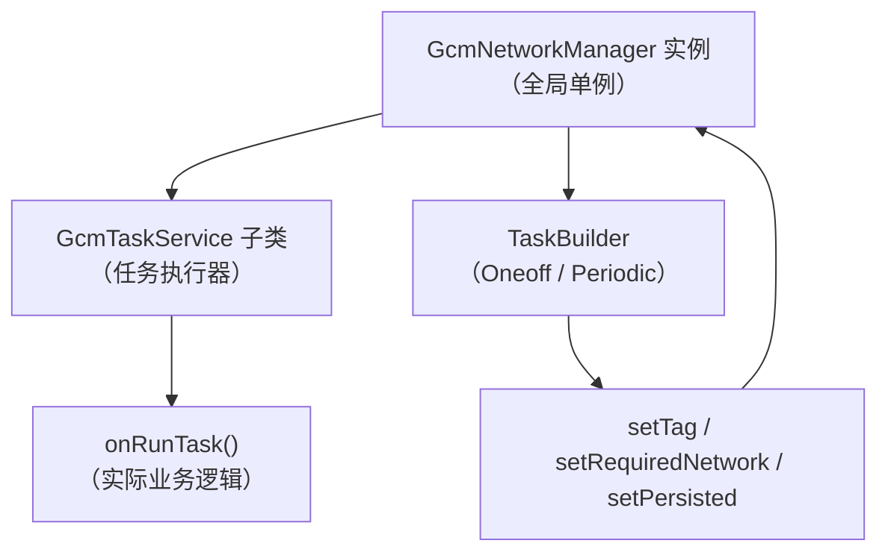
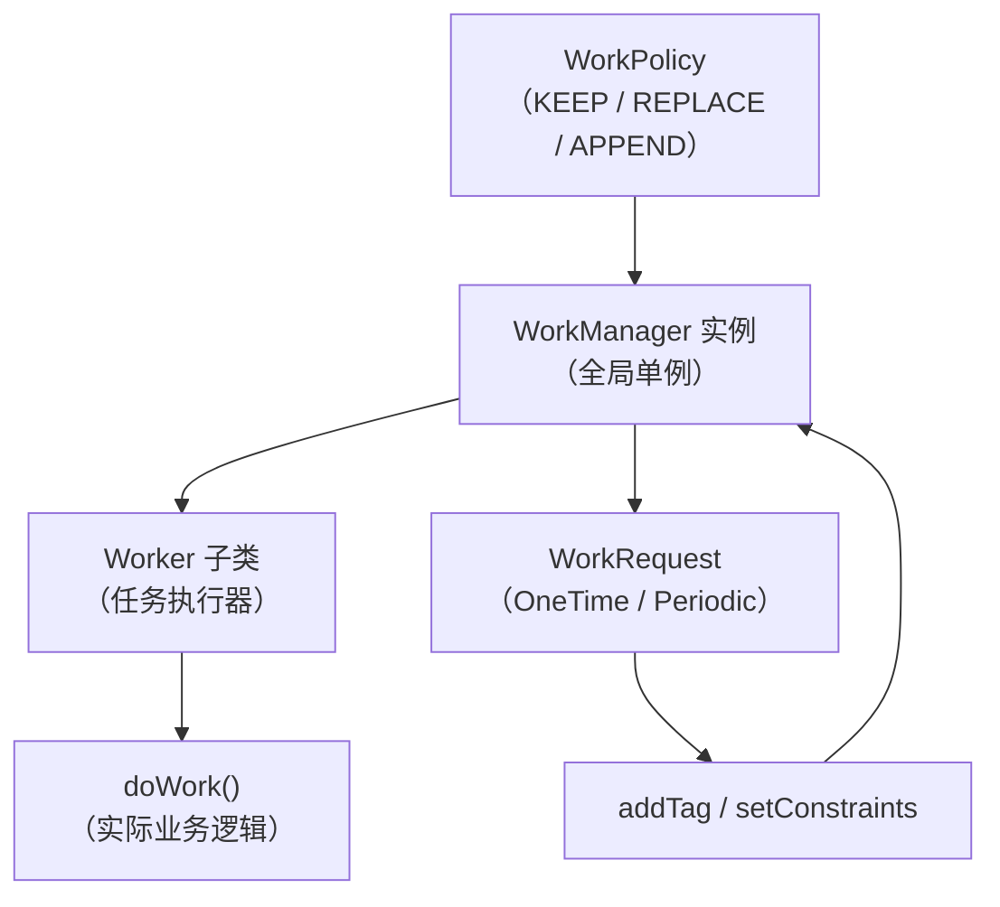
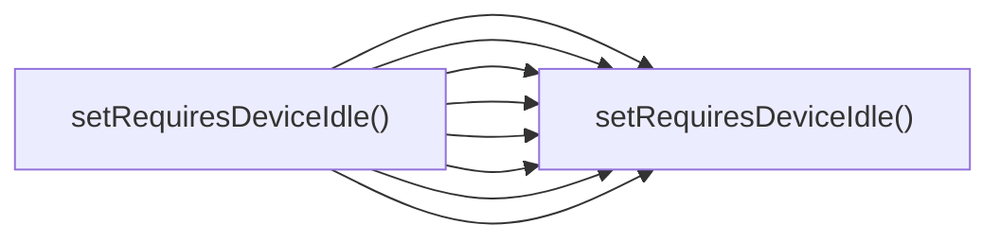
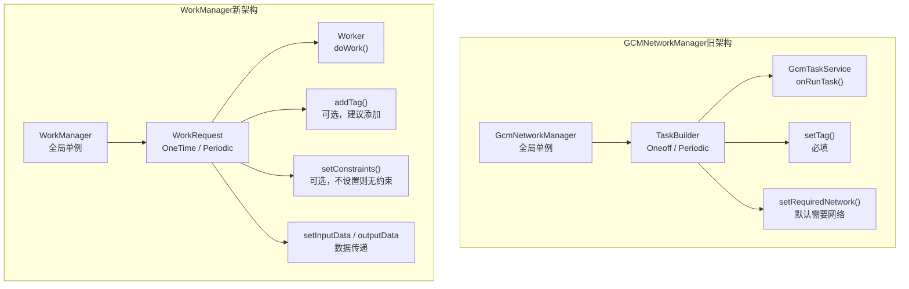

# 6.1.31 从 GCMNetworkManager 迁移到 WorkManager

帐篷外传来一阵窸窸窣窣的声音，像是什么小动物在草丛里走动。

"是野兔吧。"伊莎轻声说，把膝盖抱得更紧了一些。露营灯的光芒把她的侧脸映得柔柔的，睫毛投下一小片阴影。

希尔没抬头，手指在键盘上敲了几下。屏幕的蓝光映在她的镜片上，嘴角微微扬起一个弧度——那是她又要开始折腾什么新东西时的表情。

"搞定了。"她终于开口，声音里带着几分得意，"Firebase JobDispatcher 的迁移脚本跑通了，明天上班直接给老大汇报。"

洛芙正把下巴搁在叠起的睡袋上，听到这话眼睛一亮："那我们今天是不是可以休息了？"

"休息？"黛琳从笔记本后面抬起眼，嘴角弯了弯，"你忘了我们还有半个遗留项目没处理完。"

"半个？"

"嗯。就是那个用了 GCMNetworkManager 的老模块。"黛琳合上笔记本，在露营灯的光晕里她的表情看不分明，但语气里带着一点认真，"GCMNetworkManager 和 Firebase JobDispatcher 一样，都是要被 Google 废弃的东西。"

帐篷里安静了两秒。

"所以……又要迁移？"洛芙的声音小了下去，脑袋往睡袋里缩了缩。

"别那个表情嘛。"希尔把电脑转向洛芙，屏幕上是一行行代码，"GCMNetworkManager 迁到 WorkManager 比 JobDispatcher 还简单，因为它俩骨子里是一套思路——都是让你定义一个'任务执行器'，然后让系统帮你调度。"

"等等，"洛芙揉了揉眼睛，凑近屏幕，"GCMNetworkManager 不是跟云消息有关的吗？我记得 GCM 是 Google Cloud Messaging 的缩写……"

"是，但也不全是。"黛琳从希尔手里接过话，"GCMNetworkManager 最早是 GCM 库的一部分，专门用来在设备上调度需要网络的后台任务。后来 Google 把这部分功能拆了出来，成了一个独立的任务调度工具。再后来，Google 又觉得 WorkManager 更好，就让 GCMNetworkManager 也慢慢退出了舞台。"

伊莎轻轻"嗯"了一声，望着帐篷顶的某处发呆。

"这么说吧，"希尔拍了拍洛芙的肩膀，"GCMNetworkManager 是一个老式收音机，而 WorkManager 是最新的蓝牙音箱。都能听歌，但后者更省电、更智能、还支持更多功能。你老大肯定也想让你换成蓝牙音箱的。"

洛芙被这个比喻逗笑了，紧张感散去不少。

"那我们从哪里开始？"她问。

希尔眨眨眼，把电脑重新转向自己，手指悬在键盘上方。

"先让我给你们讲讲 GCMNetworkManager 是什么东西。"

屏幕的光在四个人脸上跳动。帐篷外，那只可能是野兔的小动物已经走远了，只剩虫鸣和远处偶尔传来的猫头鹰叫声。

"想象一下，"希尔的声音平缓下来，像在讲睡前故事，"你开了一家露营用品店，每天要处理很多订单。有些订单需要你亲自打包，有些需要仓库的人帮忙，还有些必须等快递员上门才能发货。"

"嗯……"洛芙点点头。

"GCMNetworkManager 就是那个帮你安排这些订单的店长。它会记住每个订单的要求——比如'这个必须联网才能查库存'，'那个只能在 WIFI 下才能下载说明书'——然后安排合适的时间让店员去处理。"

"但是！"希尔突然加重语气，"这个店长有个毛病：默认所有订单都需要联网才能处理。如果你写了一个不需要网络的任务，它也会傻乎乎地先去检查网络。"

"这不是……多余的吗？"洛芙皱起眉头。

"对。所以 WorkManager 把这个逻辑改了——没有网络约束的任务，真的不会去检查网络，省电多了。"

黛琳在一旁补充："而且 WorkManager 的任务调度更智能。它会考虑设备的状态——电量、存储空间、是否正在充电——来决定什么时候跑任务，而不是傻等网络。"

"那 GCMNetworkManager 的代码要怎么改？"洛芙问。

希尔深吸一口气，把屏幕往洛芙那边推了推。

"来，我给你们看一个真实的迁移案例。"

屏幕上是一个名为 `GcmTaskService` 的类，代码看起来有些年头了。

```kotlin
// GCMNetworkManager 旧代码（即将废弃）
class MyGcmTaskService : GcmTaskService() {
    override fun onRunTask(params: TaskParams): Int {
        // 在这里执行后台任务
        val tag = params.tag
        Log.d("GcmTask", "执行任务: $tag")
        // 模拟一些工作
        doSomeWork()
        return GcmNetworkManager.RESULT_SUCCESS
    }
}
```

"看到了吗？"希尔指着代码，"GcmTaskService 是 GCMNetworkManager 的核心。你需要继承它，然后重写 `onRunTask` 方法。"

"就像……定义一个专门处理某类订单的店员？"伊莎在后面轻声说。

"对，伊莎这个比喻很准确。"希尔点点头，"现在的问题是，这个'店员'要被辞退了，我们需要把它换成 WorkManager 的'店员'——也就是 Worker。"

她翻到下一页PPT（或者说下一页代码）。

```kotlin
// WorkManager 新代码
class MyWorker(
    context: Context,
    params: WorkerParameters
) : Worker(context, params) {

    override fun doWork(): Result {
        // 在这里执行后台任务
        val tag = inputData.getString("task_tag") ?: "unknown"
        Log.d("WorkManager", "执行任务: $tag")
        // 模拟一些工作
        doSomeWork()
        return Result.success()
    }
}
```

"核心变化在这里，"希尔用手指在两个代码块之间划了一条线，"第一，GcmTaskService 换成了 Worker。第二，onRunTask 换成了 doWork。第三，返回值从 GcmNetworkManager 的 RESULT_SUCCESS / RESULT_FAILURE 换成了 Worker.Result.success() / Result.failure()。"

洛芙仔细看着两段代码的对比，眉头微微皱起又松开。

"感觉……没有想象中那么难？"

"对吧？"希尔露出一个"我就知道你会这么说"的表情，"最难的部分不是写代码，是理解'任务是怎么被调度起来的'。来，我们继续看。"

她在键盘上敲了几下，调出另一个代码片段。

```kotlin
// GCMNetworkManager 调度任务（旧）
val task = OneoffTaskBuilder()
    .setService(MyGcmTaskService::class.java)
    .setTag("sync_data")
    .setRequiredNetwork(NETWORK_STATE_CONNECTED)
    .setPersisted(true)  // 设备重启后保留任务
    .build()

GcmNetworkManager.getInstance(this).schedule(task)
```

"看到了吗？"希尔指着这行代码，"这是 GCMNetworkManager 调度一个一次性任务的方式。OneoffTaskBuilder——一次性任务构建器，跟 Firebase JobDispatcher 的 PersistentTaskBuilder 思路很像。"

"等等，"洛芙举起手，"这里有个 `setPersisted(true)`，是什么意思？"

"好问题。"黛琳接过话，"它表示这个任务在设备重启之后还会保留。GcmNetworkManager 会把任务信息存在数据库里，重启后系统会自动重新调度那些被标记为持久化的任务。"

"WorkManager 也有类似的功能，而且更简单。"

```kotlin
// WorkManager 调度任务（新）
val constraints = Constraints.Builder()
    .setRequiredNetworkState(NetworkType.CONNECTED)
    .build()

val syncWorkRequest = OneTimeWorkRequestBuilder<MyWorker>()
    .setInputData(workDataOf("task_tag" to "sync_data"))
    .setConstraints(constraints)
    .addTag("sync_data")
    .build()

WorkManager.getInstance(context).enqueue(syncWorkRequest)
```

"看到了吗？"希尔的声音里带着一点雀跃，"WorkManager 用 `setConstraints` 来设置约束条件，用 `addTag` 来给任务打标签。默认情况下，WorkManager 的任务也是持久化的——设备重启后会自动重新执行。"

"等等，这里有个很重要的区别。"黛琳突然开口，表情变得认真起来，"GCMNetworkManager 默认要求网络连接，但 WorkManager 不——如果你不设置 `setRequiredNetworkState`，WorkManager 就不会要求网络。"

"这是好事还是坏事？"洛芙问。

"看情况。"黛琳说，"对于真正不需要网络的任务，WorkManager 的做法更省电。但如果你迁移的是一个老项目，原来 GCMNetworkManager 默认需要网络，那你需要在 WorkManager 里显式加上这个约束。"

帐篷外的风轻轻吹过，帐篷的帆布壁发出细微的声响。伊莎往黛琳身边靠了靠，肩膀贴着肩膀。

"希尔，"洛芙又举起手，"GCMNetworkManager 好像还有个 `PeriodicTaskBuilder`，对吧？那个怎么迁移？"

"问得好。"希尔重新打开电脑，"周期性任务比一次性任务多一个步骤：需要设置重复执行的间隔。"

```kotlin
// GCMNetworkManager 周期性任务（旧）
val periodicTask = PeriodicTaskBuilder()
    .setService(MyGcmTaskService::class.java)
    .setTag("periodic_sync")
    .setPeriod(3600L)  // 至少3600秒（1小时）执行一次
    .setRequiredNetwork(NETWORK_STATE_CONNECTED)
    .setPersisted(true)
    .build()

GcmNetworkManager.getInstance(this).schedule(periodicTask)
```

"在 GCMNetworkManager 里，用 `PeriodicTaskBuilder` 来创建周期性任务，`setPeriod()` 设置的是最小间隔时间——系统可能会适当延长，但不会缩短。"

```kotlin
// WorkManager 周期性任务（新）
val periodicConstraints = Constraints.Builder()
    .setRequiredNetworkState(NetworkType.CONNECTED)
    .build()

val periodicWorkRequest = PeriodicWorkRequestBuilder<MyWorker>(
    1, TimeUnit.HOURS,   // 重复间隔：1小时
    15, TimeUnit.MINUTES // 弹性时间窗口：允许延迟15分钟
)
    .setConstraints(periodicConstraints)
    .addTag("periodic_sync")
    .build()

WorkManager.getInstance(context).enqueueUniquePeriodicWork(
    "periodic_sync",
    ExistingPeriodicWorkPolicy.KEEP,  // 如果已存在，保留原有任务
    periodicWorkRequest
)
```

"这里有几个关键点。"希尔竖起手指，"第一，`PeriodicWorkRequestBuilder` 的第一个参数是最小重复间隔，不支持比 15 分钟更短的间隔——这是 Google 出于电池优化的考虑。"

"第二，第二个参数是弹性时间窗口（flex interval）。如果你的设备在 1 小时后正好在睡觉，WorkManager 可以在接下来的 15 分钟窗口内择机执行，而不是非要等到整点。"

"第三，用 `enqueueUniquePeriodicWork` 而不是 `enqueue`。这很重要，因为 WorkManager 不允许同一个 tag 的多个周期性任务同时存在——用 `enqueueUniquePeriodicWork` 可以避免冲突。"

洛芙在本子上飞快地记着。

"那标签呢？"她问，"GCMNetworkManager 的 `setTag` 和 WorkManager 的 `addTag` 是一样的吗？"

"功能上是一样的，但有个细节要注意。"希尔把两个代码块并排放，"GCMNetworkManager 的 tag 是必填的——你不给它起个名字，它就不让你 schedule。WorkManager 也有类似的机制，但如果你不显式加 tag，WorkManager 会自动生成一个 UUID 作为内部标识。"

"不过，"黛琳补充道，"强烈建议显式加 tag。这样你后面可以用 `WorkManager.cancelAllWorkByTag()` 来取消所有带有特定标签的任务，很方便。"

"比如这样？"

洛芙试着在自己的笔记本上写了一段代码。

```kotlin
// 取消所有 "sync_data" 标签的任务
WorkManager.getInstance(context).cancelAllWorkByTag("sync_data")
```

"对，很简单。"希尔点点头，"GCMNetworkManager 也是这么用的。"

帐篷里又安静了一会儿。露营灯的光在四个人脸上投下温暖的光影，远处传来一阵蟋蟀的鸣叫。

"我有个问题，"伊莎轻声开口，"如果原来的 GCMNetworkManager 代码里有很多任务，它们都写在不同的 GcmTaskService 里……迁移的时候要怎么办？"

希尔和黛琳对视了一眼。

"好问题。"黛琳说，"实际上，Google 官方有推荐的做法——"

她拿起白板笔，在帐篷内侧的小白板上画了起来。

"想象一下，GCMNetworkManager 的调度体系是这样的："



"GcmNetworkManager 用 tag 来标识任务，每个 GcmTaskService 可以响应多个不同的 tag——就像一个店员可以处理好几种类型的订单。"

"迁移到 WorkManager 之后，体系变成了这样："



"结构几乎一样，只是名字变了。"

"那我是不是可以一对一地迁移？"洛芙问。

"对，就是一对一地迁移。"黛琳点点头，"每个 GcmTaskService 对应一个 Worker，每个 TaskBuilder 对应一个 WorkRequest。"

"但有一个问题要注意——"希尔突然说。

她打开另一个代码示例。

```kotlin
// GCMNetworkManager 任务的额外参数传递
class MyGcmTaskService : GcmTaskService() {
    override fun onRunTask(params: TaskParams): Int {
        val extraData = params.extras  // 获取额外数据
        val tag = params.tag
        Log.d("GcmTask", "收到数据: $extraData, 标签: $tag")
        return GcmNetworkManager.RESULT_SUCCESS
    }
}

// 调度时传递参数
val task = OneoffTaskBuilder()
    .setService(MyGcmTaskService::class.java)
    .setTag("task_with_data")
    .setExtras(Bundle().apply {
        putString("user_id", "12345")
        putInt("action_type", 1)
    })
    .build()
```

"看到了吗？GCMNetworkManager 用 `setExtras` 传递额外数据，这些数据在 `TaskParams.extras` 里可以取到。"

"WorkManager 用 `setInputData` 来做同样的事情。"

```kotlin
// WorkManager 传递额外数据
class MyWorker(
    context: Context,
    params: WorkerParameters
) : Worker(context, params) {

    override fun doWork(): Result {
        // 通过 inputData 获取额外数据
        val userId = inputData.getString("user_id") ?: return Result.failure()
        val actionType = inputData.getInt("action_type", 0)
        Log.d("WorkManager", "收到数据: userId=$userId, actionType=$actionType")
        return Result.success()
    }
}

val data = workDataOf(
    "user_id" to "12345",
    "action_type" to 1
)

val workRequest = OneTimeWorkRequestBuilder<MyWorker>()
    .setInputData(data)
    .addTag("task_with_data")
    .build()
```

"注意，"希尔强调，"WorkManager 的 inputData 是一个 `Data` 对象，不是 Bundle。`workDataOf()` 是 WorkManager 提供的辅助函数，可以方便地从一个 Map 构建 Data 对象。"

"还有一件事。"黛琳补充道，"GCMNetworkManager 里的 `TaskParams` 同时包含了 tag 和 extras。但在 WorkManager 里，tag 用 `addTag()` 设置，而数据用 `setInputData()` 设置——它们是分开的。"

洛芙在本子上画了个小箭头，把 tag 和 Data 分开记。

"那如果我需要返回数据呢？"她问，"GCMNetworkManager 好像有个 `GcmNetworkManager.schedule()` 之后就没了，我怎么拿到结果？"

"这正是 WorkManager 比起 GCMNetworkManager 最大的改进之一。"希尔眼睛亮了起来。

她翻到一页新的代码。

```kotlin
// GCMNetworkManager：无法获取任务结果
val task = OneoffTaskBuilder()
    .setService(MyGcmTaskService::class.java)
    .setTag("fetch_data")
    .build()

GcmNetworkManager.getInstance(this).schedule(task)
// 任务被调度后就结束了，你不知道它什么时候完成
// 只能靠 GcmTaskService 内部自己写入数据库或文件来传递结果
```

"GCMNetworkManager 调度任务之后，就完全撒手不管了。你只能靠任务本身去写入数据库或文件来保存结果，没有任何内置的回调机制。"

```kotlin
// WorkManager：可以通过 LiveData 获取任务状态和结果
val workRequest = OneTimeWorkRequestBuilder<MyWorker>()
    .addTag("fetch_data")
    .build()

val workManager = WorkManager.getInstance(context)
workManager.enqueue(workRequest)

// 观察任务状态
workManager.getWorkInfoByIdLiveData(workRequest.id)
    .observe(this) { workInfo ->
        when (workInfo.state) {
            WorkInfo.State.SUCCEEDED -> {
                val resultData = workInfo.outputData
                Log.d("WorkManager", "任务成功，结果: $resultData")
            }
            WorkInfo.State.FAILED -> {
                Log.d("WorkManager", "任务失败")
            }
            WorkInfo.State.RUNNING -> {
                Log.d("WorkManager", "任务执行中")
            }
        }
    }
```

"看到了吗？"希尔的声音里带着明显的兴奋，"WorkManager 提供了 `getWorkInfoByIdLiveData()` 这样的方法，可以让你实时观察任务的状态。如果任务失败了，你还能通过 `WorkInfo.state` 和 `outputData` 拿到失败的原因和输出数据。"

"这太棒了。"洛芙感叹道，"原来 GCMNetworkManager 就是一个'丢出去就不管'的模式，WorkManager 才是真正的'全程追踪'。"

"对。"黛琳点点头，"这就是为什么 Google 强烈推荐大家迁移到 WorkManager。它不只是一个任务调度器，还是一个完整的生命周期感知型后台任务管理框架。"

帐篷外传来一阵风声，帆布壁被吹得微微鼓起。希尔伸手护住电脑屏幕，灯光在她脸上晃了晃。

"好，现在我们来做个完整的迁移示例。"希尔说，"假设我们有一个老项目，里面用 GCMNetworkManager 实现了三个功能："

"第一，同步用户数据到服务器，需要网络连接。"
"第二，清理缓存文件，不需要网络，但需要在设备充电时执行。"
"第三，定期上报崩溃日志，需要网络连接，且周期是每6小时执行一次。"

"我们把三个任务都迁移一遍。"

```kotlin
// ==================== GCMNetworkManager 版本 ====================

// 任务1：同步用户数据
class SyncUserDataService : GcmTaskService() {
    override fun onRunTask(params: TaskParams): Int {
        Log.d("GcmTask", "同步用户数据")
        syncUserData()
        return GcmNetworkManager.RESULT_SUCCESS
    }
}

// 任务2：清理缓存
class CleanCacheService : GcmTaskService() {
    override fun onRunTask(params: TaskParams): Int {
        Log.d("GcmTask", "清理缓存")
        cleanCache()
        return GcmNetworkManager.RESULT_SUCCESS
    }
}

// 任务3：上报崩溃日志
class ReportCrashLogService : GcmTaskService() {
    override fun onRunTask(params: TaskParams): Int {
        Log.d("GcmTask", "上报崩溃日志")
        uploadCrashLogs()
        return GcmNetworkManager.RESULT_SUCCESS
    }
}

// 调度代码（Activity 或 Application 中）
fun scheduleAllTasks(context: Context) {
    val gcmNetworkManager = GcmNetworkManager.getInstance(context)

    // 任务1：需要网络的一次性/周期性任务
    val syncTask = PeriodicTaskBuilder()
        .setService(SyncUserDataService::class.java)
        .setTag("sync_user_data")
        .setPeriod(4 * 3600L) // 每4小时
        .setRequiredNetwork(NETWORK_STATE_CONNECTED)
        .setPersisted(true)
        .build()
    gcmNetworkManager.schedule(syncTask)

    // 任务2：需要在充电时的任务
    val cacheTask = PeriodicTaskBuilder()
        .setService(CleanCacheService::class.java)
        .setTag("clean_cache")
        .setPeriod(24 * 3600L) // 每天
        .setRequiredNetwork(NETWORK_STATE_UNMETERED) // GCMNetworkManager 没有充电约束
        .setPersisted(true)
        .build()
    gcmNetworkManager.schedule(cacheTask)

    // 任务3：每6小时的崩溃日志上报
    val crashTask = PeriodicTaskBuilder()
        .setService(ReportCrashLogService::class.java)
        .setTag("report_crash")
        .setPeriod(6 * 3600L)
        .setRequiredNetwork(NETWORK_STATE_CONNECTED)
        .setPersisted(true)
        .build()
    gcmNetworkManager.schedule(crashTask)
}
```

"注意这里有个问题，"黛琳指着任务2的代码，"GCMNetworkManager 没有充电约束（requiresCharging），但 WorkManager 有。如果你的应用原来依赖 GCMNetworkManager 来做'只在充电时执行'的任务，迁移后需要用 WorkManager 的 `setRequiresCharging(true)` 来显式指定。"

"明白。"洛芙认真地点头。

"现在我们看 WorkManager 版本。"

```kotlin
// ==================== WorkManager 版本 ====================

// 任务1：同步用户数据
class SyncUserDataWorker(
    context: Context,
    params: WorkerParameters
) : Worker(context, params) {

    override fun doWork(): Result {
        Log.d("WorkManager", "同步用户数据")
        val success = syncUserData()
        return if (success) Result.success() else Result.retry()
    }
}

// 任务2：清理缓存（在充电时执行）
class CleanCacheWorker(
    context: Context,
    params: WorkerParameters
) : Worker(context, params) {

    override fun doWork(): Result {
        Log.d("WorkManager", "清理缓存")
        cleanCache()
        return Result.success()
    }
}

// 任务3：上报崩溃日志
class ReportCrashLogWorker(
    context: Context,
    params: WorkerParameters
) : Worker(context, params) {

    override fun doWork(): Result {
        Log.d("WorkManager", "上报崩溃日志")
        val success = uploadCrashLogs()
        return if (success) Result.success() else Result.retry()
    }
}

// 调度代码（使用 ListenableWorker 的现代方式）
fun scheduleAllTasksWithWorkManager(context: Context) {
    val workManager = WorkManager.getInstance(context)

    // 任务1：同步用户数据，每4小时一次
    val syncConstraints = Constraints.Builder()
        .setRequiredNetworkState(NetworkType.CONNECTED)
        .build()

    val syncWorkRequest = PeriodicWorkRequestBuilder<SyncUserDataWorker>(
        4, TimeUnit.HOURS,
        30, TimeUnit.MINUTES  // 弹性窗口
    )
        .setConstraints(syncConstraints)
        .addTag("sync_user_data")
        .build()

    // 任务2：清理缓存，每天一次，仅在充电时执行
    val cacheConstraints = Constraints.Builder()
        .setRequiresCharging(true)
        // 不设置网络约束 = 不要求网络
        .build()

    val cacheWorkRequest = PeriodicWorkRequestBuilder<CleanCacheWorker>(
        1, TimeUnit.DAYS,
        1, TimeUnit.HOURS  // 弹性窗口
    )
        .setConstraints(cacheConstraints)
        .addTag("clean_cache")
        .build()

    // 任务3：崩溃日志上报，每6小时一次
    val crashConstraints = Constraints.Builder()
        .setRequiredNetworkState(NetworkType.CONNECTED)
        .build()

    val crashWorkRequest = PeriodicWorkRequestBuilder<ReportCrashLogWorker>(
        6, TimeUnit.HOURS,
        30, TimeUnit.MINUTES
    )
        .setConstraints(crashConstraints)
        .addTag("report_crash")
        .build()

    // 使用 enqueueUniquePeriodicWork 确保不会有重复任务
    workManager.enqueueUniquePeriodicWork(
        "sync_user_data",
        ExistingPeriodicWorkPolicy.KEEP,
        syncWorkRequest
    )

    workManager.enqueueUniquePeriodicWork(
        "clean_cache",
        ExistingPeriodicWorkPolicy.KEEP,
        cacheWorkRequest
    )

    workManager.enqueueUniquePeriodicWork(
        "report_crash",
        ExistingPeriodicWorkPolicy.KEEP,
        crashWorkRequest
    )
}
```

希尔滑动到下一页PPT，上面是一个表格。

"Google 官方给出的 GCMNetworkManager 到 WorkManager 的约束条件映射："



"注意这里，"黛琳指着表格中的 `NETWORK_STATE_ANY` 那行，"GCMNetworkManager 如果设置 `NETWORK_STATE_ANY`，意味着'有网也行，没网也行'。在 WorkManager 里，你直接不调用 `setRequiredNetworkState()` 就行了——不设置就是任意网络状态。"

"那如果 GCMNetworkManager 原来的代码里没有设置任何网络约束呢？"洛芙问。

"那样的话，GCMNetworkManager 默认要求 `NETWORK_STATE_CONNECTED`——也就是说，默认必须有网。"黛琳说，"迁移到 WorkManager 之后，如果你想保持这个行为，需要显式加上 `setRequiredNetworkState(NetworkType.CONNECTED)`。"

"明白了。"

希尔合上电脑，帐篷里突然暗了下来——她把电脑屏幕关掉了，只剩露营灯的光。

"还有一个问题，我没放进代码里，"她的声音在黑暗中响起，"GCMNetworkManager 有一个很老的遗留问题：它依赖 Google Play Services 才能工作。"

"也就是说，"黛琳接过话，"如果用户的设备没有 Google Play Services，GCMNetworkManager 就用不了。"

"但 WorkManager 不一样。"希尔说，"WorkManager 是 AndroidX 库的一部分，不依赖 Google Play Services。它在所有符合 Android 最小版本要求的设备上都能工作——包括没有 Google 服务的设备，比如某些地区的定制 Android 系统。"

"这也是 Google 为什么要废弃 GCMNetworkManager 的原因之一吧。"伊莎轻声说。

"对。"希尔点点头，"Google 想让所有的后台任务调度都走 WorkManager 这条路，这样 Google Play Services 的负担也能减轻一些。"

帐篷外传来一阵猫头鹰的叫声，低沉而悠远。露营灯的光影在帆布壁上晃动，把四个人的影子拉得长长的。

"洛芙，"黛琳突然问，"你知道怎么判断一个 GCMNetworkManager 任务有没有在执行吗？"

"嗯……我猜是用 `GcmNetworkManager.getInstance(context).getStatusForTag()` 之类的？"

"差不多。"黛琳笑了笑，"GCMNetworkManager 确实有 `getStatus()` 方法，但它只能告诉你任务是在等待中、运行中、还是失败了，不能实时拿到进度。"

"WorkManager 呢？"

"WorkManager 的 `getWorkInfoByIdLiveData()` 可以拿到 `WorkInfo`，里面有 `state`、`progress`、`runAttemptCount`、`outputData` 等丰富信息。"

希尔在黑暗中又打开电脑，屏幕的光重新亮起来。

"来，我给你们写个状态观察的完整示例。"

```kotlin
// 观察单个任务的状态
val workId = syncWorkRequest.id

WorkManager.getInstance(context)
    .getWorkInfoByIdLiveData(workId)
    .observe(this) { workInfo ->
        when (workInfo?.state) {
            WorkInfo.State.ENQUEUED -> {
                Log.d("WorkDemo", "任务已加入队列，等待调度")
            }
            WorkInfo.State.BLOCKED -> {
                Log.d("WorkDemo", "任务被阻止（约束条件不满足）")
            }
            WorkInfo.State.RUNNING -> {
                Log.d("WorkDemo", "任务执行中，进度: ${workInfo.progress.getInt("progress", 0)}%")
            }
            WorkInfo.State.SUCCEEDED -> {
                Log.d("WorkDemo", "任务成功完成")
            }
            WorkInfo.State.FAILED -> {
                Log.d("WorkDemo", "任务失败，已重试 ${workInfo.runAttemptCount} 次")
            }
            WorkInfo.State.CANCELLED -> {
                Log.d("WorkDemo", "任务被取消")
            }
            null -> {
                Log.d("WorkDemo", "任务信息为空")
            }
        }
    }

// 如果需要设置进度（Worker 内部调用）
fun setProgress(value: Int) {
    val progress = workDataOf("progress" to value)
    setProgressAsync(progress)  // 在 Worker 的 doWork() 中调用
}
```

"看到了吗？"希尔指着最后几行，"Worker 可以通过 `setProgressAsync()` 来报告自己的执行进度，主线程可以通过 `WorkInfo.progress` 来读取这个进度。这是 GCMNetworkManager 完全做不到的事情。"

"而且 WorkManager 还支持任务链。"黛琳补充道。

"任务链？"

"对，就是'任务A完成后执行任务B，任务B完成后执行任务C'这种链式调用。"

```kotlin
// WorkManager 任务链示例
val workManager = WorkManager.getInstance(context)

val workA = OneTimeWorkRequestBuilder<WorkerA>().build()
val workB = OneTimeWorkRequestBuilder<WorkerB>()
    .setConstraints(Constraints.Builder()
        .setRequiredNetworkState(NetworkType.CONNECTED)
        .build())
    .build()
val workC = OneTimeWorkRequestBuilder<WorkerC>().build()

// A -> B -> C 顺序执行
workManager.beginWith(workA)
    .then(workB)
    .then(workC)
    .enqueue()
```

"GCMNetworkManager 没有这个功能。"希尔说，"如果你想让任务A的结果传给任务B，你得自己在 GcmTaskService 里用数据库或者文件来中转。但 WorkManager 有 `WorkManager.beginUniqueWork()` 和 `WorkChain` 机制，可以直接传递 inputData 和 outputData。"

帐篷外又传来一阵风声，这次更明显了。帆布壁被吹得猎猎作响，露营灯的火苗晃了晃。

"今晚我们能把这个迁移搞定吗？"洛芙问。

"能。"希尔打了个哈欠，"迁移的核心就那么几点：GcmTaskService 换成 Worker，TaskBuilder 换成 WorkRequest，约束条件对照表换一套名字。你把对照表记住，代码就是体力活了。"

"那约束条件对照表是什么来着？"洛芙翻着自己的笔记本。

黛琳伸过手来，把笔记本翻到空白页，开始画：

```
GCMNetworkManager          →    WorkManager
─────────────────────────────────────────────────
setRequiredNetwork(CONN)   →    setRequiredNetworkState(CONNECTED)
setRequiredNetwork(UNMTR)  →    setRequiredNetworkState(UNMETERED)
不设置（默认需网）         →    setRequiredNetworkState(CONNECTED) [需显式]
NETWORK_STATE_ANY         →    不调用 setRequiredNetworkState()
setPersisted(true)         →    默认持久化（无需调用）
setRequiresCharging()      →    setRequiresCharging(true)  [GCM没有!]
setRequiresBatteryNotLow() →    setRequiresBatteryNotLow(true)
setRequiresDeviceIdle()    →    setRequiresDeviceIdle(true)
```

"这个表格，你今晚背下来。"黛琳说。

"好。"洛芙把笔记本合上，郑重地点了点头。

希尔把电脑屏幕关掉，帐篷里又只剩下露营灯的光。

"对了，最后一件事。"她在黑暗中说，"GCMNetworkManager 的依赖要移除。"

"哦对！"洛芙拍了拍脑袋，"不能两个都留着。"

"需要在 build.gradle 里做三件事，"希尔竖起三根手指，"第一，移除 GCMNetworkManager 的依赖——就是 `com.google.android.gms:play-services-gcm`。第二，添加 WorkManager 的依赖——`androidx.work:work-runtime-ktx`。第三，如果你的应用还需要支持 Android 4.4（API 19）以下的设备，添加 WorkManager 的 GCM 调度器——`androidx.work:work-gcm`。"

"等等，为什么还需要 GCM 调度器？"洛芙问。

"因为在 Android 5.0（API 21）以下的设备上，WorkManager 内部需要依赖 GCM 来实现任务持久化。"黛琳解释道，"但从 Android 5.0 开始，WorkManager 使用自己的 JobScheduler 原生实现，不再需要 GCM 了。"

"所以，`androidx.work:work-gcm` 只在你的 minSdkVersion 低于 21 时才需要？"

"对。如果你的应用已经不支持 Android 4.4 了，就不需要这个依赖。"

洛芙把这些都记在本子上，笔尖在纸上沙沙作响。

帐篷外的风声渐渐小了，猫头鹰也不叫了。露营灯的火苗安静下来，在四个人脸上投下温暖的光影。

"谢谢你们。"洛芙把笔记本放到一边，往睡袋里缩了缩，"今天学了好多。"

"明天去公司，第一件事就是把 GCMNetworkManager 的依赖删掉。"希尔说。

"然后跑一遍测试，确保所有后台任务都还在正常跑。"黛琳补充道。

"最后把新代码提交 PR，等老大 review 通过就能合并了。"伊莎打了个哈欠。

"好！"洛芙用力点头。

露营灯的光慢慢暗了下去。四个人躺进各自的睡袋，帐篷外是白马村秋夜安静的星空，银河从山脊上方横跨而过，像一条闪着微光的河流。

明天，又是新的一天。

---

## 专业技术总结

**GCMNetworkManager** — Google Cloud Messaging 网络任务管理器，是 GCM（Google Cloud Messaging）客户端库的一部分，提供设备级后台任务调度能力。通过继承 `GcmTaskService` 并重写 `onRunTask()` 方法定义任务执行逻辑，使用 `OneoffTaskBuilder` 或 `PeriodicTaskBuilder` 构建任务，并通过 `GcmNetworkManager.schedule()` 注册。由于依赖 Google Play Services 且缺乏现代特性（进度报告、任务链、电量感知），已被 Google 官方废弃，建议迁移至 WorkManager。

**GcmTaskService** — GCMNetworkManager 的核心组件，抽象类，开发者需继承并实现 `onRunTask(TaskParams)` 方法来完成实际任务逻辑。该方法运行在后台线程，返回 `GcmNetworkManager.RESULT_SUCCESS` 或 `RESULT_FAILURE` 告知系统任务执行结果。

**WorkManager** — AndroidX 提供的高级后台任务调度库，是 Google 推荐的背景任务调度解决方案。相比 GCMNetworkManager，WorkManager 支持：任务生命周期感知（自动处理进程死亡重启）、约束条件更丰富（充电状态、存储空间等）、内置进度报告与状态观察、任务链与工作链支持、以及完全脱离 Google Play Services（Android 5.0+）。核心组件为 `Worker`（定义任务逻辑）和 `WorkRequest`（定义调度参数）。

#### 结构图



#### 约束条件对照表

| GCMNetworkManager | WorkManager | 备注 |
|---|---|---|
| `NETWORK_STATE_CONNECTED` | `NetworkType.CONNECTED` | 必须有网络 |
| `NETWORK_STATE_UNMETERED` | `NetworkType.UNMETERED` | 需要非计量网络（WIFI） |
| `NETWORK_STATE_ANY` 或不设置 | 不调用 `setRequiredNetworkState()` | WorkManager 默认不要求网络 |
| GCMNetworkManager 默认（需网） | `NetworkType.CONNECTED` | 需显式指定才能保持兼容 |
| `setPersisted(true)` | 默认行为 | WorkManager 任务默认持久化 |
| 无对应功能 | `setRequiresCharging(true)` | GCMNetworkManager 无充电约束 |
| `setRequiresBatteryNotLow()` | `setRequiresBatteryNotLow()` | 一致 |
| `setRequiresDeviceIdle()` | `setRequiresDeviceIdle()` | 一致 |

#### 反模式与陷阱

**1. 遗漏网络约束导致任务提前执行**
GCMNetworkManager 默认要求网络，但 WorkManager 不要求。如果迁移前 GCMNetworkManager 任务没有显式设置网络约束（依赖默认行为），迁移后必须显式添加 `setRequiredNetworkState(CONNECTED)`，否则任务可能在无网络时提前执行导致失败。

**2. 周期性任务间隔小于15分钟**
WorkManager 规定 `PeriodicWorkRequest` 的最小重复间隔为 15 分钟。如果原 GCMNetworkManager 任务周期小于此值，WorkManager 无法精确复现，需与产品经理协商调整业务逻辑或使用 `AlarmManager` + `BroadcastReceiver` 手动实现。

**3. 重复调度导致多实例同时运行**
GCMNetworkManager 允许同一 tag 的多个任务实例同时存在。WorkManager 的 `enqueue()` 也会创建新实例，但 `enqueueUniquePeriodicWork()` 会检查是否存在同名周期性任务。使用 `ExistingPeriodicWorkPolicy.KEEP` 保留原任务（推荐）或 `REPLACE` 替换原任务。

**4. minSdkVersion < 21 时未添加 work-gcm 依赖**
Android 5.0 以下，WorkManager 使用 GCM 作为任务持久化的底层实现。如果 minSdkVersion < 21 且未添加 `androidx.work:work-gcm`，WorkManager 无法在进程被杀死后自动恢复任务。

**5. Worker.doWork() 中抛异常导致任务静默失败**
GCMNetworkManager 的 `onRunTask()` 如果抛异常会被系统捕获。WorkManager 的 `doWork()` 如果抛出未捕获异常，任务被视为失败并记录到 Logcat。务必使用 `try-catch` 包裹业务逻辑，对可重试的失败返回 `Result.retry()`。

#### 设计哲学

**约束即意图** — WorkManager 将"何时执行任务"的决定权完全交给系统，开发者只需声明任务的约束条件（网络、充电状态、存储空间等）。系统会在约束满足时自动调度，无需手动轮询或唤醒设备。这一设计降低了应用在后台运行时对系统资源的消耗，延长了设备的电池续航。

**任务持久化与进程感知** — WorkManager 将所有 WorkRequest 持久化到数据库，这意味着即使用户关闭应用甚至设备重启，任务也不会丢失。当应用进程被杀死后重新启动，WorkManager 会自动重新调度未完成的任务。这种"注册-遗忘"（Register-and-forget）模式是现代后台任务调度的核心理念。

**生命周期安全** — 与 `IntentService` 不同，Worker 在配置变更（如屏幕旋转）导致 Activity 重建时不会中断，因为 `doWork()` 运行在独立的工作进程。通过 `ListenableFuture` 和 `LiveData`，WorkManager 提供了安全的状态观察机制，应用可以在任何时候获取任务的执行状态，而无需担心内存泄漏或空指针。

#### 🏕️ 动手练习

**目标**：将一个使用 GCMNetworkManager 的示例应用迁移到 WorkManager，并验证所有功能正常。

**你需要做的事**：

1. **创建示例项目**（Android Studio → New Project → Empty Activity，minSdkVersion 21，targetSdkVersion 34）
2. **添加 GCMNetworkManager 旧依赖**（仅用于模拟旧代码，不要真的用，理解为迁移前的状态）：

```groovy
// build.gradle (app)
dependencies {
    // 注释掉原有依赖，模拟旧状态
    // implementation 'com.google.android.gms:play-services-gcm:17.0.0'
    implementation 'androidx.work:work-runtime-ktx:2.9.0'
}
```

3. **创建 GCMNetworkManager 的模拟旧代码**（在 `// old/` 目录下）：

```kotlin
// old/GcmTaskService模拟.kt
// 这是你即将替换的旧代码——不要在这个文件里做任何改动
class OldGcmTaskService : GcmTaskService() {
    override fun onRunTask(params: TaskParams): Int {
        Log.d("OldGcmTask", "任务执行: ${params.tag}")
        // 模拟网络请求
        Thread.sleep(2000)
        return GcmNetworkManager.RESULT_SUCCESS
    }
}
```

4. **编写新的 Worker 类**：

```kotlin
// MainWorker.kt
class MainWorker(
    context: Context,
    params: WorkerParameters
) : Worker(context, params) {

    override fun doWork(): Result {
        val tag = inputData.getString("task_tag") ?: "unknown"
        Log.d("WorkManager", "执行任务: $tag")

        // 模拟耗时操作
        try {
            Thread.sleep(2000)
        } catch (e: InterruptedException) {
            return Result.failure()
        }

        // 如果需要重试，可以返回 retry()
        return Result.success()
    }
}
```

5. **实现 WorkManager 调度代码**：

```kotlin
// MainActivity.kt - 在 onCreate() 中添加
val workManager = WorkManager.getInstance(this)

// 一次性任务
val oneTimeRequest = OneTimeWorkRequestBuilder<MainWorker>()
    .setInputData(workDataOf("task_tag" to "one_time_sync"))
    .addTag("sync_tag")
    .setConstraints(
        Constraints.Builder()
            .setRequiredNetworkState(NetworkType.CONNECTED)
            .build()
    )
    .build()

workManager.enqueue(oneTimeRequest)

// 观察任务状态
workManager.getWorkInfoByIdLiveData(oneTimeRequest.id)
    .observe(this) { workInfo ->
        Log.d("MainActivity", "状态: ${workInfo?.state}")
    }
```

6. **取消任务的练习**：添加一个按钮，点击后取消所有带 `sync_tag` 的任务。

7. **运行应用**：在 Logcat 中过滤 `WorkManager` 关键字，观察任务从 ENQUEUED → RUNNING → SUCCEEDED 的完整生命周期。

**验收标准**：

- [ ] 项目成功编译，未报依赖错误
- [ ] 运行应用后，Logcat 中出现 `WorkManager` 状态日志
- [ ] 切换飞行模式后重新开启，任务能自动恢复执行
- [ ] 点击取消按钮后，Logcat 显示 `CANCELLED` 状态
- [ ] 对照约束条件表，检查迁移前后的行为是否一致

**提示**：Android 模拟器默认网络状态是"已连接"。如果需要测试网络约束相关的行为，使用 `adb emu voice disable` 或在模拟器设置中切换飞行模式。

#### 参考实现要点

1. **依赖迁移顺序**：先添加 `androidx.work:work-runtime-ktx`，再移除 GCM 依赖，最后编译验证功能无损。

2. **保留原有业务逻辑**：`GcmTaskService.onRunTask()` 中的 `doSomeWork()` 调用应原封不动地移到 `Worker.doWork()` 中，只改变方法签名和返回值类型。

3. **数据传递**：GCMNetworkManager 用 `Bundle` + `setExtras()` 传递数据，WorkManager 用 `Data` + `setInputData()`。使用 `workDataOf()` 辅助函数可快速构建。

4. **唯一性策略**：对周期性任务始终使用 `enqueueUniquePeriodicWork()` 而非 `enqueue()`，并设置合理的 `ExistingPeriodicWorkPolicy`（推荐 `KEEP`，避免重复调度）。

5. **重试策略**：GCMNetworkManager 失败后由系统决定重试，WorkManager 可通过 `setBackoffCriteria()` 自定义重试延迟（默认指数退避，最小 10 秒）。

#### 面试热身

1. **GCMNetworkManager 和 WorkManager 在任务持久化方面有什么区别？**

> GCMNetworkManager 依赖 GCM 的云端调度能力，需要 Google Play Services 支持，且持久化受限于云端任务队列。WorkManager 在 Android 5.0+ 使用 JobScheduler 原生实现，在低端设备上回退到 AlarmManager + BroadcastReceiver，完全不依赖 Google Play Services，且任务持久化由系统 JobScheduler 保证，进程死亡后重启仍能恢复。

2. **什么情况下迁移后需要添加 `setRequiresCharging(true)`？**

> 当原 GCMNetworkManager 任务没有任何显式约束时，GCMNetworkManager 默认只要求网络连接。但对于"仅在充电时执行"的清理缓存类任务，GCMNetworkManager 没有对应的 `requiresCharging` 约束，因此需要在迁移到 WorkManager 后显式添加 `setRequiresCharging(true)`，否则这类任务的执行时机将不再受充电状态约束。

3. **为什么 WorkManager 周期任务的最小间隔是 15 分钟？**

> 这是 Google 从系统电池优化角度做的硬性限制。频繁的后台任务会显著消耗电量，15 分钟的最小间隔确保了即使有大量应用都使用 WorkManager，也不会对设备续航造成灾难性影响。如果业务确实需要更短的间隔，应考虑使用 `AlarmManager` 配合 `BroadcastReceiver`，但需要手动处理进程死亡和数据持久化。

4. **WorkManager 的任务链（WorkChain）解决了什么问题？**

> 解决了多步骤任务之间的数据传递和时序依赖问题。GCMNetworkManager 没有任务链机制，如果任务B依赖任务A的结果，需要在任务A中手动将结果写入数据库或文件，任务B再去读取——这增加了开发复杂度和出错概率。WorkManager 的 `beginWith().then().then().enqueue()` API 让数据沿链自动传递，下游任务直接通过 `inputData` 获取上游的 `outputData`。

5. **迁移过程中如何保证功能不回退？**

> 建议采用"先加后删"策略：在同一 commit 中同时保留 GCMNetworkManager 和 WorkManager 两套实现，通过 Feature Flag 或远程配置控制流量比例（先 0% WorkManager → 10% → 50% → 100%），观察两周无异常后再完全移除旧代码。同时，利用 WorkManager 的 `getWorkInfoByIdLiveData()` 监控任务成功率和重试次数，这些指标应与 GCMNetworkManager 时期持平或更优。

> 学习建议：GCMNetworkManager 的迁移文档是官方提供的"一对一映射表"，建议先通读一遍官方文档（developer.android.com/develop/background-work/.../migrate-from-legacy/gcm），把每个 API 的对应关系做成一张卡片，然后动手把自己的旧项目跑一遍。迁移本身不难，但理解"为什么 WorkManager 更好"才是关键——它关乎电池续航、关乎任务可靠性、关乎你的应用在用户口袋里安静运行一整天而不被系统杀掉。

## 洛芙的小小日记本

今天学到了超级重要的一课：GCMNetworkManager 和 WorkManager 就像是老式寻呼机和新式智能手机——都能接收消息，但后者功能强太多太多了。最让我震惊的是进度报告和任务链功能，GCMNetworkManager 完全做不到！希尔说得对，先想清楚业务需要什么，再选合适的方案——代码只是实现手段，不是目的本身。明天要把公司那个旧模块彻底迁移掉！加油！

## 今日关键词

**GCMNetworkManager** — Google Cloud Messaging 客户端库提供的后台任务调度器，通过继承 GcmTaskService 并重写 onRunTask() 定义任务，使用 OneoffTaskBuilder 或 PeriodicTaskBuilder 构建任务，通过 schedule() 注册执行。已于 2020 年被 Google 废弃。

**GcmTaskService** — GCMNetworkManager 的核心抽象类，运行在后台线程的 Service 子类。开发者继承后实现 onRunTask(TaskParams) 方法，返回 RESULT_SUCCESS 或 RESULT_FAILURE 告知系统执行结果。

**WorkManager** — AndroidX 提供的标准化后台任务调度库，Google 官方推荐的背景任务解决方案。支持生命周期感知、约束声明、进度报告、任务链和跨设备重试恢复，完全脱离 Google Play Services（Android 5.0+）。

**Worker** — WorkManager 中定义任务逻辑的核心抽象类。重写 doWork() 方法执行后台任务，返回 Result.success() / Result.failure() / Result.retry() 告知系统任务结果。运行在独立工作进程，配置变更不会中断。

**WorkRequest** — WorkManager 中描述"何时以及如何执行任务"的请求对象。分为 OneTimeWorkRequest（一次性）和 PeriodicWorkRequest（周期性）。通过 Builder 模式配置约束、数据标签等信息。

**Constraints** — WorkManager 的约束条件构建器。通过 setRequiredNetworkState()、setRequiresCharging()、setRequiresBatteryNotLow()、setRequiresDeviceIdle() 等方法声明任务执行的前置条件，系统自动在条件满足时调度任务。

**NetworkType.CONNECTED** — WorkManager 约束中表示"需要网络连接"的网络类型常量。对应 GCMNetworkManager 的 NETWORK_STATE_CONNECTED。

**NetworkType.UNMETERED** — WorkManager 约束中表示"需要非计量网络（WiFi）"的类型。对应 GCMNetworkManager 的 NETWORK_STATE_UNMETERED。

**ExistingPeriodicWorkPolicy** — WorkManager 调度周期性任务时的冲突处理策略。KEEP 保留已存在的任务（推荐），REPLACE 用新任务替换旧任务。

**enqueueUniquePeriodicWork()** — WorkManager 提供的方法，用于调度唯一性周期任务。相比 enqueue()，它会在任务名冲突时根据 ExistingPeriodicWorkPolicy 决定保留还是替换，避免同一任务的多个实例同时运行。

**workDataOf()** — WorkManager 提供的辅助函数，将键值对转换为 Data 对象，用于 Worker 的 inputData 和 outputData。避免手动构建 Bundle 转换的繁琐。

**setProgressAsync()** — Worker 内部调用的方法，用于向主线程报告任务执行进度。进度通过 WorkInfo.progress（LiveData）被主线程观察，GCMNetworkManager 无此功能。

**beginWith().then().then()** — WorkManager 的任务链 API，用于声明多步骤任务的执行顺序。上游任务的 outputData 自动成为下游任务的 inputData，实现数据沿链传递。

**androidx.work:work-gcm** — WorkManager 的 GCM 调度器依赖。当 minSdkVersion < 21 时，WorkManager 内部使用 GCM 实现任务持久化，需要此依赖。minSdkVersion >= 21 时不需要。

**setInputData()** — WorkRequest.Builder 的方法，用于设置传递给 Worker 的输入数据。对应 GCMNetworkManager 的 setExtras()，但使用 Data 而非 Bundle。

**addTag()** — WorkRequest.Builder 的方法，为任务添加标签。对应 GCMNetworkManager 的 setTag()，但 tag 在 WorkManager 中是可选的（会自动生成 UUID），建议显式添加以便后续 cancelAllWorkByTag()。

**cancelAllWorkByTag()** — WorkManager 提供的方法，取消所有带有指定标签的任务。对应 GCMNetworkManager 的同名方法。

**getWorkInfoByIdLiveData()** — WorkManager 提供的方法，返回指定任务的 WorkInfo LiveData 观察者。主线程通过它实时感知任务状态变化（ENQUEUED、RUNNING、SUCCEEDED、FAILED 等）。
