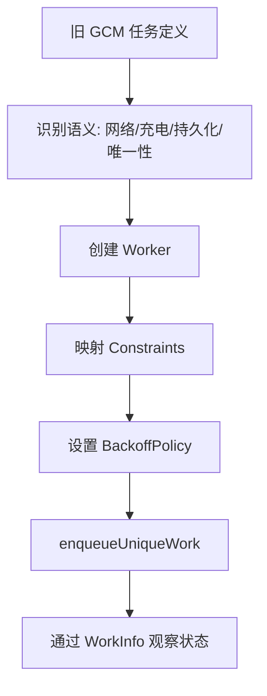
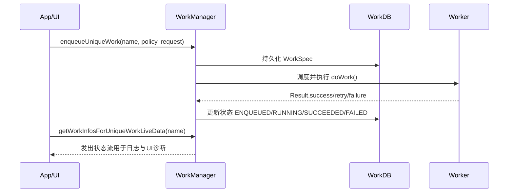
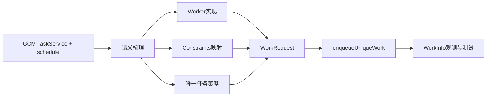

# 6.1.31 从 GCMNetworkManager 迁移到 WorkManager

夜灯已经调到最暗一档，帐篷顶布被风吹得微微起伏，像一口缓慢呼吸的钟。

洛芙本来已经把睡袋拉到肩膀，听见希尔轻轻“啊”了一声，又把脑袋探出来。

“怎么了？”

希尔把笔记本转过来，屏幕上是一段她们项目里古老得几乎泛黄的代码。

`GcmNetworkManager.getInstance(context)`。

“我们刚把 Firebase JobDispatcher 迁完，我以为最危险的坑已经过去了。”希尔抓了抓头发，“结果仓库里还有一条支线，用的是 GCMNetworkManager。”

伊莎把温热的杯子递给洛芙，杯沿碰到指尖，烫意把困意一点点推开。

“那就今晚一起拆掉它。”黛琳把白板摊在防潮垫上，笔尖在板面上轻轻一顿，“这章是同一类迁移，但陷阱不完全一样，尤其是网络约束默认值。”

洛芙眨了眨眼：“默认值也会坑人？”

“会，而且是最隐蔽的那种。”

黛琳把旧代码贴到白板旁边。

```kotlin
// 旧实现：GCMNetworkManager
val task = OneoffTask.Builder()
    .setService(LegacyGcmTaskService::class.java)
    .setTag("nightly_sync")
    .setExecutionWindow(0L, 60L)
    .setRequiredNetwork(Task.NETWORK_STATE_CONNECTED)
    .setRequiresCharging(true)
    .setPersisted(true)
    .setUpdateCurrent(true)
    .build()

GcmNetworkManager.getInstance(context).schedule(task)
```

“这段看起来没什么问题呀。”洛芙说。

“问题是，很多旧项目**没有写** `setRequiredNetwork(...)`。”黛琳在 `setRequiredNetwork` 这一行下面画了两道线，“因为 GCMNetworkManager 默认就要求网络连接。开发者写不写，这条默认都在。”

希尔接过话：“但 WorkManager 的默认网络约束是 `NetworkType.NOT_REQUIRED`。你如果照搬不补这行，任务会在离线状态也被执行，接着在业务代码里报网络异常，再触发重试风暴。”

洛芙打了个激灵，睡意彻底没了。

“也就是，同一份任务语义，在新旧框架里的默认起点不一样。”

“对。”黛琳点头，“迁移不是机械替换 API，第一步是对齐行为语义。”

她在白板上写下今晚的迁移顺序：

1) 依赖替换
2) Service → Worker
3) 约束映射（重点：网络默认）
4) Tag / 唯一任务策略
5) 调度 API 与可观察性
6) 测试验证

帐篷外一只夜鸟短促地叫了一声，风从拉链缝里钻进来，带着冷杉和潮土的气味。

希尔先开了 `build.gradle`。

```kotlin
// app/build.gradle.kts
plugins {
    id("com.android.application")
    kotlin("android")
}

dependencies {
    // 新增：WorkManager 主库
    implementation("androidx.work:work-runtime-ktx:2.9.0")

    // 可选：如果你需要在旧设备上借助 GCM 调度后端，可接入 gcm 适配库
    // implementation("androidx.work:work-gcm:2.9.0")

    // 删除旧依赖（示意）
    // implementation("com.google.android.gms:play-services-gcm:...")
}
```

“这里为什么说 `work-gcm` 是可选？”洛芙问。

黛琳用笔帽点了点屏幕：“官方迁移页强调的是迁到 WorkManager 客户端库。`work-runtime` 是核心。`work-gcm` 仅在某些旧环境需要特定调度后端时使用，不是每个项目都必加。”

“懂了，先以 `work-runtime` 为主，按兼容策略再决定要不要附加依赖。”

“正解。”

希尔又打开 `AndroidManifest.xml`。

```xml
<!-- 旧时代会声明 GcmTaskService -->
<service
    android:name=".LegacyGcmTaskService"
    android:permission="com.google.android.gms.permission.BIND_NETWORK_TASK_SERVICE"
    android:exported="true">
    <intent-filter>
        <action android:name="com.google.android.gms.gcm.ACTION_TASK_READY" />
    </intent-filter>
</service>
```

“这个要删吗？”洛芙问。

“迁移完成后，删。”希尔说，“Worker 不是四大组件，不需要在 Manifest 注册 Service。保留旧声明会让维护者误判系统还在走 GCM 路径。”

黛琳补了一句：“迁移过渡期可以并存，但要加明显注释和开关，避免双调度。”

她在白板上写下“反模式 #1：双系统并行且同业务无幂等保护”。

洛芙把这个词记下来：“幂等……就是同一个任务重复执行，结果要一致，对吧？”

“对。”

接着，她们开始写新的 Worker。

```kotlin
// 对应旧的 LegacyGcmTaskService
class NightlySyncWorker(
    appContext: Context,
    params: WorkerParameters
) : CoroutineWorker(appContext, params) {

    override suspend fun doWork(): Result {
        val start = System.currentTimeMillis()

        return try {
            // 读取输入参数
            val accountId = inputData.getString(KEY_ACCOUNT_ID) ?: return Result.failure()

            // 执行同步逻辑（示意）
            syncUseCase.run(accountId)

            // 输出结果，便于链式任务或调试观察
            val output = workDataOf(
                KEY_RESULT to "ok",
                KEY_DURATION_MS to (System.currentTimeMillis() - start)
            )
            Result.success(output)
        } catch (e: IOException) {
            // 网络抖动，允许重试
            Result.retry()
        } catch (e: Exception) {
            // 非可恢复错误，直接失败
            Result.failure()
        }
    }

    companion object {
        const val KEY_ACCOUNT_ID = "account_id"
        const val KEY_RESULT = "result"
        const val KEY_DURATION_MS = "duration_ms"
    }
}
```

洛芙盯着 `Result.retry()` 看了一会儿：“以前 GCM 的 `onRunTask()` 返回值是 `RESULT_RESCHEDULE`，现在变成 `Result.retry()`，语义清楚很多。”

“而且重试上限、退避间隔都能在请求层统一控制。”希尔说。

她敲下新的请求构建代码。

```kotlin
fun enqueueNightlySync(context: Context, accountId: String) {
    // 图1 对应代码片段 A（行 1-38）：约束与重试策略
    val constraints = Constraints.Builder()
        // 关键：显式补回网络要求，避免与旧 GCM 语义偏差
        .setRequiredNetworkType(NetworkType.CONNECTED)
        .setRequiresCharging(true)
        .build()

    val input = workDataOf(NightlySyncWorker.KEY_ACCOUNT_ID to accountId)

    val request = OneTimeWorkRequestBuilder<NightlySyncWorker>()
        .setInputData(input)
        .setConstraints(constraints)
        .setBackoffCriteria(
            BackoffPolicy.EXPONENTIAL,
            30,
            TimeUnit.SECONDS
        )
        .addTag("nightly_sync")
        .build()

    // GCM 的 setUpdateCurrent(true) 可迁移为唯一任务替换策略
    WorkManager.getInstance(context).enqueueUniqueWork(
        "nightly_sync_unique",
        ExistingWorkPolicy.REPLACE,
        request
    )
}
```

“`setUpdateCurrent(true)` 对应 `enqueueUniqueWork + REPLACE`，这个很好记。”洛芙说。

黛琳把白板转向她们，画出第一张流程图。



“这就是迁移主线。图 1 对应你刚才那段 `enqueueNightlySync()` 的完整代码。”黛琳说，“每个节点都要落在具体 API 上，不能只停留在概念层。”

伊莎把毯子往洛芙腿上拽了拽，轻声说：“你可以把它理解成‘先校准任务语义，再替换执行引擎’。不是先换引擎再祈祷语义不变。”

洛芙笑了一下：“这句我想贴进团队 wiki。”

接下来是最硬的一段：约束映射表。

希尔把官方迁移页里的关键点整理成对照。

```text
GCMNetworkManager 约束                     WorkManager 对应
-------------------------------------------------------------------
setRequiredNetwork(Task.NETWORK_STATE_CONNECTED)
                                            setRequiredNetworkType(NetworkType.CONNECTED)
setRequiredNetwork(Task.NETWORK_STATE_UNMETERED)
                                            setRequiredNetworkType(NetworkType.UNMETERED)
setRequiresCharging(true)                   setRequiresCharging(true)
setRequiresDeviceIdle(true)                 setRequiresDeviceIdle(true) (API 23+)
默认需要网络（若未显式设置）               默认 NOT_REQUIRED（必须手动补齐）
```

“这张表里最重要的一行是哪行？”黛琳问。

“最后一行。”洛芙几乎秒答。

“对。”

希尔顺势给了一个坏味道示例。

```kotlin
// 反模式：以为不写网络约束也会像 GCM 一样默认联网
val badRequest = OneTimeWorkRequestBuilder<NightlySyncWorker>()
    .setRequiresCharging(true) // 伪代码：实际上应放在 Constraints 里
    .build()

WorkManager.getInstance(context).enqueue(badRequest)
```

“这段还顺手犯了第二个错误：把 `setRequiresCharging` 写在 request builder 上。”希尔摇头，“真正可编译的写法必须放进 `Constraints.Builder`。很多迁移 PR 会同时出现这两个问题。”

她马上贴出重构版。

```kotlin
// 重构后：语义清晰、可编译、可维护
val constraints = Constraints.Builder()
    .setRequiredNetworkType(NetworkType.CONNECTED)
    .setRequiresCharging(true)
    .build()

val goodRequest = OneTimeWorkRequestBuilder<NightlySyncWorker>()
    .setConstraints(constraints)
    .addTag("nightly_sync")
    .build()

WorkManager.getInstance(context).enqueue(goodRequest)
```

“现在这段就能直接过编译，也不会在离线时误跑网络任务。”

洛芙一边抄一边问：“那 GCM 的 `setExecutionWindow(start, end)` 怎么办？WorkManager 没有窗口参数吧？”

黛琳点头：“这是迁移中必须接受的模型差异。WorkManager 不是精确调度器。你可以用 `setInitialDelay()` 和约束组合表达‘不早于某时且满足条件尽快执行’，但不是逐毫秒对齐窗口。”

“如果业务真的需要准点？”

“用 `AlarmManager` + 精确闹钟权限策略，或者重新审视需求。”

伊莎在旁边补了一句：“很多所谓‘必须准点’，最后都被证明是‘必须可靠完成’。这两句话不是同一件事。”

洛芙沉默两秒，点了点头。

希尔继续补全周期任务的迁移。

```kotlin
fun enqueuePeriodicHeartbeat(context: Context) {
    val constraints = Constraints.Builder()
        .setRequiredNetworkType(NetworkType.CONNECTED)
        .build()

    val periodic = PeriodicWorkRequestBuilder<HeartbeatWorker>(15, TimeUnit.MINUTES)
        .setConstraints(constraints)
        .addTag("heartbeat")
        .build()

    WorkManager.getInstance(context).enqueueUniquePeriodicWork(
        "heartbeat_unique",
        ExistingPeriodicWorkPolicy.UPDATE,
        periodic
    )
}
```

“这里 `UPDATE` 的语义很像 GCM 里更新同 tag 任务？”洛芙问。

“可以这么理解。”黛琳说，“但你要记得：WorkManager 把‘唯一性’从 tag 提升到了明确的 UniqueWorkName 概念，团队协作时更清晰。”

她画出第二张图，专门讲状态观察和调试链路。



“图 2 对应代码片段 B（下面这段监控代码）。”黛琳说。

```kotlin
fun observeNightlySync(owner: LifecycleOwner, context: Context) {
    WorkManager.getInstance(context)
        .getWorkInfosForUniqueWorkLiveData("nightly_sync_unique")
        .observe(owner) { infos ->
            infos.forEach { info ->
                Log.d(
                    "WM-MIGRATION",
                    "id=${info.id}, state=${info.state}, attempt=${info.runAttemptCount}, output=${info.outputData}"
                )
            }
        }
}
```

洛芙看着 log 标签，突然想起一件事：“我们不是还要做测试吗？不然迁移结果只是‘看起来对’。”

“正解。”希尔立刻打开测试文件。

```kotlin
// 依赖: androidx.work:work-testing
// 运行方式: ./gradlew testDebugUnitTest
@RunWith(AndroidJUnit4::class)
class NightlySyncWorkerTest {

    @Test
    fun worker_should_retry_when_io_exception() {
        val context = ApplicationProvider.getApplicationContext<Context>()

        val input = workDataOf(NightlySyncWorker.KEY_ACCOUNT_ID to "A-1001")

        val worker = TestListenableWorkerBuilder<NightlySyncWorker>(context)
            .setInputData(input)
            .build()

        // 这里假设 syncUseCase 被 fake 为抛 IOException
        val result = runBlocking { worker.doWork() }

        assertThat(result).isEqualTo(ListenableWorker.Result.retry())
    }
}
```

“再给你看一段运行输出。”希尔按下回车，终端里跳出日志。

```text
D/WM-MIGRATION: id=2f9..., state=ENQUEUED, attempt=0, output=Data {}
D/WM-MIGRATION: id=2f9..., state=RUNNING, attempt=0, output=Data {}
D/WM-MIGRATION: id=2f9..., state=ENQUEUED, attempt=1, output=Data {}
D/WM-MIGRATION: id=2f9..., state=RUNNING, attempt=1, output=Data {}
D/WM-MIGRATION: id=2f9..., state=SUCCEEDED, attempt=1, output=Data {result : ok, duration_ms : 842}
```

洛芙盯着那行 `attempt=1`，慢慢呼出一口气。

“它真的按指数退避重试了，然后成功落地。”

“这就是可观察性。”黛琳说，“迁移不是把旧类名替换成新类名，而是要让行为可证据化。”

希尔把最后一段“迁移清理清单”贴出来。

```text
[迁移后必须清理]
1. 删除 GcmTaskService 与 ACTION_TASK_READY 的 Manifest 声明
2. 删除 play-services-gcm 旧依赖
3. 检查所有旧 tag 是否映射为 UniqueWorkName + Tag
4. 补齐网络约束，避免默认值偏差
5. 接入 WorkInfo 监控日志与测试用例
```

伊莎把杯子放回小折叠桌，轻轻碰出一声脆响。

“今天你们讲得像在修一座桥。”她说，“桥两端都叫‘后台任务’，但河水流速和地基硬度不一样。桥能不能过人，看的是结构，不是名字。”

洛芙合上电脑，靠在背包上，听见风从松林上方掠过去，声音比刚才更轻。

“我以前会觉得迁移就是体力活。”她低声说，“今晚才发现，它其实是一次‘语义校准’。”

黛琳笑了笑，拿起记号笔在白板角落写下最后一句。

**先定义行为，再选择框架。**

帐篷外的虫鸣像细密的针脚，把夜色缝得很稳。

她们把灯又调暗了一格。

---
## 专业技术总结

> **GCMNetworkManager Migration（从 GCMNetworkManager 迁移到 WorkManager）**：将基于 Google Play Services 的旧网络任务调度实现，迁移为 Jetpack WorkManager 的持久化后台任务体系。核心不在“类名替换”，而在“任务语义对齐”：尤其要显式补齐网络约束、映射重试策略、重建唯一任务策略，并通过 WorkInfo 建立可观察的验证闭环。

#### 结构图（必须）



图示表达迁移链路：先识别旧任务语义，再在 Worker/Constraints/Policy 三个层次重建，最后用可观察性验证。

#### 复杂度与影响

- 代码复杂度：短期上升（需要补测试与监控），长期下降（调度统一）。
- 稳定性：显著提升，WorkManager 任务持久化并可跨进程重建。
- 维护成本：降低，后台任务入口统一到 Worker 与 WorkRequest。

#### 反模式与陷阱（≥3 条）

1. **遗漏网络约束映射**：GCM 默认要网络，WorkManager 默认不需要。修复：显式 `setRequiredNetworkType(...)`。
2. **保留旧 Service 声明**：导致团队误判还在走 GCM。修复：迁移完成后删除 Manifest 中旧声明。
3. **仅用 tag 管理唯一任务**：并发场景易重复。修复：使用 `enqueueUniqueWork` + 合适 `ExistingWorkPolicy`。
4. **无监控直接上线**：行为差异不可见。修复：接入 WorkInfo 观察日志与单元测试。
5. **把精确窗口需求硬塞给 WorkManager**：语义不匹配。修复：区分“可靠完成”和“精确时刻”。

#### 名词小传

- **GCMNetworkManager**：Google Play Services 时代的任务调度 API，常见于旧项目。
- **WorkManager**：Jetpack 官方推荐的持久化后台任务框架，统一封装底层调度能力。

#### 设计哲学：语义优先的迁移

1. 先写“任务契约”（何时跑、失败怎么重试、是否唯一），再写 API。
2. 默认值不可信，迁移时必须逐项显式化关键约束。
3. 唯一任务名是协作契约，tag 是检索维度，二者不要混用。
4. 迁移验收以“可观察证据”为准，不以“代码能编译”为准。
5. 迁移完成后要删旧路径，避免系统长期双轨。

---
#### 🏕️ 动手练习

项目概览：把一个“旧版夜间同步模块（GCM）”迁移为“WorkManager 版本”，并完成行为一致性验证。

**Task 1（★）建立迁移分支与依赖替换**
- 目标：完成基础工程切换。
- 你需要做的事：
  1. 新建分支 `feature/migrate-gcm-to-wm`。
  2. 移除 `play-services-gcm` 依赖。
  3. 添加 `work-runtime-ktx` 与 `work-testing`。
- 验收标准：
  - [ ] 工程可编译。
  - [ ] 依赖树中无 `play-services-gcm`。
- 提示：
```kotlin
implementation("androidx.work:work-runtime-ktx:2.9.0")
testImplementation("androidx.work:work-testing:2.9.0")
```

**Task 2（★★）实现 Worker 与输入输出协议**
- 目标：把旧 `TaskService` 迁移为 `CoroutineWorker`。
- 你需要做的事：
  1. 新建 `NightlySyncWorker`。
  2. 读取 `inputData` 的 accountId。
  3. 返回包含耗时的 `outputData`。
- 验收标准：
  - [ ] doWork 可返回 success/retry/failure。
  - [ ] 输出数据包含 `duration_ms`。
- 提示：
```kotlin
val output = workDataOf("duration_ms" to duration)
return Result.success(output)
```

**Task 3（★★）完成约束映射**
- 目标：保证与旧 GCM 语义一致。
- 你需要做的事：
  1. 将旧网络约束映射到 `NetworkType`。
  2. 加入充电约束。
  3. 验证离线时任务不运行。
- 验收标准：
  - [ ] 断网条件下状态停留在 ENQUEUED。
  - [ ] 联网后进入 RUNNING。
- 提示：
```kotlin
Constraints.Builder()
  .setRequiredNetworkType(NetworkType.CONNECTED)
  .setRequiresCharging(true)
```

**Task 4（★★★）迁移唯一任务更新策略**
- 目标：替代 `setUpdateCurrent(true)`。
- 你需要做的事：
  1. 使用 `enqueueUniqueWork`。
  2. 对比 `REPLACE` 与 `KEEP` 行为。
- 验收标准：
  - [ ] 重复触发时仅保留一条逻辑任务。
  - [ ] 能解释两种策略差异。
- 提示：
```kotlin
enqueueUniqueWork("nightly_sync_unique", ExistingWorkPolicy.REPLACE, request)
```

**Task 5（★★★）补齐退避重试策略**
- 目标：在可恢复错误下稳定重试。
- 你需要做的事：
  1. 设置指数退避 30 秒起步。
  2. 在 IOException 时返回 retry。
- 验收标准：
  - [ ] 日志中出现 `attempt=1` 及以上。
  - [ ] 最终成功或失败可解释。
- 提示：
```kotlin
.setBackoffCriteria(BackoffPolicy.EXPONENTIAL, 30, TimeUnit.SECONDS)
```

**Task 6（★★★★）建立状态观测面板**
- 目标：可视化任务生命周期。
- 你需要做的事：
  1. 订阅 `getWorkInfosForUniqueWorkLiveData`。
  2. 在 UI 或日志输出 state、attempt、output。
- 验收标准：
  - [ ] 能看到 ENQUEUED → RUNNING → SUCCEEDED/FAILED。
  - [ ] 输出数据可追踪。
- 提示：
```kotlin
info.state
info.runAttemptCount
info.outputData
```

**Task 7（★★★★）编写迁移回归测试**
- 目标：证明关键行为没有回退。
- 你需要做的事：
  1. 用 `TestListenableWorkerBuilder` 构建 worker。
  2. 分别覆盖 success/retry/failure 分支。
- 验收标准：
  - [ ] 至少 3 个测试通过。
  - [ ] CI 可自动执行。
- 提示：
```kotlin
val worker = TestListenableWorkerBuilder<NightlySyncWorker>(context).build()
```

**Task 8（★★★★★）迁移收尾清理**
- 目标：删除所有旧路径，避免双轨。
- 你需要做的事：
  1. 删除 Manifest 旧 Service。
  2. 删除旧 GCM 调度入口。
  3. 更新团队文档与排障手册。
- 验收标准：
  - [ ] 代码库无 `GcmNetworkManager` 关键字。
  - [ ] 文档记录新任务名、策略、监控方式。
- 提示：
```bash
rg "GcmNetworkManager|ACTION_TASK_READY|BIND_NETWORK_TASK_SERVICE" app/
```

**面试热身（Q1-Q5）**
1. 为什么 GCM 到 WorkManager 的迁移最容易在“默认网络约束”上出错？
2. `tag` 与 `UniqueWorkName` 的职责边界是什么？
3. `Result.retry()` 与 `BackoffPolicy` 分别负责哪一层语义？
4. 什么情况下 WorkManager 不适合，应该考虑其他调度工具？
5. 你会如何设计迁移验收指标，避免“上线后才发现行为偏差”？

#### 参考实现要点（5 条）

1. 所有关键约束都显式声明，不依赖默认值。
2. 统一使用 `enqueueUniqueWork/PeriodicWork` 管理幂等。
3. Worker 内只保留业务编排，复杂逻辑下沉 UseCase/Repository。
4. 以 WorkInfo + 日志 + 测试形成三层验证闭环。
5. 迁移完成必须清理旧依赖、旧组件声明、旧调度入口。

---
> 学习建议：先手工迁移一个最小任务（只有网络约束和重试），把“行为一致性检查表”跑通，再批量迁移其他任务。每迁一条就做一次状态观测和回归测试，不要等全部改完再验证。

## 🍹洛芙的小小日记本

今晚最重要的收获不是“会写 Worker”了，而是学会先写任务契约：它何时运行、失败如何重试、如何避免重复。原来迁移真正考验的是思考顺序，而不只是敲代码速度。

## 今日关键词

- **GCMNetworkManager**：Google Play Services 时代的后台任务调度 API，常见于旧 Android 项目。
- **WorkManager**：Jetpack 官方后台任务框架，适合需要可靠执行和持久化的任务。
- **Worker / CoroutineWorker**：WorkManager 中执行任务的类；`CoroutineWorker` 适合协程代码。
- **Constraints**：任务运行前必须满足的条件，比如联网、充电、空闲。
- **NetworkType.CONNECTED**：要求设备已连接网络后才执行任务。
- **NetworkType.UNMETERED**：要求非计费网络（通常是 Wi‑Fi）。
- **BackoffPolicy**：重试退避策略，控制失败后下一次尝试的等待方式。
- **EXPONENTIAL backoff**：指数退避，重试间隔逐步变长，能减少系统压力。
- **OneTimeWorkRequest**：一次性任务请求，执行完成后结束。
- **PeriodicWorkRequest**：周期任务请求，按系统允许的节奏重复执行。
- **enqueueUniqueWork**：以唯一名字入队，避免同类任务重复堆积。
- **ExistingWorkPolicy.REPLACE**：若已存在同名任务，用新任务替换旧任务。
- **ExistingPeriodicWorkPolicy.UPDATE**：更新已有周期任务定义而不新增重复任务。
- **WorkInfo**：任务状态对象，可查看 state、尝试次数、输出数据等。
- **runAttemptCount**：当前任务已经尝试执行的次数。
- **inputData / outputData**：Worker 输入输出数据容器，用于任务参数和结果传递。
- **Manifest Service 声明清理**：迁移后删除旧 `GcmTaskService` 声明，避免误导和双轨执行。
- **幂等（Idempotency）**：重复执行同一任务不会产生额外错误副作用，是后台任务设计核心。
- **可观察性（Observability）**：通过日志、状态流、测试证据持续确认任务行为是否符合预期。
- **迁移语义对齐**：迁移时先确保“行为一致”再替换 API，防止隐性回归。