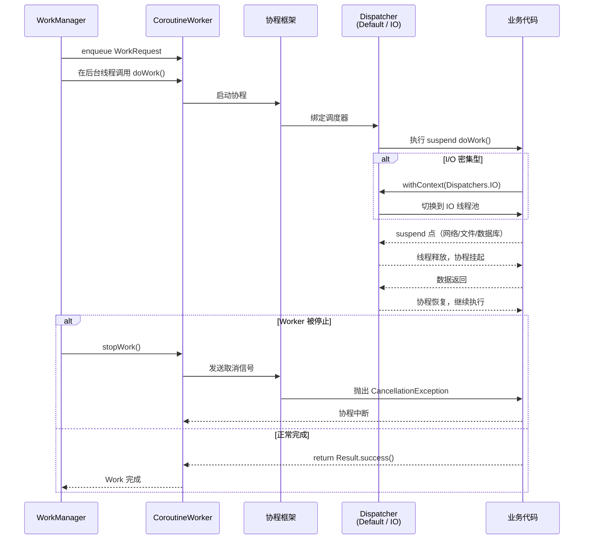
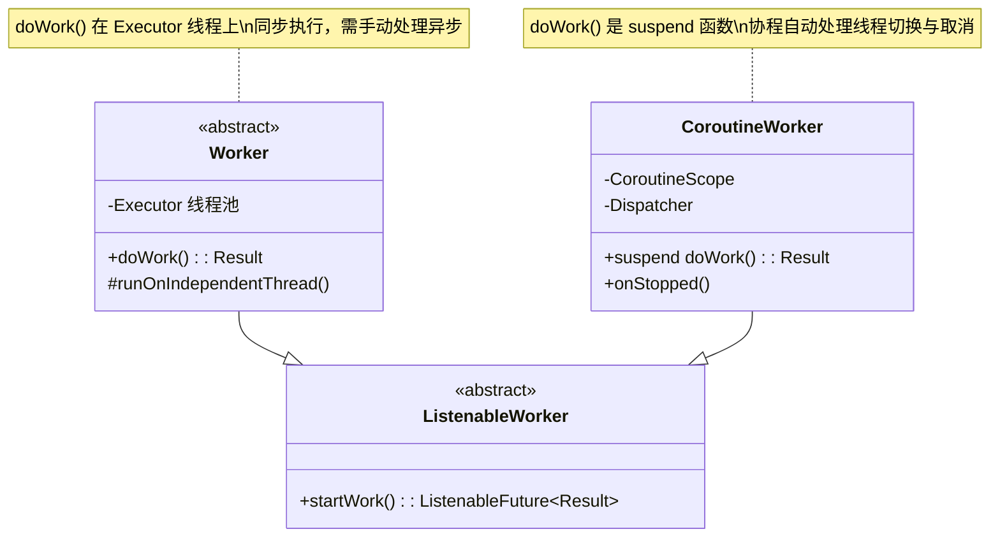

# 6.1.32 CoroutineWorker 中的线程

帐篷外的虫鸣声渐渐稀疏了。

不知什么时候，洛芙从希尔肩膀旁边探出的脑袋已经整个靠了上去，眼皮开始打架。露营灯的橙黄色光芒把屏幕上的代码染成一片暖色，帐篷帆布上的四个影子重叠在一起，像一幅正在呼吸的剪纸画。

"困了就睡吧。"伊莎轻声说，她正用手指绕着一根细细的松针，声音像被夜风滤过一样柔软。

"唔……再等一下……"洛芙揉了揉眼睛，"我想看看这个 Worker 怎么用协程……"

"好好好，那我就讲完这最后一点。"希尔把笔记本往自己膝盖上转了转，让洛芙能看得更清楚，"我们刚才说了，用普通的 Worker 的时候，doWork() 是在后台线程池里执行的，你需要自己用 Executor 或者 Handler 来处理异步逻辑。"

黛琳正抱着膝盖坐在睡袋边上，下巴搁在膝盖上，目光落在希尔的屏幕上。

"但是 CoroutineWorker 不一样。"希尔敲了敲屏幕，"它是 WorkManager 专门为 Kotlin 协程准备的 API。doWork() 不再是普通的返回 Result 的方法了——它是一个 **suspend 函数**。"

"suspend……"洛芙的脑子已经有点糊了，但这个词还是让她本能地重复了一遍。

"挂起函数。"黛琳轻声补充，像是在帮希尔做注解，"意思是说，这个函数可以在执行到一半的时候'停下来'，让出线程去干别的事情，等条件准备好了再'醒过来'继续。"

希尔点头："对，就跟……嗯……就好比我们营地有个守夜人，他的工作是看着篝火不让它灭掉。但守夜人不是一直拿着火钳盯着火看的——他会坐下来，靠着树干打盹，但是耳朵一直竖着听着风声。一旦风声变了（这相当于协程的 resume），他就醒过来去添柴。"

"这样的话守夜人就不会累了。"洛芙说。

"对，线程也是一样的道理。"希尔笑着说，"一个后台线程如果被挂起，它就可以去服务别的请求了，不会卡在那里空等。"

帐篷外吹过一阵风，帐篷壁轻轻晃动了一下。

"所以 CoroutineWorker 的 doWork() 里面，你直接写普通的顺序代码就行。"希尔开始敲代码，"不需要什么 Executor，不需要什么 Handler。协程会帮你把代码'拆开'，在需要等待的时候自动切走，在准备好的时候自动切回来。"

她的手指在键盘上跳动，屏幕上出现了这样一段代码：

```kotlin
// 依赖：androidx.work.work-runtime-ktx
// build.gradle: implementation "androidx.work:work-runtime-ktx:$workVersion"

class MyCoroutineWorker(
    ctx: Context,
    params: WorkerParameters
) : CoroutineWorker(ctx, ctx, params) {

    override suspend fun doWork(): Result {
        // 这里可以直接写顺序代码，协程会帮你处理异步切换
        val data = fetchDataFromNetwork()   // 挂起点：网络请求
        processData(data)                    // 处理数据
        return Result.success()
    }
}
```

"看到了吗？"希尔指着代码，"fetchDataFromNetwork() 如果是个 suspend 函数，那么在它等待网络响应的时候，整个 doWork() 会自动挂起，后台线程就被释放了，可以去干别的。等网络数据回来了，协程又会在某个线程上自动 resume，继续执行下一行。"

洛芙盯着这段代码看了一会儿。

"可是这样的话，线程是在哪个 Dispatcher 上跑的呢？"她问。

"好问题。"希尔竖起一根手指，"默认情况下，CoroutineWorker 使用的是 **Dispatchers.Default**。这是一个适合 **CPU 密集型任务** 的调度器，线程数等于设备的可用核心数，最少两个。"

她停顿了一下，看了看帐篷外被月光照亮的山棱线。

"但是，如果你的 doWork() 主要是跟网络、文件、数据库打交道——也就是 **I/O 密集型任务**——那你最好自己切换到 **Dispatchers.IO**。"

"这怎么弄？"

"很简单，一行代码。"

```kotlin
class MyCoroutineWorker(
    ctx: Context,
    params: WorkerParameters
) : CoroutineWorker(ctx, ctx, params) {

    override suspend fun doWork(): Result {
        // 明确指定在 Dispatchers.IO 上运行
        return withContext(Dispatchers.IO) {
            val data = fetchDataFromNetwork()  // 网络请求
            saveToDatabase(data)               // 数据库写入
            Result.success()
        }
    }
}
```

"withContext(Dispatchers.IO) 告诉协程：接下来的代码请切换到 I/O 线程池去执行。"希尔解释道，"IO 线程池的大小是动态的，可以到 64 个线程，足够应付大量并发 I/O 操作。"

"Dispatchers.Default 和 Dispatchers.IO 的区别是什么？"洛芙问。

"一个形象的比喻。"伊莎开口了，她的声音带着一点梦夜的轻柔，"Dispatcher.Default 就像是露营地的中央厨房——只有几个厨师，但他们都很能干，适合做需要动脑筋的菜（CPU 密集型）。Dispatcher.IO 就像是营地外面的外卖配送站，有很多很多骑手，他们不适合做复杂的事情，但很适合跑来跑去取东西、送东西（I/O 密集型）。"

希尔点头："没错。做饭这种复杂活儿不能交给太多人，但取外卖这种跑腿的事儿，人越多越好。"

"那如果我用了 CoroutineWorker，但 App 被系统切到后台、甚至被回收了怎么办？"洛芙又问，"协程会不会就丢掉了？"

"这就是 CoroutineWorker 的另一个贴心设计了。"希尔把笔记本放下，认真地看着洛芙，"**它会自动处理 Worker 的停止和取消**。"

帐篷里安静了一秒。

"当 WorkManager 决定停止这个 Worker 的时候——比如用户离开页面了，或者系统内存紧张了——CoroutineWorker 会自动给执行中的协程发送一个取消信号。协程收到信号后，会自动中断执行，抛出 `CancellationException`。你不需要自己写任何取消逻辑，协程会帮你做好。"

希尔在白板（其实是她的膝盖上摊开的一张 A4 纸）上画了一个简单的图：

```mermaid
flowchart TD
    A[WorkManager 决定停止 Worker] --> B[CoroutineWorker 收到停止信号]
    B --> C[协程被取消<br/>抛出 CancellationException]
    C --> D[doWork() 中的代码<br/>通过协程的取消检查点自动中断]
    D --> E[Result 被忽略<br/>清理工作可以写在 onStopped 中]
```

"这里有个重要的规则。"希尔认真地说，"协程的取消不是强制中断，而是**协作式**的。代码需要定期检查自己有没有被取消。"

"怎么检查？"

"一般来说，`withContext`、`delay`、`suspendCancellableCoroutine` 这些函数都会自动支持取消检查。但如果你写的是纯 CPU 计算，没有任何挂起点，你需要自己加一个检查："

```kotlin
override suspend fun doWork(): Result {
    return withContext(Dispatchers.Default) {
        // 长时间 CPU 计算
        for (i in 0 until 1000000) {
            // 每 1000 次迭代检查一次是否被取消
            if (i % 1000 == 0) {
                yield()  // 主动让出 CPU，并检查取消状态
            }
            doSomeHeavyWork(i)
        }
        Result.success()
    }
}
```

"yield() 会检查当前协程是否被取消，如果是就抛出 CancellationException 终止执行。"希尔说，"这个函数名也很有意思——字面意思就是'让位'，就像守夜人把火钳放下，让给别人看一眼，然后再拿回来。"

帐篷外的风又吹过来了，这次带着一点松针的清苦香味。

"那如果 CoroutineWorker 抛出了异常呢？"洛芙问。

"如果是除 CancellationException 之外的其他异常，WorkManager 会认为这次工作失败了。"希尔回答，"你可以在 doWork() 里用 try-catch 来捕获异常，然后返回 Result.failure()；如果你不捕获，WorkManager 会根据重试策略来决定要不要重新执行。"

"重试策略是什么？"

"默认情况下，CoroutineWorker 跟普通 Worker 一样，如果 doWork() 返回 Result.failure()，WorkManager 会在指数退避的时间间隔内重试——第一次等 10 秒，第二次等 20 秒，第三次等 40 秒，以此类推，最多重试 24 小时。"

"不过你也可以自己指定重试策略。"希尔补充道，"用 BackoffPolicy 和 setBackoffCriteria 就可以。"

"这个跟昨天我们讲的是一样的吗？"洛芙问。

"对，Worker 的重试机制 CoroutineWorker 也完全继承。"黛琳说，"只是协程版本的取消处理更自然。"

"那还有没有别的用法？"洛芙的好奇心上来了。

"有一个进阶话题——**在不同进程中运行 CoroutineWorker**。"希尔说，"这个比较高级，我先说一下思路，不写代码了。"

"当你的 App 有多个进程的时候（比如一个主进程、一个缓存进程），你可以让 Worker 在特定的进程中运行。方法是实现一个 RemoteWorkerService，然后在 build WorkRequest 的时候通过 setExpedited() 和 ProcessInfo 来指定进程 ID。"

"这样的话，不同进程之间的数据交换就要通过 Messenger 或者 AIDL 了。"黛琳补充。

"嗯，但这个在我们现在的 App 里用不到，先知道有这么个东西就行了。"希尔合上笔记本，伸了个懒腰，"好了，今晚 CoroutineWorker 就到这里。你现在知道：CoroutineWorker 用的是协程挂起模型，默认在 Default 调度器上运行，I/O 操作要用 withContext(Dispatchers.IO)；WorkManager 停止 Worker 时协程会自动被取消；异常会触发重试策略；还可以跨进程运行。"

帐篷的露营灯闪了闪，像是在说晚安。

"我去把灯关小一点。"伊莎轻声站起来，走向帐篷角落的灯。

帐篷里的四个人影慢慢缩小、模糊，最终只剩下一盏调到最暗的露营灯，把一小块帆布染成琥珀色。

远处的山棱线依然沉默地横亘在天幕之下，银河已经偏西，但依然璀璨。

"洛芙，别睡着了，行李还没收呢。"黛琳的声音很轻，像在说梦话。

"唔……等一下……"洛芙迷迷糊糊地回答，"yield()……检查取消……"

然后帐篷里响起了轻轻的笑声，是希尔和伊莎的。

帐篷外的虫鸣已经完全停了，只剩下远处某处传来的一两声夜鸟啼鸣，和帐篷里四个人的呼吸声，一起融入了白马村秋夜的寂静之中。

---

## 专业技术总结

> CoroutineWorker — WorkManager 为 Kotlin 协程专门设计的 Worker 实现类。其 `doWork()` 是一个 **suspend 函数**，在默认调度器（Dispatchers.Default）上运行，会在 WorkManager 停止 Worker 时自动被协程框架取消。协程的挂起-恢复机制替代了传统的线程阻塞写法，开发者只需在 I/O 密集型代码块外包一层 `withContext(Dispatchers.IO)` 即可。

#### 结构图

**CoroutineWorker 执行流程图：**



**CoroutineWorker vs Worker 线程模型对比：**



#### 复杂度与影响

| 维度 | 普通 Worker | CoroutineWorker |
|------|------------|----------------|
| 线程模型 | 固定 Executor 线程，阻塞等待 | 协程挂起-恢复，线程按需释放 |
| I/O 并发能力 | 受限于 Executor 线程数 | Dispatchers.IO 可扩展至 64 线程 |
| 取消延迟 | 取决于代码检查频率 | 协程取消检查点自动插入 |
| 代码复杂度 | 需配合 Executor/Handler | 顺序代码即可，写法简洁 |

#### 反模式与陷阱

1. **在 doWork() 中执行 CPU 密集型任务却使用默认调度器**  
   修复：`withContext(Dispatchers.Default)` 显式指定，或在 CPU 密集代码块中定期调用 `yield()` 检查取消。

2. **在 CoroutineWorker 中直接开新协程（用 GlobalScope）**  
   修复：使用 CoroutineWorker 提供的协程作用域，或显式指定 `withContext(scope.coroutineContext + Dispatchers.IO)`，不要脱离 Worker 生命周期。

3. **忽略 onStopped() 中的清理逻辑**  
   修复：协程取消后，若有资源（数据库连接、文件句柄）需要释放，在 `onStopped()` 回调中处理。

4. **在 suspend doWork() 中使用 `runBlocking`**  
   修复：永远不要在协程上下文中使用 `runBlocking`，会导致死锁。使用 `suspend` 函数和协程工具链。

5. **错误地在 doWork() 返回后继续访问协程作用域中的资源**  
   修复：一旦 `doWork()` 返回 Result，Worker 即认为任务完成，协程会被取消，此时访问资源（如关闭中的数据库连接）会产生异常。

#### 设计哲学

**协程驱动的工作单元化（Coroutine-driven Work Isolation）**

1. **工作即协程**：每个 CoroutineWorker 实例对应一个协程作用域，工作单元的完整生命周期由协程的启动、挂起、恢复、取消来驱动。

2. **线程资源按需分配**：Dispatcher 不是固定分配，而是根据任务类型（CPU vs I/O）动态绑定，I/O 操作不占用宝贵的 CPU 线程资源。

3. **生命周期即取消信号**：WorkManager 的生命周期管理（App 后台、内存压力、用户取消）直接映射为协程的取消信号，开发者无需额外监听生命周期。

4. **故障即重试**：协程中的未捕获异常由 WorkManager 的重试策略兜底，形成"协程崩溃 → Worker 失败 → 指数退避重试"的鲁棒容错链。

5. **进程解耦**：通过 RemoteWorkerService 绑定特定进程，使 CoroutineWorker 可以作为跨进程通信的桥梁，适合多进程架构的 App。

6. **显式优于隐式**：默认使用 Dispatchers.Default，需要 I/O 时必须显式 `withContext(Dispatchers.IO)`，避免 I/O 操作污染 CPU 线程池。

#### 🏕️ 动手练习

**项目概览：**  
实现一个图片下载 Worker，使用 CoroutineWorker 完成以下功能：从网络 URL 下载图片并保存到本地文件，同时支持 Worker 停止时的优雅取消。

**方式 A：项目制（Task 1 - Task 8）**

---

**Task 1：创建 CoroutineWorker 项目骨架**

目标：掌握 CoroutineWorker 的基本用法，理解 `doWork()` 作为 suspend 函数的特性。

你需要做的事：
1. 在 Android Studio 中创建新项目（Empty Activity，Kotlin）。
2. 在 `app/build.gradle` 中添加依赖：
   ```kotlin
   // WorkManager Kotlin 扩展
   implementation "androidx.work:work-runtime-ktx:2.9.0"
   ```
3. 创建 `CoroutineWorker` 子类，复写 `suspend fun doWork()`：
   ```kotlin
   class DownloadWorker(
       context: Context,
       params: WorkerParameters
   ) : CoroutineWorker(context, params) {
       override suspend fun doWork(): Result {
           // 占位：打印日志
           println("DownloadWorker 开始执行，workerId=${id}")
           return Result.success()
       }
   }
   ```
4. 在 MainActivity 中通过 WorkManager 触发这个 Worker：
   ```kotlin
   val workRequest = OneTimeWorkRequestBuilder<DownloadWorker>().build()
   WorkManager.getInstance(this).enqueue(workRequest)
   ```
5. 运行 App，观察 Logcat 中 "DownloadWorker 开始执行" 的输出。

验收标准：
- [ ] Worker 成功入队并执行
- [ ] Logcat 能看到 worker 的 id
- [ ] Worker 执行完成后状态变为 SUCCEEDED（可在 WorkManager UI 查看）

提示：
```kotlin
// CoroutineWorker 的 id 可以通过 workInfo 来获取
WorkManager.getInstance(this)
    .getWorkInfoByIdLiveData(workRequest.id)
    .observe(this) { workInfo ->
        Log.d("MainActivity", "状态: ${workInfo?.state}")
    }
```

---

**Task 2：使用 Dispatchers.IO 处理网络下载**

目标：掌握在 CoroutineWorker 中使用 `withContext(Dispatchers.IO)` 处理网络请求。

你需要做的事：
1. 在 `AndroidManifest.xml` 添加网络权限：
   ```xml
   <uses-permission android:name="android.permission.INTERNET"/>
   ```
2. 在 DownloadWorker 的 `doWork()` 中，使用 `withContext(Dispatchers.IO)` 包裹 URL.openStream() 代码：
   ```kotlin
   override suspend fun doWork(): Result {
       val url = inputData.getString(KEY_IMAGE_URL) ?: return Result.failure()
       
       return withContext(Dispatchers.IO) {
           // 在 IO 线程池中执行网络请求
           val connection = URL(url).openConnection() as HttpURLConnection
           connection.connectTimeout = 10_000
           connection.readTimeout = 10_000
           connection.connect()
           
           val inputStream = connection.inputStream
           // 保存到文件（下一 Task 内容，这里先打印大小）
           val bytes = inputStream.readBytes()
           Log.d("DownloadWorker", "下载了 ${bytes.size} 字节")
           Result.success()
       }
   }
   ```
3. 在创建 WorkRequest 时传入 URL 作为 InputData：
   ```kotlin
   val inputData = workDataOf(KEY_IMAGE_URL to "https://example.com/image.jpg")
   val workRequest = OneTimeWorkRequestBuilder<DownloadWorker>()
       .setInputData(inputData)
       .build()
   ```
4. 运行并验证网络请求在 IO 线程执行（主线程不会被阻塞）。

验收标准：
- [ ] UI 在下载期间保持响应（主线程未阻塞）
- [ ] Logcat 显示下载字节数
- [ ] 使用 profiler 或调试工具确认网络请求发生在 IO 线程池

提示：
```kotlin
// 注意：如果图片 URL 无效或网络超时，
// withContext(Dispatchers.IO) 会抛出异常，
// 建议在外层用 try-catch 包裹：
try {
    withContext(Dispatchers.IO) { /* 网络操作 */ }
} catch (e: Exception) {
    Log.e("DownloadWorker", "下载失败", e)
    return Result.failure()
}
```

---

**Task 3：实现文件保存逻辑**

目标：掌握在 IO 线程中将下载内容写入本地文件的完整流程。

你需要做的事：
1. 在 `withContext(Dispatchers.IO)` 代码块内，将字节数组写入应用私有目录：
   ```kotlin
   // 代码接续 Task 2
   val fileName = url.substringAfterLast("/")
   val file = File(applicationContext.filesDir, fileName)
   
   file.outputStream().use { outputStream ->
       inputStream.copyTo(outputStream)
   }
   Log.d("DownloadWorker", "文件保存至: ${file.absolutePath}")
   ```
2. 通过 OutputData 将文件路径返回给调用方：
   ```kotlin
   val outputData = workDataOf(KEY_OUTPUT_PATH to file.absolutePath)
   Result.success(outputData)
   ```
3. 在 MainActivity 中观察输出路径：
   ```kotlin
   WorkManager.getInstance(this)
       .getWorkInfoByIdLiveData(workRequest.id)
       .observe(this) { workInfo ->
           if (workInfo?.state?.isFinished == true) {
               val path = workInfo.outputData.getString(KEY_OUTPUT_PATH)
               Log.d("MainActivity", "文件路径: $path")
           }
       }
   ```
4. 使用 Device File Explorer（Android Studio）验证文件是否真实创建。

验收标准：
- [ ] 文件成功写入 `filesDir` 目录
- [ ] MainActivity 能通过 outputData 获取文件路径
- [ ] 同一个 URL 不会重复下载（可使用文件名哈希作为去重 key）

---

**Task 4：处理取消——学会用 yield() 检查取消状态**

目标：掌握协程的协作式取消机制，理解在长时间任务中插入取消检查点的必要性。

你需要做的事：
1. 在 `doWork()` 中模拟一个耗时任务——将文件内容分块处理，每处理一块调用一次 `yield()`：
   ```kotlin
   override suspend fun doWork(): Result {
       val url = inputData.getString(KEY_IMAGE_URL) ?: return Result.failure()
       
       return withContext(Dispatchers.IO) {
           // 模拟处理：读取文件，按 1024 字节分块
           val file = File(applicationContext.filesDir, url.substringAfterLast("/"))
           if (!file.exists()) return@withContext Result.failure()
           
           val bytes = file.readBytes()
           val chunkSize = 1024
           var processed = 0
           
           while (processed < bytes.size) {
               // yield() 会检查当前协程是否被取消
               // 如果被取消，yield() 会抛出 CancellationException
               yield()
               
               // 模拟 CPU 处理
               val end = minOf(processed + chunkSize, bytes.size)
               processChunk(bytes, processed, end)
               processed = end
               
               Log.d("DownloadWorker", "已处理 $processed / ${bytes.size} 字节")
           }
           
           Result.success()
       }
   }
   ```
2. 在 MainActivity 中，5 秒后调用 `workManager.cancelWorkById(workRequest.id)` 来主动取消。
3. 观察 Logcat——如果 yield() 正常工作，取消后 Logcat 会停止输出。

验收标准：
- [ ] 取消后协程能正确中断（Logcat 停止增长）
- [ ] 取消后不会抛出未捕获异常（协程取消是正常流程）
- [ ] Result 忽略（WorkManager 不会把取消视为失败）

---

**Task 5：实现 onStopped() 清理逻辑**

目标：掌握 CoroutineWorker 的 `onStopped()` 回调，用于在 Worker 被停止后执行清理工作。

你需要做的事：
1. 在 DownloadWorker 中重写 `onStopped()`：
   ```kotlin
   override fun onStopped() {
       super.onStopped()
       Log.d("DownloadWorker", "Worker 被停止，清理资源")
       // 关闭可能的数据库连接、取消网络请求等
   }
   ```
2. 在 Task 4 的基础上运行，观察取消时 onStopped() 是否被调用。
3. 尝试在 `doWork()` 中用 `try-finally` 替代 `onStopped()`，对比两者的使用场景：
   ```kotlin
   // 这种写法适合需要在协程退出时立即清理的场景
   try {
       withContext(Dispatchers.IO) { /* 操作 */ }
       Result.success()
   } finally {
       // 无论成功、失败还是取消，都会执行
       Log.d("DownloadWorker", "协程退出，释放锁或临时文件")
   }
   ```

验收标准：
- [ ] Worker 取消时 onStopped() 被调用
- [ ] 能区分：`finally` 在协程退出时执行，`onStopped()` 在 Worker 级别被回调
- [ ] 推荐将资源清理放在 `onStopped()` 中，而非 finally（更安全）

---

**Task 6：配置重试策略与 BackoffPolicy**

目标：掌握 CoroutineWorker 失败后的重试配置，理解指数退避机制。

你需要做的事：
1. 在 OneTimeWorkRequestBuilder 中配置重试策略：
   ```kotlin
   val workRequest = OneTimeWorkRequestBuilder<DownloadWorker>()
       .setInputData(inputData)
       .setBackoffCriteria(
           BackoffPolicy.EXPONENTIAL,  // 指数退避
           10,                          // 初始等待时间（秒）
           TimeUnit.SECONDS
       )
       .build()
   ```
2. 在 doWork() 中模拟失败（故意抛出异常或返回 Result.retry()）：
   ```kotlin
   override suspend fun doWork(): Result {
       val shouldFail = inputData.getBoolean(KEY_SHOULD_FAIL, false)
       if (shouldFail) {
           Log.d("DownloadWorker", "模拟失败，返回 retry")
           return Result.retry()
       }
       return Result.success()
   }
   ```
3. 设置 `KEY_SHOULD_FAIL = true`，观察 WorkManager 的重试行为（观察 Logcat 中的 worker id 和执行次数）。

验收标准：
- [ ] 重试时使用指数退避（10s → 20s → 40s）
- [ ] 如果连续失败达到最大重试次数，状态变为 BLOCKED
- [ ] 能说出 WorkManager 默认的最大重试次数（约 24 小时内的指数退避上限）

---

**Task 7：观察 CoroutineWorker 的执行线程**

目标：学会使用日志和线程信息验证 CoroutineWorker 的线程模型。

你需要做的事：
1. 在 doWork() 的不同位置打印线程信息：
   ```kotlin
   override suspend fun doWork(): Result {
       Log.d("ThreadInfo", "doWork() 起始线程: ${Thread.currentThread().name}")
       // 默认应该是 DefaultDispatcher-worker-1
       
       return withContext(Dispatchers.IO) {
           Log.d("ThreadInfo", "withContext(IO) 内线程: ${Thread.currentThread().name}")
           // IO 线程池的线程名类似 pool-xxxx-thread-1
           
           withContext(Dispatchers.Default) {
               Log.d("ThreadInfo", "withContext(Default) 内线程: ${Thread.currentThread().name}")
               // Default 线程池的线程名类似 DefaultDispatcher-worker-2
           }
           
           Result.success()
       }
   }
   ```
2. 运行并分析 Logcat 中的线程名称变化。
3. 尝试在同一个 WorkRequest 中连续触发多次，观察线程池的复用情况。

验收标准：
- [ ] 能区分 DefaultDispatcher 线程池和 IO 线程池的命名规律
- [ ] 理解线程池复用的原理（同一个 Worker 实例不会跨线程）
- [ ] 理解为什么 dispatchers 不能混用（IO 线程池不适合 CPU 密集任务）

---

**Task 8：综合调试——完整测试取消、重试与成功流程**

目标：综合验证 CoroutineWorker 的完整行为，包括正常完成、取消、失败重试三种情况。

你需要做的事：
1. 在 MainActivity 中提供三个按钮，分别触发三种 WorkRequest：
   - **成功请求**：正常 URL，正常返回
   - **取消请求**：启动后 3 秒主动取消
   - **失败重试请求**：使用无效 URL，触发失败
2. 使用 LiveData 监听每种情况下的 WorkInfo 状态变化，并在 UI 上显示：
   ```kotlin
   workInfo.observe(this) { info ->
       binding.statusText.text = "状态: ${info?.state?.name}"
       // ENQUEUED → RUNNING → SUCCEEDED / FAILED / CANCELLED
   }
   ```
3. 在 DownloadWorker 中增强日志，记录每个状态转换：
   ```kotlin
   init {
       Log.d("DownloadWorker", "Worker 实例创建: ${id}")
   }
   
   override suspend fun doWork(): Result {
       Log.d("DownloadWorker", "doWork() 开始执行")
       // ... 业务逻辑 ...
       Log.d("DownloadWorker", "doWork() 返回: $result")
       return result
   }
   ```
4. 提交前在真机或模拟器上完整跑通三种流程。

验收标准：
- [ ] 三种流程均能正常工作
- [ ] 成功时 Result.success()，WorkInfo 状态为 SUCCEEDED
- [ ] 取消时 onStopped() 被调用，但无异常日志
- [ ] 失败时按 BackoffPolicy 重试，达到上限后 BLOCKED

---

**面试热身**

用自己的话回答以下问题：

1. CoroutineWorker 和普通的 Worker 在 `doWork()` 的线程模型上有什么本质区别？
2. 为什么在 CoroutineWorker 中做网络请求推荐使用 `withContext(Dispatchers.IO)` 而不是默认的 Dispatchers.Default？
3. CoroutineWorker 的取消机制是什么？yield() 在其中扮演什么角色？
4. onStopped() 和 doWork() 中的 finally 块有什么区别？各自适合什么场景？
5. 如果 CoroutineWorker 的 doWork() 抛出了一个 RuntimeException，WorkManager 会怎么处理？它会重试吗？

---

#### 参考实现要点

1. **CoroutineWorker 的 doWork() 是协程入口**，不要在内部使用 `GlobalScope.launch`，所有协程代码都运行在 Worker 提供的协程上下文中。

2. **I/O 操作必须指定 Dispatchers.IO**，Default 调度器的线程数有限（一般 2-4 个），不适合大量并发 I/O。

3. **长时间 CPU 计算中插入 yield()**，确保协程的取消信号能被及时处理，避免 Worker 被停止后仍在后台运行。

4. **onStopped() 只适合做轻量级清理**（关闭文件句柄、取消网络请求）。对于需要等待协程完成的复杂清理，仍推荐 `try-finally` 模式。

5. **使用 setInputData / getOutputData 传递数据**，不要在 CoroutineWorker 的成员变量中存储状态——Worker 实例可能被销毁重建，成员变量的值不会保留。

---

> 学习建议：CoroutineWorker 的核心是"协程即工作单元"——你要把每个后台任务理解为一个协程的生命周期：启动 → 在 Dispatcher 上运行 → 在挂起点让出线程 → 数据就绪后恢复 → 正常返回或被取消。画一次完整的协程流程图（参考本章的结构图），并在代码中用 Logcat 验证线程名称的变化，这是理解 CoroutineWorker 线程模型最有效的方式。

## 洛芙的小小日记本

今天希尔讲完 CoroutineWorker 的时候，我已经快睡着了。但有一句话我记得特别清楚——"守夜人打盹但耳朵竖着"这个比喻，让我觉得协程好像也没那么可怕了。yield() 是让位，不是放弃。等明天醒来，我要试试在 App 里用 CoroutineWorker 替代普通的 AsyncTask。

## 今日关键词

**CoroutineWorker** — WorkManager 提供的 Kotlin 协程专用 Worker 基类，其 `doWork()` 为 suspend 函数，在协程框架的调度下自动处理线程切换与取消。

**suspend 函数** — Kotlin 协程的关键概念。挂起函数可以在执行过程中暂停（suspend），让出当前线程去执行其他任务，等条件就绪后再在某个线程上恢复（resume）继续执行。普通的挂起点包括 `delay()`、`withContext()`、`suspendCoroutine` 等。

**Dispatchers.Default** — 协程框架的默认调度器，适合 CPU 密集型任务。线程数等于设备可用核心数（最少 2 个），适合计算密集的工作。

**Dispatchers.IO** — 协程框架专门为 I/O 操作设计的调度器，线程池可扩展至 64 个线程，适合网络请求、文件读写、数据库操作等大量并发 I/O 场景。

**withContext()** — Kotlin 协程函数，用于在指定调度器上执行代码块，并等待其完成。是切换 Dispatcher 的标准方式。

**yield()** — 协程函数，主动让出 CPU 执行权并检查当前协程是否被取消。用于在长时间运行的 CPU 密集型计算中插入取消检查点。

**CancellationException** — 协程被取消时抛出的异常。CoroutineWorker 在收到停止信号时会自动取消协程，触发此异常。代码中捕获此异常后不应重新抛出（会干扰 WorkManager 的判断），通常的做法是让它自然传播。

**onStopped()** — CoroutineWorker（及所有 Worker 子类）的回调方法。当 WorkManager 决定停止 Worker 时，在协程取消完成后调用，适合做资源清理。

**ListenableWorker** — Worker 和 CoroutineWorker 的共同父类。它是一个抽象基类，定义了 `startWork()` 返回 `ListenableFuture<Result>` 的接口，普通 Worker 和 CoroutineWorker 都继承自它。

**Result.retry()** — CoroutineWorker 的 doWork() 可返回的特殊结果，表示本次工作失败，希望 WorkManager 按重试策略重新执行。

**Result.failure()** — CoroutineWorker 的 doWork() 可返回的特殊结果，表示本次工作明确失败，不应重试。

**BackoffPolicy** — WorkManager 的重试退避策略枚举，包含 EXPONENTIAL（指数退避）和 LINEAR（线性退避）。与 setBackoffCriteria() 配合使用。

**InputData / OutputData** — WorkRequest 的输入输出数据容器。通过 `setInputData()` 传入 WorkRequest，通过 `Result.success(outputData)` 将结果返回给调用方。

**RemoteWorkerService** — 用于在不同进程中运行 Worker 的 Service 实现。通过 bindWorkerToProcess() 将 Worker 绑定到指定进程 ID，适合多进程架构 App 的后台任务分发。
