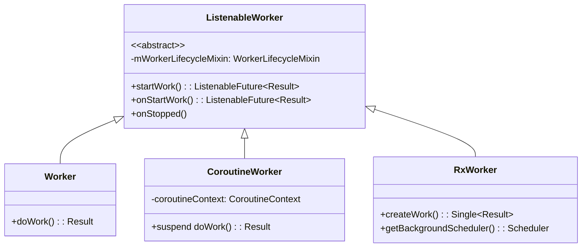
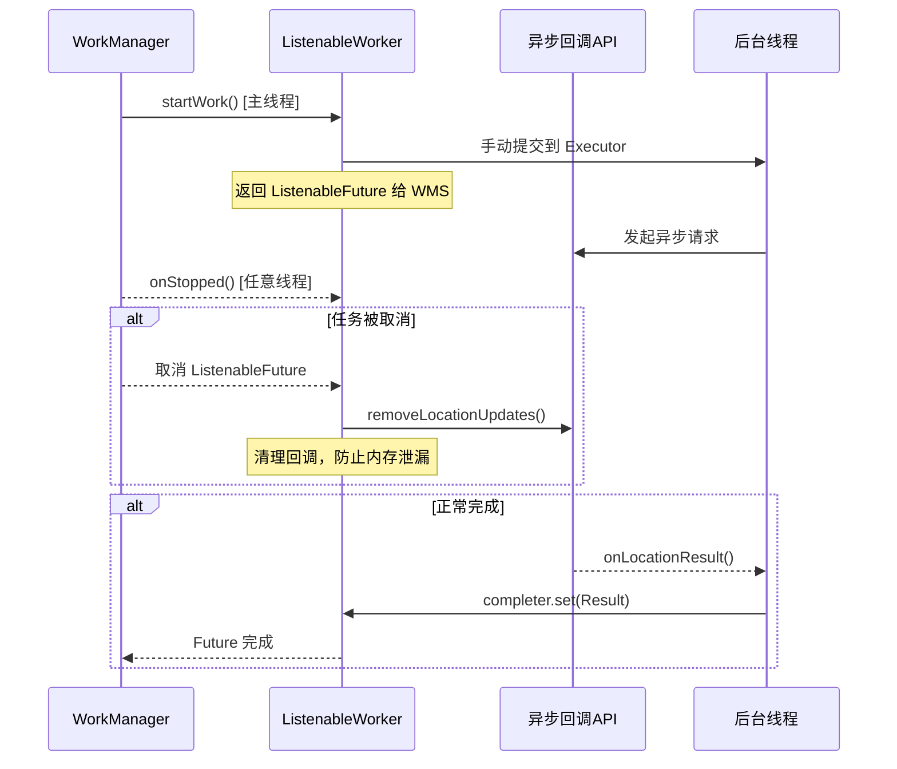
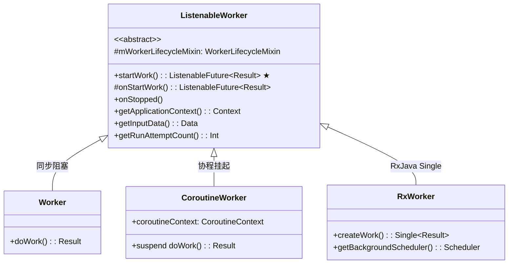

# 6.1.33 ListenableWorker 中的线程

帐篷里的空气有些闷。

希尔把笔记本搁在膝盖上，屏幕的蓝光和露营灯的暖橙色混在一起，把她的脸照得忽明忽暗。代码在她眼前跳动着，一行红色的报错信息盯了她快二十分钟了。

"怎么了？"洛芙把脑袋凑过去，下巴几乎搁在她肩膀上，"又是那个什么……位置服务的 API？"

"别提了。"希尔叹了口气，把屏幕转了个角度给洛芙看，"`FusedLocationProviderClient` 返回的是一个 callback，不是 suspend 函数。我想把它包进 WorkManager 里，但它不认这个返回值。"

"callback？"洛芙眨眨眼，"就是那种……等它完了会回头叫你一声的东西？"

"差不多。但 WorkManager 的 `Worker` 要求 `doWork()` 同步返回结果，不能等 callback。"希尔把笔记本往旁边一放，整个人往后仰倒在睡袋上，"我绕了一晚上，就是搞不定这个线程切换。"

帐篷外传来伊莎轻轻的笑声。她正坐在帐篷门口，手里捧着一杯已经凉透的焙茶："希尔，你有没有听说过 `ListenableWorker`？"

"ListenableWorker？"希尔一骨碌爬了起来，"那不是 CoroutineWorker 的底层吗？"

"是，也不是。"黛琳从她的背包里翻出一个小本子，顺手把露营灯的亮度调低了一档，"它是所有 Worker 的父类。Worker、CoroutineWorker、RxWorker，都继承自 ListenableWorker。"

洛芙扳着手指开始数："所以 Worker 是同步的，CoroutineWorker 是协程的，RxWorker 是 RxJava 的，那 ListenableWorker 是什么？"

"最原始的、最底层的那一个。"黛琳把本子翻到一页，上面画着一张简单的类图，"它不强制任何线程模型，把线程控制完全交给你。"

她用笔在本子上又添了几笔，然后把本子转向希尔和洛芙。



"图 1 是四个 Worker 类的继承关系。可以看到，ListenableWorker 在最上面。"黛琳的笔尖点在最顶端的方框上，"`startWork()` 是核心方法，它返回一个 `ListenableFuture`。这个 `ListenableFuture` 是什么，你现在不用管。你只需要知道——它是 WorkManager 用来追踪你工作完成状态的载体。"

希尔盯着那个 `ListenableFuture`："这就是为什么我的 callback 不 work 的原因？"

"对。"黛琳把本子合上，"Worker 的 `doWork()` 是同步的，你必须自己在里面把事情做完再返回。但 `FusedLocationProviderClient` 的 API 是 callback 形式的，你没法同步地等它返回。"

"那 ListenableWorker 呢？"

"ListenableWorker 的 `onStartWork()` 也返回一个 `ListenableFuture`——不是同步的结果，而是一个"将来会有结果"的承诺。你可以把这个 callback-based 的 API 包装成 `ListenableFuture` 挂上去，WorkManager 就知道你什么时候真正完成了。"

伊莎从帐篷门口转过身来，焙茶的香气飘了过来："就像你寄了一封信，收信人承诺'我会在某天回信'——在回信到达之前，你手里有一张收据。这张收据就是 `ListenableFuture`。WorkManager 拿着这张收据，等回信来了才知道任务完成。"

"伊莎这个比喻不错。"黛琳点点头，"协程的 `suspend` 也是类似的机制，只是 Kotlin 帮我们把"等回信"这件事用 `await()` 包装了，不需要你手动处理。"

洛芙想了一下："所以，如果我不用协程，也不用 RxJava，但我的 API 是 callback-based 的，我就需要用 ListenableWorker？"

"完全正确。"

希尔立刻把笔记本重新打开："那怎么写？给我看看代码。"

"先把官方文档里的关键点过一遍。"黛琳从本子上撕下一张纸，"第一，`startWork()` 是在主线程上调用的——注意，是主线程，不是后台线程。第二，你必须自己手动切换到后台线程。"

"主线程？"洛芙有些惊讶，"但是后台任务不应该在后台线程做吗？"

"应该。但 ListenableWorker 把切换线程这件事完全交给你，不强制你用任何线程模型。"黛琳说，"Worker 默认给你配好了 Executor，CoroutineWorker 默认用 `Dispatchers.Default`，但 ListenableWorker 什么都不给——你要什么线程，你自己带。"

希尔的手指在键盘上悬停了："也就是说……我得自己 new 一个 Executor？"

"或者用 `ListenableFuture` 的工具类帮你包装 callback。"黛琳说，"这就是下一段要讲的内容了——怎么把 callback API 变成 `ListenableFuture`。"

帐篷外一阵风吹过，帆布壁轻轻晃动了一下。远处的山棱线在星空下只剩一条深色的弧。

"我大概知道怎么做了。"希尔已经开始在笔记本上敲了起来，"先手动切换到后台线程，然后在后台线程里执行那个 callback-based 的 API，最后把结果通过 `ListenableFuture` 返回——WorkManager 就知道这个任务完成了。"

"对。但这里有一个细节。"黛琳说，"希尔，你的 API 是什么？`FusedLocationProviderClient` 是吧？"

"对。"

"那个 API 在拿到位置之后会回调 `onLocationResult`。你要做的是，在 `onStartWork()` 里，手动创建一个 `ListenableFuture`，然后在你的 callback 里，把结果 set 进去。"

希尔停下来看她："代码怎么写？"

黛琳从笔记本里翻出一张纸，递给她：

```kotlin
// 依赖：androidx.work:work-runtime
// 注意：ListenableFuture 相关 API 在 androidx.concurrent:concurrent-futures 中

import androidx.concurrent.futures.CallbackToFutureAdapter
import androidx.work.ListenableWorker
import androidx.work.WorkerParameters
import com.google.common.util.concurrent.Futures
import com.google.common.util.concurrent.MoreExecutors

class LocationListenableWorker(
    context: Context,
    params: WorkerParameters
) : ListenableWorker(context, params) {

    override fun startWork(): ListenableFuture<Result> {
        // startWork() 在主线程调用，但这里必须切到后台线程
        val executor = MoreExecutors.directExecutor()

        // 用 CallbackToFutureAdapter 把 callback API 包装成 ListenableFuture
        return CallbackToFutureAdapter.getFuture { completer ->
            val locationCallback = object : LocationCallback() {
                override fun onLocationResult(result: LocationResult) {
                    // 位置拿到后，set 这个 Future 的结果
                    completer.set(Result.success())
                }
            }

            // 发起位置请求（这个方法是异步的，不会阻塞）
            fusedLocationClient.requestLocationUpdates(
                locationRequest,
                locationCallback,
                Looper.getMainLooper()
            )

            // 返回一个 Runnable，用于取消时清理
            object : Runnable {
                override fun run() {
                    fusedLocationClient.removeLocationUpdates(locationCallback)
                }
            }
        }
    }
}
```

"这段代码里有很多细节。"黛琳指着屏幕，"第一，`startWork()` 返回 `ListenableFuture<Result>`——注意，返回类型不是 `Result` 本身，而是装着 `Result` 的 Future。第二，你用 `CallbackToFutureAdapter.getFuture()` 来创建 Future，它的 completer 会在合适的时候被你主动 set 结果。第三，你的异步操作（`requestLocationUpdates`）是发起就算完成，不阻塞——真正知道"完成了"的是你的 callback，所以你把 callback 里收到结果这件事，和 Future 的状态绑定在一起。"

希尔仔细看着代码，眼睛渐渐亮了起来："这个 `completer.set(Result.success())` 就是把结果写进 Future 里？"

"对。WorkManager 一直在监听这个 Future 的状态——你 set 成功了，它就知道任务完成了；你 set 失败了，它就知道要重试。"

"那如果用户取消了任务呢？"

"好问题。"黛琳说，"这就是 CancellationCallback 的作用。"

她从笔记本里撕下一张新的纸，开始画：



"图 2 是整个流程。WorkManager 调用 `startWork()` 拿到 Future 之后，就一直在监听。当任务被取消时，WorkManager 会自动帮你取消这个 Future——但你的 callback 可能还在后台跑着，不清理的话就会内存泄漏。"

"所以需要 `onStopped()`！"希尔一下子坐直了。

"对。`onStopped()` 会在 WorkManager 停止这个 Worker 时被调用——无论是因为用户取消，还是因为 app 被杀了。你应该在这里清理掉你的 callback 注册，比如 `removeLocationUpdates()`。"

伊莎把焙茶递过来给黛琳："这就是为什么 ListenableWorker 的取消机制比 Worker 更复杂。Worker 的 `doWork()` 是同步阻塞的，只要检查 `isStopped` 就行。但 ListenableWorker 的异步操作可能在任何时候收到回调，必须主动清理。"

"还有一个东西——`WorkerLifecycleMixin`。"黛琳补充道，"它给 ListenableWorker 提供了 `getRunAttemptCount()`、`getInputData()` 等工具方法。如果你需要在自己创建的 Executor 线程里访问这些 Worker 的元数据，可以通过 `mWorkerLifecycleMixin` 来拿。"

"Mixin？"洛芙歪着头，"这是什么？"

"混入。"黛琳解释道，"就是"借来用用"的意思。它不是 ListenableWorker 的核心 API，但提供了很多便利工具，让你在处理异步结果时还能访问 Worker 的上下文。"

希尔重新低头看代码，忽然说："等等——我看到这里有一个 `MoreExecutors.directExecutor()`。这是什么？"

"这是 Guava 提供的工具方法，返回一个"立即在当前线程执行"的 Executor。"黛琳说，"但是在 `startWork()` 里，一般不推荐直接用这个——因为你需要在后台线程做耗时操作。这里用它是因为 `requestLocationUpdates` 本身已经是异步的了，不需要再额外切换线程。真正需要后台线程的场景，是你的操作本身是阻塞的，比如文件读写、网络请求但用的是同步版本的库。"

希尔若有所思："那如果要切换线程，应该怎么写？"

黛琳在纸上又画了一个例子：

```kotlin
override fun startWork(): ListenableFuture<Result> {
    // 手动创建 Executor 来处理后台任务
    val backgroundExecutor = Executors.newSingleThreadExecutor()

    return CallbackToFutureAdapter.getFuture { completer ->
        // 提交到后台线程执行
        val future = backgroundExecutor.submit(Runnable {
            try {
                // 在这里做真正的后台工作
                // 比如同步的文件读写、网络请求等
                val data = performBlockingWork()
                completer.set(Result.success())
            } catch (e: Exception) {
                completer.setException(e)
            } finally {
                // 清理 executor
                backgroundExecutor.shutdown()
            }
        })

        // 取消时中断后台任务
        object : Runnable {
            override fun run() {
                future.cancel(true)
            }
        }
    }
}
```

"这里用了 `Executors.newSingleThreadExecutor()` 创建单线程池，然后把阻塞操作提交进去。"黛琳指着 `submit` 那行，"提交后返回一个 `Future`，你可以在取消时调用 `future.cancel(true)` 来中断它。"

"`future.cancel(true)` 会向正在运行的线程发送 interrupt 信号。"伊莎补充道，"但如果你的代码没有正确处理 InterruptedException，可能不会立即停下来。这也是为什么取消机制在 ListenableWorker 里比协程麻烦很多——协程只要取消，整个协程作用域都会被取消，代码不需要自己处理中断。"

洛芙小声说："所以这就是协程的好处之一？自动传播取消信号？"

"对。"黛琳点点头，"协程的取消是级联的。你 cancel 一个 CoroutineWorker，它内部的所有协程都会收到取消信号。但 ListenableWorker 不一样——你自己管理的线程，你得自己处理取消逻辑。"

希尔把笔记本合上，闭上眼睛想了一会儿，然后重新打开："我大概明白了。ListenableWorker 的本质是：WorkManager 只负责在主线程调用 `startWork()`，然后等一个 `ListenableFuture` 的结果。线程怎么切、任务怎么做、怎么取消，全是你自己的事。"

"完全正确。"黛琳微微一笑，"这也是为什么 CoroutineWorker 出现之后，用 ListenableWorker 的人少了很多——协程把线程切换和取消传播都帮你做好了，用起来简单得多。但是如果你在 Java 环境、没有协程支持的老项目里，或者你的异步库既不是 RxJava 也不是协程，那 ListenableWorker 就是你唯一的选择。"

帐篷外的风停了。银河的光洒在帐篷顶端，虫鸣声已经完全静了下来。希尔把笔记本放在膝盖上，屏幕的光芒在黑暗中显得格外亮。

"那我那个 `FusedLocationProviderClient` 的问题，是不是也可以用协程的方式来解决？"希尔忽然问，"不用 ListenableWorker，用 CoroutineWorker，把 callback 转成 suspend 函数？"

"当然可以。"黛琳说，"`suspendCoroutine` 或者 `CompletableFuture` 都可以把 callback 转成协程。实际上 Google 官方也推荐这种方式——能用协程就用协程，ListenableWorker 是最后的兜底方案。"

"但如果用的是 RxJava 呢？"

"那就用 RxWorker。WorkManager 提供了 `RxWorker`，可以返回 RxJava 的 `Single`，取消也自动帮你处理。"

伊莎笑了笑："所以说到底，WorkManager 给了你四套工具——Worker 同步阻塞，CoroutineWorker 协程异步，RxWorker RxJava 异步，ListenableWorker 最低层的手动挡。绝大多数情况下，你不需要摸到手动挡那一层。"

"除非你的库是远古时代的 callback。"希尔嘀咕了一句，但语气已经没有之前那么烦躁了。

她重新把笔记本打开，手指在键盘上飞快跳动。屏幕上的代码不再是满屏红色，而是一行行优雅的 Kotlin——她把那个 callback 包装进了 `CallbackToFutureAdapter`，然后把后台任务提交到了单线程池。

"我想我找到思路了。"她小声说，眼睛盯着屏幕，嘴角微微翘起。

露营灯的光在帐篷里投下温暖的影子。洛芙打了个哈欠，把脑袋靠在了伊莎的肩膀上。秋夜的空气从帐篷的缝隙里渗进来，带着松针和泥土的气息。

银河已经偏西了。明天是个好天气。

```kotlin
// 代码清单：完整的 LocationListenableWorker 示例
// build.gradle 添加依赖：
// implementation 'androidx.work:work-runtime:2.9.0'
// implementation 'androidx.concurrent:concurrent-futures:1.1.0'
// implementation 'com.google.guava:guava:31.1-android'
// implementation 'com.google.android.gms:play-services-location:21.0.1'

class LocationListenableWorker(
    private val fusedLocationClient: FusedLocationProviderClient,
    context: Context,
    params: WorkerParameters
) : ListenableWorker(context, params) {

    override fun startWork(): ListenableFuture<Result> {
        return CallbackToFutureAdapter.getFuture { completer ->
            val locationCallback = object : LocationCallback() {
                override fun onLocationResult(result: LocationResult) {
                    // 成功：把结果写入 Future
                    completer.set(Result.success())
                    // 也可以携带数据回去
                    // completer.set(Result.success(workDataOf("key" to "value")))
                }

                override fun onLocationAvailability(availability: LocationAvailability) {
                    // 位置不可用时的处理
                    if (!availability.isLocationAvailable) {
                        completer.set(Result.failure())
                    }
                }
            }

            try {
                // 发起单次位置请求（异步，不会阻塞）
                val locationRequest = LocationRequest.Builder(
                    Priority.PRIORITY_BALANCED_POWER_ACCURACY,
                    1000L
                ).setMaxUpdates(1).build()

                fusedLocationClient.requestLocationUpdates(
                    locationRequest,
                    locationCallback,
                    Looper.getMainLooper()
                )
            } catch (e: SecurityException) {
                // 权限问题，直接失败
                completer.setException(e)
            }

            // 取消时的清理 Runnable
            object : Runnable {
                override fun run() {
                    fusedLocationClient.removeLocationUpdates(locationCallback)
                }
            }
        }
    }

    override fun onStopped() {
        super.onStopped()
        // 这里可以做额外的清理工作
        // onStopped() 会在 Worker 被取消时自动调用
    }
}
```

"上面这段代码展示了完整实现。"黛琳说，"重点注意三个地方：第一，`requestLocationUpdates` 是异步的，不会阻塞 `startWork()`——所以 `startWork()` 能立即返回 Future。第二，`LocationCallback` 收到结果后，通过 `completer.set()` 把结果写进 Future。第三，WorkManager 会自动管理这个 Future 的生命周期，取消时调用 `removeLocationUpdates` 防止内存泄漏。"

希尔把代码从头到尾读了一遍，然后长长地呼了一口气："这就是 ListenableWorker 的全貌了。"

"对。"黛琳合上笔记本，"你下次遇到 callback-based 的 API，就知道怎么把它接进 WorkManager 了。"

---

## 专业技术总结

**ListenableWorker** 是 WorkManager 四种 Worker 类型中最底层的实现（Worker、CoroutineWorker、RxWorker 都继承自它）。它将线程控制权完全交给开发者：WorkManager 只在主线程调用 `startWork()` 并监听返回的 `ListenableFuture`，线程切换、任务执行、取消处理均由开发者自行负责。

#### 结构图



#### 复杂度与影响

| 维度 | Worker | CoroutineWorker | ListenableWorker |
|------|--------|----------------|------------------|
| 线程控制 | 自动（Executor） | 自动（Dispatcher） | **完全手动** |
| 取消传播 | 需检查 `isStopped` | 自动级联取消 | 需手动处理 |
| 代码复杂度 | 低 | 低 | **高** |
| 适用场景 | 同步阻塞任务 | 协程项目 | **callback-based API、Java 项目** |

#### 反模式与陷阱

1. **在主线程做耗时操作** — `startWork()` 在主线程调用，必须手动切换到后台线程，否则触发 ANR。
   → 修复：使用 `Executors` 创建线程池，将阻塞操作 `submit()` 到后台。

2. **callback 未清理导致内存泄漏** — 异步 API 注册的 listener/callback 在 Worker 取消后仍然存活。
   → 修复：在 `onStopped()` 或 cancel Runnable 中主动 `removeListener`、`removeUpdates`。

3. **Future 永远不 complete** — 异步操作失败或未触发 callback 时，Future 悬在空中，WorkManager 永远等不到结果。
   → 修复：使用 `completer.setException()` 处理所有异常分支，确保 Future 有明确结果。

4. **混淆 `startWork()` 和 `onStartWork()`** — `startWork()` 是公开方法，内部调用 `onStartWork()`。永远不要直接 override `startWork()`，override `onStartWork()`。
   → 修复：`override fun onStartWork(): ListenableFuture<Result>` 而非 `override fun startWork()`。

5. **取消时不中断正在运行的线程** — 仅调用 `future.cancel()` 不一定中断线程。
   → 修复：线程内部应检查 `Thread.currentThread().isInterrupted` 并正确处理 `InterruptedException`。

#### 名词小传

**ListenableFuture** 由 Google Guava 库提供，是 Java `Future` 的扩展接口，增加了回调注册能力。在 Android 中被 WorkManager（原 `ListenableWorker`）、Play Services 等多个库广泛使用。Kotlin 协程的出现大幅降低了其使用场景，但在纯 Java 环境或对接古老 callback API 时仍是标准方案。

#### 设计哲学

WorkManager 的四层 Worker 体现了"渐进式暴露复杂性"的设计原则：

- **CoroutineWorker**：首选方案，协程自动处理线程切换与取消传播，代码简洁。
- **RxWorker**：适合 RxJava 项目，无缝对接 `Single` 与 WorkManager 的生命周期。
- **Worker**：适合同步阻塞的轻量后台任务，无需额外依赖。
- **ListenableWorker**：最低层 API，在需要**完全自定义线程策略**或对接**纯 callback-based 旧库**时使用。

这条原则也叫"门当户对"原则：能用高层 API 解决就不用底层 API，除非你有充分的理由。

---

#### 🏕️ 动手练习

**项目概览**：构建一个 `DataSyncWorker`，从模拟的 callback-based 数据源下载天气数据，并通过 `ListenableWorker` 接入 WorkManager，实现可靠的后台同步与取消清理。

**Task 1** — 创建 WorkManager 配置与 ListenableWorker 骨架（★）

目标：搭建项目骨架，添加依赖，定义一个继承 `ListenableWorker` 的 Worker 类，重写 `onStartWork()` 并返回成功结果。

你需要做的事：

1. 在 `build.gradle` 中添加：`implementation 'androidx.work:work-runtime:2.9.0'`、`implementation 'androidx.concurrent:concurrent-futures:1.1.0'`、`implementation 'com.google.guava:guava:31.1-android'`
2. 创建 `DataSyncListenableWorker` 类继承 `ListenableWorker`
3. `onStartWork()` 方法直接返回 `Futures.immediateFuture(Result.success())`

验收标准：

- [ ] Worker 类编译通过
- [ ] `onStartWork()` 返回 `ListenableFuture<Result>`
- [ ] 调用 `WorkManager.enqueue()` 后任务执行并返回 `SUCCESS`

提示：

```kotlin
import com.google.common.util.concurrent.Futures
import androidx.work.ListenableWorker
import androidx.work.WorkerParameters

class DataSyncListenableWorker(
    context: Context,
    params: WorkerParameters
) : ListenableWorker(context, params) {

    override fun onStartWork(): ListenableFuture<Result> {
        // 返回一个立即完成的 Future
        return Futures.immediateFuture(Result.success())
    }
}
```

---

**Task 2** — 集成模拟的 callback-based 数据源（★★）

目标：在 `onStartWork()` 中使用 `CallbackToFutureAdapter`，将模拟的异步 callback API 包装成 `ListenableFuture`。

你需要做的事：

1. 创建模拟数据源类 `WeatherDataSource`，包含 `fetchWeather(callback: (String) -> Unit)` 方法，模拟 2 秒延迟后回调
2. 在 Worker 中用 `CallbackToFutureAdapter.getFuture()` 包装这个异步调用
3. 在 callback 中调用 `completer.set(Result.success())`

验收标准：

- [ ] Worker 执行时等待异步数据源完成
- [ ] 数据加载完成后 `Result` 为 `success`
- [ ] Logcat 打印出天气数据

提示：

```kotlin
override fun onStartWork(): ListenableFuture<Result> {
    return CallbackToFutureAdapter.getFuture { completer ->
        val callback = object : WeatherCallback {
            override fun onSuccess(data: String) {
                completer.set(Result.success(workDataOf("weather" to data)))
            }
            override fun onFailure(error: String) {
                completer.set(Result.failure(workDataOf("error" to error)))
            }
        }

        weatherDataSource.fetchWeather(callback)

        // 返回取消时的清理 Runnable
        object : Runnable {
            override fun run() {
                // 清理资源（如取消网络请求）
            }
        }
    }
}
```

---

**Task 3** — 实现手动线程切换（★★★）

目标：使用 `ExecutorService` 将同步阻塞的数据处理切换到后台线程，而不是在主线程等待。

你需要做的事：

1. 在 Worker 中创建 `ExecutorService`（使用 `Executors.newSingleThreadExecutor()`）
2. 将耗时操作（模拟的数据处理）提交到 executor
3. 用 `CallbackToFutureAdapter` 包装 executor 提交的 `Callable`
4. 在 `onStopped()` 中调用 `executor.shutdown()`

验收标准：

- [ ] `startWork()` 立即返回 Future，不阻塞主线程
- [ ] 后台线程执行数据处理任务
- [ ] 取消任务时 executor 被正确关闭

提示：

```kotlin
private val executor = Executors.newSingleThreadExecutor()

override fun onStartWork(): ListenableFuture<Result> {
    return CallbackToFutureAdapter.getFuture { completer ->
        val task = executor.submit(Callable {
            // 在后台线程执行
            val result = processWeatherData() // 模拟耗时操作
            Result.success(workDataOf("processed" to result))
        })

        // 取消 Runnable
        object : Runnable {
            override fun run() {
                task.cancel(true)
                executor.shutdown()
            }
        }
    }
}

override fun onStopped() {
    super.onStopped()
    executor.shutdown()
}
```

---

**Task 4** — 实现取消时的资源清理（★★★★）

目标：验证 Worker 被取消时，`onStopped()` 被调用，并确保 callback 被正确移除，防止内存泄漏。

你需要做的事：

1. 在数据源中加入注册/注销 listener 的管理机制
2. 在 Worker 的 cancel Runnable 中调用 `dataSource.unregisterListener()`
3. 调用 `WorkManager.cancelWorkById()` 取消正在运行的 Worker
4. 在 `onStopped()` 中验证清理逻辑被执行

验收标准：

- [ ] 取消后 `onStopped()` 被调用
- [ ] listener 被正确注销
- [ ] 不会触发内存泄漏（可使用 Android Studio Profiler 观察）

---

**Task 5** — 处理 `ListenableFuture` 的异常情况（★★★★★）

目标：确保异步操作抛出异常时，`completer.setException()` 被调用，WorkManager 能正确处理失败状态。

你需要做的事：

1. 在异步操作中添加 try-catch 块
2. 异常时调用 `completer.setException()`
3. 测试网络超时、权限拒绝等异常路径
4. 验证 WorkManager 按配置重试（`BackoffPolicy`）

验收标准：

- [ ] 异常时 `Result` 为 `failure` 或 `retry`
- [ ] WorkManager 按 `setBackoffCriteria()` 策略重试
- [ ] 多次失败后最终放弃

提示：

```kotlin
val task = executor.submit(Callable {
    try {
        val result = fetchDataFromNetwork() // 可能抛出 IOException
        Result.success(workDataOf("data" to result))
    } catch (e: IOException) {
        // 区分可重试与不可重试的异常
        Result.retry() // 网络异常，可重试
    }
})
```

---

**Task 6** — 完整集成 WorkManager 与 Input/Output Data（★★★）

目标：使用 `WorkRequest` 传入参数，`ListenableFuture` 返回数据，实现完整的数据输入输出流。

你需要做的事：

1. 创建 `OneTimeWorkRequest` 并使用 `setInputData()` 传入城市名称
2. 在 Worker 的 `onStartWork()` 中通过 `inputData.getString("city")` 读取参数
3. 处理完成后通过 `Result.success(outputData)` 返回数据
4. 在调用方通过 `WorkInfo.getOutputData()` 获取结果

验收标准：

- [ ] Input Data 正确传入 Worker
- [ ] Output Data 正确返回给调用方
- [ ] 数据在 `liveData` 或 `Flow` 中正确观察

---

**Task 7** — 面试热身

用自己的话回答以下问题（能说清楚才算真的懂了）：

1. `ListenableFuture` 和 Kotlin 的 `suspend` 函数本质上是解决同一类问题的两种不同方案，它们各自的优势和劣势是什么？
2. 为什么 `startWork()` 必须在主线程调用，但实际工作可以在后台线程？如果不遵循这个约定会怎样？
3. `CallbackToFutureAdapter.getFuture()` 的 completer 是什么？如果你忘记调用 `completer.set()` 会发生什么？
4. 描述当 WorkManager 取消一个正在运行 `ListenableWorker` 时的完整生命周期流程。
5. 为什么说"能用 CoroutineWorker 就不要用 ListenableWorker"？在什么场景下 ListenableWorker 是唯一选择？

---

#### 参考实现要点

1. **优先使用高层 Worker**：除非必须对接 callback-based 旧库，否则应使用 CoroutineWorker 或 RxWorker，代码复杂度降低且取消逻辑更健壮。
2. **手动线程切换时优先复用 Executor**：不要在每次 `startWork()` 调用时创建新的 `ExecutorService`，应在单例或 `Application` 级别维护线程池，避免资源耗尽。
3. **取消逻辑必须成对**：注册 listener 的地方一定要有对应的注销逻辑，`onStopped()` 是最后的安全网。
4. **使用 `setException()` 而非直接 `set(Result.failure())`**：后者会让 WorkManager 把这次执行当作"确定失败"，不会触发重试策略；前者能正确触发 `BackoffPolicy`。
5. **`directExecutor()` 不是"不切换线程"的通行证**：虽然 `MoreExecutors.directExecutor()` 不切换线程，但如果你在 `startWork()` 里做了耗时操作，仍然会 ANR——它只是省略了线程切换的 overhead，并不是"在后台执行"。

> 学习建议

ListenableWorker 是 Android 后台任务体系中最"硬核"的一层，它的核心价值在于让你完全掌控线程策略。如果你是 Kotlin 开发者且项目支持协程，建议把 CoroutineWorker 作为默认选择，仅在对接老旧 callback 库或编写 Java 代码时考虑 ListenableWorker。理解它的线程模型，能帮助你更深刻地理解 CoroutineWorker 和 RxWorker 替你做了什么——知己知彼，才能在出问题时不至于两眼一抹黑。

---

## 洛芙的小小日记本

今天学到了`ListenableWorker`，原来WorkManager最底层是这个啊。希尔被那个callback绕了好久，黛琳画的那张类图一下子就清楚了——协程帮我们做了那么多事，我还一直嫌它啰嗦……果然是不知道珍惜。明天去查一下公司项目里有没有还在用ListenableWorker的老代码，如果能顺手改成CoroutineWorker就太棒了！

---

## 今日关键词

**ListenableFuture** — Google Guava 提供的 `Future` 扩展接口，支持注册回调，在异步计算完成时自动触发。相比 Java 标准 `Future` 的 `get()` 阻塞特性，ListenableFuture 更适合事件驱动的异步编程模型。

**CallbackToFutureAdapter** — WorkManager 提供的工具类，用于将 callback-based 异步 API 转换为 `ListenableFuture`。通过 `getFuture()` 创建的 completer，开发者可以在任意时刻（通常是异步操作完成时）主动 `set()` 结果或异常。

**ListenableWorker** — WorkManager 四种 Worker 类型中最底层的抽象类。它在主线程调用 `startWork()` 并接收返回的 `ListenableFuture`，将线程控制权完全交给开发者。`Worker`、`CoroutineWorker`、`RxWorker` 均继承自它。

**WorkerLifecycleMixin** — ListenableWorker 的内部工具类，通过组合模式提供 `getRunAttemptCount()`、`getInputData()` 等 Worker 上下文信息，供开发者在自定义线程策略中使用。

**CancellationCallback** — 当 WorkManager 取消 `ListenableFuture` 时触发的回调机制。开发者通过在 `CallbackToFutureAdapter.getFuture()` 中返回 Runnable 来定义取消时的清理逻辑。

**onStartWork()** — ListenableWorker 的核心回调方法，返回 `ListenableFuture<Result>`。注意应 override 此方法而非公开的 `startWork()`。工作应在此方法内通过 Executor 或其他机制切换到后台线程执行。

**MoreExecutors.directExecutor()** — Guava 提供的工具方法，返回一个在当前线程立即执行任务的 Executor。适用于"已经是异步"的操作，无需额外线程切换开销。

**ExecutorService** — Java 标准库的线程池接口，用于将任务提交到后台线程执行。`Executors.newSingleThreadExecutor()` 创建单线程池，保证任务串行执行；`Executors.newFixedThreadPool(n)` 创建固定大小的线程池。

**BackoffPolicy** — WorkManager 的重试策略配置，包含 `EXPONENTIAL`（指数退避）和 `LINEAR`（线性退避）两种。当 `ListenableFuture` 返回 `Result.retry()` 时，WorkManager 按配置的退避间隔重新调度任务。

**setException()** — `CallbackToFutureAdapter.Completer` 的方法，用于在异步操作异常时将异常设置为 Future 的结果。与直接 `set(Result.failure())` 不同，使用 `setException()` 能正确触发 WorkManager 的重试策略。

**setInputData()** — `WorkRequest.Builder` 的方法，用于向 Worker 传入键值对数据。通过 `WorkerParameters.inputData` 或 `getInputData()` 在 Worker 内部读取。

**setOutputData()** — `Result.success(data)` 中携带的输出数据，通过 `WorkInfo.getOutputData()` 在调用方获取，实现 Worker 与调用方之间的数据传递。
