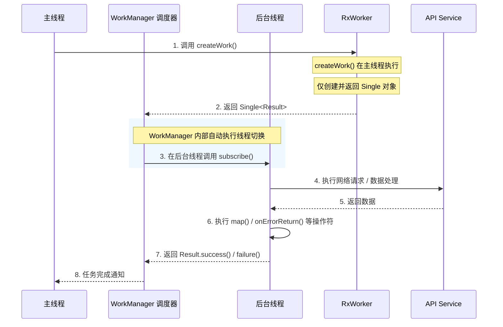
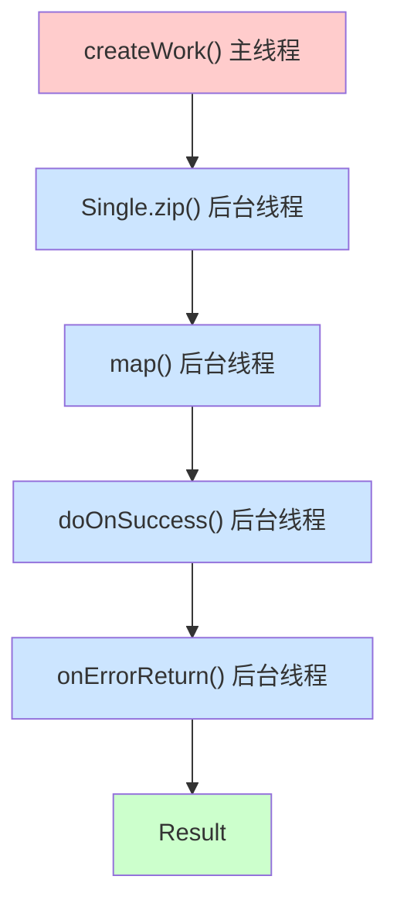
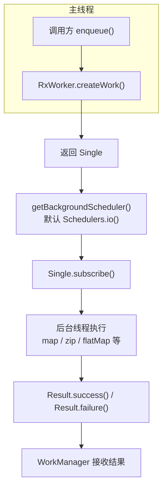
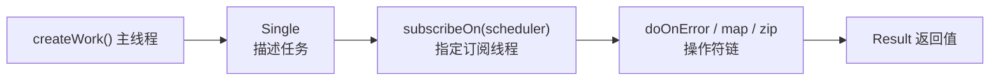

# 6.1.34 RxWorker 中的线程

帐篷里的空气已经凉透了。

洛芙缩在睡袋里，只露出半张脸，眼睛半睁半闭地盯着希尔那边——她还在敲代码，笔记本屏幕的蓝光把她的下巴照得格外分明。帐篷外传来一阵风，摇曳的橘色灯光在帆布上投下晃动的影子。

"希尔，你到底什么时候睡啊……"

"快了快了。"希尔头也不抬，手指在键盘上噼里啪啦，"我把最后这个Demo跑完。"

"你从ListenableFuture讲到协程，现在又换成RxJava，这都几点了……"

伊莎在隔壁的睡袋里翻了个身，声音闷闷的："洛芙，你要是困就先睡。"

"不困！"洛芙揉了揉眼睛，"就是……有点跟不上。"

"哪里跟不上？"黛琳的声音从对面传来，清晰得很。她显然也没睡，靠着背包坐着，膝盖上摊着笔记本，不知道在记什么。

"ListenableWorker我大概明白了，就是回调套回调嘛。"洛芙说，"但希尔刚才说还有RxWorker，感觉比那个还复杂……"

"不是更复杂，是另一种风格。"希尔终于停下了敲代码的动作，把笔记本转了过来，屏幕正对着黛琳和洛芙，"来，我给你们看看我刚才写的Demo——我们把之前的ListenableFuture版本改成RxWorker版本，对比一下，你就知道区别在哪了。"

"等等等等，"洛芙举起手，"你是不是还欠我一张图？刚才那张ListenableWorker的线程流程图我还没消化完呢。"

"那不是正好吗？"希尔眨眨眼，"我们顺着讲下去。ListenableWorker是底层，RxWorker是封装层——就像一个帮你自动挡的车，你不用关心离合器怎么配合，踩油门就走。"

帐篷外又起了一阵风，红叶沙沙地响，像是远处有人在轻轻拍手。黛琳把笔记本往上抬了抬，让灯光照得更清楚一些。

"好，那我先问一下，"黛琳说，"RxWorker是什么人不人？"

"WorkManager对RxJava的专门适配层。"希尔说，"你们项目里不是用RxJava处理网络请求吗？你想想，一个请求从发出去到拿到结果，是不是一整条链？"

洛芙想了想："对……Observable.create()然后map()一下再subscribe()……"

"对。那一整条链，就是一个'响应式流水线'。"希尔说，"WorkManager现在给你提供了一个专门的Worker，叫RxWorker，专门来接这个流水线。你不需要自己把RxJava的订阅塞进Executor里，RxWorker帮你把一切都接好了。"

"这么方便？"洛芙有点不敢相信。

"真的这么方便。"希尔说，"但方便不代表你可以不懂原理——恰恰相反，你要是原理不懂，出了问题debug起来会非常痛苦。"

她低头敲了几下键盘，把Android开发者文档的RxWorker页面调了出来，念道：

"'We provide interoperability between WorkManager and RxJava. To use this, include the work-rxjava3 dependency in addition to work-runtime in your gradle file。'"

"看到了吗？第一步，加依赖。"希尔指着屏幕，"注意RxJava2和RxJava3是两个不同的包，要选对。"

"等等，"洛芙忽然清醒了一些，"项目里用的是RxJava2还是RxJava3？"

"3。"希尔说，"虽然2还能用，但3是主流，能用3就用3。"

"那包名就是`work-rxjava3`对吧？"黛琳在本子上记了一下。

"对。RxJava2对应`work-rxjava2`。"希尔点点头，"加完依赖之后呢，就不用extends Worker了，改成extends RxWorker——"

她把屏幕往下滑，露出代码示例：

```kotlin
import androidx.work.rxjava3.RxWorker
import io.reactivex.rxjava3.core.Single

class MyRxWorker(
    context: Context,
    params: WorkerParameters
) : RxWorker(context, params) {

    override fun createWork(): Single<Result> {
        // 这里返回的是一个 Single<Result>，表示任务结果
        // Result.success() 表示任务成功
        // Result.failure() 表示任务失败
        return apiService.fetchData()
            .map { data ->
                // 处理数据
                Result.success()
            }
            .onErrorReturn { e ->
                // 出错时返回失败
                Result.failure()
            }
    }
}
```

洛芙盯着代码看了好一会儿。

"createWork()……这个名字好眼熟。"她喃喃道，"跟ListenableWorker的createWork()是同一个东西吗？"

"同一个思想，不同的实现。"黛琳说，"ListenableWorker的createWork()返回的是`ListenableFuture<Result>`，而RxWorker的createWork()返回的是`Single<Result>`。"

"Single就是RxJava里的单次发射嘛，"希尔补充道，"Observable的简化版，只能发射0个或1个数据，然后结束——正好对应任务的'失败'或'成功'这两种结果。"

"想成任务只有一次结果，不是持续性的事件流？"洛芙问。

"没错。"希尔打了个响指，"你想想后台任务的特点：执行一次，得到一个结果，然后结束。Single完美匹配这个模式。比Observable简单多了，因为你不需要考虑onComplete()之后的事。"

帐篷里安静了一会儿，只有帐篷外风吹树叶的声音。洛芙裹着外套缩成一团，脑子里在转：

"那线程呢？createWork()是在哪个线程被调用的？"

"这是最关键的问题。"希尔说，"也是今天我们要重点讨论的——RxWorker的线程模型跟ListenableWorker完全不一样。"

她在本子上画了一条线，左边标"主线程"，右边标"后台线程"，中间画了个虚线框：

"根据官方文档，`RxWorker.createWork()`是在主线程被调用的——注意，是'调用'，不是'执行'。"

"这有什么区别吗？"洛芙问。

"非常大。"黛琳接过话头，"'调用'意味着你写的那段代码逻辑在什么线程跑，是由你决定的。而RxWorker的特点是——"

她在本子上又画了一条线，箭头从createWork()指出去，拐了个弯，写上"订阅在后台线程执行"。

"createWork()本身在主线程被调用，但你return的那个Single，会在后台线程被subscribe()。"

"等一下等一下，"洛芙举起手，"你是说，createWork()这个方法是在主线程被调用的，但是方法里写的那些网络请求、数据处理的代码，是在一个后台线程运行的？"

"完全正确。"希尔说，"这跟ListenableFuture不一样。ListenableFuture的线程策略需要你手动用Executor切换，但RxWorker帮你把这个切换封装好了——默认情况下，它会自动切换到后台线程去执行。"

帐篷外又起了一阵更响的风，帐篷的帆布被吹得鼓了起来，像是有人从外面轻轻吹了口气。洛芙打了个哈欠，但还是强撑着继续看。

"来，看这张图。"希尔把本子推过来，上面画的是完整的RxWorker线程模型流程。



图1　RxWorker的线程模型：createWork()在主线程被调用（步骤1-2），返回的Single在后台线程被订阅执行（步骤3-7）

"这张图是RxWorker线程调度的核心。"希尔指着本子上的图，"左边的'主线程'只是一个入口，你写的createWork()方法体在里面被调用，但立即就return了一个Single对象——这个return的动作非常快，所以不会阻塞主线程。然后，WorkManager拿到这个Single之后，会在后台线程去subscribe它，这时候你写的那些map()、flatMap()、网络请求的代码，才真正开始执行。"

"就像……我去餐厅点菜？"洛芙一边想一边说，"我下单是在前台（主线程），但厨师在后厨（后台线程）做菜？"

"差不多，但不太准确。"希尔说，"更准确的说法是——你下单的动作本身（createWork()）是在前台完成的，但下单之后厨房怎么运作、谁来炒菜、用什么火候，全都是厨房自己决定的，你不用管。"

"那谁来决定'厨房用哪个灶台'呢？"黛琳问。

"这就是getBackgroundScheduler()了。"希尔把屏幕往下滚，找到那段说明，念出来："'You can override RxWorker.getBackgroundScheduler() to change the default threading behavior。'"

她继续解释："默认情况下，WorkManager会给RxWorker分配一个默认的后台调度器——其实就是Schedulers.io()。但你可以重写这个方法，换成你自己想要的线程池。"

"比如说？"洛芙问。

"比如说你的任务是CPU密集型的计算，不是IO操作——那你可能想用Schedulers.computation()，它专门给CPU密集任务准备，有固定数量的线程，不会被IO操作阻塞。"

希尔调出代码示例：

```kotlin
import io.reactivex.rxjava3.core.Single
import io.reactivex.rxjava3.schedulers.Schedulers
import io.reactivex.rxjava3.android.schedulers.AndroidSchedulers

class MyRxWorker(
    context: Context,
    params: WorkerParameters
) : RxWorker(context, params) {

    // 重写调度器：默认是 Schedulers.io()
    // Schedulers.io() 适合 IO 密集型任务（网络、文件）
    // Schedulers.computation() 适合 CPU 密集型任务（计算、解码）
    override fun getBackgroundScheduler(): Scheduler {
        return Schedulers.io()
    }

    override fun createWork(): Single<Result> {
        // WorkManager 会自动把 subscribe() 调度到
        // getBackgroundScheduler() 返回的那个 Scheduler 上
        // 你不需要手动写 subscribeOn(getBackgroundScheduler())
        return apiService.fetchData()
            .map { data ->
                // 这个 lambda 里的代码在 getBackgroundScheduler() 指定的线程执行
                processData(data)
                Result.success()
            }
            .onErrorReturn { e ->
                // 出错时返回失败结果
                Result.failure()
            }
    }

    private fun processData(data: Data): Unit {
        // CPU 密集型处理逻辑
    }
}
```

"但这里有个问题，"黛琳指着代码，"你在createWork()里写了`apiService.fetchData()`，这是一个返回Observable的网络请求对吧？如果网络请求本身没有指定线程，那它会在哪个线程执行？"

"好问题。"希尔说，"这要看你们的网络库用什么调度器了。但不管网络请求本身在哪个线程，RxWorker会保证你return的Single的后续操作——也就是map()、onErrorReturn()这些——在getBackgroundScheduler()指定的线程上执行。"

"也就是说，不管上游是什么线程，map()里的代码一定在后台线程？"洛芙问。

"对。"希尔点头，"这就是RxJava的好处——线程切换是显式的、可控的。"

"那如果我在createWork()里写了observeOn(AndroidSchedulers.mainThread())呢？"洛芙忽然想到。

"那就完了。"希尔直接说，"后台任务跑到一半，切换回主线程——WorkManager不允许这种事。会直接抛异常或者导致不可预期的行为。"

"所以规则就是：RxWorker里，后台任务全程后台，不许回主线程。"黛琳总结道。

"没错。"希尔说，"这是RxWorker和普通RxJava最大的区别——在普通RxJava里，你可能经常在subscribe()里更新UI，所以会observeOn(mainThread())。但在WorkManager里这是禁区，因为WorkManager的任务可能在任何时候被系统停止，你不能在主线程做关键操作。"

帐篷里安静了一会儿。远处的山脚下，溪水的声音隔着夜风隐约传来，像是有人在很远的地方玩水。

"那我到底什么时候应该用RxWorker而不是CoroutineWorker？"洛芙问，"你之前说协程是现代的选择。"

"如果你们项目已经在用RxJava处理异步请求，"希尔说，"那RxWorker是最自然的选择。代码风格统一，不用混用不同的异步模型。"

"但如果项目里没有RxJava呢？"

"那就别为了用RxWorker而引入RxJava。"希尔说，"协程是更现代的选择，除非你有特别的原因要用RxJava——比如你们的网络层已经重度依赖RxJava，或者你需要组合多个数据流。"

"那如果我要同时监控两个API，哪个先返回就用哪个呢？"洛芙问。

"这就RxJava的优势了——zip()、merge()、combineLatest()这些操作符，处理多数据流组合特别自然。"希尔说，"协程的话需要用Channel或者Flow，代码会复杂一些。"

帐篷外传来一阵猫头鹰的叫声，低沉而悠远。洛芙抬头看了看帐篷顶，帆布上的影子在灯光下晃动。

"我有一个问题，"洛芙忽然说，"你们刚才说RxWorker当被Stopped的时候会自动取消订阅——这个是怎么做到的？"

"这就要说到RxJava的Subscription机制了。"希尔说，"当你的RxWorker被系统Stopped的时候，WorkManager会调用RxJava Subscription的dispose()方法，自动中断你正在执行的响应式流水线。你不需要手动做什么。"

她调出文档的原文，念道："'When an RxWorker is onStopped(), the subscription will get disposed of, so you don't need to handle work stoppages in any special way。'"

"就是自动收尾的意思？"洛芙问。

"对。相当于RxJava帮你做好了取消订阅的逻辑。"希尔说，"你不需要在onStopped()里手动做cancel，不需要写if(isStopped) return，你只要写好正常的RxJava流程就行了。"

"这也太爽了吧。"洛芙说，"ListenableFuture还要自己判断是否Stopped，自己决定要不要继续执行。RxWorker直接封装好了。"

"所以说嘛，RxJava是把双刃剑——用好了非常优雅，用不好debug能让你怀疑人生。"希尔说，"但RxWorker帮你在WorkManager这一层做了很多保护，踩坑的概率小很多。"

帐篷外又安静了下来。伊莎不知道什么时候已经睡着了，呼吸变得均匀而轻柔。

"最后一件事，"希尔说，"我要给你们看一个实际场景的代码对比——用RxWorker重构之前ListenableFuture写的那个天气下载Worker。"

"等等，我们的天气App不是用协程的吗？"洛芙问。

"协程的版本当然用CoroutineWorker最简单。但我们假装那是个用RxJava重写的版本——这样才能展示RxWorker怎么用。"

希尔敲了几下键盘，调出一段代码：

```kotlin
// ❌ 反模式：RxJava 在 Worker 里混用线程，容易出问题
class BadWeatherWorker(
    context: Context,
    params: WorkerParameters
) : RxWorker(context, params) {

    override fun createWork(): Single<Result> {
        return api.fetchWeather()  // 假设返回 Observable<WeatherData>
            .subscribeOn(Schedulers.io())  // 手动指定线程
            // ⚠️ 错误：绝对不能在 RxWorker 里 observeOn(mainThread())
            .observeOn(AndroidSchedulers.mainThread())  // ❌ 禁止！后台任务不能切换到主线程
            .map { weather ->
                saveToCache(weather)
                Result.success()
            }
            .onErrorReturn { e ->
                Result.failure()
            }
    }
}
```

"这个有什么问题？"洛芙问。

"observeOn(AndroidSchedulers.mainThread())——这个在普通RxJava代码里完全没问题，甚至是很常见的写法。但在WorkManager里，这是致命错误。"希尔说，"后台任务的生命周期不由你控制，可能在任何时候被停止。一旦切换到主线程，系统可能会在你要更新UI的时候把你的Worker停掉，导致各种奇怪的问题。"

"而且，"黛琳补充道，"你根本不需要在后台任务里切到主线程——Worker运行的时候，App的UI可能根本不存在，你切到主线程干什么？"

"有道理……"洛芙点头。

"我们来看看正确的写法。"希尔把代码改成：

```kotlin
// ✅ 正确：RxWorker 默认就在后台线程执行，无需手动切
class GoodWeatherWorker(
    context: Context,
    params: WorkerParameters
) : RxWorker(context, params) {

    // 重写 getBackgroundScheduler() 指定后台调度器
    override fun getBackgroundScheduler(): Scheduler {
        return Schedulers.io()
    }

    override fun createWork(): Single<Result> {
        // ✅ 正确：不需要 subscribeOn()，WorkManager 自动处理
        // ✅ 正确：不需要 observeOn(mainThread())，绝对禁止
        // ✅ 正确：直接用 map() 和 onErrorReturn() 返回 Result
        return api.fetchWeather()
            .map { weather ->
                // 所有操作都在 getBackgroundScheduler() 指定的线程执行
                saveToCache(weather)
                // 更新数据库
                weatherDatabase.insert(weather)
                // 保存成功
                Result.success()
            }
            .onErrorReturn { e ->
                // 发生错误时返回失败结果
                // 不需要手动打印日志，RxJava 会自动传播错误
                Result.failure()
            }
    }

    private fun saveToCache(weather: WeatherData) {
        // 同步写入缓存（IO操作，在 Schedulers.io() 线程执行）
        val cacheFile = File(cacheDir, "weather.json")
        cacheFile.writeText(weather.toJson())
    }
}
```

"你看，"希尔指着屏幕，"正确版本里没有subscribeOn()，也没有observeOn()。因为RxWorker已经帮你封装好了——createWork()在主线程调用，返回的Single自动在后台线程执行。你唯一需要做的就是重写getBackgroundScheduler()，告诉WorkManager你想用哪个线程池。"

"那如果我确实需要在RxWorker里组合多个API呢？"洛芙问。

"这是个好问题。"希尔说，"我来给你写一个完整的多数据流组合示例。"

她敲出一段新代码：

```kotlin
class MultiApiWorker(
    context: Context,
    params: WorkerParameters
) : RxWorker(context, params) {

    override fun getBackgroundScheduler(): Scheduler {
        return Schedulers.io()
    }

    override fun createWork(): Single<Result> {
        // 组合两个 API 的响应式流
        // zip() 会等两个流都发射数据之后，再组合在一起
        return Single.zip(
            api.fetchTemperature(),     // 第一个流：温度数据
            api.fetchHumidity(),         // 第二个流：湿度数据
            { temperature, humidity ->
                // 两个 API 都成功之后，在这里合并结果
                WeatherInfo(temperature, humidity)
            }
        )
        .doOnSuccess { info ->
            // 可以在订阅线程里做一些额外操作
            // 但注意：这里仍然是后台线程，不要做UI相关的事
            analytics.logWeatherFetch(info)
        }
        .map { info ->
            // 写入数据库
            weatherDatabase.insert(info)
            Result.success()
        }
        .onErrorReturn { e ->
            // 任何一个 API 失败，都返回 failure
            Result.failure()
        }
    }
}

// 数据类
data class WeatherInfo(
    val temperature: Double,
    val humidity: Double
)
```

"看到了吗？"希尔指着屏幕，"zip()是RxJava里用来组合多个流的操作符——在这个例子里，温度和湿度是两个独立的API请求，zip()会等两个都返回之后，再执行组合的lambda。这比协程里用async/await组合多个请求要简洁很多。"

"这也太好看了吧……"洛芙盯着代码，"比我想象的RxJava要简单多了。"

"那是因为RxWorker帮你把复杂的部分封装了。"希尔说，"你自己要处理的部分，其实就三件事：写createWork()返回Single，在里面写你的业务逻辑，重写getBackgroundScheduler()指定线程。就这些。"

帐篷里安静了一会儿。希尔把笔记本合上了一半，只留屏幕的微光照着她的脸。

"我再问一个，"洛芙说，"如果我在RxWorker里写了flatMap()，它会怎么调度线程？"

"flatMap()本身不改变线程，"希尔说，"它只是把一个数据流转换成另一个数据流。真正决定线程的，是你在它之前写的subscribeOn()，或者你的getBackgroundScheduler()。flatMap()里创建的新流，会继承当前线程的调度策略，除非你在里面又单独指定了subscribeOn()。"

她在本子上画了一个简单的图：



图2　RxWorker 中操作符的线程继承：createWork()在主线程执行（粉红色），返回后所有操作符都在后台线程执行（蓝色），最终返回Result（绿色）

"这个图里，粉色的createWork()是主线程，蓝色部分全部在后台线程。"希尔说，"因为WorkManager在subscribe的时候已经指定了getBackgroundScheduler()，所以整个Single的后续链都继承这个调度策略，不需要你再手动切。"

洛芙盯着图看了好一会儿，忽然说："我好像有点明白了。"

"明白什么了？"

"就是……RxWorker其实是把你从线程管理的泥潭里拉出来了。"洛芙说，"你不需要关心线程怎么切换，因为RxJava已经帮你定好了——createWork()给你一个主线程入口，返回Single之后，后面的事WorkManager全包了。"

"没错。"希尔笑了，"这就是封装的好处。你不需要关心Executor怎么配，不需要关心ListenableFuture怎么回调，你只要写好你的业务逻辑，剩下的WorkManager帮你搞定。"

帐篷外传来一阵更响的风声，红叶沙沙地响了一阵，又安静下来。洛芙打了个哈欠，蜷在睡袋里不想动。

"那……RxWorker和CoroutineWorker哪个更好？"她问。

"取决于你的项目。"希尔说，"如果你们已经用RxJava，那RxWorker是自然选择。如果你们用协程，那CoroutineWorker更合适。没有绝对的优劣，只有适合不适合。"

"明白了。"洛芙点点头，"不能为了用新技术而引入新技术，要看项目实际需要。"

"学得很快嘛。"希尔伸手揉了揉洛芙的头发。

"别揉——我头发都乱了——"

帐篷里传来轻轻的笑声。远处的山脚下，溪水的声音若有若无，夜风轻轻吹过山梨的树叶。

洛芙闭上眼睛，脑子里还转着那张线程图——主线程调createWork()，返回Single，后台线程subscribe，执行map()、zip()、onErrorReturn()，最后返回Result。

RxJava的流水线，在WorkManager里流得如此顺畅。

她翻了个身，把外套裹得更紧了一点。夜已经很深了。明天还要继续呢。

---

## 专业技术总结

**RxWorker** — WorkManager 提供的 RxJava 适配层，通过重写 `createWork()` 方法返回 `Single<Result>` 来定义后台任务逻辑。`createWork()` 在主线程被调用，返回的 Single 会在 `getBackgroundScheduler()`（默认 `Schedulers.io()`）上被 subscribe()，实现主线程定义任务与后台线程执行的分离。系统停止 Worker 时会自动 dispose Subscription，无需手动处理取消。

**createWork()** — RxWorker 的核心方法，在主线程被调用，返回 `Single<Result>`。方法体本身在主线程执行，但返回的 Single 会在后台线程被 subscribe()。

**getBackgroundScheduler()** — RxWorker 中控制订阅线程的钩子方法，默认返回 `Schedulers.io()`。重写此方法可自定义后台执行线程，但需要与 `createWork()` 中的 `subscribeOn()` 配置保持一致。

**Single** — RxJava 中的单次发射类型，只能发射 0 个或 1 个数据项然后正常结束，或发射一个错误并终止。相比 Observable 更简洁，适合"执行一次任务得到一个结果"的后台工作场景。

**Scheduler** — RxJava 中的线程调度器抽象。`Schedulers.io()` 用于 IO 密集型任务，`Schedulers.computation()` 用于 CPU 密集型计算。可通过 `subscribeOn()` 和 `observeOn()` 控制上下游操作的执行线程。

**Subscription dispose** — RxJava 的订阅取消机制。当 RxWorker 被系统 Stopped 时，WorkManager 会自动调用 Subscription 的 `dispose()` 方法，中断正在执行的响应式流水线。

#### 结构图





#### 复杂度与影响

| 方面 | RxWorker | CoroutineWorker | ListenableWorker |
|------|----------|----------------|-----------------|
| 线程模型 | RxJava Scheduler | Kotlin 协程 | 手动 Executor |
| 取消机制 | 自动 dispose Subscription | 协程取消 | 手动 interruption |
| 学习曲线 | 需要 RxJava 基础 | Kotlin 协程基础 | 回调地狱 |
| 适用场景 | 已有 RxJava 项目 | Kotlin 项目 | Java 项目 / 特殊线程需求 |

#### 反模式与陷阱

**1. 在 `createWork()` 里直接执行阻塞操作**  
`createWork()` 运行在主线程，如果你在方法体内直接写阻塞操作，会阻塞主线程导致 ANR。正确做法是只返回 Single，实际操作放在 subscribe 后。

**2. `subscribeOn()` 和 `getBackgroundScheduler()` 配置不一致**  
在 `createWork()` 中指定了 `subscribeOn(Schedulers.computation())`，但 `getBackgroundScheduler()` 返回 `Schedulers.io()`，两条线程策略会产生混乱。两者应保持一致。

**3. 没有处理 RxJava 2 与 RxJava 3 的 API 差异**  
RxJava2 的 `io.reactivex.Single` 和 RxJava3 的 `io.reactivex.rxjava3.core.Single` 是不兼容的包路径。选错 WorkManager 集成包（`work-rxjava2` vs `work-rxjava3`）会导致编译失败或运行时错误。

**4. 在 Single 执行期间忽略取消信号**  
Subscription dispose 会中断流水线，但如果数据已经发射，下游不会回退已接收的结果。应在 `doOnDispose()` 中做好清理。

**5. 把 RxJava 背压问题带入 Worker**  
如果 pipeline 发射大量数据且下游处理速度跟不上，会导致内存溢出。Worker 适合"一次请求一次结果"的任务，不适合流式大数据处理。

#### 设计哲学

**响应式即后台任务** — RxWorker 将 RxJava 的响应式编程模型与 WorkManager 的后台任务调度融合。`createWork()` 返回的 `Single` 是一个任务描述，真正执行时 WorkManager 将其 subscribe 到配置的 Scheduler 上，"描述与执行分离"的设计让任务调度更灵活。

**取消即 dispose** — 相比 ListenableWorker 需要手动管理取消，RxWorker 的取消语义直接映射到 RxJava 的 dispose，WorkManager 自动处理，无需开发者额外工作。

**Scheduler 即线程策略** — RxWorker 通过 `getBackgroundScheduler()` 统一暴露线程调度策略，结合 RxJava 本身的 `subscribeOn()` 和 `observeOn()`，提供了细粒度的线程控制能力。

---

#### 🏕️ 动手练习

**目标**：实现一个 RxWorker，综合运用 RxJava 操作符执行多步异步任务，理解 createWork 线程模型与 Subscription dispose 的取消机制。

**Task 1：创建 RxWorker 项目骨架（★）**
目标：创建包含 RxJava3 和 RxWorker 依赖的 Android 项目，验证编译通过。
步骤：创建 Android 项目，在 build.gradle 添加 `implementation "androidx.work:work-rxjava3:2.9.0"`、`io.reactivex.rxjava3:rxjava:3.1.5`、`io.reactivex.rxjava3:rxandroid:3.0.2`。
验收标准：项目成功编译，RxWorker 的 `createWork()` 能返回 `Single.just(Result.success())`。

**Task 2：实现 createWork() 返回 Single<Result>（★★）**
目标：在 RxWorker 中实现"下载用户信息并保存"的完整任务。
步骤：重写 `createWork()`，使用 `Single.fromCallable()` 包装耗时操作，返回 `Single<Result>`。
验收标准：`createWork()` 正确返回 `Single<Result>`，enqueue 后执行完成。

**Task 3：配置 getBackgroundScheduler()（★★）**
目标：重写 `getBackgroundScheduler()` 切换到 `Schedulers.computation()`，观察线程变化。
步骤：重写 `getBackgroundScheduler()` 返回 `Schedulers.computation()`，在 map 中打印 `Thread.currentThread().name`。
验收标准：Logcat 显示 `RxComputationThreadPool-xxx`。

**Task 4：使用 RxJava 操作符实现数据转换（★★★）**
目标：用 `Single.zip()` 并行请求两个 API 并合并结果。
步骤：编写 RxWorker，用 `Single.zip()` 同时请求用户信息和好友列表两个 API，再保存合并结果。
验收标准：两个 API 并行请求，结果正确合并。

**Task 5：验证 dispose 取消行为（★★★）**
目标：观察 RxWorker 被取消时 Subscription 自动 dispose 的行为。
步骤：启动长时 RxWorker，在 `doOnDispose()` 打印日志，然后调用 `WorkManager.cancelWorkById()` 取消。
验收标准：Logcat 出现 `doOnDispose` 相关日志。

**Task 6：RxJava2 与 RxJava3 兼容性（★★★）**
目标：理解两种版本的 API 差异。
步骤：确认项目 RxJava 版本，写出正确版本的 RxWorker 代码，能说清 `io.reactivex.Single`（v2）和 `io.reactivex.rxjava3.core.Single`（v3）的包路径差异。
验收标准：能清楚解释两个版本不能混用的原因。

**Task 7：实现 onStopped() 回调（★★）**
目标：验证 `onStopped()` 在 dispose 之后被调用。
步骤：在 RxWorker 中重写 `onStopped()`，打印日志，取消任务后观察调用顺序。
验收标准：`onStopped()` 在 dispose 之后被调用。

**Task 8：综合调试——完整实现多步骤数据同步（★★★★）**
目标：实现"下载 -> 解析 -> 保存 -> 上报"四步 RxWorker，观察 SUCCEEDED 生命周期。
步骤：创建包含 4 个 RxJava 操作符的 pipeline，分别测试正常完成、异常、网络超时等场景。
验收标准：正常完成返回 SUCCEEDED，异常返回 FAILURE 并触发重试。


**面试热身**

**Q1**：RxWorker 的 `createWork()` 在哪个线程被调用？返回的 Single 在哪条线程被 subscribe？  
**A**：`createWork()` 在主线程被调用，返回的 Single 会在 `getBackgroundScheduler()` 返回的 Scheduler（默认 `Schedulers.io()`）上被 subscribe() 执行。

**Q2**：`getBackgroundScheduler()` 的作用是什么？什么时候需要重写它？  
**A**：它决定 subscribe() 在哪个线程池执行。默认返回 `Schedulers.io()`。需要 CPU 密集型计算时重写为 `Schedulers.computation()`，但需与 `createWork()` 中的 `subscribeOn()` 保持一致。

**Q3**：RxJava2 和 RxJava3 的 RxWorker 依赖有什么区别？  
**A**：包路径不同。RxJava2 用 `io.reactivex.Single`，RxJava3 用 `io.reactivex.rxjava3.core.Single`。对应 `work-rxjava2` 和 `work-rxjava3`，两者不能混用。

**Q4**：如果在 Single 执行过程中 Worker 被取消了，Subscription 会发生什么？  
**A**：WorkManager 会自动调用 `dispose()`，中断订阅链条，数据流立即终止，不会继续往下游传播。

**Q5**：RxWorker 和 CoroutineWorker 各有什么适用场景？  
**A**：RxWorker 适合已有 RxJava 重度依赖的老项目。CoroutineWorker 适合 Kotlin 新项目，代码更简洁，协程取消也更自然。


#### 参考实现要点

1. **优先使用 CoroutineWorker**：除非项目已有 RxJava 重度使用，否则 CoroutineWorker 语法更现代简洁。
2. **`createWork()` 中不要直接阻塞主线程**：只返回 Single 描述任务，不要在方法体内做 IO 操作。
3. **`getBackgroundScheduler()` 与 `subscribeOn()` 保持一致**：避免线程策略混乱。
4. **取消时自动 dispose 是 RxWorker 相比 ListenableWorker 的优势**：无需手动管理 CancellationSignal。
5. **大文件不适合 RxWorker**：`Single<Result>` 设计为单次发射，不适合流式大数据处理。

---

> 学习建议：RxWorker 的学习关键在于理解"两条线程"的区分——`createWork()` 在主线程返回 Single，`subscribe()` 在后台 Scheduler 执行。画一张线程模型图，把 `createWork()`、`subscribeOn()`、`getBackgroundScheduler()` 三个节点的关系理清楚。然后在 Android Studio 里跑一个最简单的 RxWorker，用 Logcat 打印 `Thread.currentThread().name`，观察实际发生的线程切换。


## 洛芙的小小日记本

RxWorker 的 dispose 是希尔讲得最清楚的地方——以前只知道"取消"，现在知道了"取消的到底是什么"。createWork() 在主线程跑，返回一个 Single，然后 WorkManager 在后台 subscribe 它，整个流水线就跑起来了。太累了，但很满足。

## 今日关键词

**RxWorker** -- WorkManager提供的RxJava适配层，通过重写`createWork()`方法返回`Single<Result>`来定义后台任务逻辑，利用RxJava的操作符组合异步流程。适用于项目中已重度使用RxJava的团队，提供比ListenableWorker更优雅的异步编程模型。

**Single** -- RxJava中的单次发射类型，只能发射0个或1个数据项然后正常结束，或发射一个错误并终止。相比Observable更简洁，适合"执行一次任务得到一个结果"的后台工作场景。

**createWork()** -- RxWorker的核心方法，在主线程被调用，返回`Single<Result>`。方法体本身在主线程执行，但返回的Single会在后台线程被subscribe()，实现主线程调用与后台执行的分离。

**getBackgroundScheduler()** -- RxWorker中控制订阅线程的钩子方法，默认返回`Schedulers.io()`。重写此方法可自定义后台执行线程，但需要与createWork()中`subscribeOn()`的配置保持一致，避免线程策略混乱。

**Scheduler** -- RxJava中的线程调度器抽象，`Schedulers.io()`用于IO密集型任务（网络请求、文件读写），`Schedulers.computation()`用于CPU密集型计算。可通过`subscribeOn()`和`observeOn()`控制上游和下游操作的执行线程。

**Subscription dispose** -- RxJava的订阅取消机制。当RxWorker被系统Stopped时，WorkManager会自动调用Subscription的`dispose()`方法，中断正在执行的响应式流水线，无需手动处理取消逻辑，是RxWorker相比ListenableFuture的重要简化点。

**work-rxjava3 / work-rxjava2** -- WorkManager提供的RxJava集成依赖包。注意RxJava2和RxJava3是两个不兼容的版本，需要根据项目中使用的RxJava版本选择对应的WorkManager集成包。新项目应优先选用RxJava3。

**onStopped()** -- Worker的生命周期回调，当WorkManager因为系统资源紧张或用户取消任务而停止Worker时被调用。在RxWorker中，此回调触发后会同时自动dispose RxJava的Subscription，收尾工作由框架完成，无需手动处理。

**zip()** -- RxJava中用于组合多个数据流的操作符，会等待所有参与组合的流都发射数据后，才将它们一起发送给下游。在多API并行请求场景中特别有用，例如同时获取温度和湿度两个数据后合并处理。

**doOnSuccess()** -- RxJava的副作用操作符，在数据成功发射时触发执行，但不改变数据流本身。常用于日志记录、数据上报等辅助操作，注意该操作在订阅线程执行，因此不能在其中进行UI更新等主线程操作。
