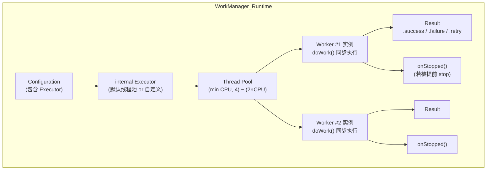

# 6.1.35 Worker 中的线程

雨声不知什么时候停了。

帐篷里只剩下笔记本风扇低低的嗡鸣，像一只睡着的猫在轻轻打呼噜。洛芙揉了揉眼睛，屏幕上的 RxJava 操作符图表还亮着，那些 flatMap、subscribeOn、observeOn 的箭头看了快两个小时，脑子里已经转不动了。

"还没睡啊。"

黛琳的声音从睡袋里传出来，闷闷的，带着一点困意。

"睡不着……RxWorker 那些线程的东西，我总觉得我好像还没完全想明白。"洛芙把笔记本往旁边挪了挪，膝盖蜷进外套里，"希尔姐姐说的那个 createWork 里的 RxJava 调度……那个是在哪条线程运行的，我画了个图但是不确定对不对……"

帐篷角发出一阵窸窸窣窣的声音。伊莎把睡袋的拉链拉开一半，探出脑袋来，头发乱得像一个鸟窝。

"什么图？给我看看。"

洛芙把笔记本转过去给伊莎看。屏幕上是一张手绘的简陋时序图：一条线标着"createWork()"，一条线标着"Observable.subscribe()"，还有几条虚线表示 subscribeOn 和 observeOn。

"嗯……"伊莎眯着眼睛看了几秒，"你把 RxJava 里的线程调度和 WorkManager 的线程模型混在一起了。"

"啊？"

"来，"黛琳干脆坐了起来，把睡袋裹在腰间，"既然都醒着，就把这个彻底搞清楚。RxWorker 是 RxJava 的适配层，但它底层调的也是 base Worker 的线程机制。今天晚上，我们先把 base Worker 的线程模型弄明白，RxWorker 的事情就简单了。"

希尔也醒了，正在帐篷另一头捣鼓手机的手电筒功能。一束白光打在天幕上，又弹下来，把四个人的脸都照得亮堂堂的。

"正好，我昨天刚整理了一张图，"希尔把手电筒往冰桶边缘一靠，卡住角度，让光洒在笔记本屏幕上，"你们看这个——Worker 的执行全流程。"

她打开笔记本，调出一个 Draw.io 绘制的图。白光在手绘图形上跳动。

```
┌─────────────────────────────────────────────────────────────────┐
│                        WorkManager 运行时                         │
│  ┌──────────────────────────────────────────────────────────┐   │
│  │                    internal Executor                       │   │
│  │  ┌────────────┐  ┌────────────┐  ┌────────────┐           │   │
│  │  │ Thread #1  │  │ Thread #2  │  │ Thread #3  │  ...      │   │
│  │  └─────┬──────┘  └─────┬──────┘  └────────────┘           │   │
│  │        │               │                                   │   │
│  │        ▼               ▼                                   │   │
│  │  ┌───────────┐   ┌───────────┐                            │   │
│  │  │ Worker #A │   │ Worker #B │   ← 每次实例化              │   │
│  │  │ doWork()  │   │ doWork()  │     运行一次，              │   │
│  │  └─────┬─────┘   └─────┬─────┘     同步执行直到返回        │   │
│  │        │               │                                   │   │
│  └────────┼───────────────┼───────────────────────────────────┘   │
│           │               │                                         │
│           ▼               ▼                                         │
│      Result.success()  Result.retry()   ←  决定是否重试              │
└─────────────────────────────────────────────────────────────────┘
```

"这是 WorkManager 内部的结构，"希尔用指尖点着屏幕，"外面这一圈是 WorkManager 的运行时，它维护着一个 internal Executor——就是一个线程池。 WorkManager 把 Worker 丢进这个线程池里跑。"

"等一下，"洛芙往前探了探身子，"所以 doWork() 不是在我自己 app 的主线程上跑，而是在 WorkManager 的线程池里跑？"

"对。WorkManager 在进程初始化的时候就开好了一个 Executor，默认是一个按需创建的线程池，核心线程数等于 CPU 核心数，最多能扩张到核心数的两倍。但是它有一个 30 秒的保活超时——如果线程空闲太久，就会被回收掉。"希尔把图放大了一点，"看这里，Worker 实例是每次 work 被调度的时候才 new 出来的，它只会被执行一次，然后就被丢弃了。所以 doWork() 里的代码是同步运行的，你不能在里面写一个无限循环等待某个事件，除非你把它升级成 foreground service。"

"同步运行……"洛芙在本子上记下来，"也就是说，doWork() 会一直阻塞到它 return 为止？"

"没错。这和 RxJava 的 observeOn 那种切换线程完全不一样——RxJava 是非阻塞的，你 subscribe 之后该干嘛干嘛，数据流在后台慢慢算。但是 Worker 的 doWork() 是阻塞的，你必须等它跑完，WorkManager 才认为这次 work 完成了。"黛琳拿过洛芙的本子，在旁边画了一个更简单的示意图：

```
┌──────────────────────────────────────────────────────┐
│  调用方（WorkManager 运行时）                         │
│                                                      │
│    startWork() ──────► [ Worker 实例 ]                │
│                              │                       │
│                              │ doWork() 同步执行      │
│                              │ （阻塞，直到 return）   │
│                              ▼                       │
│                         Result.success()             │
│                         Result.failure()             │
│                         Result.retry()               │
│                                                      │
│    ◄──────────────── 返回 Result                      │
└──────────────────────────────────────────────────────┘
```

"这个图很清楚，"伊莎轻声说，"doWork() 就像你往篝火里扔了一块柴，从你松手那一刻起，你就只能等它烧完——不能中途把火灭掉，也不能换一块柴。WorkManager 也是这样，一旦 Worker 开始跑，你就只能等它跑完或者被系统 stop掉。"

"那如果跑一半被 stop 了呢？"洛芙问。

"问得好。"黛琳点了点头，"这就引出另一个重要的回调——onStopped()。"

她翻开笔记本的下一页：

```
┌─────────────────────────────────────────────────────────────┐
│  Worker 生命周期                                             │
│                                                              │
│  ┌─────────┐    run()    ┌─────────────┐                   │
│  │  空闲中   │ ─────────► │  执行中 (RUNNING) │              │
│  └─────────┘             │   doWork()       │              │
│                         │   onStopped() ◄──┘  (如果被中断)  │
│                         └─────────┬─────────┘               │
│                                   │ return Result          │
│                                   ▼                         │
│                         ┌─────────────────┐                │
│                         │   完成 (SUCCEEDED│                │
│                         │    FAILED /     │                │
│                         │    BLOCKED)     │                │
│                         └─────────────────┘                │
└─────────────────────────────────────────────────────────────┘
```

"当一个正在运行的 Worker 因为任何原因被系统停止——比如用户把你的 app 从最近任务里划掉了，或者设备内存紧张系统要回收——WorkManager 会调用 Worker 的 onStopped() 方法。"黛琳用笔尖点了点这个回调，"这个回调是让你做一些清理工作的，比如关闭数据库连接、取消通知、停止轮询。但是注意，这时候 doWork() 已经不在跑了，它的返回值会被 WorkManager 忽略，所以你在 onStopped() 里不管你返回什么，都不会改变这次 work 的最终结果。"

"这有点像……我正在烤棉花糖，突然下雨了，篝火被浇灭了？"洛芙试着理解，"onStopped() 就是我赶紧把棉花糖从火边拿走，别让它烧焦？"

"这个比喻不算差，"希尔嘴角动了动，"不过你拿走的不是棉花糖，是消防工具。清理工作的目的不是拯救 doWork()，而是不留下烂摊子。"

希尔把笔记本转过来，开始敲代码。

"来，实际看一下 Worker 长什么样。这是最简单的下载网页内容 Worker："

```kotlin
// ━━━━━━━━━━━━━━━━ 代码片段 A：最简单的 Worker 实现 ━━━━━━━━━━━━━━━━
// 文件：DownloadWorker.kt
// 依赖：androidx.work:work-runtime-ktx:2.9.0

class DownloadWorker(
    context: Context,
    params: WorkerParameters
) : Worker(context, params) {

    // doWork() 在后台线程同步执行
    // 返回值决定这次 work 是成功、失败、还是重试
    override fun doWork(): Result {
        val url = inputData.getString("url") ?: return Result.failure()
        return try {
            // ⚠️ 这里运行在 WorkManager 的后台线程池，不是主线程
            // 所以可以执行网络请求，不会触发 NetworkOnMainThreadException
            val content = download(url)
            val outputData = workDataOf("content" to content)
            Result.success(outputData)
        } catch (e: Exception) {
            // 网络出错，尝试重试（最多 WorkManager.DEFAULT_BACKOFF_DELAY_MILLIS）
            if (runAttemptCount < 3) {
                Result.retry()
            } else {
                Result.failure(workDataOf("error" to e.message))
            }
        }
    }

    // 辅助方法：执行实际的下载
    private fun download(url: String): String {
        // 伪实现：实际项目请使用 OkHttp / Retrofit
        val connection = java.net.URL(url).openConnection() as java.net.HttpURLConnection
        return connection.inputStream.bufferedReader().readText()
    }
}
```

"这段代码有几个要点，"希尔停下来等大家看屏幕，"第一，doWork() 的返回值是 Result 类型，success、failure、retry 三种。retry 会让 WorkManager 按指数退避重新调度，failure 就永久结束了。第二，inputData 是传入的键值对参数，outputData 是返回的结果数据，它们通过 Data 对象传递，跨进程序列化，所以只能装基本类型和 String。第三，注释里写了——这里运行在后台线程，不是主线程，所以可以写网络请求。"

"那我想在一个 Worker 里同时做两件事呢？"洛芙举起手，"比如同时下载两个图片？"

"Worker 默认不帮你做并发，"黛琳说，"如果你的 doWork() 里开了两个线程，那确实可以同时跑两个任务，但 Worker 本身不知道你在做什么，它只是傻等 doWork() return。这种情况下你得自己管理线程，自己等待它们完成。而且，Worker 可能会被 stop——所以如果你在 doWork() 里起了后台线程做事情，被 stop 的时候那些线程可能还没跑完，你就需要在 onStopped() 里把它们取消掉。"

"好麻烦……"洛芙缩了缩脖子。

"所以 WorkManager 提供了别的方式处理需要并发的场景——ListenableWorker、CoroutineWorker、RxWorker——每个都有自己的线程策略，"黛琳翻开笔记本新的一页，"今天先说最基础的 Worker，下一章我们再聊 CoroutineWorker 和 RxWorker 的区别。现在先把这个搞懂。"

"那我如果想让一个 Worker 跑很久很久，比如持续监听传感器数据那种？"洛芙又问。

"这个问题问得好，"希尔拍了拍大腿，"这就是 setForegroundAsync() 要解决的问题。普通的 Worker 跑太久会被系统认为是后台偷电，系统可以单方面把它 kill 掉。但是如果你调用 setForegroundAsync()，WorkManager 会把你的 Worker 升级为一个前台服务来跑，系统就不会轻易 kill 它了——不过这也意味着你得在 manifest 里声明 FOREGROUND_SERVICE 权限。"

希尔翻出一张新的图：

```
┌─────────────────────────────────────────────────────────────────┐
│              Worker 类型与执行时长                                 │
│                                                                  │
│   普通 Worker                                                     │
│   ┌─────────────────────────────────────────┐                   │
│   │  doWork() 在后台线程池跑                  │ ← 系统可随时 kill  │
│   │  适合：网络请求、数据库写入、小文件处理     │                   │
│   └─────────────────────────────────────────┘                   │
│                                                                  │
│   Long-Running Worker (setForegroundAsync)                       │
│   ┌─────────────────────────────────────────┐                   │
│   │  升级为前台服务，系统保活                  │ ← 用户能看到通知   │
│   │  适合：持续数据同步、传感器监听、下载大文件 │                   │
│   └─────────────────────────────────────────┘                   │
└─────────────────────────────────────────────────────────────────┘
```

"前台服务会显示一个持久通知在通知栏里，就像音乐播放器那样，"伊莎补充说，"用户能知道你的 app 在后台干什么，所以这也是一种透明的信任建立。"

"那默认的 Executor 可以改吗？"洛芙盯着第一张图上的"internal Executor"方块，"如果我在 app 里已经自己建了一个线程池，想复用它呢？"

"可以的。"黛琳点头，"你可以把自定义的 Executor 传给 WorkManager 的配置。最常见的场景是：你想让某些 Worker 在单线程里排队执行，保证它们的顺序，不被其他 Worker 打断。"

她拿出手机，打开一个代码文件：

```kotlin
// ━━━━━━━━━━━━━━━━ 代码片段 B：自定义 Executor ━━━━━━━━━━━━━━━━
// 文件：WorkManagerConfig.kt
// 依赖：androidx.work:work-runtime-ktx:2.9.0

// 场景：单线程 Executor，保证所有 work 顺序执行，不被打断
val dedicatedExecutor = Executors.newSingleThreadExecutor { runnable ->
    Thread(runnable, "MyDedicatedWorkerThread").apply {
        // 设置为守护线程，当 app 主进程结束自动回收
        isDaemon = false
    }
}

// 在 Application 里初始化 WorkManager
class MyApplication : Application() {
    override fun onCreate() {
        super.onCreate()

        val config = Configuration.Builder()
            // 指定自定义 Executor（默认会使用 WorkManager 内部线程池）
            .setExecutor(dedicatedExecutor)
            // 设置日志级别，方便调试 Worker 生命周期
            .setMinimumLoggingLevel(android.util.Log.DEBUG)
            .build()

        WorkManager.initialize(this, config)
    }
}

// 使用自定义配置：创建 WorkRequest 时不传 Executor 参数
// 这个 OneTimeWorkRequest 会使用 Application 里配置的那个 dedicatedExecutor
val workRequest = OneTimeWorkRequestBuilder<MyWorker>()
    .build()

WorkManager.getInstance(context).enqueue(workRequest)
```

"单线程 Executor 的特点是所有 work 都排队，一个跑完才跑下一个。"黛琳用指尖在手机屏幕上划了一条弯曲的队列线，"但注意，如果你有好几个不同类型的 Worker，它们都会挤在这个单线程里——如果你其中一个 Worker 卡住了（比如死锁或者无限等待），整个队列都会堵死。所以单线程 Executor 适合那些你不希望并发的、有关联依赖的工作。"

"反过来说，"希尔接上话，"如果你想并行跑多个 Worker，默认的多线程 Executor 就更好。默认的线程池大小是 min(CPU核心数, 4)，最大能扩张到 2 倍。它的好处是充分利用多核 CPU，但缺点是如果多个 Worker 同时访问同一个资源（文件、数据库），可能会产生竞态条件。"

"所以……我需要根据工作类型选线程策略？"洛芙在本子上画了一栏表格。

"没错，这是工程判断，不是绝对的。"黛琳在本子上帮她补充完整：

```
线程策略选择指南
━━━━━━━━━━━━━━━━━━━━━━━━━━━━━━━━━━━━━━━━━━━━
工作类型              | 推荐 Executor     | 原因
━━━━━━━━━━━━━━━━━━━━━━━━━━━━━━━━━━━━━━━━━━━━
无关联的独立任务       | 默认多线程池       | 并行执行，效率高
有顺序依赖的工作链      | 单线程池           | 避免竞态，保证顺序
需要取消的高频任务     | 共享线程池+协程     | 协变覆盖，更灵活
长时运行（>10分钟）    | setForegroundAsync  | 系统保活
━━━━━━━━━━━━━━━━━━━━━━━━━━━━━━━━━━━━━━━━━━━━
```

帐篷外传来一阵风声，帐篷帆布被吹得鼓起来又瘪下去，像是有人在用巨大的肺呼吸。远处的山脚下，溪水的声音比刚才更响了一些，大概是夜深了水量显得更清澈。

"那我已经 WorkManager.initialize() 初始化了，还能换 Executor 吗？"洛芙突然想到一个问题。

"不能。"黛琳斩钉截铁，"WorkManager 一旦初始化就不能改配置，因为它的配置是单例的。你第二次调用 initialize() 会抛异常。如果你在调试的时候想临时换 Executor，得在测试代码里重新 build WorkManager 实例。"

"所以正确的做法是在 Application 的 onCreate() 里只初始化一次？"洛芙确认。

"对。Application.onCreate() 是初始化的正确位置，"黛琳点头，"而且 WorkManager 本身是懒加载的——你第一次调用 getInstance() 的时候它才真正初始化。所以如果你的 app 有多进程，一定要注意在每个进程都初始化一次 WorkManager，否则另一个进程拿到的可能是未初始化的状态。"

"多进程……"洛芙皱起眉头，"这个我们明天再说，今晚脑子已经装不下了。"

希尔啪地一声合上笔记本。

"来，最后一件事——反模式，"她竖起一根手指，"我见过有人这样写 Worker："

```kotlin
// ━━━━━━━━━━━━━━━━ 反模式：耗时操作没有取消逻辑 ━━━━━━━━━━━━━━━━
// 文件：BadWorker.kt

class BadWorker(
    context: Context,
    params: WorkerParameters
) : Worker(context, params) {

    override fun doWork(): Result {
        // ❌ 假设 doWork() 一定会跑完
        // 实际上 Worker 可能被 stop，这种无限循环会泄漏
        while (!isStopped) {
            val data = fetchLatestData()  // 持续轮询
            saveToDatabase(data)
            Thread.sleep(60_000) // 每分钟拉一次
        }
        return Result.success()
    }

    private fun fetchLatestData(): String { /* ... */ }
    private fun saveToDatabase(data: String) { /* ... */ }
}
```

"这个坏味道在于，"希尔用笔敲着屏幕，"Worker 被 stop 的时候，doWork() 并不会自动收到中断异常——isStopped 标志会被设置为 true，但你的 while 循环如果用了 Thread.sleep()，它会等 sleep 结束才会再检查一次。你可能白白等 60 秒才能退出。更糟糕的是，这个 Worker 会一直占用线程池里的一个线程，其他 work 只能等着。"

"重构后应该是这样的："

```kotlin
// ━━━━━━━━━━━━━━━━ 重构：正确的取消响应 + 单次执行 ━━━━━━━━━━━━━━━━
// 文件：GoodWorker.kt

class GoodWorker(
    context: Context,
    params: WorkerParameters
) : Worker(context, params) {

    override fun doWork(): Result {
        // ✅ 单次执行，不依赖 isStopped 做轮询
        // Worker 只跑一次，跑完就 return，系统不会 kill 正在运行的它
        // 如果需要重复执行，用 PeriodicWorkRequest
        return try {
            val data = fetchLatestData()
            saveToDatabase(data)
            Result.success(workDataOf("updated" to data))
        } catch (e: Exception) {
            // ✅ 异常时重试，捕获后清理
            cleanup()  // 资源释放
            Result.retry()
        }
    }

    // ✅ onStopped() 做兜底清理（不依赖 doWork() 是否跑完）
    override fun onStopped() {
        super.onStopped()
        // 关闭数据库连接、停止后台线程、取消通知等
        releaseResources()
    }

    private fun fetchLatestData(): String { /* ... */ }
    private fun saveToDatabase(data: String) { /* ... */ }
    private fun cleanup() { /* ... */ }
    private fun releaseResources() { /* ... */ }
}
```

"这个重构的原则是：**Worker 应该是一次性执行单元，不要在 doWork() 里写无限循环**。"希尔竖起两根手指，"如果你需要周期性执行，用 PeriodicWorkRequest，它会在约定的时间间隔重新触发 doWork()。如果你需要在后台持续运行，用 setForegroundAsync() 配合通知，同时处理好 onStopped() 的清理工作。"

洛芙盯着对比看了好一会儿，在本子上快速记下：不要在 doWork() 里写 while 循环。

"还有另一个常见错误，"黛琳补充，"在 doWork() 里更新 UI。这是初学者最常踩的坑，因为 doWork() 跑在后台线程，直接调用 runOnUiThread() 或者 view.post() 在代码上是可以通过的，但设计上完全错误——Worker 是用来处理后台任务的，不应该接触 UI。如果你想把 Worker 的结果反映到 UI 上，应该通过 LiveData、Flow 或者直接在 Activity 里 observe WorkInfo。"

"LiveData 和 Flow……"洛芙在本子上又记了一个星号，"我学过一点点，LiveData 可以观察 WorkManager 的 WorkInfo 对吧？"

"对，这是正确的联动方式。"黛琳微微笑了，"我们明天讲 CoroutineWorker 的时候可以把这个串起来，今晚先把 base Worker 的线程模型刻进脑子里。"

伊莎打了个哈欠，把睡袋拉链又拉上了一些。

"其实很好记，"她闭着眼睛说，"base Worker 的 doWork() 就是一个方法，在后台线程同步跑，跑完就 return 一个 Result，就这么简单。什么订阅、什么调度，都是后来封装出来的糖。根本在这里。"

"伊莎姐姐说得对，"洛芙把本子合上，"核心就是这么简单的一件事。doWork() 跑在后台，WorkManager 的 Executor 负责调度，Worker 跑完就死掉了。"

"明天我们说 CoroutineWorker，"黛琳躺回睡袋里，"那个会把 doWork() 变成一个 suspend 函数，在协程里跑，你就不能用 Thread.sleep() 了，得用 delay()。但背后的线程池还是那个 Executor，只是协程帮我们自动切换了线程。"

帐篷外的风渐渐小了。溪水的声音又清晰起来，像有人在用手指轻轻拨动一根很长的琴弦。洛芙把笔记本屏幕关掉，帐篷里一下子暗了下来，只有远处营地的路灯透过帐篷帆布缝隙漏进来的一点橙黄色的光。

"我想明天早上起来看日出，"洛芙小声说，"如果天好的话。"

"那得看云给不给你面子。"希尔嘟囔了一句，已经把头埋进了睡袋里。

"晚安。"伊莎轻声说。

"晚安。"

---

## 专业技术总结

> Worker 是 WorkManager 四种 work primitives（Worker、CoroutineWorker、RxWorker、ListenableWorker）中最基础的一种，其 `doWork()` 方法在**后台线程**由 **WorkManager 内部 Executor** 同步调用执行。Executor 默认由 WorkManager 自动配置，开发者可通过 `Configuration.Builder().setExecutor()` 替换为自定义线程池。长时运行 Worker（>10分钟）需调用 `setForegroundAsync()` 将其升级为前台服务，以获得系统保活保护。被系统停止时 `onStopped()` 回调触发，用于清理资源，但此时 `doWork()` 的返回值已被忽略。

#### 结构图



#### 复杂度与影响

| 维度 | 默认 Executor | 自定义单线程 Executor |
|------|-------------|-------------------|
| 吞吐量 | 高（并行执行） | 低（串行执行） |
| 资源占用 | 随 Worker 数量动态扩缩 | 固定 1 线程 |
| 适用场景 | 独立、无关联后台任务 | 有顺序依赖的工作链 |
| 风险 | 多 Worker 同时访问共享资源产生竞态 | 单个 Worker 卡死导致队列阻塞 |

#### 反模式与陷阱

1. **在 `doWork()` 内写无限循环轮询** → 改用 `PeriodicWorkRequest`（定时重复触发）或 `setForegroundAsync()`（长时服务）
2. **`doWork()` 内使用 `Thread.sleep()`** → 响应 `isStopped` 延迟最多一个睡眠周期，改用 `setForegroundAsync()` 场景下正确取消
3. **在 `doWork()` 里直接更新 UI** → 通过 LiveData/Flow 观察 `WorkInfo` 间接桥接
4. **忘记覆写 `onStopped()` 做清理** → 数据库连接、网络连接、后台线程未被释放，导致资源泄漏
5. **多进程 app 只初始化一次 WorkManager** → 另一进程获取未初始化实例导致未定义行为

#### 设计哲学

**WorkManager 的线程模型设计核心是"把线程控制权交还给系统"**。通过内置线程池，WorkManager 能够统一管理所有 work 的调度策略（重试次数、退避延迟、系统低内存时的 worker 回收）。开发者不需要自己管理线程生命周期，只需要专注于 `doWork()` 的业务逻辑。这种设计体现了"**让系统做系统该做的事**"的原则：何时回收线程、是否压缩并行度、如何在低内存时保活——这些全部由 WorkManager 的 internal Executor 决策。

实践建议：

- `doWork()` 应该**幂等**（可以安全重跑），因为 WorkManager 可能重试
- 优先让 Worker **职责单一**（一个 Worker 做一件事），便于错误定位
- 用 `inputData`/`outputData` 传递数据，避免在 Worker 内持有大对象引用导致内存泄漏
- 调试 Worker 时打开 `setMinimumLoggingLevel(Log.DEBUG)`，观察 Worker 的生命周期事件

---

#### 🏕️ 动手练习

**目标**：创建一个自定义 Worker，在后台线程下载网页内容并写入本地文件，观察 WorkManager 线程模型的实际行为。

**你需要做的事**：

1. 在 Android Studio 创建新项目（Empty Activity，Language=Kotlin，minSdk=24）
2. 在 `build.gradle.kts (app)` 添加依赖：`implementation("androidx.work:work-runtime-ktx:2.9.0")`
3. 在 `AndroidManifest.xml` 添加权限：`<uses-permission android:name="android.permission.INTERNET" />`
4. 新建 `DownloadWorker.kt`继承 `Worker`，实现 `doWork()`：
   - 从 `inputData` 读取 key 为 `"url"` 的 String 参数
   - 使用 `java.net.URL(url).openConnection()` 下载内容（运行在后台线程，可直接写网络请求）
   - 将下载内容写入 app 内部存储（`context.filesDir`）
   - 返回 `Result.success(workDataOf("filepath" to 绝对路径))`
5. 在 `MainActivity` 的 `onCreate()` 中 `WorkManager.initialize()`（使用默认配置）
6. 创建 `OneTimeWorkRequestBuilder<DownloadWorker>()`，通过 `.setInputData(workDataOf("url" to "https://example.com"))` 传入 URL
7. 调用 `WorkManager.getInstance(this).enqueue(workRequest)`
8. 添加 `Log.d("WorkerThread", "isMainThread=${Looper.myLooper() == Looper.getMainLooper()}")` 在 `doWork()` 首行，验证线程
9. 在 `onDestroy()` 或按钮点击时，通过 `WorkManager.getInstance().getWorkInfoByIdLiveData(uuid)` 观察 `WorkInfo` 状态变化并打印
10. 运行 app，在 Logcat filter `WorkerThread` 观察输出；截图记录状态变化（ENQUEUED→RUNNING→SUCCEEDED）

**验收标准**：

- [ ] Logcat 输出显示 `isMainThread=false`（证明 doWork() 跑在后台线程）
- [ ] 设备上 `filesDir` 目录下成功生成下载的 HTML 文件
- [ ] LiveData 观察到 WORK_STATE 依次经过 ENQUEUED → RUNNING → SUCCEEDED
- [ ] 当 app 被切到后台（按 Home 键），Worker 仍然继续执行并最终成功
- [ ] 实现了 `override fun onStopped()` 并在其中打印清理日志

**提示代码片段**：

```kotlin
// 在 DownloadWorker.doWork() 首行添加
Log.d("WorkerThread", "Thread name: ${Thread.currentThread().name}")
Log.d("WorkerThread", "isMainThread=${Looper.myLooper() == Looper.getMainLooper()}")

// 在 MainActivity 中观察 WorkInfo
WorkManager.getInstance(this).getWorkInfoByIdLiveData(workRequest.id)
    .observe(this) { workInfo ->
        Log.d("WorkInfo", "State: ${workInfo?.state}")
        // WORK_STATE: ENQUEUED → RUNNING → SUCCEEDED / FAILED
    }
```

**面试热身**：

- Q1：Worker 的 `doWork()` 和 CoroutineWorker 的 `doWork()` 有什么区别？
- Q2：如果一个 Worker 执行到一半被系统 stop 了，`doWork()` 里的代码会收到什么信号？会立即中断吗？
- Q3：默认的 WorkManager Executor 有几个线程？什么时候会扩容？
- Q4：什么情况下 Worker 需要调用 `setForegroundAsync()`？调用后还需要返回 Result 吗？
- Q5：为什么说 Worker 应该是"幂等"的？如果你的 Worker 里写了数据库插入，重试的时候会发生什么？

**参考实现要点**：

1. `doWork()` 是**同步阻塞**的，不要在里面写 suspend 函数或调用阻塞在 UI 线程的操作
2. `WorkManager.initialize()` 在 Application 类做，只做一次，多进程 app 需要在各进程分别初始化
3. `inputData`/`outputData` 的 Data 对象有大小限制（`Data.MAX_DATA_BYTES` = 10KB），大文件路径用 String 返回，不要把文件内容直接序列化
4. `WorkerParameters` 提供了 `runAttemptCount`（当前重试次数）和 `workingDaysSinceLastAttempt` 等上下文信息
5. 单元测试 Worker 用 `WorkManagerTestInitHelper.getTestDriver().setLifecycleEventDelay()` 模拟生命周期

---

> 学习建议

Worker's threading model 是整个 WorkManager 体系的根基。理解 `doWork()` 同步执行、Result 决定重试策略、`onStopped()` 做清理这三个核心概念后，再去学 CoroutineWorker（协程封装）和 RxWorker（RxJava 封装）就会发现——它们只是帮你省去手动管理线程的语法糖，底层的线程调度逻辑完全一样。建议在 Android Studio 里实际创建一个 Worker，运行后用 `adb shell ps -A | grep <package>` 观察它的进程，然后通过 Logcat filter `WorkManager:` 来看它的生命周期日志。亲手跑一遍比看十遍文档都清晰。

## 洛芙的小小日记本

黛琳说 base Worker 的 doWork() 就是一个普通方法，希尔姐姐说它跑完就死掉了——我觉得我终于抓住 RxWorker 的尾巴了。RxJava 只是套在 Worker 外面的一层皮，里面的线还是那条 Executor。明天要学 CoroutineWorker，不知道协程会怎么包装这个线程模型。有点期待。

## 今日关键词

- **Worker**：WorkManager 四种 work primitives 中最基础的一种，其 `doWork()` 方法在后台线程同步执行，执行完毕后返回 Result。
- **doWork()**：Worker 的核心抽象方法，运行在 WorkManager 提供的后台线程池中，必须是**同步阻塞**的，返回值类型为 `Result`。
- **Result**：doWork() 的返回值类型，`Result.success(data)` 表示成功，`Result.failure(data)` 表示永久失败，`Result.retry()` 表示应重新调度。
- **Executor**：Java 标准库的线程池接口，WorkManager 使用内部 `Executor` 来分发 Worker 的执行。默认实现为按需扩张的线程池。
- **setForegroundAsync()**：将普通 Worker 升级为长时运行前台服务的 API，调用后 WorkManager 会显示持久通知，系统不再轻易 kill 该 Worker。
- **onStopped()**：Worker 被系统提前停止时调用的回调，用于清理资源（如关闭数据库连接、取消后台线程）。此时 doWork() 的返回值已被忽略。
- **WorkInfo**：封装某个 WorkRequest 运行时状态的不可变数据类，通过 LiveData 或 Flow 观察其 `state`（ENQUEUED / RUNNING / SUCCEEDED / FAILED 等）。
- **Configuration**：WorkManager 的全局配置类，通过 `Configuration.Builder()` 设置自定义 Executor、日志级别等参数。
- **runAttemptCount**：WorkerParameters 中提供的字段，表示当前 work 已经被重试的次数。
- **Data**：WorkManager 中用于在 work 请求和结果之间传递键值对数据的类型，大小上限为 10KB。
- **WorkRequest**：定义单个 work 任务的请求基类，`OneTimeWorkRequest` 执行一次，`PeriodicWorkRequest` 按固定间隔重复执行。
- **ListenableWorker**：四种 Worker 类型的抽象基类（Java 友好），通过 `ListenableFuture` 处理异步结果。
- **CoroutineWorker**：基于协程封装的 Worker 类型，`doWork()` 为 suspend 函数，协程自动管理线程切换。
- **RxWorker**：基于 RxJava 封装的 Worker 类型，通过 `createWork()` 返回 Observable，配合 `getBackgroundScheduler()` 控制 RxJava 线程。
- **Thread pool size**：WorkManager 默认 Executor 的线程池大小策略为 `min(available CPUs, 4)` 到 `min(available CPUs × 2, 8)`。
