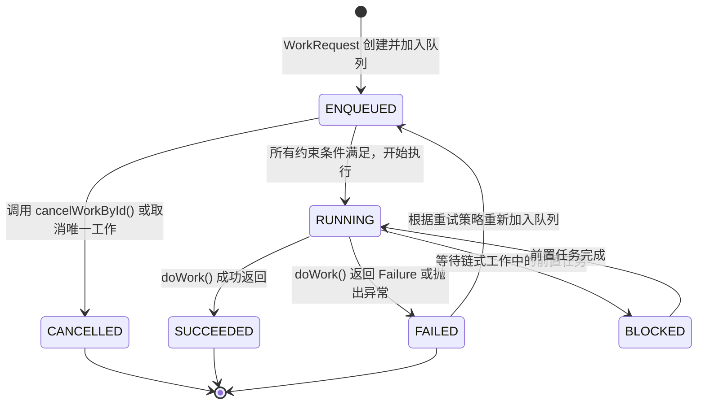
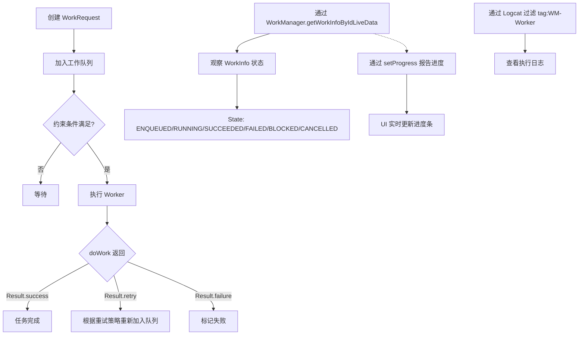

# 6.1.36 调试工作管理器

帐篷外的风渐渐小了，远处的山峰轮廓在暮色中愈发清晰。黛琳合上笔记本电脑，伸了个懒腰，转头看向洛芙。

“洛芙，上次我们讲的唤醒锁调试还记得吗？”

洛芙点点头：“记得！要用 Battery Settings 看后台活动，用 Logcat 查 wake lock 的标签。”

“很好。”黛琳微微一笑，“那今天我们来玩点更高级的——调试 WorkManager。”

“WorkManager？”洛芙眨眨眼，“就是那个……帮我们在后台干活的工具？”

“对，就是它。”希尔从背包里翻出一根能量棒，撕开包装纸说，“WorkManager 会把任务持久化保存，就算手机重启了，任务也不会丢。但是呢，这就带来了一个问题——”

“什么问题？”洛芙好奇地问。

“问题就是——任务在后台偷偷跑，我们看不见呀。”希尔把能量棒咬在嘴里，含糊地说，“所以今天要学的，就是怎么'看见'它们在工作。”

伊莎端着一杯热茶过来，在洛芙旁边坐下，柔声说：“就好比我们在营地里烤肉，肉在火上滋滋作响，我们能闻到香味、能听到声音。但是 WorkManager 的工作呢，是在手机的后台进行的，我们怎么'听'到它、'看到'它呢？”

洛芙眼睛一亮：“所以今天是要学怎么给 WorkManager 装一个'监听器’？”

“差不多是这个意思。”黛琳重新打开笔记本电脑，“我们开始吧。”

---

## 问题发现

黛琳调出之前写的代码，那是一个使用 WorkManager 定期同步数据的示例。她指着屏幕说：“洛芙，你看这个 SyncWorker，我们之前写过，对吧？”

洛芙凑近屏幕：“嗯！就是一个定时同步数据的 Worker，每隔一小时运行一次。”

“对。但是现在有一个问题——”黛琳调出 Logcat，指着里面的一大串日志说，“你看，这些 'WM-Worker' 开头的日志，就是 WorkManager 内部打出来的。你能找到什么有用的信息吗？”

洛芙眯起眼睛仔细看：“嗯……这里写着 'Starting work for xxx'……这里写着 'Worker xxx finished successfully'……还有这里——”她突然停下来，“咦？这个 'RetryableException' 是什么？”

“问得好！”希尔凑过来，指着那个异常说，“这就是我们今天要解决的核心问题——WorkManager 的任务失败了，我们要怎么调试它？”

洛芙皱起眉头：“任务失败了……那它会重试吗？”

“会啊，WorkManager 有内置的重试机制。”黛琳点点头，“但是默认的重试策略可能不符合我们的需求，而且我们很难看到任务失败的具体原因。”

“那怎么办？”洛芙问。

伊莎轻轻拍了拍洛芙的手背：“所以呀，我们要学会用 WorkManager 提供的调试工具——比如查看 WorkInfo、监听任务状态、还有设置自定义的回调。”

“听起来好有用！”洛芙搓搓手，“学姐们，快教我吧！”

---

## 正文知识讲解

### 1.1 认识 WorkManager 的内部日志

黛琳打开 Logcat 的过滤器设置，说：“洛芙，你首先需要知道，WorkManager 会输出很多有用的日志。这些日志的标签都以 'WM-' 开头，代表 'WorkManager'。”

她指着屏幕上的日志，继续说：“你看这几个常见的标签——”

- **WM-WorkManager**：WorkManager 核心组件的日志
- **WM-Worker**：具体 Worker 执行时的日志
- **WM-PackageManagerDelegate**：包管理器相关的日志

“这些日志会告诉我们很多信息。”黛琳调高音量，“比如这条——”

```
WM-Worker: Starting work for com.example.app.SyncWorker
```

“这告诉我们，WorkManager 正在开始执行 SyncWorker。”

洛芙赶紧记下来：“那失败的日志呢？”

黛琳往下翻，找出一条红色的错误日志：

```
WM-Worker: WorkWorker failed for WorkSpec{id: xxx, ...}
java.io.IOException: Network unavailable
```

“你看，失败的时候，WorkManager 会把异常信息打印出来。”黛琳说，“这个异常告诉我们——网络不可用。”

洛芙若有所思：“所以我们可以通过 Logcat 看到 Worker 是成功还是失败？”

“对，这只是第一步。”黛琳点点头，“但是有时候，日志太多了，我们想只看某一个特定的 Worker，这时候该怎么办呢？”

---

### 1.2 使用 tag 过滤特定 Worker 的日志

黛琳在 Logcat 的过滤框里输入 `tag:WM-Worker xxx`，解释道：“我们可以用 tag 过滤器来只看某个特定 Worker 的日志。xxx 是 Worker 的名字或者我们给 Worker 设置的 tag。”

“tag？”洛芙问，“就是给 Worker 起的别名吗？”

“对，我们在创建 WorkRequest 的时候，可以给 Worker 设置 tag。”黛琳调出代码示例：

```kotlin
// 创建 SyncWorker 的 OneTimeWorkRequest，并添加 tag
val syncRequest = OneTimeWorkRequestBuilder<SyncWorker>()
    .addTag("sync_data")  // 添加 tag，用于过滤日志
    .build()

// 还可以添加多个 tag
val requestWithTags = OneTimeWorkRequestBuilder<SyncWorker>()
    .addTag("network")
    .addTag("periodic")
    .addTag("important")
    .build()
```

“这样，我们就可以用 `tag:WM-Worker sync_data` 来只过滤出 SyncWorker 的日志。”黛琳补充道。

洛芙试着用手指在空气中比划：“好像给 Worker 贴了标签，然后用这个标签去找它的日志记录……我明白了！”

希尔打了个响指：“没错！这就是第一层调试——用 Logcat 看日志。但是有时候，我们需要在代码里实时知道任务的状态，该怎么办呢？”

---

### 1.3 监听 WorkInfo 状态变化

黛琳新建一个 Kotlin 文件，说：“这就涉及到另一个重要的调试工具——WorkInfo。WorkManager 会记录每个 WorkRequest 的状态，我们可以通过 WorkInfo 来实时监听。”

她写出第一段代码：

```kotlin
// 通过 WorkManager 获取指定 WorkRequest 的 WorkInfo
val workManager = WorkManager.getInstance(applicationContext)

// 根据 WorkRequest 的 ID 获取 WorkInfo 观察者
val workInfoLiveData = workManager.getWorkInfoByIdLiveData(syncRequest.id)

// 在 Activity/Fragment 中观察状态变化
workInfoLiveData.observe(this) { workInfo ->
    when (workInfo.state) {
        WorkInfo.State.ENQUEUED -> Log.d("SyncWorker", "任务已加入队列")
        WorkInfo.State.RUNNING -> Log.d("SyncWorker", "任务正在执行")
        WorkInfo.State.SUCCEEDED -> Log.d("SyncWorker", "任务成功完成")
        WorkInfo.State.FAILED -> {
            Log.e("SyncWorker", "任务失败")
            // 获取失败原因
            val failureReasons = workInfo.outputData.getStringArray("failure_reasons")
        }
        WorkInfo.State.BLOCKED -> Log.d("SyncWorker", "任务被阻塞，等待前置条件")
        WorkInfo.State.CANCELLED -> Log.d("SyncWorker", "任务被取消")
    }
}
```

洛芙仔细看完，提问：“这个 WorkInfo.State 有好几种状态……它们之间是怎么转换的？”

黛琳点点头，画出一个状态图：



“这个图展示了一个 Worker 的生命周期。”黛琳解释道，“我们可以看到，任务可能在不同的状态之间转换。”

伊莎递过来一杯热可可，说：“就好比我们在露营时做饭——先把食材准备好（ENQUEUED），然后点火开始炒（RUNNING），炒好了就端上桌（SUCCEEDED），如果炒糊了就要重做（FAILED 之后根据重试策略重新 ENQUEUED）。”

洛芙笑着说：“这样我就理解了！那我们怎么知道任务失败的具体原因呢？”

---

### 1.4 获取任务失败的详细信息

黛琳调出另一段代码，说：“当任务失败时，我们可以从 WorkInfo 中获取详细的失败信息。”

```kotlin
// 在 Worker 的 doWork() 方法中，我们可以返回自定义的输出数据
class SyncWorker(context: Context, workerParams: WorkerParameters) :
    CoroutineWorker(context, workerParams) {

    override suspend fun doWork(): Result {
        return try {
            val data = syncFromServer()
            
            // 成功时返回包含数据的 Result
            Result.success(
                workDataOf(
                    "sync_count" to data.count,
                    "last_sync_time" to System.currentTimeMillis()
                )
            )
        } catch (e: IOException) {
            // 失败时返回失败信息
            Result.failure(
                workDataOf(
                    "error_message" to (e.message ?: "Unknown error"),
                    "error_type" to "NetworkError",
                    "retry_count" to runAttemptCount  // 当前重试次数
                )
            )
        }
    }
}

// 在观察 WorkInfo 时获取失败信息
workInfoLiveData.observe(this) { workInfo ->
    if (workInfo.state == WorkInfo.State.FAILED) {
        val errorMessage = workInfo.outputData.getString("error_message")
        val errorType = workInfo.outputData.getString("error_type")
        val retryCount = workInfo.outputData.getInt("retry_count", 0)
        
        Log.e("SyncWorker", "失败原因: $errorMessage, 类型: $errorType, 已重试: $retryCount 次")
    }
}
```

“原来失败的时候可以传这么多信息！”洛芙感叹道。

希尔补充道：“还有更重要的——我们可以自定义重试策略！”

---

### 1.5 自定义重试策略

黛琳打开另一个代码示例：“默认情况下，WorkManager 会以指数退避策略重试失败的任务。但我们可以自定义这个策略。”

```kotlin
// 设置自定义重试策略
val retryRequest = OneTimeWorkRequestBuilder<SyncWorker>()
    .setBackoffCriteria(
        BackoffPolicy.EXPONENTIAL,  // 指数退避：1秒 → 2秒 → 4秒 → 8秒...
        10,  // 最小退避时间：10秒
        TimeUnit.SECONDS
    )
    // 还可以设置重试次数上限
    .setConstraints(
        Constraints.Builder()
            .setRequiredNetworkType(NetworkType.CONNECTED)
            .build()
    )
    .build()

// 或者使用线性退避
val linearRequest = OneTimeWorkRequestBuilder<SyncWorker>()
    .setBackoffCriteria(
        BackoffPolicy.LINEAR,  // 线性退避：10秒 → 20秒 → 30秒...
        10,
        TimeUnit.SECONDS
    )
    .build()

// 不重试，立即失败
val noRetryRequest = OneTimeWorkRequestBuilder<SyncWorker>()
    .setBackoffCriteria(
        BackoffPolicy.LEGACY,  // 立即重试（不推荐）
        1,
        TimeUnit.SECONDS
    )
    // 另一种方式：在 Worker 中返回 Result.failure() 后不再重试
    // 需要在 Worker 中判断是否还要重试
    .build()
```

洛芙好奇地问：“这个 BackoffPolicy.LINEAR 和 EXPONENTIAL 有什么区别？”

黛琳画出一个对比图：

```mermaid
xychart-beta
    title "重试间隔对比 (初始 10 秒)"
    x-axis "重试次数" [1, 2, 3, 4, 5]
    y-axis "间隔 (秒)" 0 --> 60
    bar [10, 20, 30, 40, 50]
    bar [10, 20, 40, 80, 160]
```



“左边是线性（LINEAR），每次增加固定的 10 秒；右边是指数（EXPONICAL），每次翻倍。”黛琳解释道，“对于网络请求，通常推荐用指数退避，因为网络问题可能需要更长时间恢复。”

---

### 1.6 观察多个 Worker 的状态

“如果我们同时运行多个 Worker，想知道它们的状态，该怎么办？”洛芙问。

黛琳笑着说：“问得好！WorkManager 提供了方法来观察多个 Worker。”

```kotlin
// 观察所有带有特定 tag 的 Worker
val tagWorkInfos = workManager.getWorkInfosByTagLiveData("sync_data")
tagWorkInfos.observe(this) { workInfoList ->
    workInfoList.forEach { workInfo ->
        Log.d("SyncWorker", "Worker ${workInfo.id}: ${workInfo.state}")
    }
}

// 观察唯一工作（Unique Work）的状态
val uniqueWorkLiveData = workManager.getWorkInfosForUniqueWorkLiveData("periodic_sync")
uniqueWorkLiveData.observe(this) { workInfoList ->
    workInfoList.forEach { workInfo ->
        when (workInfo.state) {
            WorkInfo.State.ENQUEUED -> Log.d("UniqueWork", "等待执行")
            WorkInfo.State.RUNNING -> {
                // 获取进度信息
                val progress = workInfo.progress.getInt("progress", 0)
                Log.d("UniqueWork", "正在执行，进度: $progress%")
            }
            else -> Log.d("UniqueWork", "状态: ${workInfo.state}")
        }
    }
}

// 观察所有正在运行的 Worker
val allWorkLiveData = workManager.getWorkInfosLiveData(
    WorkQuery.Builder
        .fromStates(listOf(WorkInfo.State.RUNNING))
        .build()
)
allWorkLiveData.observe(this) { runningWorkList ->
    Log.d("WorkManager", "当前正在运行的 Worker 数量: ${runningWorkList.size}")
}
```

洛芙把这些代码仔细看了一遍：“这些方法都好有用！那……如果我们想看 Worker 的进度呢？”

---

### 1.7 报告 Worker 执行进度

黛琳打了个响指：“这就涉及到进度报告了！我们可以用 setProgress() 方法来报告 Worker 的执行进度。”

```kotlin
class DownloadWorker(context: Context, workerParams: WorkerParameters) :
    CoroutineWorker(context, workerParams) {

    override suspend fun doWork(): Result {
        val totalFiles = 10
        var downloadedFiles = 0

        fileList.forEach { file ->
            // 设置进度
            setProgress(
                workDataOf(
                    "progress" to (downloadedFiles * 100 / totalFiles),
                    "current_file" to file.name,
                    "downloaded" to downloadedFiles,
                    "total" to totalFiles
                )
            )

            // 下载文件
            downloadFile(file)
            downloadedFiles++
        }

        return Result.success(
            workDataOf("total_downloaded" to totalFiles)
        )
    }
}

// 在 UI 中观察进度
val workInfoLiveData = workManager.getWorkInfoByIdLiveData(downloadRequest.id)
workInfoLiveData.observe(this) { workInfo ->
    if (workInfo.state == WorkInfo.State.RUNNING) {
        val progress = workInfo.progress.getInt("progress", 0)
        val currentFile = workInfo.progress.getString("current_file") ?: ""
        
        progressBar.progress = progress
        statusText.text = "正在下载: $currentFile ($progress%)"
    }
}
```

伊莎轻轻拍手：“这样，用户就能看到下载的进度了！”

洛芙兴奋地说：“好像在游戏里看加载条一样！”

---

### 1.8 反模式：忘记释放资源

希尔突然严肃起来：“洛芙，我再教你一个重要的反模式。”

她调出代码：

```kotlin
// 反模式：错误的实现
class BadWorker(context: Context, workerParams: WorkerParameters) :
    CoroutineWorker(context, workerParams) {

    override suspend fun doWork(): Result {
        // 每次都创建新的数据库连接，从不关闭
        val db = AppDatabase.getInstance(applicationContext)
        
        // 每次都创建新的网络连接
        val client = OkHttpClient()
        
        // 没有清理资源
        return Result.success()
    }
}

// 正确的实现
class GoodWorker(context: Context, workerParams: WorkerParameters) :
    CoroutineWorker(context, workerParams) {

    override suspend fun doWork(): Result {
        // 使用协程作用域管理资源
        coroutineScope {
            // 数据库操作使用单例或依赖注入
            val db = AppDatabase.getInstance(applicationContext)
            
            // 网络请求使用单例 OkHttpClient
            val client = NetworkClient.httpClient
            
            // 确保资源在协程结束时被正确释放
            try {
                val result = doSync(db, client)
                Result.success(result)
            } catch (e: Exception) {
                Log.e("Worker", "同步失败", e)
                Result.failure()
            }
        }
    }
}
```

“看到这个反模式了吗？”希尔说，“在 Worker 里创建资源但不释放，会导致内存泄漏！”

洛芙认真点头：“我记下了！要用单例，要正确管理资源！”

---

### 1.9 调试持久化工作的特殊技巧

黛琳最后补充道：“对于持久化工作（就是那些会跨进程、跨应用重启的任务），我们还有一些特殊的调试技巧。”

```kotlin
// 列出所有正在运行的工作（调试用）
suspend fun debugAllWork() {
    val workInfos = workManager.workInfosForUniqueWorkKeysSync()
    workInfos.forEach { (key, infos) ->
        Log.d("WorkManager", "=== UniqueWork: $key ===")
        infos.forEach { info ->
            Log.d("WorkManager", "  ID: ${info.id}")
            Log.d("WorkManager", "  State: ${info.state}")
            Log.d("WorkManager", "  Tags: ${info.tags}")
            Log.d("WorkManager", "  RunAttemptCount: ${info.runAttemptCount}")
        }
    }
}

// 查看工作规范（WorkSpec）详情
suspend fun debugWorkSpec(workId: UUID) {
    val workInfo = workManager.getWorkInfoById(workId).get()
    Log.d("WorkManager", "WorkSpec ID: ${workInfo.id}")
    Log.d("WorkManager", "State: ${workInfo.state}")
    
    // 工作元数据
    Log.d("WorkManager", "Tags: ${workInfo.tags}")
    Log.d("WorkManager", "RunAttemptCount: ${workInfo.runAttemptCount}")
    
    // 输出数据
    if (workInfo.outputData.size() > 0) {
        Log.d("WorkManager", "OutputData: ${workInfo.outputData.keyValueMap}")
    }
}

// 强制取消并清除工作
fun forceCancelWork(workId: UUID) {
    workManager.cancelWorkById(workId)
    // 如果需要彻底清除
    workManager.pruneWork()
}
```

“这些调试方法在我们遇到棘手的问题时非常有用。”黛琳总结道。

---

### 1.10 综合示例：完整的调试流程

希尔把所有的代码整合在一起，展示了一个完整的调试流程：

```kotlin
class SyncManager(private val context: Context) {
    private val workManager = WorkManager.getInstance(context)

    // 1. 启动带调试信息的 Worker
    fun startSync() {
        val syncRequest = OneTimeWorkRequestBuilder<SyncWorker>()
            .addTag("sync")
            .addTag("debug")
            .setBackoffCriteria(BackoffPolicy.EXPONENTIAL, 30, TimeUnit.SECONDS)
            .build()

        workManager.enqueue(syncRequest)
        
        Log.d("SyncManager", "启动同步任务: ${syncRequest.id}")
        
        // 开始观察状态
        observeWork(syncRequest.id)
    }

    // 2. 观察 Worker 状态
    private fun observeWork(workId: UUID) {
        workManager.getWorkInfoByIdLiveData(workId).observeForever { workInfo ->
            when (workInfo?.state) {
                WorkInfo.State.ENQUEUED -> {
                    Log.d("SyncManager", "任务已加入队列，等待执行")
                }
                WorkInfo.State.RUNNING -> {
                    val progress = workInfo.progress.getInt("progress", 0)
                    Log.d("SyncManager", "任务正在执行，进度: $progress%")
                }
                WorkInfo.State.SUCCEEDED -> {
                    val syncCount = workInfo.outputData.getInt("sync_count", 0)
                    Log.d("SyncManager", "任务成功完成，同步了 $syncCount 条数据")
                }
                WorkInfo.State.FAILED -> {
                    val errorMsg = workInfo.outputData.getString("error_message")
                    val retryCount = workInfo.runAttemptCount
                    Log.e("SyncManager", "任务失败: $errorMsg, 已重试 $retryCount 次")
                }
                WorkInfo.State.CANCELLED -> {
                    Log.d("SyncManager", "任务被取消")
                }
                else -> {}
            }
        }
    }

    // 3. 列出所有同步相关的任务
    fun listSyncWorks() {
        workManager.getWorkInfosByTagLiveData("sync").observeForever { workInfos ->
            workInfos.forEach { info ->
                Log.d("SyncManager", "Work ${info.id}: ${info.state}")
            }
        }
    }
}
```

洛芙看完，感叹道：“这样一套流程下来，我们就能完全掌握 Worker 的状态了！”

---

帐篷外的星空越来越清晰，偶尔有流星划过。黛琳合上笔记本电脑，满意地说：“好了，今天的调试工具都教给你了。”

洛芙伸了个懒腰，感觉收获满满：“原来 WorkManager 有这么多调试方法！我以后再也不怕任务偷偷失败了！”

伊莎笑着说：“就像我们在营地里，虽然火堆在远处燃烧，但我们可以随时走过去看看火候——现在你也有了这个'走过去看看'的能力。”

---

## 专业技术总结

> WorkManager 是 Android 用于调度可靠后台任务的库。它会自动处理任务调度、系统资源管理和任务持久化，并提供丰富的调试工具来帮助开发者监控和排查问题。

#### 结构图



#### 复杂度与影响

- **时间复杂度**：O(n)，n 为并发 Worker 数量
- **内存影响**：WorkManager 会持久化工作数据到 Room 数据库，过多的工作记录会影响数据库性能
- **性能影响**：频繁调用 getWorkInfoById() 会触发数据库查询，建议使用 LiveData 观察而非轮询

#### 反模式与陷阱

- **在主线程执行耗时操作**：Worker 的 doWork() 默认在后台线程执行，但不能用主线程 UI 操作
- **忘记释放资源**：在 Worker 中创建数据库连接、网络连接等资源后未正确释放会导致内存泄漏
- **忽略重试策略**：未设置合理的重试策略会导致任务在遇到临时性错误时直接失败
- **过度使用唯一工作**：频繁调用 replace 参数的 enqueueUniqueWork() 会导致已有工作被覆盖丢失

#### 名词小传

- **WorkManager**：Google 推出的后台任务调度库，特点是可靠（任务会持久化保存）和省电（会自动优化调度）
- **WorkInfo**：封装工作请求状态的对象，包含 state、progress、outputData 等信息
- **BackoffPolicy**：重试策略枚举，包括 LINEAR（线性）、EXPONENTIAL（指数）和 LEGACY（立即重试）

#### 设计哲学

WorkManager 的设计遵循以下原则：

1. **可靠性优先**：即使应用退出或设备重启，任务也会继续执行
2. **资源感知**：自动根据设备状态（电量、网络）优化任务调度
3. **声明式约束**：通过 Constraints 声明任务执行条件，由系统判断何时执行
4. **可观察性**：提供丰富的 API 来观察任务状态和进度

---

> 学习建议

调试 WorkManager 时，建议先从 Logcat 日志入手，了解任务的基本执行流程；然后根据需要选择合适的 WorkInfo 观察方式。对于复杂的多任务场景，使用 tag 或唯一工作名来过滤和分组管理任务。记得在 Worker 中正确设置进度和错误信息，这样调试时会事半功倍。

---

## 洛芙的小小日记本

今天学到了超级有用的 WorkManager 调试方法！原来在后台偷偷跑的任务，也能被我们"看见"——用 Logcat 看日志，用 WorkInfo 监听状态，还能自定义重试策略。黛琳说得对，调试工具就像营地的望远镜，能帮我们看清远处的状况。明天要试试在自己的项目里加上这些调试代码！✨

---

## 今日关键词

- **WorkManager**：Android 后台任务调度库，特点是可靠和省电
- **WorkInfo**：封装工作请求状态的数据类，包含 state、progress、outputData
- **WorkInfo.State**：枚举类型，表示任务的六种状态（ENQUEUED、RUNNING、SUCCEEDED、FAILED、BLOCKED、CANCELLED）
- **BackoffPolicy**：重试策略枚举，控制任务失败后的重试间隔
- **setProgress()**：Worker 用于报告执行进度的 API
- **WorkQuery**：用于查询满足特定条件的工作的构建器
- **pruneWork()**：清除已完成和取消的工作，释放存储空间
- **Unique Work**：具有唯一名称的工作，用于防止重复调度
- **tag**：用于标记和分组 Worker 的字符串标签
- **RunAttemptCount**：任务已尝试执行的次数
