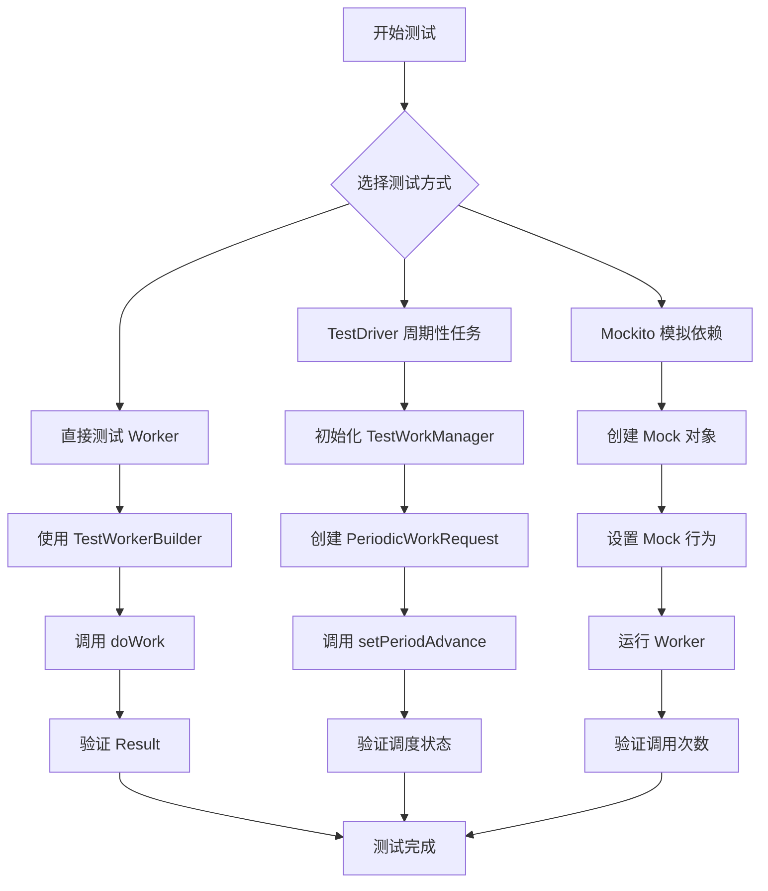

# 6.1.37 与 WorkManager 的集成测试

帐篷外的虫鸣声一阵阵地传来，偶尔有夜风吹动帐篷的帆布，发出轻微的“沙沙”声。黛琳合上调试日志的页面，端起已经凉了的茶喝了一口。

“学姐，”洛芙犹豫了一下举手，“那个……我们刚才学了怎么调试 WorkManager，但是有一个问题我一直想问。”

“说吧。”黛琳笑着看她。

“如果我们写了一个 Worker，怎么知道它真的能正常工作呢？”洛芙认真地说，“总不能每次都等到用户手机上报错了才发现问题吧？”

希尔正在收拾能量棒的包装纸，听到这话停了下来：“哦？你这个问题问得好！这就涉及到我们今天要讲的内容了——WorkManager 的集成测试。”

伊莎把膝盖上的零食袋子放到一边，柔声说：“就好比我们准备一顿晚餐，不能等客人吃完了才说'哎呀盐放多了'，而是在端上桌之前先尝一尝味道对不对。”

洛芙恍然大悟：“所以就是要先测试一下 Worker 能不能正常工作！”

“对，”黛琳重新打开笔记本电脑，“而且 WorkManager 为我们提供了一套专门的测试工具，叫做 TestDriver 和 ListenableWorker。学会了这些，我们就能在开发阶段把问题找出来。”

---

## 问题发现

黛琳调出一个之前写好的 Worker 代码，指着屏幕说：“洛芙，你看这个 UploadWorker，它负责把用户拍的照片上传到服务器。”

洛芙凑过去看：“嗯……它用了 CoroutineWorker，在 doWork() 方法里调用了 uploadImage() 函数。”

“很好。”黛琳点点头，“现在的问题是，如果我们直接运行这个 Worker，就需要联网、需要服务器、还需要真实的图片。这在测试环境下会很麻烦。”

“那怎么办？”洛芙问。

“我们可以用一个方法来'假的'上传，”希尔插话道，“就好比你在家里练习炒菜，不需要真的开餐厅，可以用模拟的食材先试试味道对不对。”

黛琳笑着说：“对，WorkManager 提供了几种测试策略——我们可以替换网络请求、可以模拟延迟、还可以直接测试 Worker 的逻辑而不用真正执行它。”

洛芙眼睛亮了起来：“听起来好棒！那我们要怎么开始呢？”

---

## 正文知识讲解

### 1.1 测试 Worker 的三种方式

黛琳在白板上画了一个简单的图，说：“洛芙，测试 Worker 有三种主要方式，我们一个一个来介绍。”

```
┌─────────────────────────────────────────────────────────────┐
│                    测试 Worker 的方式                        │
├─────────────────────────────────────────────────────────────┤
│                                                             │
│   ┌─────────────┐    ┌─────────────┐    ┌─────────────┐   │
│   │  直接测试   │    │  TestDriver │    │  Mockito   │   │
│   │  Worker 逻辑 │    │  测试定时任务 │    │  模拟依赖   │   │
│   └─────────────┘    └─────────────┘    └─────────────┘   │
│        ↓                  ↓                   ↓            │
│   测试核心业务逻辑    测试周期性任务        测试协作组件     │
│                                                             │
└─────────────────────────────────────────────────────────────┘
```

“第一种，是直接测试 Worker 的核心逻辑，”黛琳解释道，“就好比我们单独测试菜谱中的某个步骤，看看火候对不对、调料放得对不对。”

“第二种，是用 TestDriver 测试周期性任务——比如我们设置了一个每天凌晨三点运行的任务，总不能真的等到凌晨三点再测试吧？”

“第三种，是用 Mockito 等工具模拟依赖——比如网络请求、数据库操作，这样我们可以控制测试的行为，不用真的联网或读写数据库。”

洛芙认真点头：“明白了！第一种是单元测试，第二种是专门针对 WorkManager 的测试，第三种是……mock 测试？”

“对！你总结得很好。”希尔打了个响指。

### 1.2 直接测试 Worker 逻辑

黛琳打开一个代码文件，说：“我们先来看第一种方式——直接测试 Worker 的逻辑。”

“这种方法的核心是，我们不通过 WorkManager 来运行 Worker，而是直接创建 Worker 的实例，调用它的 doWork() 方法，然后检查结果。”

她调出代码示例：

```kotlin
// 导入测试所需的类
import androidx.work.worker.TestListenableWorker
import androidx.work.testing.TestWorkerBuilder
import org.junit.Test
import org.junit.runner.RunWith
import org.junit.runners.JUnit4
import kotlinx.coroutines.runBlocking
import java.util.concurrent.Executors

@RunWith(JUnit4::class)
class UploadWorkerTest {

    @Test
    fun testUploadWorker_success() = runBlocking {
        // 创建一个测试用的上下文
        val context = ApplicationProvider.getApplicationContext<Context>()
        
        // 直接构建 Worker 实例（这里用 CoroutineWorker 为例）
        val worker = TestWorkerBuilder<UploadWorker>(
            context = context,
            executor = Executors.newSingleThreadExecutor()
        ).build()
        
        // 调用 doWork() 方法
        val result = worker.doWork()
        
        // 验证结果
        assertEquals(ListenableWorker.Result.success(), result)
    }
}
```

洛芙盯着代码看了半天：“学姐，这个 TestWorkerBuilder 是做什么的？”

“问得好！”黛琳指着代码解释说，“TestWorkerBuilder 是一个测试工具，它帮我们创建 Worker 实例，同时自动配置好测试所需的环境——比如协程的调度器、后台线程池等等。”

“就好比我们要测试一个炉灶，”伊莎在旁边补充道，“不可能真的把厨房搬进实验室，而是用一个专门的'测试台'来模拟炉灶的工作。”

洛芙“扑哧”一声笑了出来：“学姐你这个比喻好奇怪，但是好形象！”

希尔继续说：“但是啊，这种直接测试有一个问题——如果你的 Worker 依赖网络请求或数据库，直接测试就会失败，因为我们没有真实的网络和数据库。”

“那怎么办？”洛芙问。

“这就是我们接下来要讲的内容——用 Mockito 模拟依赖。”

### 1.3 用 Mockito 模拟依赖

黛琳调出另一段代码，说：“现在我们来看第三种方式——用 Mockito 模拟 Worker 依赖的组件。”

“比如我们的 UploadWorker 需要一个 NetworkService 来上传图片，我们可以先创建这个接口，然后 Mockito 会帮我们创建一个'假的'NetworkService，在测试中使用。”

```kotlin
// 定义网络服务接口
interface NetworkService {
    suspend fun uploadImage(imagePath: String): Result<String>
}

// Worker 依赖网络服务
class UploadWorker(
    context: Context,
    params: WorkerParameters,
    private val networkService: NetworkService  // 注入依赖
) : CoroutineWorker(context, params) {

    override suspend fun doWork(): Result {
        val imagePath = inputData.getString(KEY_IMAGE_PATH)
            ?: return Result.failure()

        return try {
            val url = networkService.uploadImage(imagePath)
            Result.success(workDataOf(KEY_UPLOADED_URL to url))
        } catch (e: Exception) {
            Result.retry()
        }
    }

    companion object {
        const val KEY_IMAGE_PATH = "image_path"
        const val KEY_UPLOADED_URL = "uploaded_url"
    }
}

// 测试代码
@RunWith(JUnit4::class)
class UploadWorkerWithMockTest {

    @Mock
    private lateinit var mockNetworkService: NetworkService

    @Test
    fun testUploadWorker_withMock() = runBlocking {
        // 设置 mock 的行为 - 模拟上传成功
        `when`(mockNetworkService.uploadImage(anyString()))
            .thenReturn(Result.success("https://example.com/image.jpg"))

        val context = ApplicationProvider.getApplicationContext<Context>()
        
        // 手动创建 Worker，注入 mock 的服务
        val worker = UploadWorker(
            context = context,
            params = WorkerParameters.from(context),
            networkService = mockNetworkService
        )

        // 设置输入数据
        val inputData = workDataOf(UploadWorker.KEY_IMAGE_PATH to "/path/to/image.jpg")
        
        // 创建测试用的工作请求
        val workSpec = OneTimeWorkRequestBuilder<UploadWorker>()
            .setInputData(inputData)
            .build()

        // 运行 Worker
        val testDriver = WorkManagerTestInitHelper.initializeTestWorkManager(context)
        val operation = testDriver.enqueue(workSpec)
        operation.result.get()  // 等待完成

        // 验证 mock 被调用了
        verify(mockNetworkService).uploadImage("/path/to/image.jpg")
    }
}
```

洛芙看到这里，举手提问：“学姐，那个 'WorkManagerTestInitHelper.initializeTestWorkManager' 是做什么的？”

“好问题！”黛琳解释道，“这个方法会初始化一个'测试模式'的 WorkManager。在这种模式下，Worker 不会真的被调度执行，而是会在当前线程立即运行，方便我们测试。”

“这就像游戏里的'练习模式'，”伊莎补充道，“不会真的记录分数，但是操作跟正式比赛一模一样。”

洛芙理解了：“原来是这样！那第二种方式呢？TestDriver 测试周期性任务？”

### 1.4 TestDriver 测试周期性任务

黛琳点点头：“对，现在我们来看第二种方式——用 TestDriver 测试 PeriodicWorkRequest。”

“你还记得吗？PeriodicWorkRequest 是每隔一段时间就运行一次的 Worker，比如每天凌晨同步数据。但是我们不可能真的等一天再测试吧？”

“所以 TestDriver 就派上用场了！”希尔兴奋地说，“它可以让我们'快进'时间，直接跳到下一次任务该运行的时候。”

黛琳调出代码示例：

```kotlin
@RunWith(JUnit4::class)
class PeriodicSyncWorkerTest {

    @Test
    fun testPeriodicWork_withTestDriver() {
        val context = ApplicationProvider.getApplicationContext<Context>()
        
        // 初始化测试用的 WorkManager
        val workManager = WorkManagerTestInitHelper.initializeTestWorkManager(context)
        
        // 创建一个周期性工作请求（原本是每24小时运行一次）
        val periodicWork = PeriodicWorkRequestBuilder<SyncWorker>(
            repeatInterval = 24,  // 24小时
            repeatIntervalTimeUnit = TimeUnit.HOURS
        )
            .setConstraints(
                Constraints.Builder()
                    .setRequiredNetworkType(NetworkType.CONNECTED)
                    .build()
            )
            .build()

        // 将工作加入队列
        workManager.enqueueUniquePeriodicWork(
            "periodic_sync",
            ExistingPeriodicWorkPolicy.KEEP,
            periodicWork
        )

        // 获取 TestDriver
        val testDriver = WorkManagerTestInitHelper.getTestDriver(context)!!

        // 模拟时间推进到第一次运行
        // setPeriodAdvance() 告诉 WorkManager "已经过去了足够长的时间"
        // 第一个参数是工作名称，第二个参数是是否应该运行
        testDriver.setPeriodAdvance("periodic_sync", true)
        
        // 验证工作已经被调度
        val workInfos = workManager.getWorkInfosForUniqueWork("periodic_sync").get()
        assertTrue(workInfos.any { it.state == WorkInfo.State.ENQUEUED })
    }
}
```

洛芙看完这段代码，皱起眉头：“学姐，这个 setPeriodAdvance 我还是有点不太明白……”

“没关系，”黛琳耐心解释道，“你可以理解为，我们在测试环境里按下了'快进键'。比如我们设置的是24小时运行一次，但是测试的时候，我们告诉 WorkManager '已经过了24小时了'，它就会认为该运行了。”

“就像电视剧里的'时间流逝'特效！”伊莎笑着说，“啪地一下打一个响指，太阳就下山了。”

洛芙也被逗笑了：“哈哈，这样就明白了！那如果我想测试多次运行呢？”

“好问题，”黛琳说，“我们可以多次调用 setPeriodAdvance 来模拟多个周期。比如测试一个每小时运行一次的任务，我们可以模拟'过了三个小时'，看看它是否运行了三次。”

### 1.5 反模式：直接在主线程测试网络请求

希尔突然表情严肃起来：“洛芙，我再给你看一个常见的错误——很多人刚开始写测试的时候，会直接在主线程测试需要网络的 Worker。”

“那会怎么样？”洛芙问。

“会超时报错，或者直接崩溃。”希尔调出一段“坏代码”：

```kotlin
// ❌ 反模式：在主线程测试需要网络的 Worker
@Test
fun testBadExample() {
    val context = ApplicationProvider.getApplicationContext<Context>()
    
    // 直接创建工作请求
    val workRequest = OneTimeWorkRequestBuilder<UploadWorker>()
        .build()

    val workManager = WorkManager.getInstance(context)
    
    // 在测试中直接运行（这会在主线程执行，可能会卡住或超时）
    workManager.enqueue(workRequest)
    // 没有等待结果就继续执行后面的断言
    
    // 这里的断言在 Worker 还没完成时就执行了
    // 测试会随机失败，因为时序不确定
    val workInfo = workManager.getWorkInfoById(workRequest.id).get()
    assertEquals(WorkInfo.State.SUCCEEDED, workInfo.state)  // ❌ 可能失败
}
```

洛芙看到代码惊呼：“啊！这个我好像见过！有时候测试写着写着就卡住了！”

“对，这就是反模式。”希尔说，“问题在于，我们在测试中没有正确等待 Worker 完成，而且也没有处理超时情况。”

然后她调出正确的写法：

```kotlin
// ✅ 正确写法：使用 TestDriver 或正确等待结果
@Test
fun testGoodExample() = runBlocking {
    val context = ApplicationProvider.getApplicationContext<Context>()
    
    // 初始化测试 WorkManager
    val workManager = WorkManagerTestInitHelper.initializeTestWorkManager(context)
    
    val workRequest = OneTimeWorkRequestBuilder<UploadWorker>()
        .build()

    // 使用 TestDriver 运行
    val testDriver = WorkManagerTestInitHelper.getTestDriver(context)!!
    val operation = workManager.enqueue(workRequest)
    
    // 等待工作完成（使用 TestDriver 可以同步等待）
    testDriver.setAllWorkDelegatesShouldFinish()
    operation.result.get(10, TimeUnit.SECONDS)  // 设置超时
    
    // 验证结果
    val workInfo = workManager.getWorkInfoById(workRequest.id).get()
    assertEquals(WorkInfo.State.SUCCEEDED, workInfo.state)  // ✅ 正确
}
```

“还有一个问题，”黛琳补充道，“就是很多人忘记处理网络不可用的情况。如果我们设置了 NetworkType.CONNECTED 的约束，但是在测试环境中没有网络，Worker 就会一直等待，永远不会执行。”

“我们可以用 setAllNetworkCallsShouldFail() 或者设置 Constraints 为 NetworkType.NOT_REQUIRED 来解决这个问题。”

### 1.6 测试 WorkManager 的状态变化

洛芙突然想到一个问题：“学姐，如果我们想测试 Worker 的状态变化——比如从 RUNNING 变成 SUCCEEDED，或者中间失败了——要怎么测试呢？”

“好问题！”黛琳调出一个新的代码示例，“WorkManager 提供了 LiveData 来观察工作状态的变化，我们可以利用这一点来测试。”

```kotlin
@Test
fun testWorkStateTransitions() = runBlocking {
    val context = ApplicationProvider.getApplicationContext<Context>()
    val workManager = WorkManagerTestInitHelper.initializeTestWorkManager(context)

    // 创建一个会失败然后重试的 Worker
    val workRequest = OneTimeWorkRequestBuilder<RetryWorker>()
        .setBackoffCriteria(
            BackoffPolicy.EXPONENTIAL,
            10, TimeUnit.SECONDS
        )
        .build()

    // 监听状态变化
    val workInfoLiveData = workManager.getWorkInfoByIdLiveData(workRequest.id)
    
    val states = mutableListOf<WorkInfo.State>()
    
    // 创建一个 Observer 来记录状态变化
    val observer = Observer<WorkInfo.State> { state ->
        state?.let { states.add(it) }
    }
    workInfoLiveData.observeForever(observer)

    try {
        // 执行工作
        workManager.enqueue(workRequest).result.get(30, TimeUnit.SECONDS)
        
        // 验证状态变化序列
        // 预期：ENQUEUED -> RUNNING -> RETRY (或 FAILED) 
        // 由于使用了 TestDriver，实际可能是同步执行
        
        assertTrue(states.contains(WorkInfo.State.ENQUEUED))
        assertTrue(states.contains(WorkInfo.State.RUNNING))
    } finally {
        workInfoLiveData.removeObserver(observer)
    }
}

// 一个会失败的 Worker，用于测试重试
class RetryWorker(context: Context, params: WorkerParameters) : Worker(context, params) {
    override fun doWork(): Result {
        return Result.retry()  // 返回 retry 会触发重试
    }
}
```

洛芙看完后，若有所思地说：“我好像看到了一个关键点——我们测试的时候，要考虑各种状态转换，而不仅仅是'成功'或'失败'这两种情况。”

“没错！”黛琳赞许地说，“真实的应用中，Worker 可能因为各种原因失败——网络不稳定、服务器超时、数据库锁定等等。我们的测试要覆盖这些边界情况。”

---

## 专业技术总结

> WorkManager 的集成测试是确保后台任务可靠运行的关键环节。通过 TestDriver、TestWorkerBuilder 和 Mockito 等工具，开发者可以在不依赖真实环境的情况下验证 Worker 的行为。

#### 结构图



#### 复杂度与影响

- **测试执行速度**：使用 TestDriver 的测试通常在毫秒级完成，而真实运行可能需要数分钟
- **测试覆盖度**：Mockito 模拟可以覆盖网络错误、数据库异常等边界情况
- **维护成本**：如果 Worker 的接口经常变化，测试代码也需要相应更新

#### 反模式与陷阱

1. **在主线程同步等待 Worker 完成**：会导致测试超时或卡死。修复：使用 TestDriver 或 runBlocking 协程
2. **忘记设置 Constraints**：测试环境和生产环境的网络状态不同。修复：明确设置 NetworkType.NOT_REQUIRED 或在测试中模拟网络
3. **没有验证重试逻辑**：只测试成功路径，忽略失败重试。修复：创建会失败的 Worker，验证重试次数和状态变化

#### 设计哲学

- **测试金字塔**：单元测试 Worker 核心逻辑，集成测试验证 WorkManager 调度，端到端测试验证完整流程
- **快速反馈**：测试应该在秒级完成，而不是分钟级
- **隔离性**：测试不应依赖外部服务（网络、数据库），使用 Mock 替代

#### 🏕️ 动手练习

**项目概览**：为露营记录 App 编写测试，验证图片同步 Worker 的正确性

**目标**：学会使用 WorkManager 测试工具，确保后台任务可靠执行

**Task 1：测试 Worker 核心逻辑**
- 目标：直接调用 UploadWorker 的 doWork() 方法，验证上传成功
- 步骤：
  1. 创建 JUnit4 测试类
  2. 使用 TestWorkerBuilder 构建 Worker
  3. 设置输入数据（图片路径）
  4. 调用 doWork() 并验证返回 Result.success()
- 验收标准：
  - [ ] 测试能编译通过
  - [ ] 测试能成功运行
  - [ ] 验证了正确的 Result 类型
- 提示代码：
  ```kotlin
  val worker = TestWorkerBuilder<UploadWorker>(
      context = context,
      executor = Executors.newSingleThreadExecutor()
  ).build()
  ```

**Task 2：用 Mockito 模拟网络服务**
- 目标：用 Mock 替换真实的网络调用，测试 Worker 对不同结果的处理
- 步骤：
  1. 定义 NetworkService 接口
  2. 创建 Mock 对象
  3. 设置 Mock 返回成功/失败
  4. 注入到 Worker 并测试
- 验收标准：
  - [ ] 网络成功时返回 success()
  - [ ] 网络失败时返回 retry()
  - [ ] 验证了 Mock 被正确调用
- 提示代码：
  ```kotlin
  `when`(mockNetworkService.uploadImage(anyString()))
      .thenReturn(Result.success("https://..."))
  ```

**Task 3：测试周期性任务**
- 目标：使用 TestDriver 模拟时间流逝，验证 PeriodicWorkRequest 被正确调度
- 步骤：
  1. 初始化 TestWorkManager
  2. 创建 PeriodicWorkRequest（24小时间隔）
  3. 使用 setPeriodAdvance 模拟时间推进
  4. 验证工作进入 ENQUEUED 状态
- 验收标准：
  - [ ] 周期性任务被正确创建
  - [ ] setPeriodAdvance 后任务被调度
  - [ ] 验证了唯一工作名称
- 提示代码：
  ```kotlin
  val testDriver = WorkManagerTestInitHelper.getTestDriver(context)
  testDriver.setPeriodAdvance("sync_work", true)
  ```

**Task 4：测试状态变化**
- 目标：监听 Worker 状态转换，验证从 RUNNING 到 SUCCEEDED 的完整流程
- 步骤：
  1. 使用 getWorkInfoByIdLiveData 监听状态
  2. 创建状态记录列表
  3. 执行 Worker
  4. 验证状态序列包含 ENQUEUED、RUNNING、SUCCEEDED
- 验收标准：
  - [ ] Observer 正确记录状态
  - [ ] 状态序列完整
  - [ ] 测试在超时前完成

**Task 5：测试错误处理**
- 目标：模拟网络超时异常，验证 Worker 的重试行为
- 步骤：
  1. Mock NetworkService 抛出 TimeoutException
  2. 设置指数退避策略
  3. 运行 Worker 多次
  4. 验证重试次数
- 验收标准：
  - [ ] 首次运行返回 Result.retry()
  - [ ] 重试次数符合预期
  - [ ] 退避时间递增

**面试热身**

Q1：请解释 TestWorkerBuilder 和 TestDriver 的区别，以及它们各自的适用场景。

Q2：如果一个 Worker 依赖数据库，但在测试环境中没有数据库，你会如何处理？

Q3：如何测试一个设置了 NetworkType.CONNECTED 约束的 Worker？

Q4：说说你对 WorkManager 测试金字塔的理解。

Q5：如果测试经常随机失败（flaky test），可能的原因有哪些？如何排查？

#### 参考实现要点

1. **优先使用 TestDriver**：它提供了同步执行和快进时间的能力，测试速度快且可靠
2. **明确设置 Constraints**：测试时使用 NetworkType.NOT_REQUIRED 避免网络依赖
3. **使用 runBlocking 处理协程**：在 Kotlin 测试中，使用 runBlocking 保证协程完成
4. **设置合理的超时时间**：防止测试无限等待，使用 get(timeout, TimeUnit)
5. **清理测试资源**：在 finally 块中移除 Observer，避免内存泄漏

---

> 测试不是为了证明代码没有问题，而是为了尽可能早地发现潜在的问题。

---

## 洛芙的小小日记本

今天学会了怎么测试 WorkManager！之前总是担心后台任务会不会偷偷坏掉，现在可以用 TestDriver 和 Mockito 来验证它们啦。希尔说的对——测试就是我们的“预演”，在正式上场之前先确保万无一失。晚安，露营地的星空✨

---

## 今日关键词

- **TestWorkerBuilder**：WorkManager 提供的测试工具，用于直接构建 Worker 实例进行测试
- **TestDriver**：WorkManager 的测试驱动，允许模拟时间快进和同步等待 Worker 完成
- **WorkManagerTestInitHelper**：初始化测试环境 WorkManager 的辅助类
- **Mockito**：Java 单元测试的 Mock 框架，用于创建模拟对象
- **ListenableWorker**：支持 ListenableFuture 的 Worker 基类，便于测试
- **PeriodicWorkRequest**：周期性执行的工作请求
- **OneTimeWorkRequest**：一次性执行的工作请求
- **BackoffPolicy**：重试策略，包括指数退避（EXPONENTIAL）和线性退避（LINEAR）
- **WorkInfo**：描述 Worker 执行状态的数据类，包含 ENQUEUED、RUNNING、SUCCEEDED、FAILED 等状态
