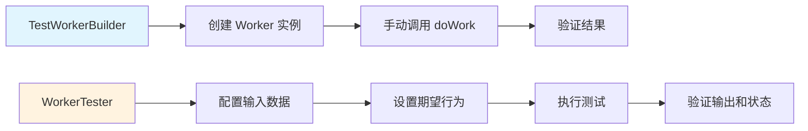
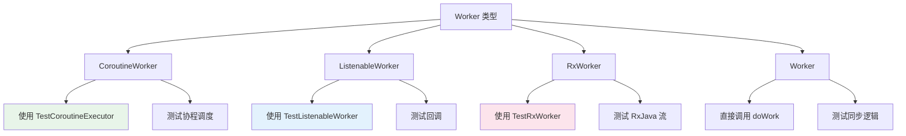
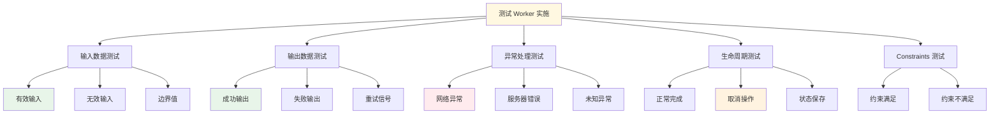

# 6.1.38 测试 Worker 实施

帐篷外的虫鸣声渐渐弱了下去，夜色愈发深沉。洛芙靠在枕头上，手里还拿着刚才希尔递过来的能量棒包装袋研究方向。

“学姐，”伊莎轻声开口，“刚才我们学的集成测试，是测试 Worker 和 WorkManager 配合工作的方式，对吧？”

黛琳点点头：“对，那是站在 WorkManager 的角度来测试。”

“那……”伊莎歪了歪脑袋，“如果我们想测试 Worker 本身的具体实现——比如它怎么解析输入数据、怎么处理各种异常、怎么输出结果——该怎么办呢？”

洛芙一下子精神了：“对哦！之前我们都是测试'Worker 能不能被 WorkManager 调度'，但它内部逻辑对不对，我们怎么知道？”

希尔 grins了一下：“这就是我们今天要讲的内容了——测试 Worker 的具体实施（Worker Implementation）。就好比一道菜，我们不仅要端上桌让客人吃到，还要检查——火候够不够、盐放了多少、摆盘好不好看。”

“而这些检查，”黛琳笑着说，“需要更精细的测试工具。”

---

## 问题发现

黛琳调出一个代码窗口，说：“洛芙，你来看这个 Worker。这是我们之前写的 SyncWorker，负责同步露营数据到服务器。”

```kotlin
class SyncWorker(
    private val context: Context,
    params: WorkerParameters,
    private val apiService: CampApiService
) : CoroutineWorker(context, params) {

    override suspend fun doWork(): Result {
        // 获取输入数据
        val campId = inputData.getString(KEY_CAMP_ID) ?: return Result.failure()
        val startDate = inputData.getLong(KEY_START_DATE, -1)
        
        if (startDate < 0) {
            return Result.failure(workDataOf(KEY_ERROR_MSG to "无效的开始日期"))
        }

        return try {
            // 调用 API 同步数据
            val result = apiService.syncCampData(campId, startDate)
            
            if (result.isSuccess) {
                Result.success(workDataOf(
                    KEY_SYNCED_COUNT to result.getOrDefault(0)
                ))
            } else {
                Result.retry()
            }
        } catch (e: IOException) {
            Result.retry()
        } catch (e: Exception) {
            Result.failure(workDataOf(KEY_ERROR_MSG to (e.message ?: "未知错误")))
        }
    }

    companion object {
        const val KEY_CAMP_ID = "camp_id"
        const val KEY_START_DATE = "start_date"
        const val KEY_SYNCED_COUNT = "synced_count"
        const val KEY_ERROR_MSG = "error_msg"
    }
}
```

洛芙仔细看着代码：“这个 Worker 看起来很完整啊……有什么需要测试的吗？”

“问题就在这里，”黛琳指着代码说，“你看，这个 Worker 依赖 CampApiService，而且有三种可能的输出——成功、失败、重试。如果我们想测试每一种情况，该怎么做？”

“总不能每次都真的调一次 API 吧？”希尔问。

“所以我们需要更精细的测试方法，”黛琳说，“WorkManager 提供了专门的 WorkerTester，可以让我们直接测试 Worker 的内部逻辑，而不需要通过 WorkManager 调度。”

---

## 正文知识讲解

### 1.1 WorkerTester 是什么

伊莎好奇地问：“WorkerTester？和之前的 TestWorkerBuilder 有什么区别？”

“Great question!” 黛琳打开一个新的代码文件，“TestWorkerBuilder 是用来构建 Worker 实例的，而 WorkerTester 是用来'驱动' Worker 执行的。简单来说——”

她画了一幅图来解释：



“如果说 TestWorkerBuilder 是'建造一辆车'，那 WorkerTester 就是'试驾这辆车'——它不仅帮你造好，还能帮你验证车的各种性能。”

洛芙眼睛亮了起来：“那 WorkerTester 怎么用呢？”

“我们来看代码。”

### 1.2 使用 WorkerTester 测试输入输出

黛琳调出代码示例：“WorkerTester 的核心是，我们可以精确控制输入数据，然后验证输出结果。”

```kotlin
// 测试 SyncWorker 的输入输出
@Test
fun testSyncWorkerInputOutput() = runBlocking {
    val context = ApplicationProvider.getApplicationContext<Context>()
    
    // 创建 Mock 的 API 服务
    val mockApiService = mock(CampApiService::class.java)
    `when`(mockApiService.syncCampData(anyString(), anyLong()))
        .thenReturn(Result.success(10))  // 模拟成功返回10条数据
    
    // 使用 TestWorkerBuilder 创建 Worker
    val worker = TestWorkerBuilder<SyncWorker>(
        context = context,
        executor = Executors.newSingleThreadExecutor(),
        workerFactory = object : WorkerFactory() {
            override fun createWorker(
                appContext: Context,
                workerClassName: String,
                workerParams: WorkerParameters
            ): ListenableWorker {
                return SyncWorker(appContext, workerParams, mockApiService)
            }
        }
    ).build()
    
    // 准备输入数据
    val inputData = workDataOf(
        SyncWorker.KEY_CAMP_ID to "camp_001",
        SyncWorker.KEY_START_DATE to 1700000000000L
    )
    
    // 使用 WorkerTester 测试
    val workerTester = WorkerTester(
        worker = worker,
        inputData = inputData
    )
    
    // 执行测试
    val result = workerTester.test()
    
    // 验证结果
    assertTrue(result.outputData.getInt(SyncWorker.KEY_SYNCED_COUNT, 0) == 10)
    verify(mockApiService).syncCampData("camp_001", 1700000000000L)
}
```

洛芙看到这段代码，惊讶地说：“学姐，这个 WorkerTester 好强大！它不仅可以设置输入，还能验证输出！”

“对，”黛琳点头说，“而且它还有一个很重要的特性——可以模拟各种异常情况。”

### 1.3 模拟异常和边界情况

希尔调出另一段代码：“洛芙，你来想想，如果网络请求失败了，Worker 会怎么处理？”

“嗯……会返回 Result.retry() 对吧？”洛芙回忆着。

“对，但如果我们想测试这个行为，总不能真的把网线拔掉吧？”希尔笑着问。

“所以我们要用 Mock 来模拟失败！”她调出代码：

```kotlin
// 测试网络失败的情况
@Test
fun testSyncWorker_networkFailure() = runBlocking {
    val context = ApplicationProvider.getApplicationContext<Context>()
    
    // 模拟网络异常
    val mockApiService = mock(CampApiService::class.java)
    `when`(mockApiService.syncCampData(anyString(), anyLong()))
        .thenThrow(IOException("网络连接失败"))
    
    val worker = SyncWorker(context, WorkerParameters.from(context), mockApiService)
    
    val inputData = workDataOf(
        SyncWorker.KEY_CAMP_ID to "camp_001",
        SyncWorker.KEY_START_DATE to 1700000000000L
    )
    
    val workerTester = WorkerTester(worker, inputData)
    val result = workerTester.test()
    
    // 验证返回的是重试结果
    assertTrue(result.result.let { 
        it is ListenableWorker.ResultRetry 
    } ?: false)
}

// 测试无效输入的情况
@Test
fun testSyncWorker_invalidInput() = runBlocking {
    val context = ApplicationProvider.getApplicationContext<Context>()
    val mockApiService = mock(CampApiService::class.java)
    
    val worker = SyncWorker(context, WorkerParameters.from(context), mockApiService)
    
    // 故意不提供必需的参数
    val inputData = workDataOf(
        SyncWorker.KEY_CAMP_ID to "camp_001"
        // 缺少 KEY_START_DATE
    )
    
    val workerTester = WorkerTester(worker, inputData)
    val result = workerTester.test()
    
    // 验证返回失败结果
    assertTrue(result.result is ListenableWorker.ResultFailure)
    val failureResult = result.result as ListenableWorker.ResultFailure
    assertTrue(failureResult.outputData.getString(SyncWorker.KEY_ERROR_MSG)?.contains("无效的开始日期") == true)
}

// 测试未知异常的情况
@Test
fun testSyncWorker_unknownException() = runBlocking {
    val context = ApplicationProvider.getApplicationContext<Context>()
    
    val mockApiService = mock(CampApiService::class.java)
    `when`(mockApiService.syncCampData(anyString(), anyLong()))
        .thenThrow(RuntimeException("奇怪的错误"))
    
    val worker = SyncWorker(context, WorkerParameters.from(context), mockApiService)
    
    val inputData = workDataOf(
        SyncWorker.KEY_CAMP_ID to "camp_001",
        SyncWorker.KEY_START_DATE to 1700000000000L
    )
    
    val workerTester = WorkerTester(worker, inputData)
    val result = workerTester.test()
    
    // 未知异常应该返回失败，而不是重试
    assertTrue(result.result is ListenableWorker.ResultFailure)
}
```

洛芙看完这些测试，兴奋地说：“原来测试要覆盖这么多情况！不仅要测试正常情况，还要测试网络失败、无效输入、未知异常……”

“这就是测试的精髓，”黛琳总结道，“我们要确保 Worker 在任何情况下都能做出正确的反应。”

### 1.4 测试不同类型的 Worker

伊莎插话道：“刚才我们都是用 CoroutineWorker 做例子，如果是 ListenableWorker 或者 RxWorker，测试方法有什么不同吗？”

“问得好！”希尔说，“不同类型的 Worker，测试的重点确实不太一样。”



“我们来分别看一下。”

#### 测试 ListenableWorker

希尔调出代码：“ListenableWorker 使用 ListenableFuture 来处理异步操作，测试时我们要用 TestListenableWorker。”

```kotlin
// ListenableWorker 示例
class DownloadWorker(
    context: Context,
    params: WorkerParameters,
    private val downloadManager: DownloadManager
) : ListenableWorker(context, params) {

    override fun createWork(): ListenableFuture<Result> {
        val url = inputData.getString(KEY_URL) ?: return SettableFuture.create(Result.failure())
        
        return CallbackToFutureAdapter.getFuture { completer ->
            downloadManager.download(url)
                .addSuccessListener { path ->
                    completer.set(Result.success(workDataOf(KEY_PATH to path)))
                }
                .addFailureListener { error ->
                    completer.set(Result.retry())
                }
            
            // 返回一个 cancel 回调
            { downloadManager.cancel(url) }
        }
    }

    companion object {
        const val KEY_URL = "url"
        const val KEY_PATH = "path"
    }
}

// 测试 ListenableWorker
@Test
fun testDownloadWorker() {
    val context = ApplicationProvider.getApplicationContext<Context>()
    val mockDownloadManager = mock(DownloadManager::class.java)
    
    // 模拟下载成功
    val future = SettableFuture.create<Result>()
    `when`(mockDownloadManager.download(anyString()))
        .thenReturn(FutureAdapter(future))
    
    val worker = DownloadWorker(context, WorkerParameters.from(context), mockDownloadManager)
    
    // 使用 TestListenableWorker
    val inputData = workDataOf(DownloadWorker.KEY_URL to "https://example.com/camp.jpg")
    val tester = TestListenableWorker(worker, inputData)
    
    // 模拟异步回调
    future.set(Result.success(workDataOf(DownloadWorker.KEY_PATH to "/path/to/file")))
    
    // 验证结果
    val result = tester.test().result.get(5, TimeUnit.SECONDS)
    assertTrue(result is ListenableWorker.ResultSuccess)
}
```

#### 测试 RxWorker

黛琳调出 RxWorker 的测试代码：“RxWorker 使用 RxJava，测试时要处理 Observable。”

```kotlin
// RxWorker 示例
class AnalyticsWorker(
    context: Context,
    params: WorkerParameters,
    private val analyticsService: AnalyticsService
) : RxWorker(context, params) {

    override fun createWork(): Single<Result> {
        val eventType = inputData.getString(KEY_EVENT_TYPE) ?: return Single.just(Result.failure())
        
        return analyticsService.trackEvent(eventType)
            .toSingleDefault(Result.success()) as Single<Result>
            .onErrorReturnItem(Result.retry())
    }

    companion object {
        const val KEY_EVENT_TYPE = "event_type"
    }
}

// 测试 RxWorker
@Test
fun testAnalyticsWorker() {
    val context = ApplicationProvider.getApplicationContext<Context>()
    val mockAnalyticsService = mock(AnalyticsService::class.java)
    
    // 模拟 RxJava Observable
    `when`(mockAnalyticsService.trackEvent(anyString()))
        .thenReturn(Observable.just(true))  // 模拟成功
    
    val worker = AnalyticsWorker(context, WorkerParameters.from(context), mockAnalyticsService)
    
    val inputData = workDataOf(AnalyticsWorker.KEY_EVENT_TYPE to "camp_view")
    val tester = TestRxWorker(worker, inputData)
    
    // 执行测试
    val result = tester.test().result.blockingGet()
    
    assertTrue(result is RxWorker.ResultSuccess)
}
```

洛芙看着这些代码，有点晕：“学姐，不同的 Worker 类型有这么多不同的测试工具，记不住怎么办？”

“别担心，”伊莎温柔地说，“其实它们的核心思想是一样的——创造一个可控的环境，调用 Worker 的核心方法，然后验证结果。工具只是手段，思路才是关键。”

黛琳补充道：“而且在实际项目中，我们通常会统一使用一种 Worker 类型。比如团队统一用 CoroutineWorker，那我们就只需要掌握那一种测试方法就好。”

### 1.5 测试 Constraints 约束条件

洛芙突然想到一个问题：“学姐，之前我们学过 Constraints——比如网络连接、充电状态等等。这些条件在测试时怎么处理？”

“对，这是个很好的问题！”黛琳调出一个新的代码示例。

“在真实环境中，如果 Constraints 不满足，Worker 会被暂停执行。但在测试环境中，我们怎么模拟这种情况呢？”

```kotlin
// 测试带 Constraints 的 Worker
@Test
fun testWorkerWithConstraints() {
    val context = ApplicationProvider.getApplicationContext<Context>()
    
    // 创建需要网络的 Worker
    val constraints = Constraints.Builder()
        .setRequiredNetworkType(NetworkType.CONNECTED)
        .setRequiresCharging(true)
        .build()

    // 初始化测试 WorkManager
    val workManager = WorkManagerTestInitHelper.initializeTestWorkManager(context)
    
    val workRequest = OneTimeWorkRequestBuilder<SyncWorker>()
        .setConstraints(constraints)
        .setInputData(workDataOf(
            SyncWorker.KEY_CAMP_ID to "camp_001",
            SyncWorker.KEY_START_DATE to 1700000000000L
        ))
        .build()

    // 测试方法1：模拟约束满足
    val testDriver = WorkManagerTestInitHelper.getTestDriver(context)
    
    // 告诉 WorkManager 所有约束都已满足
    testDriver.setAllConstraintsSatisfied(workRequest.id)
    
    // 执行并验证
    val operation = workManager.enqueue(workRequest)
    operation.result.get(10, TimeUnit.SECONDS)
    
    val workInfo = workManager.getWorkInfoById(workRequest.id).get()
    assertEquals(WorkInfo.State.SUCCEEDED, workInfo.state)
}

// 测试约束不满足的情况
@Test
fun testWorkerConstraintsNotSatisfied() {
    val context = ApplicationProvider.getApplicationContext<Context>()
    
    val constraints = Constraints.Builder()
        .setRequiredNetworkType(NetworkType.CONNECTED)
        .build()

    val workManager = WorkManagerTestInitHelper.initializeTestWorkManager(context)
    
    val workRequest = OneTimeWorkRequestBuilder<SyncWorker>()
        .setConstraints(constraints)
        .build()

    // 不设置约束满足，直接入队
    val operation = workManager.enqueue(workRequest)
    operation.result.get(5, TimeUnit.SECONDS)
    
    // Worker 应该还在等待状态
    val workInfo = workManager.getWorkInfoById(workRequest.id).get()
    assertEquals(WorkInfo.State.ENQUEUED, workInfo.state)  // 还没开始执行
    
    // 模拟网络可用
    val testDriver = WorkManagerTestInitHelper.getTestDriver(context)
    testDriver.setAllConstraintsSatisfied(workRequest.id)
    
    // 现在应该开始执行
    // 注意：在测试环境中可能需要等待一小段时间
    val updatedInfo = workManager.getWorkInfoById(workRequest.id).get()
    assertEquals(WorkInfo.State.SUCCEEDED, updatedInfo.state)
}
```

“原来是这样！”洛芙恍然大悟，“TestDriver 可以帮我们模拟'约束条件已满足'的情况，这样我们就不用真的等网络连上或者手机充电了。”

“对，”黛琳说，“这在 CI/CD 环境中特别有用——我们不可能真的等手机充电或者连接特定 WiFi，但我们可以告诉 WorkManager '假设这些条件都满足了'。”

### 1.6 反模式：只测试 happy path

希尔表情突然严肃起来：“洛芙，我要给你看一个很多人会犯的错误——只测试成功的情况。”

她调出一段代码：

```kotlin
// ❌ 反模式：只测试成功路径
@Test
fun testBadExample_onlyHappyPath() {
    // 只有一个测试——假设一切都会成功
    val mockApiService = mock(CampApiService::class.java)
    `when`(mockApiService.syncCampData(anyString(), anyLong()))
        .thenReturn(Result.success(10))
    
    // ... 测试代码 ...
    
    // 问题：没有测试失败、重试、无效输入等情况
    // 真实用户使用中会遇到这些问题，但测试没有覆盖！
}
```

“这种测试就像只尝了一口菜就说'这道菜很好吃'，”伊莎比喻道，“但如果盐放多了呢？如果火候过了呢？”

洛芙明白了：“所以我们要测试各种可能的情况！”

希尔露出赞许的笑容：“对，这才是完整的测试套件。”

```kotlin
// ✅ 正确写法：覆盖所有路径
@Test
fun testGoodExample_allPaths() {
    // 测试成功情况
    testSyncSuccess()
    
    // 测试网络失败
    testSyncNetworkFailure()
    
    // 测试无效输入
    testSyncInvalidInput()
    
    // 测试服务器错误（5xx）
    testSyncServerError()
    
    // 测试重试策略
    testSyncRetryStrategy()
}
```

### 1.7 测试 Worker 生命周期

黛琳调出最后一个代码示例：“除了测试 Worker 的业务逻辑，我们还要测试它的生命周期——比如 onStopped() 回调是否正确执行。”

```kotlin
// 测试 Worker 的取消行为
@Test
fun testWorkerCancellation() = runBlocking {
    val context = ApplicationProvider.getApplicationContext<Context>()
    
    // 创建一个可以被取消的 Worker
    class CancellableWorker(
        context: Context,
        params: WorkerParameters
    ) : CoroutineWorker(context, params) {
        
        var wasCancelled = false
        
        override suspend fun doWork(): Result {
            try {
                // 模拟一个长时间运行的任务
                while (isStopped.not()) {
                    delay(100)
                }
                // 如果到达这里，说明被停止了
                wasCancelled = true
                return Result.success()
            } catch (e: CancellationException) {
                wasCancelled = true
                return Result.failure()
            }
        }
    }
    
    val worker = TestWorkerBuilder<CancellableWorker>(
        context = context,
        executor = Executors.newSingleThreadExecutor()
    ).build()
    
    // 启动 Worker
    val workerTester = WorkerTester(worker, workDataOf())
    val testHandle = workerTester.test()
    
    // 模拟取消
    testHandle.setStopCalled(true)
    
    // 等待 Worker 停止
    delay(500)
    
    // 验证 onStopped 被调用
    assertTrue(worker.wasCancelled)
}
```

“还有一个重要的生命周期测试，”黛琳补充道，“就是验证 Worker 在被强制停止时是否能正确保存状态。”

```kotlin
// 测试 Worker 的状态保存
@Test
fun testWorkerStateSaving() = runBlocking {
    val context = ApplicationProvider.getApplicationContext<Context>()
    
    // 这个 Worker 会保存进度到 SharedPreferences
    class ProgressWorker(
        context: Context,
        params: WorkerParameters
    ) : CoroutineWorker(context, params) {
        
        override suspend fun doWork(): Result {
            val prefs = context.getSharedPreferences("sync_progress", Context.MODE_PRIVATE)
            
            // 模拟分步骤处理
            for (i in 1..5) {
                if (isStopped) break  // 检查是否被停止
                
                // 保存当前进度
                prefs.edit().putInt("progress", i).apply()
                
                delay(100)
            }
            
            return Result.success()
        }
    }
    
    val worker = TestWorkerBuilder<ProgressWorker>(
        context = context,
        executor = Executors.newSingleThreadExecutor()
    ).build()
    
    val workerTester = WorkerTester(worker, workDataOf())
    val testHandle = workerTester.test()
    
    // 模拟在处理到第3步时停止
    delay(350)
    testHandle.setStopCalled(true)
    
    // 验证：虽然 Worker 被停止了，但我们可以通过 SharedPreferences 
    // 检查它是否保存了最后的进度
    val prefs = context.getSharedPreferences("sync_progress", Context.MODE_PRIVATE)
    val progress = prefs.getInt("progress", 0)
    
    // 进度应该是 1、2 或 3（因为我们在第3步或之前被停止了）
    assertTrue(progress in 0..3)
}
```

洛芙看完这些，长舒一口气：“原来 Worker 的测试有这么多讲究！从输入输出到异常处理，从约束条件到生命周期，每一种情况都需要测试。”

“这就是专业工程师的职责，”黛琳温柔地说，“我们不仅要写出会工作的代码，还要写出让别人能放心修改的测试。”

---

## 专业技术总结

> 测试 Worker 实施（Worker Implementation）是确保后台任务可靠性的关键。通过 WorkerTester、TestListenableWorker、TestRxWorker 等工具，开发者可以直接测试 Worker 的内部逻辑，而无需依赖完整的 WorkManager 调度环境。

#### 结构图



#### 复杂度与影响

- **单元测试 vs 集成测试**：使用 WorkerTester 的测试属于单元测试，执行速度快（毫秒级），适合频繁运行
- **Mock 依赖复杂度**：如果 Worker 依赖较多外部服务，Mock 设置会比较复杂，但能覆盖更多边界情况
- **测试覆盖度**：完整的测试应该覆盖成功、失败、重试、取消、约束不满足等所有路径

#### 反模式与陷阱

1. **只测试成功路径**：忽略异常处理和边界情况，真实环境会暴露问题。修复：为每种可能的返回值编写测试
2. **在测试中使用真实的网络和数据库**：测试会变慢且不稳定。修复：使用 Mock 替代所有外部依赖
3. **忘记测试 Constraints**：测试环境可能满足约束，但生产环境不满足。修复：显式测试约束满足/不满足两种情况

#### 设计哲学

- **测试金字塔**：底层是 Worker 单元测试，中间是 WorkManager 集成测试，顶层是端到端测试
- **Given-When-Then 模式**：Given（设置输入和 Mock）→ When（执行）→ Then（验证结果）
- **测试的可读性**：测试代码应该像文档一样清晰，让其他开发者一目了然

#### 🏕️ 动手练习

**项目概览**：为一个天气预报 Worker 编写完整测试套件

**目标**：学会测试 Worker 的各种实现细节——输入验证、异常处理、生命周期

**Task 1：测试有效输入**
- 目标：验证 Worker 能正确处理有效的输入数据
- 步骤：
  1. 创建 WeatherWorker（需要城市 ID 作为输入）
  2. Mock 天气 API 返回模拟数据
  3. 使用 WorkerTester 执行
  4. 验证输出包含天气信息
- 验收标准：
  - [ ] 测试编译通过
  - [ ] 验证输出数据正确
  - [ ] 验证 API 被正确调用
- 提示代码：
  ```kotlin
  val inputData = workDataOf(
      WeatherWorker.KEY_CITY_ID to "tokyo",
      WeatherWorker.KEY_DATE to "2024-01-15"
  )
  val tester = WorkerTester(worker, inputData)
  val result = tester.test()
  ```

**Task 2：测试无效输入**
- 目标：验证 Worker 对无效输入返回正确的失败结果
- 步骤：
  1. 不提供必需的 cityId
  2. 执行 Worker
  3. 验证返回 Result.failure()
  4. 验证错误消息包含"无效的城市ID"
- 验收标准：
  - [ ] 测试返回失败结果
  - [ ] 错误消息正确
  - [ ] API 未被调用（因为输入验证失败）

**Task 3：测试网络异常**
- 目标：验证 Worker 对网络异常返回重试结果
- 步骤：
  1. Mock API 抛出 IOException
  2. 执行 Worker
  3. 验证返回 Result.retry()
- 验收标准：
  - [ ] 返回重试结果
  - [ ] API 被调用
  - [ ] 未返回失败

**Task 4：测试服务器错误**
- 目标：验证 Worker 对 5xx 错误返回失败（而不是无限重试）
- 步骤：
  1. Mock API 返回服务器错误（500）
  2. 设置最大重试次数
  3. 验证最终返回失败
- 验收标准：
  - [ ] 在重试次数用完后返回失败
  - [ ] 不会无限重试

**Task 5：测试取消行为**
- 目标：验证 Worker 在被取消时能正确响应
- 步骤：
  1. 创建长时间运行的 Worker
  2. 启动后立即调用 setStopCalled(true)
  3. 验证 isStopped 被检查
  4. 验证没有产生错误结果
- 验收标准：
  - [ ] Worker 检测到停止信号
  - [ ] 正确返回结果（而非异常）

**Task 6：测试带 Constraints 的 Worker**
- 目标：验证约束条件对 Worker 执行的影响
- 步骤：
  1. 创建需要网络的 WorkRequest
  2. 使用 TestDriver 模拟约束不满足
  3. 验证 Worker 不执行
  4. 再次模拟约束满足
  5. 验证 Worker 执行
- 验收标准：
  - [ ] 约束不满足时 Worker 不运行
  - [ ] 约束满足后 Worker 运行

#### 面试热身

1. **为什么要区分单元测试和集成测试？它们各有什么优缺点？**
2. **如果一个 Worker 依赖多个外部服务，你会如何组织测试代码？**
3. **说说什么情况下应该返回 Result.retry()，什么时候应该返回 Result.failure()。**
4. **如何测试一个每15分钟运行一次的 PeriodicWorkRequest？**
5. **如果你的 Worker 测试经常不稳定（flaky），可能是什么原因？**

#### 参考实现要点

- 优先使用 CoroutineWorker，因为它对协程的支持使得异步测试更简单
- 为每种可能的返回值（success、failure、retry）编写独立测试
- 使用 TestDriver 模拟时间和约束，避免在测试中等待真实的时间流逝
- 在测试中明确设置 Worker 的依赖注入，避免使用生产环境的单例
- 为测试类使用清晰的命名，如 `UploadWorkerTest`、`SyncWorkerNetworkFailureTest`

> 学习建议：测试是软件开发中最重要的技能之一。建议从简单的 Worker 开始，逐步增加测试的复杂度。同时，多阅读优秀的开源项目（如 WorkManager 自身）的测试代码，学习业界最佳实践。

---

## 洛芙的小小日记本

今天学了好多种 Worker 的测试方法！WorkerTester、TestListenableWorker、TestRxWorker……一开始头都大了，但希尔说核心思想都一样——创造可控环境，调用核心方法，验证结果。黛琳还强调要测试各种情况，不能只测成功的路。伊莎说就像尝菜不能只尝一口。看来当一个合格的工程师真的不容易呀！但我会努力的！

---

## 今日关键词

- **WorkerTester**：WorkManager 提供的测试工具，用于直接测试 Worker 的内部逻辑
- **TestWorkerBuilder**：用于在测试中构建 Worker 实例的工具
- **TestListenableWorker**：专门测试 ListenableWorker 的工具
- **TestRxWorker**：专门测试 RxWorker 的工具
- **TestDriver**：用于模拟时间和约束条件的 WorkManager 测试工具
- **Constraints**：工作约束条件，如网络类型、充电状态等
- **Mock**：模拟对象，用于替换真实的依赖服务
- **Result.success()**：表示 Worker 成功完成的返回值
- **Result.failure()**：表示 Worker 失败的返回值
- **Result.retry()**：表示 Worker 需要重试的返回值
- **ListenableFuture**：ListenableWorker 使用的异步结果类型
- **RxJava Observable**：RxWorker 使用的响应式编程类型
- **CoroutineWorker**：使用协程的 Worker 类型
- **isStopped**：检查 Worker 是否被取消的属性
- **onStopped()**：Worker 被停止时调用的回调方法
- **setStopCalled(true)**：测试中模拟 Worker 被取消的方法
- **setAllConstraintsSatisfied()**：测试中模拟约束条件满足的方法
