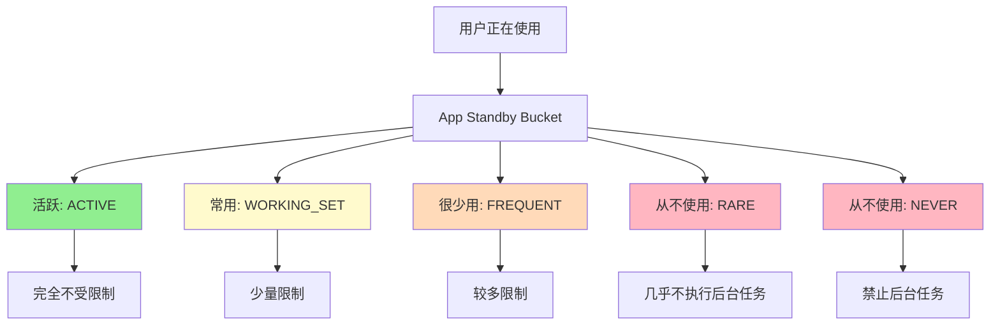

# 6.1.4 围栏里的野马

午餐过后，日头正盛。

四个女孩把餐具收拾妥当，伊莎用湿纸巾仔细擦拭着炖锅的锅底，黛琳把折叠椅搬到了最大那棵枫树下——那里有恰到好处的阴凉，树影婆娑间还能望见波光粼粼的湖面。

洛芙满足地打了个饱嗝儿。番茄炖肉的余味还挂在舌尖，她整个人都放松地蜷在睡袋里，只露出一个脑袋。

“吃饱了就开始犯困。”希尔把笔记本电脑放在膝盖上，屏幕上是洛芙昨天写的那个露营记录 App 的代码，“你这 App 挺好看的，但如果用户不在前台的时候还想同步数据——比如后台自动上传照片——你会怎么做？”

“就……直接在 Service 里写一个线程去上传？”洛芙想了想，“就像早上学的 WakeLock 那样，让后台一直跑着？”

黛琳摇着头笑了。她折下一片枫叶，在指尖转了转：“如果是五年前的 Android，确实可以这么做。但现在，系统给你栓了一条看不见的缰绳。”

“缰绳？”洛芙眨眨眼。

“Android 的后台任务限制。”希尔的表情认真起来，“从 Android 8.0（API 26）开始，系统大幅收紧了后台应用的权限。以前你的 App 可以像一匹脱缰的野马在系统里横冲直撞，现在嘛——”

她指了指远处的围栏，那里圈着几匹正在安静吃草的马。

“被关进围栏了？”伊莎好奇地问。

“差不多。”希尔笑了笑，“今天我们就来聊聊，这些限制到底是什么，以及怎么在围栏里继续跑得欢。”

---

## 后台执行限制：不再自由的奔跑

“首先需要弄清楚一个概念：什么是后台（background），什么是前台（foreground）？”希尔把笔记本转过来，指着屏幕上的解释。

黛琳接过了话头：“用露营来打比方的话——你在帐篷里醒着、动着、和同伴聊天，那就是前台。你的 App 在屏幕上，用户能看见它在跑，这就是前台状态。”

“那后台呢？”洛芙问。

“后台啊……就像你睡着了，帐篷里静悄悄的，只有篝火在远处自己烧着。”伊莎温柔地补充，“别人看不见你在做什么，但你知道你存在。App 也是这样——用户没在看它，但它还在某个地方运行着。”

希尔点点头：“在 Android 8.0 之前，你可以在后台为所欲为地启动 Service、线程，想跑多快跑多快。但从 8.0 开始，**当你的 App 不在前台时，系统禁止你随意启动后台 Service**。”

“禁止？”洛芙敏感地捕捉到这个词，“那我想在后台同步数据怎么办？”

“有几个办法。”希尔如数家珍，“第一，如果真的需要在后台持续运行，**变成前台服务（Foreground Service）**——就像在帐篷外安排一个守夜人，必须显眼地挂着'我正在干活'的牌子；第二，使用 **WorkManager**——它会在系统允许的时间窗口里帮你安排工作；第三，接受用户触发——等用户下次打开 App 时再做事。”

```kotlin
// ❌ 错误示例：在后台直接启动 Service（Android 8.0+ 会崩溃）
// 这段代码在 Android 8.0 及以上会抛出 IllegalStateException
val intent = Intent(this, MyUploadService::class.java)
startService(intent)

// ✅ 正确示例：使用前台服务
// 必须先显示一个持续的通知，让用户知道你在干活
val notification = NotificationCompat.Builder(this, CHANNEL_ID)
    .setContentTitle("正在同步露营日记")
    .setContentText("照片上传中...")
    .setSmallIcon(R.drawable.ic_upload)
    .build()

val pendingIntent = PendingIntent.getActivity(
    this, 0,
    Intent(this, MainActivity::class.java),
    PendingIntent.FLAG_IMMUTABLE
)

startForeground(NOTIFICATION_ID, notification)

// 然后再启动你的工作
val serviceIntent = Intent(this, MyUploadService::class.java)
startForegroundService(serviceIntent)
```

“等等，为什么一定要挂个牌子？”洛芙有点不理解，“我只是想安静地在后台同步个数据而已。”

“这就是系统设计的目的。”黛琳插话道，“你知道有多少 App 会在后台偷偷跑着、偷偷耗电吗？如果每个 App 都觉得自己很重要，都在后台跑个不停——”

她指了指手机电量：“用不了半天，用户就得找充电器。而用户可不管是不是 App 的问题，他们只会觉得'这个手机电池太差了'。”

“所以 Android 系统就跳出来当这个恶人？”伊莎笑着问。

“对。”希尔点头，“系统要保护电池寿命，保护用户体验，就必须给后台工作加上紧箍咒。”

---

## 隐式广播限制：不要随地喊话

“后台 Service 限制之外，还有另一个重要的限制：**隐式广播（Implicit Broadcast）的注册限制**。”希尔切换着屏幕上的代码示例。

“什么是隐式广播？”洛芙问。

“广播啊……就像营地的集合哨声。”伊莎想了想，“吹响了，大家都能听到。有人会跑过来，有人会探头看看，但不管怎样，这是公开喊话。”

黛琳补充道：“在 Android 里，**广播（Broadcast）**是一种一对多的消息传递方式。一个 App 发出一个广播，无数个 App 都可能收到。以前的 Android 允许你在 manifest 里注册接收各种广播——比如'网络状态变化'、'手机开机完成'、'电量变化'之类。”

“这有什么问题吗？”洛芙问。

“问题在于——如果几百个 App 都注册了要收'网络变化'这个广播，每次网络状态一改变，系统就得一个个通知过去。”希尔做了个夸张的手势，“想象一下，营地里有几百个人，只要有一个人喊'来饭了'，几百个人都跑过来——整个营地都乱套了。”

“所以 Android 就禁止了大部分隐式广播的 manifest 注册？”伊莎问。

“对。从 Android 8.0 开始，只有极少数特例外，你在 manifest 里注册隐式广播是**不会生效**的。”希尔解释道，“比如 ACTION_BOOT_COMPLETED（开机完成）这种，还是允许的；但像 ACTION_PACKAGE_REPLACED（应用更新）、CONNECTIVITY_ACTION（网络变化）这些，抱歉，不灵了。”

```kotlin
// ❌ 错误示例：在 manifest 中注册隐式广播（Android 8.0+ 不再生效）
/*
<receiver android:name=".NetworkChangeReceiver">
    <intent-filter>
        <action android:name="android.net.conn.CONNECTIVITY_CHANGE" />
    </intent-filter>
</receiver>
*/

// ✅ 正确示例1：使用 Context.registerReceiver() 动态注册
// 在需要的时候注册，不需要时取消注册
class MainActivity : AppCompatActivity() {
    
    private val networkReceiver = object : BroadcastReceiver() {
        override fun onReceive(context: Context?, intent: Intent?) {
            // 处理网络变化
        }
    }
    
    override fun onStart() {
        super.onStart()
        // 只在 Activity 可见时注册
        val filter = IntentFilter(ConnectivityManager.CONNECTIVITY_ACTION)
        registerReceiver(networkReceiver, filter)
    }
    
    override fun onStop() {
        super.onStop()
        // 不需要时及时取消，避免泄漏
        unregisterReceiver(networkReceiver)
    }
}

// ✅ 正确示例2：使用 WorkManager 替代定期检查
// 不再依赖广播，而是主动在合适的时间查询
class NetworkCheckWorker(context: Context, params: WorkerParameters) : Worker(context, params) {
    
    override fun doWork(): Result {
        val connectivityManager = applicationContext.getSystemService(Context.CONNECTIVITY_SERVICE) as ConnectivityManager
        val network = connectivityManager.activeNetwork
        val capabilities = connectivityManager.getNetworkCapabilities(network)
        
        return if (capabilities != null && capabilities.hasCapability(NetworkCapabilities.NET_CAPABILITY_INTERNET)) {
            Result.success()
        } else {
            Result.retry()
        }
    }
}

// 在需要时调度这个 Worker
WorkManager.getInstance(applicationContext)
    .enqueueUniqueWork(
        "network_check",
        ExistingWorkPolicy.KEEP,
        OneTimeWorkRequestBuilder<NetworkCheckWorker>().build()
    )
```

“原来如此。”洛芙若有所思，“所以不能随地喊话了，得跑到指定的人面前说话？”

“更准确地说——得通过**守门人（WorkManager）**来安排时间，而不是想喊就喊。”希尔总结道。

---

## Doze 模式与 App Standby：深度睡眠的艺术

“还有两个重要的概念需要知道：Doze 模式和 App Standby Bucket。”黛琳把枫叶放在书页间当书签，“这两个都是系统用来省电的大杀器。”

她打开手机设置，找到电池选项递给大家看。

“**Doze（瞌睡）模式**——当设备静止不动、没插电源、屏幕关闭一段时间后，系统会进入一种低功耗状态。就像篝火晚会结束了，大家都要睡觉了，只有守夜人还在转悠。”

“在这个状态下，”希尔补充道，“系统会暂停几乎所有的后台同步、网络请求、闹钟。CPU 也进入深度睡眠，只有特定的高优先级任务才能把它叫醒。”

“完全不让干活啊。”洛芙吐吐舌头。

“也不是完全不让。”黛琳解释，“系统会定期醒来一下（叫作 **Maintenance Window**），这时候之前排队的任务可以执行。你也可以用 **AlarmManager** 设置精确的'紧急起床'时间——但这需要 REQUEST_IGNORE_BATTERY_OPTIMIZATIONS 权限，而且用户可以拒绝。”

```kotlin
// 设置精确闹钟（需要 SCHEDULE_EXACT_ALARM 权限）
val alarmManager = getSystemService(Context.ALARM_SERVICE) as AlarmManager
val intent = Intent(this, AlarmReceiver::class.java)
val pendingIntent = PendingIntent.getBroadcast(
    this, REQUEST_CODE, intent,
    PendingIntent.FLAG_UPDATE_CURRENT or PendingIntent.FLAG_IMMUTABLE
)

// 设置在 10 分钟后触发
val triggerTime = SystemClock.elapsedRealtime() + 10 * 60 * 1000

if (Build.VERSION.SDK_INT >= Build.VERSION_CODES.S) {
    if (alarmManager.canScheduleExactAlarms()) {
        alarmManager.setExactAndAllowWhileIdle(
            AlarmManager.ELAPSED_REALTIME_WAKEUP,
            triggerTime,
            pendingIntent
        )
    }
} else {
    alarmManager.setExactAndAllowWhileIdle(
        AlarmManager.ELAPSED_REALTIME_WAKEUP,
        triggerTime,
        pendingIntent
    )
}
```

“**App Standby Bucket** 呢？”伊莎问。

“这个更有意思。”希尔来了兴趣，“系统会根据你使用 App 的频率，把 App 分成几个'桶'：活跃桶、常用桶、很少用桶、从不使用桶。不同桶里的 App，享有的后台资源配额是不同的。”

黛琳用树枝在地上画了几个圆圈代表不同的桶：



“想象一下，”伊莎轻声说，“篝火晚会上，最活跃的人可以随意走动；不太熟的就只能坐在边缘；从来不去的人……早就被忘记了。”

“就是这样。”希尔笑着点头，“系统会根据用户的行为习惯来决定：如果你每天都打开某个 App，那它就享受更多后台特权；如果你一周都不打开一次——抱歉，那就别怪系统不让你干活了。”

---

## WorkManager：守规矩的好帮手

“说了这么多限制，有没有一个**既守规矩、又能干活**的好帮手？”洛芙期待地问。

“有啊——**WorkManager**。”希尔的眼睛亮了起来，“它是 Google 官方推荐的、用来处理'可延迟工作'的最佳方案。”

“它是怎么解决这些限制的？”伊莎问。

“WorkManager 会在后台帮你安排工作，但**它懂得看系统的眼色**。”希尔解释道，“它内部封装了所有这些限制的逻辑：系统要 Doze 了，它就等着；系统要限制后台了，它会等到合适的时机；设备重启了，它会重新安排任务。”

“就像一个特别懂事的守夜人？”洛芙问。

“没错！”希尔打了个响指，“它不仅懂规矩，还能保证任务**最终一定会被执行**——即使 App 被杀掉了、设备重启了、进入了低电量模式，它都有办法把工作完成。”

```kotlin
// 使用 WorkManager 调度一个照片上传任务
// WorkManager 会自动处理所有系统限制

// 1. 创建要执行的工作
class PhotoUploadWorker(
    context: Context,
    params: WorkerParameters
) : CoroutineWorker(context, params) {
    
    override suspend fun doWork(): Result {
        val photoUri = inputData.getString(KEY_PHOTO_URI) ?: return Result.failure()
        
        return try {
            // 执行实际上传逻辑
            uploadPhoto(photoUri)
            Result.success()
        } catch (e: Exception) {
            if (runAttemptCount < 3) {
                Result.retry() // 自动重试，最多3次
            } else {
                Result.failure()
            }
        }
    }
    
    private suspend fun uploadPhoto(uri: String) {
        // 实际上传代码...
        withContext(Dispatchers.IO) {
            // 模拟上传
        }
    }
}

// 2. 调度工作
val uploadRequest = OneTimeWorkRequestBuilder<PhotoUploadWorker>()
    .setInputData(workDataOf(KEY_PHOTO_URI to "content://photos/camping_001.jpg"))
    .setConstraints(
        Constraints.Builder()
            .setRequiredNetworkType(NetworkType.CONNECTED) // 需要网络
            .setRequiresBatteryNotLow(true) // 电量不低
            .build()
    )
    .build()

WorkManager.getInstance(applicationContext)
    .enqueueUniqueWork(
        "photo_upload",
        ExistingWorkPolicy.KEEP, // 如果已有同名的，就保留
        uploadRequest
    )

// 3. 观察工作状态（可选）
WorkManager.getInstance(applicationContext)
    .getWorkInfoByIdLiveData(uploadRequest.id)
    .observe(this) { workInfo ->
        when (workInfo?.state) {
            WorkInfo.State.SUCCEEDED -> Log.d("Upload", "上传成功！")
            WorkInfo.State.FAILED -> Log.e("Upload", "上传失败...")
            WorkInfo.State.RUNNING -> Log.i("Upload", "正在上传...")
        }
    }
```

“太棒了！”洛芙拍手道，“那以后想后台同步数据，直接用 WorkManager 就对了？”

“大多数情况下是的。”黛琳温柔地补充，“但也有例外——如果你需要**立即执行**一个任务（比如用户正在等待结果），那还是得用前台服务+通知的方式。WorkManager 是给'可延迟'的工作用的，不是给'立即要结果'的工作用的。”

---

## 实战演练：迁移旧代码

“好，那我们现在来做一个迁移练习。”希尔把笔记本递给洛芙，“假设你有一块旧的代码，是直接在后台启动 Service 同步数据的——怎么把它改成符合新规的方式？”

洛芙看着屏幕上的"旧代码"：

```kotlin
// ❌ 旧代码：不符合 Android 8.0+ 规范
class OldSyncService : Service() {
    override fun onCreate() {
        super.onCreate()
        // 直接在后台启动线程
        Thread {
            while (true) {
                syncData()
                Thread.sleep(15 * 60 * 1000) // 每15分钟同步一次
            }
        }.start()
    }
    
    private fun syncData() {
        // 同步逻辑
    }
}
```

“我想想……”洛芙托着腮帮子，“首先，这个 Service 不能直接在后台启动了。然后，如果是长时间运行的任务，要改成前台服务；如果只是定期同步，用 WorkManager 更合适。”

“对！”希尔鼓励道，“来，写一个改造版本。”

洛芙深吸一口气，在键盘上敲了起来：

```kotlin
// ✅ 新代码：符合 Android 8.0+ 规范
// 方案一：使用 WorkManager 进行定期同步

class SyncWorker(
    context: Context,
    params: WorkerParameters
) : CoroutineWorker(context, params) {
    
    override suspend fun doWork(): Result {
        return try {
            syncData()
            Result.success()
        } catch (e: Exception) {
            Result.retry()
        }
    }
    
    private suspend fun syncData() {
        withContext(Dispatchers.IO) {
            // 同步逻辑
        }
    }
}

// 调度定期工作（每15分钟一次，但实际间隔取决于系统状态）
val syncRequest = PeriodicWorkRequestBuilder<SyncWorker>(
    15, TimeUnit.MINUTES // 最小间隔
)
    .setConstraints(
        Constraints.Builder()
            .setRequiredNetworkType(NetworkType.CONNECTED)
            .setRequiresBatteryNotLow(true)
            .build()
    )
    .build()

WorkManager.getInstance(applicationContext)
    .enqueueUniquePeriodicWork(
        "periodic_sync",
        ExistingPeriodicWorkPolicy.KEEP,
        syncRequest
    )
```

“如果真的需要后台持续运行——比如一个音乐播放器——那该怎么做？”伊莎问。

“那就用**前台服务+通知**的方式。”希尔又演示了另一种方案：

```kotlin
// 方案二：前台服务（适合需要持续运行的任务）
class MusicPlaybackService : Service() {
    
    companion object {
        const val CHANNEL_ID = "music_playback"
        const val NOTIFICATION_ID = 1
    }
    
    override fun onCreate() {
        super.onCreate()
        createNotificationChannel()
        startForeground(NOTIFICATION_ID, createNotification())
    }
    
    private fun createNotificationChannel() {
        if (Build.VERSION.SDK_INT >= Build.VERSION_CODES.O) {
            val channel = NotificationChannel(
                CHANNEL_ID,
                "音乐播放",
                NotificationManager.IMPORTANCE_LOW
            ).apply {
                description = "正在后台播放音乐"
                setShowBadge(false)
            }
            val manager = getSystemService(NotificationManager::class.java)
            manager.createNotificationChannel(channel)
        }
    }
    
    private fun createNotification(): Notification {
        return NotificationCompat.Builder(this, CHANNEL_ID)
            .setContentTitle("露营音乐播放器")
            .setContentText("正在播放: 秋日私语")
            .setSmallIcon(R.drawable.ic_music)
            .setPriority(NotificationCompat.PRIORITY_LOW)
            .setOngoing(true)
            .build()
    }
    
    override fun onStartCommand(intent: Intent?, flags: Int, startId: Int): Int {
        // 开始播放逻辑
        return START_STICKY
    }
    
    override fun onBind(intent: Intent?): IBinder? = null
}

// 启动前台服务
val serviceIntent = Intent(this, MusicPlaybackService::class.java)
if (Build.VERSION.SDK_INT >= Build.VERSION_CODES.O) {
    startForegroundService(serviceIntent)
} else {
    startService(serviceIntent)
}
```

洛芙看着两段代码，喃喃自语：“原来同一个需求，可以有两种完全不同的解决方式啊……一个是守规矩的 WorkManager，一个是大张旗鼓的前台服务。”

“对，”黛琳总结道，“这就是 Android 的哲学：**要么安静地等（WorkManager），要么大大方方地干（前台服务）**。想偷偷摸摸地跑——门都没有。”

---

枫叶在微风中轻轻摇曳，远处的湖面上漂着几只野鸭，悠闲地划着水。

洛芙伸了个懒腰，看着天空中飘过的白云。她突然想到一个问题：“那……如果用户真的需要后台跑很多任务怎么办？比如那种很多功能的 App？”

“那就要精心设计了。”希尔合上笔记本，“合理的做法是：尽量减少后台工作，尽量在用户使用的时候完成工作，尽量用 WorkManager 安排可延迟的工作。只有真正需要用户感知的功能，才用前台服务。”

伊莎把手中的枫叶夹进洛芙的笔记本里：“就像露营一样——最重要的不是一直在做事，而是**在该做事的时候做事，在该休息的时候休息**。”

“对，”黛琳笑着补充，“Android 系统就是这个理。它不是不让你干活，而是希望你**干得更聪明**。”

洛芙若有所思地点点头。她低头翻了翻笔记本上刚才记的笔记，突然觉得——原来这些看似麻烦的限制，也不是那么难理解嘛。

---

> 本章学习建议：理解 Android 后台任务限制的核心目的是**保护用户体验和电池寿命**。遇到后台任务需求时，优先使用 WorkManager；只有需要用户明确感知的持续任务才使用前台服务；永远不要在后台静默启动 Service。

---

## 洛芙的小小日记本

今天学到了 Android 的“围栏”机制——系统限制后台任务不是为了为难我们，而是为了省电和保护用户。希尔说要么安静等（WorkManager），要么大大方方干（前台服务），不能偷跑～伊莎的比喻好好：像篝火晚会，要活跃就大大方面活跃，不去的就被忘记。晚安🌙

---

## 今日关键词

- **后台执行限制（Background Execution Limits）**：Android 8.0+ 限制应用在后台启动 Service 的机制
- **前台服务（Foreground Service）**：必须显示通知的持续运行服务
- **隐式广播（Implicit Broadcast）**：一对多的消息传递方式，Android 8.0+ 限制 manifest 注册
- **Doze 模式（Doze Mode）**：设备静止、屏幕关闭时的低功耗状态
- **App Standby Bucket**：根据使用频率对应用进行分组的省电机制
- **WorkManager**：Google 推荐的处理可延迟后台任务的 API
- **Maintenance Window**：Doze 模式下系统定期醒来执行任务的时间窗口
- **Battery Optimization**：电池优化设置，影响后台任务执行
