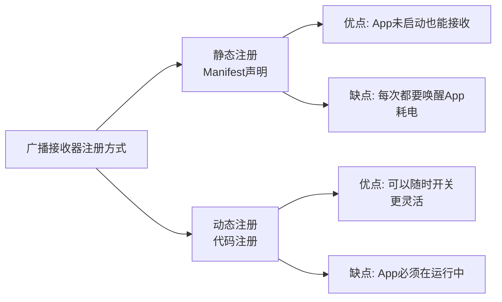
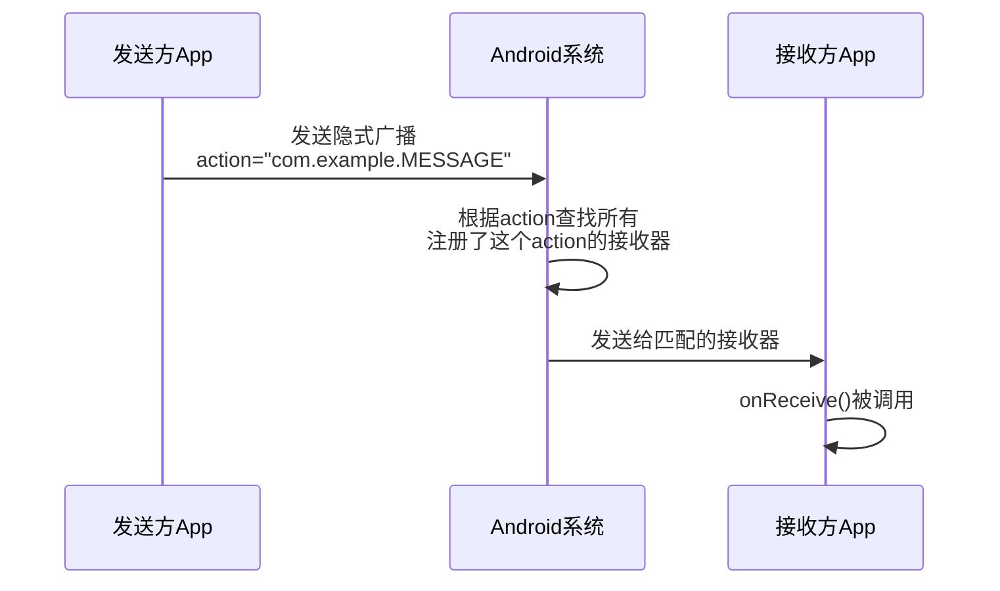
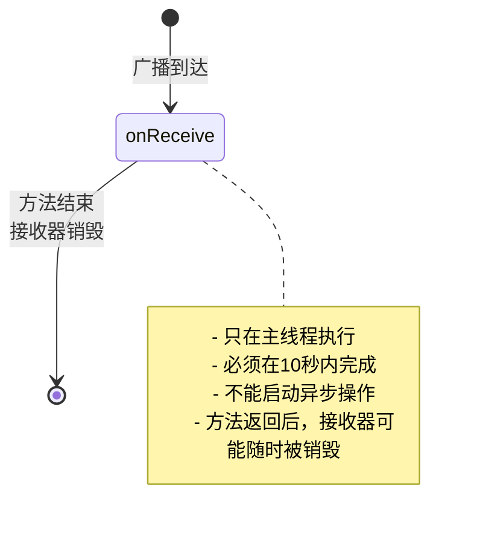
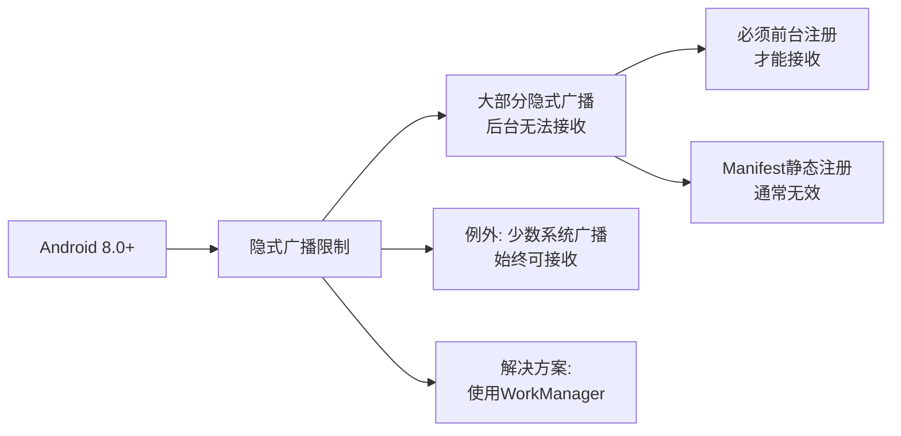

# 6.1.5 天空中的信鸽

---

远处的围栏里，几匹马正悠然自得地嚼着草。洛芙盯着它们看了一会儿，忽然意识到一个的问题。

“黛琳，”她翻了个身，侧躺着看向正在整理白板的黛琳，“你说系统把我们'关进围栏'了，那如果真的有很重要的事情——比如电池快没电了、网络状态变了、系统语言切换了——系统怎么通知我们这些'被关起来'的App呢？”

黛琳手中的白板笔顿了一下。她抬起头，眼中闪过一丝赞许。

“问得好。”她把白板架好，“这就像——”

“信鸽！”伊莎突然插话。她正把一颗松子放在指尖上抛着玩，“系统就是放信鸽的那个人，把消息绑在脚上，不管你在不在围栏里，只要你在Android这片天空下，就能收到。”

希尔眼睛一亮：“对，就是广播。Android系统每天会发送成千上万只'信鸽'，告诉所有App外面发生了什么大事。”

“广播？”洛芙眨眨眼，“就像电台广播一样，谁都能收到？”

“差不多。”黛琳点点头，在白板上写下三个大字——**广播**，“今天我们就来聊聊，这个比野马还古老的通信方式，在Android世界里是怎么工作的。”

---

## 1.1 什么是Android广播

伊莎把手中的松子轻轻放在草地上，坐直了身子。

“想象一下，”她的声音柔和得像秋日的微风，“你在一片大草原上养了一群信鸽。这些信鸽会飞向四面八方，不管你在哪里，它们都能找到你。”

她比划着手势，像是在放飞一群看不见的鸽子。

“在Android世界里，广播就是这样一种机制——系统或者某个App放出一只'信鸽'（Intent），这只信鸽会飞向所有注册了要接收它的App。”

黛琳补充道：“广播是一种**全系统范围的消息传递机制**。当系统中发生了什么重要的事情——比如网络连接变化、电池电量低、拍照完成、开机完成——系统就会放出一只'信鸽'，告诉所有感兴趣的App：'嘿，出事了！'”

“那我们怎么知道有信鸽飞过来？”洛芙好奇地问。

“需要有个人守着屋顶，等鸽子落下来。”希尔笑了笑，“在Android里，这个人叫**BroadcastReceiver**——广播接收器。”

她打开笔记本电脑，调出一段代码。

```kotlin
// 这是一个最简单的广播接收器
class MyBroadcastReceiver : BroadcastReceiver() {
    override fun onReceive(context: Context, intent: Intent) {
        // 当广播到达时，这个方法会被调用
        // intent 就是那只"信鸽"，里面装着消息
        val message = intent.getStringExtra("message")
        Log.d("MyReceiver", "收到广播: $message")
    }
}
```

洛芙凑过去看：“所以这个onReceive方法，就是'接到信鸽'时候做的事情？”

“对。”黛琳点点头，“当匹配的广播飞来时，系统会唤醒你的接收器，调用onReceive方法。你可以从intent里取出消息，做你想做的事情。”

---

## 1.2 广播的两种类型

希尔调整了一下坐姿，让阳光更好地照在屏幕上。

“广播分两种，”她说，“一种是系统放的'信鸽'——我们叫它**系统广播**；还有一种是App自己放的——叫**自定义广播**。”

她调出另一段代码。

```kotlin
// 发送一个自定义广播
fun sendCustomBroadcast(context: Context) {
    val intent = Intent("com.myapp.MY_CUSTOM_ACTION").apply {
        putExtra("message", "Hello from my app!")
        putExtra("data", 12345)
    }
    context.sendBroadcast(intent)
}
```

“这是我们自己的App发的广播，”希尔解释道，“你可以定义任何'动作名称'——就像给信鸽腿上绑一个带名字的标签。收到这个广播的条件是：其他App在注册接收器时，必须指定相同的动作名称。”

伊莎接着说：“系统广播呢？系统会放哪些信鸽？”

黛琳在白板上列了几个常见的系统广播：

| 动作名称 | 什么时候发送 |
|---------|-------------|
| `android.intent.action.BOOT_COMPLETED` | 设备启动完成 |
| `android.intent.action.BATTERY_LOW` | 电量低 |
| `android.intent.action.BATTERY_OKAY` | 电量恢复正常 |
| `android.net.conn.CONNECTIVITY_CHANGE` | 网络连接变化 |
| `android.intent.action.ACTION_POWER_CONNECTED` | 充电线插入 |
| `android.intent.action.ACTION_POWER_DISCONNECTED` | 充电线拔出 |
| `android.intent.action.LOCALE_CHANGED` | 系统语言改变 |
| `android.intent.action.SCREEN_ON` | 屏幕点亮 |

“这些都是系统每天在放的'信鸽'，”黛琳说，“你的App可以注册接收这些广播，就算在后台也能收到通知。”

---

## 1.3 接收器注册方式：两种门禁

洛举起手：“那个……怎么注册这个接收器呢？就像我要先跟信鸽说'以后有你的信就来找我'？”

“问得好。”希尔打了个响指，“有两种方式：一种是**静态注册**——在Manifest文件里声明；另一种是**动态注册**——在代码里随时注册和注销。”

她在白板上画了一个简单的对比图：



“先说静态注册，”希尔解释道，“就像在营地门口挂个牌子，写着'我有信鸽服务'。不管你在不在，系统都知道你会接收这种广播。”

```xml
<!-- AndroidManifest.xml 中声明接收器 -->
<receiver 
    android:name=".MyBroadcastReceiver"
    android:exported="true">
    <intent-filter>
        <!-- 声明要接收的动作 -->
        <action android:name="android.intent.action.BOOT_COMPLETED" />
        <action android:name="android.net.conn.CONNECTIVITY_CHANGE" />
    </intent-filter>
</receiver>
```

洛芙看着这段XML：“这个android:exported="true"是什么意思？”

“相当于牌子上写着'欢迎外来信鸽'，”伊莎笑着说，“如果设为false，那就只有你自己的App发的广播才能收到。true表示其他App的广播也可以接收。”

“动态注册呢？”洛芙又问。

希尔切换到另一段代码：

```kotlin
class MainActivity : AppCompatActivity() {
    
    private lateinit var receiver: MyBroadcastReceiver
    
    override fun onCreate(savedInstanceState: Bundle?) {
        super.onCreate(savedInstanceState)
        
        // 创建接收器实例
        receiver = MyBroadcastReceiver()
        
        // 创建过滤器，指定要接收什么广播
        val filter = IntentFilter().apply {
            addAction("android.net.conn.CONNECTIVITY_CHANGE")
            addAction("android.intent.action.BOOT_COMPLETED")
        }
        
        // 注册接收器
        // 这里的this是Context，会一直生效到注销为止
        registerReceiver(receiver, filter)
    }
    
    override fun onDestroy() {
        super.onDestroy()
        // 重要！一定要注销接收器
        unregisterReceiver(receiver)
    }
}
```

“动态注册就像你在营地里设了个'值班表’，”伊莎解释道，“你在的时候才生效，不在的时候就撤掉。这样更省力，也不会浪费资源。”

洛芙注意到一个关键点：“那个onDestroy里要注销……是不是就像值班表要收起来，不然下个人来不知道该谁值班了？”

“对！”希尔笑了，“如果不注销，App可能会收到已经不需要的广播，甚至导致内存泄漏。”

---

## 1.4 隐式广播 vs 显式广播

黛琳走到白板前，画了两个圆圈。

“广播还有另一种分类方式：**隐式广播**和**显式广播**。”

她在左边写下"隐式广播"：



“**隐式广播**，”黛琳解释道，“就像你在草原上喊了一嗓子'谁要收信？'，不指定具体给谁，谁感兴趣谁就接。”

她举了个例子：

```kotlin
// 这是一个隐式广播
val intent = Intent("com.example.MY_MESSAGE").apply {
    putExtra("content", "有人给你发消息啦")
}
sendBroadcast(intent)  // 没有指定包名，谁爱收谁收
```

“**显式广播**呢？”洛芙问。

“显式广播就像你直接把信塞进特定的信箱，”黛琳说，“你指定了要给谁，不会发给别人。”

```kotlin
// 这是一个显式广播
val intent = Intent().apply {
    // 指定了具体的组件/包名
    setClassName("com.example.targetapp", "com.example.targetapp.MyReceiver")
    putExtra("content", "这是给你的密信")
}
sendBroadcast(intent)
```

伊莎补充道：“在Android 8.0以后，很多隐式广播在后台都收不到了——这也是'围栏'的一部分。我们后面会详细说。”

---

## 1.5 生命周期与注意事项

洛芙看着代码，若有所思：“那个onReceive方法……是不是跟Activity的onCreate什么的感觉差不多？”

“表面像，但本质不同。”黛琳的表情认真起来，“BroadcastReceiver的生命周期非常非常短。”

她调出一个图表：



“**BroadcastReceiver只能存活到onReceive方法执行完毕**，”黛琳强调，“方法一返回，系统就认为你可以'去休息了'，随时可能把你的进程杀掉。”

“所以不能在里面做耗时的事情？”洛芙问。

“绝对不能。”希尔接过话，“如果你在onReceive里做一个网络请求——假设网络慢，要等30秒——对不起，你的App可能会被系统直接砍掉。”

她展示了正确的做法：

```kotlin
class MyReceiver : BroadcastReceiver() {
    override fun onReceive(context: Context, intent: Intent) {
        // ❌ 错误做法：在主线程做耗时操作
        // val data = NetworkService.fetchData() // 会卡住！
        // val result = heavyComputation() // 会ANR！
        
        // ✅ 正确做法1：把工作交给 WorkManager
        if (intent.action == "android.net.conn.CONNECTIVITY_CHANGE") {
            val workRequest = OneTimeWorkRequestBuilder<MyWorker>().build()
            WorkManager.getInstance(context).enqueue(workRequest)
        }
        
        // ✅ 正确做法2：启动一个前台Service（如果真的很紧急）
        val pendingResult = goAsync() // 告诉系统"我还没完"
        // 在后台线程处理...
        // 处理完后调用 pendingResult.finish()
    }
}
```

洛芙眼睛瞪大了：“goAsync是什么？”

“相当于你在处理事情的时候举手说'裁判稍等，我还没完'，”希尔解释道，“这样系统会给你多一点时间，不会立刻把你的进程杀掉。但你还是要尽快处理完。”

---

## 1.6 发送广播：不只是sendBroadcast

伊莎捡起一根草茎，在指尖绕了绕。

“刚才希尔说的是接收，”她说，“那发送广播有什么讲究吗？”

黛琳点点头：“有三种发送方式，每种'信鸽'的速度和范围都不一样。”

她在白板上写下：

| 方法 | 特点 | 用途 |
|-----|------|------|
| `sendBroadcast()` | 最快，谁都能收到 | 普通消息 |
| `sendOrderedBroadcast()` | 按优先级顺序传递，可以"截停" | 需要特定顺序处理 |
| `sendStickyBroadcast()` | 会"粘"在新注册的接收器上（已废弃） | 不推荐使用 |

“**sendBroadcast**就是最普通的喊一嗓子，”伊莎说，“谁都能听见，但顺序不定。”

“**sendOrderedBroadcast**呢？”洛芙问。

“就像运动会的接力赛，”黛琳解释道，“每个人跑完一段，才能把棒子交给下一个。你可以通过android:priority控制谁先收到，中间的接收器还可以**中止广播**，让它不再往下传。”

```kotlin
// 发送有序广播
val intent = Intent("com.example.MY_ORDERED_ACTION").apply {
    putExtra("message", "这是接力赛")
}
sendOrderedBroadcast(
    intent,
    null,  // 权限
    null,  // 最终结果接收器（可以没有）
    null,  // 初始代码
    0,     // 初始数据
    0,     // 初始Flags
    null   // 额外数据
)
```

“在Manifest里可以设置优先级，”希尔补充道，“数字越大越先收到，最高1000。”

```xml
<receiver 
    android:name=".HighPriorityReceiver"
    android:exported="true">
    <intent-filter android:priority="1000">
        <action android:name="com.example.MY_ORDERED_ACTION" />
    </intent-filter>
</receiver>
```

---

## 1.7 后台限制：还能好好收广播吗

洛芙忽然想起之前的话题：“对了，刚才你说Android 8.0以后很多隐式广播在后台收不到了？”

黛琳的表情变得有些严肃：“是的，这是'围栏'政策的一部分。”

她调出一份清单：



“具体来说，”黛琳解释道，“如果你的App在后台运行（即没有前台Activity），系统不会唤醒你来接收大多数隐式广播。这是为了省电——毕竟每天成千上万只信鸽飞来飞去，App每次都被唤醒会很耗电。”

“那哪些广播是例外？”洛芙问。

“很少一部分，”希尔查询了一下文档，“比如：

- `ACTION_LOCKED_BOOT_COMPLETED`
- `ACTION_USER_PRESENT`  
- `TIME_TICK`
- `SYNC_SERVICE_STATE_CHANGED`

其他大多数？你得用其他方式。”

“比如WorkManager？”伊莎问。

“对，”黛琳点点头，“比如你想在网络状态变化时做点什么，不要注册接收`CONNECTIVITY_CHANGE`广播，而是用WorkManager定期检查网络状态，或者用`NetworkCallback`——这是更省电的方式。”

---

## 1.8 LocalBroadcastManager：App内部的信鸽

洛芙翻着笔记，忽然看到一个奇怪的名字：“LocalBroadcastManager？这是什么？”

希尔笑了笑：“这个啊……是个'老朋友'了。”

“在早期，你可以用LocalBroadcastManager发送只在App内部流转的广播，”她解释道，“就像你在营地里养了一群信鸽，它们只在你们的营地范围内飞，不会飞到外面去。”

```kotlin
// 现在已经不推荐使用了！
// 但代码大概长这样
val intent = Intent("com.myapp.INTERNAL_ACTION")
LocalBroadcastManager.getInstance(context).sendBroadcast(intent)
```

“那为什么说不推荐了？”洛芙问。

“首先，它只是一个'补丁'，不是系统原生功能，”黛琳解释道，“其次，用它解决的问题，其实用LiveData、EventBus或者直接的方法调用都能更好地解决。”

希尔补充道：“Google官方已经在文档里标注为deprecated了。所以，了解它存在过就好，实际开发中别用。”

---

## 1.9 实战示例：监听网络变化

“好啦，”希尔伸了个懒腰，“我们来做一个完整的例子——监听网络状态变化。”

她打开Android Studio，创建了一个新文件。

“首先，我们需要一个接收器，”她写道，“这次用动态注册的方式，因为网络状态变化是高频事件，我们希望在App打开的时候才监听。”

```kotlin
class NetworkChangeReceiver : BroadcastReceiver() {
    
    override fun onReceive(context: Context, intent: Intent) {
        if (intent.action == ConnectivityManager.CONNECTIVITY_ACTION) {
            val connectivityManager = 
                context.getSystemService(Context.CONNECTIVITY_SERVICE) as ConnectivityManager
            val networkInfo = connectivityManager.activeNetworkInfo
            val isConnected = networkInfo?.isConnected == true
            
            // 用LiveData通知UI（避免直接操作UI）
            NetworkStatusLiveData.value = isConnected
        }
    }
}
```

“然后在Activity里注册它，”希尔继续写：

```kotlin
class MainActivity : AppCompatActivity() {
    
    private lateinit var networkReceiver: NetworkChangeReceiver
    
    override fun onCreate(savedInstanceState: Bundle?) {
        super.onCreate(savedInstanceState)
        
        networkReceiver = NetworkChangeReceiver()
        val filter = IntentFilter(ConnectivityManager.CONNECTIVITY_ACTION)
        
        // Android 7.0+ 需要单独处理这个广播
        if (Build.VERSION.SDK_INT >= Build.VERSION_CODES.N) {
            registerReceiver(
                networkReceiver, 
                filter,
                RECEIVE_NOTIFICATIONS,
                null
            )
        } else {
            registerReceiver(networkReceiver, filter)
        }
    }
    
    override fun onDestroy() {
        super.onDestroy()
        unregisterReceiver(networkReceiver)
    }
}
```

洛芙看着代码：“等等，这个RECEIVE_NOTIFICATIONS是什么？”

“一个权限，”黛琳解释说，“Android 7.0以后，动态注册一些特定广播需要声明权限。不过对于CONNECTIVITY_CHANGE，其实不需要特殊权限——系统开了个后门。”

---

## 1.10 反模式与最佳实践

伊莎忽然正色道：“在讲完广播之前，我们来说说常见的错误做法。”

黛琳点点头，在白板上写下"反模式"三个字。

### ❌ 反模式1：在接收器里启动后台线程但不等待

```kotlin
// 错误做法
class BadReceiver : BroadcastReceiver() {
    override fun onReceive(context: Context, intent: Intent) {
        // 启动了线程，但方法立刻就返回了
        Thread {
            // 假设这里有个网络请求
            val data = NetworkHelper.downloadData()
            // 保存到数据库
            DatabaseHelper.save(data)
        }.start()
        // onReceive返回了，但线程还在跑
        // 系统可能随时杀掉进程，导致数据没保存成功
    }
}
```

### ✅ 正确做法：使用PendingResult或WorkManager

```kotlin
// 正确做法：使用 goAsync()
class GoodReceiver : BroadcastReceiver() {
    override fun onReceive(context: Context, intent: Intent) {
        val pendingResult = goAsync()
        
        Thread {
            try {
                val data = NetworkHelper.downloadData()
                DatabaseHelper.save(data)
            } finally {
                // 一定要调用finish()
                pendingResult.finish()
            }
        }.start()
    }
}

// 或者更好：使用 WorkManager
class BetterReceiver : BroadcastReceiver() {
    override fun onReceive(context: Context, intent: Intent) {
        val workRequest = OneTimeWorkRequestBuilder<SyncWorker>()
            .build()
        WorkManager.getInstance(context).enqueue(workRequest)
    }
}
```

### ❌ 反模式2：在Manifest注册太多接收器

```xml
<!-- 错误做法：注册了几十个广播 -->
<receiver android:name=".AllTheReceivers">
    <intent-filter>
        <action android:name="android.intent.action.BOOT_COMPLETED" />
        <action android:name="android.net.conn.CONNECTIVITY_CHANGE" />
        <action android:name="android.intent.action.BATTERY_LOW" />
        <!-- ... 几十个action -->
    </intent-filter>
</receiver>
```

### ✅ 正确做法：只注册需要的，按功能拆分

```xml
<!-- 正确做法：按功能拆分接收器 -->
<receiver android:name=".BootCompletedReceiver">
    <intent-filter>
        <action android:name="android.intent.action.BOOT_COMPLETED" />
    </intent-filter>
</receiver>

<receiver android:name=".NetworkChangeReceiver">
    <intent-filter>
        <action android:name="android.net.conn.CONNECTIVITY_CHANGE" />
    </intent-filter>
</receiver>
```

---

## 1.11 本章小结

洛芙长长地出了一气。

“所以广播就是……”她总结道，“系统或者App发的消息，像信鸽一样飞来飞去。我们可以注册接收器来'抓住'这些信鸽，看到消息内容，然后做该做的事情。”

“但要记住，”黛琳补充道，“接收器的生命很短暂，不能在里面做耗时的事情。如果需要做大事，就交给WorkManager。”

“对，”希尔说，“而且Android 8.0以后，很多隐式广播在后台都收不到了。要用更现代的方式——比如WorkManager、NetworkCallback这些。”

伊莎微微一笑：“这就是Android的'信鸽'之道——让消息飞一会儿，但别让它飞太远。”

---

> 广播（Broadcast）是Android系统中一种全组件的通信机制，允许应用或系统发送Intent让多个组件同时响应。系统广播用于通知应用系统事件（如开机、网络变化），自定义广播用于应用间通信。接收广播需要注册BroadcastReceiver，有静态（Manifest）和动态（代码）两种方式。Android 8.0后对后台接收隐式广播做了限制，需要使用WorkManager等现代方案替代。

---

> 学习建议：理解广播的适用场景——它最适合处理"一次性、短暂"的系统事件通知。对于需要后台持续监听的需求，优先考虑WorkManager或Foreground Service。动态注册比静态注册更灵活、更省电，能用动态就别用静态。

---

## 🍀 洛芙的小小日记本

今天学到了广播！就像信鸽一样，系统会"飞鸽传书"告诉我们发生了什么。但是信鸽停留的时间很短，不能让它干太多活，不然会被系统"轰走"。而且现在很多信鸽在后台都收不到了，要用WorkManager代替——感觉就像从放风筝变成了用对讲机，虽然不那么自由了，但更可靠！

---

## 今日关键词

- **广播（Broadcast）**：Android系统中一种全组件的通信机制，可以向所有注册的组件发送消息
- **BroadcastReceiver**：广播接收器，用于接收广播的组件，生命周期极短
- **Intent**：广播的载体，就像绑在信鸽腿上的消息
- **系统广播（System Broadcast）**：由Android系统发送的广播，通知系统事件
- **自定义广播（Custom Broadcast）**：由App发送的广播
- **隐式广播（Implicit Broadcast）**：不指定具体接收者，谁感兴趣谁收
- **显式广播（Explicit Broadcast）**：指定具体的接收者
- **静态注册（Static Registration）**：在AndroidManifest中声明接收器
- **动态注册（Dynamic Registration）**：在代码中注册和注销接收器
- **onReceive()**：接收器接收到广播时调用的方法，必须快速完成
- **goAsync()**：让接收器延迟销毁的辅助方法
- **sendBroadcast()**：发送普通广播的方法
- **sendOrderedBroadcast()**：发送有序广播的方法
- **PendingIntent**：可以延迟执行的Intent，用于在特定时机触发操作
- **后台限制（Background Restrictions）**：Android 8.0+对后台接收广播的限制
- **LocalBroadcastManager**：App内部广播管理器（已废弃）
- **WorkManager**：推荐的后台任务解决方案
- **ConnectivityManager**：网络连接状态管理器
- **CONNECTIVITY_CHANGE**：网络状态变化广播的动作名
