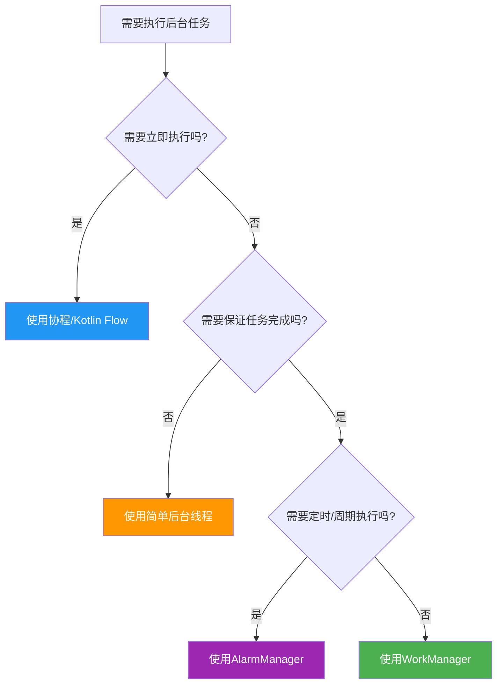
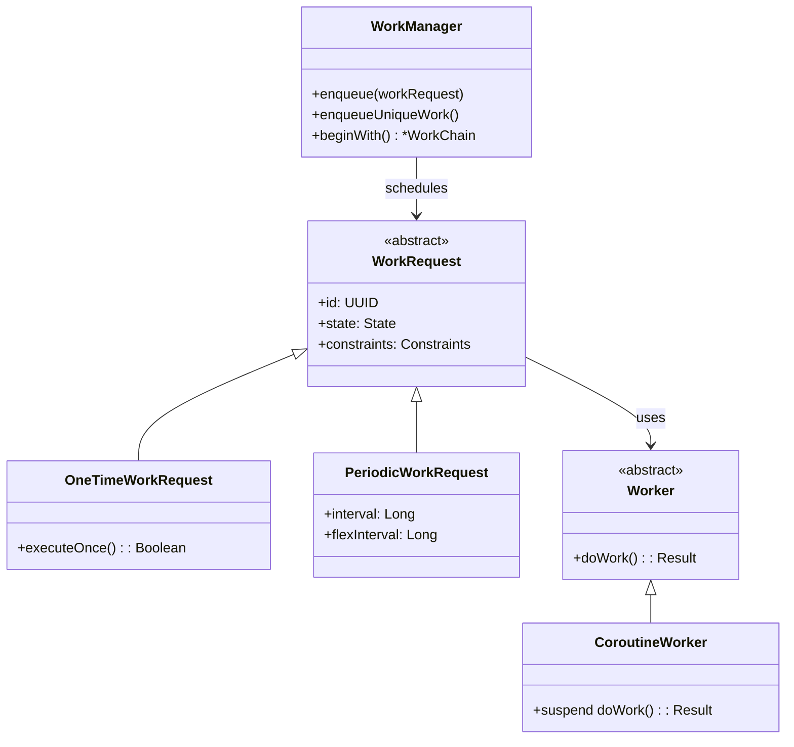

# 6.1.6 数据传输后台任务选项

太阳已经很低了。

准确地说是正在缓慢地沉入远处的山脊线那边，把整片湖水染成了碎金。洛芙抱膝坐在篝火边，看着那金色一点一点地朝岸边蔓延过来，最后在脚边的石头上铺开一层温暖的光膜。

“真美啊……”她轻声说。

“是呢。”伊莎靠在她旁边，手里捧着一杯热可可，蒸汽裹挟着可可的甜香在傍晚的空气里缓缓上升，“秋天傍晚的天空，就像打翻了的调色盘。”

黛琳从背包里取出一个精致的小盒子——木质的，雕刻着精细的花纹，表面还有一个小小的玻璃窗口。洛芙好奇地凑过去：“这是什么？”

“信鸽笼。”黛琳嘴角微微上扬。

“诶？！”洛芙眨了眨眼，“又是信鸽？我们刚才不是讲过广播就是像信鸽一样飞来飞去的吗？”

“广播是信鸽没错，”希尔不知道什么时候已经坐在了笔记本电脑前，屏幕的光映在她兴奋的脸上，“但信鸽只能送信，不能帮你做事情啊。比如——你让它帮你把一封信送到镇上邮局，同时还要它帮你取回包裹，再顺便买点晚餐的食材回来——一只信鸽可做不到。”

“所以这个是……”

“机械信鸽。”黛琳轻轻打开盒子，从里面取出一个大约手掌大小的金属小鸟，翅膀上镌刻着精细的纹路，“它的名字叫WorkManager。在Android的世界里，它是最靠谱的‘跑腿工人’——你告诉它要做什么，它就会在后台勤勤恳恳地完成，而且就算你关闭了应用、手机重启了，它也不会忘记自己的工作。”

洛芙的眼睛亮了起来：“这么厉害？那它和我们之前讲的广播、还有Service有什么区别呢？”

“好问题。”黛琳把机械信鸽放在手心里，让它沐浴在最后的夕阳余晖下，“走，我们坐下来慢慢聊——这可是Android开发里最重要的技能之一呢。”

---

## 问题发现

洛芙把下巴搁在膝盖上，看着篝火跳动的火苗：“可是黛琳，我有点分不清了。之前我们讲Broadcast的时候，说它可以接收系统事件；Service呢，是长期在后台运行的服务。那WorkManager又是什么时候用的？”

“问得好。”黛琳拨了拨篝火，让火星更好地升腾起来，“你想啊——如果你有一个需求，是'今天晚上八点的时候，把用户今天拍的照片备份到云端去'，你会怎么实现？”

洛芙想了想：“嗯……用BroadcastReceiver监听时间？”

“可以，但有几个问题。”希尔接过话头，“第一，系统广播不是每时每刻都能收到的——Android 8.0以后，很多系统广播都不能在后台随意接收了；第二，如果你手机关机了，或者应用被杀掉了，这个任务就彻底黄了；第三，你得自己处理电量优化、失败重试这些破事儿。”

“所以……”

“所以你需要的是一个'就算应用被杀、手机重启、任务也能继续执行'的解决方案。”黛琳总结道，“这就是WorkManager出场的时候——它是Google官方推荐的、用于'可延迟的后台任务'的首选方案。”

伊莎轻轻抚摸着旁边已经睡着的小橘猫（今天的露营有个意外的访客——一只碰巧路过的小橘猫），柔声说道：“就像一个忠诚的信使，它会把你要做的事情记在心里，哪怕路途遥远、风雨阻隔，也一定会送到呢。”

---

## 正文知识讲解

### 1. WorkManager是什么

黛琳在地上铺开一张折叠小桌板，把笔记本电脑架好：“我先给你看看官方文档里的定义，然后再用我们的话来解释。”

她打开Chrome，搜索出Android开发者文档：“看，这里写着——WorkManager是一个库，用于调度'可延迟'的后台任务。所谓'可延迟'，就是'不必立刻马上执行，稍后执行也可以'的任务。”

“让我来帮你翻译一下。”伊莎笑着说，“就好比你告诉你的小信鸽：‘明天早上天亮的时候，去森林里采一朵最美的花回来。’这是一朵可以‘稍后再采’的花——而不是‘现在立刻就要，否则会死掉’的事情。”

洛芙点头：“明白了！那哪些是'不能稍后'的呢？”

“比如用户正在等着的操作。”黛琳说，“如果用户点击了'保存'按钮，你总不能告诉用户'好的，我稍后会保存'——这种情况下你不能用WorkManager，而应该用普通的协程或者Handler在当前线程处理。”

希尔补充道：“再举几个例子——同步数据到云端、压缩图片、发送日志、上传备份……这些都可以等一会儿再做。真正需要立即执行的场景其实很少，大部分后台任务都可以交给WorkManager。”

黛琳调出Android开发者网站上的对比图：“你看，这里有张图很清楚地说明了什么时候用什么——”



（图1：Android后台任务选择流程图，对应下方文字说明）

“绿颜色的那个框，就是我们今天要讲的WorkManager。”黛琳说，“可以看到，它是'需要保证任务完成但不需要立即执行'时的首选方案。”

---

### 2. 第一个WorkManager任务

“说了这么多，不如我们来写一个真正的例子吧！”希尔兴奋地搓搓手，“洛芙，你想让这个小信鸽帮你做什么？”

洛芙想了想：“嗯……那就让它帮我'打印一条日志'吧！就说是'露营愉快！'”

“太简单了，我们来点稍微有意义一点的。”希尔笑着说，“这样——我们模拟一个'上传露营日记到云端'的任务。这个任务需要：1）读取日记内容；2）模拟上传过程；3）返回结果。”

她开始敲代码：

```kotlin
// 导入WorkManager相关类
import androidx.work.OneTimeWorkRequestBuilder
import androidx.work.WorkManager
import androidx.work.Worker
import androidx.work.WorkerParameters
import android.content.Context
import android.util.Log

// 第一步：创建一个Worker类
class UploadCampDiaryWorker(
    context: Context,
    params: WorkerParameters
) : Worker(context, params) {

    // 这个方法会在后台线程中执行
    override fun doWork(): Result {
        // 获取传入的参数（如果有的话）
        val diaryTitle = inputData.getString("diary_title") ?: "今日露营"
        
        Log.d("WorkManager", "开始上传日记: $diaryTitle")
        
        // 模拟上传过程（实际开发中这里是真正的网络请求）
        try {
            // 模拟耗时操作：读取日记内容并上传
            val diaryContent = "今天在湖边露营，烤了棉花糖，还看到了最美的夕阳。"
            
            // 假设上传需要3秒钟
            Thread.sleep(3000)
            
            // 上传成功
            Log.d("WorkManager", "日记上传成功！内容: $diaryContent")
            
            // 返回成功结果，并可以携带输出数据
            val outputData = androidx.work.Data.Builder()
                .putString("uploaded_title", diaryTitle)
                .putBoolean("success", true)
                .build()
            
            return Result.success(outputData)
            
        } catch (e: Exception) {
            // 上传失败，返回失败结果
            Log.e("WorkManager", "日记上传失败: ${e.message}")
            return Result.failure()
        }
    }
}

// 第二步：在Activity或Application中调度这个任务
fun uploadDiary(context: Context) {
    // 创建输入数据
    val inputData = androidx.work.Data.Builder()
        .putString("diary_title", "湖边露营日记")
        .build()
    
    // 创建一次性工作请求
    val uploadRequest = OneTimeWorkRequestBuilder<UploadCampDiaryWorker>()
        .setInputData(inputData)  // 传入数据
        .build()
    
    // 将任务加入队列
    WorkManager.getInstance(context).enqueue(uploadRequest)
    
    Log.d("WorkManager", "日记上传任务已加入队列")
}
```

洛芙看着屏幕：“等等，你说'后台线程'—— WorkManager会自动帮我们处理线程问题吗？”

“没错！”黛琳点头，“这是WorkManager最方便的地方之一。你不需要自己创建线程、关闭线程，WorkManager会自动在后台线程上执行你的任务。你只需要专注于业务逻辑就好。”

“而且啊，”希尔补充道，“就算你的应用被杀掉了、手机重启了，只要系统资源允许，这个任务就会继续执行。系统会自动帮你管理这一切。”

---

### 3. 任务约束：让信鸽更聪明

伊莎轻轻把正在打呼噜的小橘猫往旁边挪了挪：“可是黛琳，如果网络不好怎么办？总不能让信鸽在暴风雨中起飞吧？”

“你说得太对了！”黛琳笑了，“WorkManager支持'约束'（Constraints）——你可以告诉它'只有在满足这些条件的时候才执行'。”

她调出代码示例：

```kotlin
// 创建约束条件
val constraints = Constraints.Builder()
    .setRequiredNetworkType(NetworkType.CONNECTED)  // 需要网络连接
    .setRequiresBatteryNotLow(true)                  // 电量不能太低
    .setRequiresCharging(true)                       // 正在充电
    .setRequiresDeviceIdle(true)                     // 设备处于空闲状态
    .build()

// 创建带约束的工作请求
val constrainedRequest = OneTimeWorkRequestBuilder<UploadCampDiaryWorker>()
    .setInputData(inputData)
    .setConstraints(constraints)  // 设置约束条件
    .build()

WorkManager.getInstance(context).enqueue(constrainedRequest)
```

“如果网络没连上，或者手机电量只剩下5%，WorkManager会自动等待。”黛琳解释道，“直到条件满足，它才会让'小信鸽'起飞。”

“有种被温柔以待的感觉呢。”伊莎托着腮帮子说，“就像一个贴心的管家，会看时机做事。”

---

### 4. 任务链：串联多个信鸽

“如果有很多事情要依次做怎么办？”洛芙问，“比如我要先拍照，然后压缩图片，最后上传——这三步必须按顺序来。”

“这就涉及到'任务链'（WorkChain）了。”希尔眼睛一亮，又开始敲代码，“看——”

```kotlin
// 假设我们有三个Worker：
// 1. TakePhotoWorker - 拍照
// 2. CompressImageWorker - 压缩图片
// 3. UploadImageWorker - 上传图片

// 使用WorkChain串联这三个任务
val workChain = WorkManager.getInstance(context)
    .beginWith(OneTimeWorkRequestBuilder<TakePhotoWorker>().build())
    .then(OneTimeWorkRequestBuilder<CompressImageWorker>().build())
    .then(OneTimeWorkRequestBuilder<UploadImageWorker>().build())
    .enqueue()
```

“这里的'beginWith'是开始，'then'是接下来要做的。”希尔解释道，“它们会按顺序执行——只有上一个任务成功了，下一个才会开始。”

“如果中间某一个失败了怎么办？”洛芙追问。

“好问题！”希尔调出另一个示例，“默认情况下，如果中间某个任务失败了，整个链就会停止。但你也可以配置它重试——”

```kotlin
// 在Worker中返回Result.retry()来触发重试
override fun doWork(): Result {
    return if (shouldRetry) {
        Result.retry()  // 让WorkManager稍后重试这个任务
    } else {
        Result.failure()  // 彻底失败，不再重试
    }
}

// 或者设置重试策略
val request = OneTimeWorkRequestBuilder<UploadImageWorker>()
    .setBackoffCriteria(
        BackoffPolicy.EXPONENTIAL,  // 指数退避：1秒 → 2秒 → 4秒 → 8秒...
        10,                          // 最小等待时间：10秒
        TimeUnit.SECONDS
    )
    .build()
```

（图2：任务链执行流程图，对应上方代码）

“指数退避”这个比喻让洛芙立刻明白了：“就像如果信鸽第一次送信没送到，它会等一会儿再试一次；如果还是没送到，等的时间会更长——对吧？”

“Exactly！”希尔打了个响指。

---

### 5. 定期任务：周期性的信鸽

“那如果我想让信鸽每天早上去检查一下有没有新通知呢？”洛芙又问。

“哈，那就要用'定期任务'（PeriodicWorkRequest）了。”黛琳说，“不过要注意，定期任务的最小间隔是15分钟——你不能让它每分钟都跑一次，那样太浪费电了。”

```kotlin
// 创建定期任务（每15分钟执行一次）
val periodicRequest = PeriodicWorkRequestBuilder<CheckNotificationsWorker>(
    15, TimeUnit.MINUTES  // 最小间隔15分钟
)
.setConstraints(constraints)
.build()

WorkManager.getInstance(context).enqueueUniquePeriodicWork(
    "daily_notification_check",  // 唯一的工作名称
    ExistingPeriodicWorkPolicy.KEEP,  // 如果已存在则保留
    periodicRequest
)
```

“'唯一的工作名称'是什么意思？”洛芙问。

“很简单——如果你尝试添加一个同名的工作，'KEEP'策略会保留原来的，'REPLACE'策略会替换成新的。”黛琳解释，“这样就不会出现重复任务了。”

---

### 6. 观察任务状态：知道信鸽在做什么

“我怎么知道任务有没有在执行？执行成功了还是失败了？”洛芙问道。

“这时候就需要'观察'（Observation）了。”希尔调出新的代码：

```kotlin
// 观察单个任务的状态
WorkManager.getInstance(context)
    .getWorkInfoByIdLiveData(uploadRequest.id)  // 通过ID获取LiveData
    .observe(this) { workInfo ->
        when (workInfo?.state) {
            WorkInfo.State.ENQUEUED -> Log.d("WorkManager", "任务已加入队列")
            WorkInfo.State.RUNNING -> Log.d("WorkManager", "任务执行中...")
            WorkInfo.State.SUCCEEDED -> Log.d("WorkManager", "任务成功完成！")
            WorkInfo.State.FAILED -> Log.d("WorkManager", "任务失败了T_T")
            WorkInfo.State.BLOCKED -> Log.d("WorkManager", "任务被阻塞，等待中")
            WorkInfo.State.CANCELLED -> Log.d("WorkManager", "任务已被取消")
        }
    }

// 观察所有同名任务的状态
WorkManager.getInstance(context)
    .getWorkInfosForUniqueWorkLiveData("upload_diary")
    .observe(this) { workInfoList ->
        workInfoList?.forEach { info ->
            Log.d("WorkManager", "任务状态: ${info.state}")
        }
    }
```

“这里用的是LiveData，所以可以自动更新UI。”希尔补充道，“如果你用的是Java或者不想用LiveData，也可以用WorkInfo的getState()方法同步获取状态。”

---

### 7. 任务链实战：洛芙的露营日记App

“来来来，我们来做一个完整的例子。”希尔兴奋地靠在椅背上，“洛ucks，你不是说要做一个露营日记App吗？我们来用WorkManager实现完整的数据同步流程！”

她快速地写着代码：

```kotlin
// ========== 第一步：创建三个Worker ==========

// 1. 同步日记Worker - 从本地数据库读取未同步的日记
class SyncDiaryWorker(
    context: Context,
    params: WorkerParameters
) : CoroutineWorker(context, params) {  // 使用CoroutineWorker更方便
    
    override suspend fun doWork(): Result {
        return try {
            // 从本地数据库读取未同步的日记
            val localDiaries = database.diaryDao().getUnsyncedDiaries()
            
            // 准备要上传的数据
            val diariesData = localDiaries.map { diary ->
                mapOf(
                    "title" to diary.title,
                    "content" to diary.content,
                    "timestamp" to diary.createdAt
                )
            }
            
            // 传递给下一个Worker
            val outputData = Data.Builder()
                .putString("diaries_json", Gson().toJson(diariesData))
                .build()
            
            Result.success(outputData)
        } catch (e: Exception) {
            Result.failure()
        }
    }
}

// 2. 上传日记Worker - 实际上传数据到服务器
class UploadDiariesWorker(
    context: Context,
    params: WorkerParameters
) : CoroutineWorker(context, params) {
    
    override suspend fun doWork(): Result {
        val json = inputData.getString("diaries_json") ?: return Result.failure()
        val diaries = Gson().fromJson(json, Array<Diary>::class.java)
        
        return try {
            // 模拟上传到云端
            api.uploadDiaries(diaries)
            
            // 上传成功后，更新本地数据库状态
            database.diaryDao().markAsSynced(diaries.map { it.id })
            
            Result.success()
        } catch (e: Exception) {
            if (尝试次数 < 3) Result.retry() else Result.failure()
        }
    }
}

// 3. 清理Worker - 同步完成后清理缓存
class CleanupWorker(
    context: Context,
    params: WorkerParameters
) : CoroutineWorker(context, params) {
    
    override suspend fun doWork(): Result {
        // 清理临时文件、更新UI等
        cacheDir.deleteRecursively()
        return Result.success()
    }
}

// ========== 第二步：组合成任务链 ==========
fun startSyncWork(context: Context) {
    // 先定义约束：需要网络，且不是低电量
    val constraints = Constraints.Builder()
        .setRequiredNetworkType(NetworkType.CONNECTED)
        .setRequiresBatteryNotLow(true)
        .build()
    
    // 创建三个工作请求
    val syncRequest = OneTimeWorkRequestBuilder<SyncDiaryWorker>()
        .setConstraints(constraints)
        .build()
    
    val uploadRequest = OneTimeWorkRequestBuilder<UploadDiariesWorker>()
        .build()
    
    val cleanupRequest = OneTimeWorkRequestBuilder<CleanupWorker>()
        .build()
    
    // 串联成链：同步 -> 上传 -> 清理
    WorkManager.getInstance(context)
        .beginWith(syncRequest)
        .then(uploadRequest)
        .then(cleanupRequest)
        .enqueue()
    
    Log.d("WorkManager", "日记同步任务链已启动！")
}
```

“天啊……”洛芙看得眼睛都直了，“这也太完善了吧！从读取到上传再到清理，全部都想到了！”

“这就是WorkManager的强大之处。”黛琳微笑着说，“它帮你处理了最棘手的问题——任务可靠性。你不需要担心'如果上传到一半手机关机了怎么办'，WorkManager会自动处理重试和状态保存。”

---

### 8. 调试与测试：让信鸽听你的话

“说了这么多，那怎么测试呢？”洛芙问，“总不能每次都等它真的去执行吧？”

“问得好！”希尔竖起大拇指，“WorkManager提供了测试工具，让你可以精确控制测试环境。”

```kotlin
// 使用WorkManagerTestInitHelper进行测试
@Test
fun testUploadDiaryWorker() {
    // 初始化测试配置
    val config = Configuration.Builder()
        .setMinimumLoggingLevel(Log.DEBUG)
        .build()
    
    WorkManagerTestInitHelper.initializeTestWorkManager(
        applicationContext,
        config
    )
    
    // 创建测试请求
    val inputData = Data.Builder()
        .putString("diary_title", "测试日记")
        .build()
    
    val testRequest = OneTimeWorkRequestBuilder<UploadCampDiaryWorker>()
        .setInputData(inputData)
        .build()
    
    // 执行测试
    WorkManager.getInstance(applicationContext).enqueue(testRequest)
    
    // 等待任务完成（测试环境会立刻完成）
    val workInfo = WorkManager.getInstance(applicationContext)
        .getWorkInfoById(testRequest.id)
        .get(5, TimeUnit.SECONDS)
    
    // 验证结果
    assertEquals(WorkInfo.State.SUCCEEDED, workInfo?.state)
}
```

“在测试环境里，WorkManager会同步执行所有任务，不会真的等15分钟或者真的网络不可用。”希尔解释道，“这样你就可以快速验证业务逻辑是否正确。”

---

### 9. WorkManager vs 其他方案

“对了，你之前说的'为什么不用Broadcast'和'Service'——现在能再说清楚一点吗？”洛芙歪着头问。

黛琳点点头，画了一个简单的对比表：

| 特性 | BroadcastReceiver | Service | WorkManager |
|------|-------------------|---------|-------------|
| 用途 | 接收系统/应用广播 | 长期运行任务 | 可延迟的后台任务 |
| 生命周期 | 短（收到广播就结束） | 长（需要手动停止） | 自动管理 |
| 系统重启后 | 需要重新注册 | 可能被杀 | 自动恢复 |
| 重试机制 | 无 | 无 | 内置 |
| 电量优化 | 差 | 差 | 好（遵守系统规则） |
| 适用场景 | 响应系统事件 | 音乐播放、导航 | 数据同步、备份、上传 |

“简单来说——”伊莎总结道，“Broadcast像是'喊话'，谁听到了就来一下；Service像是'长工'，一直待命直到你让他休息；而WorkManager像是'信使'——你交代完任务，他就会自己去完成，期间不需要你操心。”

洛芙若有所思地点点头：“所以，如果我要做的事情不是立刻就要有结果的，就可以用WorkManager；对吧？”

“对！”三个人异口同声。

---

夜幕已经完全降临了。

星星一颗一颗地冒出来，像是有人在黑色的天鹅绒幕布上撒了一把碎钻。篝火噼啪作响，火星缓缓上升，然后消失在夜空里。

小橘猫翻了个身，继续打呼噜。

“真美啊。”洛芙仰着头，脖子都酸了也舍不得低下头。

“所以，”黛琳轻轻说，“现在你明白WorkManager了吗？它就像这些星星——你不需要时时刻盯着它，它就在那里，默默地把事情做好。”

洛芙笑了：“我明白了！它是个靠谱的信使，会帮我把任务送到，而且一定会送到。”

“对，就是这样。”伊莎温柔地笑了，“而且它还会告诉你——任务完成了吗？有没有出错？需不需要重试？就像一个会回报的信使一样。”

希尔打了个哈欠：“好了，今天就到这里吧。明天我们再讲Service——那个是'长工'，和'信使'不一样的。”

“好好休息，”黛琳收拾着东西，“明天又是充实的一天呢。”

洛芙最后看了一眼星空，篝火的温暖包围着她。她闭上眼睛，感觉整个世界都安静了下来。

---

## 专业技术总结

> WorkManager 是 Android 官方推荐的用于调度「可延迟的后台任务」的库。它能保证任务即使在应用被杀死、手机重启后也能继续执行，并自动处理电量优化、重试策略等复杂问题。

#### 结构图



#### 复杂度与影响

- **时间复杂度**：O(n) 线性扫描所有待执行任务
- **空间复杂度**：O(k)，k为并发任务数（默认最大为系统CPU核心数）
- **性能影响**：WorkManager 遵循系统电量优化规则，不会随意唤醒设备

#### 反模式与陷阱

1. **在Worker中直接更新UI** ❌  
   Worker运行在后台线程，不能直接操作UI → 改用LiveData、Room等观察者模式

2. **使用WorkManager执行即时任务** ❌  
   WorkManager适用于可延迟任务 → 立即执行的任务用协程/Flow

3. **忘记设置约束条件导致电量消耗** ❌  
   大型上传/下载任务应设置网络约束 → 使用`setRequiredNetworkType(NetworkType.UNMETERED)`

4. **任务链中未正确处理失败** ❌  
   默认失败会停止整个链 → 根据业务需求配置`setExpedited()`或重试策略

#### 设计哲学

WorkManager 的设计体现了三个核心理念：

1. **声明式任务定义**：开发者只需声明"要做什么"，不必关心"如何、何时做"
2. **系统级可靠性**：即使应用被杀死、手机重启，任务也能继续执行
3. **电量优先**：遵守系统省电规则，在合适的时机执行任务

#### 🏕️ 动手练习

**项目目标**：为露营日记App实现一个完整的「云端同步系统」

---

**Task 1：创建本地数据库（使用Room）**

- **目标**：创建一个本地SQLite数据库，存储露营日记
- **你需要做的事**：
  1. 在`build.gradle`中添加Room依赖
  2. 创建`Diary`实体类（id、title、content、createdAt、isSynced）
  3. 创建`DiaryDao`接口（insert、getAll、getUnsynced、markAsSynced）
  4. 创建`AppDatabase`类
- **验收标准**：
  - [ ] 项目能编译运行
  - [ ] 能够插入和查询日记数据
  - [ ] DAO方法返回正确的Flow/LiveData

**Task 2：实现SyncDiaryWorker**

- **目标**：创建第一个Worker，从数据库读取未同步的日记
- **你需要做的事**：
  1. 继承`CoroutineWorker`
  2. 在`doWork()`中读取未同步日记
  3. 将数据转换为JSON并传递给下一个Worker
- **验收标准**：
  - [ ] Worker能正确读取数据库
  - [ ] 返回`Result.success(outputData)`并携带数据

**Task 3：实现UploadDiariesWorker**

- **目标**：创建上传Worker，模拟上传日记到云端
- **你需要做的事**：
  1. 接收上一步的JSON数据
  2. 模拟网络请求（使用`Thread.sleep()`模拟延迟）
  3. 根据上传结果返回`Result.retry()`或`Result.failure()`
- **验收标准**：
  - [ ] 能正确接收输入数据
  - [ ] 模拟上传过程（Log输出）
  - [ ] 失败时能触发重试

**Task 4：实现CleanupWorker**

- **目标**：创建清理Worker，同步完成后执行清理工作
- **你需要做的事**：
  1. 清理临时文件或更新缓存状态
  2. 返回`Result.success()`
- **验收标准**：
  - [ ] 能执行清理逻辑
  - [ ] 返回成功状态

**Task 5：组合任务链**

- **目标**：使用WorkManager串联三个Worker
- **你需要做的事**：
  1. 创建三个`OneTimeWorkRequest`
  2. 使用`beginWith().then().then()`串联
  3. 设置必要的约束条件（网络连接）
- **验收标准**：
  - [ ] 任务链能正确启动
  - [ ] 三个任务按顺序执行
  - [ ] 日志显示完整的执行流程

**Task 6：添加重试策略**

- **目标**：让上传失败时能自动重试
- **你需要做的事**：
  1. 设置`setBackoffCriteria()`
  2. 在Worker中根据尝试次数决定`retry()`或`failure()`
- **验收标准**：
  - [ ] 失败后会自动重试（观察Log）
  - [ ] 超过最大重试次数后彻底失败

**Task 7：观察任务状态**

- **目标**：在UI中显示同步状态
- **你需要做的事**：
  1. 使用`getWorkInfosForUniqueWorkLiveData()`
  2. 创建一个观察者显示状态（ENQUEUED/RUNNING/SUCCEEDED/FAILED）
- **验收标准**：
  - [ ] UI能实时显示任务状态变化

**Task 8：实现定期同步**

- **目标**：添加每日自动同步功能
- **你需要做的事**：
  1. 创建`PeriodicWorkRequest`（间隔15分钟）
  2. 使用`enqueueUniquePeriodicWork()`
  3. 设置`ExistingPeriodicWorkPolicy.KEEP`
- **验收标准**：
  - [ ] 定期任务能正确注册
  - [ ] 不会被重复注册

---

**面试热身**

1. WorkManager和Service有什么区别？什么时候用哪个？
2. 如果任务执行到一半手机关机了，WorkManager会怎么处理？
3. 解释一下WorkManager的约束（Constraints）是什么？常用的约束有哪些？
4. 任务链（WorkChain）中，如果第二个任务失败了，整个链会怎样？如何改变这种行为？
5. 如何测试WorkManager任务？可以列举几种测试方法吗？

---

#### 参考实现要点

1. **优先使用CoroutineWorker**：`CoroutineWorker`简化了异步处理，比`ListenableWorker`更易用
2. **设置合理的约束**：大文件上传应设置`NetworkType.UNMETERED`和`RequiresBatteryNotLow`
3. **使用唯一工作名**：`enqueueUniqueWork()`可以防止重复任务
4. **输入输出数据要精简**：Data对象有大小限制（10KB），大量数据用Room/文件
5. **处理好边界情况**：Worker可能因系统原因被中断，必须支持幂等性

> 学习建议

WorkManager是Android后台任务的集大成者——它整合了线程管理、任务调度、电量优化、重试机制等几乎所有后台任务需要考虑的问题。在实际项目中，90%以上的后台任务场景都可以用WorkManager解决。建议先从简单的`OneTimeWorkRequest`开始，熟悉后再尝试`PeriodicWorkRequest`和任务链。

---

## 洛芙的小小日记本

今天学会了WorkManager！黛琳说它就像一个靠谱的信使，会把我交代的任务一直记在心里，哪怕路上遇到风雨，也会想办法送到。希尔带我们做了一个完整的「日记同步系统」——从读取本地数据、到上传云端、再到清理缓存，全部用任务链串起来了。晚上躺在帐篷里看星星的时候就在想：原来写代码也可以像星星一样——不需要时时刻盯着，它自己就会发光呢。🌟

---

## 今日关键词

- **WorkManager**：Android官方库，用于调度可延迟的后台任务，保证任务即使在应用被杀死或手机重启后也能执行
- **Worker**：WorkManager中的任务执行单元，分为ListenableWorker和CoroutineWorker
- **OneTimeWorkRequest**：一次性工作请求，执行一次后结束
- **PeriodicWorkRequest**：定期工作请求，按设定间隔重复执行（最小间隔15分钟）
- **Constraints**：任务约束条件，如需要网络连接、需要充电、电池不能过低等
- **WorkChain**：任务链，用于串联多个按顺序执行的任务
- **BackoffPolicy**：重试策略，控制任务失败后的重试间隔（线性/指数退避）
- **CoroutineWorker**：基于协程的Worker，简化异步任务编写
- **NetworkType.CONNECTED**：网络约束类型，表示需要网络连接
- **NetworkType.UNMETERED**：网络约束类型，表示需要非计量网络（如WiFi）
- **ExistingPeriodicWorkPolicy**：定期任务的策略（KEEP保留/REPLACE替换/CANCEL取消）
- **WorkInfo**：任务状态信息，包含ENQUEUED、RUNNING、SUCCEEDED、FAILED等状态
- **Data**：WorkManager中用于传递输入输出数据的键值对容器
- **生命周期感知**：WorkManager自动感知应用生命周期，在合适的时机执行任务
