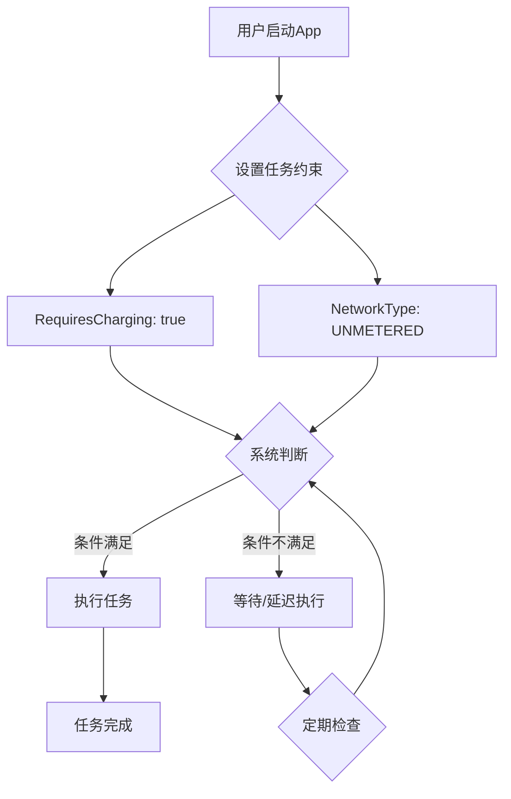
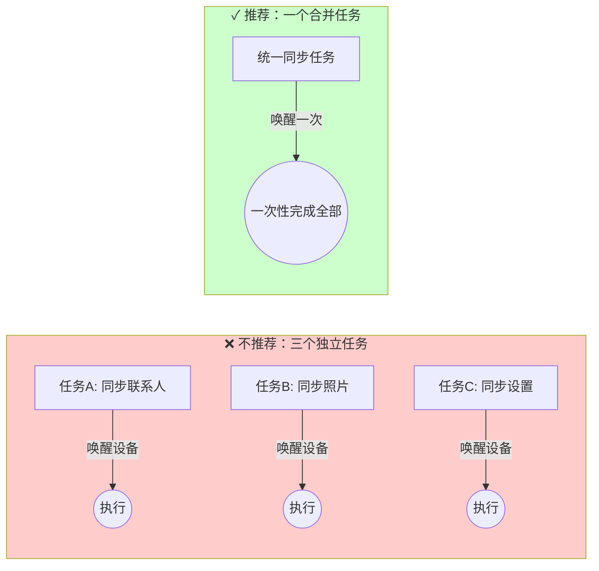
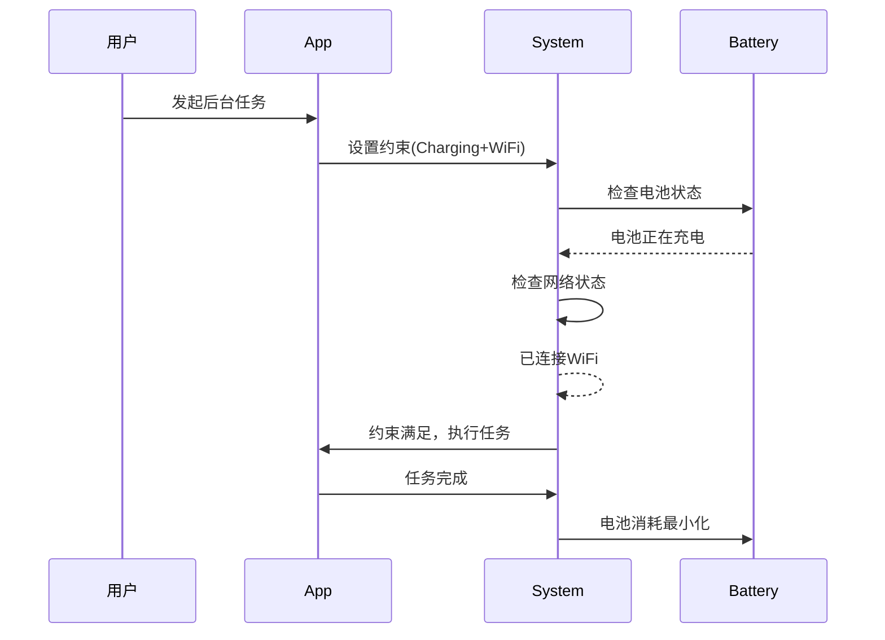
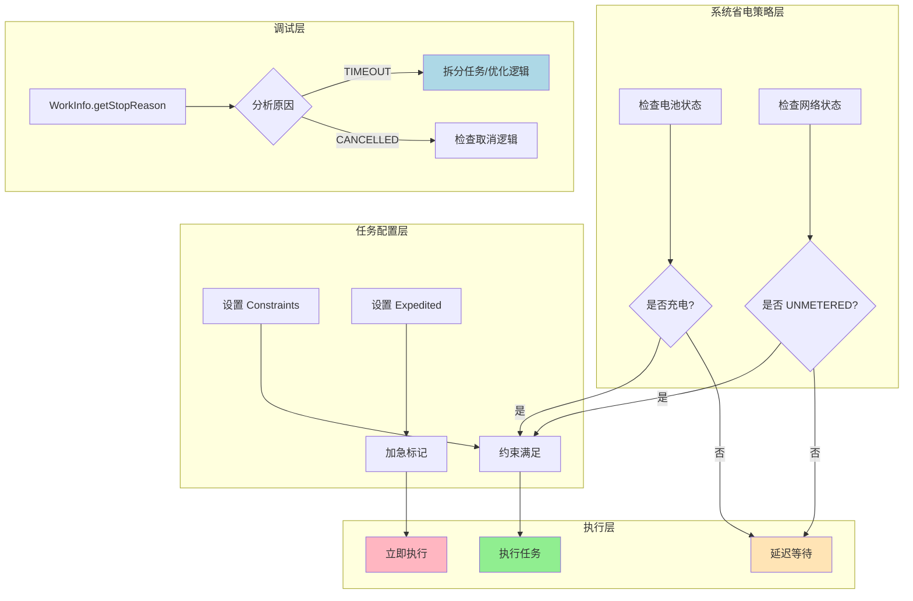

夜色渐浓。

准确地说，是从太阳完全沉入地平线之后开始的。洛芙裹紧了外套，加厚抓绒面料被夜露浸润得有些潮气，但她舍不得离开篝火边——今晚的星空太亮了，像谁把钻石撒在了天鹅绒上，一颗一颗清清楚楚。

“洛芙，再靠近一点。”伊莎朝她招手，手里捧着一杯还在冒热气的柚子茶，“黛琳说今晚要讲很重要的东西呢。”

“来了来了！”洛芙挪动膝盖，膝盖下的草地湿漉漉的，发出轻微的沙沙声。

黛琳已经打开了笔记本电脑，屏幕的蓝光在暮色中格外显眼。她旁边放着那盏营地灯，暖黄色的光晕映在她镜片上，映出一点点认真专注的神采。

“白天我们讲了WorkManager的基本用法，”黛琳轻声开口，声音像夜风一样平稳，“但你们有没有想过一个问题——如果我们每天让后台任务跑个几十次几百次，会发生什么？”

洛芙想了想：“任务会完成？”

“任务会完成，”希尔直接否定了这个答案可靠性 她盘腿坐着，手里摆弄着一根草茎，“但电池会哭。”

黛琳忍不住笑了一下：“希尔说得对。如果我们不考虑电池，让任务想跑就跑，那用户的手机很快就会没电——然后他们就会把我们的App卸载掉。”

“那要怎么办？”洛芙问。

“这正是我们今晚要解决的问题，”黛琳把笔记本转过来，让大家都看到屏幕上的内容，“如何优化后台任务的电池使用，让它们既能把事情办好，又不会把用户的电量吃干抹净。”

---

黛琳指尖轻点屏幕，调出一张流程图来。

“先从最基础的说起，”她开启了讲解模式，“我们在上一章学过，WorkManager可以设置各种约束条件——比如RequiresCharging()，比如NetworkType.UNMETERED()——这些约束不仅能保证任务在合适的时机执行，更重要的，它们能帮系统省电。”

洛芙举手：“约束条件……是不是就像露营时的‘只在有条件的情况下才做某事’？”

“Exactly！”希尔打了个响指，“比如说，你有一条规则是‘只在充电时才给手机充电’，听起来是废话对不对？但如果你的后台任务只能在充电时运行，那就意味着手机在低电量时不会被迫起床工作——它可以好好休息，用户第二天早上起床时手机还有电。”

黛琳补充道：“这就是第一个优化原则——选择最优的约束条件。**RequiresCharging()** 告诉系统：只有在电池正在充电时才运行这个任务。**NetworkType.UNMETERED()** 告诉系统：只有连接上WiFi（不计量收费的网络）时才运行。”

她说着，在屏幕上画了一个简单的图示：



“当两个条件都满足时，任务才会执行，”黛琳解释，“这样就避免了手机在低电量或者用移动网络时被迫干活——这两者都是耗电大户。”

伊莎轻轻托腮：“就像……篝火只有在风和日丽的时候才添新柴，刮大风的时候就不动它，防止火星飞散浪费燃料？”

“对！”黛琳微笑，“就是这个意思。”

---

“接下来是第二个重要原则，”黛琳继续滑动屏幕，“任务合并。”

她举了一个例子：“假设你的App需要同步三个不同的数据集——联系人、照片、设置。你会怎么写？”

洛芙想了想：“三个Worker，一个同步联系人，一个同步照片，一个同步设置？”

“很多初学者都会这么做，”黛琳点头，“但这样会有问题。”

希尔接话：“问题是——系统会因为这三个任务设置了一样的约束（比如都连着WiFi），就把它们一起唤醒执行。但是三次唤醒、三次网络请求、三次CPU运行，加起来的耗电量可比一次完成三个任务多得多。”

“这就是我们要做的优化，”黛琳说，“把相似的任务合并成一个任务。”

她在白板上画了一个对比：



“左边是三个独立任务，每次执行都要唤醒设备一次，”黛琳解释，“右边是一个合并任务，一次唤醒就把三件事都干了。设备唤醒是最耗电的操作之一，所以能少唤醒就少唤醒。”

洛芙若有所思：“但是……合并太多不相关的任务也不行吧？”

黛琳赞许地看了她一眼：“问得好。合并是有原则的——只能合并那些**约束条件相同**的任务。如果一个任务需要在移动网络下立即执行，另一个任务可以等到WiFi下慢慢执行，那就不能强行合并。保持它们的独立性，反而更省电。”

---

“第三点，”黛琳的语气变得严肃了一些，“关于加急任务。”

她解释道：“WorkManager和JobScheduler都提供了一个特性，叫做Expedited（加急）任务。如果你把一个任务标记为加急，系统会尽量让它立刻执行，绕过一些省电优化。”

希尔举手：“那加急任务是不是很好用？让它快快地跑完不是很好吗？”

“问题是，”黛琳摇头，“加急任务会**override**系统的省电策略，意味着它可能会在低电量时运行、可能在移动网络下运行、可能不受后台限制——这些都会增加电池消耗。”

洛芙皱眉：“所以加急任务就像……篝火里突然浇了一桶油？确实烧得快了，但也很快烧完了？”

“这个比喻很贴切，”伊莎轻声说，“用加急任务确实能让任务立刻执行，但代价是电池消耗会比正常情况下大。”

黛琳点头：“所以，只有在真正**时间敏感**的情况下才使用加急任务。比如用户刚刚完成了一笔支付，需要立刻发送确认通知；或者收到了重要的即时通讯消息，需要立即处理。”

她在屏幕上写出使用原则：

```kotlin
// ✅ 正确：真正的时间敏感任务
val expeditedWork = OneTimeWorkRequestBuilder<ProcessPaymentWorker>()
    .setExpedited(OutOfQuotaPolicy.RUN_AS_NON_EXPEDITED_WORK_REQUEST)
    .build()

// ❌ 错误：不应该为了"想让任务跑快点"就加急
val normalWork = OneTimeWorkRequestBuilder<SyncPhotosWorker>()
    .setExpedited(OutOfQuotaPolicy.RUN_AS_NON_EXPEDITED_WORK_REQUEST) // 没必要！
    .build()
```

“第二条规则，”黛琳强调，“永远不要为了‘想让任务跑快点’就加急。只有当用户体验会因为任务延迟而受损时，才考虑加急。”

---

夜色更深了。

头顶的星星仿佛知道她们在进行一场关于“省电”的讨论，闪烁得格外认真。洛芙裹着外套，看着笔记本屏幕上跳动的代码和图表，觉得这些知识像星光一样，一点一点变得清晰起来。

“最后一个话题，”黛琳的声音在夜风中轻轻传来，“任务被停止的原因。”

她解释道：“有时候，任务还没执行完就被系统杀掉了——可能是因为超时、可能是因为内存不足、也可能是因为设备进入省电模式。我们可以通过API来查看任务为什么被停止。”

希尔掏出自己的手机，打开一个调试应用：“这个很实用！当你发现某个任务总是完不成，就可以看它的停止原因，针对性地修复问题。”

黛琳补充：“比如，如果你的任务经常因为 **STOP_REASON_TIMEOUT** 而被停止，那就说明任务执行时间太长了——可能需要优化代码逻辑，或者把任务拆分成更小的子任务。”

她在白板上写出调试代码：

```kotlin
// 查看任务状态的示例代码
WorkManager.getInstance(context)
    .getWorkInfoByIdLiveData(workRequest.id)
    .observe(lifecycleOwner) { workInfo ->
        when (workInfo?.state) {
            WorkInfo.State.ENQUEUED -> {
                Log.d("WorkManager", "任务已加入队列，等待执行")
            }
            WorkInfo.State.RUNNING -> {
                Log.d("WorkManager", "任务正在执行")
            }
            WorkInfo.State.SUCCEEDED -> {
                Log.d("WorkManager", "任务执行成功")
            }
            WorkInfo.State.FAILED -> {
                Log.d("WorkManager", "任务执行失败")
                // 获取失败原因
                val stopReason = workInfo.stopWorkReason
                Log.e("WorkManager", "任务停止原因: $stopReason")
                // STOP_REASON_NOT_STARTED: 任务未能启动
                // STOP_REASON_CANCELLED: 任务被取消
                // STOP_REASON_TIMEOUT: 任务执行超时
            }
            else -> {}
        }
    }
```

洛芙把这些代码记在笔记本上。她想起白天的Workshop项目——她们的天气同步任务有时候会超时，可能就是因为没有设置合理的执行时间限制。

“对了，”黛琳像是想起了什么重要的事情，“还有一点要特别提醒——在Android 14及以上的版本，如果一个App的任务经常超时被停止，系统会把它放进**restricted standby bucket**。”

“restricted standby bucket？”伊莎眨眨眼，“这是什么？”

“就是限制待机的意思，”黛琳解释，“系统会觉得这个App不守规矩，频繁超时或者消耗过多资源，就会限制它的后台任务执行权限。被限制的App，后台任务会被大幅削减执行次数。”

希尔咋舌：“这惩罚还挺严重的……所以我们必须在开发阶段就做好优化，不能让任务随便超时。”

“没错，”黛琳点头，“这也是我们今天讲的所有内容的核心——做一个‘好公民’App，尊重用户的电池，尊重系统的资源。用户用得开心，App才能活得久。”

---

篝火的余烬轻轻跳了一下，洛芙把自己的笔记本合上。

她抬头看星空，银河像一条闪光的丝带，从天边这头延伸到那头。露水已经打湿了她的发梢，但她心里却因为学到了新东西而暖烘烘的。

“所以，”她总结，“电池优化的关键就是：设置合适的约束、在能合并的时候合并任务、只在必要时加急、还有监控任务为什么停止——对吧？”

黛琳微笑：“完全正确。看来你真的理解了。”

伊莎伸了个懒腰：“今天的露营知识也很有用呢……虽然是关于手机的，但感觉和大自然也有相通之处。”

“什么相通之处？”希尔好奇。

“就是……不要过度索取，要让大自然——或者电池——有休息的机会呀。”伊莎轻声说，“万物有灵，都需要平衡的。”

洛芙又把笔记本打开，在最后一页写下了今天的收获。

---

## 专业技术总结

> **电池优化** —— 通过合理配置任务约束、合并相似任务、谨慎使用加急任务、监控任务执行状态，来减少后台任务对设备电池的消耗，同时保证任务的正确执行。

#### 结构图



#### 复杂度与影响

| 优化措施 | 实现复杂度 | 电池收益 | 适用场景 |
|----------|------------|----------|----------|
| 设置RequiresCharging() | 低 | 高 | 非紧急的后台同步任务 |
| 设置NetworkType.UNMETERED | 低 | 中-高 | 需要网络但可延迟的任务 |
| 合并相似任务 | 中 | 高 | 同类数据的批量处理 |
| 使用加急任务 | 低 | 负(增加消耗) | 仅限真正的紧急任务 |

#### 反模式与陷阱

1. **❌ 为所有任务设置加急** → 修复：只在真正时间敏感时使用
2. **❌ 合并约束条件不同的任务** → 修复：保持任务独立性，按各自约束配置
3. **❌ 不监控任务停止原因** → 修复：使用WorkInfo.getStopReason()调试问题
4. **❌ 任务执行时间过长** → 修复：拆分任务为更小的子任务，设置合理的超时时间

#### 设计哲学

**"尊重设备的有限资源"**——后台任务的本质是在用户不使用设备时完成工作，但这不意味着可以“为所欲为”。每一次唤醒、每一次网络请求、每一次CPU运算都在消耗电池。好的后台任务设计应该：

- 理解系统的省电机制，善用约束条件让系统帮忙优化
- 合并能合并的任务，减少设备唤醒次数
- 把紧急任务和普通任务区分开，不滥用加急
- 监控和分析任务执行情况，持续优化

> **工程建议**：在App正式发布前，用Battery Historian或Android Profiler分析后台任务的真实电池消耗行为。

---

#### 🏕️ 动手练习

**目标**：掌握WorkManager电池优化的核心实践

**你需要做的事**：

1. 创建一个新的Android项目（或使用已有项目）
2. 实现三个数据同步Worker：
   - SyncContactsWorker：同步联系人
   - SyncPhotosWorker：同步照片
   - SyncSettingsWorker：同步设置
3. 初始版本：三个独立的WorkRequest，每个都设置 `setConstraints(Constraints.Builder().setRequiredNetworkType(NetworkType.UNMETERED).build())`
4. 重构版本：
   - 创建一个SyncAllWorker，在其中顺序执行三个同步操作
   - 只设置一次约束
   - 观察执行日志，对比唤醒次数

**验收标准**：

- [ ] 三个独立任务至少触发3次设备唤醒
- [ ] 合并后的任务只触发1次设备唤醒
- [ ] 两个版本的最终同步结果一致
- [ ] 学会使用WorkInfo.getStopReason()调试任务状态

**提示代码**：

```kotlin
// 重构后的合并Worker示例
class SyncAllWorker(
    context: Context,
    params: WorkerParameters
) : CoroutineWorker(context, params) {
    
    override suspend fun doWork(): Result {
        return try {
            // 一次性完成所有同步
            syncContacts()
            syncPhotos()
            syncSettings()
            Result.success()
        } catch (e: Exception) {
            Result.retry()
        }
    }
    
    private suspend fun syncContacts() { /* 实现同步联系人逻辑 */ }
    private suspend fun syncPhotos() { /* 实现同步照片逻辑 */ }
    private suspend fun syncSettings() { /* 实现同步设置逻辑 */ }
}
```

---

> 学习建议：电池优化不是“可选”的附加特性，而是后台任务设计的基本素养。从一开始就把约束条件想清楚，把任务设计好，能避免很多后续的坑。

---

## 洛芙的小小日记本

今天的露营好充实！黛琳讲电池优化的时候，我本来觉得会很无聊——毕竟谁会关心电池啊？但是她用“篝火只在合适的时候添柴”这个比喻，我就完全明白了。

原来写代码和露营一样，都要尊重自然的规律，不能由着自己的性子来。设备需要休息，用户需要电量，我以后一定要做一个“省电”的好App！

---

## 今日关键词

- **RequiresCharging()**：约束条件之一，指示系统仅在设备充电时执行任务
- **NetworkType.UNMETERED()**：约束条件之一，指示系统仅在连接无计量网络（WiFi）时执行任务
- **Expedited Task（加急任务）**：优先级被提升的任务，会绕过部分系统省电策略，但会增加电池消耗
- **WorkInfo.getStopReason()**：获取任务被停止的原因，用于调试和优化
- **STOP_REASON_TIMEOUT**：任务执行超时被停止的原因码
- **Restricted Standby Bucket**：Android 14+的系统限制，被限制的App后台任务执行会受到严格控制
- **设备唤醒（Wake Lock）**：设备从休眠状态被激活以执行任务的过程，是耗电的主要操作之一

<!-- TECH_EXPERT_START -->

---
### 技术总结

> **核心机制定义** — WorkManager 电池优化通过任务约束（Constraints）、任务合并（Work Chaining）、加急执行（Expedited Work）和停止原因分析（Stop Reason）四个维度实现。约束条件让系统判断最佳执行时机，任务合并减少设备唤醒次数，加急任务绕过省电策略但增加消耗，停止原因分析帮助开发者针对性修复问题。

#### 核心机制定义表

| 概念 | 作用 | 电池影响 |
|------|------|----------|
| **RequiresCharging()** | 仅在设备充电时执行 | 高 — 避免低电量时唤醒 |
| **NetworkType.UNMETERED()** | 仅在 WiFi 下执行 | 中 — 避免移动网络消耗 |
| **任务合并 (Work Chaining)** | 将相似任务合并为一次执行 | 高 — 减少唤醒次数 |
| **加急任务 (Expedited)** | 绕过省电策略立即执行 | 负 — 显著增加电池消耗 |
| **STOP_REASON_TIMEOUT** | 任务执行超时被停止 | 中 — 任务未完成需重试 |
| **Restricted Standby Bucket** | Android 14+ 后台限制 | 高 — 被限制后任务大幅减少 |

#### 结构图



#### 反模式与陷阱

1. **❌ 为所有任务添加加急标记** — 加急任务会绕过系统省电策略，在低电量或移动网络下执行，严重消耗电池
2. **❌ 合并约束条件不同的任务** — 强制合并会导致部分任务在不合适的环境下执行，适得其反
3. **❌ 忽略 STOP_REASON_TIMEOUT** — 任务频繁超时会触发 Android 14+ 的 Restricted Standby Bucket 惩罚
4. **❌ 不设置任何约束** — 任务随时执行，会在用户使用设备时唤醒屏幕，大幅影响体验
5. **❌ 任务执行时间过长** — 单一任务执行时间过长会增加被系统杀死的概率，应拆分

#### 设计哲学

> **"做一个好公民 App"** — 尊重用户的电池寿命是后台任务设计的核心原则

1. **约束优先** — 让系统帮忙判断最佳执行时机，而不是强行指定时间
2. **唤醒最小化** — 设备唤醒是耗电大户，合并任务比优化单个任务更重要
3. **区分紧急程度** — 真正的紧急任务（如支付通知）才能加急，普通同步任务不值得
4. **可观测性** — 监控任务停止原因，持续优化，而非盲目猜测
5. **预判系统行为** — 了解 Android 省电机制（Doze、App Standby、App Restriction），顺势而为

---

### 动手练习 ⭐️ 到 ★★★★★

#### ★ 任务一：验证 RequiresCharging 约束效果
**目标**：观察约束条件如何影响任务执行时机

**步骤**：
1. 创建一个 `ChargingWorker`，输出日志 "Task executed at [时间]"
2. 设置 `setConstraints(Constraints.Builder().setRequiresCharging(true).build())`
3. 分别在充电/非充电状态下观察任务是否执行

**验收标准**：
- [ ] 充电时任务执行
- [ ] 非充电时任务保持在 ENQUEUED 状态
- [ ] 记录观察到的行为差异

**提示**：使用 `WorkManager.getInstance().getWorkInfosForUniqueWorkLiveData()` 观察状态变化

---

#### ★ 任务二：对比网络约束的电池消耗
**目标**：理解 UNMETERED vs ANY 的区别

**步骤**：
1. 创建两个 Worker：WifiOnlyWorker、MeteredAllowedWorker
2. 分别设置 `NetworkType.UNMETERED` 和 `NetworkType.CONNECTED`
3. 在移动网络环境下观察行为差异

**验收标准**：
- [ ] WiFi 下两个任务都能执行
- [ ] 移动网络下只有 MeteredAllowedWorker 执行
- [ ] 理解移动网络的电量消耗高于 WiFi

---

#### ★★ 任务三：实现任务合并优化
**目标**：将三个独立任务合并为一个

**步骤**：
1. 创建三个 Worker：SyncContacts、SyncPhotos、SyncSettings
2. 初始方案：三个独立的 OneTimeWorkRequest
3. 优化方案：创建一个 CombinedSyncWorker，内部顺序执行三项同步
4. 观察日志，对比设备唤醒次数

**验收标准**：
- [ ] 独立方案触发 3 次设备唤醒
- [ ] 合并方案只触发 1 次唤醒
- [ ] 两种方案最终同步结果一致

---

#### ★★ 任务四：加急任务实战
**目标**：理解加急任务的适用场景

**步骤**：
1. 创建一个 PaymentConfirmationWorker（模拟支付通知）
2. 设置 `.setExpedited(OutOfQuotaPolicy.RUN_AS_NON_EXPEDITED_WORK_REQUEST)`
3. 创建一个普通的 SyncWeatherWorker，不加急
4. 观察两者执行时机差异

**验收标准**：
- [ ] 加急任务在系统资源允许时立即执行
- [ ] 理解 OutOfQuotaPolicy 的作用
- [ ] 说明为什么普通同步任务不应加急

---

#### ★★★ 任务五：实现任务停止原因调试
**目标**：学会分析任务失败原因

**步骤**：
1. 创建一个会超时的任务（Thread.sleep 很长，或死循环）
2. 使用 `WorkInfo.getStopReason()` 获取停止原因
3. 分析不同的 STOP_REASON 常量含义

**验收标准**：
- [ ] 捕获 `STOP_REASON_TIMEOUT` 
- [ ] 捕获 `STOP_REASON_CANCELLED`
- [ ] 针对原因写出优化方案

---

#### ★★★ 任务六：应对 Android 14+ Restricted Bucket
**目标**：避免被系统限制

**步骤**：
1. 创建多个会超时的任务
2. 观察任务被频繁停止后的行为变化
3. 优化任务执行时间，确保短时间完成

**验收标准**：
- [ ] 理解什么是 Restricted Standby Bucket
- [ ] 实现任务超时保护（setInitialDelay、setBackoffCriteria）
- [ ] 观察优化后任务执行成功率提升

---

#### ★★★★ 任务七：构建完整的电池优化方案
**目标**：综合运用所有优化技术

**步骤**：
1. 为真实 App 场景设计后台同步方案
2. 合理设置约束（充电 + WiFi）
3. 合并相似任务
4. 仅对真正紧急的任务加急
5. 添加停止原因监控

**验收标准**：
- [ ] 写出完整的 WorkManager 配置代码
- [ ] 代码能通过代码审查（约束合理、无滥用加急）
- [ ] 有配套的调试日志

---

#### ★★★★★ 任务八：使用 Battery Historian 分析真实电池消耗
**目标**：用数据验证优化效果

**步骤**：
1. 导出电池优化历史数据（adb shell dumpsys batterystats）
2. 使用 Battery Historian 可视化分析
3. 对比优化前后的 Wake Lock 次数、后台任务执行次数

**验收标准**：
- [ ] 生成 Battery Historian HTML 报告
- [ ] 识别主要的电池消耗来源
- [ ] 根据数据进一步优化

---

#### 面试热身 🌡️

1. **Q: WorkManager 的 RequiresCharging() 约束在什么场景下使用最合适？**
   > A: 适用于非紧急的后台同步任务，如每日数据备份、大文件上传等。这些任务延迟到充电时执行不影响用户体验，还能保护电池。

2. **Q: 为什么任务合并可以省电？**
   > A: 每次任务执行都需要唤醒设备（Wake Lock），这是耗电的主要操作。合并三个任务只需要一次唤醒，而不是三次，直接减少 2/3 的唤醒开销。

3. **Q: 加急任务什么时候应该使用，什么时候不应该使用？**
   > A: 应该用于真正的紧急任务（支付确认、重要通知）；不应该用于"想让任务跑快点"的情况，普通任务加急会增加电池消耗且无实际收益。

4. **Q: Android 14 的 Restricted Standby Bucket 是什么？如何避免？**
   > A: 系统对频繁超时或消耗资源过多的 App 施加的后台限制。被限制后任务执行次数会大幅减少。避免方法是确保任务短时间完成、不频繁超时。

5. **Q: 如何调试 WorkManager 任务的停止原因？**
   > A: 使用 `WorkInfo.getStopReason()` 获取停止码，或使用 `WorkManager.getInstance().getWorkInfoByIdLiveData()` 观察状态变化，针对不同原因（TIMEOUT、CANCELLED、NOT_STARTED）进行优化。

---

#### 参考实现要点

```kotlin
// 完整示例：电池优化的 WorkManager 配置
object WorkManagerConfig {
    
    // 标准约束：充电 + WiFi（最省电）
    val standardConstraints = Constraints.Builder()
        .setRequiresCharging(true)
        .setRequiredNetworkType(NetworkType.UNMETERED)
        .build()
    
    // 加急约束：仅用于真正的紧急任务
    val expeditedConstraints = Constraints.Builder()
        .setRequiredNetworkType(NetworkType.CONNECTED)
        .build()
    
    // 创建合并任务示例
    fun createMergedSyncWork(): OneTimeWorkRequest<CombinedSyncWorker> {
        return OneTimeWorkRequestBuilder<CombinedSyncWorker>()
            .setConstraints(standardConstraints)
            .addTag("sync")
            .build()
    }
    
    // 创建加急任务示例（支付通知）
    fun createExpeditedPaymentWork(): OneTimeWorkRequest<PaymentWorker> {
        return OneTimeWorkRequestBuilder<PaymentWorker>()
            .setExpedited(OutOfQuotaPolicy.RUN_AS_NON_EXPEDITED_WORK_REQUEST)
            .setConstraints(expeditedConstraints)
            .build()
    }
}

// 合并 Worker 示例
class CombinedSyncWorker(
    context: Context,
    params: WorkerParameters
) : CoroutineWorker(context, params) {
    
    override suspend fun doWork(): Result {
        return try {
            // 一次性完成所有同步
            syncContacts()
            syncPhotos() 
            syncSettings()
            Result.success()
        } catch (e: Exception) {
            if (runAttemptCount < 3) Result.retry() else Result.failure()
        }
    }
    
    private suspend fun syncContacts() {
        // 实现联系人同步
    }
    
    private suspend fun syncPhotos() {
        // 实现照片同步
    }
    
    private suspend fun syncSettings() {
        // 实现设置同步
    }
}

// 任务状态监控示例
fun observeWorkStatus(workId: UUID) {
    WorkManager.getInstance(applicationContext)
        .getWorkInfoByIdLiveData(workId)
        .observe { workInfo ->
            when (workInfo?.state) {
                WorkInfo.State.ENQUEUED -> Log.d("WorkManager", "等待执行")
                WorkInfo.State.RUNNING -> Log.d("WorkManager", "执行中")
                WorkInfo.State.SUCCEEDED -> Log.d("WorkManager", "执行成功")
                WorkInfo.State.FAILED -> {
                    val stopReason = workInfo.stopWorkReason
                    Log.e("WorkManager", "执行失败，原因: $stopReason")
                }
                else -> {}
            }
        }
}
```

---
> 学习建议：电池优化是"做正确的事"而非"正确地做事"——先确认任务是否真的需要后台执行，再考虑如何让它更省电。很多时候，减少任务执行次数比优化单次执行更有效。

---

## 洛芙的小小日记本

黛琳说"设备也需要休息"，就像篝火不能一直烧。我以后写代码要想想——这件事真的需要现在做吗？还是可以等一等？

---

## 今日关键词

- **RequiresCharging()** — 约束条件，指示系统仅在设备充电时执行任务
- **NetworkType.UNMETERED()** — 约束条件，指示系统仅在 WiFi（无计量网络）下执行任务
- **NetworkType.CONNECTED** — 约束条件，任何网络连接即可执行
- **Expedited Work（加急任务）** — 绕过省电策略优先执行的任务
- **OutOfQuotaPolicy** — 加急任务配额耗尽时的处理策略
- **Work Chaining（任务链）** — 将多个任务按顺序串联执行
- **WorkInfo.getStopReason()** — 获取任务被系统停止的原因
- **STOP_REASON_TIMEOUT** — 任务执行超时被停止
- **STOP_REASON_CANCELLED** — 任务被取消
- **STOP_REASON_NOT_STARTED** — 任务未能启动
- **Restricted Standby Bucket** — Android 14+ 的后台任务限制机制
- **Device Wake Lock（设备唤醒）** — 从休眠状态激活设备的过程
- **Constraints（约束条件）** — WorkManager 判断任务执行时机的条件组合
- **Android Doze Mode** — 系统省电模式
- **App Standby** — 应用空闲状态管理


