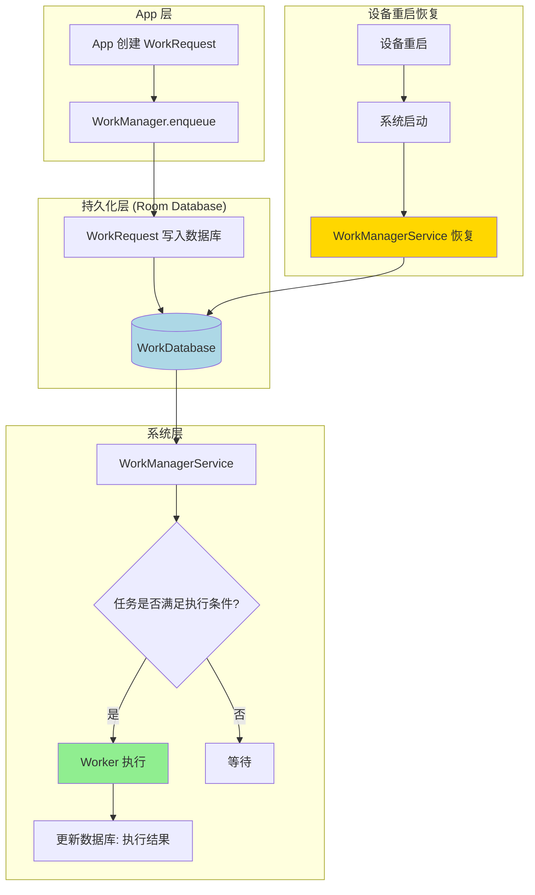
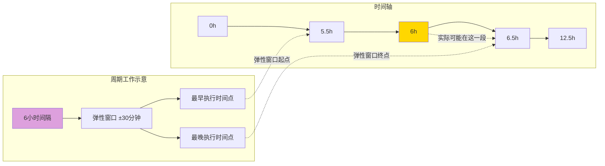
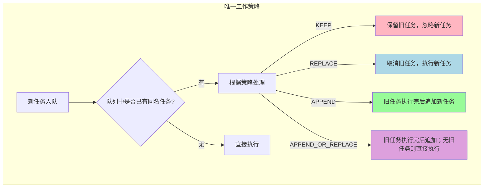
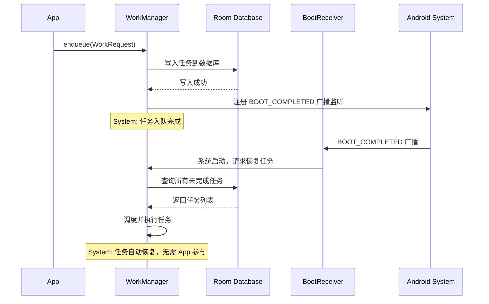
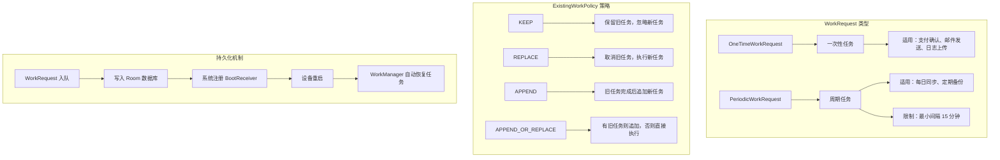

夜色更深了。

银河已经从东边的树梢爬到了头顶，像一条流淌着光芒的河流。篝火只剩下几块烧得通红的炭，偶尔爆出一两点火星，在夜风中转瞬即逝。洛芙往篝火堆里添了两根细枝，火苗重新跳跃起来，把四个人的脸庞映成了温暖的橙色。

"刚才讲的电池优化真的很有用，"洛芙揉了揉眼睛，帐篷外的夜蛾子绕着营地灯打转，"但是我有一个问题……"

"什么问题？"黛琳把笔记本放下，揉了揉有些酸涩的太阳穴。

"你说任务会在合适的时机执行，"洛芙歪着脑袋，"但如果用户把App关掉了呢？如果手机重启了呢？任务还在吗？"

伊莎轻轻吹了吹柚子茶的表面："问得好。就像我们搭的帐篷，如果半夜刮大风把它吹倒了，第二天早上还能找到我们的行李吗？"

"那不一样，"希尔盘腿坐着，把自己的手机举起来，"App被杀掉、或者手机重启，这些情况WorkManager都考虑到了。它会把任务持久化存储起来，等系统恢复的时候再继续执行。"

黛琳点头："这就是我们今天要讲的主题--任务调度。WorkManager最强大的特性之一，就是它的调度机制是持久化的。"

她重新打开笔记本，屏幕的蓝光在夜色中格外清澈。


"先从最基本的说起，"黛琳开口，"WorkManager的调度机制，是Android系统中最可靠的持久化任务调度方案。它有两个核心特点：第一，任务会持久化到数据库里，即使App进程被杀、系统重启，任务依然会被执行；第二，系统会在最佳时机自动运行这些任务，不需要App一直在后台运行。"

希尔补充："换句话说，就算你半夜三点把手机扔进湖里捞出来，任务也可能已经偷偷跑完了。"

洛芙的眼睛睁得圆圆的："这么神奇？"

"不是神奇，是系统层面的设计，"黛琳笑着解释，"WorkManager内部使用了一个SQLite数据库（实际上是Room），专门用来存储所有待执行的任务信息。当你的App创建一个WorkRequest的时候，这个请求就会被写入数据库。然后，WorkManager会在合适的时机取出任务并执行。"

她在白板上快速画了一个结构图：



"这张图里最难理解的是中间那条线，"黛琳指着从D到L的虚线，"当设备重启的时候，WorkManagerService会在系统启动后自动恢复。它会重新读取数据库里的任务，然后继续调度。整个过程完全不需要App参与。"

伊莎托腮："就像露营时写在纸上的待办事项，不依赖于记在脑子里。刮风下雨都冲不掉。"

"对，"黛琳点头，"数据库就是那张纸。"


"接下来我们说说任务的类型，"黛琳切换到下一页幻灯片，"WorkManager支持两种主要的工作类型：一次性工作和周期性的工作。"

她先讲了一次性工作。

"一次性工作，就是字面意思--只执行一次，执行完就结束。用 `OneTimeWorkRequest` 来表示。这是最简单的场景，比如用户完成了一笔支付需要发送确认邮件，或者App需要上传一份日志。这些都是做完就可以扔掉的事情，不需要重复。"

她举了一个具体的例子："假设洛芙的天气App需要在后台下载一份天气数据，下载完成后就不需要再管了。这种场景就很适合一次性工作。"

希尔掏出手机开始敲代码："我来写个示例，模拟这个天气数据下载的场景。"

```kotlin
// 安装依赖（build.gradle）：
// implementation "androidx.work:work-runtime-ktx:2.9.0"

// 定义 Worker
class SyncWeatherWorker(
    context: Context,
    params: WorkerParameters
) : CoroutineWorker(context, params) {

    override suspend fun doWork(): Result {
        // 执行天气数据同步
        val cityId = inputData.getString("city_id") ?: return Result.failure()

        return try {
            val weatherData = fetchWeatherFromServer(cityId)
            saveWeatherToLocalDb(weatherData)
            // 返回成功，结果数据可以通过 outputData 传递
            Result.success(workDataOf("status" to "synced"))
        } catch (e: Exception) {
            // 网络失败等异常情况，重试
            if (runAttemptCount < 3) {
                Result.retry()
            } else {
                Result.failure(workDataOf("error" to (e.message ?: "unknown")))
            }
        }
    }

    private suspend fun fetchWeatherFromServer(cityId: String): WeatherData {
        // 模拟网络请求
        delay(1000)
        return WeatherData(cityId, 22, "晴")
    }

    private suspend fun saveWeatherToLocalDb(data: WeatherData) {
        // 模拟保存到本地数据库
        delay(500)
    }
}

// 使用 OneTimeWorkRequestBuilder 创建请求
fun enqueueWeatherSync(context: Context, cityId: String) {
    val inputData = workDataOf("city_id" to cityId)

    val syncRequest = OneTimeWorkRequestBuilder<SyncWeatherWorker>()
        .setInputData(inputData)
        .setConstraints(
            Constraints.Builder()
                .setRequiredNetworkType(NetworkType.CONNECTED)
                .build()
        )
        .build()

    WorkManager.getInstance(context).enqueue(syncRequest)
}
```

"看到了吗？"希尔把手机屏幕转过来给大家看，"一次性工作用 `OneTimeWorkRequestBuilder` 创建，输入数据通过 `setInputData` 传递，工作结果通过 `Result.success()` 返回。如果中途出错，可以调用 `Result.retry()` 重试，最多重试三次。"

洛芙凑近看屏幕："这个看起来还挺清晰的。那如果是每天都要同步的任务呢？"

"问得好，"黛琳接过话，"这就是第二种类型--周期工作。"


"周期工作用 `PeriodicWorkRequest` 来表示，顾名思义，就是每隔一段时间就要执行一次的任务。比如每天早上七点同步一次天气数据，或者每周日凌晨备份一次照片到云端。"

黛琳在白板上写下一个时间例子："周期工作有两个关键的时间参数：**间隔时间**和**弹性间隔**。"

她解释道："间隔时间就是任务执行的周期，比如每6小时、每24小时、每周等等。而弹性间隔是告诉系统：'不需要精确按照这个时间执行，可以稍微前后挪动一点，找一个系统最省电的时机来跑。'"



"这个弹性窗口很重要，"黛琳强调，"系统会根据设备的电池状态、网络状况、用户使用习惯等因素，在弹性窗口内选择一个最佳时机执行任务。比如你设置的是6小时一次，但系统可能实际在6.3小时或5.8小时执行——只要在合理范围内，就比固定时间更省电。"

希尔补充："系统会选择所有待执行周期任务中优先级最高的一个，集中在一段时间内批量执行。这样可以减少设备唤醒次数，进一步省电。"


"但是，"黛琳的语气严肃了一些，"周期工作不是万能的。它有一个最重要的限制：**最短间隔是15分钟**。"

洛芙有些意外："15分钟？不能更快吗？"

"不能，"黛琳摇头，"这是系统层面的硬性限制。即使你设置间隔为5分钟，系统也会自动把它提升到15分钟。这个限制是为了防止恶意App通过短周期任务频繁唤醒设备、消耗电量。"

她举了一个反面例子："如果你的App需要更频繁地执行任务，比如每秒刷新一次传感器数据，那周期工作就不适用了。这种场景应该用 Foreground Service（前台服务）或者其他方案，而不是 WorkManager。"

伊莎若有所思："所以WorkManager主要是处理那些'不需要那么急，但一定要完成'的任务，对吗？"

"Exactly，"黛琳微笑，"它适合后台数据同步、定期清理、备份上传这些场景。但不适合实时性要求高的场景。"


"接下来我们讲一个很实用的功能，"黛琳的指尖在屏幕上滑动，"唯一工作。"

她解释道："在某些场景下，你不希望同一个任务被重复加入队列。比如用户可能多次点击'同步数据'按钮，如果每次点击都创建一个新的同步任务，那可能会出现多个同步任务同时运行的情况——这既浪费资源，又可能导致数据冲突。"

希尔立刻明白了："就像露营的时候，不能同时点两堆篝火吧？一堆就够了。"

"对，"黛琳笑了，"唯一工作就是确保同一个任务只存在一个实例。用 `ExistingWorkPolicy` 来控制策略。"

她列出四种策略：



"最常用的是 `KEEP` 和 `REPLACE`，"黛琳说，"`KEEP` 是说'如果已经有同名的任务在跑，就不要管新的，保留原来的'；`REPLACE` 是说'取消旧的，用新的替代'。"

她举了一个具体的代码例子：

```kotlin
// 使用 ExistingWorkPolicy.KEEP
// 如果 "weather_sync" 任务已在队列中，新请求会被忽略
val keepRequest = OneTimeWorkRequestBuilder<SyncWeatherWorker>()
    .setExistingWork(ExistingWorkPolicy.KEEP)
    .build()

WorkManager.getInstance(context)
    .enqueueUniqueWork("weather_sync", ExistingWorkPolicy.KEEP, keepRequest)

// 使用 ExistingWorkPolicy.REPLACE
// 新任务会取消旧任务，替代执行
val replaceRequest = OneTimeWorkRequestBuilder<SyncWeatherWorker>()
    .setExistingWork(ExistingWorkPolicy.REPLACE)
    .build()

WorkManager.getInstance(context)
    .enqueueUniqueWork("weather_sync", ExistingWorkPolicy.REPLACE, replaceRequest)
```

洛芙认真记着笔记："那 `APPEND` 和 `APPEND_OR_REPLACE` 什么时候用呢？"

"`APPEND` 用于链式任务，"黛琳说，"比如任务A完成后需要执行任务B，但任务B可能还没入队——可以在A执行完后追加B。`APPEND_OR_REPLACE` 是两者的结合：有旧任务就追加，没有就新建。"


"最后，也是最重要的，"黛琳的声音变得认真，"关于设备重启后的任务持久化。"

"当用户设备重启之后，所有未完成的后台任务都会丢失——吗？"洛芙问。

"如果使用原始的 AlarmManager，确实会丢失，"黛琳说，"但 WorkManager 会自动处理这个问题。它借助 `RECEIVE_BOOT_COMPLETED` 权限，在系统启动后自动恢复所有未完成的任务。"

她解释道："实现原理是这样的：当一个 WorkRequest 被入队时，WorkManager 同时会向系统注册一个 `BootReceiver`——一个监听系统启动完成的 BroadcastReceiver。当设备重启后，这个 Receiver 会收到 `BOOT_COMPLETED` 广播，然后通知 WorkManager 恢复所有待执行的任务。"

希尔摇头："但这个功能不是自动开启的吗？我之前用 WorkManager 的时候，好像没做什么特殊配置，任务也能在重启后恢复。"

"因为 WorkManager 默认就会处理这个，"黛琳点头，"对于大多数 App 来说开箱即用，不需要额外配置。但有一个前提：App 需要在系统重启之前至少有一次成功入队过任务。如果 App 根本没运行过、没有入队任何任务，那重启后自然也没有任务可以恢复。"

她画了一个流程图：



"还有一点需要注意，"黛琳补充，"对于周期工作，WorkManager 会在重启后根据上次执行的时间和间隔来计算'下次应该什么时候执行'，然后重新安排。如果任务已经过期（比如应该每6小时执行一次，重启时已经过了12小时），WorkManager 会立即执行一次来'追赶'进度。"


洛芙轻轻举手："那……有没有什么情况是 WorkManager 任务在重启后**不会**自动恢复的？"

"有，"黛琳坦诚地说，"两种情况。"

"第一种：**App被卸载**。如果用户把App卸载了，数据库会被清空，所有任务记录都没了，重启后自然无法恢复。这个没有办法。"

"第二种：**App被禁用了后台权限**。从Android 9开始，如果用户在系统设置里禁止了App的'后台活动'权限，WorkManager的任务调度会受到限制。虽然任务记录还在数据库里，但可能无法按时执行。这种情况需要引导用户去设置里开启权限。"

伊莎轻声说："所以就算代码写得再好，也得用户愿意给权限才行呢。"

黛琳点头："这就是Android的隐私保护设计。系统给用户提供了控制App后台行为的权利，我们作为开发者能做的，就是在代码层面做好持久化，同时给用户清晰的说明，引导他们正确设置。"


夜风轻轻吹过，营地灯的火苗晃了晃。洛芙裹紧了外套，发现夜已经很深了，露水把外套浸得潮潮的。

"最后一件事，"黛琳看了看表，"关于链式工作。"

"链式工作？"洛芙有些困了，但还是打起精神。

"有时候，一个任务的输出是另一个任务的输入。比如先下载数据，再处理数据，再上传结果。这三个步骤有依赖关系，必须按顺序执行。WorkManager提供了链式API来处理这种情况。"

她写出代码示例：

```kotlin
// 定义三个 Worker
class DownloadWorker(
    context: Context,
    params: WorkerParameters
) : CoroutineWorker(context, params) {
    override suspend fun doWork(): Result {
        val data = downloadFromServer()
        // 通过 outputData 传递数据给下一个 Worker
        return Result.success(workDataOf("result" to data))
    }
}

class ProcessWorker(
    context: Context,
    params: WorkerParameters
) : CoroutineWorker(context, params) {
    override suspend fun doWork(): Result {
        // 从上一个 Worker 的 outputData 中获取输入
        val input = inputData.getString("result") ?: return Result.failure()
        val processed = processData(input)
        return Result.success(workDataOf("processed" to processed))
    }
}

class UploadWorker(
    context: Context,
    params: WorkerParameters
) : CoroutineWorker(context, params) {
    override suspend fun doWork(): Result {
        val processed = inputData.getString("processed") ?: return Result.failure()
        uploadToCloud(processed)
        return Result.success()
    }
}

// 使用链式 API
WorkManager.getInstance(context)
    .beginWith(DownloadWorker())           // 第一步：下载
    .then(ProcessWorker())                // 第二步：处理（依赖下载完成）
    .then(UploadWorker())                 // 第三步：上传（依赖处理完成）
    .enqueue()
```

"看到了吗？"黛琳指着代码，"通过 `inputData` 和 `outputData`，数据可以在任务之间流动。每个 Worker 都可以从 `inputData` 中读取上一个任务的输出，然后把自己的结果放进 `outputData` 传给下一个。"

"这比分别入队三个独立任务安全多了，"希尔说，"因为 WorkManager 会自动处理它们之间的依赖关系，不会出现'处理的时候下载还没完成'的情况。"

洛芙困意全消："感觉像是流水线！每个人只做自己那一部分，做完就交给下一个人。"

"完全正确，"黛琳微笑，"这就是 WorkManager 链式工作的本质——流水线式的任务编排。"


篝火彻底熄灭了，只剩下几块通红的炭在黑暗中微微发光。头顶的银河仿佛也在静静流淌，见证着这场关于任务调度的深夜露营课堂。

"好了，"黛琳合上笔记本，轻轻伸了个懒腰，"今天的内容就到这里。总结一下：我们讲了 WorkManager 的持久化调度机制、一次性工作和周期工作的区别、唯一工作策略、设备重启后的任务恢复、以及链式任务的写法。"

伊莎站起来拍了拍裙子上的露水："回去睡觉吧，明天还要赶路呢。"

洛芙把笔记本收好，抬头看了看星空。夜风把她的刘海吹得有些乱，但她没去理。

"原来任务真的可以在App关掉之后还继续跑啊，"她喃喃自语，"就像写在纸上的待办事项，不会因为睡着了就消失。"

"这就是持久化的意义，"黛琳轻声说，"让计算机会记得的事情，变得更可靠。"

洛芙点了点头，把这句话记在了心里。


---

## 专业技术总结

> **任务调度（Task Scheduling）** -- WorkManager 通过将 WorkRequest 持久化到 Room 数据库，实现了跨 App 重启和设备重启的可靠任务调度。开发者通过 OneTimeWorkRequest（一次性）或 PeriodicWorkRequest（周期性）定义任务，使用 ExistingWorkPolicy 控制唯一性策略，并可通过链式 API 实现任务间的数据传递与依赖编排。

#### 结构图



#### 复杂度与影响

| 任务类型 | 适用场景 | 间隔限制 | 数据持久性 |
|----------|----------|----------|------------|
| OneTimeWorkRequest | 单次执行场景 | 无 | 跨重启持久 |
| PeriodicWorkRequest | 定期同步场景 | 最短15分钟 | 跨重启持久 |
| 链式 WorkRequest | 顺序依赖任务 | 继承各任务限制 | 继承各任务持久性 |

#### 反模式与陷阱

1. **❌ 用 PeriodicWorkRequest 实现低于15分钟间隔的任务** → 修复：改用 Foreground Service 或 AlarmManager（但需注意省电限制）
2. **❌ 不使用 ExistingWorkPolicy，导致重复入队** → 修复：使用 `enqueueUniqueWork` 并选择合适的策略（通常用 KEEP）
3. **❌ 在链式任务中对有依赖的任务分别调用 enqueue** → 修复：使用 `beginWith().then().then().enqueue()` 确保执行顺序
4. **❌ 假设任务一定会在设备重启后恢复** → 修复：检查 App 是否仍有后台权限，引导用户正确授权

#### 设计哲学

> **"让系统成为可靠的记忆"** -- WorkManager 持久化调度的核心思想是将"什么时候做什么"这件事从 App 进程转移到系统持久层。这样做的好处是：即使 App 被杀死、即使设备重启，任务依然会被记住并执行。

1. **优先使用一次性任务** -- 除非明确需要重复执行，否则应使用 OneTimeWorkRequest，它的行为更简单、出错概率更低
2. **周期任务的间隔应足够长** -- 15分钟是最短限制，但通常更长的间隔（小时级别或天级别）对电池更友好
3. **善用唯一工作策略防止重复** -- 对用户触发的同步类任务使用 KEEP 策略，避免重复执行
4. **链式任务优于手动编排** -- 使用 WorkManager 的链式 API 而不是自己维护依赖关系，系统会帮忙处理重试、超时等复杂逻辑
5. **永远考虑权限缺失的情况** -- 在调用 WorkManager 之前检查 App 是否有足够的后台权限


---

#### 🏕️ 动手练习

**目标**：掌握 WorkManager 持久化任务调度的核心用法

**你需要做的事**：

1. 创建一个新的 Android 项目（minSdkVersion 23+），添加依赖：
   ```groovy
   implementation "androidx.work:work-runtime-ktx:2.9.0"
   ```

2. 实现一个一次性同步 Worker：接受城市 ID，从"服务器"获取天气数据，保存到本地数据库

3. 实现一个周期同步 Worker：每隔 6 小时自动同步一次天气数据

4. 使用 `enqueueUniqueWork` 实现唯一工作，防止用户多次点击导致重复同步

5. 实现一个三步链式任务：下载 → 处理 → 上传，通过 `inputData`/`outputData` 传递数据

6. 测试设备重启后任务是否恢复：在模拟器中入队周期任务，然后重启模拟器，观察任务是否自动恢复

**验收标准**：

- [ ] OneTimeWorkRequest 能正确执行并将结果写入数据库
- [ ] PeriodicWorkRequest 间隔不小于15分钟
- [ ] 使用 KEEP 策略时，重复入队不会创建新任务
- [ ] 链式任务的执行顺序为：下载 → 处理 → 上传
- [ ] 设备重启后，周期任务自动恢复并执行

**提示代码**：

```kotlin
// 周期工作请求（最小间隔 15 分钟）
val periodicWork = PeriodicWorkRequestBuilder<PeriodicSyncWorker>(
    6, TimeUnit.HOURS,        // 重复间隔
    30, TimeUnit.MINUTES      // 弹性窗口
).build()

WorkManager.getInstance(context).enqueueUniquePeriodicWork(
    "weather_periodic_sync",
    ExistingPeriodicWorkPolicy.KEEP,
    periodicWork
)

// 唯一一次性工作（KEEP 策略）
val uniqueRequest = OneTimeWorkRequestBuilder<SyncWeatherWorker>()
    .setInputData(workDataOf("city_id" to "beijing"))
    .setExistingWork(ExistingWorkPolicy.KEEP)
    .build()

WorkManager.getInstance(context)
    .enqueueUniqueWork("weather_sync", ExistingWorkPolicy.KEEP, uniqueRequest)
```


---

> 学习建议：WorkManager 的持久化调度是 Android 后台任务的基础设施。理解它如何利用 Room 数据库和系统广播来实现可靠的任务调度，是写出"即使 App 被杀、即使设备重启，任务依然能完成"的代码的前提。


## 洛芙的小小日记本

今天学到了最重要的一件事：好的代码，应该像写在纸上的待办事项一样可靠。

就算睡着了、就算手机重启了、就算App被关掉了——任务还在。这就是 WorkManager 给我最大的启发。

明天要试试用链式工作做一个完整的下载-处理-上传流程，看看数据是不是真的能一个接一个地传下去。


## 今日关键词

- **WorkRequest** -- WorkManager 中定义"要执行什么工作"的核心抽象，分为 OneTimeWorkRequest 和 PeriodicWorkRequest 两种类型
- **OneTimeWorkRequest** -- 一次性工作请求，只执行一次，适用于单次同步、支付确认等场景
- **PeriodicWorkRequest** -- 周期工作请求，按固定间隔重复执行，适用于定期备份、数据同步等场景，最短间隔为15分钟
- **弹性窗口（Flex Interval）** -- 周期任务的执行时间窗口，系统在这个窗口内选择最省电的时机执行任务
- **Room Database** -- WorkManager 内部用于持久化存储 WorkRequest 的 SQLite 数据库，即使 App 进程被杀或设备重启，数据也不会丢失
- **BootReceiver** -- WorkManager 注册的系统广播接收器，监听设备启动完成广播，在设备重启后自动恢复所有待执行的任务
- **ExistingWorkPolicy** -- 控制"当同名工作已在队列中时如何处理"的策略，包括 KEEP、REPLACE、APPEND、APPEND_OR_REPLACE 四种
- **ExistingPeriodicWorkPolicy** -- 周期工作的唯一性策略，对应 KEEP 和 UPDATE 两种
- **enqueueUniqueWork** -- 用于入队唯一工作的 API，确保同一时刻只有一个同名工作在队列中
- **链式工作（Work Chaining）** -- 使用 `beginWith().then().then().enqueue()` 将多个有依赖关系的任务串联起来执行
- **inputData / outputData** -- Worker 之间传递数据的机制，通过 key-value 键值对在任务链中流动
- **BOOT_COMPLETED** -- 系统广播，表示设备启动完成，WorkManager 借助此广播在重启后恢复任务
- **RECEIVE_BOOT_COMPLETED 权限** -- 让 App 能够接收设备启动广播的权限，WorkManager 自动申请和使用此权限
- **CoroutineWorker** -- WorkManager 提供的基于 Kotlin 协程的 Worker 基类，适合需要异步执行的场景
- **Result.retry() / Result.success() / Result.failure()** -- Worker 的返回结果，用于通知 WorkManager 任务执行状态和后续行为
