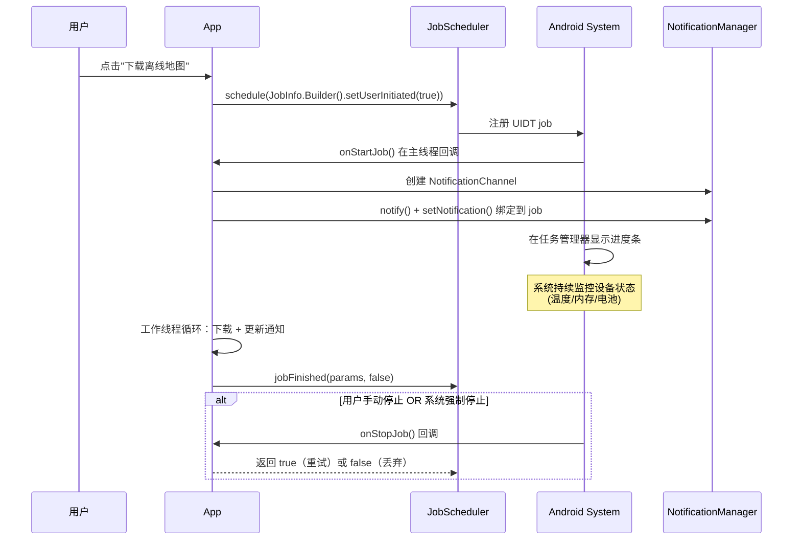

# 6.1.9 用户发起的数据传输

凌晨两点十七分。

营地灯的光晕把四个人的影子投在帐篷帆布上，像一幅正在演出的皮影戏。篝火已经只剩三块烧透的木炭，暗红的光纹在灰烬下若隐若现，连烟都不怎么冒了。洛芙把外套裹紧，膝盖缩进睡袋里，脚趾头还是冰冰凉凉的。

"你确定不用再添柴了吗？"洛芙小声问，目光落在那堆将熄的炭火上。

"再烧就该天亮了。"黛琳的声音也压得很低，怕吵醒可能还在睡觉的露营地其他游客，"留一点火种就行。"

伊莎盘腿坐在一块扁平的石头上，围巾绕了两圈，只露出半张脸。她手里捧着一杯已经凉透的可可，杯壁上凝结着一层细密的水珠。"说到火种——"她忽然开口，"希尔，你那个离线地图下载的 Demo，跑完了吗？"

希尔正埋头在一台旧款 Pixel 手机上敲命令。听到自己的名字，她抬起头，下巴朝洛芙的方向点了点："还没。我让洛芙帮我测的，结果她睡着了——"

"我没有！"洛芙立刻反驳，脸颊微微发热，"我只是……闭目养神了一下。"

"闭目养神到打呼？"

"那是因为你的构建命令跑了四十分钟，我无聊到只能睡觉！"

哄笑声压得很低，在夜空中散开。黛琳摇了摇头，从背包侧袋里摸出一块叠得整整齐齐的绒布，展开来——是一块备用的旧手机，屏幕有道细小的裂痕，边框磨得发白。

"既然今晚讲完 WorkManager 了，"她把那块旧手机放在篝火旁边一块平整的石头上，屏幕的微光映出裂痕的纹路，"不如顺手把下一个话题也埋个种子。"

"什么种子？"洛芙凑过去看。

"User-Initiated Data Transfer。"黛琳说出这个词的时候，夜风恰好吹过，枫叶沙沙响了几声，像是回应，"用户发起的数据传输——Android 14 引入的新 API。"

"又是 Android 14 的新东西。"洛芙把这几个字在舌尖滚了滚，"和 WorkManager 有什么关系？"

"问得好。"黛琳伸手把那块旧手机的屏幕点亮，裂痕在光线下像一道细小的闪电，"WorkManager 适合 deferrable（可延迟的）后台任务——比如每天凌晨同步一次数据、每隔六小时拉取新内容。但如果你要用户在 App 里主动点击'下载这个区域的离线地图'，然后立刻开始下载一个 800MB 的超大文件呢？"

"WorkManager 不是也能做吗？"洛芙记得昨晚黛琳讲的那些约束条件。

"小文件可以。"希尔插嘴，把自己的笔记本转过来给大家看，屏幕上是一段密密麻麻的代码，"但 WorkManager 有一个致命问题——它是'尽力而为'的。系统可以在任何时候因为省电、内存压力、后台配额耗尽等原因把任务给你掐掉。普通的后台同步丢一帧数据无所谓，但 800MB 的地图包下到一半被杀了——"

"用户会疯掉的。"伊莎接过话头，声音轻得像夜雾，"那种感觉就像……你花了一个下午在森林里找路，结果太阳一落山，手电筒突然没电了。"

"比喻很美，但现实更残酷。"黛琳点开手机上一个地图 App 的截图，屏幕上显示着一个正在下载的进度条，"Google Maps 之前就遇到了这个问题。用户在下载离线地图区域的时候，如果用 Foreground Service，系统会认为你在'滥用'；如果用 WorkManager，下载到一半经常被取消。用户怨声载道，Google Maps 团队调研了一圈，发现 Android 14 之前根本没有一个专门给'用户主动发起的长时数据传输'设计的 API。"

"所以 Google Maps 自己造了个轮子？"洛芙问。

"Google Maps 团队后来参与了 Android 14 UIDT 的设计。"黛琳说，"这个 API 的诞生，就是为了让这种场景有标准答案。"

"UIDT 和 Foreground Service 有什么区别？"洛芙继续问。她手里无意识地搓着一根松针，想象那是手机屏幕上的进度条在往前走。

黛琳从石头下抽出一根细枝，在篝火余烬旁边的沙地上画了一个小小的对比表格：

```
┌──────────────────────────────────────────────┐
│         Foreground Service vs UIDT            │
├─────────────────┬────────────────────────────┤
│ Foreground Svc  │ UIDT (Android 14+)         │
├─────────────────┼────────────────────────────┤
│ 系统可随时启动   │ 只能用户主动触发            │
│ 无长度限制      │ 建议 >10 分钟的长任务        │
│ 需要 foreground │ 任务管理器可见，用户可停止   │
│ ServiceType     │ 无需声明特殊ServiceType    │
│ Android 9+      │ 仅 Android 14+ (API 34)    │
└─────────────────┴────────────────────────────┘
```

"ForeGround Service 更通用，适合任何'需要持续运行'的场景，比如导航、音乐播放、数据同步。但正因为太通用，Android 14 开始对它加了很多限制——你必须在 manifest 里声明 foregroundServiceType，必须在 Play Console 填声明表单，还可能在版本审核时被 Google 打回来。"黛琳用树枝敲了敲沙地上那个表格，"UIDT 就是专门给'用户点了一个按钮，App 开始传数据'这个场景设计的。它不用声明 foregroundServiceType，因为它本质上是一个 JobScheduler 的 job——只不过带上了一个特殊的 flag，告诉系统'这是用户主动发起的长时数据传输'。"

"听起来像是专门给下载上传准备的 WorkManager。"洛芙说。

"可以这么理解，但不完全一样。"希尔把自己笔记本屏幕转过来，代码在营地灯下泛着冷白的光，"最大的区别是——UIDT 会立刻开始执行。普通的 WorkManager 任务在 setConstraints() 不满足时会等，但 UIDT 只要 App 在前台、屏幕亮着，就会立刻跑。系统认为既然是用户主动触发的，就不该让用户等太久。"

"但系统仍然可以暂停它？"洛芙问。

"可以。"黛琳点头，"UIDT 任务在任务管理器里是可见的，用户随时可以去手动停止它。系统也会根据设备状态（电池、温度、内存）调整它的执行。但如果所有条件都满足，它会尽可能快地跑完，不会像 WorkManager 那样被系统随意'折叠'掉。"

"这就是 Google Maps 提升了 10% 下载成功率的原因？"洛芙想起刚才黛琳提到的数字。

"对。换成中文说，就是'之前十个人下载离线地图，有一个人会失败；现在十个人下载，只有不到一个会失败'。"伊莎把凉透的可可杯握在手心，"对于用户来说，10% 的差距就是'这个 App 靠谱'和'这个 App 总是在关键时刻掉链子'的差别。"

夜风又吹过一阵，洛芙打了个小小的寒颤。希尔注意到了，从自己的背包里摸出一条暖宝宝，隔空扔给洛芙。

"好了，光说不练假把式。"希尔把笔记本往洛芙那边推了推，"我来跑一个最简单的 UIDT Demo，你们看看它的生命周期是什么样的。"

她的手指在键盘上飞快跳动，营地灯的光在她脸上投下明暗交错的轮廓。

"首先是 manifest——你需要三个权限。"她一边写一边念：

```xml
<!-- 核心权限：允许运行用户发起的长时任务 -->
<uses-permission android:name="android.permission.RUN_USER_INITIATED_JOBS" />

<!-- 网络状态：JobScheduler 需要它来判断是否联网 -->
<uses-permission android:name="android.permission.ACCESS_NETWORK_STATE" />

<!-- 通知权限：UIDT 必须显示进度通知 -->
<uses-permission android:name="android.permission.POST_NOTIFICATIONS" />
```

"RUN_USER_INITIATED_JOBS 是 UIDT 专属的权限。"希尔指着第一行，"普通的 JobScheduler 任务不需要这个，但 UIDT 需要——因为它是用户主动触发的长时任务，系统要确保调用方有正当理由。"

"POST_NOTIFICATIONS 我知道！"洛芙举起手，像个抢答的小学生，"Android 13 以后，所有通知都需要运行时权限了。"

"没错。"希尔满意地点头，"而且 UIDT 对通知的要求比普通 Foreground Service 还要严格——你必须在 setNotification() 里把通知附到 job 上，这样系统才能在任务管理器里显示进度。如果你不调用 setNotification()，系统会拒绝你这个 job。"

"这是强制性的吗？"洛芙问。

"是的。API 设计上就是这样——没有通知就意味着用户不知道后台在跑什么，这不符合'用户主动发起'的定义。"黛琳补充道。

希尔继续在沙地上划拉代码，这次是 JobService 的实现部分：

```kotlin
// 一个模拟下载文件的 JobService
class MapDownloadJobService : JobService() {

    private var handlerThread: HandlerThread? = null

    override fun onStartJob(params: JobParameters?): Boolean {
        // onStartJob 回调在主线程触发，返回 true 表示"我需要异步处理"
        // 返回 false 的话，job 会立即被认为完成

        if (Build.VERSION.SDK_INT < Build.VERSION_CODES.UPSIDE_DOWN_CAKE) {
            // UIDT 只在 Android 14+ 可用
            return false
        }

        // 1. 创建通知渠道（Android 8+ 必须）
        val channel = NotificationChannel(
            CHANNEL_ID,
            "地图下载",
            NotificationManager.IMPORTANCE_LOW
        )
        val nm = getSystemService(NotificationManager::class.java)
        nm.createNotificationChannel(channel)

        // 2. 立即显示初始通知
        postNotification(params, 0)

        // 3. 在工作线程执行下载任务
        handlerThread = HandlerThread("MapDownloadThread").apply { start() }
        val handler = Handler(handlerThread!!.looper)
        handler.post {
            try {
                for (i in 0..9) {
                    // 模拟下载进度
                    postNotification(params, i / 10.0)
                    Thread.sleep(1000) // 每秒更新一次
                }
                postNotification(params, 1.0) // 完成
                jobFinished(params, false)    // 告知系统任务完成，无需重试
            } catch (e: InterruptedException) {
                // 线程被中断（可能是用户停止了任务）
                jobFinished(params, true)    // 需要重试
            }
        }

        return true // 返回 true，系统会认为 job 仍在运行
    }

    override fun onStopJob(params: JobParameters?): Boolean {
        // 当系统强制停止 job 时触发
        // 返回 true = 重新入队等待重试
        // 返回 false = 丢弃任务
        handlerThread?.quitSafely()
        return true
    }

    // 将通知附加到 JobInfo，系统才能在任务管理器显示进度
    private fun postNotification(params: JobParameters?, progress: Double) {
        val text = if (progress < 1.0) {
            "正在下载离线地图：${(progress * 100).toInt()}%"
        } else {
            "下载完成"
        }

        val notification = Notification.Builder(this, CHANNEL_ID)
            .setContentTitle("离线地图下载")
            .setSmallIcon(R.drawable.ic_download)
            .setContentText(text)
            .setProgress(100, (progress * 100).toInt(), false)
            .build()

        // 关键：setNotification() 将通知绑定到 JobInfo
        // JOB_END_NOTIFICATION_POLICY_DETACH 表示 job 结束时分离通知
        params?.let {
            setNotification(
                it,
                NOTIFICATION_ID,
                notification,
                JobInfo.JOB_END_NOTIFICATION_POLICY_DETACH
            )
        }
    }

    companion object {
        const val CHANNEL_ID = "map_download_channel"
        const val NOTIFICATION_ID = 1001
    }
}
```

"这个 JobService 和普通的有什么不同？"洛芙指着代码问。

"核心区别在第 68 行。"希尔用手指点了点，`setNotification()`，"普通 Foreground Service 你在代码里自己 `startForeground(NOTIFICATION_ID, notification)` 就行了，但 UIDT 的通知是'附属于 job'的——你调用 `setNotification()`，让系统知道'这个通知和这个 job 是一体的'。这样系统才会在任务管理器里正确显示进度。"

"JOB_END_NOTIFICATION_POLICY_DETACH 是什么意思？"洛芙继续问。

"detach 就是'分离'的意思。"黛琳解释道，"表示任务结束后，通知就自动消失，不会留在通知栏里。如果你想让通知在任务结束后还保留，可以换成 `JOB_END_NOTIFICATION_POLICY_NONE`。"

"那 manifest 里还要注册这个 service？"洛芙又问。

"对，而且有严格要求——必须加上 `android:permission="android.permission.BIND_JOB_SERVICE"`。"希尔在沙地上写：

```xml
<service
    android:name=".MapDownloadJobService"
    android:exported="false"
    android:permission="android.permission.BIND_JOB_SERVICE" />
```

"这个 permission 是个系统级权限，只有持有这个权限的应用才能绑定到这个 service。"希尔说，"BIND_JOB_SERVICE 是 JobScheduler 用来确认'这个 service 有资格接收 job 回调'的机制。没有它，你的 job 永远不会被执行。"

"和 WorkManager 的那个约束条件有点像——Worker 必须用 `@Nonnull` 的注解……"洛芙努力把新旧知识串联起来。

"思路是对的。"黛琳表示认可，"都是系统级别的组件绑定确认机制。"

"最后一步，schedule。"希尔在沙地上画了最后一组代码：

```kotlin
// 构造网络约束：需要网络，且是非计量网络（Wi-Fi）
val networkRequest = NetworkRequest.Builder()
    .addCapability(NetworkCapabilities.NET_CAPABILITY_INTERNET)
    .addCapability(NetworkCapabilities.NET_CAPABILITY_NOT_METERED) // 不走流量
    .build()

// 构造 JobInfo，核心是 setUserInitiated(true)
val jobInfo = JobInfo.Builder(
    JOB_ID,
    ComponentName(context, MapDownloadJobService::class.java)
)
    .setUserInitiated(true)               // ★ 关键：标记为用户发起的数据传输
    .setRequiredNetwork(networkRequest)   // 必须联网
    .build()

// 提交给 JobScheduler
val jobScheduler = context.getSystemService(JobScheduler::class.java)
val result = jobScheduler.schedule(jobInfo)
```

"`setUserInitiated(true)`！"洛芙盯着这行，眼睛亮了起来，"就是这个 flag 把普通的 JobScheduler job 变成了 UIDT job。"

"对。"黛琳点头，"在这之前，你就是一个普通的 scheduled job；在这之后，你就是一个受系统特殊照顾的'用户发起长时数据传输任务'。区别仅此一行——但背后的系统行为完全不同。"

"系统行为怎么不同？"洛芙追问。

"普通 job 被系统认为是'可以随时停止'的；但 UIDT 是'用户正在等着看的'，系统对它的处理会更谨慎——只有在真正必要时才会停止，比如设备过热、内存严重不足。普通 job 被停止后可能会等很久才重试，但 UIDT 会在条件恢复后尽快恢复。"

"等等，"伊莎忽然插嘴，"你说'系统对它的处理会更谨慎'——那是不是说 UIDT 就不会被系统杀掉了？"

"不是的。"黛琳摇头，"UIDT 仍然可以被系统停止。Google Maps 提升 10% 可靠性不是在说'永远不会失败'，而是说'失败率从 10% 降到了 1%'。UIDT 给的是'更好的待遇'，但不是'免死金牌'。你的 App 仍然需要正确处理 `onStopJob` 中的重试逻辑。"

"所以 `onStopJob` 返回 true 是必须的？"洛芙确认道。

"必须。"黛琳用树枝在地上重重画了个圈，"返回 true，系统才会把这个 job 重新放入队列等待重试。返回 false，job 就直接被丢弃——用户在任务管理器里手动停止任务时，`onStopJob` 也会被调用，这时候你可以选择返回 false，因为是用户主动取消的，不应该无限制重试。"

"但如果返回 true，用户每次手动停止都会重试……那不就死循环了？"洛芙皱起眉头。

"好问题。"希尔露出赞许的表情，"所以一般会在 `onStopJob` 里检查一个标志位——如果用户手动取消了，就不要再无意义地重试。可以用一个 sharedPreferences 记录用户是否取消过，或者干脆用 `isOverrideDeadlineExpired()` 判断是否是系统强制停止的。"

"或者更简单——只在用户主动取消时传 `false`，在系统强制停止时传 `true`。"黛琳补充，"但怎么判断是哪种情况呢？这就是 `onStopJob` 的设计巧妙之处——你无法直接判断，但可以通过重试策略间接实现。"

"间接实现？"洛芙有点迷糊。

"比如设置 `setBackoffCriteria()`，让重试间隔逐渐拉长——如果是用户反复手动取消，重试几次后间隔会变得很长，用户感知不强；如果是系统临时资源紧张，稍后重试就会成功。"黛琳说，"这是 JobScheduler 的设计哲学——把'控制权'交给系统，把'策略'交给开发者。"

伊莎把双手拢在嘴边呵了一口气，雾气在营地灯的光晕里瞬间消散。"所以，总结一下——"她的声音像在念一首小诗，"如果你的 App 需要用户主动触发的、可能超过十分钟的长时数据传输（下载离线地图、上传备份、Wi-Fi Direct 传输），在 Android 14 以上，UIDT 是比 Foreground Service 更合适的选择。"

"在 Android 14 以下呢？"洛芙问。

"Android 13 及以下，没有 UIDT。你只能继续用 Foreground Service，但必须声明 foregroundServiceType，并在 Play Console 填写声明表单。Google 对 Foreground Service 的审核越来越严，所以如果你的目标用户主要是 Android 14+，UIDT 是更稳妥的方案。"

"还有约束条件的问题。"希尔补充，"UIDT 有且只有四个允许的约束：`NETWORK_TYPE_UNMETERED`（非计量网络）、`NETWORK_TYPE_NOT_ROAMING`（非漫游）、`REQUIRE_STORAGE_NOT_LOW`（存储空间充足）、`REQUIRE_BATTERY_NOT_LOW`（电量充足）。没有其他——你不能加 `setRequiresCharging(true)`，也不能加 `setRequiresDeviceIdle(true)`，这些约束对 UIDT 不适用。"

"为什么？"洛芙好奇。

"因为 UIDT 是'用户主动发起的'——用户都主动按了按钮，你不能还要求'设备空闲'或'正在充电'。"黛琳解释道，"约束太多就违背了'用户想立刻看到结果'的预期。系统只检查'不会造成损害'的条件（网络质量、存储空间、电量），而不检查'方便系统调度'的条件（空闲、充电）。"

洛芙把这几个约束记在心里：`NET_CAPABILITY_NOT_METERED`、`NET_CAPABILITY_NOT_ROAMING`、`REQUIRE_STORAGE_NOT_LOW`、`REQUIRE_BATTERY_NOT_LOW`。这四个约束像四道闸门，保证 UIDT 只在"安全且高效"的前提下运行。

篝火的余烬在这一刻彻底暗了下去，只剩一层薄薄的灰白。洛芙忽然抬头——天边最远处，有一道极淡极淡的灰蓝色正在渗透夜空。

"要天亮了。"伊莎轻声说。

四人都没有说话，只是静静地看着那道渐渐扩散的曙色。远处湖面上飘着一层薄雾，像一层轻纱，把地平线和天空的交界模糊掉了。几只早起的山雀在树梢间跳来跳去，叫声清脆得像露水滴落在石板上。

"最后一件事。"黛琳打破沉默，声音里带着一点笑意，"UIDT 有一个'堂兄弟'，叫 `setExpedited()`——也是立刻执行的 job，但那是给'紧急但短时'的任务用的，比如用户点击'立刻同步'按钮。相比之下，UIDT 是'非紧急但长时'的。两者的区别——"

"就像露营的时候，"伊莎接过话头，"你喊一声'帮我递一下水杯'，那是 `setExpedited`——快、短暂、立刻执行；但你花一个下午搭一个篝火台，那就是 UIDT——耗时长、需要持续、用户知道要等。"

"比喻很好，就是有点暴露露营狂热爱好者的本质。"希尔笑着合上笔记本。

洛芙忍不住笑了，笑声在清晨的空气里散开，比夜里的笑声要轻快得多。她低头看着自己膝盖上放着的那块旧手机，屏幕已经自动锁屏了，倒映着一小片正在变亮的天空。

原来长时数据传输，也可以这样温柔。

不是偷偷摸摸地在后台跑，而是光明正大地告诉用户"我在为你工作，请稍等"。

就像篝火。

你知道它在燃烧，你看着它，你信任它——它就一直在那里，安静地、持续地，直到你要的东西全部准备好。

---

> **专业技术总结**

#### 核心机制定义

**用户发起的数据传输（UIDT）** —— Android 14 (API 34) 引入的 JobScheduler 扩展，专为"用户主动触发的、长时（>10 分钟）的网络数据传输"场景设计。通过 `JobInfo.Builder.setUserInitiated(true)` 将普通 JobScheduler job 标记为 UIDT job，系统对其提供更高调度优先级，并支持在任务管理器中显示进度。

#### 结构图

**图 1：UIDT 生命周期时序图**



**图 2：UIDT vs WorkManager vs Foreground Service 决策树**

```mermaid
flowchart TD
    A["用户点击按钮触发任务?"] --> B{任务时长?"}
    B -->|< 10分钟| C["WorkManager"]
    B -->|> 10分钟 且 用户主动触发| D{目标平台?"}
    D -->|Android 14+| E["UIDT\nsetUserInitiated(true)"]
    D -->|Android 13-| F["Foreground Service\n+ foregroundServiceType"]
    C --> G["✓ 支持延迟和约束"]
    E --> H["✓ 任务管理器可见\n✓ 用户可手动停止\n✓ 强制 setNotification"]
    F --> I["⚠ 需 Play Console 声明\n⚠ 受限更多"]
```

#### 约束条件（UIDT Only）

UIDT 仅支持以下四个约束：

| 约束 | 含义 | 代码 |
|------|------|------|
| `NET_CAPABILITY_NOT_METERED` | 非计量网络（Wi-Fi） | `NetworkRequest.Builder().addCapability(NET_CAPABILITY_NOT_METERED)` |
| `NET_CAPABILITY_NOT_ROAMING` | 非漫游网络 | `NetworkRequest.Builder().addCapability(NET_CAPABILITY_NOT_ROAMING)` | 
| `REQUIRE_STORAGE_NOT_LOW` | 存储空间充足 | `JobInfo.Builder().setRequiresStorageNotLow(true)` |
| `REQUIRE_BATTERY_NOT_LOW` | 电量充足 | `JobInfo.Builder().setRequiresBatteryNotLow(true)` |

**不支持**：`setRequiresCharging(true)`、`setRequiresDeviceIdle(true)` 等调度优化类约束。

#### 反模式与陷阱

1. **未调用 `setNotification()`**
   UIDT 要求必须将通知绑定到 job（`setNotification()`）。不调用会导致系统拒绝 job，Java 层抛出 `IllegalStateException`。
   → 修复：始终在 `onStartJob` 中调用 `setNotification()` 并设置 `JOB_END_NOTIFICATION_POLICY_DETACH`。

2. **在主线程执行网络 I/O**
   `onStartJob()` 在主线程执行，`postNotification()` 也必须在主线程，但下载/上传逻辑必须放到 `HandlerThread`（如示例中的 `MapDownloadThread`）。在主线程执行网络操作会触发 `NetworkOnMainThreadException`。
   → 修复：使用 `Handler(HandlerThread.looper)` 切换到工作线程。

3. **`onStopJob` 总是返回 `true`（无限重试）**
   当用户手动在任务管理器停止任务时，`onStopJob` 仍会调用。如果总是返回 `true`，App 会无限重试用户已经取消的任务。
   → 修复：用 SharedPreferences 记录用户取消状态，或根据重试次数判断是否继续重试。

4. **未检查 `Build.VERSION.SDK_INT`**
   UIDT 仅在 Android 14 (API 34) 可用。在低版本设备上调用 `setUserInitiated()` 会抛出 `UnsupportedOperationException`。
   → 修复：始终在调用前检查 `Build.VERSION.SDK_INT >= Build.VERSION_CODES.UPSIDE_DOWN_CAKE`。

5. **通知未设置 `setProgress()`**
   进度条是任务管理器显示进度的依据。没有 `setProgress()` 的通知在任务管理器里只显示为一个静态图标，无法给用户反馈。
   → 修复：使用 `Notification.Builder.setProgress(100, progress, false)` 持续更新进度。

#### 设计哲学

**"用户的钱包，用户做主"** —— UIDT 的核心理念：只要是"用户主动触发"的长时任务，用户就天然有权知道进度、随时停止、不被系统随意杀掉。这与 WorkManager"系统可以随时暂停"的哲学形成鲜明对比。

Android 14 对 Foreground Service 的持续收紧，本质上是在推动开发者将"用户主动触发的长时任务"迁移到 UIDT，让系统的资源调度策略更可预测，同时保护用户权益（知情权、停止权）。

三条实践建议：

1. **用 UIDT 替代 Foreground Service 做数据传输**：如果 App 有"用户点击按钮 → 开始下载/上传大文件"的场景，且目标用户包含 Android 14+，优先用 UIDT。
2. **始终实现 `onStopJob` 的重试策略**：无论 UIDT 的调度优先级多高，系统仍可能停止它。你的 job 要能在条件恢复后正确恢复。
3. **通知即 UI**：UIDT 的通知是用户唯一能看到进度的渠道。进度更新要平滑（避免跳帧），文字描述要清晰（文件名 + 当前进度）。

---

> 洛芙从石头上站起身，膝盖有点酸——坐了一整夜的后果。她伸了个懒腰，感觉清晨的空气冰冰凉凉地钻进肺里，整个人都清醒了。"所以，WorkManager 做'可以等的定时任务'，UIDT 做'用户要等的即时任务'。"她在心里默念了一遍，"终于分清楚了……大概。"

---

## 洛芙的小小日记本

今天学到了一件很重要的事：不是所有的后台任务都一个样。WorkManager 是那种"你睡了它帮你干"的管家，UIDT 是那种"你盯着它干"的同事。用户主动按的按钮，就该给用户一个看得见的进度条——这是最基本的尊重。明天要试试自己搭一个 UIDT，看看任务管理器里是不是真的会出现……

---

## 今日关键词

**User-Initiated Data Transfer (UIDT)**：Android 14 引入的 JobScheduler 扩展类型，专为用户主动触发的长时（>10 分钟）数据传输设计。通过 `setUserInitiated(true)` 标记，系统给予更高调度优先级并在任务管理器显示进度。

**JobScheduler**：Android 系统级任务调度器，通过 `JobInfo` 描述任务属性（约束、延迟、持久性），由 `JobService` 子类执行具体逻辑。UIDT 是 JobScheduler 的一种特殊 job 类型。

**JobService**：执行 JobScheduler 调度的后台任务的抽象基类。核心回调：`onStartJob()`（主线程，返回 true 表示需要异步处理）、`onStopJob()`（系统强制停止时调用，返回 true 表示需要重试）。

**Foreground Service**：需要持续运行且用户可感知的后台任务。从 Android 9 起需要 `FOREGROUND_SERVICE` 权限，Android 14 起必须声明 `foregroundServiceType`，并在 Play Console 填写声明。

**setNotification()**：UIDT 专属 API，将 `Notification` 绑定到 `JobInfo`，使系统能在任务管理器中显示进度。必须调用，否则系统拒绝 job。

**setUserInitiated(boolean)**：`JobInfo.Builder` 的方法，将普通 JobScheduler job 标记为 UIDT 类型。必须在 Android 14+ 设备上调用，低版本会抛 `UnsupportedOperationException`。

**JOB_END_NOTIFICATION_POLICY_DETACH**：通知分离策略，表示 job 结束后通知自动消失，不保留在通知栏。

**NetworkCapabilities.NET_CAPABILITY_NOT_METERED**：网络能力约束，表示需要非计量网络（Wi-Fi 等免费网络），避免用户走移动流量下载大文件。

**NetworkCapabilities.NET_CAPABILITY_NOT_ROAMING**：网络能力约束，表示需要非漫游网络，避免用户在境外产生高额漫游费。

**RUN_USER_INITIATED_JOBS**：UIDT 的核心 manifest 权限，允许应用启动用户发起的长时任务。普通 JobScheduler 任务不需要此权限。

**BIND_JOB_SERVICE**：系统级权限，JobScheduler 用此权限确认 `JobService` 有资格接收 job 回调。没有此权限的 service 无法被 JobScheduler 绑定和执行。

**foregroundServiceType**：Android 14 起，Foreground Service 必须声明的具体类型（如 `dataSync`、`mediaPlayback`、`location` 等），用于系统审核和权限管控。

**setExpedited()**：`JobInfo.Builder` 的另一个 flag，与 `setUserInitiated` 都表示"立刻执行"，但适用于短时紧急任务（秒级到分钟级），不适用于长时传输。
