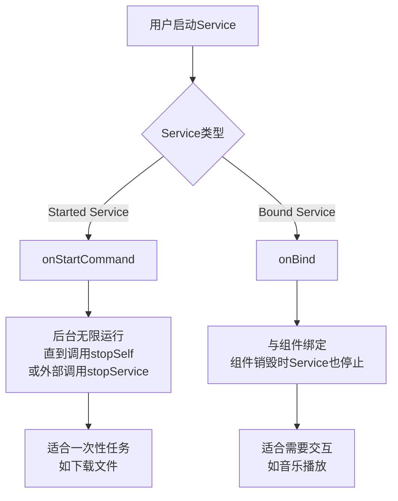
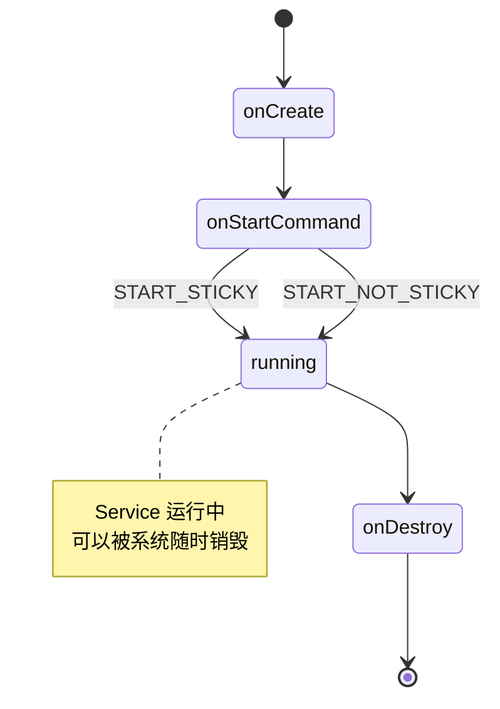

# 7.1.1 山林中的守护精灵

秋日的午后，阳光透过稀疏的枫叶，在地面上投下斑驳的光影。露营编程旅团在一处向阳的山坡上安顿下来，伊莎正在用便携式炉具煮着热可可。

洛芙靠在一棵老枫树下，翻看着手机里下载的离线音乐列表。她戴上了耳机，闭上眼睛，随着音乐的节奏轻轻摇晃身体。

“哎呀！”洛芙突然摘下耳机，皱起眉头，“怎么音乐又停了？我不过是切换到另一个App查了个歌词，音乐就不播放了。”

正在整理帐篷的希尔抬起头来：“你是不是把音乐App退出了？或者按了返回键？”

“没有啊，我就只是切换到另一个应用看了下歌词，然后回来发现音乐停了。”洛芙委屈地说。

黛琳走过来，在洛芙身边坐下：“这很正常。普通的Activity在失去焦点或者用户离开之后，系统就会把它销毁，音乐自然就停了。”

“那怎么才能让音乐一直播放呢？”洛芙问，“总不能一直开着那个页面吧？”

“这就是我们今天要聊的内容了。”黛琳微微一笑，“在Android里，有一个叫做Service的组件，专门处理这种'后台工作'的情况。”

## 7.1.1.1 初识Service

伊莎端着装满热可可的杯子走了过来，好奇地问：“Service？服务和Activity有什么区别吗？”

“区别大了。”黛琳说道，“Activity是用来和用户交互的，你看到的界面就是Activity。但Service不一样——它没有用户界面，可以在后台默默运行。”

洛芙似懂非懂地点点头：“就像...一个看不见的助手？”

“完全正确！”黛琳打了个响指，“Service就像一个隐形的助手，你看不见它，但它一直在后台帮你做事。比如——”

“比如播放音乐？”洛芙眼睛一亮。

“没错。”黛琳点点头，“还有下载文件、同步数据、处理通知等等，这些都是Service的典型应用场景。”

```kotlin
// 一个简单的音乐播放Service示例
class MusicService : Service() {

    private var mediaPlayer: MediaPlayer? = null
    
    override fun onCreate() {
        super.onCreate()
        // 初始化媒体播放器
        mediaPlayer = MediaPlayer()
    }
    
    override fun onStartCommand(intent: Intent?, flags: Int, startId: Int): Int {
        // 开始播放音乐
        intent?.getStringExtra("song_path")?.let { path ->
            mediaPlayer?.apply {
                setDataSource(path)
                prepare()
                start()
            }
        }
        // 返回STICKY，表示Service被杀掉后会自动重启
        return START_STICKY
    }
    
    override fun onBind(intent: Intent?): IBinder? {
        // 绑定Service时返回
        return null
    }
    
    override fun onDestroy() {
        super.onDestroy()
        // 释放资源
        mediaPlayer?.stop()
        mediaPlayer?.release()
    }
}
```

希尔指着这段代码解释道：“看，这就是一个最基本的Service。它有`onCreate()`、`onStartCommand()`和`onDestroy()`几个关键方法。”

洛芙好奇地问：“这些方法都是干什么的？”

“简单来说，”黛琳解释道，“`onCreate()`是Service启动时调用的，你可以在这里做一些初始化工作。`onStartCommand()`是每次启动Service时都会调用的，你上次音乐App切换到后台后，Service就在调用这个方法。而`onDestroy()`是Service停止时调用的，用来清理资源。”

## 7.1.1.2 Service的类型

伊莎端起热可可喝了一口：“那Service都有哪些类型呢？”

“Android中的Service主要分为两类。”黛琳说道，“一类是**启动型Service**（Started Service），一类是**绑定型Service**（Bound Service）。”

她在地上画了一个简单的示意图：



“简单来说，”黛琳补充道，“**启动型Service**是你告诉它'去干活'，它就一直在后台干，直到完成为止。而**绑定型Service**是你和它'绑在一起'，你用完了，它也就走了。”

洛芙举手提问：“那刚才的音乐播放应该用哪种？”

“通常情况下，音乐播放会用**绑定型Service**。”黛琳解释道，“因为用户随时可能暂停、切歌，或者退出播放器。这时候Service需要和Activity保持通信，绑定型Service就更合适。”

“但是，”希尔补充道，“如果是你在后台下载一个大文件，不要求随时和用户交互，那就是启动型Service更合适。”

## 7.1.1.3 Service的生命周期

洛芙若有所思地点点头，又问：“Service是怎么启动和停止的？”

“这就要说到Service的生命周期了。”黛琳重新整理了一下思绪，“Service的生命周期比Activity简单多了。”



“其实Service的生命周期很简单。”黛琳指着图说道，“首先`onCreate()`被调用，然后是`onStartCommand()`，Service就开始运行了。最后当不需要的时候，`onDestroy()`被调用，Service就停止了。”

“就这么简单？”伊莎有些惊讶。

“表面上看起来简单，”黛琳说道，“但里面有很多细节需要注意。比如`onStartCommand()`的返回值——`START_STICKY`和`START_NOT_STICKY`就有不同的含义。”

她继续解释道：“`START_STICKY`的意思是，如果Service被系统杀掉了，系统会尝试重新创建它。而`START_NOT_STICKY`则相反，Service被杀后不会自动重启。”

“那音乐播放应该用哪个？”洛芙问。

“音乐播放通常用`START_STICKY`，”黛琳说道，“因为用户可能不希望音乐突然中断。但具体用哪个，要看你的应用场景。”

## 7.1.1.4 注意事项与最佳实践

伊莎突然想到一个问题：“黛琳，我听说Service很耗电，是这样吗？”

“这就要看怎么用了。”黛琳的表情变得认真起来，“Service本身不费电，但如果用错了场景，就会出问题。”

她总结了以下几个注意事项：

**第一，能不用就不用。** Android系统对后台Service有很多限制，特别是在Android 8.0以后。如果能用WorkManager或者其他后台任务API解决的问题，就尽量不要用Service。

**第二，前台Service要用通知。** 如果你的Service需要长时间运行（比如音乐播放），最好把它变成前台Service，用一个常驻通知告诉用户"我正在后台运行"。

**第三，记得释放资源。** Service在`onDestroy()`中一定要做好清理工作，否则会造成内存泄漏。

```kotlin
// 正确的做法：使用前台Service
class MusicService : Service() {
    
    companion object {
        const val NOTIFICATION_ID = 1
        const val CHANNEL_ID = "music_playback"
    }
    
    override fun onCreate() {
        super.onCreate()
        createNotificationChannel()
    }
    
    override fun onStartCommand(intent: Intent?, flags: Int, startId: Int): Int {
        val notification = NotificationCompat.Builder(this, CHANNEL_ID)
            .setContentTitle("正在播放")
            .setContentText("音乐标题")
            .setSmallIcon(R.drawable.ic_music)
            .build()
        
        startForeground(NOTIFICATION_ID, notification)
        
        return START_STICKY
    }
    
    private fun createNotificationChannel() {
        val channel = NotificationChannel(
            CHANNEL_ID,
            "音乐播放",
            NotificationManager.IMPORTANCE_LOW
        ).apply {
            description = "音乐播放通知"
        }
        val manager = getSystemService(NotificationManager::class.java)
        manager.createNotificationChannel(channel)
    }
}
```

“看这段代码，”黛琳指着屏幕说道，“这就是一个正确的前台Service实现。它创建了一个通知，让用户知道音乐正在播放。”

## 7.1.1.5 反模式与重构

洛芙突然想起什么似的：“黛琳姐姐，我之前见过有人这么写Service——”

她拿起树枝，在地面上画了一行代码：

```
// 反模式：不推荐的做法
class BadService {
    fun doWork() {
        while(true) {
            // 无限循环做某事
        }
    }
}
```

“这种在Service里写无限循环的做法，是非常危险的。”黛琳看完之后摇头说道，“首先，这会导致Service一直占用CPU，系统可能会认为它是个恶意应用。其次，这会让你的电池消耗得非常快。”

“那正确的做法应该是什么呢？”希尔问道。

```kotlin
// 正确的做法：使用Handler或WorkManager
class GoodService : Service() {
    
    private val handler = Handler(Looper.getMainLooper())
    private var isRunning = false
    
    private val runnable = object : Runnable {
        override fun run() {
            if (isRunning) {
                // 执行任务
                doActualWork()
                // 安排下一次执行
                handler.postDelayed(this, 60000) // 每分钟执行一次
            }
        }
    }
    
    override fun onStartCommand(intent: Intent?, flags: Int, startId: Int): Int {
        isRunning = true
        handler.post(runnable)
        return START_STICKY
    }
    
    override fun onDestroy() {
        super.onDestroy()
        isRunning = false
        handler.removeCallbacks(runnable)
    }
    
    private fun doActualWork() {
        // 这里做你真正需要做的事
    }
}
```

“正确的做法是使用Handler来控制执行频率，”黛琳解释道，“或者更好的方式是使用WorkManager，它会自动帮你管理任务的执行时间和系统资源。”

---

## 7.1.1.6 专业技术总结

本章我们学习了Android中Service的基本概念。

**核心要点：**

1. **Service是后台组件** - 没有用户界面，可以在后台执行长时间运行的任务
2. **两种类型** - 启动型Service（Started Service）和绑定型Service（Bound Service）
3. **生命周期简单** - onCreate() → onStartCommand() → onDestroy()
4. **onStartCommand返回值** - START_STICKY（被杀后重启）vs START_NOT_STICKY（被杀后不重启）
5. **前台Service** - 需要显示常驻通知，告知用户Service正在运行
6. **注意事项** - 合理使用资源，考虑电池消耗，使用WorkManager等现代API

**Service vs Activity：**

| 特性 | Activity | Service |
|------|----------|---------|
| 用户界面 | 有 | 无 |
| 生命周期 | 与用户交互相关 | 后台运行 |
| 系统优化 | 会被系统回收 | 有更多限制 |

---

> **学习建议**
> 
> 1. 创建一个简单的Android项目，尝试启动一个Service并观察日志
> 2. 对比在Service中使用无限循环和使用Handler的区别
> 3. 尝试实现一个前台Service，显示播放通知
> 4. 思考你做过的项目中有哪些场景可以考虑使用Service
> 5. 下一章我们将学习AIDL，了解如何实现跨进程通信

---

## 洛芙的小小日记本

> 今天学会了Service！原来音乐播放用的是后台组件，不是Activity。黛琳姐姐说Service像"隐形的助手"，我觉得更像"守护精灵"——看不见但一直在后台守护着～要注意不能用无限循环，要用Handler或WorkManager，电池会被消耗很快的！📱✨
