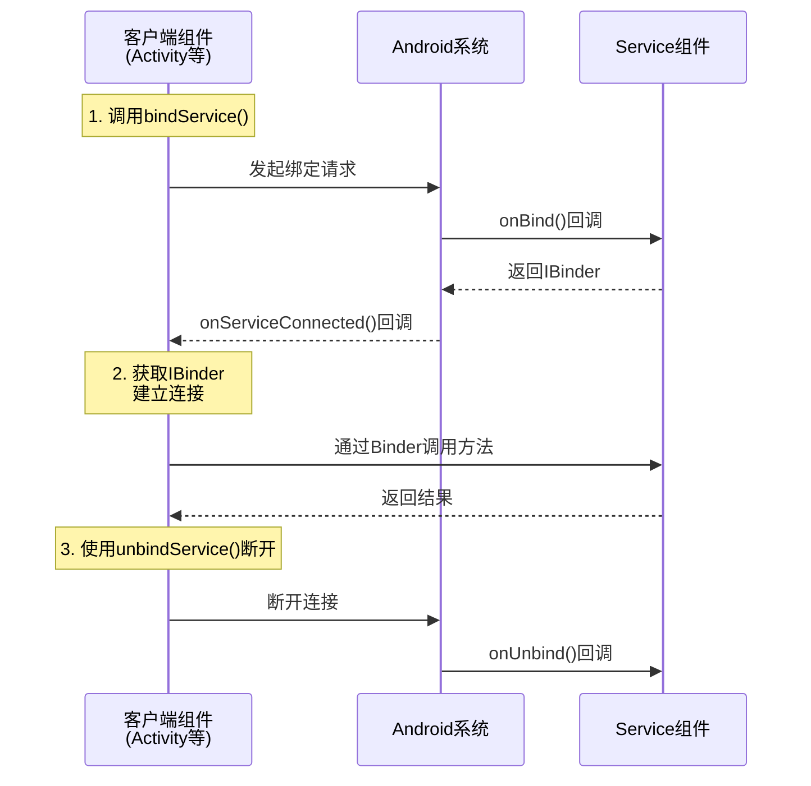
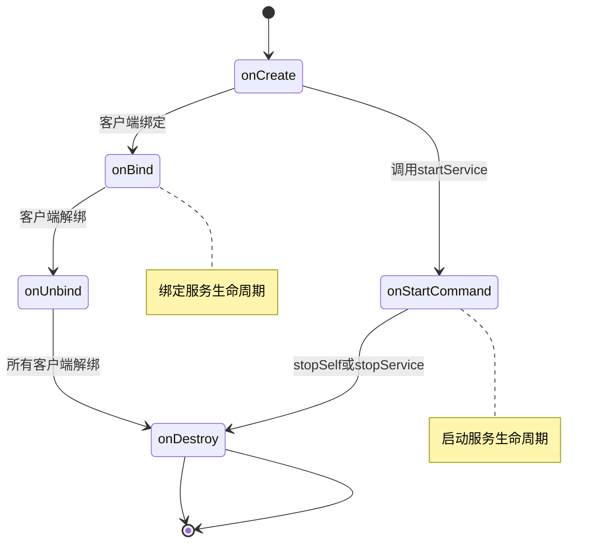
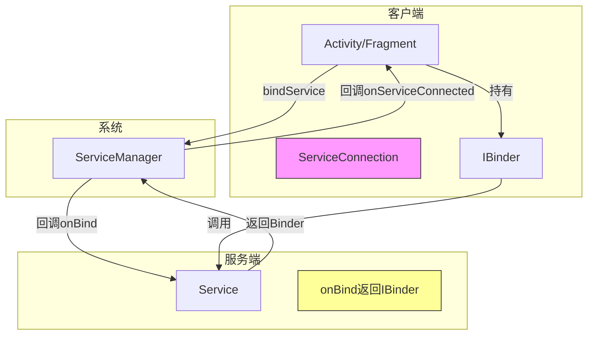

# 7.1.3 绑定服务概览

篝火跳动的光芒在姑娘们的脸上投下温暖的金色阴影，洛芙抱着膝盖，眼睛里闪烁着刚才学会AIDL后的兴奋光芒。

“黛琳姐姐，AIDL好厉害！”洛芙说道，“那如果我不想让其他App来控制我的音乐，只是我自己App里的Activity想控制Service，该怎么做？”

黛琳拨弄着篝火的动作顿了顿，侧过头来看着洛芙：“这个问题问得好。其实如果你只是在自己的App内部使用Service，还有一种更简单的方式——绑定服务。”

“绑定服务？”伊莎重复道，“听起来好像是把Service'绑'在身边的人身边一样。”

“对就是这个意思，”黛琳笑道，“绑定服务就像是你和Service之间建立了一条专属的通道，你们可以随时随地互相交流。”

希尔跃跃欲试：“那和AIDL有什么区别吗？”

“区别大了，”黛琳说道，“AIDL是为了让不同App之间可以通信，而绑定服务通常用于同一个App内部。当然，绑定服务也可以用于跨进程，但这不是它的主要用途。”

## 7.1.3.1 什么是绑定服务

洛芙好奇地问：“绑定服务到底是什么意思？”

“绑定服务是Android中一种特殊的Service使用方式，”黛琳解释道，“当你通过`bindService()`绑定到一个Service时，你的组件（通常是Activity）会与Service建立一条持久的连接。”

她顿了顿，让篝火的光芒在眼睛里跳跃：“你可以把绑定服务想象成......”

“想象成什么？”伊莎追问道。

“想象成露营时的对讲机！”黛琳灵机一动，“你想啊，如果你们在不同的帐篷里，想喊话可能听不见，但对讲机一打开，就能随时随地聊天了对吧？”

洛芙眼睛一亮：“哦！所以绑定服务就是对讲机，可以随时通信！”

“没错，”黛琳笑道，“绑定服务就是组件之间的'对讲机'，一旦连接建立，双方可以随时来回传递数据和方法调用。”

希尔补充道：“而且和对讲机一样，绑定服务可以一对多——一个Service可以被多个组件同时绑定。”

黛琳点点头：“对，这就好像一个露营小组里，大家都可以用同一个对讲机频道。”

## 7.1.3.2 绑定服务的工作流程

伊莎好奇地问：“那绑定服务具体是怎么工作的？”

“这个问题问得好，”黛琳在地上找了一根树枝，画了起来。她画的是绑定服务的基本流程：



“你们看，”黛琳指着图解释道，“绑定服务一共有三个关键步骤。”

“第一步，客户端调用`bindService()`，向系统发起绑定请求，”黛琳说道，“这一步需要三个参数：要绑定的Service的Intent、还有一个`ServiceConnection`对象，以及一个标志位。”

“第二步，系统会回调Service的`onBind()`方法，”黛琳继续说道，“Service在这个方法里返回一个`IBinder`对象。这个IBinder就是客户端和Service之间的'桥梁'。”

“第三步，系统会回调客户端的`onServiceConnected()`方法，把这个IBinder交给客户端，”黛琳说道，“客户端拿到IBinder后，就可以调用Service里暴露出来的方法了。”

洛芙举手提问：“那如果我不想用这个Service了，该怎么办？”

“问得好，”黛琳说道，“当你不需要Service的时候，调用`unbindService()`就可以断开连接。系统会回调Service的`onUnbind()`方法，通知Service连接已经断开。”

## 7.1.3.3 Service的生命周期

伊莎突然想到一个问题：“黛琳，那绑定Service和之前学的`startService()`启动的Service，它们的生命周期有什么不同吗？”

“这是个好问题，”黛琳说道，“让我画个图对比一下。”



“你们看，”黛琳指着图解释道，“绑定服务的生命周期是这样的：首先Service回调被创建，系统`onCreate()`；然后第一个客户端绑定上来，系统回调`onBind()`；当所有客户端都解绑后，系统回调`onUnbind()`，然后是`onDestroy()`，Service就被销毁了。”

“那启动服务的生命周期呢？”洛芙问。

“启动服务就简单多了，”黛琳说道，“调用`startService()`后，系统回调`onCreate()`和`onStartCommand()`；当Service自己调用`stopSelf()`或者外部调用`stopService()`时，Service就被销毁了。”

希尔补充道：“而且还有一个关键区别——启动服务可以独立于客户端长期运行，但绑定服务不行。如果没有客户端绑定，Service就会停止运行。”

“所以，”黛琳总结道，“如果你的Service需要和客户端保持长期交互，用绑定服务；如果你的Service需要独立运行，不依赖客户端，用启动服务。”

洛芙若有所思：“那...可以同时用吗？”

“完全可以！”黛琳笑道，“你完全可以同时调用`startService()`和`bindService()`。这样Service既可以独立运行，又可以和客户端保持交互。”

## 7.1.3.4 创建绑定Service

伊莎跃跃欲试：“黛琳，快教我们怎么创建一个绑定Service吧！”

“好好好，”黛琳笑道，“让我来展示一下。”

```kotlin
/**
 * 音乐播放服务 - 绑定服务示例
 * 演示如何创建一个可以绑定的Service
 */
class MusicService : Service() {
    
    // 内部Binder类，用于暴露给客户端
    inner class MusicBinder : Binder() {
        // 获取Service实例，让客户端可以调用Service的方法
        fun getService(): MusicService = this@MusicService
    }
    
    private val binder = MusicBinder()
    private var mediaPlayer: MediaPlayer? = null
    private var currentSong: String? = null
    
    // Service创建时调用
    override fun onCreate() {
        super.onCreate()
        // 初始化媒体播放器
        mediaPlayer = MediaPlayer()
    }
    
    // 绑定Service时调用，返回Binder给客户端
    override fun onBind(intent: Intent?): IBinder {
        return binder
    }
    
    // 所有客户端解绑时调用
    override fun onUnbind(intent: Intent?): Boolean {
        return super.onUnbind(intent)
    }
    
    // Service销毁时调用
    override fun onDestroy() {
        super.onDestroy()
        mediaPlayer?.release()
        mediaPlayer = null
    }
    
    // 播放音乐
    fun play(song: String) {
        currentSong = song
        // 实际项目中这里会播放音乐
        mediaPlayer?.start()
    }
    
    // 暂停播放
    fun pause() {
        mediaPlayer?.pause()
    }
    
    // 获取当前播放状态
    fun isPlaying(): Boolean {
        return mediaPlayer?.isPlaying ?: false
    }
    
    // 获取当前歌曲
    fun getCurrentSong(): String? {
        return currentSong
    }
}
```

“看这里，”黛琳重点强调道，“最关键的是`onBind()`方法。这个方法必须返回一个`IBinder`对象，客户端通过这个对象来和Service通信。”

“这个`MusicBinder`是我们自己定义的Binder类，”黛琳继续说道，“它的`getService()`方法返回了Service的实例，这样客户端拿到Binder后，就可以调用Service里的所有公开方法了。”

洛芙好奇地问：“为什么要用`inner class`？”

“因为Binder需要持有Service的引用才能调用Service的方法，”黛琳解释道，“用`inner class`可以让Binder内部类访问外部类（也就是Service）的成员。”

## 7.1.3.5 客户端绑定到Service

希尔迫不及待地说：“现在让我来展示客户端怎么绑定！”

```kotlin
/**
 * 音乐播放器Activity - 绑定服务客户端示例
 * 演示如何绑定到MusicService并调用其方法
 */
class MusicPlayerActivity : AppCompatActivity() {
    
    private var musicService: MusicService? = null
    private var isBound = false
    
    // ServiceConnection：监听与Service的连接状态
    private val serviceConnection = object : ServiceConnection {
        
        // 当与Service的连接建立时调用
        override fun onServiceConnected(name: ComponentName?, service: IBinder?) {
            // 从Binder获取Service实例
            val binder = service as MusicBinder
            musicService = binder.getService()
            isBound = true
            
            Log.d("MusicPlayer", "Service已绑定")
        }
        
        // 当与Service的连接断开时调用
        override fun onServiceDisconnected(name: ComponentName?) {
            musicService = null
            isBound = false
            
            Log.d("MusicPlayer", "Service已解绑")
        }
    }
    
    override fun onStart() {
        super.onStart()
        
        // 绑定到MusicService
        val intent = Intent(this, MusicService::class.java)
        bindService(intent, serviceConnection, Context.BIND_AUTO_CREATE)
    }
    
    override fun onStop() {
        super.onStop()
        
        // 解绑Service
        if (isBound) {
            unbindService(serviceConnection)
            isBound = false
        }
    }
    
    // 播放按钮点击事件
    fun onPlayClicked(view: View) {
        if (isBound) {
            musicService?.play("秋日私语")
            Log.d("MusicPlayer", "开始播放: 秋日私语")
        }
    }
    
    // 暂停按钮点击事件
    fun onPauseClicked(view: View) {
        if (isBound) {
            musicService?.pause()
            Log.d("MusicPlayer", "暂停播放")
        }
    }
    
    // 获取播放状态
    fun onStatusClicked(view: View) {
        if (isBound) {
            val isPlaying = musicService?.isPlaying() ?: false
            val song = musicService?.getCurrentSong() ?: "无"
            Log.d("MusicPlayer", "当前状态: 正在播放=$isPlaying, 歌曲=$song")
        }
    }
}
```

“太棒了！”洛芙兴奋地说，“原来绑定Service这么简单！”

“对，就是这么几行代码，”希尔笑道，“不过要注意`ServiceConnection`的两个回调——`onServiceConnected()`在连接建立时被调用，`onServiceDisconnected()`在连接断开时被调用。”

黛琳补充道：“还有一个重要的事情——必须在Manifest里声明Service！”

```xml
<!-- 在AndroidManifest.xml中声明Service -->
<service
    android:name=".MusicService"
    android:enabled="true"
    android:exported="false" />
```

“这里`android:exported=false`表示这个Service只允许本App的组件绑定，不允许其他App绑定，”黛琳解释道，“如果你想让其他App也能绑定，需要改成`true`，并且最好加上权限控制。”

## 7.1.3.6 绑定服务的反模式

伊莎突然想起什么：“黛琳，我之前看到有些人写的绑定服务代码好像有问题，你能说说常见的错误吗？”

“好问题，”黛琳点点头，“我来讲讲几种常见的反模式。”

**反模式一：在Service的onBind()中返回null**

```kotlin
// ❌ 错误示例
override fun onBind(intent: Intent?): IBinder? {
    return null  // 这会导致客户端无法获取Binder
}
```

黛琳摇头道：“`onBind()`必须返回一个有效的IBinder，否则客户端的`onServiceConnected()`永远不会被调用。”

```kotlin
// ✅ 正确示例
override fun onBind(intent: Intent?): IBinder {
    return binder  // 返回有效的Binder
}
```

**反模式二：在onServiceConnected中做耗时操作**

```kotlin
// ❌ 错误示例
override fun onServiceConnected(name: ComponentName?, service: IBinder?) {
    // 在主线程做耗时操作会阻塞UI
    Thread.sleep(2000)  // 这会导致ANR
    doSomething()
}
```

希尔补充道：“记住，`onServiceConnected()`是在主线程回调的，不能在这里做耗时操作。如果需要做耗时操作，必须放到后台线程里。”

```kotlin
// ✅ 正确示例
override fun onServiceConnected(name: ComponentName?, service: IBinder?) {
    // 在后台线程执行耗时操作
    lifecycleScope.launch(Dispatchers.IO) {
        doSomething()
    }
}
```

**反模式三：忘记在onDestroy中解绑**

```kotlin
// ❌ 错误示例
override fun onStop() {
    super.onStop()
    // 忘记解绑会导致内存泄漏
}
```

“如果不及时解绑，”黛琳严肃地说，“Service会一直保持运行，不仅浪费系统资源，还可能导致内存泄漏。”

```kotlin
// ✅ 正确示例
override fun onDestroy() {
    super.onDestroy()
    if (isBound) {
        unbindService(serviceConnection)
        isBound = false
    }
}
```

伊莎拍了拍胸口：“还好今天学到了这些，不然以后肯定要踩坑！”

“对，”黛琳笑道，“这些坑我也踩过，都是眼泪换来的经验啊。”

## 7.1.3.7 绑定服务的应用场景

洛芙好奇地问：“那绑定服务一般在什么时候用呢？”

“好问题，”黛琳说道，“绑定服务最适合以下几种场景。”

“第一，音乐播放器，”黛琳伸出一根手指，“就像我们刚才的例子，Activity需要控制Service播放音乐，Service需要把播放状态通知给Activity。这种情况下，绑定服务就是最好的选择。”

“第二，本地服务需要暴露API给其他组件，”黛琳伸出第二根手指，“比如一个App内部的Service想给多个Activity或Fragment使用，绑定服务可以提供统一的访问接口。”

“第三，需要实时获取Service状态的场景，”黛琳伸出第三根手指，“比如下载管理器，Activity需要实时显示下载进度，Service需要把进度信息推送给Activity。”

希尔补充道：“还有一种常见场景是跨Activity共享数据。比如一个Service从网络获取数据，多个Activity都需要访问这些数据，就可以绑定到同一个Service来获取。”

洛芙点点头：“原来绑定服务这么有用！我回去要把我的音乐App改一改！”

“对，学以致用才是最好的学习方式，”黛琳笑道，“不过记得要注意解绑时机，别忘了在不需要的时候断开连接。”

篝火的光芒跳动着，洛芙看着手机里自己的音乐App若有所思。秋夜的露营地，知识和温暖都在流淌。

---

## 7.1.3.8 专业技术总结

本章我们学习了Android中的绑定服务（Bound Service）。

### 核心定义

**绑定服务**是Android中一种让组件（通常是Activity）与Service建立持久连接的机制。通过绑定服务，客户端可以获取Service的引用并直接调用其公开方法，就像调用本地方法一样简单。

### 结构图



### 复杂度与影响

- **绑定服务生命周期**：绑定→使用→解绑→销毁，生命周期与客户端绑定状态相关联
- **内存管理**：正确解绑避免内存泄漏；未解绑的Service会阻止系统回收
- **性能**：同一进程内绑定几乎无IPC开销，跨进程绑定有轻微IPC开销

### 反模式与陷阱

1. **onBind()返回null**：导致客户端无法建立连接
2. **onServiceConnected中做耗时操作**：阻塞主线程导致ANR
3. **未及时解绑**：导致内存泄漏和资源浪费
4. **多次绑定同一Service**：Service只会被创建一次，但会触发多次onBind
5. **Service销毁后仍持有引用**：解绑后应清空Service引用

### 设计哲学

绑定服务体现了Android的**组件化通信**思想：

- **接口驱动**：通过Binder暴露有限的方法集，而不是直接暴露Service实例
- **生命周期关联**：Service的生命周期与客户端绑定状态关联，实现按需创建和销毁
- **关注点分离**：Service负责核心业务逻辑，客户端负责UI展示和用户交互

### 动手练习

#### 练习目标
创建一个简单的音乐播放器App，使用绑定Service让Activity控制播放、暂停和获取状态。

#### Task 1：创建MusicService
**目标**：创建绑定Service类，实现播放控制功能

**步骤**：
1. 新建MusicService类，继承Service
2. 创建内部Binder类，提供getService()方法
3. 实现play()、pause()、isPlaying()、getSongName()方法
4. 在onBind()中返回Binder实例
5. 在Manifest中声明Service

**验收标准**：
- [ ] MusicService类创建成功
- [ ] onBind()返回有效的Binder
- [ ] Service在Manifest中声明

**提示代码**：
```kotlin
class MusicService : Service() {
    inner class MusicBinder : Binder() {
        fun getService(): MusicService = this@MusicService
    }
    
    override fun onBind(intent: Intent?): IBinder = MusicBinder()
    // 实现播放控制方法...
}
```

#### Task 2：创建MusicPlayerActivity
**目标**：创建Activity绑定到MusicService

**步骤**：
1. 创建MusicPlayerActivity
2. 声明ServiceConnection对象
3. 在onStart()中调用bindService()
4. 在onStop()中调用unbindService()
5. 实现播放、暂停按钮的点击事件

**验收标准**：
- [ ] Activity可以成功绑定Service
- [ ] 点击播放按钮后Service开始播放
- [ ] 点击暂停按钮后Service暂停播放
- [ ] Activity销毁时正确解绑Service

**提示代码**：
```kotlin
private val connection = object : ServiceConnection {
    override fun onServiceConnected(name: ComponentName?, service: IBinder?) {
        service as MusicBinder
        musicService = service.getService()
    }
    override fun onServiceDisconnected(name: ComponentName?) {
        musicService = null
    }
}
```

#### Task 3：添加状态显示
**目标**：在Activity中显示当前播放状态

**步骤**：
1. 在布局中添加TextView显示歌曲名和播放状态
2. 添加"获取状态"按钮
3. 点击按钮时调用Service获取状态并显示

**验收标准**：
- [ ] TextView正确显示歌曲名称
- [ ] 播放/暂停状态正确显示

### 面试热身

1. **绑定服务和启动服务有什么区别？**用自己的话说清楚。
2. **onBind()方法返回null会怎么样？**这种情况还有救吗？
3. **如果Activity已经解绑，但Service还在运行，会发生什么？**
4. **绑定Service时，onServiceConnected()是在哪个线程被调用的？**
5. **为什么要尽量在onDestroy()或onStop()中解绑Service？**

### 参考实现要点

1. **优先使用绑定服务进行同进程通信**：相比startService，绑定服务提供更直接的API
2. **注意解绑时机**：在Activity的onDestroy或onStop中解绑，避免内存泄漏
3. **ServiceConnection回调在主线程**：不要在回调中执行耗时操作
4. **使用inner class持有Service引用**：Binder使用inner class可以访问外部类的成员
5. **合理设置exported属性**：本App内部使用的Service应设为false
6. **考虑使用官方推荐方式**：Android 12+对后台启动Service有限制，建议使用WorkManager或前台Service

---

> **学习建议**
> 
> 1. 先自己动手写一个简单的绑定Service，感受完整的绑定流程
> 2. 尝试在Activity和Service之间传递复杂数据（比如歌曲信息对象）
> 3. 思考为什么绑定Service适合音乐播放器等需要长期交互的场景
> 4. 下一章我们将学习前台服务，了解如何让Service在后台持续运行

---

## 洛芙的小小日记本

> 今天学会了绑定服务！原来Service不只是能启动，还能"绑"在身边的人身边～黛琳说绑定服务像对讲机，这个比喻太形象了！要注意onBind要返回有效的Binder，还要记得解绑不然会内存泄漏。秋天的露营太好了，篝火暖暖的，知识也暖暖的🍂🎵

---

## 今日关键词

- **绑定服务（Bound Service）**：通过bindService()与Service建立持久连接的机制
- **IBinder**：Binder对象，客户端与Service之间的通信桥梁
- **ServiceConnection**：监听Service连接状态的回调接口
- **onBind()**：Service的生命周期方法，返回IBinder给客户端
- **onServiceConnected()**：客户端回调，获取Service的Binder
- **onUnbind()**：所有客户端解绑时Service的回调方法
- **Binder机制**：Android进程间通信的核心机制
- **bindService()**：绑定到Service的系统API
- **unbindService()**：解绑Service的系统API
- **生命周期（Lifecycle）**：Service从创建到销毁的完整过程
- **ANR（Application Not Responding）**：应用无响应错误
- **内存泄漏（Memory Leak）**：对象无法被GC回收导致的内存浪费
- **Parcelable**：Android中用于对象序列化的接口
- **Intent**：Android组件间通信的信使
- **ComponentName**：组件的完整名称标识
- **Context.BIND_AUTO_CREATE**：绑定时自动创建Service的标志
