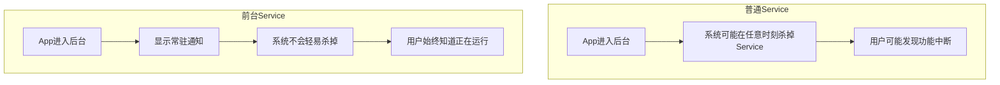

# 7.1.4 夜空下的守护星光

夜幕降临，露营编程旅团的姑娘们钻进了温暖的睡袋。帐篷外，蟋蟀在秋夜的寒露中轻声吟唱，偶尔有几只萤火虫提着小小的灯笼飘过。

洛芙蜷缩在睡袋里，把手机放在耳边听了又听，突然皱起眉头：“奇怪，我又没有在操作手机，为什么音乐又停了？”

正在看书的黛琳抬起头来：“你是不是把App退到后台了？”

“对啊，我就切到微信回了条消息，”洛芙委屈地说，“然后回来音乐就停了。这已经是今天第三次了！”

希尔正在整理明天要用的代码，插嘴道：“这很正常。Android系统会杀掉后台的普通Service，节省电量。你需要用前台服务。”

“前台服务？”洛芙眨眨眼，“那是什么？”

黛琳放下书，帐篷里的灯光在她眼睛里跳跃：“前台服务啊，就像是...”

她想了想，指着帐篷顶上那盏小小的LED灯：“就像这盏灯。它一直在发光，你随时都能看见它。普通的Service就像手电筒，你不用的时候，系统就会把它关掉省电。”

## 7.1.4.1 什么是前台服务

伊莎也从睡袋里探出头来：“所以前台服务就是...一直'亮着'的Service？”

“没错！”黛琳打了个响指，“前台服务是一种特殊的Service，它会在通知栏显示一个常驻通知，告诉用户'我正在后台运行'。因为系统知道这个Service很重要，所以不会轻易杀掉它。”

洛FR好奇地问：“那哪些场景会用前台服务呢？”

“很多场景，”黛琳扳着手指数道，“比如——”

“音乐播放！”洛FR抢着说。

“对，音乐播放是最典型的例子。”黛琳笑道，“还有导航应用、健身追踪器、录音应用...总之，你需要让用户知道'我正在干活'，而且'别把我关掉'的场景，都可以用前台服务。”

## 7.1.4.2 前台服务vs普通Service

希尔放下笔记本，画了个对比图：



“你们看，”黛琳指着图解释道，“普通Service就像个临时工，系统想开除就开除。前台Service就像是正式员工，有编制的那种，系统得给几分面子。”

洛FR被逗笑了：“这个比喻好！”

“但是，”黛琳话锋一转，“前台服务也不是万能的。它需要显示通知，会消耗一定的电量。所以，能不用就不用。”

## 7.1.4.3 如何创建前台服务

“那具体怎么创建前台服务呢？”洛FR问。

“问得好，”黛琳说道，“其实很简单，就三步。”

```kotlin
class MusicService : Service() {
    
    companion object {
        const val NOTIFICATION_ID = 1
        const val CHANNEL_ID = "music_playback"
    }
    
    override fun onCreate() {
        super.onCreate()
        createNotificationChannel()
    }
    
    override fun onStartCommand(intent: Intent?, flags: Int, startId: Int): Int {
        // 第一步：创建通知
        val notification = NotificationCompat.Builder(this, CHANNEL_ID)
            .setContentTitle("正在播放")
            .setContentText("歌曲名称 - 歌手")
            .setSmallIcon(R.drawable.ic_music)
            .setPriority(NotificationCompat.PRIORITY_LOW)
            .setOngoing(true)  // 常驻通知
            .build()
        
        // 第二步：调用startForeground
        startForeground(NOTIFICATION_ID, notification)
        
        // 第三步：开始播放音乐
        startMusic()
        
        return START_STICKY
    }
    
    private fun createNotificationChannel() {
        val channel = NotificationChannel(
            CHANNEL_ID,
            "音乐播放",
            NotificationManager.IMPORTANCE_LOW
        ).apply {
            description = "显示音乐播放状态"
            setShowBadge(false)
        }
        
        val manager = getSystemService(NotificationManager::class.java)
        manager.createNotificationChannel(channel)
    }
    
    private fun startMusic() {
        // 音乐播放逻辑
    }
    
    override fun onBind(intent: Intent?): IBinder? = null
    
    override fun onDestroy() {
        super.onDestroy()
        stopMusic()
    }
}
```

“你们看，”黛琳重点强调道，“关键就是两个方法：创建通知渠道`createNotificationChannel()`和调用`startForeground()`。”

“`startForeground()`接收两个参数，”黛琳继续解释道，“第一个是通知ID，第二个是通知对象。ID很关键，因为后面你更新通知或者停止前台服务时，都需要用这个ID。”

## 7.1.4.4 更新与停止前台服务

伊莎好奇地问：“那如果我想更新通知内容呢？”

“很简单，”黛琳说道，“用同样的ID创建一个新通知，然后调用`notify()`。”

```kotlin
// 更新通知
fun updateNotification(songName: String, artist: String) {
    val notification = NotificationCompat.Builder(this, CHANNEL_ID)
        .setContentTitle("正在播放")
        .setContentText("$songName - $artist")
        .setSmallIcon(R.drawable.ic_music)
        .setOngoing(true)
        .build()
    
    val manager = getSystemService(NotificationManager::class.java)
    manager.notify(NOTIFICATION_ID, notification)
}
```

“那怎么停止前台服务呢？”洛FR问。

“调用`stopForeground()`，”黛琳说道，“它也接收一个参数，表示是否同时移除通知。”

```kotlin
// 停止前台服务（不移除通知）
stopForeground(STOP_FOREGROUND_DETACH)

// 停止前台服务（同时移除通知）
stopForeground(STOP_FOREGROUND_REMOVE)

// 完全停止Service
stopSelf()
```

“你们看这个参数，”黛琳重点强调道，“`STOP_FOREGROUND_DETACH`是停止前台服务但保留通知，`STOP_FOREGROUND_REMOVE`是连通知一起删掉。一般用`DETACH`就够了。”

## 7.1.4.5 权限与注意事项

希尔突然想起什么：“对了，用前台服务还需要权限吧？”

“对，”黛琳点点头，“Android 9（API 28）以上需要声明`FOREGROUND_SERVICE`权限。”

```xml
<manifest xmlns:android="http://schemas.android.com/apk/res/android">
    
    <!-- 前台服务权限 -->
    <uses-permission android:name="android.permission.FOREGROUND_SERVICE" />
    
    <!-- 如果需要特定类型的前台服务，还需要额外权限 -->
    <uses-permission android:name="android.permission.FOREGROUND_SERVICE_MEDIA_PLAYBACK" />
    <uses-permission android:name="android.permission.FOREGROUND_SERVICE_LOCATION" />
    
</manifest>
```

“不同的前台服务类型需要不同的权限，”黛琳补充道，“比如音乐播放需要`MEDIA_PLAYBACK`，定位需要`LOCATION`。”

伊莎举手提问：“那前台服务会被系统杀掉吗？”

“会的，”黛琳诚实地说，“如果系统内存特别紧张，还是会杀前台服务的。所以，你需要在`onDestroy()`里做好保存状态的准备，下次启动时能够恢复。”

## 7.1.4.6 反模式与最佳实践

洛FR在地上画了起来：

```
// 反模式：前台服务里做耗时操作
class BadService : Service() {
    override fun onStartCommand(...): Int {
        startForeground(1, notification)
        
        // 错误：在主线程做网络请求
        val data = httpClient.get("...")
        
        return START_STICKY
    }
}
```

黛琳看完摇头：“这也是个常见错误。前台服务虽然不会轻易被杀，但你不应该在主线程做耗时操作。记住，任何耗时操作都要用子线程或者Kotlin协程。”

```kotlin
// 正确做法
class GoodService : Service() {
    
    private val scope = CoroutineScope(Dispatchers.IO + SupervisorJob())
    
    override fun onStartCommand(...): Int {
        startForeground(1, notification)
        
        scope.launch {
            // 在子线程做耗时操作
            val data = withContext(Dispatchers.IO) {
                httpClient.get("...")
            }
            processData(data)
        }
        
        return START_STICKY
    }
    
    override fun onDestroy() {
        super.onDestroy()
        scope.cancel()
    }
}
```

---

## 7.1.4.7 专业技术总结

本章我们学习了前台服务（Foreground Service）。

**核心要点：**

1. **前台服务是一种特殊的Service** - 系统不会轻易杀掉，会显示常驻通知
2. **需要调用`startForeground()`** - 传入通知ID和通知对象
3. **需要创建通知渠道** - Android 8.0以上必须
4. **需要声明权限** - `FOREGROUND_SERVICE`，特定类型还需要额外权限
5. **更新通知用`notify()`** - 用相同的通知ID
6. **停止用`stopForeground()`** - 可以选择是否保留通知
7. **不要在主线程做耗时操作** - 使用协程或子线程

**前台服务vs普通Service：**

| 特性 | 普通Service | 前台Service |
|------|-------------|--------------|
| 系统优先级 | 低 | 高 |
| 通知 | 无 | 有（常驻） |
| 权限 | 不需要 | 需要FOREGROUND_SERVICE |
| 适合场景 | 短时任务 | 长时间运行 |

---

> **学习建议**
> 
> 1. 创建一个前台服务Demo，体验完整的创建、更新、停止流程
> 2. 尝试点击通知打开Activity
> 3. 对比不同通知渠道优先级（IMPORTANCE_LOW/HIGH）的区别
> 4. 思考前台服务的用户体验——通知应该显示什么信息
> 5. 下一章我们将学习前台服务的不同类型

---

## 洛芙的小小日记本

> 今晚学会了前台服务！原来音乐App在后台还能播放，是因为用了"正式编制"的Service～黛琳说它像帐篷顶上的灯，一直亮着。通知好重要，既告诉用户"我还在"，也让系统不杀我。秋夜的星空好美呀✨🎵
