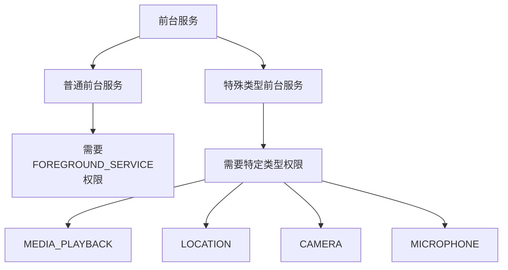

# 7.1.5 晨雾中的新规则

清晨的雾气像轻纱一样笼罩在湖面上，第一缕阳光穿透薄雾，在湖面上洒下无数金色的光斑。露营编程旅团的姑娘们已经起床，正在湖边洗漱。

洛芙一边刷牙，一边想着昨晚的音乐App：“黛琳姐姐，我发现我的音乐App在不同的手机上表现不一样。有些手机上后台播放没问题，有些就总是被杀掉。这是怎么回事？”

黛琳正在整理帐篷，她抬起头来：“这很可能是因为Android版本不同导致的。Android对前台服务的限制是越来越严格的。”

“越来越严格？”伊莎泡泡嘴，好奇地问。

“对，”黛琳点点头，“Google每年都在加强对后台服务的限制，以节省电量。所以我们今天就来说说这些变化。”

## 7.1.5.1 Android 8.0 (Oreo) 的变化

“最先开始大改的是Android 8.0，也就是Oreo版本。”黛琳找了一块平整的石头坐下，“在那之前，前台服务很简单，调用`startForeground()`就行。”

“那之后呢？”洛FR问。

“之后你需要创建通知渠道，”黛琳说道，“你们还记得昨天学的吗？”

“记得！”伊莎点点头，“要不然系统会崩溃。”

“对，”黛琳说道，“Android 8.0要求所有通知都必须属于某个通知渠道。这就是为什么我们要在`onCreate()`或`onStartCommand()`的一开始就创建渠道。”

```kotlin
// Android 8.0+ 必须创建通知渠道
if (Build.VERSION.SDK_INT >= Build.VERSION_CODES.O) {
    val channel = NotificationChannel(
        CHANNEL_ID,
        "服务通知",
        NotificationManager.IMPORTANCE_LOW
    ).apply {
        description = "后台服务通知"
    }
    
    val manager = getSystemService(NotificationManager::class.java)
    manager.createNotificationChannel(channel)
}
```

“这个变化看起来是小，但实际上影响很大，”黛琳补充道，“很多老应用如果不更新适配，一升级到Android 8.0就会崩溃。”

## 7.1.5.2 Android 9 (Pie) 的变化

“Android 9又有什么新花样？”希尔整理着她的笔记本电脑，头也不抬地问。

“Android 9增加了一个新权限，”黛琳说道，“`FOREGROUND_SERVICE`权限。”

她在地上画了个权限声明：

```xml
<!-- Android 9+ 必须声明这个权限 -->
<uses-permission android:name="android.permission.FOREGROUND_SERVICE" />
```

“如果没声明这个权限就启动前台服务，”黛琳说道，“系统会直接抛出`SecurityException`，应用就崩溃了。”

“那在Android 9上怎么整？”洛FR问。

“很简单，在Manifest里声明权限就行，”黛琳说道，“但是要注意，这个权限只是'我要用前台服务'的声明，具体服务类型还需要额外权限。”

## 7.1.5.3 Android 10 (Q) 的变化

“Android 10呢？”伊莎问，“我听说这个版本管得更严？”

“确实如此，”黛琳表情变得认真起来，“Android 10对后台位置访问限制更严格了。如果你想用前台服务来获取位置信息，需要额外申请`ACCESS_BACKGROUND_LOCATION`权限。”

```kotlin
// Android 10+ 获取后台位置需要的权限
// 1. 首先要有前台位置权限
<uses-permission android:name="android.permission.ACCESS_FINE_LOCATION" />
<uses-permission android:name="android.permission.ACCESS_COARSE_LOCATION" />

// 2. 还需要后台位置权限
<uses-permission android:name="android.permission.ACCESS_BACKGROUND_LOCATION" />
```

“而且，”黛琳强调道，“这个权限不能直接申请。你必须先获得前台位置权限，然后才能弹窗申请后台位置权限。”

洛FR吐了吐舌头：“这么复杂？”

“没办法，”黛琳说道，“Google是为了保护用户隐私。前台服务获取位置还好说，如果是后台一直获取，那确实挺吓人的。”

## 7.1.5.4 Android 12 (S) 的变化

“那Android 12呢？我听说变化更大？”希尔终于抬起头来。

“Android 12的变化确实是最大的，”黛琳说道，“它把前台服务分成了两种类型。”

她在地上画了一个表格：



“Android 12引入了'特殊类型前台服务'的概念，”黛琳解释道，“如果你要播放音乐，需要`FOREGROUND_SERVICE_MEDIA_PLAYBACK`权限；要用定位，需要`FOREGROUND_SERVICE_LOCATION`权限；要用摄像头或麦克风，也需要对应的权限。”

洛FR问：“那如果我不声明这些特定类型权限会怎样？”

“会崩溃，”黛琳严肃地说，“`SecurityException`，直接crash。”

```xml
<!-- Android 12+ 需要特定类型权限 -->
<uses-permission android:name="android.permission.FOREGROUND_SERVICE" />
<uses-permission android:name="android.permission.FOREGROUND_SERVICE_MEDIA_PLAYBACK" />
<uses-permission android:name="android.permission.FOREGROUND_SERVICE_LOCATION" />
<uses-permission android:name="android.permission.FOREGROUND_SERVICE_CAMERA" />
<uses-permission android:name="android.permission.FOREGROUND_SERVICE_MICROPHONE" />
```

## 7.1.5.5 Android 13 的变化

“还有Android 13呢？”伊莎问。

“Android 13又加了一层，”黛琳说道，“如果你用的是`MICROPHONE`或`CAMERA`类型的前台服务，还需要在前台服务启动时动态检查权限。”

```kotlin
// Android 13+ 检查麦克风/摄像头权限
override fun onStartCommand(...): Int {
    if (Build.VERSION.SDK_INT >= Build.VERSION_CODES.TIRAMISU) {
        // 如果要用麦克风，先检查权限
        if (serviceType == ServiceType.MICROPHONE) {
            if (checkSelfPermission(Manifest.permission.RECORD_AUDIO) 
                != PackageManager.PERMISSION_GRANTED) {
                // 没有权限，不能启动
                stopSelf()
                return START_NOT_STICKY
            }
        }
        
        // 如果要用摄像头，也检查权限
        if (serviceType == ServiceType.CAMERA) {
            if (checkSelfPermission(Manifest.permission.CAMERA) 
                != PackageManager.PERMISSION_GRANTED) {
                stopSelf()
                return START_NOT_STICKY
            }
        }
    }
    
    startForeground(NOTIFICATION_ID, notification)
    return START_STICKY
}
```

“总之，”黛琳总结道，“Google的思路就是：前台服务虽然强大，但也会影响用户隐私和电量，所以要层层把关。”

## 7.1.5.6 兼容处理

希尔问：“那我们写代码的时候，岂不是要判断一堆版本？”

“对，所以需要一个工具类来处理兼容，”黛琳说道。

```kotlin
// 兼容性工具类
object ForegroundServiceHelper {
    
    // 检查是否能启动前台服务
    fun canStartForegroundService(context: Context, serviceType: ServiceType): Boolean {
        return when {
            // Android 13+ 需要检查特定权限
            Build.VERSION.SDK_INT >= Build.VERSION_CODES.TIRAMISU -> {
                when (serviceType) {
                    ServiceType.MICROPHONE -> {
                        context.checkSelfPermission(Manifest.permission.RECORD_AUDIO) == 
                            PackageManager.PERMISSION_GRANTED
                    }
                    ServiceType.CAMERA -> {
                        context.checkSelfPermission(Manifest.permission.CAMERA) == 
                            PackageManager.PERMISSION_GRANTED
                    }
                    else -> true
                }
            }
            // Android 12+ 需要特定类型权限
            Build.VERSION.SDK_INT >= Build.VERSION_CODES.S -> {
                checkPermission(context, serviceType)
            }
            // Android 9+ 只需要基本权限
            Build.VERSION.SDK_INT >= Build.VERSION_CODES.P -> {
                context.checkSelfPermission(Manifest.permission.FOREGROUND_SERVICE) ==
                    PackageManager.PERMISSION_GRANTED
            }
            // Android 8.0 以下不需要权限
            else -> true
        }
    }
    
    private fun checkPermission(context: Context, serviceType: ServiceType): Boolean {
        val permission = when (serviceType) {
            ServiceType.MEDIA_PLAYBACK -> "android.permission.FOREGROUND_SERVICE_MEDIA_PLAYBACK"
            ServiceType.LOCATION -> "android.permission.FOREGROUND_SERVICE_LOCATION"
            ServiceType.CAMERA -> "android.permission.FOREGROUND_SERVICE_CAMERA"
            ServiceType.MICROPHONE -> "android.permission.FOREGROUND_SERVICE_MICROPHONE"
            else -> null
        }
        
        return if (permission != null) {
            context.checkSelfPermission(permission) == PackageManager.PERMISSION_GRANTED
        } else {
            context.checkSelfPermission(Manifest.permission.FOREGROUND_SERVICE) ==
                PackageManager.PERMISSION_GRANTED
        }
    }
    
    enum class ServiceType {
        GENERAL, MEDIA_PLAYBACK, LOCATION, CAMERA, MICROPHONE
    }
}
```

“你们看，”黛琳指着代码说道，“这样一个工具类就能把所有版本判断封装起来，用起来就简单多了。”

---

## 7.1.5.7 专业技术总结

本章我们学习了Android各版本对前台服务的变化。

**核心要点：**

1. **Android 8.0** - 必须创建通知渠道
2. **Android 9** - 需要`FOREGROUND_SERVICE`权限
3. **Android 10** - 后台位置需要额外`ACCESS_BACKGROUND_LOCATION`权限
4. **Android 12** - 引入特殊类型前台服务，需要特定权限（MEDIA_PLAYBACK、LOCATION等）
5. **Android 13** - MICROPHONE和CAMERA类型需要动态检查权限

**版本兼容策略：**

| 版本 | 权限要求 | 通知渠道 |
|------|----------|----------|
| < 8.0 | 无 | 不需要 |
| 8.0-8.9 | FOREGROUND_SERVICE | 需要 |
| 9-11 | FOREGROUND_SERVICE | 需要 |
| 12-12L | 特定类型权限 | 需要 |
| 13+ | 特定类型+动态检查 | 需要 |

---

> **学习建议**
> 
> 1. 阅读官方文档了解各版本的详细变化
> 2. 创建一个Demo，测试在不同版本上的行为
> 3. 实践版本兼容处理，编写工具类
> 4. 思考如何优雅地处理权限申请
> 5. 下一章我们将学习如何在Manifest中声明前台服务

---

## 洛芙的小小日记本

> 原来前台服务有这么多历史变化！从Android 8开始每年都在加规则，权限越来越多。不过仔细想想，Google也是为了用户好——谁也不想被后台偷偷录音或定位呀。早晨的湖面雾气散啦，阳光好美呀🌅📱
