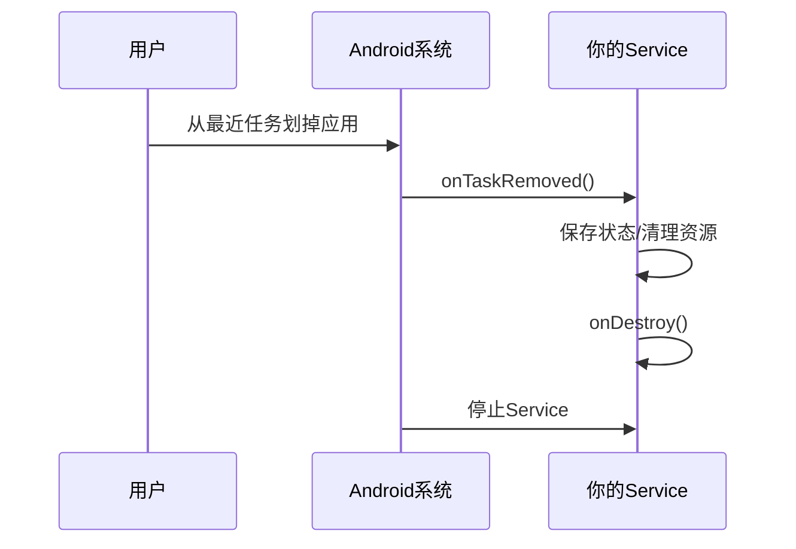
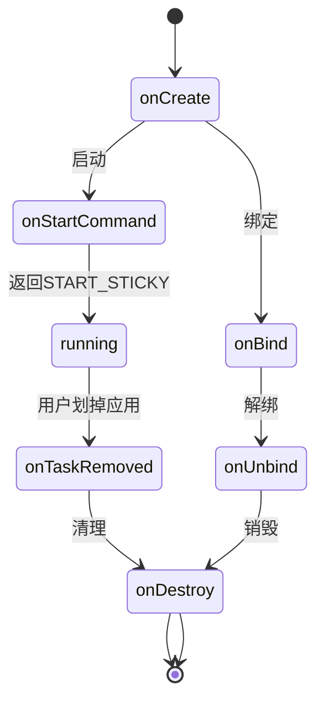

# 7.1.7 溪水旁的告别

午后的阳光懒懒地洒在小溪边，水面波光粼粼。露营编程旅团的姑娘们坐在溪边的大石头上，洛FR正用脚尖轻轻拨弄着溪水。

“黛琳姐姐，”洛FR突然想到一个问题，“如果用户直接从最近任务列表里把我的应用划掉，那Service会怎么样？”

黛琳正在看一本技术书，听到这个问题，她抬起头来：“这个问题问得好！用户从最近任务划掉应用时，Android会有一系列回调，我们就来说说这个。”

## 7.1.7.1 用户停止应用时发生了什么

“你们想象一下，”黛琳比喻道，“用户从最近任务划掉应用，就像是一只手把正在运行的播放器'强行关机'。”

希尔放下笔记本：“那Service会直接被杀掉吗？”

“会的，”黛琳点点头，“但是会先通知你一声，给你一个机会做'告别'。”



“看到了吗？”黛琳指着图说道，“在Service真正停止之前，会先调用`onTaskRemoved()`方法，让你有机会做最后的处理。”

## 7.1.7.2 onTaskRemoved的用法

“那具体怎么做呢？”洛FR问。

“在`onTaskRemoved()`里，你可以保存当前的状态，”黛琳说道，“比如播放进度、设置偏好等等。”

```kotlin
class MusicService : Service() {
    
    private var mediaPlayer: MediaPlayer? = null
    private var currentPosition: Int = 0
    private var currentSongId: Long = -1
    
    override fun onCreate() {
        super.onCreate()
        mediaPlayer = MediaPlayer()
    }
    
    // 当用户从最近任务移除应用时调用
    override fun onTaskRemoved(rootIntent: Intent?) {
        super.onTaskRemoved(rootIntent)
        
        // 保存当前播放状态
        savePlaybackState()
        
        // 保存到SharedPreferences
        val prefs = getSharedPreferences("music_state", MODE_PRIVATE)
        prefs.edit().apply {
            putInt("position", currentPosition)
            putLong("song_id", currentSongId)
            putBoolean("was_playing", mediaPlayer?.isPlaying == true)
            apply()
        }
        
        // 可以在这里决定是否继续运行
        if (shouldContinueInBackground()) {
            // 如果需要继续，可以提高优先级或做其他处理
            // 但在Android 8.0+这样可能比较困难
        }
    }
    
    private fun savePlaybackState() {
        // 获取当前位置
        mediaPlayer?.let {
            if (it.isPlaying) {
                currentPosition = it.currentPosition
            }
        }
    }
    
    private fun shouldContinueInBackground(): Boolean {
        // 判断是否需要在后台继续播放
        // 比如用户设置了"后台播放"选项
        val prefs = getSharedPreferences("settings", MODE_PRIVATE)
        return prefs.getBoolean("background_play", false)
    }
    
    override fun onBind(intent: Intent?): IBinder? = null
    
    override fun onDestroy() {
        super.onDestroy()
        mediaPlayer?.release()
    }
}
```

“你们看，”黛琳重点强调道，“关键就是保存状态。用户下次打开应用时，就能从上次停止的地方继续播放。”

## 7.1.7.3 恢复播放状态

“保存好了，那怎么恢复呢？”伊莎问。

“下次启动Service或者Activity的时候读取保存的状态就行，”黛琳说道。

```kotlin
class MusicService : Service() {
    
    override fun onCreate() {
        super.onCreate()
        // 恢复之前保存的状态
        restorePlaybackState()
    }
    
    private fun restorePlaybackState() {
        val prefs = getSharedPreferences("music_state", MODE_PRIVATE)
        
        val wasPlaying = prefs.getBoolean("was_playing", false)
        val savedPosition = prefs.getInt("position", 0)
        val savedSongId = prefs.getLong("song_id", -1)
        
        if (savedSongId != -1L) {
            // 恢复歌曲
            loadSong(savedSongId)
            
            // 恢复位置
            mediaPlayer?.seekTo(savedPosition)
            
            // 恢复播放状态
            if (wasPlaying) {
                mediaPlayer?.start()
            }
            
            // 清除保存的状态（可选）
            prefs.edit().clear().apply()
        }
    }
    
    private fun loadSong(songId: Long) {
        // 实现加载歌曲的逻辑
    }
}
```

“恢复的时机很重要，”黛琳补充道，“可以在`onCreate()`里恢复，也可以在收到特定Intent时恢复，看你的需求。”

## 7.1.7.4 注意事项与反模式

洛FR突然想起什么：“黛琳姐姐，我之前见过有人在里面做耗时操作。”

“对，这又是一个常见的坑，”黛琳严肃地说。

```
// 反模式：在onTaskRemoved里做耗时操作
override fun onTaskRemoved(rootIntent: Intent?) {
    super.onTaskRemoved(rootIntent)
    
    // 错误！这是主线程，可能会ANR
    saveToDatabase()
    uploadToServer()
}
```

“绝对不能在`onTaskRemoved()`里做耗时操作！”黛琳强调道，“这个方法在主线程执行，做太久会触发ANR（应用无响应）。”

```kotlin
// 正确做法：使用WorkManager
override fun onTaskRemoved(rootIntent: Intent?) {
    super.onTaskRemoved(rootIntent)
    
    // 创建一个延迟的任务，在Service结束后执行
    val workRequest = OneTimeWorkRequestBuilder<SaveStateWorker>()
        .setInputData(workDataOf(
            "position" to currentPosition,
            "song_id" to currentSongId
        ))
        .build()
    
    WorkManager.getInstance(applicationContext)
        .enqueue(workRequest)
}

// WorkManager Worker
class SaveStateWorker(
    context: Context,
    params: WorkerParameters
) : CoroutineWorker(context, params) {
    
    override suspend fun doWork(): Result {
        val position = inputData.getInt("position", 0)
        val songId = inputData.getLong("song_id", -1)
        
        // 在这里做耗时操作，比如保存到数据库
        saveToDatabase(position, songId)
        
        return Result.success()
    }
}
```

“看到了吗？”黛琳说道，“用WorkManager就可以把耗时操作放到后台，不会阻塞主线程。”

## 7.1.7.5 完整的生命周期

希尔问：“那完整的生命周期是怎么样的？”

黛琳画了一个完整的图：



“你们看，”黛琳指着图解释道，“`onTaskRemoved()`只会在用户从最近任务移除应用时调用。如果你是调用`stopSelf()`或`stopService()`，是不会触发这个方法的。”

---

## 7.1.7.6 专业技术总结

本章我们学习了如何处理用户发起的应用停止。

**核心要点：**

1. **用户划掉应用会触发onTaskRemoved()** - 这是最后的保存机会
2. **保存状态到SharedPreferences** - 下次启动时恢复
3. **不要在onTaskRemoved()做耗时操作** - 使用WorkManager
4. **区分不同的停止方式** - onTaskRemoved vs stopSelf vs stopService
5. **onTaskRemoved运行在主线程** - 必须快速返回

**生命周期顺序：**

```
onCreate() → onStartCommand() → [running]
                    ↓
           onTaskRemoved() [用户划掉]
                    ↓
                onDestroy()
```

---

> **学习建议**
> 
> 1. 实现一个保存/恢复播放进度的Demo
> 2. 测试onTaskRemoved在不同停止方式下的调用情况
> 3. 使用WorkManager处理耗时保存操作
> 4. 思考如何给用户更好的体验——比如提示"已保存播放进度"
> 5. 下一章我们将学习如何启动前台服务

---

## 洛芙的小小日记本

> 原来用户把应用划掉时还有这么多讲究！要在onTaskRemoved里保存状态，而且不能做耗时操作。溪水边的下午好惬意呀，冰冰凉凉的💧📱
