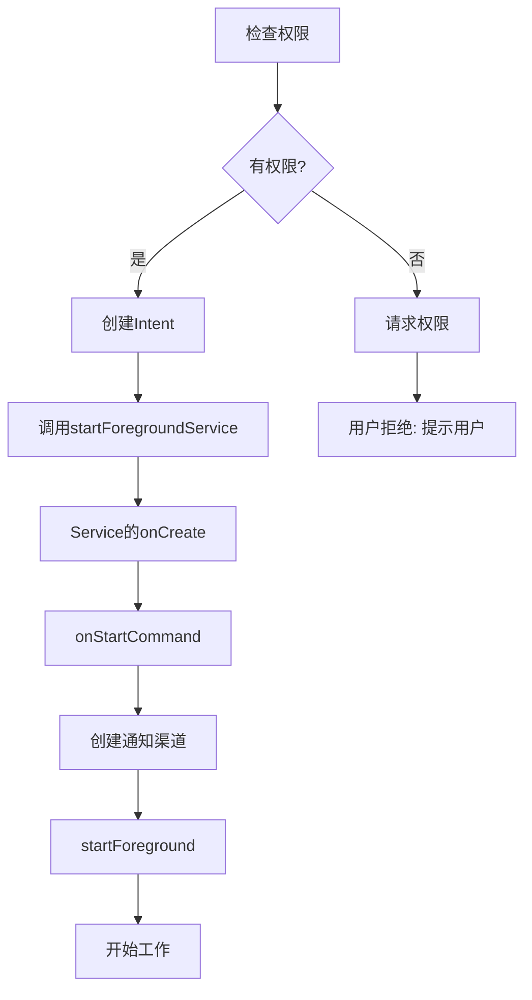

# 7.1.8 篝火旁的启动仪式

傍晚的天空变成了深蓝色，第一批星星开始在头顶闪烁。露营编程旅团的姑娘们围坐在篝火旁，希尔自告奋勇要演示如何启动前台服务。

“启动前台服务其实很简单，”希尔说道，“但有几步必须要注意。”

## 7.1.8.1 两种启动方式

“在Android中，启动前台服务有两种方式，”希尔扳着手指说道。

```kotlin
// 方式一：startForegroundService（Android 8.0+）
val intent = Intent(this, MusicService::class.java)
startForegroundService(intent)

// 方式二：startService（适用于所有版本）
val intent = Intent(this, MusicService::class.java)
startService(intent)
```

“有什么区别呢？”洛FR问。

“区别在于，”希尔解释道，“`startForegroundService()`会在Service启动后弹一个系统提示，告诉用户'有个应用在后台启动了一个服务'。而`startService()`就不会有这个提示。”

## 7.1.8.2 完整的启动流程

“完整的流程是这样的，”希尔在地上画了起来。



“你们看，”希尔指着图解释道，“第一步永远是检查权限。没有权限的话，后面的都白搭。”

## 7.1.8.3 完整的代码示例

“那具体的代码怎么写？”伊莎问。

希尔打开了她的笔记本电脑：

```kotlin
class MainActivity : AppCompatActivity() {
    
    companion object {
        private const val REQUEST_CODE = 1001
    }
    
    // 检查并启动服务
    fun startMusicService() {
        // 1. 检查权限
        if (!checkPermission()) {
            // 没有权限，先请求
            requestPermission()
            return
        }
        
        // 2. 创建Intent
        val intent = Intent(this, MusicService::class.java).apply {
            action = MusicService.ACTION_START
            putExtra("song_id", currentSongId)
        }
        
        // 3. 启动前台服务
        if (Build.VERSION.SDK_INT >= Build.VERSION_CODES.O) {
            startForegroundService(intent)
        } else {
            startService(intent)
        }
    }
    
    private fun checkPermission(): Boolean {
        return if (Build.VERSION.SDK_INT >= Build.VERSION_CODES.TIRAMISU) {
            checkSelfPermission(Manifest.permission.FOREGROUND_SERVICE_MEDIA_PLAYBACK) ==
                PackageManager.PERMISSION_GRANTED
        } else if (Build.VERSION.SDK_INT >= Build.VERSION_CODES.Q) {
            checkSelfPermission(Manifest.permission.FOREGROUND_SERVICE) ==
                PackageManager.PERMISSION_GRANTED
        } else {
            true
        }
    }
    
    private fun requestPermission() {
        val permissions = if (Build.VERSION.SDK_INT >= Build.VERSION_CODES.TIRAMISU) {
            arrayOf(Manifest.permission.FOREGROUND_SERVICE_MEDIA_PLAYBACK)
        } else if (Build.VERSION.SDK_INT >= Build.VERSION_CODES.Q) {
            arrayOf(Manifest.permission.FOREGROUND_SERVICE)
        } else {
            return
        }
        
        requestPermissions(permissions, REQUEST_CODE)
    }
    
    override fun onRequestPermissionsResult(...) {
        // 处理权限结果
        if (grantResults.isNotEmpty() && 
            grantResults[0] == PackageManager.PERMISSION_GRANTED) {
            // 用户授权了，启动服务
            startMusicService()
        } else {
            Toast.makeText(this, "需要权限才能后台播放", Toast.LENGTH_SHORT).show()
        }
    }
}
```

## 7.1.8.4 Service端的处理

“Service那边也要做相应的处理，”希尔继续说道。

```kotlin
class MusicService : Service() {
    
    companion object {
        const val ACTION_START = "com.example.action.START"
        const val ACTION_STOP = "com.example.action.STOP"
        const val NOTIFICATION_ID = 1
        const val CHANNEL_ID = "music_playback"
    }
    
    override fun onCreate() {
        super.onCreate()
        createNotificationChannel()
    }
    
    override fun onStartCommand(intent: Intent?, flags: Int, startId: Int): Int {
        
        when (intent?.action) {
            ACTION_START -> {
                // 启动前台服务
                val songId = intent.getLongExtra("song_id", -1)
                startForeground(songId)
            }
            ACTION_STOP -> {
                // 停止服务
                stopForeground(STOP_FOREGROUND_REMOVE)
                stopSelf()
            }
        }
        
        return START_STICKY
    }
    
    private fun startForeground(songId: Long) {
        // 构建通知
        val notification = buildNotification(songId)
        
        // 调用startForeground
        startForeground(NOTIFICATION_ID, notification)
        
        // 开始播放音乐
        playMusic(songId)
    }
    
    private fun buildNotification(songId: Long): Notification {
        // 创建通知
        val intent = Intent(this, MainActivity::class.java)
        val pendingIntent = PendingIntent.getActivity(
            this, 0, intent,
            PendingIntent.FLAG_UPDATE_CURRENT or PendingIntent.FLAG_IMMUTABLE
        )
        
        // 停止按钮
        val stopIntent = Intent(this, MusicService::class.java).apply {
            action = ACTION_STOP
        }
        val stopPendingIntent = PendingIntent.getService(
            this, 0, stopIntent,
            PendingIntent.FLAG_UPDATE_CURRENT or PendingIntent.FLAG_IMMUTABLE
        )
        
        return NotificationCompat.Builder(this, CHANNEL_ID)
            .setContentTitle("正在播放")
            .setContentText(getSongTitle(songId))
            .setSmallIcon(R.drawable.ic_music)
            .setContentIntent(pendingIntent)
            .addAction(R.drawable.ic_stop, "停止", stopPendingIntent)
            .setOngoing(true)
            .build()
    }
    
    private fun getSongTitle(songId: Long): String {
        // 获取歌曲标题
        return "歌曲 #$songId"
    }
    
    private fun createNotificationChannel() {
        if (Build.VERSION.SDK_INT >= Build.VERSION_CODES.O) {
            val channel = NotificationChannel(
                CHANNEL_ID,
                "音乐播放",
                NotificationManager.IMPORTANCE_LOW
            ).apply {
                description = "显示音乐播放状态"
                setShowBadge(false)
            }
            
            val manager = getSystemService(NotificationManager::class.java)
            manager.createNotificationChannel(channel)
        }
    }
    
    private fun playMusic(songId: Long) {
        // 播放音乐逻辑
    }
    
    override fun onBind(intent: Intent?): IBinder? = null
    
    override fun onDestroy() {
        super.onDestroy()
        // 清理资源
    }
}
```

“你们看，”希尔重点强调道，“关键就是在`onStartCommand()`里创建通知并调用`startForeground()`。这个顺序很重要，必须先调用`startForeground()`，否则Service会被系统杀掉。”

## 7.1.8.5 反模式

洛FR问：“有什么常见的错误吗？”

“有！”希尔说道，“最常见的错误就是启动服务后忘记调用`startForeground()`。”

```
// 反模式：启动了服务但没调用startForeground
override fun onStartCommand(intent: Intent?, flags: Int, startId: Int): Int {
    // 错误！忘记了startForeground
    doSomeWork()
    
    return START_STICKY
}
```

“如果超过5秒还没调用`startForeground()`，”希尔严肃地说，“系统会认为这个服务有问题，直接把它杀掉。”

```kotlin
// 正确做法
override fun onStartCommand(intent: Intent?, flags: Int, startId: Int): Int {
    // 立即启动前台服务
    startForeground(NOTIFICATION_ID, buildNotification())
    
    // 然后再开始工作
    doSomeWork()
    
    return START_STICKY
}
```

---

## 7.1.8.6 专业技术总结

本章我们学习了如何启动前台服务。

**核心要点：**

1. **使用startForegroundService()或startService()** - 前者会有系统提示
2. **先检查权限** - 没有权限要先请求
3. **在onStartCommand中调用startForeground()** - 必须在5秒内调用
4. **创建通知渠道** - Android 8.0+必须
5. **构建通知** - 包含必要的按钮和交互
6. **返回START_STICKY** - 让Service被杀掉后能重启

**启动流程：**

```
MainActivity: 检查权限 → 创建Intent → startForegroundService()
    ↓
MusicService: onCreate → onStartCommand → startForeground → 开始工作
```

---

> **学习建议**
> 
> 1. 创建一个完整的启动前台服务Demo
> 2. 测试5秒内不调用startForeground的后果
> 3. 实现通知的交互（播放/暂停/停止按钮）
> 4. 思考如何处理权限被拒绝的情况
> 5. 下一章我们将学习后台启动前台服务的限制

---

## 洛芙的小小日记本

> 启动前台服务真是个"仪式感"满满的过程！要先检查权限，然后创建通知，最后调用startForeground。5秒内必须调用的规则好严格呀。不过有星星的夜晚，围坐篝火旁学习编程，真是太浪漫啦⭐🔥📱
