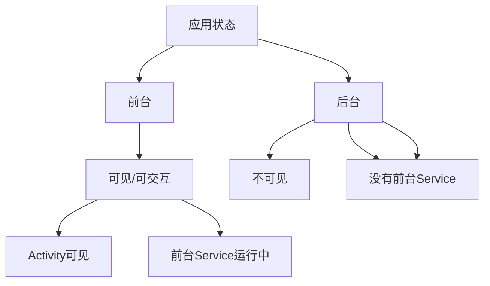

# 7.1.9 深夜的限制

夜深了，姑娘们躺在温暖的睡袋里，只有一盏小灯在帐篷里投下柔和的光。

“黛琳姐姐，”洛FR突然问道，“我之前看到一个问题，说是什么'不能从后台启动前台服务'，这是什么意思？”

黛琳打了个哈欠：“这个问题很重要，咱们今天就来说说。”

## 7.1.9.1 什么是"后台启动"

“在说限制之前，我们先要弄清楚什么是'后台'，”黛琳声说道。

“简单来说，”她继续说道，“当你的应用不在前台时，就是后台。用户在刷其他App，或者在主屏幕，都是后台。”



“在Android 8.0之前，”黛琳回忆道，“你可以在任何地方调用`startForegroundService()`。但之后就不行了。”

## 7.1.9.2 Android 8.0的限制

“Android 8.0（Oreo）开始，”黛琳说道，“如果你的应用在后台，你就不能启动前台服务了。”

洛FR问：“为什么？”

“为了节省电量，保护用户体验，”黛琳解释道，“你想啊，如果每个App都能在后台随便启动前台服务，那手机的电很快就会用完，而且通知栏会乱成一团。”

“那在后台怎么启动前台服务？”伊莎问。

“答案是：不能直接启动，”黛琳说道，“但是有一些例外情况。”

## 7.1.9.3 例外情况

“你们看，这些情况下可以从后台启动前台服务，”黛琳扳着手指说道。

```kotlin
// 可以从后台启动的情况
fun canStartFromBackground(): Boolean {
    // 1. 用户授予了特定权限
    if (checkBackgroundPermission()) return true
    
    // 2. 应用的Activity虽然不可见，但进程还有可见的组件
    if (hasVisibleComponents()) return true
    
    // 3. 收到了一个pending result的回调
    if (hasPendingResult()) return true
    
    // 4. 收到了共享App的广播
    if (isFromSharedApp()) return true
    
    // 5. 用户通过快捷方式/小部件启动
    if (isFromShortcutOrWidget()) return true
    
    return false
}
```

“听起来很复杂对吧？”黛琳笑道，“其实在实际开发中，最常见的情况是：让用户先把你的App打开，然后再启动前台服务。”

## 7.1.9.4 替代方案

“如果真的需要在后台启动服务，怎么办？”洛FR问。

“有几个替代方案，”黛琳说道。

**方案一：使用WorkManager**

```kotlin
// 用WorkManager来调度工作
class MusicDownloadWorker(
    context: Context,
    params: WorkerParameters
) : CoroutineWorker(context, params) {
    
    override suspend fun doWork(): Result {
        // 下载完成后，启动前台服务通知用户
        val intent = Intent(applicationContext, MusicService::class.java).apply {
            action = MusicService.ACTION_SHOW_NOTIFICATION
        }
        
        // WorkManager可以在后台启动前台Service
        startForegroundService(intent)
        
        return Result.success()
    }
}

// 在Activity中调度
val workRequest = OneTimeWorkRequestBuilder<MusicDownloadWorker>()
    .setConstraints(
        Constraints.Builder()
            .setRequiredNetworkType(NetworkType.CONNECTED)
            .build()
    )
    .build()

WorkManager.getInstance(applicationContext).enqueue(workRequest)
```

“WorkManager是一个例外，”黛琳解释道，“它可以在后台启动前台服务。”

**方案二：使用广播接收器**

```kotlin
// 动态注册的广播接收器可以启动前台服务
class MyReceiver : BroadcastReceiver() {
    
    override fun onReceive(context: Context, intent: Intent) {
        // 在广播接收器中可以启动前台服务
        val serviceIntent = Intent(context, MusicService::class.java)
        context.startForegroundService(serviceIntent)
    }
}

// 注册广播接收器
val receiver = MyReceiver()
val filter = IntentFilter("com.example.MY_ACTION")
if (Build.VERSION.SDK_INT >= Build.VERSION_CODES.O) {
    context.registerReceiver(receiver, filter, Context.RECEIVER_NOT_EXPORTED)
} else {
    context.registerReceiver(receiver, filter)
}
```

## 7.1.9.5 Android 12+的新限制

“Android 12又加了新限制，”黛琳严肃地说。

“在Android 12上，如果你要启动一个前台服务，需要声明`foregroundServiceType`，”她继续说道，“而且，如果你的应用在后台启动前台服务，需要在Intent中额外设置一个flag。”

```kotlin
// Android 12+ 后台启动前台服务需要的flag
if (Build.VERSION.SDK_INT >= Build.VERSION_CODES.S) {
    val intent = Intent(this, MusicService::class.java)
    
    // 关键：这个flag表示"我要从后台启动"
    intent.putExtra(Intent.EXTRA_START_ID, 123)
    
    // 检查是否有权限
    if (ContextCompat.checkSelfPermission(this, Manifest.permission.FOREGROUND_SERVICE) 
        == PackageManager.PERMISSION_GRANTED) {
        
        startForegroundService(intent)
    } else {
        // 需要引导用户去前台
        requestForegroundServicePermission()
    }
}
```

“如果没设置这个，”黛琳警告道，“会抛出`IllegalStateException`。”

## 7.1.9.6 最佳实践

“说了这么多限制，那最佳实践是什么？”希尔问。

“最佳实践就是：**尽量不要从后台启动前台服务**，”黛琳总结道。

她列了几个建议：

1. **让用户知道** - 通过普通通知提醒用户，让他们主动打开App
2. **使用WorkManager** - 它是官方推荐的后台任务解决方案
3. **提前启动** - 在用户还在前台时就启动服务
4. **优雅降级** - 如果不能启动前台服务，就显示一个普通通知

```kotlin
// 优雅降级方案
fun tryStartMusicService() {
    if (canStartForegroundService()) {
        // 可以启动，启动前台服务
        startForegroundService(Intent(this, MusicService::class.java))
    } else {
        // 不能启动，显示提示通知
        showFallbackNotification()
        
        // 引导用户打开App
       引导用户打开App()
    }
}

private fun showFallbackNotification() {
    val notification = NotificationCompat.Builder(this, CHANNEL_ID)
        .setContentTitle("点击继续播放")
        .setContentText("点击打开应用以继续后台播放")
        .setSmallIcon(R.drawable.ic_music)
        .setAutoCancel(true)
        .build()
    
    val manager = getSystemService(NotificationManager::class.java)
    manager.notify(NOTIFICATION_ID, notification)
}
```

---

## 7.1.9.7 专业技术总结

本章我们学习了后台启动前台服务的限制。

**核心要点：**

1. **Android 8.0+限制后台启动前台服务** - 为了节省电量和减少通知
2. **WorkManager是例外** - 可以在后台启动前台服务
3. **广播接收器也是例外** - 动态注册的Receiver可以
4. **Android 12+需要额外flag** - `EXTRA_START_ID`
5. **最佳实践是优雅降级** - 不能启动时，给用户替代方案

**限制总结：**

| 版本 | 限制 |
|------|------|
| < 8.0 | 无限制 |
| 8.0-11 | 后台不能启动前台服务（有例外） |
| 12+ | 需要EXTRA_START_ID flag |

---

> **学习建议**
> 
> 1. 深入理解各种"例外"情况的区别
> 2. 实现优雅降级方案
> 3. 测试不同Android版本的行为差异
> 4. 思考如何给用户最好的体验
> 5. 下一章我们将学习前台服务类型

---

## 洛芙的小好记本

> 原来从后台启动前台服务有这么多限制！Google真是操碎了心。不过想想也是，如果每个App都能在后台为所欲为，那手机还能用吗？学会优雅降级很重要——不能启动就引导用户打开App。晚安啦，星星✨📱
