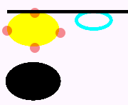
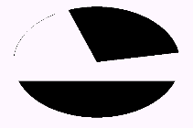
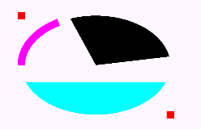
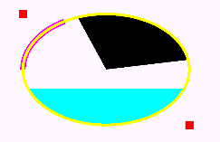

自定义绘制的方式是重写绘制方法，其中最常用的是 `onDraw()` 绘制的关键是 `Canvas` 的使用  
`onDraw()`：负责主体内容绘制
`Canvas` ：绘制工具
- Canvas 的绘制类方法： `drawXXX()` （关键参数：`Paint`） 
- Canvas 的辅助类方法：范围裁切和几何变换 可以使用不同的绘制方法来控制遮盖关系

 1. 画圆角矩形 drawRoundRect(float left, float top, float right, float bottom, float rx, float ry, Paint paint) 

left , top , right , bottom 是四条边的坐标，rx 和 ry 是圆角的横向半径和纵向 半径。
```java
paint.style= Paint.Style.FILL  
canvas.drawRoundRect(400f, 300f, 800f,500f,30f,30f, paint)
```


 2. 画椭圆 drawOval(float left, float top, float right, float bottom, Paint paint) 

椭圆对角线所在的四个点离 **x轴、y轴**的距离，左上右下
```java
canvas.drawOval(300f, 300f, 600f, 500f, paint)

canvas.drawOval(700f, 300f, 900f, 400f, paint)
```


 3. 绘制弧形或扇形 drawArc(float left, float top, float right, float bottom, float startAngle, float sweepAngle, boolean useCenter, Paint paint) 

drawArc() 是使用一个椭圆来描述弧形的。
- left , top , right , bottom 描述的是 这个弧形所在的椭圆；
- startAngle 是弧形的起始角度
	- x 轴的正向，即正右的方向，是 0 度的位置；顺时针为正角度，逆时针为负角度
	- 时钟**3点钟**方向为**0°起始角度**，像量角器，3点钟上面为负角度，3点钟下面为正角度
	- 3点钟到4点钟为顺时针，3点钟到2点钟为逆时针
- sweepAngle 是弧形划 过的角度；
- useCenter 表示是否连接到圆心；如果不连接到圆心，就是弧形，如果 连接到圆心，就是扇形。

 3.1 startAngle
```kotlin
paint.style = Paint.Style.STROKE
canvas.drawArc(300f,300f,600f,600f,15f,100f,true,paint) // 开始角度 15°
```

```kotlin
paint.style = Paint.Style.STROKE
canvas.drawArc(300f,300f,600f,600f, -15f ,100f,true,paint) 
// 开始角度 -15°， 观察画出来的两个角度，一个在3点下，一个在3点上
```

```kotlin
// 更改startAngle，让其往上更大，再顺时针转100°，由于-120+100=-20°，所以终边还是在3点上方的
canvas.drawArc(300f,300f,600f,600f,-120f,100f,true,paint)
```


 3.2 实心扇形
canvas.drawArc(300f,300f,600f,600f,15f,180f,true,paint)

```kotlin
paint.style = Paint.Style.FILL  
canvas.drawArc(300f,300f,600f,500f,-120f,100f,true,paint)  
// 将第二个扇形的 top 下移50f 
canvas.drawArc(300f,350f,600f,500f, 0f , 180f ,true,paint)
```

```kotlin
// 画弧线  
paint.style = Paint.Style.STROKE  
paint.strokeWidth = 5f  
canvas.drawArc(300f,300f,600f,500f,-180f,45f,false,paint) // 0°对面为-180° ，不和圆心相连
```

```kotlin
canvas.drawArc(200f, 100f, 800f, 500f, 20f, 140f, true, paint); // 和圆心相连
```

```kotlin
canvas.drawArc(200f, 100f, 800f, 500f, 20f, 140f, false, paint); // 不和圆心相连
```


 3.3 整体代码
```kotlin
paint.style = Paint.Style.FILL; // 填充模式  
canvas.drawArc(200f, 100f, 800f, 500f, -110f, 100f, true, paint); // 绘制扇  
canvas.drawArc(200f, 100f, 800f, 500f, 20f, 140f, false, paint); // 绘制弧形  
paint.style = Paint.Style.STROKE; // 画线模式  
canvas.drawArc(200f, 100f, 800f, 500f, 180f, 60f, false, paint); // 绘制不封
```

```kotlin
paint.style = Paint.Style.FILL; // 填充模式  
  
// 右上扇形  
canvas.drawArc(200f, 100f, 800f, 500f, -110f, 100f, true, paint); // 绘制扇  
  
// 下半圆  
paint.color= Color.CYAN  
canvas.drawArc(200f, 100f, 800f, 500f, 20f, 140f, false, paint); // 绘制弧形  
  
// 左上弧线  
paint.style = Paint.Style.STROKE; // 画线模式  
paint.color= Color.MAGENTA  
paint.strokeWidth=20f  
canvas.drawArc(200f, 100f, 800f, 500f, 180f, 60f, false, paint); // 绘制不封  
  
// 画完整椭圆  
paint.color= Color.YELLOW  
paint.strokeWidth=10f  
canvas.drawOval(200f, 100f, 800f, 500f, paint)  
  
// 标注椭圆左边起始点和右边终点  
paint.color= Color.RED  
paint.strokeWidth=30f  
canvas. drawPoint(200f, 100f,paint)  
canvas. drawPoint(800f, 500f,paint)
```



综上可知，`canvas.drawArc` 其实就是椭圆的四个方向离x轴和y轴的距离，这四个点确定了一个椭圆的位置和大小。然后再加上**起始点**和**划过的角度**，以及**是否和圆心相连**，确定是弧线还是扇形。

**[官方文档-自定义View组件](https://developer.android.com/develop/ui/views/layout/custom-views/custom-components?hl=zh-cn)**

---
