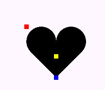

`drawPath(Path path, Paint paint)` 画自定义图形

# 第一类：直接描述路径 

**addXxx() ——添加子图形**

**xxxTo() ——画线（直线或曲线）**


 初始化

当尺寸改变时，初始化`path`，在 `onSizeChange` 初始化。

```kotlin
/**  
 * path 初始化  
 */  
override fun onSizeChanged(w: Int, h: Int, oldw: Int, oldh: Int) {  
    path.reset()  
    path.addCircle(width/2f , height/2f ,100.px, Path.Direction.CCW)  
}
```
 [[补充知识

 FillType 填充类型
 EVEN_ODD

与 `CW` 和 `CCW` 的方向无关（这俩随便填)
在这种规则下，从绘图起点到某一点画一条直线，然后回到起点，形成一个闭合图形。

- 如果该直线穿过图形的`奇数`次，那么该区域被**填充**；
- 如果穿过`偶数`次，那么该区域**不被填充**。

如果需求要画镂空，就用 `EVEN_ODD` ，避免去计算 `WINDING`，麻烦。

```kotlin
path.addCircle(200f, 200f, 100f, Path.Direction.CW)  
path.addCircle(300f, 200f, 100f, Path.Direction.CCW)  
path.fillType = Path.FillType.EVEN_ODD
```


 WINDING

这是默认的填充规则。在这个规则下，同样是通过路径的闭合形成图形，但是穿过图形的方向决定了该区域的填充。
如果方向是`顺时针`，那么该区域被**填充**；如果是`逆时针`，那么该区域**不被填充**。
- CW  - clockwise  顺时针
- CCW - counter-clockwise  逆时针
 异向，按照环绕规则判断
WINDING 规则通过计算从路径的起点开始，**穿越路径时经过的轮廓方向**（顺时针或逆时针）的**总和** 来确定填充区域。

举个例子，考虑一个简单的闭合路径，从起点到终点，再回到起点，形成一个圆形。
- 如果路径是**顺时针**方向的，那么环绕数为 `-1`。
- 如果路径是**逆时针**方向的，那么环绕数为 `1`。
在 WINDING 规则下，这个路径内的点就会被认为是在路径内部，因为环绕数是奇数。
 填充规则
- 当环绕数是**0**时，点被认为在路径**外部**。`不填充`
- 当环绕数**≠0**时，点被认为在路径**内部**。`填充`


**例1：**
```kotlin
path.addCircle(200f, 200f, 100f, Path.Direction.CW)  
path.addCircle(300f, 200f, 100f, Path.Direction.CCW)  
path.fillType = Path.FillType.WINDING
```

左右两边，一个顺时针，一个逆时针，都是奇数，所以在内部，填充。
中间，经过两个轮廓方向，所以逆时针和顺时针相加，为0，在外部，不填充。

**例2：**
```kotlin
path.addCircle(200f, 200f, 100f, Path.Direction.CW)  
path.addCircle(300f, 200f, 100f, Path.Direction.CCW)  
path.addCircle(400f, 200f, 100f, Path.Direction.CW)  
path.fillType = Path.FillType.WINDING
```

分析：
从起点开始，环绕路径经过轮廓的判断：
- 画第一个圆时，顺时针：
		先是只有一个顺时针路线，所以为 [-1] ，在内部，填充
		然后经过了一个逆时针图形（圆2），[1 -1=0]，在外部，所以不填充； 
- 画第二个圆时，逆时针：
		在不相交的部分时，因为没有经过其它图形的方向，所以环绕数为 [1]，在内部，填充；
		和圆1相交，方向相反，为`0`，在外部，不填充；
		和圆2相交，方向相反，为`0`，在外部，不填充；
- 画第三个圆时，顺时针：
		起点开始，没有经过其它圆，环绕数为 [-1]，内部，填充；
		然后经过第二个圆，轮廓方向相加 [1 -1=0]，外部，不填充。


**例3：**
```kotlin
private fun windingContraryDirectionExample(){  
        path.addCircle(200f, 200f, 100f, Path.Direction.CW)  
        path.addCircle(300f, 200f, 100f, Path.Direction.CCW)  
        path.addCircle(250f, 300f, 100f, Path.Direction.CW)  
        path.fillType = Path.FillType.WINDING  
    }
```
分析：
在下面新增了第三个圆。
圆3从起点出发（起点随便在哪，这里选最底下），一开始只有自己的圆路径，顺时针，为-1；

然后路线经过圆2，和圆2 一顺一逆，相加后为0，外部不填充（由于此时路径在圆2内部，没有经过圆1，所以不考虑圆1方向）；

然后到达圆1圆2相交部分，此时有3个路径方向，1 - 1 -1 = -1 ，内部填充；

然后经过圆1，一顺 一顺，-1 - 1 = -2，内部填充。


 同向，点在内部
- 如果两个圆形方向相同，即都是顺时针方向或都是逆时针方向，那么它们的环绕数相加。
- 例如，两个顺时针方向的圆，其环绕数相加后是偶数，表示这两个圆的内部。
- 点在内部即为填充。
```kotlin
path.addCircle(200f, 200f, 100f, Path.Direction.CCW)  
path.addCircle(300f, 200f, 100f, Path.Direction.CCW)  
path.fillType = Path.FillType.WINDING
```

```kotlin
path.addCircle(200f, 200f, 100f, Path.Direction.CW)  
path.addCircle(300f, 200f, 100f, Path.Direction.CW)  
path.fillType = Path.FillType.WINDING
```

 INVERSE_WINDING

与 `winding` 相反
 INVERSE_EVEN_ODD
与 `EVEN_ODD` 相反


---


---
# 示例：画心形

 path.addArc(float left, float top, float right, float bottom, float startAngle,  float sweepAngle)
        
```kotlin
init {  
    path.addArc(200f,200f,400f,400f,-225f,225f)  
}
```


如图所示，四个点表示离 坐标轴 的 距离，`startAngle` 和 `sweepAngle` 与 `canvas.drawArc` 类似。


 path.arcTo(float left, float top, float right, float bottom, float startAngle,  float sweepAngle, boolean forceMoveTo)

将指定的弧作为新轮廓添加到路径中。如果路径的起点与路径当前的最后一点不同，则会自动添加 lineTo() 以连接当前轮廓和弧的起点。但是，如果路径是空的，我们就会调用 moveTo() 来连接弧线的第一个点。

- startAngle - 起始角度（单位：度），弧线从这里开始 
- sweepAngle - 扫描角度（单位：度），顺时针测量，取模 360。 
- forceMoveTo - 如果为 true，则始终以弧线开始新的轮廓线

```kotlin
path.arcTo(400f, 200f, 600f, 400f, -180f, 225f, false);
```


这个方法和 `Canvas.drawArc()` 比起来，少了一个参数 useCenter ，而多了一个 参数 `forceMoveTo` 。 

少了 useCenter ，是因为 `arcTo()` 只用来 **画弧形** 而不画扇形，所以不再需要 useCenter 参数；而多出来的这个 `forceMoveTo` 参数的意思是，绘制是要「**抬一 下笔移动过去**」，还是「**直接拖着笔过去**」，区别在于是否留下移动的**痕迹**。


 path.lineTo(float x, float y)

从 最后一个点 向 `指定点 (x,y)` 添加一条直线。如果此轮廓没有调用 `moveTo()`，则 **第一个点** 会自动设置为 `(0,0)`。

- x - 直线终点的 x 坐标 
- y - 直线终点的 y 坐标

```kotlin
path.arcTo(400f, 200f, 600f, 400f, -180f, 225f, false);  

// 从上面一个弧形的最后一个点 向指定点 画一条直线
path.lineTo(400f, 542f) // 点坐标在蓝色点位置
```


`lineTo(x, y)` 的参数是 **绝对**坐标，
`rLineTo(x, y)` 的参数是相对当前 位置的 **相对**坐标

```kotlin
// 左边
path.addArc(200f,200f,400f,400f,-225f,225f)  
path.lineTo(400f, 542f)
```


 整体代码

```kotlin
private val paint = Paint()  
private val path = Path()

init {  
    path.addArc(200f,200f,400f,400f,-225f,225f)  
    path.arcTo(400f, 200f, 600f, 400f, -180f, 225f, false);  
    path.lineTo(400f, 542f)  
}

override fun onDraw(canvas: Canvas) {  
        super.onDraw(canvas)  
  
//        练习内容：使用 canvas.drawPath() 方法画心形    
  
        canvas.drawPath(path, paint)  // 绘制图形
  
        // 标注椭圆左边起始点和右边终点  
        paint.color = Color.RED  
        paint.strokeWidth = 30f  
        canvas.drawPoint(200f, 200f, paint)  
        paint.color = Color.BLUE  
        canvas.drawPoint(400f, 542f, paint)  
        paint.color = Color.YELLOW  
        canvas.drawPoint(400f, 400f, paint)  
  
    }

```



