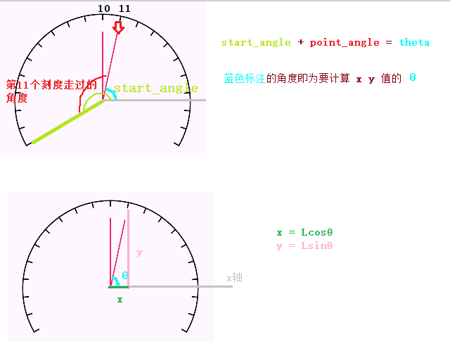
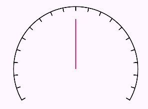

> Note:
> 绘制虚线弧形，不能用 `path.addArc()` + `pathDashEffect` 来画，会画出奇形怪状的图形，要用`canvas.drawArc` 画。

 画刻度弧
> 指定：
> 1. 仪表盘开口角度
> 	a. 根据开口角度，算出起始角度
> 1. 仪表盘半径
> 2. 刻度的长和宽
> 	a. 刻度相当于小长方形
> 	b. 用 `path.addRect`画出小长方形
> 	c. 刻度起始点是弧线的起点
> 	d. `path.addRect(0f, 0f, DASH_WIDTH, DASH_LENGTH, Path.Direction.CW)`
> 4. 多少个刻度间隔


```kotlin
override fun onSizeChanged(w: Int, h: Int, oldw: Int, oldh: Int) {  
    path.reset()  
    path.addArc(width / 2f - RADIUS, height / 2f - RADIUS, width / 2f + RADIUS, height / 2f + RADIUS, startAngle, 360 - OPEN_ANGLE)  
  
    dashPath.addRect(0f, 0f, DASH_WIDTH, DASH_LENGTH, Path.Direction.CW)  
    dashPathEffect = PathDashPathEffect(dashPath, 40f, 0f, PathDashPathEffect.Style.ROTATE)  
}

override fun onDraw(canvas: Canvas) {     
    paint.pathEffect = dashPathEffect  
    canvas.drawPath(path, paint)  
    paint.pathEffect = null  
}
```

 要注意` PathDashPathEffect` 里用的是 `dashPath` , 而不是 `path`，
 因为这个虚线效果是加给 `dashPath` 的。  `path` 是圆弧，不需要虚线效果
 


 画 弧 + 刻度

```kotlin
override fun onDraw(canvas: Canvas) {  
    // 先画弧  
    canvas.drawPath(path, paint)  
      
    // 再用刻度效果画一次弧  
    paint.pathEffect = dashPathEffect  
    canvas.drawPath(path, paint)  
    paint.pathEffect = null  
}
```


 计算刻度间隔 Advance

> val COUNT = 20  // 刻度间隔数

1. 用 `pathMeasure.length` 计算弧长
2. 弧长 除以 刻度数，就是刻度间隔 advance

3. 但是，指定20个刻度间隔，但刻度是从0开始，所以实际上是21个刻度。

修改前：
```kotlin
override fun onSizeChanged(w: Int, h: Int, oldw: Int, oldh: Int) {  
    path.reset()  
    path.addArc(width / 2f - RADIUS, height / 2f - RADIUS, width / 2f + RADIUS, height / 2f + RADIUS, startAngle, 360 - OPEN_ANGLE)  
  
    // 计算弧长  
    pathMeasure.setPath(path, false)  
    // 间隔  
    val advance = pathMeasure.length / COUNT   // 20个刻度，21个刻度间隔
  
    dashPath.addRect(0f, 0f, DASH_WIDTH, DASH_LENGTH, Path.Direction.CW)  
    dashPathEffect = PathDashPathEffect(dashPath, advance, 0f, PathDashPathEffect.Style.ROTATE)  
}
```


实际效果要 20个 刻度间隔。

修改后：
```kotlin
// 去掉一个刻度间隔，再除
val advance = (pathMeasure.length - DASH_WIDTH) / COUNT // 21个刻度，20个刻度间隔
```

用这样先减掉一个刻度宽度后，COUNT可以是任意指定的间隔数，都能达到效果了。


 画指针

> `Math.cos()` :  要使用 `Math.toRadians` 将**角度**转成**弧度**
```kotlin
cos(Math.toRadians(startAngle.toDouble()).toFloat())
```

 坐标值计算

```
x = rcosθ
y = rsinθ

中心点坐标 = ( width/2f , height/2f )

终点横坐标 = 中心点坐标 + x
终点纵坐标 = 中心点坐标 + x

cos sin 具有自动对角度取正负作用，所以直接加上就好，不需要再考虑符号
```

 代码
```kotlin
override fun onDraw(canvas: Canvas) {  
    // ...... 省略之前的代码
  
    paint.color = resources.getColor(R.color.pink, null)  
    // cos sin 要将 角度转弧度  
    canvas.drawLine(width / 2f, height / 2f, width / 2f + (RADIUS *  cos(Math.toRadians(startAngle.toDouble()).toFloat())), height / 2f + (RADIUS * sin(Math.toRadians(startAngle.toDouble()).toFloat())), paint)
}
```


 修改为真实效果
为了实现真实指针效果，要作出如下修改：
1. 指定指针长度
2. 计算指向具体第几个刻度时的终点坐标

```java
// 每个刻度间隔的角度是:
SWEEP_ANGLE / COUNT
```


```kotlin
// 指定刻度indicator 走过的角度：
 indicator * SWEEP_ANGLE / COUNT

//终点坐标角度：
START_ANGLE + indicator * SWEEP_ANGLE / COUNT

// 角度转成弧度
theta = Math.toRadians((START_ANGLE + indicator * SWEEP_ANGLE / COUNT).toDouble()).toFloat()

POINT_LENGTH * cos(theta)  // x值
POINT_LENGTH * cos(theta)  // y值

// 终点坐标
width / 2f + (POINT_LENGTH * cos(theta))   
height / 2f + (POINT_LENGTH * sin(theta))

```



```kotlin
private var indicator = 10 // 自定义要指向第几个刻度
private val POINT_LENGTH = 120f.px
private val START_ANGLE = -180 - (180 - OPEN_ANGLE) / 2  
private val SWEEP_ANGLE = 360 - OPEN_ANGLE
private var theta = 0f // 三角函数角度，即 指针终点坐标计算时，指针与x轴 组成的角度

init{
	theta = Math.toRadians((START_ANGLE + indicator * SWEEP_ANGLE / COUNT).toDouble()).toFloat()
}

override fun onDraw(canvas: Canvas) {  
    // ...... 省略之前的代码
    paint.color = resources.getColor(R.color.pink, null)  
    
    // cos sin 要将 角度转弧度  
    canvas.drawLine(width / 2f, height / 2f, width / 2f + (POINT_LENGTH * cos(theta)), height / 2f + (POINT_LENGTH * sin(theta)), paint)
}
```


