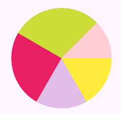
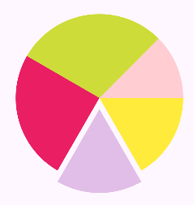
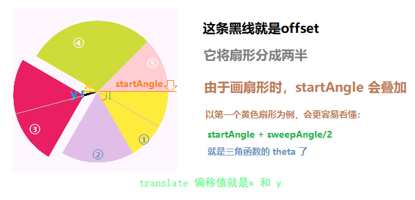

默认顺时针画出来的。
每多画一个扇形，起始角度都要加起前面几个扇形的角度，划过的角度视扇形大小而定。

 画扇形

 直接写法

```kotlin
paint.color = resources.getColor(R.color.light_green, null)  
canvas.drawArc(width / 2f - RADIUS, height / 2f - RADIUS, width / 2f + RADIUS, height / 2f + RADIUS,  
    0f, 60f,  
    true, paint)  
  
paint.color = resources.getColor(R.color.yellow, null)  
canvas.drawArc(width / 2f - RADIUS, height / 2f - RADIUS, width / 2f + RADIUS, height / 2f + RADIUS,  
    60f, 60f,  
    true, paint)  
  
paint.color = resources.getColor(R.color.pink, null)  
canvas.drawArc(width / 2f - RADIUS, height / 2f - RADIUS, width / 2f + RADIUS, height / 2f + RADIUS,  
    120f, 90f,  
    true, paint)  
  
paint.color = resources.getColor(R.color.lime, null)  
canvas.drawArc(width / 2f - RADIUS, height / 2f - RADIUS, width / 2f + RADIUS, height / 2f + RADIUS,  
    210f, 115f,  
    true, paint)  
  
paint.color = resources.getColor(R.color.purple, null)  
canvas.drawArc(width / 2f - RADIUS, height / 2f - RADIUS, width / 2f + RADIUS, height / 2f + RADIUS,  
    325f, 45f,  
    true, paint)
```

 for循环

```kotlin
class PieView(context: Context?) : View(context) {  
    private val paint = Paint(Paint.ANTI_ALIAS_FLAG)  
    private val path = Path()  
    private var colors: IntArray = intArrayOf(R.color.yellow, R.color.purple100, R.color.pink, R.color.lime, R.color.red100)  
    private var angles: FloatArray = floatArrayOf(60f, 60f, 90f, 105f, 45f)  
    private var startAngle = 0f  
    private var sweepAngle = 0f  
  
  
    override fun onDraw(canvas: Canvas) {  
        for ((index, item) in colors.withIndex()) {  
            paint.color = resources.getColor(item, null)  
            sweepAngle = angles[index]  
            canvas.drawArc(width / 2f - RADIUS, height / 2f - RADIUS, width / 2f + RADIUS, height / 2f + RADIUS,  
                startAngle, sweepAngle, true, paint)  
            startAngle += sweepAngle  
        }  
    }  
  
  
}
```



 扇形推出

 要点1. canvas 的保存与恢复
```kotlin
// 在推出一开始一定要执行
 canvas.save()

// 在最后一定要恢复状态
 canvas.restore()

```

 要点2. 开始角度要叠加
```kotlin
startAngle += sweepAngle
```

 要点3. 三角函数角度计算
```kotlin
// 一定要与 startAngle 相加
theta = Math.toRadians((startAngle + sweepAngle / 2).toDouble()).toFloat()

// x, y 值计算
x = offset * cos(theta)
y = offset * sin(theta
```

 要点4. 推出用 canvas.translate
```kotlin
// 要在执行画扇形方法前设置偏移
canvas.translate(offset * cos(theta), offset * sin(theta))
```

 完整代码

```kotlin
class PieView(context: Context?) : View(context) {
    private val paint = Paint(Paint.ANTI_ALIAS_FLAG)
    private val path = Path()
    private var colors: IntArray = intArrayOf(R.color.yellow, R.color.purple100, R.color.pink, R.color.lime, R.color.red100)
    private var angles: FloatArray = floatArrayOf(60f, 60f, 90f, 105f, 45f)
    private var startAngle = 0f
    private var sweepAngle = 0f
    private var offset = 30f.px  // 自定义扇形推出的偏移量,也就是三角形斜边
    private var theta = 0f // 三角形角度, offset 与 x轴的夹角
    private var indicator = 2  // 自定义哪个扇形推出

    override fun onDraw(canvas: Canvas) {
        for ((index, item) in colors.withIndex()) {
            paint.color = resources.getColor(item, null)
            sweepAngle = angles[index]

            if (index == indicator) {
                canvas.save()
                theta = Math.toRadians((startAngle + sweepAngle / 2).toDouble()).toFloat()
                canvas.translate(offset * cos(theta), offset * sin(theta))
                canvas.drawArc(width / 2f - RADIUS, height / 2f - RADIUS, width / 2f + RADIUS, height / 2f + RADIUS,
                    startAngle, sweepAngle, true, paint)
            } else {
                canvas.drawArc(width / 2f - RADIUS, height / 2f - RADIUS, width / 2f + RADIUS, height / 2f + RADIUS,
                    startAngle, sweepAngle, true, paint)
            }

			if (index == indicator) canvas.restore()
			
            startAngle += sweepAngle            
        }


    }
}
```



 总结

饼图 和 [[1.b 仪表盘绘制]]  的计算方式有相似之处，即都是利用三角函数正余弦来计算偏移的x，y值。


