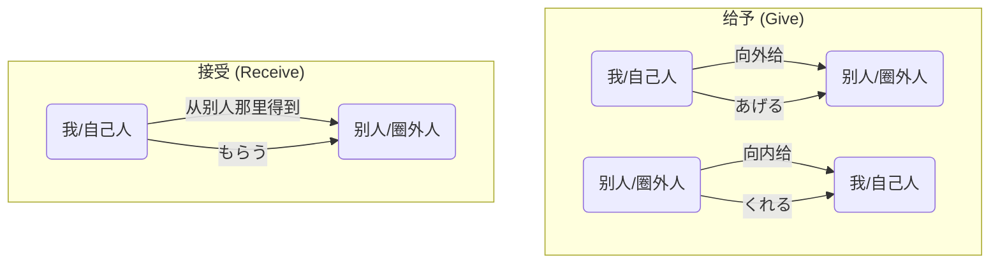

## 第七章：「这份礼物，请收下」—— 物品的给予与接受

箱根的雨，在电车到达时奇迹般地停了。空气中弥漫着雨后草木的清新气息，远山云雾缭绕，别有一番诗意。

入住旅馆后，大家在铺着榻榻米的和室房间里，围坐在一起，准备交换各自带来的小礼物——这是她们出发前就定下的惊喜环节。

小悠最先拿出一个包装精美的布袋，递给凛酱：“凛酱，这是我从家里带来的静冈特产，茶叶。<ruby>私<rt>わたし</rt></ruby>が凛ちゃんに**あげます**。” (我给你。)

凛酱连忙躬身接过，郑重地道谢：“わあ、ありがとうございます！”她看着手中的茶叶，心里暖洋洋的。小悠前辈用了“**あげます**”，这个词凛酱认识，是“给”的意思。

接着，希子从背包里拿出三个小小的御守（护身符），分别递给凛酱、小悠和美穗。“这是我去浅草寺时买的，送给你们。”

小悠开心地接过，对希子说：“わ、かわいい！希子ちゃんが**くれた**の？” (哇，好可爱！是希子你给我的吗？)

凛酱注意到，小悠在这里用的是“**くれた**”，而不是“あげた”。明明都是“给”，为什么会有不同呢？她把这个小小的疑问藏在心里。

轮到凛酱了。她有些紧张地拿出自己准备的礼物——几枚从国内带来的、有着精美刺绣的书签。“这是我妈妈做的书签。小悠前辈，这个给你。”

她学着小悠的样子，想说“我给你”，但迟疑了一下，不知道该用哪个。她试探性地用了刚刚学到的词：“<ruby>私<rt>わたし</rt></ruby>が、<ruby>悠<rt>ゆう</rt></ruby>さんに**あげます**。”

小悠笑着接过去：“ありがとう、凛ちゃん！すごく<ruby>綺麗<rt>きれい</rt></ruby>！<ruby>大切<rt>たいせつ</rt></ruby>にするね。” (谢谢你，凛酱！非常漂亮！我会好好珍惜的。)

凛酱松了口气，看来“**あげます**”用对了。

最后，美穗拿出了三个包装典雅的小盒子。“这是我家附近一家老店的和果子。希望你们喜欢。”

凛酱接过美穗递来的和果子，这次她想换一种说法来表达感谢。她想说“我从美穗前辈那里得到了和果子”。她记得“得到”是“もらいます”。

于是，她对美穗说：“美穗前辈，<ruby>私<rt>わたし</rt></ruby>は<ruby>先輩<rt>せんぱい</rt></ruby>に和菓子を**もらいました**。” (我从前辈那里得到了和果子。)

美穗微笑着点点头：“どういたしまして。” (不客气。)

礼物交换环节在温馨的气氛中结束了。大家一边品尝着美穗带来的和果子，一边欣赏着彼此的礼物。凛酱想着刚刚所说的三个动词——**あげる**、**くれる**、**もらう**——感觉自己仿佛置身于一个有趣的谜题之中。它们都围绕着“给予”和“接受”，却似乎遵循着某种看不见的规则。

“那个……”凛酱终于忍不住开口，“我有点好奇，刚才小悠前辈说希子前辈‘给’你御守的时候，用了‘**くれた**’。而我说‘给’你书签的时候，用了‘**あげます**’。它们有什么不一样吗？”

小悠一听，立刻来了兴致：“啊哈！凛酱，你触碰到了日语里最有人情味、也最需要‘换位思考’的语法了！我们称之为‘授受动词’。”

希子放下了手中的御守，用手指在榻榻米上画了一个圈，代表“自己人”的范围。“很简单，你只要记住一个核心原则：内外有别。”

美穗见状，干脆在笔记本上画出了一张清晰的关系图，展示给大家。

**图1：授受动词的方向性**

“你看这张图，”美穗指着屏幕，“关键在于‘方向’。当动作的方向是‘由内向外’，也就是‘我’或者‘我的家人朋友’给别人的时候，我们就用‘**あげる**’。”

“所以，”她看向凛酱，“你给你认为是‘圈外’的小悠书签，用‘**あげる**’是完全正确的。我给你们和果子，从我的角度说，也是‘**あげます**’。”

“那‘**くれる**’呢？”

“‘**くれる**’的方向正好相反，是‘由外向内’。”小悠解释道，“当别人给我，或者给我的家人时，就要用‘**くれる**’。它自带一种‘别人为我着想、惠及于我’的亲切感。所以刚才我收到希子的礼物，站在‘我’的立场上，自然就用了‘希子ちゃんが**くれた**’。”

凛酱恍然大悟。“我明白了！‘**あげる**’是把东西推出去，‘**くれる**’是把东西拉进来！这个‘内外’是以说话人自己为中心的！”

“完全正确！”希子赞许道，“那‘**もらう**’呢？”

“‘**もらう**’的视角很独特，”美穗说，“它的主语永远是‘接受者’。它强调的是‘我’主动地从别人那里‘领受、获得’。所以刚才凛酱你说‘<ruby>私<rt>わたし</rt></ruby>は<ruby>先輩<rt>せんぱい</rt></ruby>に和菓子を**もらいました**’，主语是你自己，强调你‘得到’了这个行为，也非常完美。”

为了检验凛酱是否真的理解了，希子立刻出了一个场景题。

“听好了。今天是我的生日。凛酱，你送了我一本书。请你分别从‘你’的视角和‘我’的视角，描述‘你给我书’这件事。”

凛酱想了想，回答道：
“从我的视角说，动作是‘由内向外’，所以是：‘<ruby>私<rt>わたし</rt></ruby>が<ruby>希子<rt>きこ</rt></ruby>さんに<ruby>本<rt>ほん</rt></ruby>を**あげました**。’”  
“从希子前辈你的视角说，动作是‘由外向内’，所以是：‘凛ちゃんが<ruby>私<rt>わたし</rt></ruby>に<ruby>本<rt>ほん</rt></ruby>を**くれました**。’”  
“如果用‘得到’的视角，主语是你，那就是：‘<ruby>希子<rt>きこ</rt></ruby>さんは<ruby>私<rt>わたし</rt></ruby>に<ruby>本<rt>ほん</rt></ruby>を**もらいました**。’”

“满分！”希子露出了难得的灿烂笑容。

凛酱感觉自己像打通了一个游戏的关卡，那种豁然开朗的感觉让她兴奋不已。原来，日语的语法里，藏着如此细腻的人际关系和视角转换。每一次选择用哪个词，都像是在无形中表明自己的立场和与对方的距离感。

窗外的雨已经完全停了，一道淡淡的彩虹挂在远方的山间。凛酱觉得，她今天也看到了一道语言里的彩虹。

---

### **核心语法总结：物品的给予与接受**

> 本章核心是日语中最基本也最重要的一组人际关系动词——**授受动词**。它们包括表示“给予”的**`あげる`**和**`くれる`**，以及表示“接受”的**`もらう`**。这组动词的关键在于严格区分动作的“方向性”，即是以说话人为中心的“内外关系”。掌握它们，是理解日本人际交往中距离感和立场表达的第一步。

#### 今日关键词

*   **あげる (ageru)**：给予（由内而外）。表示“我”或“我方的人”给予“别人”。是一个中性的、向外的动作。
*   **くれる (kureru)**：给予（由外而内）。表示“别人”给予“我”或“我方的人”。带有“惠及于我”的亲切感。
*   **もらう (morau)**：接受/得到。主语是“接受者”，强调从别人那里获得物品。
*   **内外关系 (ウチソト)**：是理解授受动词的核心概念。“内（ウチ）”指说话人自己以及家人、同伴等关系亲近的人。“外（ソト）”则指除此以外的其他人。

#### 结构图

**授受动词的视角转换**

| 场景：A送礼物给B | A的视角 (给予者) | B的视角 (接受者) | 第三人称C的视角 |
| :--- | :--- | :--- | :--- |
| **(A是我)** 我 → B | (私は)Bさんにプレゼントを**あげます**。| Bさんは(私に)プレゼントを**もらいます**。| AさんはBさんにプレゼントを**あげます**。 |
| **(B是我)** A → 我 | Aさんが(私に)プレゼントを**くれます**。| (私は)Aさんにプレゼントを**もらいます**。| AさんはBさん(私)にプレゼントを**くれます**。|
| **(A,B都不是我)** A → B | - | - | AさんはBさんにプレゼントを**あげます**。|

*说明：此表格清晰地展示了在不同人物关系下，描述同一件“送礼”事件时，应该使用哪个授受动词。关键在于判断“谁是ウチ，谁是ソト”。*

#### 用法差异与语感

*   **省略主语**：在日语中，当使用`くれる`时，接受者“我”或“我方”通常会被省略，因为`くれる`本身就包含了“给我”的含义。例如，<ruby>田中<rt>たなか</rt></ruby>さんが<ruby>本<rt>ほん</rt></ruby>を**くれました**。 就等于 “田中先生给了我一本书”。
*   **`あげる`的慎用**：对长辈或地位高的人使用`あげる`有时会显得失礼，有“施舍”的意味。此时应用更尊敬的`差し上げる (sashiageru)`（N3/N2语法）。在不确定时，用`もらう`的句型（我从您那里得到…）会更安全。
*   **宠物、植物**：给动物或植物浇水、喂食时，习惯上使用`やる (yaru)`，是`あげる`的通俗版。

#### 反模式与陷阱

1.  **内外不分**：最常见的错误，例如描述“朋友给我礼物”时，错误地使用了: <ruby>友達<rt>ともだち</rt></ruby>がプレゼントを**あげました**。(×)。  
修复：牢记`くれる`的“向心力”，别人给我，永远用`くれる`。

2.  **混淆`に`和`から`**：在使用`もらう`时，表示来源的对象助词是`に`，有时也可以是`から`。但在N4阶段，优先掌握`～に もらう`。    
例如：<ruby>先生<rt>せんせい</rt></ruby>にほめて**もらいました**。 (得到了老师的表扬)。

3.  **对家人使用`くれる`的误解**：当哥哥给弟弟礼物时，如果说话人是这个家庭的一员，他会说：  <ruby>兄<rt>あに</rt></ruby>が<ruby>弟<rt>おとうと</rt></ruby>にプレゼントを**あげました**。  
但如果哥哥是“别人”，弟弟是“我”，那就是：  <ruby>兄<rt>にい</rt></ruby>さんが**くれました**。  
修复：关键看谁是“ウチ”的成员。

#### 推荐练习题目

**基础入门（必做，5 题）**
1.  **选择填空**：<ruby>母<rt>はは</rt></ruby>が<ruby>私<rt>わたし</rt></ruby>にセーターを（______）。(a) あげました (b) くれました (c) もらいました
2.  **选择填空**：<ruby>私<rt>わたし</rt></ruby>は<ruby>弟<rt>おとうと</rt></ruby>の<ruby>誕生日<rt>たんじょうび</rt></ruby>にゲームソフトを（______）。(a) やりました (b) くれました (c) あげました
3.  **选择填空**：<ruby>山田<rt>やまだ</rt></ruby>さんは<ruby>木村<rt>きむら</rt></ruby>さんに<ruby>花<rt>はな</rt></ruby>を（______）。(a) あげました (b) くれました (c) もらいました
4.  **改错**：<ruby>先生<rt>せんせい</rt></ruby>が<ruby>私<rt>わたし</rt></ruby>に<ruby>本<rt>ほん</rt></ruby>をあげました。
5.  **完成句子**：<ruby>昨日<rt>きのう</rt></ruby>、<ruby>友達<rt>ともだち</rt></ruby>に_________________をもらいました。(请根据自己情况填空)

**进阶推荐（3 题）**
1.  **听力辨析**：(听力脚本)「A:<ruby>昨日<rt>きのう</rt></ruby>のパーティー、<ruby>楽<rt>たの</rt></ruby>しかったね。B:<ruby>うん<rt>うん</rt></ruby>、<ruby>田中<rt>たなか</rt></ruby>さん、ワインを<ruby>持<rt>も</rt></ruby>ってきてくれたよ。A:<ruby>本当<rt>ほんとう</rt></ruby>？<ruby>私<rt>わたし</rt></ruby>も<ruby>田中<rt>たなか</rt></ruby>さんにお<ruby>菓子<rt>かし</rt></ruby>をあげたんだ。」 **问题**：是谁给了谁红酒？
2.  **情景对话**：你的日本朋友下周要回国，你想送他一份礼物。你会怎么对他说？（提示：可以询问对方想要什么）
3.  **翻译**：请将“这是铃木先生给我的书”翻译成日语（分别以“给”和“得到”的视角）。

**应试高频（JLPT N4水平，2 题）**
1.  **语法选择**：<ruby>私<rt>わたし</rt></ruby>は<ruby>犬<rt>いぬ</rt></ruby>にえさを（______）のが<ruby>日課<rt>にっか</rt></ruby>です。(a) やる (b) くれる (c) もらう
2.  **句子排序**：＿＿＿　＿＿＿　＿＿＿　＿＿＿くれました。(1. <ruby>作<rt>つく</rt></ruby>って 2. <ruby>姉<rt>あね</rt></ruby>が 3. おいしい 4. ケーキを)

#### 参考答案要点

1.  **基础题1**：选b。妈妈给“我”，方向向内，用`くれる`。
2.  **基础题2**：“我”给弟弟，方向向外，用`あげる`。选项a `やる` 用于动植物或非常亲近的晚辈，这里c更通用。
3.  **基础题3**：选a。山田和木村都是第三方（外），所以是中性的`あげる`。
4.  **基础题4**：应改为 ：<ruby>先生<rt>せんせい</rt></ruby>が<ruby>私<rt>わたし</rt></ruby>に<ruby>本<rt>ほん</rt></ruby>を**くださいました**。（`くれる`的尊敬语，N4了解即可）或从“我”的视角改为 ：<ruby>私<rt>わたし</rt></ruby>は<ruby>先生<rt>せんせい</rt></ruby>に<ruby>本<rt>ほん</rt></ruby>を**いただきました**。（`もらう`的谦让语）。在N4阶段，最简单的改法是:  <ruby>先生<rt>せんせい</rt></ruby>が<ruby>私<rt>わたし</rt></ruby>に<ruby>本<rt>ほん</rt></ruby>を**くれました**。
5.  **基础题5**：(开放答案) 例：<ruby>素敵<rt>すてき</rt></ruby>なプレゼント
6.  **进阶题1**：田中先生给了说话人（B）红酒。
7.  **进阶题3**：(给) これは<ruby>鈴木<rt>すずき</rt></ruby>さんが<ruby>私<rt>わたし</rt></ruby>に**くれた**<ruby>本<rt>ほん</rt></ruby>です。 (得到) この<ruby>本<rt>ほん</rt></ruby>は<ruby>鈴木<rt>すずき</rt></ruby>さんに**もらった**ものです。
8.  **应试题1**：选a。给动物喂食，习惯用`やる`。
9.  **应试题2**：正确顺序为`2-3-4-1`。句子为:  <ruby>姉<rt>あね</rt></ruby>がおいしいケーキを<ruby>作<rt>つく</rt></ruby>ってくれました。 (姐姐为我做了美味的蛋糕)。

### 🍒 凛酱的日语小记

箱根之旅的第一个惊喜是交换礼物！通过这个小小的活动，我终于明白了`あげる`、`くれる`和`もらう`的区别。原来每次“给予”和“接受”，都藏着一个看不见的“方向”。语言真的好神奇，它在无形中就定义了我和你的距离。

> 每一份礼物的传递，都伴随着一次视角的切换。是`あげる`的向外给予，`くれる`的向内关怀，还是`もらう`的主动获取，这三个词，描绘出了人与人之间最细腻的温情地图。