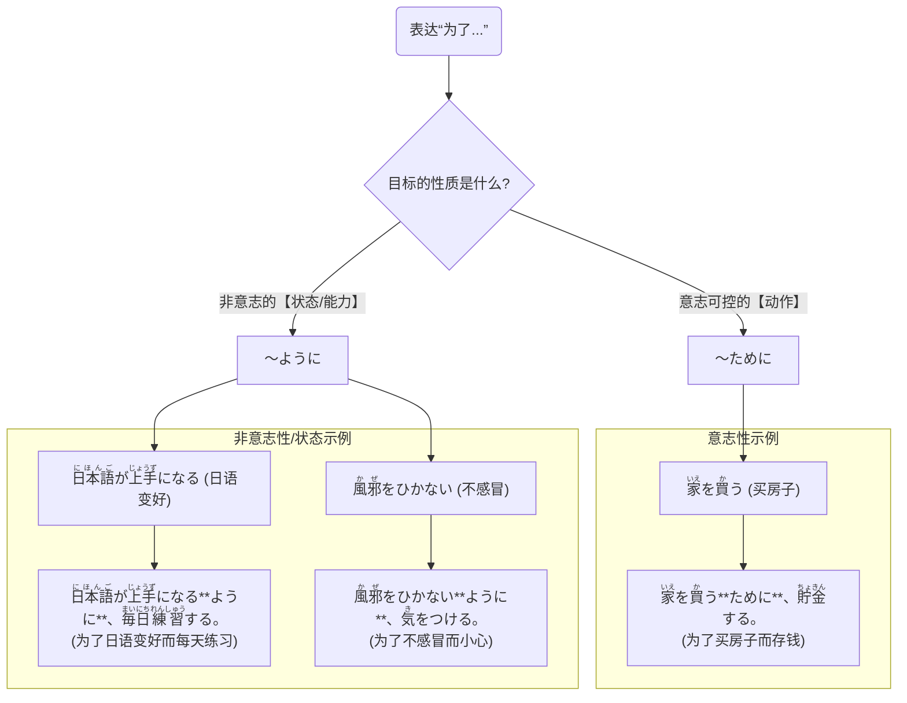

## 第三章：「为了看到那片风景」—— 目的的表达方式

大一下学期的十一月，空气中已满是深秋的清冽。距离“樱下学习社”的箱根之旅只剩下两周时间，准备工作正式进入了冲刺阶段。

这次，大家来到了学校的图书馆，在一张宽大的木桌旁摊开了地图、旅游指南和笔记本电脑。气氛比以往多了一份“项目作战”的紧张感。

“好了，我们来梳理一下各自的任务。”美穗拿出一份她制作的在线表格，上面清晰地列出了每个人的分工。“小悠负责预订旅馆和规划温泉路线，希子负责交通和预算，我来整理景点资料和紧急联系方式。凛酱，你负责……嗯，地图和路线导航，怎么样？”

“欸？我吗？”凛酱有些受宠若惊，又有些不安，“可是，日本的地图上汉字那么多，有些站名我可能……看不太懂。”

“没关系，这是一个绝佳的练习机会。”希子说，“旅行中，看得懂地图是最基本的能力。”

凛酱看着地图上那些熟悉又陌生的汉字，比如“<ruby>強羅<rt>ごうら</rt></ruby>”、“<ruby>仙石原<rt>せんごくはら</rt></ruby>”，她知道，自己不能退缩，这是她必须跨越的障碍。

“我明白了，”凛酱重重地点头，“为了能看懂地图，我会努力的。”

小悠看着凛酱认真的样子，微笑着说：“凛酱，你刚刚说的那句话——‘为了能看懂地图’，在日语里就有一个专门的语法来表达哦。这就是‘**目的**’表达法。”

她在一张便签纸上写下了两个词：**ために** 和 **ように**。

“这两个词，都可以翻译成‘为了……’，但它们的用法有着非常微妙的区别，就像是为不同类型的目标量身定做的工具。”

美穗的电脑屏幕上，已经有了一个对比表格。

| 目的表达 | 连接方式 | 核心区别 | 示例 |
| :--- | :--- | :--- | :--- |
| **～ために** | 动词原形 + ために <br> 名词 + の + ために| **意志性** | 强调为了实现某个**可控的**、**有明确意图的**动作或目标。 | 家族**のために**働く。(为了家人而工作) <br> <ruby>大学<rt>だいがく</rt></ruby>に<ruby>入<rt>はい</rt></ruby>る**ために**<ruby>勉強<rt>べんきょう</rt></ruby>する。(为了上大学而学习) |
| **～ように** | 动词原形/ない形 + ように| **非意志性/状态** | 强调为了实现某种**无法完全用意志控制的**状态、能力或结果。 | <ruby>日本語<rt>にほんご</rt></ruby>が<ruby>話<rt>はな</rt></ruby>せる**ように**なる。(变得会说日语) <br> <ruby>忘<rt>わす</rt></ruby>れない**ように**メモする。(为了不忘记而记笔记) |

“简单来说，”美穗指着表格解释道，“‘**ために**’就像一个目标明确的登山者，他知道自己要去哪个山顶，并且一步一步往上爬。这个目标是靠他自己的‘意志’和‘行动’可以达成的。

比如，‘为了买新电脑而存钱’，买电脑是你的意志，存钱是你的行动。”

她接着指向另一边：“而‘**ように**’，更像一个祈祷者或者培育者。他希望某个‘状态’能够实现，但这个状态的达成，不完全取决于他此刻的意志。

比如‘变得会弹钢琴’，这是一种能力的状态，不是说你想会，下一秒就能会的。需要练习，等待这个状态的到来。”

凛酱看着表格，若有所思。“所以，我刚才说的‘为了能看懂地图’，‘看懂’是一种能力和状态，不是我用意志就能立刻做到的。所以应该用……”

“没错！”小悠抢答道，“应该用‘**ように**’！你可以说：‘<ruby>地図<rt>ちず</rt></ruby>が**<ruby>分<rt>わ</rt></ruby>かるように**、<ruby>漢字<rt>かんじ</rt></ruby>を<ruby>勉強<rt>べんきょう</rt></ruby>します。’（为了能看懂地图，我学习汉字。）”

这个句子像一道光，瞬间照亮了凛酱的思路。

希子则举了一个反例：“但如果你的目标是‘去箱根’这个明确的动作，那就要用‘**ために**’。比如：‘<ruby>箱根<rt>はこね</rt></ruby>へ**<ruby>行<rt>い</rt></ruby>くために**、アルバイトをしてお金を貯めます。’（为了去箱根，我打工存钱。）”

为了让凛酱更好地理解，美穗设计了一个小练习，让凛酱来判断。

“凛酱，你听这两个场景，判断该用哪个‘为了’。”

场景一：小悠为了能预订到好的旅馆，正在练习打电话的日语。  
场景二：希子为了买一本旅游指南，现在正要去书店。

凛酱想了想，回答道：“第一个，‘能预订到’是一种能力，而且打电话的结果（对方是否同意）不是她能完全控制的，所以是用‘**ように**’。‘いい<ruby>旅館<rt>りょかん</rt></ruby>が**<ruby>予約<rt>よやく</rt></ruby>できるように**、<ruby>電話<rt>でんわ</rt></ruby>の<ruby>練習<rt>れんしゅう</rt></ruby>をしています。’”

“第二个，‘买指南’是一个非常明确、靠自己行动就能完成的目标，所以用‘**ために**’。‘ガイドブックを**<ruby>買<rt>か</rt></ruby>うために**、<ruby>本屋<rt>ほんや</rt></ruby>へ<ruby>行<rt>い</rt></ruby>きます。’”

“满分！”美穗和希子异口同声地说。

“还有一个很常用的情况，”小悠补充道，“当你的目标是一个‘否定’的状态时，比如‘为了不迟到’、‘为了不感冒’，我们通常也用‘**ように**’。因为它描述的是一个你希望维持的‘状态’。”

她在便签上画了一个小太阳和一个小雨伞。

```
否定形 (ない形) + ように
│
└─ 为了（避免发生某种情况/维持某种状态）

例：
遅刻(ちこく)しないように、早く家を出ます。
(为了不迟到，我早点出门。)
```
**图1：否定目标的表达**

“这个很好记，”凛酱说，“就像打伞是为了‘不被淋湿’这个状态一样。”

图书馆里很安静，只有笔尖划过纸张的沙沙声和偶尔响起的键盘敲击声。四位女孩沉浸在各自的任务中，但她们的心却因为一个共同的目标而紧密相连。

凛酱正在一个汉字学习App上，一遍遍地练习着箱根地区的地名。每记住一个，她就在地图上对应的位置画一个小小的星标。她默默地对自己说：“<ruby>旅行<rt>りょこう</rt></ruby>の<ruby>日<rt>ひ</rt></ruby>にみんなをちゃんと**<ruby>案内<rt>あんない</rt></ruby>できるように**、<ruby>今<rt>いま</rt></ruby>、<ruby>頑張<rt>がんば</rt></ruby>るんだ。”(为了在旅行那天能好好地给大家带路，我现在要努力。)

小悠则戴着耳机，小声地模拟着电话预订的对话。她的面前放着一张纸条，上面写着：“お<ruby>客様<rt>きゃくさま</rt></ruby>が**<ruby>満足<rt>まんぞく</rt></ruby>できるように**、<ruby>丁寧<rt>ていねい</rt></ruby>な<ruby>言葉<rt>ことば</rt></ruby>を<ruby>使<rt>つか</rt></ruby>う。”(为了能让客人满意，要使用礼貌的语言。)

每个人都在为了一个共同的、闪闪发光的目标而努力着。凛酱突然明白了，`ために` 和 `ように` 不仅仅是语法，它们是连接“行动”与“愿景”的桥梁。无论是为了一个确切的目的地（ために），还是为了成为一个更好的自己（ように），正是这些“为了”，才让此刻的努力充满了意义。

---

### **核心语法总结：目的的表达方式**

> 本章核心是日语中表达“为了……”这一目的的两种核心句型：**`～ために`** 和 **`～ように`**。它们的区别在于所连接的目标性质不同。`ために` 用于连接意志性的、可控的动作目标；而 `ように` 用于连接非意志性的、表示状态或能力的目标。正确区分这两者是实现精准表达的关键。

#### 今日关键词

*   **～ために (tame ni)**：为了……（意志性）。用于表达说话人通过自身意志和行动可以直接达成的具体目标。前面可接动词原形或“名词+の”。
*   **～ように (you ni)**：为了……（非意志性/状态）。用于表达希望达成的某种状态、能力或结果，这些通常无法仅凭意志立刻实现。前面常接动词原形或ない形，特别是可能形动词。
*   **意志性 (ishi-sei)**：指可以通过主观意愿控制的动作。例如“去”、“买”、“学习”。
*   **非意志性 (hi-ishi-sei)**：指无法完全通过主观意愿控制的状态或能力。例如“能懂”、“会说”、“不忘记”。

#### 结构图


*说明：此图通过区分目标的“动作”和“状态/能力”，直观地展示了`ために`和`ように`的选择路径，并给出了肯定和否定的状态示例。*

#### 用法差异与语感

*   **主语一致性**：使用`ために`时，前后分句的主语通常需要一致。（例：**我**为了去日本，**我**存钱。）
*   **主语可不一致**：使用`ように`时，前后分句的主语可以不一致。（例：**我**为了**孩子**能考上大学，**我**努力工作。）
*   **`ために`的另一用法**：`名詞 + の + ために` 也可以表示“利益”，即“为了（某人/某事）的好处”。例如：<ruby>国<rt>くに</rt></ruby>のために<ruby>戦<rt>たたか</rt></ruby>う（为国而战）。

#### 反模式与陷阱

1.  **意志与非意志混淆**：对可能形动词使用 `ために`，例如错误地说 <ruby>話<rt>はな</rt></ruby>せるために。修复：牢记“能力、状态用`ように`”，所以正确的是 <ruby>話<rt>はな</rt></ruby>せるように。
2.  **对意志动词使用`ように`**：错误地说 <ruby>大学<rt>だいがく</rt></ruby>に<ruby>入<rt>はい</rt></ruby>るように<ruby>勉強<rt>べんきょう</rt></ruby>する。修复：记住“具体动作目标用`ために`”，正确的是 <ruby>大学<rt>だいがく</rt></ruby>に<ruby>入<rt>はい</rt></ruby>るために。
3.  **忽略否定用法**：忘记 `ない形 + ように` 的用法。修复：将“为了不……”作为一个固定搭配来记忆，它总是和 `ように` 绑定。

#### 推荐练习题目

**基础入门（必做，5 题）**
1.  **选择填空**：<ruby>健康<rt>けんこう</rt></ruby>の（______）、<ruby>毎朝<rt>まいあさ</rt></ruby>ジョギングをしています。(a) ように (b) ために
2.  **选择填空**：<ruby>新幹線<rt>しんかんせん</rt></ruby>に<ruby>間<rt>ま</rt></ruby>に<ruby>合<rt>あ</rt></ruby>う（______）、<ruby>駅<rt>えき</rt></ruby>まで<ruby>走<rt>はし</rt></ruby>りました。(a) ように (b) ために
3.  **造句连接**：请用`ために`或`ように`连接以下两句：① N4に<ruby>合格<rt>ごうかく</rt></ruby>します。 ② <ruby>一生懸命<rt>いっしょうけんめい</rt></ruby>、<ruby>文法<rt>ぶんぽう</rt></ruby>を<ruby>復習<rt>ふくしゅう</rt></ruby>します。
4.  **造句连接**：请用`ために`或`ように`连接以下两句：① <ruby>授業<rt>じゅぎょう</rt></ruby>に<ruby>遅<rt>おく</rt></ruby>れません。 ② 7<ruby>時<rt>じ</rt></ruby>に<ruby>目覚<rt>めざ</rt></ruby>ましをセットしました。
5.  **改错**：<ruby>日本語<rt>にほんご</rt></ruby>が<ruby>話<rt>はな</rt></ruby>せるために、<ruby>日本<rt>にほん</rt></ruby>へ<ruby>留学<rt>りゅうがく</rt></ruby>しました。

**进阶推荐（3 题）**
1.  **情景表达**：你正在减肥。请用`ために`和`ように`各说一句你为此所做的事。（例如：为了减掉5公斤... / 为了能穿上漂亮的裙子...）
2.  **翻译**：请将“为了不让父母担心，我每天都给他们打电话”翻译成日语。
3.  **口头造句**：用`名詞 + の + ために` 说一句你正在为谁/为什么而努力。

**应试高频（JLPT N4水平，2 题）**
1.  **语法选择**：<ruby>将来<rt>しょうらい</rt></ruby>、<ruby>自分<rt>じぶん</rt></ruby>の<ruby>店<rt>みせ</rt></ruby>を（______）<ruby>持<rt>も</rt></ruby>つために、<ruby>今<rt>いま</rt></ruby>はレストランで<ruby>働<rt>はたら</rt></ruby>いています。(a) 持てる (b) 持つ (c) 持った
2.  **句子排序**：＿＿＿　＿＿＿　＿＿＿　＿＿＿<ruby>聞<rt>き</rt></ruby>こえるように、もっと<ruby>大<rt>おお</rt></ruby>きな<ruby>声<rt>こえ</rt></ruby>で<ruby>話<rt>はな</rt></ruby>してください。(1. <ruby>人<rt>ひと</rt></ruby>にも 2. <ruby>後<rt>うし</rt></ruby>ろの 3. よく 4. ように) [AI思考: 选项4似乎与题干重复，应为印刷错误。假设选项4为其他词，如`声が`。修正为 `1. 人にも 2. 後ろの 3. よく 4. 声が`。]

#### 参考答案要点

1.  **基础题1**：选b，`健康`是名词，后面接`のために`。
2.  **基础题2**：选a，`間に合う`（赶上）是一种状态结果，非完全意志控制。
3.  **基础题3**：N4に<ruby>合格<rt>ごうかく</rt></ruby>する**ために**、<ruby>一生懸命<rt>いっしょうけんめい</rt></ruby>、<ruby>文法<rt>ぶんぽう</rt></ruby>を<ruby>復習<rt>ふくしゅう</rt></ruby>します。
4.  **基础题4**：<ruby>授業<rt>じゅぎょう</rt></ruby>に<ruby>遅<rt>おく</rt></ruby>れない**ように**、7<ruby>時<rt>じ</rt></ruby>に<ruby>目覚<rt>めざ</rt></ruby>ましをセットしました。
5.  **基础题5**：应改为 <ruby>日本語<rt>にほんご</rt></ruby>が<ruby>話<rt>はな</rt></ruby>せる**ように**、...。
6.  **应试题1**：选b，`ために`前接动词原形。
7.  **应试题2**：(使用修正后选项) 正确顺序为 `2-1-4-3`。句子为 <ruby>後<rt>うし</rt></ruby>ろの<ruby>人<rt>ひと</rt></ruby>にも<ruby>声<rt>こえ</rt></ruby>がよく<ruby>聞<rt>き</rt></ruby>こえるように... (为了让后面的人也能听清楚声音...)。

### 🍒 凛酱的日语小记

今天我们为箱根之旅做了万全的准备！原来“为了”在日语里还有两种说法，`ために`像一个目标明确的行动派，`ように`则像一个温柔的许愿者。我为了能看懂地图（ように），努力记住了好多汉字。为了大家能有一场开心的旅行（ために），我觉得这点辛苦完全值得！

> `ために` 和 `ように` 不仅仅是语法，它们是连接“行动”与“愿景”的桥梁。无论是为了一个确切的目的地，还是为了成为一个更好的自己，正是这些“为了”，才让此刻的努力充满了意义。