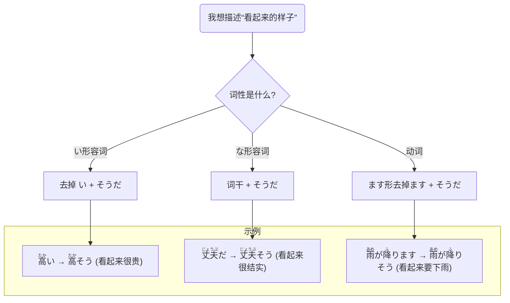

## 第九章：「看起来很好吃！」—— 所见样态的表达

箱根之旅的第二天，细雨初歇，一行人来到了热闹的箱根汤本商店街。

街道两旁挤满了各式各样的店铺，空气中飘散着温泉馒头的甜糯的香气和烤仙贝的酱油焦香。石板路被雨水洗刷得干干净净，映出店铺门口古朴的灯笼倒影。

“哇！快看那个！”小悠像一只快活的小鸟，第一个冲到了一家和果子店的玻璃橱窗前。她指着里面一个晶莹剔剔透、如同宝石般的羊羹，眼睛闪闪发光。

“<ruby>宝石<rt>ほうせき</rt></ruby>みたい！すごく**おいしそう**！”(像宝石一样！看起来好好吃！)

店里的老师傅听到了，呵呵一笑，拿出牙签挑起一小块递出来：“<ruby>嬢<rt>じょう</rt></ruby>ちゃん、<ruby>試食<rt>ししょく</rt></ruby>どうぞ。”(姑娘，请尝尝看。)

“いいんですか？ありがとうございます！”小悠惊喜地接过来，尝了一口，幸福地眯起了眼睛，“んー、おいしい！”

凛酱在一旁看得直乐，她觉得小悠前辈那句“**おいしそう**”，简直把羊羹的魅力放大了好几倍。它不是在说“好吃”，而是在传递一种“我看到它，就觉得它一定很好吃”的强烈期待。

她们继续往前走，被一家卖寄木细工（木片镶嵌工艺品）的店铺吸引。店里摆满了各种精致的秘密盒、杯垫和筷子，复杂的几何花纹令人目不暇接。

希子拿起一个设计简洁的杯垫，翻来覆去地看：“これ、すごく**<ruby>丈夫<rt>じょうぶ</rt></ruby>そう**。<ruby>長<rt>なが</rt></ruby>く<ruby>使<rt>つか</rt></ruby>えそうだね。”(这个，看起来很结实。感觉能用很久呢。)

凛酱也拿起一个秘密盒，尝试着解开。她推了推这里，又滑了滑那里，盒子却纹丝不动。“うわ、<ruby>難<rt>むずか</rt></ruby>しそう…” (哇，看起来好难……)她小声嘀咕。

店主是一位慈祥的老奶奶，她笑着走过来说：“それはね、<ruby>七<rt>なな</rt></ruby><ruby>回<rt>かい</rt></ruby><ruby>動<rt>うご</rt></ruby>かさないと<ruby>開<rt>あ</rt></ruby>かないんだよ。”(那个呀，要移动七次才能打开哦。)

就在大家专注于手里的工艺品时，一阵山风吹过，远方的天空云层忽然变厚，颜色也深沉了许多。

美穗最先察觉到了变化，她走出店铺，抬头看了一眼：“あら、また<ruby>雨<rt>あめ</rt></ruby>が**<ruby>降<rt>ふ</rt></ruby>りそう**だね。”(哎呀，看起来又要下雨了呢。)

话音刚落，豆大的雨点就开始噼里啪啦地砸了下来。

“わっ、本当だ！”大家赶紧跑回店里的屋檐下躲雨。刚刚还晴朗的天空，转眼就变了脸。

“<ruby>傘<rt>かさ</rt></ruby>、<ruby>旅館<rt>りょかん</rt></ruby>に<ruby>置<rt>お</rt></ruby>いてきちゃった…”小悠苦着脸说。(“伞，落在旅馆了……”)

“<ruby>大丈夫<rt>だいじょうぶ</rt></ruby>、すぐに<ruby>止<rt>や</rt></ruby>みそうだよ。<ruby>山<rt>やま</rt></ruby>の<ruby>天気<rt>てんき</rt></ruby>は<ruby>変<rt>か</rt></ruby>わりやすいから。”希子指着天空的另一边，那里还能看到一丝光亮。(“没关系，看起来马上就要停了。山里的天气就是这样多变。”)

凛酱静静地听着大家的对话，心里感觉很奇妙。从“**おいしそう**”的羊羹，到“**<ruby>丈夫<rt>じょうぶ</rt></ruby>そう**”的杯垫，再到“**<ruby>降<rt>ふ</rt></ruby>りそう**”的雨，大家都在用一个“**そう**”来描述自己看到的样子。这个词就像一个魔法后缀，能把眼睛捕捉到的第一印象，瞬间变成一句生动的描述或预测。

雨来得快，去得也快。不一会儿，就只剩下零星的雨丝了。

“凛酱，你好像对‘**そう**’很感兴趣呢？”美穗看出了凛酱正在思考，微笑着问道。

“嗯，”凛酱点点头，“感觉它能把看到的画面，直接变成语言。很奇妙。”

“没错，我们把它叫做‘样态’的表达方式，”美穗提议道，“雨也小了，我们找个地方坐下来慢慢聊吧？我知道前面有家不错的茶室。”

茶室里，温暖的灯光和抹茶的香气瞬间驱散了残留的寒意。

大家点了热饮和团子坐下，话题自然而然地延续了下去。美穗拿出手机，调出了一张她随手制作的笔记图。

**【「～そう」的样态魔法】**

| 词性 | 连接方式 | 示例 | 例外 |
| :--- | :--- | :--- | :--- |
| **い形容词** | 去掉词尾「い」 + そう | <ruby>楽<rt>たの</rt></ruby>しい → <ruby>楽<rt>たの</rt></ruby>し**そう** (看起来很开心)   <ruby>暑<rt>あつ</rt></ruby>い → <ruby>暑<rt>あつ</rt></ruby>**そう** (看起来很热) | いい → **よさそう** (看起来不错) ない → **なさそう** (看起来没有) |
| **な形容词** | 词干 + そう | <ruby>元気<rt>げんき</rt></ruby>だ → <ruby>元気<rt>げんき</rt></ruby>**そう** (看起来很精神)   <ruby>静<rt>しず</rt></ruby>かだ → <ruby>静<rt>しず</rt></ruby>か**そう** (看起来很安静) | |
| **动词** | ます形去掉「ます」 + そう | <ruby>降<rt>ふ</rt></ruby>ります → <ruby>降<rt>ふ</rt></ruby>り**そう** (看起来要下)   <ruby>終<rt>お</rt></ruby>わります → <ruby>終<rt>お</w- rt></ruby>わり**そう** (看起来要结束)| |

“你看，”美穗指着表格，“它的规则很统一。い形容词去掉‘い’，な形容词和动词直接去掉词尾，然后加上‘**そう**’就可以了。不过，‘いい’和‘ない’是两个淘气的例外，需要特别记住。”

“‘いい’会变成‘**よさそう**’，”小悠补充道，她拿起一块看起来烤得恰到好处的酱油团子，“比如这个，‘このお<ruby>団子<rt>だんご</rt></ruby>、とても**よさそう**！’ (这块团子，看起来很不错！)”

“那‘ない’呢？”凛酱问。

“‘ない’会变成‘**なさそう**’，”希子指了指窗外，“比如，‘<ruby>今日<rt>きょう</rt></ruby>はもう<ruby>雨<rt>あめ</rt></ruby>は<ruby>降<rt>ふ</rt></ruby>ら**なさそう**だね。’(今天看起来不会再下雨了呢。)”

凛酱感觉豁然开朗。这个语法点直观又实用，就像给自己的眼睛装上了一个“实时翻译器”。

“不过，‘样态’的‘そう’有一个非常重要的‘铁则’，”希子提醒道，“它只能描述‘能被眼睛直接看到的样子’。你不能用它来描述那些看不见的外在特征。”

“比如？”

“比如，你看到一个女孩穿着可爱的衣服，你可以说‘かわいい’，但不能说‘かわい**そう**’。因为‘かわいそう’是另一个独立的单词，意思是‘可怜’。这是一个经典的陷阱。”

美穗也举了一个例子：“同样，你看到一张照片很漂亮，可以说‘<ruby>綺麗<rt>き れい</rt></ruby>だ’。但一般不说‘<ruby>綺麗<rt>きれい</rt></ruby>そう’。因为‘漂亮’本身就是一个基于视觉的综合判断，而不是一个‘即将发生’或‘呈现某种状态’的样子。”

“我明白了，”凛酱说，“所以‘**～そう**’更侧重于动态的、有变化趋势的‘样子’。”

为了让凛酱更好地掌握，小悠提议来一场“所见即所得”的游戏。

“规则很简单，我们轮流用‘**～そう**’来描述我们现在能看到的东西。”

小悠第一个开始，她看着凛酱手中的相机，说：“凛ちゃん、そのカメラ、<ruby>重<rt>おも</rt></ruby>そう。大丈夫？”(凛酱，那台相机，看起来很重。没关系吗？)

轮到凛酱了。她看着希子面前那杯还冒着热气的抹茶，说：“<ruby>希子<rt>きこ</rt></ruby>先輩の抹茶、<ruby>熱<rt>あつ</rt></ruby>そうですね。”(希子前辈的抹茶，看起来很烫呢。)

希子笑了笑，抿了一口，然后看着美穗正在敲击手机屏幕的飞快手指：“<ruby>美穂<rt>みほ</rt></ruby>、<ruby>忙<rt>いそが</rt></ruby>しそうだね。<ruby>仕事<rt>しごと</rt></ruby>のメッセージ？”(美穗，你看起来很忙啊。是工作的消息吗？)

美穗抬起头，摇了摇头：“ううん、<ruby>急<rt>いそ</rt></ruby>いで<ruby>宿<rt>やど</rt></ruby>のチェックアウト<ruby>時間<rt>じかん</rt></ruby>を<ruby>調<rt>しら</rt></ruby>べてるの。うっかりすると、<ruby>遅<rt>おく</rt></ruby>れそうだから。”(不是，我在赶紧查旅馆的退房时间。因为一不留神，感觉就要晚了。)

大家在轻松的游戏中，不知不觉地将“～そう”的用法练习了好几遍。

茶歇结束，她们重新走上商店街。雨后的石板路湿漉漉的，映着店铺温暖的灯光。

凛酱感觉自己的视界被打开了一扇新的窗户。她看到的不再是静止的物体，而是一个个充满动态和趋势的“样子”：

那家店的队伍很长，生意看起来很好（<ruby>儲<rt>もう</rt></ruby>かっていそう）；  
那个孩子跑得太快，看起来快要摔倒了（<ruby>転<rt>ころ</rt></ruby>びそう）；  
远处的缆车马上就要到站了（<ruby>着<rt>つ</rt></ruby>きそう）。

她举起相机，对准了一串在风中轻轻摇曳的风铃。她知道，她想拍下的，不仅仅是风铃本身，更是那份“看起来就要响起清脆声音”的美好瞬间。

---

### **核心语法总结：所见样态的表达**

> 本章核心是学习日语中用于表达“看起来好像……”的样态助动词**`～そうです`**。它通过连接在形容词或动词后面，将说话人基于**视觉信息**做出的**直观推测**表达出来。这个句型生动地描绘了事物即将发生变化或呈现某种状态的样子，是进行生动描述的重要工具。

#### 今日关键词

*   **～そうです (sou desu) [样态]**：表示“看起来好像……”。它传达的是一种即时的、视觉上的判断，而不是经过深思熟虑的逻辑推断。
*   **样态 (yōtai)**：指事物的外观、样子、呈现出的状态。
*   **连接规则**：い形容词去`い`；な形容词词干；动词`ます`形去`ます`。
*   **特殊例外**：`いい` → `よさそう`；`ない` → `なさそう`。

#### 结构图

*说明：此图清晰地展示了样态`～そう`根据不同词性的三种基本连接方式。*

#### 用法差异与语感

*   **样态 vs 传闻**：N4阶段只学样态的`～そう`。在N3会学到另一个接在动词原形后的`～そう`，表示“听说”，两者形态和意义完全不同。  
例如：「<ruby>雨<rt>あめ</rt></ruby>が**<ruby>降<rt>ふ</rt></ruby>りそう**です」 (看起来要下雨) vs 「<ruby>雨<rt>あめ</rt></ruby>が**<ruby>降<rt>ふ</rt></ruby>るそう**です」 (听说要下雨)。

*   **主观直觉**：`～そう`的判断非常主观，完全基于说话人第一眼的印象，可能与事实不符。它强调的是“给我的感觉是这样”。

*   **否定形式**：其否定形式有两种。一种是`～そうにない/～そうもない`，表示“看起来不像要……”。另一种是`～なさそう`，如前述。

#### 反模式与陷阱

1.  **对显而易见的事物使用`～そう`**：看到富士山，不能说「<ruby>富士山<rt>ふじさん</rt></ruby>は<ruby>高<rt>たか</rt></ruby>そうです」(×)。因为富士山高是常识。  
修复：`～そう`用于对未知属性的推测。应直接说「<ruby>富士山<rt>ふじさん</rt></ruby>は<ruby>高<rt>たか</rt></ruby>いです」。

2.  **混淆`かわいい`和`かわいそう`**：这是初学者最容易犯的错误。  
修复：将`かわいそう` (可怜) 作为一个独立的单词来记忆，而不是`かわいい`的样态。

3.  **对颜色等固有属性使用`～そう`**：看到红色的苹果，不能说「<ruby>赤<rt>あか</rt></ruby>そうです」(×)。  
修复：`～そう`不用于描述事物本身固有的、一目了然的属性。应直接说「<ruby>赤<rt>あか</rt></ruby>いりんごです」。

#### 推荐练习题目

**基础入门（必做，5 题）**
1.  **形式变换**：请将形容词 <ruby>安<rt>やす</rt></ruby>い (便宜) 变为样态形式。
2.  **形式变换**：请将动词 <ruby>切<rt>き</rt></ruby>れます (断掉) 变为样态形式。
3.  **选择填空**：この<ruby>料理<rt>りょうり</rt></ruby>はとても（______）。<ruby>作<rt>つく</rt></ruby>ってみませんか。(a) おいしいそうです (b) おいしそうです
4.  **改错**：その<ruby>映画<rt>えいが</rt></ruby>はいいそうですね。
5.  **完成句子**：<ruby>空<rt>そら</rt></ruby>が<ruby>暗<rt>くら</rt></ruby>くなりました。_________________そうです。

**进阶推荐（3 题）**
1.  **情景表达**：你看到朋友脸色苍白，看起来身体不舒服。你会怎么关心他？(请用上样态`～そう`)
2.  **看图说话**：描述一张图片（例如：一个孩子举着一个快要掉落的冰淇淋），用上至少两个样态`～そう`的表达。
3.  **翻译**：请将“这个钱包看起来很结实，但好像不便宜”翻译成日语。

**应试高频（JLPT N4水平，2 题）**
1.  **语法选择**：<ruby>彼<rt>かれ</rt></ruby>はいつも<ruby>元気<rt>げんき</rt></ruby>いっぱいですが、<ruby>今日<rt>きょう</rt></ruby>はちょっと（______）。(a) <ruby>疲<rt>つか</rt></ruby>れていそうです (b) <ruby>疲<rt>つか</rt></ruby>れそうです (c) <ruby>疲<rt>つか</rt></ruby>れたそうです
2.  **句子排序**：＿＿＿　＿＿＿　＿＿＿　＿＿＿そうに<ruby>泣<rt>な</rt></ruby>いています。(1. <ruby>悲<rt>かな</rt></ruby>し 2. あの 3. どうしたんでしょう 4. <ruby>子<rt>こ</rt></ruby>は)

#### 参考答案要点

1.  **基础题1**：<ruby>安<rt>やす</rt></ruby>そう。
2.  **基础题2**：<ruby>切<rt>き</rt></ruby>れそう。
3.  **基础题3**：选b。`おいしい`是い形容词，去`い`+`そう`。
4.  **基础题4**：`いい`的样态是`よさそう`。改为「その<ruby>映画<rt>えいが</rt></ruby>は**よさそう**ですね」。
5.  **基础题5**：(开放答案) 例：<ruby>雨<rt>あめ</rt></ruby>が<ruby>降<rt>ふ</rt></ruby>り
6.  **进阶题3**：この<ruby>財布<rt>さいふ</rt></ruby>は<ruby>丈夫<rt>じょうぶ</rt></ruby>そうですが、<ruby>安<rt>やす</rt></ruby>くなさそうですね。
7.  **应试题1**：选a。`疲れている` (疲劳的状态) 是一个ている形，看作一个整体，类似于い形容词，变为「<ruby>疲<rt>つか</rt></ruby>れていそう」。
8.  **应试题2**：正确顺序为`2-4-1-3`。句子为 「あの<ruby>子<rt>こ</rt></ruby>は**<ruby>悲<rt>かな</rt></ruby>しそう**に<ruby>泣<rt>な</rt></ruby>いています。どうしたんでしょう。」(那个孩子看起来很伤心地在哭。怎么了呢？)

### 🍒 凛酱的日语小记

今天在箱根商店街的发现太有趣了！一个简单的`～そう`，就像给眼睛装上了翻译器。和果子看起来很好吃，天空看起来要下雨…感觉整个世界都动了起来。不过，要小心不能把`かわいい`说成`かわいそう`，这个我一定会记住的！

> 语言为我们描绘世界的方式，远比想象中更生动。`～そう`就是这样一位画家，它不拘泥于事实本身，而是捕捉事物在某一瞬间“看起来”的样子，让静态的风景，变为一幕充满动态与预感的戏剧。