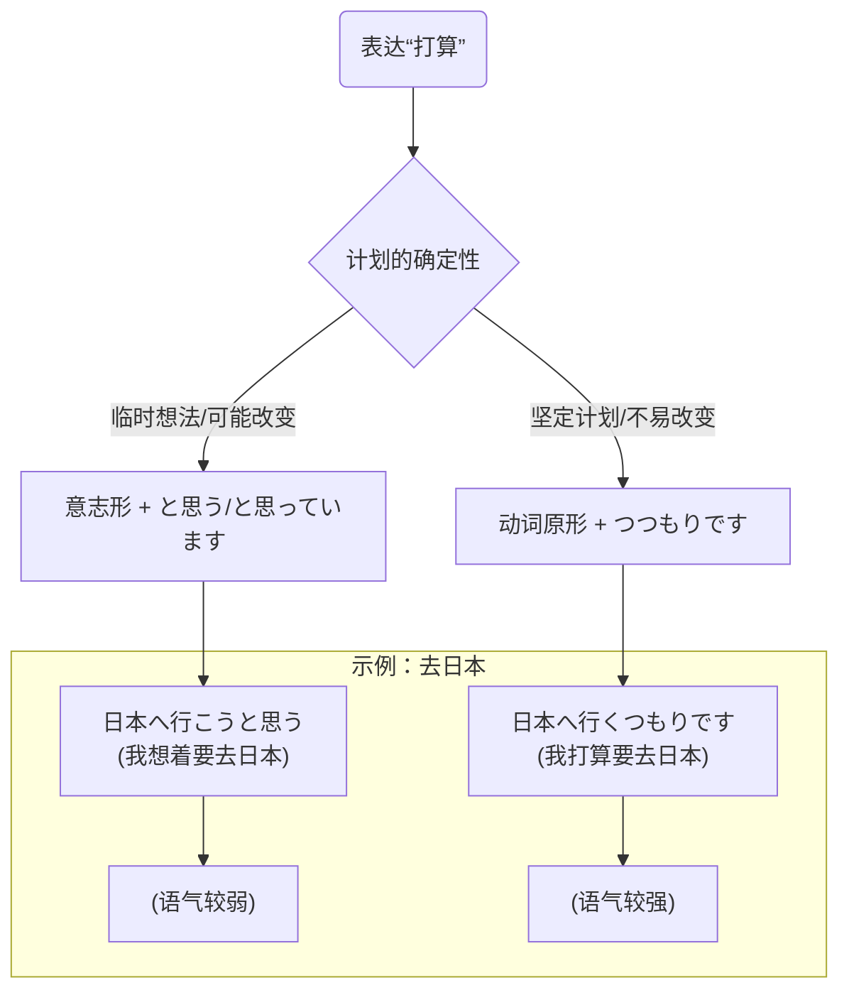

## 第二章：「一起去箱根吧！」—— 意志与劝诱的表达

秋意渐浓，银杏叶将校园染成一片灿烂的金黄。“樱下学习社”迎来了一个令人兴奋的议题——举办第一次短期旅行。

和室里，四人围坐着矮桌，桌上的热茶冒着袅袅白汽。小悠铺开一张巨大的日本地图，上面圈着几个她精心挑选的目的地。

“天气这么好，我们出去玩吧！看看，箱根的红叶、伊豆的温泉、轻井泽的教堂……都好棒啊！”她的眼睛里闪着光。

凛酱看着地图，心里也充满了向往。她想提议去箱根，因为听说那里的芦之湖可以看到富士山。

但她不知道该怎么自然地提出建议。是说“<ruby>箱根<rt>はこね</rt></ruby>へ<ruby>行<rt>い</rt></ruby>きます”吗？这听起来像是在陈述一个事实，而不是邀请。

还是“<ruby>箱根<rt>はこね</rt></ruby>へ<ruby>行<rt>い</rt></ruby>きませんか”？又感觉有点太客气，像是询问对方的意愿，却缺少了那种“我们一起去做吧！”的热情。

她犹豫着，小声地对身边的美穗说：“<ruby>私<rt>わたし</rt></ruby>は<ruby>箱根<rt>はこね</rt></ruby>へ<ruby>行<rt>い</rt></ruby>きたいです。みんなで…”（我想去箱根。和大家一起……）

希子耳朵尖，听到了凛酱的低语。她干脆地开口：“凛酱，想提议大家一起去的时候，有一个非常有用的动词形态，叫‘意志形’。”

“意志形？”

“没错，”希子在平板上写下一个大大的「～(よ)う」，“它就像一个邀请函，能把‘我’的想法，变成‘我们’的行动。它自带一种‘来吧，一起干！’的能量。”

美穗随即在自己的笔记本上，调出了意志形的变形规则表格，展示给大家看。

| 动词类型 | 变身规则 | 示例 |
| :--- | :--- | :--- |
| **I类 (五段)** | 词尾「う」段 → 「お」段 + う | <ruby>行<rt>い</rt></ruby>く → <ruby>行<rt>い</rt></ruby>こう (走吧/去吧) <br> <ruby>飲<rt>の</rt></ruby>む → <ruby>飲<rt>の</rt></ruby>もう (喝吧) <br> <ruby>話<rt>はな</rt></ruby>す → <ruby>話<rt>はな</t></ruby>そう (说吧/聊吧)|
| **II类 (一段)** | 去掉词尾「る」 + よう | <ruby>食<rt>た</rt></ruby>べる → <ruby>食<rt>た</rt></ruby>べよう (吃吧) <br> <ruby>見<rt>み</rt></ruby>る → <ruby>見<rt>み</rt></ruby>よう (看吧) |
| **III类 (不规则)**| 特殊记忆 | する → しよう (做吧) <br> <ruby>来<rt>く</rt></ruby>る → <ruby>来<rt>こ</rt></ruby>よう (来吧) |

“规则很清晰，”美穗解释道，“I类动词，把词尾的‘う’段音变成同行的‘お’段音，再在后面加上一个‘う’。比如‘<ruby>行<rt>い</rt></ruby>く’，‘く’的‘お’段是‘こ’，所以就是‘<ruby>行<rt>い</rt></ruby>こう’。”

“II类动词，直接去掉‘る’，换成‘よう’。‘<ruby>食<rt>た</rt></ruby>べる’就变成了‘<ruby>食<rt>た</rt></ruby>べよう’。”

凛酱看着表格，恍然大悟：“所以，如果我想邀请大家一起去箱根，我应该说……‘<ruby>箱根<rt>はこね</rt></ruby>へ**<ruby>行<rt>い</rt></ruby>こう**’？”

“Perfecto！”小悠打了个响指，“听起来是不是就亲近多了？就像朋友之间搭着肩膀说‘走，咱去那儿！’一样。如果你想更礼貌一点，可以在后面加上‘か’，变成‘<ruby>行<rt>い</rt></ruby>こうか’，就是一种温和的商量语气。”

说着，小悠便自然地演示了起来，她歪着头问凛酱：“ねえ、この<ruby>週末<rt>しゅうまつ</rt></ruby>、<ruby>映画<rt>えいが</rt></ruby>でも**<ruby>見<rt>み</rt></ruby>よう**か？”(我说，这个周末要不要去看个电影什么的？)

凛酱立刻领会了，她笑着回应道：“うん、いいね！**<ruby>見<rt>み</rt></ruby>よう**、**<ruby>見<rt>み</rt></ruby>よう**！”(嗯，好呀！去看去看！)

“看，”小悠开心地说，“用意志形回应意志形，是不是感觉大家的心意一下子就连接起来了？”

“嗯！”凛酱用力点头。

“意志形除了用来邀请，还有一个重要的功能，就是表达‘我打算做某事’。”美穗引出了下一个知识点，“当你在意志形后面加上‘～と<ruby>思<rt>おも</rt></ruby>います’，就构成了一个表达个人计划的句型。”

她在屏幕上展示了结构：

```
意志形 + と思います / と思っています
│        └─ 表示“我想/我正想着（要这么做）”
└─ 表示“我打算……”
```
**图1：`～ようと思う` 结构**

“‘**<ruby>行<rt>い</rt></ruby>こう**と<ruby>思<rt>おも</rt></ruby>います’，字面意思是‘我想着「去吧」’，实际就表达了‘我打算去’这个计划。”美穗解释说，“它传达的是一种当下的、尚未完全确定的想法。可能是我刚刚决定的，也可能计划还会改变。”

“我明白了，”凛酱说，“比如，我现在心里想着‘我打算去箱根’，就可以说‘<ruby>私<rt>わたし</rt></ruby>は<ruby>箱根<rt>はこね</rt></ruby>へ**<ruby>行<rt>い</rt></ruby>こう**と<ruby>思<rt>おも</rt></ruby>っています’。”

“没错！用‘～と思っています’比‘～と思います’更能体现出这个想法已经持续了一段时间。”

“那如果我的计划非常确定，几乎不会改变了呢？”希子提出了一个进阶问题。

“好问题，”小悠赞道，“这时候，我们就需要一个语气更坚决的表达：‘～**つもりです**’。”

她解释道：“‘つもり’这个词，本身就有‘打算、意图’的意思。它比‘～**<ruby>よう<rt></rt></ruby>**と<ruby>思<rt>おも</rt></ruby>う’要笃定得多。它前面接的是动词的原形。”

**【意志表达强度对比】**

| 表达方式 | 接续 | 强度/语感 |
| :--- | :--- | :--- |
| **～ようと思う** | 意志形 + と思う | 弱 | 临时的、个人的想法，可能改变 |
| **～つもりです** | 动词原形 + つもりです | 强 | 坚定的、深思熟虑的计划，不易改变 |

“比如，”小悠举例，“一个学生说‘<ruby>来年<rt>らいねん</rt></ruby>、<ruby>日本<rt>にほん</rt></ruby>へ<ruby>留学<rt>りゅうがく</rt></ruby>**しよう**と<ruby>思<rt>おも</rt></ruby>っています’，这听起来是他有这个想法。但如果他说‘<ruby>来年<rt>らいねん</rt></ruby>、<ruby>日本<rt>にほん</rt></ruby>へ<ruby>留学<rt>りゅうがく</rt></ruby>する**つもりです**’，那感觉他连申请材料都可能准备好了。”

“还有一个小陷阱，”希子提醒道，“‘**つもりです**’的否定形式是‘～ない**つもりです**’，表示‘不打算做某事’。但‘～**<ruby>よう<rt></rt></ruby>**と<ruby>思<rt>おも</rt></ruby>う’一般不直接用否定形式。”

大家你一言我一语，凛酱手里的笔飞快地记着。她感觉自己不仅学到了语法，更学到了如何把自己的心意，用不同的“温度”和“形状”表达出来。

“好了，理论学习结束！”希子拍了拍手，“现在开始我们的‘樱下社’第一次旅行企划会！请大家用今天学到的语法，提出你的方案，并说明你的计划！”

小悠第一个举手，她指着伊豆半岛，用充满活力的声音说：“<ruby>伊豆<rt>いず</rt></ruby>の<ruby>温泉<rt>おんせん</rt></ruby>に**<ruby>入<rt>はい</rt></ruby>ろう**よ！<ruby>私<rt>わたし</rt></ruby>は、<ruby>週末<rt>しゅうまつ</rt></ruby>に<ruby>行<rt>い</rt></ruby>くのがいいと**<ruby>思<rt>おも</rt></ruby>っています**。”(我们去泡伊豆的温泉吧！我正想着周末去比较好。)

希子则指着轻井泽：“<ruby>私<rt>わたし</rt></ruby>は<ruby>軽井沢<rt>かるいざわ</rt></ruby>でサイクリングを**しよう**と<ruby>思<rt>おも</rt></ruby>う。<ruby>秋<rt>あき</rt></ruby>の<ruby>軽井沢<rt>かるいざわ</rt></ruby>は<ruby>最高<rt>さいこう</rt></ruby>だから。”(我打算去轻井泽骑自行车。因为秋天的轻井泽最棒了。)

轮到凛酱了。她深吸一口气，不再是刚才那个犹豫的自己。她指着地图上的箱根，眼神坚定地看着大家，清晰地说道：

「みんなで<ruby>箱根<rt>はこね</rt></ruby>へ**<ruby>行<rt>い</rt></ruby>こう**！<ruby>私<rt>わたし</rt></ruby>、<ruby>卒業<rt>そつぎょう</rt></ruby>までに、<ruby>一度<rt>いちど</rt></ruby>は<ruby>富士山<rt>ふじさん</rt></ruby>をこの<ruby>目<rt>め</rt></ruby>で<ruby>見<rt>み</rt></ruby>る**つもりです**！」 (我们一起去箱根吧！我打算在毕业前，亲眼看一次富士山！)

她的声音里充满了决心。那一刻，和室里安静了一瞬，然后小悠、美穗和希子不约而同地笑了起来。

“好！就这么定了！”小悠一锤定音，“为了凛酱的富士山之约，我们的目的地——箱根！”

凛酱的脸颊泛起了开心的红晕。她发现，当她用准确的语言表达出自己坚定的意愿时，世界真的会向她敞开大门。

---

### **核心语法总结：意志与劝诱的表达**
> 本章核心是日语中表达**提议、劝诱**（“……吧！”）以及**个人计划、意图**（“我打算……”）的两种重要语法形式。一是动词的**意志形（意向形 いこうけい）**，常用于非正式的邀请。二是通过在意志形或动词原形后接续**`～ようと思う`**和**`～つもりです`**来表达不同程度的个人计划。

#### 今日关键词

*   **意志形 (~(yo)u)**：动词的一种活用形态，用于向听话人提议共同进行某项活动，或表达说话人自身的意愿。语感较为随意、亲近。
*   **～ようと思う (you to omou)**：接在意志形后，表示说话人“打算”做某事。通常指临时的、尚未完全确定的想法。
*   **～つもりです (tsumori desu)**：接在动词原形后，同样表示“打算”做某事，但语气比`～ようと思う`更强，表示一个更坚定、深思熟虑的计划。

#### 结构图


*说明：此图清晰展示了两种“打算”在语气强度上的区别，帮助学习者根据计划的确定性选择合适的表达。*

#### 用法差异与语感

*   **劝诱**：`～ませんか` (N5) 是一种礼貌的询问，把决定权交给对方。`～(よ)う` (N4) 则更像是朋友间的提议，拉近了彼此的距离。
*   **计划**：`～ようと思う` 更侧重于“想”，是内心的想法。`～つもりです` 更侧重于“做”，是面向未来的决定。在面试等正式场合，表达自己的职业规划时，用 `～つもりです` 会显得更有决心。

#### 反模式与陷阱

1.  **对长辈使用意志形**：直接对老师、上司说 `行こう` 是非常失礼的。修复：对长辈或在正式场合，应使用 `行きませんか` 或 `ご一緒いかがですか` 等更礼貌的表达。
2.  **混淆 `つもり` 和 `予定`**：`つもり` 是主观的“打算”，而 `予定` 是客观的“安排、日程”。修复：个人的计划用 `つもり`，已经定好的、写在日程表上的事情用 `予定`。
3.  **否定形式的误用**：`～ようと思う` 一般不用于否定计划。修复：想表达“不打算做某事”时，应使用 `～ないつもりです` 或 `～ないことにしています`。

#### 推荐练习题目

**基础入门（必做，5 题）**
1.  **动词变形**：将动词 `<ruby>買<rt>か</rt></ruby>う` (买) 变为意志形。
2.  **动词变形**：将动词 `<ruby>寝<rt>ね</rt></ruby>る` (睡觉) 变为意志形。
3.  **句型填空**：<ruby>明日<rt>あした</rt></ruby>からダイエットを（______）と<ruby>思<rt>おも</rt></ruby>っています。(a) する (b) しよう (c) した
4.  **句型选择**：<ruby>彼<rt>かれ</rt></ruby>は<ruby>会社<rt>かいしゃ</rt></ruby>を<ruby>辞<rt>や</rt></ruby>める（______）です。看来决心已定。 (a) つもり (b) よう
5.  **完成对话**：A:「<ruby>疲<rt>つか</rt></ruby>れたね。ちょっと<ruby>休<rt>やす</rt></ruby>まない？」 B:「うん、そうだね。あそこで（______）。」

**进阶推荐（3 题）**
1.  **情景表达**：你想邀请朋友周末一起打网球，你会怎么说？（请用意志形）
2.  **语感辨析**：请解释下面两个句子语感上的不同：① <ruby>大学<rt>だいがく</rt></ruby>を<ruby>卒業<rt>そつぎょう</rt></ruby>したら、<ruby>国<rt>くに</rt></ruby>へ<ruby>帰<rt>かえ</rt></ruby>ろうと<ruby>思<rt>おも</rt></ruby>います。 ② <ruby>大学<rt>だいがく</rt></ruby>を<ruby>卒業<rt>そつぎょう</rt></ruby>したら、<ruby>国<rt>くに</rt></ruby>へ<ruby>帰<rt>かえ</rt></ruby>るつもりです。
3.  **口头造句**：用 `～ないつもりです` 说一件你“不打算做”的事情。

**应试高频（JLPT N4水平，2 题）**
1.  **语法选择**：A:「ごめん、<ruby>今日<rt>きょう</rt></ruby>は<ruby>先<rt>さき</rt></ruby>に<ruby>帰<rt>かえ</rt></ruby>るね。」B:「え、<ruby>仕事<rt>しごと</rt></ruby>は？」「うん、<ruby>残<rt>のこ</rt></ruby>りは<ruby>明日<rt>あした</rt></ruby>（______）と<ruby>思<rt>おも</rt></ruby>って。」 (a) やります (b) やろう (c) やる
2.  **句子排序**：<ruby>将来<rt>しょうらい</rt></ruby>は＿＿＿　＿＿＿　＿＿＿　＿＿＿つもりです。 (1. <ruby>医者<rt>いしゃ</rt></ruby>に 2. <ruby>人<rt>ひと</rt></ruby>を 3. なる 4. <ruby>助<rt>たす</rt></ruby>ける)

#### 参考答案要点

1.  **基础题1**：`<ruby>買<rt>か</rt></ruby>おう`。
2.  **基础题2**：`<ruby>寝<rt>ね</rt></ruby>よう`。
3.  **基础题3**：选b，`～ようと思う` 前接意志形。
4.  **基础题4**：选a，`つもり` 表示坚定的决心。
5.  **基础题5**：`<ruby>休<rt>やす</rt></ruby>もう`。
6.  **进阶题2**：①句是个人想法，可能还会变。②句是已经决定好的计划，非常坚定。
7.  **应试题2**：正确顺序为 `2-4-1-3`。句子为 `<ruby>人<rt>ひと</rt></ruby>を<ruby>助<rt>たす</rt></ruby>ける<ruby>医者<rt>いしゃ</rt></ruby>になるつもりです。` (我打算成为一名救死扶伤的医生)。

### 🍒 凛酱的日语小记

今天，我第一次用自己的话，向大家发出了邀请！说出“<ruby>箱根<rt>はこね</rt></ruby>へ<ruby>行<rt>い</rt></ruby>こう！”的那一刻，我的心跳得好快。原来“意志形”这么有力量，能把一个人的想法变成大家的约定。而且，“つもりです”这个词好有决心！为了看富士山，我一定会好好准备这次旅行的！

> 语言是连接人心的桥梁。今天我学会了如何搭建一座名为“邀请”与“决心”的桥。原来，只要说一声“～よう！”，就能把“我”的世界和“你”的世界连接在一起。