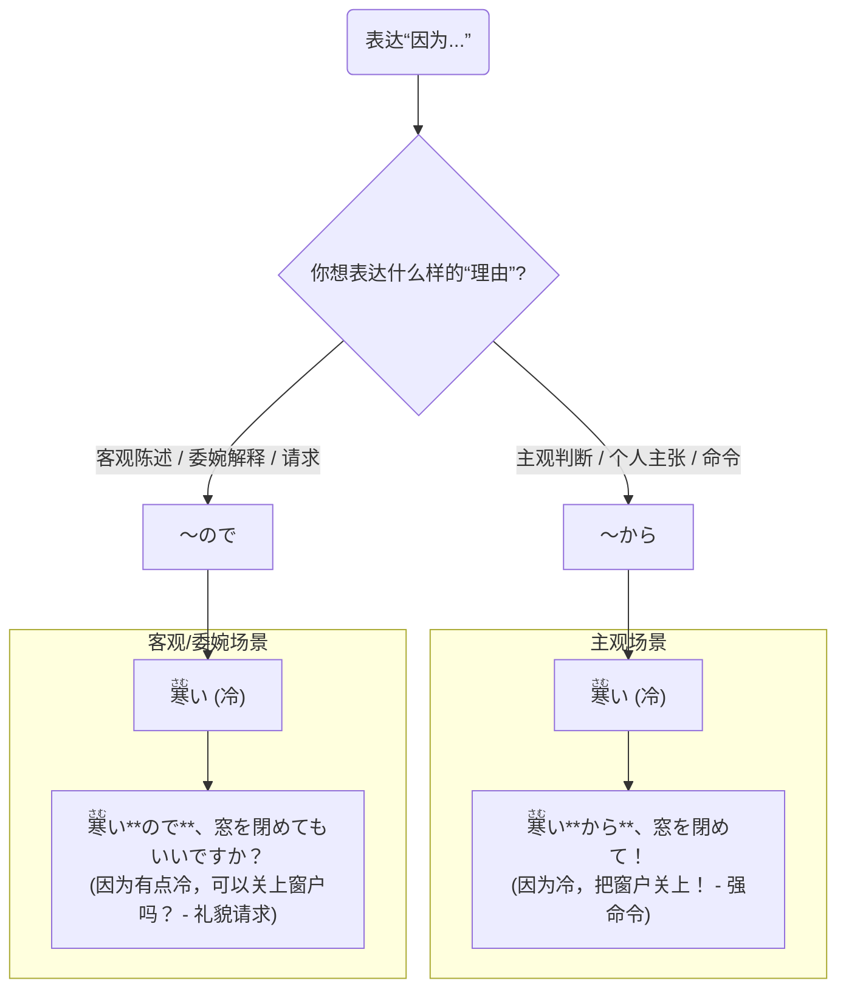

## 第五章：「因为喜欢，所以努力」—— 理由的两种温度

大一下学期的期中考核悄然临近，空气中弥漫着一丝紧张的气息。图书馆成了“樱下学习社”最近最常光顾的地方。

这天下午，四人难得地在常去的和室里碰头，算是紧张复习中的一次茶歇。

“啊……<ruby>頭<rt>あたま</rt></ruby>が<ruby>痛<rt>いた</rt></ruby>い……”小悠趴在矮桌上，有气无力地呻吟着，“<ruby>昨日<rt>きのう</rt></ruby>の<ruby>夜<rt>よる</rt></ruby>、<ruby>寝<rt>ね</rt></ruby>るのが<ruby>遅<rt>おそ</rt></ruby>かった**から**、<ruby>今日<rt>きょう</rt></ruby>はすごく<ruby>眠<rt>ねむ</rt></ruby>いんです。”(昨晚睡得太晚了，所以今天特别困。)

希子一边飞快地刷着N4模拟题，一边头也不抬地说：“<ruby>電車<rt>でんしゃ</rt></ruby>が<ruby>遅延<rt>ちえん</rt></ruby>した**ので**、<ruby>私<rt>わたし</rt></ruby>は<ruby>朝<rt>あさ</rt></ruby>の<ruby>授業<rt>じゅぎょう</rt></ruby>に<ruby>間<rt>ま</rt></ruby>に<ruby>合<rt>あ</rt></ruby>わなかった。”(因为电车晚点了，所以我早上的课没赶上。)

凛酱的笔尖停在了笔记本上。她敏锐地捕捉到了刚才对话中的一个细节：小悠前辈和希子前辈都说了“因为”，但一个用了“**から**”，另一个用了“**ので**”。

这两个词，在她之前的学习中，一直都被笼统地解释为“因为”。可为什么在刚才的场景里，她们会做出不同的选择呢？这里面一定有某种她尚未触及的语感差异。

她没有直接提问，而是换了一种方式，试探性地描述起自己的情况：“<ruby>私<rt>わたし</rt></ruby>は、アニメが<ruby>好<rt>す</rt></ruby>きです。**から**？ **ので**？ <ruby>日本語<rt>にほんご</rt></ruby>を<ruby>勉強<rt>べんきょう</rt></ruby>しています。”(我喜欢动漫。因为？所以？我在学习日语。)

她把最后的选择权抛了出来，期待着解惑的答案。

美穗放下了手中的书，“凛酱，你正好触及了日语中表达理由时，最微妙也最重要的一对‘双胞胎’。”

她没有直接给出答案，而是先肯定了凛酱的困惑。“‘**から**’和‘**ので**’，确实都翻译成‘因为’。但它们的‘温度’和‘态度’是完全不同的。”

小悠从桌子上抬起头，揉了揉眼睛说道：“我觉得，‘**から**’像是在直接抒发自己的感想，带着强烈的主观情绪。它很直白，像是在说‘听我说！原因就是这个！’ 所以我刚才抱怨自己很困，就用了‘**から**’，强调‘睡得晚’是我个人犯的错，导致了现在的困境。”

她接着说：“而‘**ので**’呢，就温柔多了。它像是在客观地陈述一个事实，然后自然而然地引出结果。它不那么强调个人主张，听起来更委婉、更客气。所以希子说电车晚点，用‘**ので**’就很合适，因为那是一个她无法控制的客观事实，她只是在平静地解释迟到的原因。”

希子也终于从题海中抬起了头。“没错。在请求、辩解或者表达歉意的时候，用‘**ので**’会显得更有礼貌，更容易被接受。如果你对老师说‘<ruby>宿題<rt>しゅくだい</rt></ruby>を<ruby>忘<rt>わす</rt></ruby>れた**から**、できませんでした’，听起来就像在找借口。但如果说‘<ruby>宿題<rt>しゅくだい</rt></ruby>を<ruby>忘<rt>わす</rt></ruby>れた**ので**、できませんでした’，语气就缓和多了，像是在陈述一个令人遗憾的事实。”

凛酱瞬间明白了。‘**から**’是主观的、强硬的，像一个感叹号；而‘**ので**’是客观的、委婉的，像一个句号。

美穗在笔记本上调出了一张清晰的对比表格，将这些感性的比喻固化为理性的规则。

| 区别点 | ～から | ～ので |
| :--- | :--- | :--- |
| **语感** | **主观性强**，强调个人判断、理由 | **客观性强**，陈述事实般的因果关系 |
| **温度** | **直接、有时略显强硬** | **委婉、柔和、有礼貌** |
| **常用场景** | 表达个人意见、意志、命令、禁止 | 客观说明、请求、许可、道歉、辩解 |
| **接续规则**| 普通体 + から   (但名词/な形容词 + **だ**から) | 普通体 + ので   (但名词/な形容词 + **な**ので) |

“接续规则是考试的重点。”美穗指着表格的最后一行，“两者最大的区别在于连接名词和な形容词的时候。‘**から**’前面是‘**だ**’，而‘**ので**’前面是‘**な**’。”

她随即给出了一组对比句，让凛酱感受差异。

- <ruby>今日<rt>きょう</rt></ruby>は**<ruby>日曜日<rt>にちようび</rt></ruby>だから**、<ruby>銀行<rt>ぎんこう</rt></ruby>は<ruby>休<rt>やす</rt></ruby>みです。
 (因为今天是周日，所以银行休息。)
- <ruby>明日<rt>あした</rt></ruby>は**テストなので**、<ruby>早<rt>はや</rt></ruby>く<ruby>帰<rt>かえ</rt></ruby>ります。
 (因为明天有考试，所以要早点回家。)

“第一句，‘今天是周日’是一个众所周知的事实，用‘**だから**’显得理所当然。第二句，‘明天有考试’虽然也是事实，但说话者用‘**なので**’向听话人解释自己‘早归’的原因，语气就显得很客气。”

“那么……”凛酱回到了自己最初的问题，“我喜欢动漫，所以学习日语。这个理由，是非常主观的、发自内心的情感。所以，我应该用……”

“‘**から**’！”小悠和希子异口同声地说道。

“对！”小悠笑着说，“你可以非常自豪地说：‘アニメが**<ruby>好<rt>す</rt></ruby>きだから**、<ruby>日本語<rt>にほんご</rt></ruby>を<ruby>勉強<rt>べんきょう</rt></ruby>しているんです。’(因为我喜欢动漫，所以我才在学日语呀！) 这里的‘から’，充满了你个人的热情和动力！”

凛酱在笔记本上郑重地写下了这个属于自己的句子。她感觉自己对日语的理解，又深入了一层。这不仅仅是规则的记忆，更是对语言背后情感温度的感知。

“我们来做一个小小的场景练习吧。”美穗提议，“假设现在我们都在图书馆，我想借一本书，但是太高了够不着。我该怎么请旁边的希子帮忙呢？”

小悠立刻进入角色，她模仿着一个焦急又不好意思的人，对希子说：“あのう、すみません。ちょっと<ruby>背<rt>せ</rt></ruby>が<ruby>低<rt>ひく</rt></ruby>い**ので**、あの<ruby>本<rt>ほん</rt></ruby>を<ruby>取<rt>と</rt></ruby>っていただけませんか？”(那个，不好意思。因为我个子有点矮，能麻烦您帮我拿下那本书吗？)

“这个‘**ので**’用得太棒了！”美穗点评道，“它非常自然地陈述了‘个子矮’这个客观事实，让请求听起来非常礼貌，一点也不突兀。”

希子也顺势接戏，她假装拿到了书，递给小悠，然后指着图书馆的规定说：“あ、ここは<ruby>飲食<rt>いんしょく</rt></ruby>**<ruby>禁止<rt>きんし</rt></ruby>だから**、コーヒーは<ruby>外<rt>そと</rt></ruby>で<ruby>飲<rt>の</rt></ruby>んでくださいね。”(啊，因为这里禁止饮食，所以咖啡请在外面喝哦。)

“这里的‘**だから**’就用得很到位，”美穗继续分析，“‘禁止’是规定，是强硬的、不容商量的理由，所以用‘**だから**’最合适，明确地传达了‘不被允许’的指令。”

一旁的凛酱看得津津有味，她感觉自己仿佛在看一出日语情景剧。通过这样生动的演绎，`から`的理直气壮和`ので`的温婉有礼，已经深深地刻在了她的脑海里。

茶歇的时间很快就结束了，大家又要投入到各自的复习中去。凛酱看着自己摊开的语法书，不再觉得那是一个个孤立的知识点。它们是有生命的，有温度的，承载着说话人不同的心情和立场。无论是为了自己喜欢的动漫而努力，还是因为电车晚点而迟到，每一个理由背后，都藏着一颗鲜活的心。

---

### **核心语法总结：理由的两种温度**

> 本章核心是辨析日语中表达“因为”的两个关键接续助词：**`～から`** 和 **`～ので`**。两者虽然中文意思相近，但在语感、主客观性以及礼貌程度上存在显著差异。`から`更偏向主观、直接，而`ので`则更偏向客观、委婉。掌握它们的温度差，是让日语表达更自然、更得体的关键。

#### 今日关键词

*   **～から (kara)**：主观的“因为”。用于强调说话人自己认为的原因，语气较为直接，常用于表达个人意见、意志、命令或非正式场合。
*   **～ので (node)**：客观的“因为”。用于陈述一个事实般的因果关系，语气委婉、柔和，常用于礼貌地解释、请求、道歉等场合。
*   **接续差异**：两者最大的语法区别在于连接名词和な形容词时，`から`前接`だ` (`～だから`)，而`ので`前接`な` (`～なので`)。

#### 结构图

*说明：此图通过同一个理由（“冷”）在不同语气（命令 vs 请求）下的应用，直观地展示了`から`和`ので`的“温度”差异。*

#### 用法差异与语感

*   **句末位置**：`～から`可以放在句末，单独成句，强调理由。  
例如：`どうして食べないの？` `お腹がいっぱいだ**から**。` (为什么不吃？因为饱了。) `～ので`通常不这样使用。
*   **礼貌度**：在商务邮件、对长辈或上司的说明中，优先使用`ので`会显得更为得体和专业。
*   **天气、交通等客观原因**：虽然是客观原因，但如果说话者想强烈表达因此造成的不满情绪，也可能会使用`から`。例如，`電車が遅れた**から**、遅刻したんだ！` (都怪电车晚了，我才迟到的！)，这里充满了抱怨的语气。

#### 反模式与陷阱

1.  **在正式请求或道歉时使用`から`**：这会让你的请求听起来像命令，道歉听起来像辩解。修复：养成“请求/道歉用`ので`”的习惯。
2.  **接续错误**：将`静かですから`说成`静かなから`，或将`学生なので`说成`学生ですので`（后者虽然存在，但在N4阶段应先掌握基础的`なので`）。修复：牢记“名词/な形 + だから，名词/な形 + なので”的黄金法则。
3.  **忽略语境，认为两者可互换**：在所有情况下都随意替换`から`和`ので`，会导致沟通误解。修复：每次使用前，先思考：我是想强调“我的主观理由”，还是想“客观陈述一个事实”？

#### 推荐练习题目

**基础入门（必做，5 题）**
1.  **选择填空**：<ruby>頭<rt>あたま</rt></ruby>が<ruby>痛<rt>いた</rt></ruby>い（______）、<ruby>今日<rt>きょう</rt></ruby>は<ruby>学校<rt>がっこう</rt></ruby>を<ruby>休<rt>やす</rt></ruby>みます。(a) から (b) ので) (提示：向老师请假，应礼貌)
2.  **选择填空**：ここは<ruby>静<rt>しず</rt></ruby>か（______）、よく<ruby>勉強<rt>べんきょう</rt></ruby>できます。(a) だから (b) なので
3.  **选择填空**：A:「<ruby>速<rt>はや</rt></ruby>く<ruby>来<rt>き</rt></ruby>て！」 B:「ごめん、<ruby>今<rt>いま</rt></ruby>バスが<ruby>来<rt>き</rt></ruby>た（______）！」(a) から (b) ので
4.  **改错**：<ruby>私<rt>わたし</rt></ruby>は<ruby>学生<rt>がくせい</rt></ruby>なから、お<ruby>金<rt>かね</rt></ruby>がありません。
5.  **完成句子**：<ruby>雨<rt>あめ</rt></ruby>が<ruby>降<rt>ふ</rt></ruby>っている（______）、<ruby>試合<rt>しあい</rt></ruby>は<ruby>中止<rt>ちゅうし</rt></ruby>です。(请填入`から`或`ので`并说明理由)

**进阶推荐（3 题）**
1.  **情景表达**：你约会迟到了，请用`ので`向对方道歉并说明理由（例如：电车晚点）。
2.  **情景表达**：朋友问你为什么喜欢日本，请用`から`表达一个非常主观的、充满热情的理由。
3.  **语感辨析**：请用自己的话解释，为什么“<ruby>命令<rt>めいれい</rt></ruby>だ**から**、やれ！” (因为是命令，快做！) 这句话听起来很自然，但如果换成`ので`就会很奇怪。

**应试高频（JLPT N4水平，2 题）**
1.  **语法选择**：すみません、<ruby>気分<rt>きぶん</rt></ruby>が（______）ので、<ruby>少<rt>すこ</rt></ruby>し<ruby>休<rt>やす</rt></ruby>ませてください。(a) <ruby>悪<rt>わる</rt></ruby>くて (b) <ruby>悪<rt>わる</rt></ruby>い (c) <ruby>悪<rt>わる</rt></ruby>かった
2.  **句子排序**：＿＿＿　＿＿＿　＿＿＿　＿＿＿ので、<ruby>参加<rt>さんか</rt></ruby>できませんでした。(1. パーティーには 2. <ruby>都合<rt>つごう</rt></ruby>が 3. <ruby>悪<rt>わる</rt></ruby>かった 4. <ruby>昨日<rt>きのう</rt></ruby>は)

#### 参考答案要点

1.  **基础题1**：选b。向老师请假，用`ので`更礼貌。
2.  **基础题2**：选b。`静か`是な形容词，后面跟`なので`。
3.  **基础题3**：选a。在朋友间匆忙的对话中，用`から`更直接自然。
4.  **基础题4**：应改为 <ruby>学生<rt>がくせい</rt></ruby>**だから**、...。
5.  **基础题5**：两者都可以。用`ので`是客观陈述事实。用`から`可能带有一丝“真没办法，下雨了嘛”的感叹或主观判断。
6.  **进阶题3**：命令本身就是一种主观意志的强加，`から`的强硬主观性正好与之吻合。`ので`的客观委婉语气与命令的强制性格格不入。
7.  **应试题1**：选b。`ので`前接普通体，い形容词的普通体就是其本身`悪い`。
8.  **应试题2**：正确顺序为`4-2-3-1`。句子为 <ruby>昨日<rt>きのう</rt></ruby>は<ruby>都合<rt>つごう</rt></ruby>が<ruby>悪<rt>わる</rt></ruby>かったので、パーティーには<ruby>参加<rt>さんか</rt></ruby>できませんでした。 (因为昨天不方便，所以没能参加派对)。

### 🍒 凛酱的日语小记

今天在茶歇时有了新发现！`から`和`ので`就像一对性格不同的双胞胎。`から`是直率热情派，`ので`是温柔体贴派。我因为喜欢动漫（から），所以学日语。因为明天有考试（ので），得早点睡啦。能感受到语言的“温度”，觉得日语越来越有趣了！

> 每一次开口说“因为”，都是在为自己的行为或感受寻找一个立足点。是选择坚定地宣告，还是温和地解释，语言的温度，映射着内心的态度。