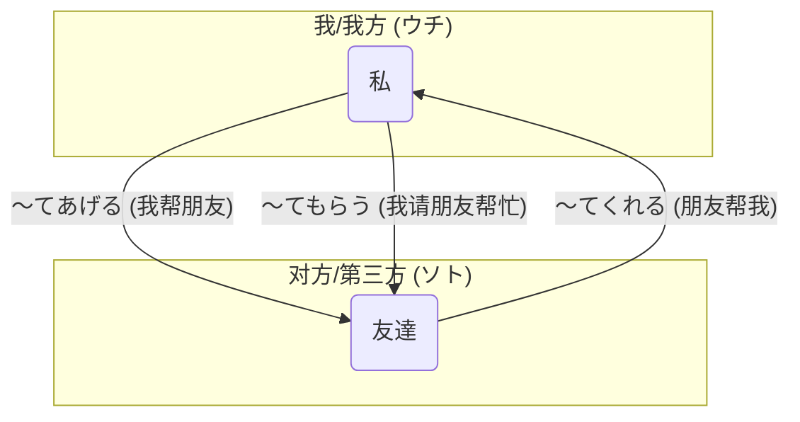

## 第八章：「可以帮我一下吗？」—— 行为的请求与恩惠

箱根之旅的第一天，在轻松愉快的氛围中进行着。

下午，大家来到了著名的雕刻之森美术馆。这里将艺术品巧妙地融入了自然景观之中，即便在微雨后的薄雾中，也显得格外有魅力。

凛酱被一座名为“网罗之森”的巨大网状攀爬艺术装置吸引，孩子们在其中欢快地嬉戏。

她举起刚在摄影社借来的单反相机，想要拍下这充满童趣的一幕。但相机的功能比她想象的要复杂得多，无论她怎么调整，拍出来的照片总是模糊不清。

她有些着急，看着不远处正在专心拍摄一座雕塑的美穗，犹豫着要不要过去求助。她该怎么说呢？“<ruby>教<rt>おし</rt></ruby>えますか？” (教吗？)听起来很奇怪。“<ruby>助<rt>たす</rt></ruby>けますか？”(帮忙吗？)也不对。她需要的是“请你为我做……”这个行为。

就在这时，小悠走了过来，看到了凛酱的窘境。“怎么了，凛酱？”

“小悠前辈……这个相机的用法，我不太懂……”凛酱有些不好意思地指着相机屏幕。

“啊，这个啊。美穗最擅长了，让她来教你吧。”小悠说着，就朝美穗招了招手，“美穗！ちょっといい？”

美穗走了过来，看到凛酱手里的相机，立刻明白了。“这个型号啊，光圈优先模式可能有点复杂。我来帮你看看吧。”

她没有直接拿过相机，而是温和地对凛酱说：“凛ちゃん、<ruby>私<rt>わたし</rt></ruby>が使い方を**<ruby>教<rt>おし</rt></ruby>えてあげる**よ。”(凛酱，我来教你怎么用吧。)

“**<ruby>教<rt>おし</rt></ruby>えてあげる**……”凛酱在心里默默重复着这个短语。动词的て形后面，接上了上一章学过的“**あげる**”。原来，不仅是物品，连“教”这个行为，也可以“给予”出去。

美穗的讲解非常清晰，她一边操作一边解释，很快凛酱就掌握了窍门。“哇，原来是这样！”凛酱试着拍了几张，照片果然清晰多了。

她发自内心地对美穗鞠了一躬：“ありがとうございます！<ruby>美穂<rt>みほ</rt></ruby>先輩が**<ruby>教<rt>おし</rt></ruby>えてくれて**、本当に助かりました！”(谢谢您！美穗前辈您教了我，真是帮大忙了！)

说出“**<ruby>教<rt>おし</rt></ruby>えてくれて**”这句话时，凛酱的心里涌起一股暖流。她下意识地用了“**くれる**”的て形，因为美穗“教”这个行为，是“由外向内”地惠及了自己。这个词，比单纯的“谢谢”，更能表达出那份感激之情。

希子在一旁拍下了凛酱认真学习相机的侧脸，然后把照片展示给大家看。“不错嘛，凛酱。很有摄影师的架势。”

小悠看着照片，突然想到一个主意：“对了！我们四个人在这里合个影吧！但是三脚架在旅馆里……路过的那位先生，看起来很和善，我们请他帮忙拍一下怎么样？”

希子点点头：“可以试试。”

小悠微笑着走向一位正在欣赏风景的男士，礼貌地问道：“すみません、<ruby>写真<rt>しゃしん</rt></ruby>を**<ruby>撮<rt>と</rt></ruby>ってもらえませんか**？” (不好意思，能麻烦您帮我们拍张照吗？)

“**<ruby>撮<rt>と</rt></ruby>ってもらえませんか**……”凛酱又听到了一个新鲜的组合。这次是动词て形加上了“**もらう**”的可能态否定问句。整个句子听起来非常委婉和客气，像是在询问“我能从您那里得到‘拍照’这个行为吗？”

那位男士欣然同意：“はい、いいですよ。”

在男士的帮助下，四位女孩留下了在箱根的第一张珍贵合影。照片里，每个人的脸上都洋溢着灿烂的笑容。

“ありがとうございました！”大家齐声道谢。

回到队伍中，凛酱忍不住向大家分享自己的发现：“刚才……我们好像把上一章学到的授受动词，都用在了‘行为’上。”

“观察得真仔细，凛酱！”小悠开心地说，“没错！‘**～てあげる**’、‘**～てくれる**’、‘**～てもらう**’，就是物品授受的升级版。它们传递的不仅仅是东西，更是人与人之间的帮助、恩惠和感谢。”

美穗在手机备忘录里，快速地整理出了这三者的关系。

**【行为授受的“内心戏”】**

| 句型 | 方向 | “内心戏”/潜台词 | 示例 |
| :--- | :--- | :--- | :--- |
| **～てあげる** | 由内向外 | “我（为你/他）做……”   (不求回报的善意，但对上级慎用) | 友達の宿題を**見てあげた**。 (我帮朋友看了作业。) |
| **～てくれる** | 由外向内 | “（他/你）为我做……”   (心中充满感激) | 先生が日本語を**教えてくれた**。 (老师教了我日语。) |
| **～てもらう** | 从外向内(主动获取)| “我请（他/你）为我做……”   (我主动请求并获得了帮助) | 医者に**診てもらった**。 (我请医生给我看了病。) |

希子补充了一个非常关键的点：“‘**～てあげる**’这个说法，要非常小心使用。因为它有一种‘我为你做了好事’的意味在里面，如果对长辈或者不熟的人用，会显得很傲慢，像是在施舍恩惠。”

“那如果我想主动为长辈做点什么，该怎么说呢？”凛酱问。

“很好的问题，”美穗回答，“可以说‘<ruby>私<rt>わたし</rt></ruby>がやりましょうか？’(我来做吧？)或者‘何か<ruby>手伝<rt>てつだ</rt></ruby>いましょうか？’(有什么需要帮忙的吗？)这样更谦虚和礼貌。”

凛酱用力地点点头，把这一点记在了心里。日语的敬意，真是体现在每一个细微的词语选择中。

傍晚，大家回到了充满日式风情的旅馆。  
晚饭前，小悠发现自己的浴衣带子怎么也系不好。“啊，这个<ruby>帯<rt>おび</rt></ruby>，好难啊！”她苦恼地叫着。

旅馆的女将（老板娘）恰好路过，看到了这一幕，微笑着走过来说：“あらあら、お<ruby>困<rt>こま</rt></ruby>りですか。私がお<ruby>結<rt>むす</rt></ruby>びしましょう。”(哎呀哎呀，遇到困难了吗？我来为您系上吧。)

女将熟练地帮小悠系好了漂亮的蝴蝶结。  
小悠连忙道谢：“わあ、ありがとうございます！<ruby>綺麗<rt>きれい</rt></ruby>に**<ruby>結<rt>むす</rt></ruby>んでくれて**！”

凛酱在一旁静静地看着。从美术馆的相机，到请求路人拍照，再到旅馆的浴衣带子，这一天里，她亲身感受了无数次“行为的授受”。她发现，这些看似复杂的语法，其实就是日本人日常生活中互相帮助、表达感谢时最自然的方式。它们不是冰冷的规则，而是一条条连接人心的温暖纽带。

---

### **核心语法总结：行为的请求与恩惠**

> 本章核心是将上一章学习的授受动词**`あげる`**、**`くれる`**、**`もらう`**与动词的**て形**相结合，构成**`～てあげる`**、**`～てくれる`**、**`～てもらう`**句型。这使得授受的对象从“物品”扩展到了“行为”，用以表达人与人之间互相帮助、提供便利等包含“恩惠”意味的动作。理解其方向性和语感，对于进行地道、有人情味的交流至关重要。

#### 今日关键词

*   **～てあげる (te ageru)**：为别人做某事。表示主语（我/我方）主动为他人（对方/第三方）进行某个行为。带有“施惠于人”的语感，对上级慎用。
*   **～てくれる (te kureru)**：别人为我做某事。表示他人（对方/第三方）为“我”或“我方”进行某个行为。句子中充满了感激之情。
*   **～てもらう (te morau)**：请别人为我做某事/得到别人的行为。表示主语（我/我方）主动请求或接受了他人的行为帮助。

#### 结构图

**行为授受的方向与视角**

*说明：此图直观地展示了行为授受的三个核心句型在“我”和“朋友”之间的方向性。注意`～てもらう`虽然方向是从外到内，但其主动发起请求的视角是从“我”出发的。*

#### 用法差异与语感

*   **主动与被动**：`～てくれる`和`～てもらう`都表示“别人为我做”，但`くれる`的句子主语是“行为的发出者”，感觉上是对方主动为我做；而`もらう`的句子主语是“行为的接受者（我）”，感觉上是我主动请求或安排后得到的帮助。
*   **请求的礼貌度**：在请求别人帮助时，`～てもらえませんか`或`～ていただけませんか`（`もらう`的可能态否定疑问形式）是非常常用的礼貌表达，比直接用命令形“～てください”要委婉得多。
*   **感谢的深度**：在表达感谢时，说“<ruby>教<rt>おし</rt></ruby>えてくれてありがとう”比单纯的“<ruby>教<rt>おし</rt></ruby>えてありがとう”更能传达出“你为我做了这件事，我真的很高兴”的感激之情。

#### 反模式与陷阱

1.  **对长辈滥用`～てあげる`**：这是最严重的社交失礼。对老师说「<ruby>先生<rt>せんせい</rt></ruby>の<ruby>荷物<rt>にもつ</rt></ruby>を**<ruby>持<rt>も</rt></ruby>ってあげます**。」(×) 是绝对禁止的。  
修复：应使用“～ましょうか？”句型，如「お<ruby>荷物<rt>にもつ</rt></ruby>、お<ruby>持<rt>も</rt></ruby>ちしましょうか？」(✓)。
2.  **混淆`てくれる`和`てもらう`的主语**：搞不清谁是句子的主语，导致助词`が`和`は`用错。  
修复：记住`くれる`的主语是“做事的人”，`もらう`的主语是“受益的人（我）”。
3.  **忽略了隐含的“恩惠”感**：在不需要表达恩惠的纯客观陈述中，滥用授受动词会显得很奇怪。  
修复：如果只是描述一个事实，比如“田中移动了桌子”，就用简单的：<ruby>田中<rt>たなか</rt></ruby>さんがテーブルを<ruby>動<rt>うご</rt></ruby>かしました。

#### 推荐练习题目

**基础入门（必做， 5 题）**
1.  **选择填空**：<ruby>友達<rt>ともだち</rt></ruby>が<ruby>宿題<rt>しゅくだい</rt></ruby>を（______）。(a) <ruby>手伝<rt>てつだ</rt></ruby>ってあげた (b) <ruby>手伝<rt>てつだ</rt></ruby>ってくれた (c) <ruby>手伝<rt>てつだ</rt></ruby>ってもらった (句意：朋友帮了我)
2.  **选择填空**：<ruby>私<rt>わたし</rt></ruby>は<ruby>妹<rt>いもうと</rt></ruby>に<ruby>数学<rt>すうがく</rt></ruby>を（______）。(a) <ruby>教<rt>おし</rt></ruby>えてあげた (b) <ruby>教<rt>おし</rt></ruby>えてくれた (c) <ruby>教<rt>おし</rt></ruby>えてもらった
3.  **选择填空**：すみません、この<ruby>漢字<rt>かんじ</rt></ruby>の<ruby>読<rt>よ</rt></ruby>み<ruby>方<rt>かた</rt></ruby>を（______）？ (a) <ruby>教<rt>おし</rt></ruby>えてあげますか (b) <ruby>教<rt>おし</rt></ruby>えてくれませんか
4.  **改错**：<ruby>先生<rt>せんせい</rt></ruby>が<ruby>私<rt>わたし</rt></ruby>の<ruby>作文<rt>さくぶん</rt></ruby>を<ruby>直<rt>なお</rt></ruby>してもらった。
5.  **完成句子**：<ruby>昨日<rt>きのう</rt></ruby>、お<ruby>母<rt>かあ</rt></ruby>さんに_________________てもらいました。(请根据自己情况填空)

**进阶推荐（3 题）**
1.  **听力辨析**：(听力脚本)「A: <ruby>山田<rt>やまだ</rt></ruby>さん、<ruby>駅<rt>えき</rt></ruby>まで<ruby>車<rt>くるま</rt></ruby>で<ruby>送<rt>おく</rt></ruby>ってくれてありがとう。B: ううん、いいよ。あ、<ruby>佐藤<rt>さとう</rt></ruby>さんは<ruby>田中<rt>たなか</rt></ruby>さんに<ruby>送<rt>おく</rt></ruby>ってもらったんだって。」 **问题**：是谁开车送了谁？
2.  **情景对话**：你的朋友感冒了，你想对他说“我给你买药吧？”，你会怎么说？
3.  **翻译**：请将“我请朋友帮忙搬家了”翻译成日语。

**应试高频（JLPT N4水平，2 题）**
1.  **语法选择**：<ruby>道<rt>みち</rt></ruby>がわからなかったので、<ruby>警察官<rt>けいさつかん</rt></ruby>に<ruby>地図<rt>ちず</rt></ruby>を（______）。(a) <ruby>書<rt>か</rt></ruby>いてあげた (b) <ruby>書<rt>か</rt></ruby>いてくれた (c) <ruby>書<rt>か</rt></ruby>いてもらった
2.  **句子排序**：＿＿＿　＿＿＿　＿＿＿　＿＿＿てくれませんか。(1. <ruby>貸<rt>か</rt></ruby>し 2. その 3. <ruby>本<rt>ほん</rt></ruby>を 4. ちょっと)

#### 参考答案要点

1.  **基础题1**：选b。主语是“朋友”，受益者是“我”，用`てくれる`。
2.  **基础题2**：选a。主语是“我”，受益者是“妹妹”（外），用`てあげる`。
3.  **基础题3**：选b。`てくれませんか`是礼貌的请求。
4.  **基础题4**：主语应该是“我”。改为「<ruby>私<rt>わたし</rt></ruby>は<ruby>先生<rt>せんせい</rt></ruby>に<ruby>作文<rt>さくぶん</rt></ruby>を<ruby>直<rt>なお</rt></ruby>してもらった。」
5.  **基础题5**：(开放答案) 例：<ruby>晩<rt>ばん</rt></ruby>ご<ruby>飯<rt>はん</rt></ruby>を<ruby>作<rt>つく</rt></ruby>っ
6.  **进阶题1**：山田开车送了A，田中开车送了佐藤。
7.  **进阶题3**：<ruby>友達<rt>ともだち</rt></ruby>に<ruby>引<rt>ひ</rt></ruby>っ<ruby>越<rt>こ</rt></ruby>しを<ruby>手伝<rt>てつだ</rt></ruby>ってもらいました。
8.  **应试题1**：选c。主语是（我），从警察那里得到了“画地图”这个帮助，用`てもらう`。
9.  **应试题2**：正确顺序为`2-3-4-1`。句子为 「その<ruby>本<rt>ほん</rt></ruby>をちょっと<ruby>貸<rt>か</rt></ruby>してくれませんか。」(能借我一下那本书吗？)

### 🍒 凛酱的日语小记

今天在箱根的经历太丰富了！不仅是眼睛，连心灵都感受到了很多。原来“帮助”也可以像礼物一样传来递去。美穗前辈教我拍照(てくれる)，我请路人帮忙合影(てもらう)。这些词语让每一次感谢都变得好有温度。感觉自己离真正的日语又近了一步。

> 当“给予”和“接受”的对象从物品变成行为，语言便拥有了传递善意与感激的温度。每一次`～てくれる`的背后，都有一份温暖；每一次`～てもらう`的达成，都源于一份信赖。