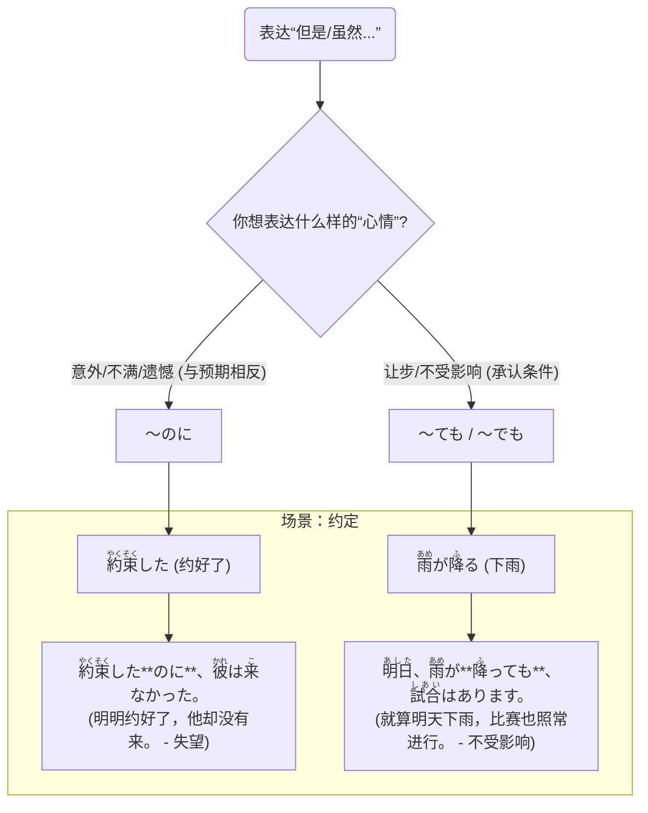

## 第六章：「明明约好了……」—— 逆接的叹息与转折

十一月的最后一个周末，天气预报连续几天都显示着一个灿烂的小太阳标志。这正是“樱下学习社”期待已久的箱根之旅。然而，周六一大早，凛酱拉开窗帘时，看到的却是灰蒙蒙的天空和淅淅沥沥的雨丝。

社团的Line群里，气氛顿时有些低落。

小悠发来一个哭泣的表情包：「<ruby>天気予報<rt>てんきよほう</rt></ruby>は<ruby>晴<rt>は</rt></ruby>れだった**のに**、<ruby>雨<rt>あめ</rt></ruby>が<ruby>降<rt>ふ</rt></ruby>っています…」(天气预报明明是晴天，却下雨了……)

凛酱看着小悠的这句话，心里也涌起同样的感受。那个“**のに**”，像一声小小的叹息，完美地表达了“与期待相反”的失望和一点点抱怨。

希子很快发来了新的消息：「<ruby>雨<rt>あめ</rt></ruby>が**<ruby>降<rt>ふ</rt></ruby>っても**、<ruby>箱根<rt>はこね</rt></ruby>の<ruby>美術館<rt>びじゅつかん</rt></ruby>や<ruby>温泉<rt>おんせん</rt></ruby>は<ruby>楽<rt>たの</- rt></ruby>しめるよ。」(即使下雨，箱根的美术馆和温泉也还是能享受的哦。)

美穗没有参与天气的话题，而是发了一张她正在收拾行李的照片，照片里有一个小小的防水背包和一把折叠伞。

「こういう<ruby>日<rt>ひ</rt></ruby>もあるかと<ruby>思<rt>おも</rt></ruby>って、<ruby>準備<rt>じゅんび</rt></ruby>しておいてよかった。」(想着也可能会有这种天气，提前准备了真是太好了。)

小悠显然还是有些闷闷不乐，她又发了一句：「でも、<ruby>昨日<rt>きのう</rt></ruby>あんなに<ruby>一生懸命<rt>いっしょうけんめい</rt></ruby>パッキングした**のに**…<ruby>雨<rt>あめ</rt></ruby>だと<ruby>写真<rt>しゃしん</rt></ruby>がきれいじゃないかも。」(可是，昨天明明那么努力地打包了行李……下雨的话，照片可能就不漂亮了。)

凛酱很理解小悠的心情，她也想说些什么来安慰，但又不知道怎么说。她觉得“**のに**”这个词好像有魔力，能把人心里的委屈和不甘都引出来。

就在这时，美穗突然在群里讲起一件看似毫不相关的事。

「<ruby>急<rt>きゅう</rt></ruby>に<ruby>思<rt>おも</rt></ruby>い<ruby>出<rt>だ</rt></ruby>したんだけど、<ruby>私<rt>わたし</rt></ruby>、<ruby>小学生<rt>しょうがくせい</rt></ruby>の<ruby>時<rt>とき</rt></ruby>、テストで０<ruby>点<rt>てん</rt></ruby>を<ruby>取<rt>と</rt></ruby>ったことがあるの。<ruby>名前<rt>なまえ</rt></ruby>を<ruby>書<rt>か</rt></ruby>き<ruby>忘<rt>わす</rt></ruby>れて。」(突然想起来，我小学的时候，有次考试得了0分。因为忘了写名字。)

群里安静了几秒，然后小悠发了个“欸？！”的惊讶表情。

美穗继续说道：「前の<ruby>日<rt>ひ</rt></ruby>までちゃんと<ruby>勉強<rt>べんきょう</rt></ruby>した**のに**、<ruby>全部<rt>ぜんぶ</rt></ruby>パーになっちゃって。あの<ruby>時<rt>とき</rt></ruby>はすごく<ruby>泣<rt>な</rt></ruby>いたなあ。」(明明直到前一天都好好复习了，却全都白费了。那时候哭得好伤心啊。)

看到这里，凛酱突然感觉心里某个地方被触动了。原来美穗前辈也有过这种经历。这种“明明努力了，却没有得到好结果”的心情，和现在大家面对这场雨的心情，竟然是相通的。

小悠似乎也感同身受，发了一句：「わかる！<ruby>私<rt>わたし</t></ruby>なんて、<ruby>昨日<rt>きのう</rt></ruby>８<ruby>時間<rt>じかん</rt></ruby>も **<ruby>寝<rt>ね</rt></ruby>たのに** 、まだ<ruby>眠<rt>ねむ</rt></ruby>いもん。」(我懂！我啊，昨天明明睡了8个小时，却还是好困。)

群里的气氛，在这场小小的“のに”故事分享会中，竟然渐渐缓和了过来。凛酱发现，这个词虽然包裹着遗憾，但当大家一起分享这种遗憾时，它似乎也变成了一种连接彼此情感的纽带。

“不过，”希子的消息再次出现，像一股清流，“いくら<ruby>雨<rt>あめ</rt></ruby>が**<ruby>強<rt>つよ</rt></ruby>くても**、もう<ruby>電車<rt>でんしゃ</rt></ruby>のチケットは<ruby>買<rt>か</rt></ruby>っちゃったから、<ruby>行<rt>い</rt></ruby>くしかないでしょう。」(无论雨下得多大，电车票已经买了，只能去了吧。)

美穗也紧跟着回复：「そうね。<ruby>寒<rt>さむ</rt></ruby>く**ても**、<ruby>楽<rt>たの</rt></ruby>しい<ruby>気持<rt>きも</rt></ruby>ちでいれば、<ruby>体<rt>からだ</rt></ruby>は<ruby>温<rt>あたた</rt></ruby>かくなるはず。」(是啊。就算冷，只要保持愉快的心情，身体应该也会暖和起来的。)

凛酱看着她们的对话，感觉心里豁然开朗。希子前辈和美穗前辈，都在用“**ても**”这个词，像是在宣告“没关系，就算这样，我们也能……”。它不否定困难，但也不向困难屈服。

她想起了自己最近遇到的一个烦恼。她很努力地练习口语，甚至鼓起勇气去和研究室的日本同学搭话，可对方似乎总是没什么反应，这让她很受挫。她一直想把这种心情告诉大家，却不知如何表达。

现在，她似乎找到了最合适的词语。她深吸一口气，在群里打下了一行字。

「<ruby>私<rt>わたし</rt></ruby>も…<ruby>勇気<rt>ゆうき</rt></ruby>を<ruby>出<rt>だ</rt></ruby>して<ruby>話<rt>はな</rt></ruby>しかけた**のに**、あまり<ruby>反応<rt>はんのう</rt></ruby>がなくて、ちょっと<ruby>悲<rt>かな</rt></ruby>しかったです。」 (我也是……明明鼓起勇气去搭话了，对方却没什么反应，感觉有点难过。)

发出去的瞬间，她有些紧张。但很快，小悠的回复就来了。

「そっか…そういうことあるよね。でも、たとえ<ruby>反応<rt>はんのう</rt></ruby>が**<ruby>薄<rt>うす</rt></ruby>くても**、凛ちゃんが<ruby>話<rt>はな</rt></ruby>しかけたっていう<ruby>事実<rt>じじつ</rt></ruby>は<ruby>変<rt>か</rt></ruby>わらないよ！それはすごいことだよ！」  
(这样啊……常有这种事呢。不过，就算对方反应冷淡，凛酱你去搭话了这个事实是不会改变的！这本身就很厉害了！)

看到小悠的回复，凛酱的眼眶突然有点湿润。小悠的“**ても**”，就像一只温暖的手，抚平了她“**のに**”所带来的委屈。

她明白了。语言不仅是用来描述世界的，更是用来回应世界的。面对同样一件令人沮丧的事，有人用`のに`来共情你的失落，也有人用`ても`来点燃你的勇气。

最终，大家一致决定，风雨无阻，按计划出发。

在摇晃的电车上，凛酱看着窗外被雨水冲刷得格外青翠的山峦，在自己的语法手帐上，写下了今天最大的收获。她想，人生就像天气一样，总有不期而遇的雨天。面对这些意料之外的时刻，是停留在“**のに**”的遗憾里，还是选择“**ても**”的坚韧，或许正是成长的意义所在。

---

### **核心语法总结：逆接的叹息与转折**

> 本章核心是日语中表达“逆接”关系（即转折）的两种重要句型：**`～のに`** 和 **`～ても/でも`**。`～のに` 主要用于表达结果与预期相反时产生的**遗憾、不满、意外**等负面情绪，像一声叹息。而`～ても/でも`则用于表示**让步**，承认某个条件，但强调结果不受其影响，更偏向积极的转折或假设。

#### 今日关键词

*   **～のに (noni)**：逆接助词，表达“明明……却……”。强烈暗示结果与说话人的期待或常识相悖，常带有失望、抱怨的色彩。
*   **～ても/でも (temo/demo)**：逆接助词，表达“即使/就算……也……”。用于提出一个既定或假设的条件，并引出一个不受该条件影响的结果。
*   **心情色彩**：`のに` 通常指向过去已发生的事实，是消极的、充满遗憾的。`ても/でも` 通常指向未来或假设，是积极的、表示应对和决心的。

#### 结构图

*说明：此图通过“约定”和“下雨”两个场景，清晰地展示了`のに`和`ても`在表达不同心理状态时的选择路径。*

#### 用法差异与语感

*   **句末内容限制**：`のに`的后半句通常是描述一个与前半句相悖的、令人失望或意外的客观事实。不能接说话人的意志、命令、请求等。例如，不能说「<ruby>寒<rt>さむ</rt></ruby>いのに、<ruby>窓<rt>まど</rt></ruby>を<ruby>閉<rt>し</rt></ruby>めてください。」(×)。
*   **`ても/でも`的灵活性**：`ても/でも`的后半句则非常灵活，可以接任何内容，包括意志、命令、请求等。例如，「<ruby>寒<rt>さむ</rt></ruby>くても、<ruby>我慢<rt>がまん</rt></ruby>してください。」(✓) (就算冷，也请忍耐一下。)
*   **接续规则**：`のに`连接名词和な形容词时用`な` (`～なのに`)。`ても/でも`则根据词性有不同接续：动词`て形+も`，い形容词`くて+も`，名词/な形容词`+でも`。

#### 反模式与陷阱

1.  **在表达意志的句子里误用`のに`**：想说“虽然贵，但我想买”，错误地说成「<ruby>高<rt>たか</rt></ruby>いのに、<ruby>買<rt>か</rt></ruby>いたいです。」(×)。  
修复：牢记`のに`后面不接主观意志，应改为「<ruby>高<rt>たか</rt></ruby>くても、<ruby>買<rt>か</rt></ruby>いたいです。」(✓)。
2.  **接续形式混淆**：把`<ruby>静<rt>しず</rt></ruby>かなのに`错当成`<ruby>静<rt>しず</rt></ruby>かのに`。  
修复：记住`のに`的接续和`ので`一样，名词/な形后加`な`。
3.  **忽略了`のに`的抱怨语气**：在需要客观陈述转折时，滥用`のに`可能会让听者觉得你在抱怨。  
修复：如果只是单纯转折，没有强烈的意外或不满，使用`が`或`けど`更中性。

#### 推荐练习题目

**基础入门（必做，5 题）**
1.  **选择填空**：<ruby>薬<rt>くすり</rt></ruby>を<ruby>飲<rt>の</rt></ruby>んだ（______）、ぜんぜんよくなりません。(a) のに (b) ても)
2.  **选择填空**：いくら<ruby>電話<rt>でんわ</rt></ruby>を（______）、<ruby>彼<rt>かれ</rt></ruby>は<ruby>出<rt>で</rt></ruby>ません。(a) したのに (b) しても
3.  **完成句子**：<ruby>日曜日<rt>にちようび</rt></ruby>なのに、_________________。(请填入一个与“周日”这个印象相反的事实)
4.  **改错**：このケーキは<ruby>好<rt>す</rt></ruby>きじゃないのに、<ruby>食<rt>た</rt></ruby>べたいです。
5.  **句型转换**：将「<ruby>彼<rt>かれ</rt></ruby>は<ruby>子<rt>こ</rt></ruby>どもですが、よく<ruby>知<rt>し</rt></ruby>っています。」用`～でも`改写。

**进阶推荐（3 题）**
1.  **情景表达**：你花了很多钱买了一件名牌衣服，结果第一次穿就破了。请用`のに`来表达你的心情。
2.  **情景表达**：你的朋友邀请你明天去爬山，但天气预报说明天可能下雨。请用`ても`来表达你“风雨无阻”的决心。
3.  **翻译**：请将“明明是他错了，却不道歉”翻译成日语。

**应试高频（JLPT N4水平，2 题）**
1.  **语法选择**：この<ruby>問題<rt>もんだい</rt></ruby>は（______）、よく<ruby>考<rt>かんが</rt></ruby>えればわかります。(a) <ruby>複雑<rt>ふくざつ</rt></ruby>なのに (b) <ruby>複雑<rt>ふくざつ</rt></ruby>でも (c) <ruby>複雑<rt>ふくざつ</rt></ruby>だから
2.  **句子排序**：＿＿＿　＿＿＿　＿＿＿　＿＿＿のに、まだ<ruby>眠<rt>ねむ</rt></ruby>いです。(1. たくさん 2. <ruby>寝<rt>ね</rt></ruby>た 3. <ruby>昨日<rt>きのう</rt></ruby>は 4. ８<ruby>時間<rt>じかん</rt></ruby>も)

#### 参考答案要点

1.  **基础题1**：选a。表达“吃了药（本该好转），却没好”的失望。
2.  **基础题2**：选b。`いくら～ても`是固定搭配，表示“无论怎么……也……”。
3.  **基础题3**：(开放答案) 例：<ruby>仕事<rt>しごと</rt></ruby>をしなければなりません。
4.  **基础题4**：`のに`后不能接意志。应改为「<ruby>好<rt>す</rt></ruby>きじゃないですが、<ruby>食<rt>た</rt></ruby>べなければなりません。」或类似表达。
5.  **基础题5**：<ruby>彼<rt>かれ</rt></ruby>は<ruby>子<rt>こ</rt></ruby>どもでも、よく<ruby>知<rt>し</rt></ruby>っています。
6.  **进阶题3**：<ruby>彼<rt>かれ</rt></ruby>が<ruby>悪<rt>わる</rt></ruby>いのに、<ruby>謝<rt>あやま</rt></ruby>りません。
7.  **应试题1**：选b。后半句是积极结果，表示让步，应用`ても/でも`。`<ruby>複雑<rt>ふくざつ</rt></ruby>`是な形容词，用`でも`。
8.  **应试题2**：正确顺序为`3-4-1-2`。句子为 `<ruby>昨日<rt>きのう</rt></ruby>は８<ruby>時間<rt>じかん</rt></ruby>もたくさん<ruby>寝<rt>ね</rt></ruby>たのに、まだ<ruby>眠<rt>ねむ</rt></ruby>いです。` (昨天明明睡了足足8个小时，却还是很困)。

### 🍒 凛酱的日语小记

我们的箱根之旅在一场雨中开始了！天气预报明明是晴天（のに）… 但即使下雨（ても）、大家的心情还是很激动！今天不仅学到了语法，还感受到了语言的力量。一句“のに”能引来大家的共鸣，一句“ても”又能给人带来勇气。我也想成为这样的人。

> 语言是为心情寻找最合适的容器。面对生活中的不如意，是选择用`のに`来盛放遗憾，还是用`ても`来装满前行的勇气，每一次选择，都在塑造着我们自己。