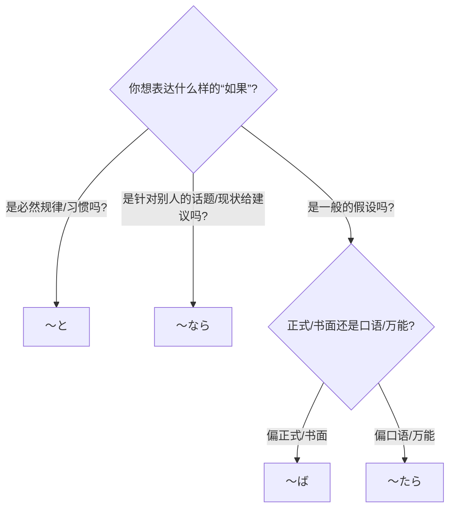

## 第十四章：「假如……会怎样？」—— 条件句的四重奏

大一下学期的课程全部结束，凛酱和社团成员们迎来了期待已久的寒假。虽然没有了日常的见面机会，但“樱下学习社”的线上群组却因为一个新议题而变得格外热闹——策划一场春假期间的“樱花之旅”。

这天晚上，凛酱正趴在温暖的被炉里，看着大家在群里七嘴八舌地讨论着。

小悠第一个抛出了一个充满浪漫色彩的设想：
「<ruby>春<rt>はる</rt></ruby>に**なると**、<ruby>桜<rt>さくら</rt></ruby>が<ruby>咲<rt>さ</rt></ruby>くね。<ruby>京都<rt>きょうと</rt></ruby>の<ruby>哲学<rt>てつがく</rt></ruby>の<ruby>道<rt>みち</rt></ruby>を<ruby>歩<rt>ある</rt></ruby>きたいな。」(一到春天，樱花就会开呢。好想去走一走京都的哲学之道啊。)

希子则从更实际的角度提出了她的看法：
「でも、<ruby>京都<rt>きょうと</- rt></ruby>は<ruby>人気<rt>にんき</rt></ruby>だから、<ruby>早<rt>はや</rt></ruby>く<ruby>予約<rt>よやく</rt></ruby>しないとホテルが<ruby>取<rt>と</rt></ruby>れないよ。<ruby>安<rt>やす</rt></ruby>いホテルが**あれば**、すぐ<ruby>教<rt>おし</rt></ruby>えて。」(但是，京都很热门，不早点预订的话就订不到酒店了哦。如果有便宜的酒店，马上告诉我。)

美穗则在考虑时间安排的问题：
「みんなのスケジュールが **<ruby>合<rt>あ</rt></ruby>ったら**、<ruby>３<rt>さん</rt></ruby><ruby>月<rt>がつ</rt></ruby>の<ruby>末<rt>すえ</rt></ruby>がいいと<ruby>思<rt>おも</rt></ruby>う。<ruby>飛行機<rt>ひこうき</rt></ruby>のチケット、<ruby>私<rt>わたし</rt></ruby>が<ruby>調<rt>しら</- rt></ruby>べてみるね。」(如果大家的时间能对上的话，我觉得3月底比较好。机票我来查查看吧。)

凛酱看着大家的发言，心里也开始盘算起来。她很想去京都，但作为留学生，她最关心的是预算。她想，如果这次旅行能定下来，她就要开始更努力地打工存钱了。

于是，她在群里打下了一行字：
「もし<ruby>京都<rt>きょうと</- rt></ruby>へ<ruby>行<rt>い</rt></ruby>く**なら**、<ruby>私<rt>わたし</rt></ruby>、もっとアルバイトを<ruby>頑張<rt>がんば</rt></ruby>ります！」(如果要去京都的话，我会更努力地打工的！)

发完消息后，凛酱看着屏幕上大家刚刚用过的四个词——小悠的“**と**”，希子的“**ば**”，美穗的“**たら**”，还有自己的“**なら**”——陷入了沉思。

这四个词，翻译成中文，似乎都可以是“如果……就……”。但为什么在刚才的对话中，大家会不约而同地做出不同的选择呢？它们之间一定存在着某种微妙的逻辑差异，就像四把功能各异的钥匙，分别对应着四种不同类型的“假如”。

这个困惑，在她脑中盘旋了一整晚。

第二天下午，社团的四人约在学校附近的一家咖啡馆见面，正式召开“春假旅行企划会”。凛酱迫不及待地把自己的疑问抛了出来。

“那个……我发现，昨天大家在说‘如果’的时候，用了**と**、**ば**、**たら**、**なら**四种不同的说法。它们到底有什么不一样呢？”

美穗笑了，她就知道凛酱会注意到这个。“凛酱，你触碰到了日语学习中一个非常经典，也让很多人头疼的部分——条件句的‘四重奏’。它们确实很像，但各自的‘演奏规则’完全不同。”

她没有直接开始讲解，而是从昨晚小悠的话入手。 “我们先来看小悠说的，‘<ruby>春<rt>はる</rt></ruby>に**なると**、<ruby>桜<rt>さくら</rt></ruby>が<ruby>咲<rt>さ</rt></ruby>く’。凛酱，你觉得这个‘如果’，是一种什么样的‘如果’？”

凛酱想了想：“嗯……‘春天到了，樱花就开’，这像是一个……不会改变的真理？或者说，一种自然规律。”

“完全正确！”小悠高兴地说，“‘**と**’就是这四把钥匙里最‘死板’的一把。它连接的，几乎都是**恒定的真理、自然现象、或者机器的操作步骤**。只要前一个条件成立，后一个结果就**百分之百会发生**，没有任何意外。”

她举了个例子：“比如，‘このボタンを<ruby>押<rt>お</rt></ruby>す**と**、ドアが<ruby>開<rt>あ</rt></ruby>きます’ (一按这个按钮，门就会打开)。这是一种必然。所以，‘**と**’的后面，不能跟说话人的意志、命令、请求这些主观的东西。”

“那希子前辈的‘**あれば**’呢？”

“‘**ば**’这把钥匙，我们称之为‘纯粹的假定’。”希子解释道，“它只专注于‘如果A条件成立’这个纯粹的逻辑假设，然后引出通常情况下会发生的结果。它比‘**と**’的限制要松一些，后面可以跟好的结果。”

她指着菜单说：“比如，‘<ruby>時間<rt>じかん</rt></ruby>が**あれば**、デザートも<ruby>食<rt>た</rt></ruby>べたいですね’ (有时间的话，真想也吃个甜点呢)。但是，‘**ば**’有一个特点，它的前后主语最好保持一致。而且，如果前半句是形容词或名词，后半句也不能跟表示过去的句子。”

“听起来‘**ば**’的规矩还挺多的。”凛酱说。

“所以，我们有了一把‘万能钥匙’——‘**たら**’！”美穗接过了话头，“‘**たら**’是这四种用法里最灵活、最常用、限制最少的。它可以用于**任何类型的假定**，无论是假设未来、与事实相反的过去，还是一个动作完成之后。而且，它的后半句可以接任何内容，意志、命令、请求，通通没问题。”

她把昨晚自己的话又说了一遍：“‘みんなのスケジュールが **<ruby>合<rt>あ</rt></ruby>ったら**、<ruby>３<rt>さん</rt></ruby><ruby>月<rt>がつ</rt></ruby>の<ruby>末<rt>すえ</rt></ruby>がいいと<ruby>思<rt>おも</rt></ruby>う’。这里就是对未来的一个纯粹假设。再比如，‘<ruby>日本<rt>にほん</rt></ruby>に **<ruby>来<rt>き</rt></ruby>たら**、ぜひ<ruby>連絡<rt>れんらく</rt></ruby>してください’(要是来日本了，请一定联系我)。你看，后面可以跟请求。”

“所以，如果我不确定用哪个，用‘**たら**’总不会错？”凛酱找到了一个“偷懒”的方法。

“在口语里，基本是这样。”美穗笑着肯定，“但我们还有一个‘**なら**’，对吧？凛酱，你昨晚就用得非常地道。”

“欸？是吗？”凛酱有些不好意思。

“‘**なら**’这把钥匙非常特别，”小悠解释道，“它不是对一个凭空的条件做假设，而是**针对对方刚刚说的话题，或者眼前已经出现的状况，来提出自己的建议、意见或判断**。”

她指着凛酱说：“昨天，我们大家都在讨论‘去京都’这件事，这个话题已经摆在桌子上了。所以，凛酱你接下来说‘如果（你们说的是去京都这件事）**なら**，我就去打工’，这个用法就非常自然。‘**なら**’就像一个对话的接力棒。”

美穗在餐巾纸上，画出了这四把钥匙的“使用说明书”。

**【条件句四重奏】**

| 条件句 | 核心功能 | 语感/限制 |
| :--- | :--- | :--- |
| **～と** | **恒定真理/必然结果** | 客观、硬性。后半句不能接意志、命令、请求。 |
| **～ば** | **纯粹假定** | 逻辑性强。前后主语倾向一致，有一些时态限制。 |
| **～たら** | **万能假定** | 最常用、最灵活。几乎没限制，口语首选。 |
| **～なら** | **话题承接/建议** | 承接对方话题，给出自己的看法。 |

凛酱看着这张简洁的表格，感觉脑中混乱的线索终于被整理清晰了。

“好了，企划会继续！”希子拍了拍手，“我们现在已经假定要去京都了。那我们就来玩一个‘京都<ruby>旅行<rt>りょこう</rt></ruby>シミュレーション (模拟)’游戏吧。每个人用上今天讨论的条件句，来描述一个你在京都可能会遇到的情况和应对。”

希子第一个开始：“<ruby>桜<rt>さくら</rt></ruby>の<ruby>季節<rt>きせつ</rt></ruby>は<ruby>観光客<rt>かんこうきゃく</rt></ruby>が<ruby>多<rt>おお</rt></ruby>い。もしバスが **<ruby>来<rt>こ</rt></ruby>なかったら**、<ruby>私<rt>わたし</rt></ruby>は<ruby>地下鉄<rt>ちかてつ</rt></ruby>で<ruby>行<rt>い</rt></ruby>く。”(樱花季游客很多。如果公交车不来的话，我就坐地铁去。) —— 万能的`たら`。

小悠接着说：“<ruby>清水寺<rt>きよみずでら</rt></ruby>の<ruby>舞台<rt>ぶたい</rt></ruby>は、<ruby>高<rt>たか</rt></ruby>いところが<ruby>苦手<rt>にがて</rt></ruby>**なら**、<ruby>下<rt>した</rt></ruby>から<ruby>見<rt>み</- rt></ruby>るだけでもきれいだよ。”(清水寺的舞台，如果（你）不擅长高处的话，只从下面看看也很美哦。) —— 承接“不擅长高处的人”这个话题的建议`なら`。

美穗看着窗外：“<ruby>天気<rt>てんき</rt></ruby>が**よければ**、<ruby>嵐山<rt>あらしやま</rt></ruby>でボートに<ruby>乗<rt>の</rt></ruby>りましょう。”(如果天气好的话，我们去岚山划船吧。) —— 纯粹的假定`ば`。

轮到凛酱了。她想到了一个最简单也最真实的场景，说道：「お<ruby>金<rt>かね</rt></ruby>が**なくなると**、<ruby>旅行<rt>りょこう</rt></ruby>は<ruby>終<rt>お</rt></ruby>わりです。」(钱一旦没了，旅行就结束了。) —— 略带悲伤的必然结果`と`。

大家听完都忍不住笑了起来。一场关于旅行的讨论，不知不觉间，变成了一场生动的条件句实战演练。凛酱觉得，这四把钥匙，她已经能分清哪一把该插进哪一把锁里了。

---

### **核心语法总结：条件句的四重奏**

> 本章核心是日语中表示“如果……就……”的四种基本条件表达方式：**`～と`**、**`～ば`**、**`～たら`**、**`～なら`**。它们虽然中文意思相近，但在使用的**场景、逻辑关系、以及对后半句内容的限制**上存在显著差异。掌握这“四重奏”的区别，是进行严谨、自然地逻辑表达的基石。

#### 今日关键词

*   **～と**：恒定的、必然的条件。用于连接自然规律、机器操作、习惯等“只要A，必然B”的关系。后半句不能是主观意志。

*   **～ば**：纯粹的、假定的条件。用于一般的假定情况。使用上有一些限制，如前后主语倾向一致。

*   **～たら**：万能的、口语化的条件。使用范围最广，限制最少，可以用于任何假定情况。后半句可以接任何内容。

*   **～なら**：承接话题的、建议性的条件。用于针对对方提出的信息或当前状况，给出自己的建议或判断。

#### 条件句的选择路径

*说明：此图提供了一个简单的决策流程，帮助学习者根据不同的语境和逻辑关系，选择最合适的条件句形式。*

#### 用法差异与语感

*   **关注点不同**：`と`和`ば`更关注前后句的逻辑关联性。`たら`更关注前一个动作完成的时间点（A做完之后，就做B）。`なら`则完全关注对方的话题。

*   **前后时态**：`と`和`ば`的前后半句时态通常保持逻辑上的一致。`たら`的前半句永远是た形（表完成），所以它可以清晰地表达“做完A之后”的含义。

*   **发现**：当后半句是表示“发现”的过去式时，常用`と`和`たら`。例：「<ruby>窓<rt>まど</rt></ruby>を<ruby>開<rt>あ</rt></ruby>ける**と**、<ruby>雪<rt>ゆき</rt></ruby>が<ruby>降<rt>ふ</rt></ruby>っていた。」(一打开窗，发现正在下雪。)

#### 反模式与陷阱

1.  **在必然结果处用`たら`**：虽然`たら`万能，但在描述科学真理时（如“水到100度就会开”），用`と`是最高级的、最准确的表达。

2.  **`ば`的接续和限制混乱**：忘记了`ば`对前后主语、时态的限制，导致句子不自然。  
修复：在不确定时，用万能的`たら`来替代。

3.  **`なら`的前置话题缺失**：在没有上下文的情况下，突然使用`なら`会让人摸不着头脑。  
修复：记住`なら`是“接力棒”，必须有人先把棒子递给你。

4.  **`と`后面接意志**：这是最经典的错误。例如：「<ruby>春<rt>はる</rt></ruby>になると、<ruby>旅行<rt>りょこう</rt></ruby>に<ruby>行<rt>い</rt></ruby>きたい。」(×)   
修复：改为「<ruby>春<rt>はる</rt></ruby>になったら、<ruby>旅行<rt>りょこう</rt></ruby>に<ruby>行<rt>い</rt></ruby>きたい。」(✓)。

#### 推荐练习题目

**基础入门（必做，5 题）**
1.  **选择填空**  
    この<ruby>角<rt>かど</rt></ruby>を<ruby>曲<rt>ま</rt></ruby>がる（______）、<ruby>駅<rt>えき</rt></ruby>があります。  
    (a) と (b) ば (c) なら

2.  **选择填空**  
    <ruby>明日<rt>あした</rt></ruby><ruby>雨<rt>あめ</rt></ruby>が（______）、<ruby>試合<rt>しあい</rt></ruby>は<ruby>中止<rt>ちゅうし</rt></ruby>です。  
    (a) <ruby>降<rt>ふ</rt></ruby>るなら (b) <ruby>降<rt>ふ</rt></ruby>れば (c) <ruby>降<rt>ふ</rt></ruby>ったら

3.  **选择填空**  
    A:「<ruby>来週<rt>らいしゅう</rt></ruby>、<ruby>北海道<rt>ほっかいどう</rt></ruby>へ<ruby>行<rt>い</rt></ruby>きます。」 B:「<ruby>北海道<rt>ほっかいどう</rt></ruby>へ<ruby>行<rt>い</rt></ruby>く（______）、このお<ruby>菓子<rt>かし</rt></ruby>を<ruby>買<rt>か</rt></ruby>ってきてください。」  
    (a) と (b) たら (c) なら

4.  **改错**  
    <ruby>安<rt>やす</rt></ruby>いと、<ruby>買<rt>か</rt></ruby>います。

5.  **完成句子**  
    <ruby>大学<rt>だいがく</rt></ruby>を<ruby>卒業<rt>そつぎょう</rt></ruby>したら、_________________。 (请根据自己情况填空)

**进阶推荐（3 题）**
1.  **情景表达**  
    给一个要去日本旅游的朋友提建议。请用`なら`开头，向他推荐一个你觉得必去的地方或必吃的美食。

2.  **语感辨析**  
    请解释「<ruby>薬<rt>くすり</rt></ruby>を<ruby>飲<rt>の</rt></ruby>めば、よくなります。」和「<ruby>薬<rt>くすり</rt></ruby>を<ruby>飲<rt>の</rt></ruby>んだら、よくなりました。」在时间和语感上的不同。

3.  **翻译**  
    请将“如果不快点的话，就要迟到了哦”翻译成日语。

**应试高频（JLPT N4水平，2 题）**
1.  **语法选择**  
    <ruby>押<rt>お</rt></ruby>す（______）<ruby>音<rt>おと</rt></ruby>が<ruby>出<rt>で</rt></ruby>ない<ruby>場合<rt>ばあい</rt></ruby>は、<ruby>電池<rt>でんち</rt></ruby>を<ruby>交換<rt>こうかん</rt></ruby>してください。  
    (a) と (b) ても (c) たら

2.  **句子排序**  
    ＿＿＿　＿＿＿　＿＿＿　＿＿＿なら、このバスで<ruby>行<rt>い</rt></ruby>けますよ。  
    (1 <ruby>市役所<rt>しやくしょ</rt></ruby>へ 2. あのう、 3. <ruby>行<rt>い</rt></ruby>きたいんですが 4. <ruby>ええと<rt>、</rt></ruby>)

#### 参考答案要点

1.基础题1：「と」。表示道案内（指路）时的必然结果。  
2.  基础题2：「<ruby>降<rt>ふ</rt></ruby>ったら」。最常见、最自然的未来假设。  
3.  基础题3：「なら」。承接对方“去北海道”的话题。  
4.  基础题4：「<ruby>安<rt>やす</rt></ruby>ければ、<ruby>買<rt>か</rt></ruby>います。」或「<ruby>安<rt>やす</rt></ruby>かったら、<ruby>買<rt>か</rt></ruby>います。」。`と`后面不能接意志。  
5.  基础题5：(开放答案) 例：「<ruby>国<rt>くに</rt></ruby>へ<ruby>帰<rt>かえ</rt></ruby>るつもりです。」  
6.  进阶题2：前者`ば`是一般性假定，“（通常情况下）吃了药病就会好”。后者`たら`是陈述一次具体的经历，“（上次）我吃了药之后，病就好了”。  
7.  进阶题3：「<ruby>急<rt>いそ</rt></ruby>がないと、<ruby>遅刻<rt>ちこく</rt></ruby>しますよ。」(这里`と`的用法，是固定搭配，表示“如果不做A，就会发生B(不好的结果)”)  
8.  应试题1：「ても」。`押しても音が出ない場合`意为“即使按了也不出声的情况下”，是让步条件。  
9.  应试题2：正确顺序为`2-4-1-3`。构成一个完整的问路场景:「あのう、ええと、<ruby>市役所<rt>しやくしょ</rt></ruby>へ<ruby>行<rt>い</rt></ruby>きたいんですが…」(那个，嗯，我想去市政厅…)，对方回答说:「<ruby>市役所<rt>しやくしょ</rt></ruby>へ<ruby>行<rt>い</rt></ruby>くなら、このバスで<ruby>行<rt>い</rt></ruby>けますよ。」(要去市政厅的话，坐这趟公交就能到哦。)
> 每一次说“如果”，都是在为未来描绘一幅草图。是勾勒一幅必然的风景(と)，描绘一种美好的可能(ば)，计划一个具体的行动(たら)，还是回应一份当下的邀约(なら)？语言，让我们在不确定性中，构建起通往未来的桥梁。
### 🌸 凛酱的日语小记

今晚的“云开会”好有趣！我们用`と`、`ば`、`たら`、`なら`这四把钥匙，打开了通往京都樱花之旅的想象大门。我终于明白，`たら`是万能钥匙，`なら`是接力棒。虽然只是假设，但感觉离那片樱花，又近了一步。为了这个春天，要开始努力攒钱啦！