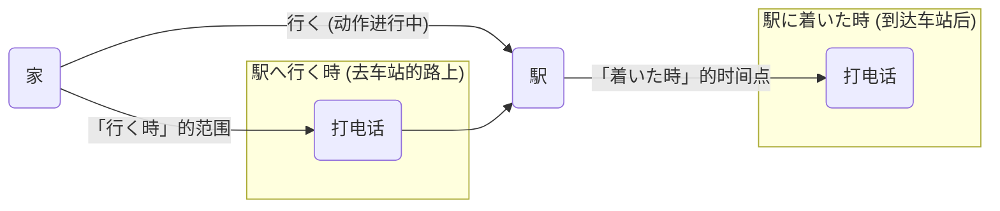

## 第四章：「雨停之后，彩虹之前」—— 时间顺序的连接

为期三天的箱根之旅，日程已经初步敲定，但摆在大家面前的，还只是一份罗列着时间点和地点的清单。

「9:00 <ruby>新宿駅<rt>しんじゅくえき</rt></ruby> <ruby>集合<rt>しゅうごう</rt></ruby>」  
「9:30 <ruby>電車<rt>でんしゃ</rt></ruby> <ruby>出発<rt>しゅっぱつ</rt></ruby>」  
「11:00 <ruby>箱根湯本<rt>はこねゆもと</rt></ruby> <ruby>到着<rt>とうちゃく</rt></ruby>」  
「11:30 <ruby>昼<rt>ひる</rt></ruby>ご飯を<ruby>食<rt>た</rt></ruby>べる」  

凛酱看着这张清单，试着用日语将它们串联起来，但说出口的句子却像一节节断开的火车车厢：“<ruby>私<rt>わたし</rt></ruby>たちは<ruby>朝<rt>あさ</rt></ruby>ご<ruby>飯<rt>はん</rt></ruby>を<ruby>食<rt>た</rt></ruby>べます。<ruby>駅<rt>えき</rt></ruby>へ<ruby>行<rt>い</rt></ruby>きます。”（我们吃早饭。我们去车站。）虽然语法没错，但听起来生硬无比，完全没有旅行计划的流畅感。

“凛酱，你发现了日语的另一个秘密了呢，”小悠笑着指了指那份清单，“单个的句子就像一颗颗独立的珍珠，而我们现在要做的，就是把它们串成一条美丽项链的‘线’。”

“连接时间的线吗？”凛酱问。

“没错！比如，要表达‘做完A，再做B’，我们就需要一根叫做‘～**てから**’的魔法线。”小悠拿起笔，在“<ruby>昼<rt>ひる</rt></ruby>ご飯を<ruby>食<rt>た</rt></ruby>べる”后面画了个圈，“动词的て形，我们之前接触过，它本身就有连接动作的功能。而在它后面加上‘から’，就特别强调了‘A动作彻底结束之后’这个时间点。”

美穗在笔记本上打出清晰的结构，展示给凛酱看。

**Aてから、B**
（A动作完成后，再做B动作）

> <ruby>昼<rt>ひる</rt></ruby>ご<ruby>飯<rt>はん</rt></ruby>を**<ruby>食<rt>た</rt></ruby>べてから**、お<ruby>土産<rt>みやげ</rt></ruby>を<ruby>買<rt>か</rt></ruby>いに<ruby>行<rt>い</rt></ruby>きましょう。
> (吃完午饭后，我们去买特产吧。)

“‘**てから**’就像是多米诺骨牌，”美穗解释道，“第一块牌必须完全倒下，才能推倒第二块。它强调的是动作的先后顺序和完成性。”

“那如果我想说‘做A之前，要做B’呢？”凛酱立刻想到了反向的情况，“比如，‘出门之前，要检查天气’。”

“这个问题就需要另一根线了，叫做‘～**<ruby>前<rt>まえ</rt></ruby>に**’。”希子接口道，她的讲解总是直击要害，“这个很简单，前面直接接动词的原形。”

**A前に、B**
（做A之前，先做B）

> <ruby>ホテル<rt>ほてる</rt></ruby>を**<ruby>出<rt>で</rt></ruby>る<ruby>前<rt>まえ</rt></ruby>に**、<ruby>忘<rt>わす</rt></ruby>れ<ruby>物<rt>もの</rt></ruby>がないかチェックします。
> (在离开酒店前，检查一下有没有忘东西。)

“哦！‘**てから**’前面是て形，‘**<ruby>前<rt>まえ</rt></ruby>に**’前面是原形！”凛酱找到了关键的区别。

“还有一个词，‘～**<ruby>後<rt>あと</rt></ruby>で**’，也表示‘之后’，它和‘**てから**’有什么不同呢？”美穗提出了一个进阶问题。

小悠想了想，说：“我觉得，‘**てから**’更像两个人手拉着手，一个紧跟着另一个。而‘**<ruby>後<rt>あと</rt></ruby>で**’呢，感觉中间可以隔得更久一点，关系没那么紧密。而且，‘**<ruby>後<rt>あと</rt></ruby>で**’更灵活，它不仅能接在‘动词た形’后面，还能接在‘名词 + の’后面。”

美穗点点头，补充了两个例子：

> <ruby>映画<rt>えいが</rt></ruby>を**<ruby>見<rt>み</rt></ruby>た<ruby>後<rt>あと</rt></ruby>で**、カフェでお<ruby>茶<rt>ちゃ</rt></ruby>をしました。
> (看完电影后，我们在咖啡馆喝了茶。)

> <ruby>食事<rt>しょくじ</rt></ruby>の**<ruby>後<rt>あと</rt></ruby>で**、この<ruby>薬<rt>くすり</rt></ruby>を<ruby>飲<rt>の</rt></ruby>んでください。
> (饭后请服用这个药。)

“你看，‘**<ruby>食事<rt>しょくじ</rt></ruby>の<ruby>後<rt>あと</rt></ruby>で**’就非常常用，但我们不能说‘<ruby>食事<rt>しょくじ</rt></ruby>のから’。”

“最容易混淆的，其实是‘～**<ruby>時<rt>とき</rt></ruby>**’。”希子表情严肃起来，“这个词看起来简单，但它前面的动词形态，是决定你能不能准时赴约的关键。”

她讲起了自己的一次“惨痛”经历：“上周我和朋友约在车站见面。我给她发消息说：‘<ruby>駅<rt>えき</rt></ruby>へ**<ruby>行<rt>い</rt></ruby>く<ruby>時<rt>とき</rt></ruby>**、<ruby>電話<rt>でんわ</rt></ruby>するね。’（去车站的时候，我给你打电话。）”

“结果呢？”凛酱好奇地问。

“结果她以为我会在‘从家里出发之前’给她打电话，就在家一直等。而我呢，是在‘去车站的路上’给她打的。我们因此完美错过了。”

美穗在屏幕上画出了一条时间轴，清晰地展示了这个问题的核心。

**图1：`～時` 的时间轴**

“看这个图，”美穗解释道，“动词原形 + ‘**<ruby>時<rt>とき</rt></ruby>**’，比如‘**<ruby>行<rt>い</rt></ruby>く<ruby>時<rt>とき</rt></ruby>**’，指的是‘去’这个动作正在发生的整个过程。而动词た形 + ‘**<ruby>時<rt>とき</rt></ruby>**’，比如‘**<ruby>着<rt>つ</rt></ruby>いた<ruby>時<rt>とき</rt></ruby>**’，指的是‘到达’这个动作已经完成的那个时间点。”

“所以，”希子总结道，“我当时如果想表达‘到了之后再联系’，就应该说‘<ruby>駅<rt>えき</rt></ruby>に**<ruby>着<rt>つ</rt></ruby>いた<ruby>時<rt>とき</rt></ruby>**、<ruby>電話<rt>でんわ</rt></ruby>するね’。”

凛酱恍然大悟，这一个小小的形态差别，意思竟然差了这么多。

“好了，理论讲完了。我们来听一段录音，检验一下学习成果。”美穗打开了电脑里的一个音频文件，这是她拜托一位日本朋友录制的。

**【听力练习脚本】**

“<ruby>私<rt>わたし</rt></ruby>の<ruby>昨日<rt>きのう</rt></ruby>の<ruby>一日<rt>いちにち</rt></ruby>について<ruby>話<rt>はな</rt></ruby>します。<ruby>朝<rt>あさ</rt></ruby>、<ruby>家<rt>いえ</rt></ruby>を**<ruby>出<rt>で</rt></ruby>る<ruby>前<rt>まえ</rt></ruby>に**、シャワーを<ruby>浴<rt>あ</rt></ruby>びました。それから、<ruby>大学<rt>だいがく</rt></ruby>へ**<ruby>行<rt>い</rt></ruby>く<ruby>時<rt>とき</rt></ruby>**、コンビニでパンを<ruby>買<rt>か</rt></ruby>いました。<ruby>授業<rt>じゅぎょう</rt></ruby>が**<ruby>終<rt>お</rt></ruby>わってから**、<ruby>友達<rt>ともだち</rt></ruby>と<ruby>図書館<rt>としょかん</rt></ruby>で<ruby>勉強<rt>べんきょう</rt></ruby>しました。<ruby>家<rt>いえ</rt></ruby>に**<ruby>帰<rt>かえ</rt></ruby>った<ruby>時<rt>とき</rt></ruby>**、<ruby>母<rt>はは</rt></ruby>はもう<ruby>晩<rt>ばん</rt></ruby>ご<ruby>飯<rt>はん</rt></ruby>を<ruby>作<rt>つく</rt></ruby>っていました。”

**听力问题：**
1.  说话人是什么时候买面包的？
2.  “学习”和“课程结束”哪个先发生？

凛酱仔细地听着，在笔记本上飞快地记下关键词。

“第一个问题，是在‘<ruby>大学<rt>だいがく</rt></ruby>へ**<ruby>行<rt>い</rt></ruby>く<ruby>時<rt>とき</rt></ruby>**’，也就是去大学的路上买的。”
“第二个问题，是‘<ruby>授業<rt>じゅぎょう</rt></ruby>が**<ruby>終<rt>お</rt></ruby>わってから**’才学习，所以是课程结束先发生。”

“完全正确！”大家为凛酱鼓掌。

现在，她们重新审视那份箱根旅行的日程清单。凛酱拿起笔，自信地将那些零散的条目串联成了一段流畅的计划：

「<ruby>朝<rt>あさ</rt></ruby>9<ruby>時<rt>じ</rt></ruby>に<ruby>新宿駅<rt>しんじゅくえき</rt></ruby>に<ruby>集<rt>あつ</rt></ruby>まります。でも、**<ruby>集<rt>あつ</rt></ruby>まる<ruby>前<rt>まえ</rt></ruby>に**、みんなで<ruby>朝<rt>あさ</rt></ruby>ご<ruby>飯<rt>はん</rt></ruby>を<ruby>食<rt>た</rt></ruby>べましょう。<ruby>朝<rt>あさ</rt></ruby>ご<ruby>飯<rt>はん</rt></ruby>を**<ruby>食<rt>た</rt></ruby>べてから**、<ruby>駅<rt>えき</rt></ruby>のホームへ<ruby>行<rt>い</rt></ruby>きます。<ruby>箱根湯本<rt>はこねゆもと</rt></ruby>に**<ruby>着<rt>つ</rt></ruby>いた<ruby>時<rt>とき</rt></ruby>**、きっとお<ruby>腹<rt>なか</rt></ruby>がすいていますから、すぐ<ruby>昼<rt>ひる</rt></ruby>ご<ruby>飯<rt>はん</rt></ruby>の<ruby>場所<rt>ばしょ</rt></ruby>を<ruby>探<rt>さが</rt></ruby>しましょう！」
(早上9点在新宿站集合。不过，在集合前，我们先一起吃早饭吧。吃完早饭后，再去车站站台。到达箱根汤本的时候，肚子肯定饿了，所以我们马上找吃午饭的地方吧！)

看着这段由自己亲手写下的、充满逻辑和生活气息的计划，凛酱的脸上露出了满足的笑容。那些曾经断裂的时间点，现在被语言的丝线温柔地连接在了一起，编织成了一幅令人期待的旅途画卷。

---

### **核心语法总结：时间顺序的连接**

> 本章核心是日语中用于连接动作、表示时间先后顺序的四种基本句型：**`～てから`** (……之后)、**`～前に`** (……之前)、**`～後で`** (……之后)，以及描述动作发生时间的 **`～時`** (……的时候)。掌握它们，是让简单的句子串联成具有逻辑和故事性的段落的第一步。

#### 今日关键词

*   **～てから (te kara)**：强调前一个动作**完全结束后**，后一个动作才开始。连接最为紧密。前面接动词て形。
*   **～前に (mae ni)**：表示在某个基准动作**发生之前**，进行另一个动作。前面接动词原形或“名词+の”。
*   **～後で (ato de)**：同样表示“……之后”，但与`～てから`相比，前后动作的连接没那么紧密，间隔时间可能更长。前面可接动词た形或“名词+の”。
*   **～時 (toki)**：表示“……的时候”。关键在于其前面的动词形态：**原形+時**表示动作正在进行中；**た形+時**表示动作已经完成。

#### 结构图

**`～時` 前动词形态的意义区别**

| 动词形态 + 時 | 时间点/区间 | 含义 | 示例 |
| :--- | :--- | :--- | :--- |
| **动词原形 + 時** | 动作发生的过程中 | “正要去/做…的时候” | <ruby>日本<rt>にほん</rt></ruby>へ**<ruby>行<rt>い</rt></ruby>く<ruby>時<rt>とき</rt></ruby>**、カメラを<ruby>買<rt>か</rt></ruby>いました。 (去日本之前/路上，买了相机) |
| **动词た形 + 時** | 动作完成的那个时点 | “已经到了/做了…的时候” | <ruby>日本<rt>にほん</rt></ruby>へ**<ruby>行<rt>い</rt></ruby>った<ruby>時<rt>とき</rt></ruby>**、カメラを<ruby>買<rt>か</rt></ruby>いました。 (到了日本之后，买了相机) |

#### 用法差异与语感

- **てから vs. 後で**：  

`てから`更强调“一……就……”，是流程中的一步。`後で`更宽泛，可以是“等会儿”、“回头再说”。  

例如，仕事が終わってから飲みに行こう (工作一结束就去喝一杯)，流程感强。`仕事の後で`则可能是指下班后任何时间。

- **`前に`的时间点**：

`1時間前に` (1小时前)，可以与具体时间段连用。

#### 反模式与陷阱

1.  **`前に`前的动词形态错误**：最常见的错误是把`前に`前面接了た形。  
修复：强制记忆“`前に`永接原形”。
2.  **混淆`行く時`和`行った時`**：这是N4听力考试的高频陷阱。  
修复：通过时间轴图像来记忆，将“原形=进行中”、“た形=已完成”刻在脑中。
3.  **滥用`てから`**：在前后关联不大的两个独立事件间也用`てから`，会显得啰嗦。  
修复：如果只是单纯陈述两件事，直接用两个句子分开说更自然。

#### 推荐练习题目

**基础入门（必做，5 题）**
1.  **选择填空**：<ruby>国<rt>くに</rt></ruby>へ（______）<ruby>時<rt>とき</rt></ruby>、<ruby>家族<rt>かぞく</rt></ruby>へのお<ruby>土産<rt>みやげ</rt></ruby>を<ruby>買<rt>か</rt></ruby>いました。(a) <ruby>帰<rt>かえ</rt></ruby>る (b) <ruby>帰<rt>かえ</rt></ruby>った (c) <ruby>帰<rt>かえ</rt></ruby>って) (含义是：回到家乡后买的)
2.  **选择填空**：<ruby>寝<rt>ね</rt></ruby>る（______）、<ruby>必<rt>かなら</rt></ruby>ず<ruby>歯<rt>は</rt></ruby>をみがきます。(a) <ruby>前<rt>まえ</rt></ruby>に (b) <ruby>後<rt>あと</rt></ruby>で (c) てから
3.  **句型连接**：请用`～てから`连接句子：① <ruby>手<rt>て</rt></ruby>を<ruby>洗<rt>あら</rt></ruby>います。② ご<ruby>飯<rt>はん</rt></ruby>を<ruby>食<rt>た</rt></ruby>べます。
4.  **改错**：<ruby>映画<rt>えいが</rt></ruby>を<ruby>見<rt>み</rt></ruby>るてから、<ruby>食事<rt>しょくじ</rt></ruby>をしました。
5.  **完成句子**：<ruby>日本<rt>にほん</rt></ruby>へ<ruby>来<rt>く</rt></ruby>る<ruby>前<rt>まえ</rt></ruby>に、_________________。 (请根据自己情况填空)

**进阶推荐（3 题）**
1.  **情景表达**：描述你早晨从起床到出门的三个连续动作，请用上`～てから`。
2.  **语感辨析**：请解释下面两个句子语感上的不同：① <ruby>子<rt>こ</rt></ruby>どもの<ruby>時<rt>とき</rt></ruby>、よく<ruby>川<rt>かわ</rt></ruby>で<ruby>泳<rt>およ</rt></ruby>ぎました。 ② <ruby>子<rt>こ</rt></ruby>どもがいた<ruby>時<rt>とき</rt></ruby>、よく<ruby>公園<rt>こうえん</rt></ruby>へ<ruby>行<rt>い</rt></ruby>きました。
3.  **翻译**：请将“开会前，请把资料复印好”翻译成日语。

**应试高频（JLPT N4水平，2 题）**
1.  **语法选择**：このボタンを（______）から、あちらのレバーを<ruby>上<rt>あ</rt></ruby>げてください。(a) <ruby>押<rt>お</rt></ruby>す (b) <ruby>押<rt>お</rt></ruby>した (c) <ruby>押<rt>お</rt></ruby>して
2.  **句子排序**：＿＿＿　＿＿＿　＿＿＿　＿＿＿<ruby>電話<rt>でんわ</rt></ruby>をください。(1. <ruby>駅<rt>えき</rt></ruby>に 2. <ruby>時<rt>とき</rt></ruby> 3. <ruby>着<rt>つ</rt></ruby>いた 4. <ruby>だいたい</rt></ruby>) [AI思考: 选项4 `だいたい` 意为大概，放在这里逻辑不通。N4水平更可能是考 `着く` 和 `着いた` 的区别。假设选项4为 `もうすぐ` (马上)。]

#### 参考答案要点

1.  **基础题1**：选b。`帰った時`表示“回到家乡之后”的那个时间点。
2.  **基础题2**：选a。`寝る前に`表示“睡觉之前”。
3.  **基础题3**：<ruby>手<rt>て</rt></ruby>を<ruby>洗<rt>あら</rt></ruby>ってから、ご<ruby>飯<rt>はん</rt></ruby>を<ruby>食<rt>た</rt></ruby>べます。
4.  **基础题4**：～てから`前应为て形，`見る`的て形是`見て`。改为`<ruby>映画<rt>えいが</rt></ruby>を<ruby>見<rt>み</rt></ruby>てから、...。
5.  **基础题5**：(开放答案) 例：<ruby>日本語<rt>にほんご</rt></ruby>を<ruby>勉強<rt>べんきょう</rt></ruby>しました。
6.  **进阶题2**：①是名词+の+時，指“童年那个时期”。②是动词た形+時，指“有了孩子之后的那段时期”。
7.  **应试题1**：选c。`～てから`前接动词て形。
8.  **应试题2**：(使用假定选项 `もうすぐ` ) 正确顺序为 `4-1-3-2` (如果选项是 `着く` ) 或 `1-3-2` (如果不用 `もうすぐ` )。更合理的N4排序题应为：`駅に` `着いたら` `電話を` `ください`。基于原题，最佳逻辑是 `1-3-2`，句子为<ruby>駅<rt>えき</rt></ruby>に<ruby>着<rt>つ</rt></ruby>いた<ruby>時<rt>とき</rt></ruby>、<ruby>電話<rt>でんわ</rt></ruby>をください。 (到车站的时候，请给我打电话)。选项4`だいたい`非常奇怪，可能是印刷错误。

### 🍒 凛酱的日语小记

今天我们把旅行计划变成了一个有先后顺序的“故事”！学会了`てから`、`前に`和`時`，感觉自己终于能把事情说清楚了。特别是`行く時`和`行った時`的区别，希子前辈的经历让我一下子就记住了！用语言把时间串起来的感觉真好，我们的箱根之旅越来越清晰了！

> 雨停之后（雨がやんでから），才有彩虹（虹が出る）。万物之前（何事もする前に），皆有准备。语言的学习也是这样，将一个个瞬间（時）连接起来，才能看到完整的风景。
