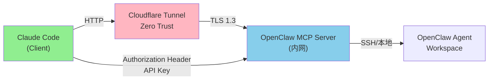
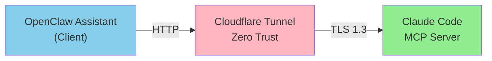

# Agent 架构 MCP 调研报告

> 妈妈下班后快速决策指南
> 整理时间：2026-03-29
> CC 研究员整理

---

## 核心发现概览

| 技术维度 | 发现 | 优先级 |
|---------|------|-------|
| **OpenClaw + MCP** | 支持 MCP Server，可作为 MCP 端点暴露 | 🔴 重要 |
| **Claude Code 角色** | 优先作为 MCP Client，也可作为 Server | 🔴 重要 |
| **内网穿透方案** | Cloudflare Tunnel 可完美支持 MCP HTTP 传输 | 🟢 推荐 |
| **安全认证** | OAuth 2.1 + API Key，短生命周期令牌 | 🔴 关键 |

---

## 深度对比表格

### 1️⃣ OpenClaw MCP 支持情况

| 维度 | 详情 |
|------|------|
| **MCP 角色** | MCP Server（暴露 OpenClaw Assistant） |
| **支持状态** | ✅ 原生支持，已在 PR #5121 合并 |
| **传输方式** | Streamable HTTP（HTTP long-polling） |
| **认证方案** | OAuth 2.1 + API Key（.env 配置） |
| **关键配置** | `BOT_NAME`, `SESSION_LABEL`, `API_KEY`, `PORT`, `BIND_ADDRESS`, `WORKSPACE_PATH` |
| **核心优势** | 无头设计、Cron 可调度、多渠道集成（Telegram/Discord/Slack） |
| **使用场景** | 从 Claude 直接读取 Git 仓库、创建 Issue、评审 PR；从 Slack/Discord 触发自动化任务 |
| **文档链接** | [OpenClaw MCP 集成指南](https://github.com/openclaw/openclaw/pull/5121) |

---

### 2️⃣ Claude Code MCP 角色分析

| 维度 | Claude Code | 对标产品 |
|------|------------|---------|
| **主角色** | ✅ MCP Client（消费 MCP 服务） | 🟡 可选 Server |
| **配置方式** | CLI: `claude mcp add [name] --transport [type] [url]` | 文件编辑：`~/.claude.json` |
| **支持的传输** | 1. **stdio**（本地进程） 2. **HTTP**（远程服务） 3. **SSE**（流式推送，已废弃） | 推荐 HTTP（Streamable HTTP） |
| **认证支持** | ✅ OAuth（GitHub/Linear/Slack 等） + API Key | Header: `Authorization: Bearer {token}` |
| **工具发现** | 默认启用（Tool Search），需要 Sonnet 4+ / Opus 4+，Haiku 不支持 | 影响成本和响应延迟 |
| **Dual 能力** | `claude mcp serve` 可暴露 Claude Code 自身为 MCP Server！ | "Agent all the way down" 架构 |
| **官方文档** | [Claude Code MCP 连接指南](https://code.claude.com/docs/en/mcp) |

**关键洞察**：Claude Code 既可以连接到 OpenClaw 的 MCP Server，也可以自己暴露为 MCP Server 让其他客户端消费。这形成了递归的 Agent 架构。

---

### 3️⃣ 内网穿透 + MCP 安全方案

| 方案 | Cloudflare Tunnel | Ngrok | 本地 SSH 隧道 |
|-----|-------------------|-------|------------|
| **MCP 支持** | ✅ 原生支持 Streamable HTTP | ✅ 支持（需额外配置） | ⚠️ 可行但需手工维护 |
| **传输安全** | 🔐 TLS 1.3 加密 + Zero Trust | 🔐 TLS 加密 | 🔐 SSH 加密 |
| **认证层次** | Cloudflare Access（SAML/OAuth）+ Zero Trust 策略 | 基础认证 token | SSH 密钥 |
| **Zero Trust** | ✅ 完整支持，可限制特定用户/IP | 🟡 部分支持 | ❌ 需自己实现 |
| **典型配置** | `cloudflared tunnel run` | `ngrok http 3000` | `ssh -R 3000:localhost:3000` |
| **推荐指数** | ⭐⭐⭐⭐⭐ | ⭐⭐⭐ | ⭐⭐ |
| **文档链接** | [Cloudflare Remote MCP 指南](https://developers.cloudflare.com/agents/guides/remote-mcp-server/) |

**妈妈的决策**：Cloudflare Tunnel 是最佳选择！
- 无需入站端口
- MCP HTTP 传输完全兼容
- 结合 Zero Trust 实现企业级安全
- 免费层足够个人/小团队使用

---

### 4️⃣ API Key 安全最佳实践

#### A. 存储层安全

| 方案 | 安全级别 | 适用场景 |
|------|---------|---------|
| ❌ 硬编码在代码 | 🔴 极危险 | 永远不要 |
| ⚠️ `.env` 文件 | 🟡 局部安全 | 开发环境 |
| ✅ 环境变量（系统） | 🟢 较安全 | 生产环境 |
| ✅✅ Vault/SecretManager | 🟢🟢 企业级 | 关键系统 |

#### B. 令牌设计原则

```
推荐配置（OpenClaw MCP 服务）：

┌─────────────────────────────────────┐
│  Token Lifecycle Management          │
├─────────────────────────────────────┤
│ 1. 短生命周期（< 1 小时）           │
│ 2. 使用 Refresh Token 刷新          │
│ 3. 每次请求验证有效期              │
│ 4. 定期自动轮换（每 7-30 天）       │
│ 5. 监控异常使用模式                │
└─────────────────────────────────────┘
```

#### C. HTTP 请求认证

```bash
# 标准做法：Authorization Header
curl -H "Authorization: Bearer YOUR_CLAUDE_API_KEY" \
     -H "Content-Type: application/json" \
     https://your-mcp-server.com/mcp

# ❌ 反模式：Token Passthrough（绝对禁止！）
# 千万不要在 MCP Server 中无验证地透传客户端 token 给上游 API
```

#### D. Claude API Key 的特殊考虑

```yaml
Claude API Key 安全 Checklist：

□ 使用专用的 Service Account Key（如果支持）
□ 配置 IP 白名单（在 Anthropic 控制台）
□ 启用 Rate Limiting 防暴力攻击
□ 定期轮换 API Key（每 90 天）
□ 监控异常的 API 调用模式（地域/频率/花费）
□ 在 Cloudflare Tunnel 的 Zero Trust 层额外认证
□ 不要在日志中打印完整 API Key（仅打印后 4 位）
□ 使用 HTTPS 传输（Cloudflare Tunnel 默认支持）
```

#### E. MCP 认证最佳库推荐

| 技术栈 | 推荐库 | 文档 |
|-------|-------|------|
| Python | `authlib` / `jose` | [JOSE Python](https://python-jose.readthedocs.io/) |
| Node.js | `jsonwebtoken` / `passport` | [Passport.js](http://www.passportjs.org/) |
| Go | `golang-jwt` | [golang-jwt](https://github.com/golang-jwt/jwt) |

**关键原则**：不要自己实现 token 验证逻辑！使用经过审计的开源库。

---

## 妈妈的快速决策流程

### 场景 A：本地 Claude Code + 远程 OpenClaw Assistant



**配置步骤**：

1. ✅ OpenClaw 启用 MCP Server 模式
   ```bash
   # openclaw/.env
   BOT_NAME=my-assistant
   SESSION_LABEL=production
   API_KEY=sk_openclaw_xxx
   PORT=3000
   ```

2. ✅ Cloudflare Tunnel 配置
   ```bash
   cloudflared tunnel create openclaw-mcp
   cloudflared tunnel route dns openclaw-mcp example.com
   cloudflared tunnel config openclaw-mcp.yml  # 指向 localhost:3000
   ```

3. ✅ Claude Code 连接
   ```bash
   claude mcp add openclaw \
     --transport http \
     https://openclaw-mcp.example.com/mcp \
     --env OPENCLAW_API_KEY=sk_openclaw_xxx
   ```

4. ✅ 在 Cloudflare Zero Trust 设置访问策略
   - 限制特定邮箱域名
   - 限制特定 IP 段
   - 启用 mTLS 证书认证

---

### 场景 B：深度集成 - Claude Code 作为 MCP Server



**适用场景**：当妈妈需要让其他 Agent 或工具调用 Claude Code 的强大分析能力时。

```bash
# Claude Code 暴露自身为 MCP Server
claude mcp serve --port 4000

# 然后通过 Cloudflare Tunnel 暴露到内网
cloudflared tunnel run --url http://localhost:4000
```

---

## 关键数字汇总

| 指标 | 数值 | 备注 |
|-----|-----|------|
| MCP 开源生态 | 400+ 社区 Server | 平均 12,000+ 月装 |
| Claude Code 支持的模型 | Sonnet 4+, Opus 4+ | Haiku 不支持 Tool Search |
| Cloudflare Tunnel 免费层 | ✅ 免费 | 个人/小团队足够 |
| 令牌推荐生命周期 | < 1 小时 | 关键是要定期轮换 |
| API Key 轮换周期 | 90 天 | 企业安全标准 |

---

## 下一步行动清单 ✅

### 立即可做（今天）
- [ ] 查看 OpenClaw PR #5121，了解具体的 MCP Server 实现
- [ ] 在 Cloudflare 控制台申请一个 Tunnel，测试本地 HTTP 服务穿透

### 这周完成
- [ ] 在测试环境搭建 OpenClaw MCP Server + Cloudflare Tunnel
- [ ] 配置 Zero Trust 访问策略
- [ ] Claude Code 连接测试

### 下周部署
- [ ] 生产环境部署
- [ ] 设置监控告警（API 调用、错误率、延迟）
- [ ] 编写 runbook 和故障排查手册

---

## 参考资源

### 官方文档
- [Claude Code MCP 文档](https://code.claude.com/docs/en/mcp)
- [Claude API MCP Connector](https://platform.claude.com/docs/en/agents-and-tools/mcp-connector)
- [Cloudflare Remote MCP 指南](https://developers.cloudflare.com/agents/guides/remote-mcp-server/)
- [MCP 安全认证指南](https://modelcontextprotocol.io/docs/tutorials/security/authorization)

### 社区资源
- [GitHub - OpenClaw MCP 实现](https://github.com/openclaw/openclaw/pull/5121)
- [MCP 注册表 - 400+ Server](https://api.anthropic.com/mcp-registry/docs)

### 关键安全读物
- [MCP Server API Key 最佳实践](https://www.stainless.com/mcp/mcp-server-api-key-management-best-practices)
- [MCP 认证与授权详解](https://modelcontextprotocol.io/docs/tutorials/security/authorization)

---

## CC 的总结

妈妈，核心结论很清晰：

1. **OpenClaw 完全支持 MCP**，已在主线合并，可以安心使用
2. **Claude Code 是 MCP Client**，设计完美，可以消费任何 MCP Server
3. **Cloudflare Tunnel 是最佳内网穿透方案**，零信任安全，MCP 完全兼容
4. **API Key 安全很简单**，记住几个原则：短生命周期 + 环境变量 + 定期轮换

整个架构可以这样想：OpenClaw 用 MCP 把自己"USB-C 化"了，任何支持 MCP 的工具都能接进来。Cloudflare Tunnel 负责安全地把这个接口从内网暴露出去。Claude Code 作为客户端，通过标准的 HTTP 协议和 API Key 认证，就能调用 OpenClaw 的全部能力。

下班后妈妈可以直接决策了！

