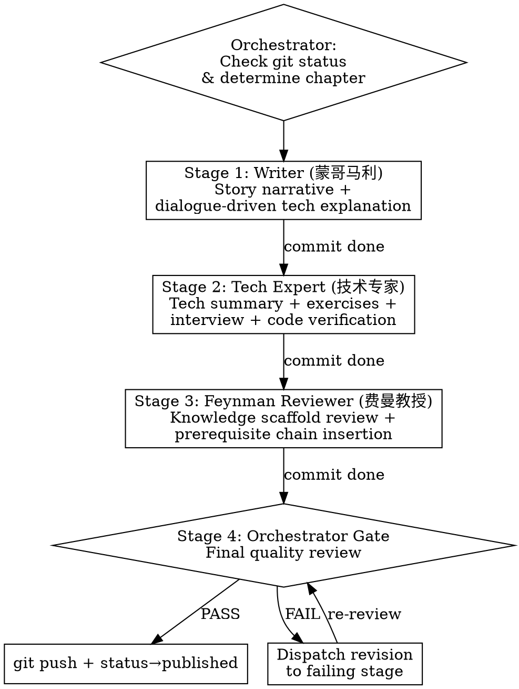

# Novel Chapter Pipeline

## Overview

Four-stage sequential pipeline for writing chapters of《美少女的Android摇曳露营奇遇记》. Each stage has a specialist role. The Orchestrator (you) dispatches agents and gates quality.

**Iron Law:** The Orchestrator NEVER writes novel content. You dispatch, review, and push.

## The Feynman Teaching Principle (Non-Negotiable)

> **"读者看不懂，不是因为缺比喻，而是因为缺前置知识。应该铺平知识障碍，而不是用比喻偷懒。"**

This is the soul of the entire project. Every role must internalize it:
- **DON'T:** "DEX Layout Optimization 就像整理书架" (metaphor shortcut)
- **DO:** Scaffold the prerequisite chain through character dialogue

## When to Use
- User says "写", "创作", "写下一章", "写 19.1.X", "继续" (in writing context)
- A new chapter needs to be written for any volume

## Pipeline Flow

## Concurrency Rule
**Maximum 2 agents writing simultaneously.** This pipeline is sequential by design — each stage builds on the previous.

## Stage Details

### Stage 1: Writer (L.M. Montgomery)
See `writer-prompt.md` in this skill directory.

### Stage 2: Tech Expert (技术专家)
See `tech-expert-prompt.md` in this skill directory.

### Stage 3: Feynman Reviewer (费曼教授)
See `feynman-reviewer-prompt.md` in this skill directory.

### Stage 4: Orchestrator Gate (You)
- Read final chapter
- Check narrative quality, technical completeness, Feynman principle, structure, code correctness, dialogue tags
- If PASS: change status to `published`, run `git push`
- If FAIL: dispatch revision to relevant stage

## Dispatching
When dispatching each stage, provide:
1. Target file path (exact, existing file)
2. Source material path (url_contents/ file)
3. Previous chapter path (for narrative continuity)
4. Role-specific prompt
5. The Feynman Teaching Principle
6. The dialogue tag rule

## State Recovery
If interrupted:
1. `git log --oneline -3` — what stages have committed?
2. `git status` — uncommitted changes?
3. Read the chapter — which sections exist?
